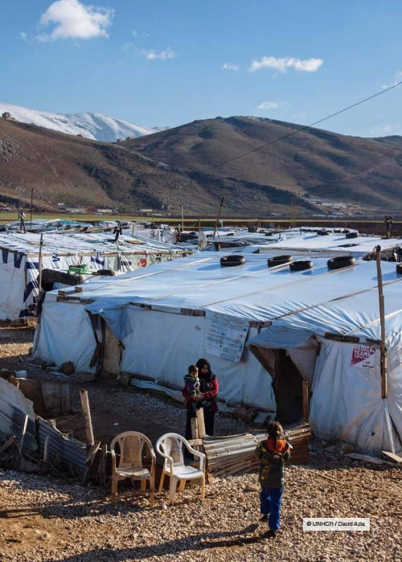
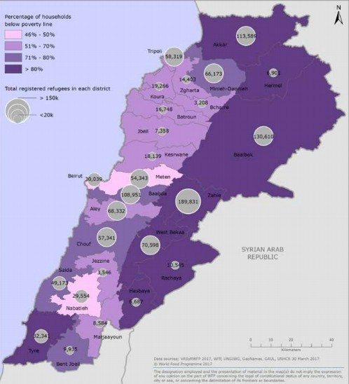
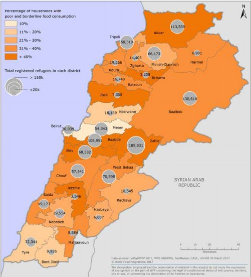
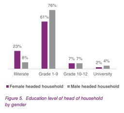
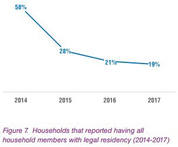
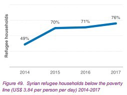
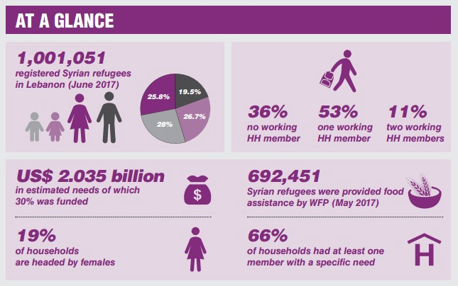
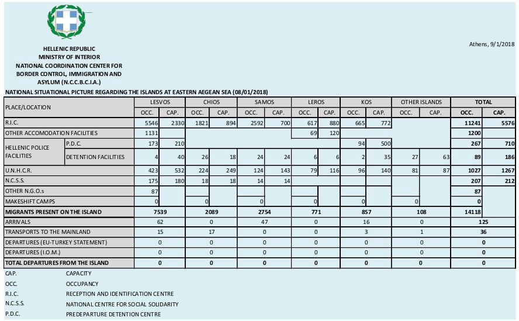
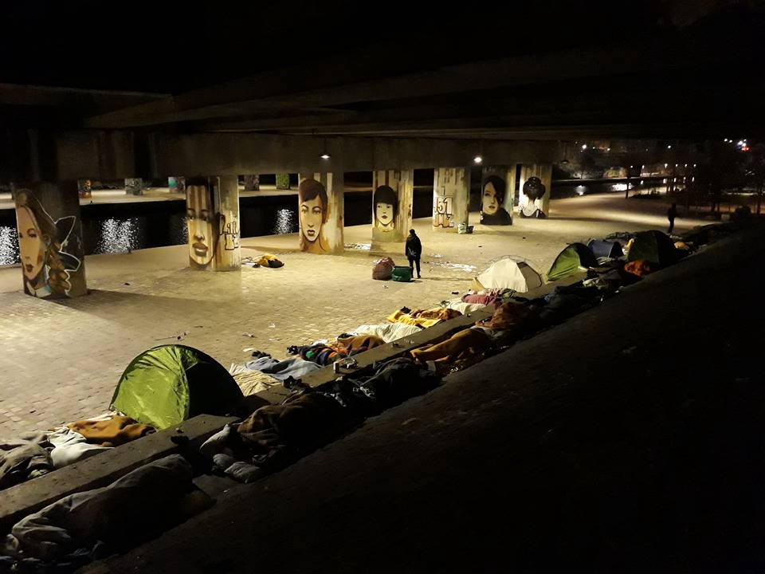

### AYS Daily Digest 09/01/2018: Syrian refugees in Lebanon are poorer and more vulnerable than ever

Aid delivery in Rukban camp /// 116 people already dead or missing in the Mediterranean in 2018 /// Illegal detention of a Turkish soldier denounced in Greece /// 21 people charged for 2016 Harmanli camp riots in Bulgaria /// Family Reunification to be resumed in March 2018 in Germany /// Another death in Calais /// Proposals to speed up deportations to Iraq from EU Commission

from: Vulernability assessment of Syrian refugees in Lebanon \(VASyR 2017\)
#### FEATURE

UNHCR spokesperson for Lebanon, William Spindler, told the press the results of the annual Vulnerability Assessment of Syrian Refugees \(VASyR\), held by UNHCR, UNICEF and WFP\.

It reveals that 58 per cent of households are now living in extreme poverty — on less than US$2\.87 per person per day\. This is some 5 per cent more than a year ago\. And the number of households living below the overall poverty line — less than US $3\.84 per day — has also continued to rise\. 76 per cent of refugee households are living below this level\.

from: Vulernability assessment of Syrian refugees in Lebanon \(VASyR 2017\)

Borrowing money for food, to cover health expenses and pay rent continues to be extremely common, with almost nine out of every 10 refugees saying they are in debt\. This underlines the vulnerabilities facing most Syrian refugees in Lebanon\.

from: Vulernability assessment of Syrian refugees in Lebanon \(VASyR 2017\)

Food insecurity also remains critically high — affecting 91 per cent of households to some degree\. But vulnerabilities are also growing elsewhere\. Obtaining legal residency continues to be a challenge, leaving refugees exposed to an increased risk of arrest, hindering their ability to register their marriages and making it more difficult for them to find daily labour, send their children to school or access health care\.

Only 19 per cent of families reported that all members had legal residency, down from 21 per cent in 2016\. More alarmingly, the share of households where no one has legal residency has increased considerably\. Overall, 74 per cent of surveyed Syrian refugees aged 15 and above do not have legal residency in Lebanon\.

The survey also revealed that only 17 per cent of refugee parents managed to complete all the steps of the birth registration process for their children\.

from: Vulernability assessment of Syrian refugees in Lebanon \(VASyR 2017\)

The survey revealed the vulnerability of households headed by women across all indicators\. As in previous years, for nearly every indicator of vulnerability, female\-headed households fared worse than their male counterparts\. Female\-headed households were less food secure, had worse diets, adopted severe coping strategies more often and had higher poverty levels\. Female\-headed households are almost twice as likely as male\-headed households to live in informal settlements, and were less likely to have legal residency\.

Taken as a whole, the survey results paint an alarming picture of the growing vulnerabilities facing Syrian refugees in Lebanon, more reliant than ever on humanitarian aid — with more than two\-thirds saying they had relied on some form of assistance in the previous three months\.

External funding is insufficient to keep up with the growing needs; In 2017, only 36 per cent of the total funding promised and needed to provide adequate humanitarian support in Lebanon was received, as of the beginning of December\.

A further US$2\.7 billion is needed to meet needs in 2018, under the Lebanon Crisis Response Plan\.

from: Vulernability assessment of Syrian refugees in Lebanon \(VASyR 2017\)

Download and read the full report [here](http://www.unhcr.org/news/briefing/2018/1/5a548d174/survey-finds-syrian-refugees-lebanon-poorer-vulnerable-2017.html?query=vasyr) \.

**Jordan**
#### AID DELIVERY IN RUKBAN CAMP

Media [report](https://www.aljazeera.com/news/2018/01/jordan-aid-drop-rukban-border-camp-180108200401410.html) that Jordan authorities have allowed a one\-off delivery of UN humanitarian aid to the remote Rukban refugee camp, on the border with Syria\. The camp is home to at least 55,000 refugees and received food and other essential items by crane lift on Monday\.

Since the country closed its border with Syria in June 2016, living conditions in the camp worsened as Jordan government repeatedly refused to take any responsibility for the camp, insisting the aid must come from the Syrian side\.

This move limited the actions of many humanitarian agencies and groups, that raised concerns about the condition in the camp, where several people suffer malnutrition\. This aid drop came after a request from the UN and months of talks with the Jordan authorities\.

Within the nonsensical and criminal approach of government towards refugees, the use of a crane to drop the aid in the informal settlement allows Jordan to maintain its position of non\-responsibility as it has not had direct contact with the camp\.

By using a crane to drop the aid onto the informal settlement, Jordan can continue to maintain this position as it has not had direct contact with the camp or its inhabitants\.

Jordan is concerned that there may be ISIL sleeper cells within Rukban camp\.

An estimated 1\.5 million Syrians have fled to Jordan since the beginning of the [civil war](http://www.aljazeera.com/news/2016/05/syria-civil-war-explained-160505084119966.html) in 2011\.

**Turkey**
#### SOCIAL CENTER KAPILAR IN IZMIR NEEDS FINANCIAL SUPPORT\!

From [Harek Act border monitoring](http://harekact.bordermonitoring.eu/2018/01/08/social-center-kapilar-in-izmir-needs-financial-support/) :

[Kapılar](https://www.facebook.com/izmirkapilar/?ref=br_rs) is a unique community hub in the heart of the Basmane district in Izmir, Turkey\. They created a bustling social centre where people meet and organise to make friends and share skills and knowledge\. But, to continue working they need your help\. [Click here to proceed to the Fundraising page](https://www.youcaring.com/kapilar-1025228) \.

> “We will soon celebrate Kapılar’s second birthday\! With two years under our belt, we have already established ourselves as a major focal point for locals seeking community and solidarity\. We have organised language classes for over 100 people, literacy programs for Syrian teenagers and women, community kitchen events for those coming from near and far, and weekly football matches for Syrian child\- and teenage\-workers\. We have hosted film screenings, puppet shows for children as part of Izmir’s International Puppet Festival, concerts, workshops and trainings on refugee rights, children rights and other educational activities for our members\.” 

**Sea**
#### **116** PEOPLE NOW DEAD OR MISSING IN THE MEDITERRANEAN IN 2018

After the two reports over the weekend of [the loss of 66 people](http://www.rp-online.de/panorama/ausland/mittelmeer-mindestens-66-tote-bei-schiffbruechen-aid-1.7307334) , the Libyan Coast Guard now report the loss of another 50 \(09/01/18\) \.

The Libyan Coast Guard has also rescued several boats — [279 on Tuesday](https://twitter.com/lyobserver/status/950831713550290945) alone and [700 in total](http://www.repubblica.it/esteri/2018/01/09/news/migranti_nuovo_naufragio_nelle_acque_della_libia_cinquanta_sono_annegati_-186168878/) over the last few days\. Although people have many questions regarding what the future of those ‘rescued’ will be\.

■■■■■■■■■■■■■■ 
> **[Jeff Crisp](https://twitter.com/JFCrisp) @ Twitter Says:** 

> > Can anyone answer?
1. Are all people intercepted at sea by the Libyan coastguard placed in detention?
2. Is UNHCR able to verify if any are refugees?
3. Have any refugees agreed to 'assisted voluntary return'?
Thanks! 

> **Tweeted at [2018-01-09 09:52:42](https://twitter.com/jfcrisp/status/950666633160417281).** 

■■■■■■■■■■■■■■ 

Some reports suggest that many more lives have been lost\. As only 16 people were saved from a boat which could have been carrying up to 140\. No bodies have been recovered\.

■■■■■■■■■■■■■■ 
> **[Viviana Valastro](https://twitter.com/VivianaValastro) @ Twitter Says:** 

> > #Libia: guardia costiera libica salva 16 persone. A bordo erano 120/140
via @[almotwasetnews](https://twitter.com/almotwasetnews)
[wp.me/p9gVl4-c1J](https://wp.me/p9gVl4-c1J) 
@[pinofinocchiaro](https://twitter.com/pinofinocchiaro) 

> **Tweeted at [2018-01-09 21:05:48](https://twitter.com/vivianavalastro/status/950836024053260289).** 

■■■■■■■■■■■■■■ 

As the situation in Libya is worsening reports suggest that there will be a rise in the number of departures\.

[Sea\-watch](https://www.facebook.com/seawatchprojekt/posts/1968462346705170) has already saved over 90 people this year and need support to continue their operations\.

**Greece**
#### Registrations/Transfers to mainland \(Official\) 8/1

Lesvos: 62 / 15

Chios: 0 / 17

Samos: 47

Kos: 16 / 3

Others: 0 / 1

Total: 125 / 36
#### Arrivals

#### **Island Statistics**

The islands are still over double their capacity with multiple deadlines to reduce the congestion and relieve the terrible living conditions at hotspots in the Aegean having been missed\.

#### **THE GREEK COUNCIL FOR REFUGEES DENOUNCES THE ILLEGAL DETENTION OF TURKISH SOLDIER**

GCR have published a [press release](http://gcr.gr/index.php/en/news/press-releases-announcements/item/773-to-esp-kalei-ta-mme-se-synentefksi-typou-gia-tin-ypothesi-tou-toyrkou-stratiotikoy) against the illegal detention of a Turkish soldier who was granted asylum by a decision of the Independent Appeals Board\. He has been issued with an asylum seeker’s card but having received this permit, which allows him to remain in the country until the completion of the pending trial, he was arrested outside the office of the Director of the Asylum Service and was transferred to the Attica Aliens Directorate without being informed of the reason for his arrest despite his lawyers asking\.

Following his admission to the Attica Aliens Directorate, he was informed that his detention was due to “a serious threat to the public order and national security of the country”\.

> We note that for this case there is no statutory procedure for detention\. Consequently, his arrest and detention are manifestly unlawful and even entail criminal responsibility for whoever ordered it, as well as those who gave the order\. 

> According to the current legislation \(article 46 par\. 1 of law 4375/2016\), an asylum seeker who has been granted the relevant card while he is not in an administrative detention \(he is free, such as the military\) cannot be detained unless criminal law enforcement is in place\. 

#### PATRA PORT SITUATION

Local media [report](http://www.ekathimerini.com/224720/article/ekathimerini/news/patra-port-security-an-uphill-battle-as-migrants-eye-ferries-to-italy) that the Hellenic Coast Guard’s Workers Union in Patra are asking for immediate solutions to prevent people trying to leave Greece via Patra ferries bound for Italy\. 2 migrants were injured while trying to climb the ports fence and 1 officer was hurt while preventing a group of people trying to board a ferry\.

Police and coast guard patrols have been increased in the area and motorists have been asked to slow down on Akti Dymaion Street, as this is where migrants cross to climb the fence\.
#### Refugee\.info have published updated information about registering babies in Greece\.

Registration must be completed within 10 days\.

> Congratulations, mums and dads\! But did you know that if you don’t register your baby on time, you could get a fine\. 

> Everything you need to know, in English language 

> [http://bit\.ly/2lbwdVJ](http://bit.ly/2lbwdVJ) 

Other languages are available via their [Facebook page](https://www.facebook.com/refugee.info/?hc_ref=ARSSgGCytyVUe0GhQDUqa-GVfumtZ9ZtQDnXaIs95x0nA3Deuj0CMXiXluR1CqRKum4) \.

The [Mobile Info team](https://www.facebook.com/mobileinfoteam/posts/2099448033617248:0?hc_location=ufi) have published new information about checking on the status of your residence permit or travel document so that you know when it will be ready to collect\.

> On the website of the Greek Asylum Service frequently lists are published on which it is possible to see if a residence permit or a travel document for refugees is ready to be picked up\. To see if your residence permit is ready please click here: [http://asylo\.gov\.gr/en/?page\_id=1292](http://asylo.gov.gr/en/?page_id=1292) 

> To see if there is a decision on your application for a travel document, please click here: [http://asylo\.gov\.gr/en/?page\_id=548](http://asylo.gov.gr/en/?page_id=548) 

> To see if your travel document is ready, please click here: [http://asylo\.gov\.gr/en/?page\_id=1289](http://asylo.gov.gr/en/?page_id=1289) 

#### Volunteer Calls

[**Kitrinos Health Care**](https://www.kitrinoshealthcare.com/) **are looking for a long\-term volunteer doctor**

**Volunteers needed in Northern Greece**

> We urgently need volunteers in Greece for January and February\! 

> Whether you can volunteer for 2 days or 2 months — visit our website today to find out how you can volunteer to help refugees — [https://goo\.gl/J9S12u](https://l.facebook.com/l.php?u=https%3A%2F%2Fgoo.gl%2FJ9S12u&h=ATO9e5wzSMqow6gnBQcOiGP3DnGswqhU6nj7MTXXeyv1anewYYiYlpSSDJbOhfnWVtQFfpQ19jS_k7MkwNw53VmnWpmweZ7IdQp51BR8vTOLz5GIEoFbdS_LjYc2pmOZesVjeDOaLTqgOYKEREqjRwkdbi7Qk3okK5fooa53s82DLHiULP5B-o0KtWy2-E0JwSqxc7Msu_KBriRZDhJvZhan4AbOTUgmLVS8l1ZwbwHJAGSYzm5eXx5_8gBfcyJgxpNU43Z4mhe-xWfCTxr4BJ48ifSucYDMM-sbv-AY) 

**Italy**

**Spain**

Media [report](https://www.thelocal.es/20180108/more-than-200-migrants-storm-morocco-spain-border) that a total of 209 people from sub\-Saharan Africa seeking to get to Europe forced their way across the barrier of Melilla, the Spanish enclave in Morocco, last Saturday\. In order to climb the two six\-metre\-high fences, with criss\-crossing cable in between, asylum seekers often use hooks and shoes studded with nails\.

Several people and one police officer were injured and taken to hospital\. The other have been brought to a detention centre\.

Over the years, thousands of migrants have attempted to cross the 12\-kilometre frontier between Melilla and Morocco, or the 8\-kilometre border at Ceuta, by climbing the border fences, swimming along the coast or hiding in vehicles\. Numbers of refugees reaching Spain have been rapidly increasing throughout last year, when 22,900 people arrived, according to Frontex figures\.

**Portugal**

According to media [sources](https://www.abola.pt/Mundos/Noticias/Ver/710082) , only 79 of the 768 refugees \(10%\) that left the country agreed to return after being detected by European authorities, and and only because they were forced to\.

This is the result of the first government’s assessment of the refugees reception system\. The BE — Portuguese left\-wing party — noted that only a third of the refugees contacted for the survey actually responded\.

**Bulgaria**
#### 21 ASYLUM SEEKERS TO BE CHARGED FOR RIOT IN HARMANLI REFUGEE CAMP

Border monitoring Bulgaria inform that a local District Prosecutor’s Office decided to indict 21 asylum seekers for “hooliganism with boldness and cynicism”concerning the riot which happened in November 2016 in Harmanli’s refugee camp\. The riot broke out after authorities locked Bulgaria’s biggest refugee camp, after false rumours about infectious deseases were spread by far right groups\. Before the locking of the camp neo\-nazi and right wing protesters gathered on a regular basis in front of the camp to demonstrate against foreigners\. The authorities obeyed the orders from the xenophobic and racist groups and parties and quarantined the camp for several days, despite having denied the presence of any contagious desease\.

The week after the riot Bulgarian police raided the camp, brutally beating up refugees, visitors, volunteers and solidals\. It’s no surprise that no invesitgation on police violence was held so far and none is planned either\.

Read more about what happened in Harmanli [here](ays-25-11-hundreds-of-protesters-arrested-to-be-deported-from-bulgaria-9dd73ce01f45) , [here](https://thecoffeelicious.com/stories-from-serbia-harmanli-protester-894fa91b64cf) and [here](http://bulgaria.bordermonitoring.eu/2016/11/24/the-provoked-riot-in-harmanlis-refugee-camp/) \.

**France**
#### ANOTHER DEATH AT THE FRENCH BORDER

[Calais Migrant Solidarity](https://calaismigrantsolidarity.wordpress.com/2018/01/10/death-at-the-border-mort-a-la-frontiere/) and other groups on the ground report that a young migrant was found dead on the A16 motorway \(near Marck, between Calais\-Dunkerque\) on the morning of Tuesday the 9th of January\. It is likely that he was killed in a hit and run\.

This is the first known death from the Calais border in 2018 but the third in the last three weeks with a fourth man still in hospital in a critical condition\. Of those who have died in this time period one was a child of only 15 with a legal right to asylum in the UK\.

There will be a memorial gathering at 6:30pm on Wednesday \(10/01/18\) at Parc Richelieu\.

L’Auberge des Migrants and Safe Passage have started a petition to end deaths at the Calais border\. Sigh it [here](https://www.change.org/p/stopdeath-at-calaisborder) \.
#### RISING NUMBERS OF HOMELESS REFUGEES IN PARIS

[Paris Refugee Ground Support](https://m.facebook.com/story.php?story_fbid=2029079877372122&id=1806225229657589&hc_location=ufi) state that there are now 1,500 sleeping rough in Paris\.

](assets/d903f34c0d73/1*GqUirWJNVTb4YA4dSzvo-w.jpeg)

Photos by [Paris Refugee Ground Support](https://m.facebook.com/story.php?story_fbid=2029079877372122&id=1806225229657589&hc_location=ufi)
#### ASYLUM STATS FOR 2017

According to local media more than 100,000 people requested asylum in France in 2017\. The French Office for the Protection of Refugees and Stateless Persons \(OFPRA\) report that this is a 17% rise from the previous year and the highest number they have received in 40 years\. The main country of origin for asylum seekers is Albania\. As France considers this “secure” country only 6\.5 percent of requests are accepted\. Overall acceptance rates stand at 36 percent, a drop of 2% from 2016\. The second most common country is Afghanistan with 5,987 requests in total last year, 83 percent of Afghani people were granted refugee status\. The current average wait time for an asylum application is three months\.

**Switzerland**

According to [local media](http://www.20min.ch/ro/news/suisse/story/Les-refugies-manquent-de-prise-en-charge-psy-26088923) , half of all refugees arriving in Switzerland suffer from post\-traumatic stress, but it takes on average eight years after their arrival to start treatment\.

Many trauma victims don’t want to talk about their experiences because they don’t want to relive them, but even when they do want to speak, Switzerland doesn’t have enough places available to treat them\. A study commissioned by the Swiss government in 2013 found that the country lacked some 500 therapy places for refugees with psychological troubles\.

The language barrier is also a major obstacle for people seeking treatment\. Interpreters are often needed, but that’s a resource care\-providers don’t always have and victims can’t always pay for\. A short\-sighted choice on the part of authorities as not treating trauma victims can lead to bigger health problems down the line\.

**Germany**
#### FAMILY REUNIFICATION TO BE RESUMED IN MARCH 2018

After circa 2 years, in March 2018, people will be able to apply to be reunified with family members in Germany\. German foreign office [announced](http://www.infomigrants.net/en/post/6917/german-foreign-office-prepares-to-resume-family-reunification) it will be accepting applications again, but doubts over the actual extent of this announcement are widespread as the issue of family reunification is still a hot topic of debate within government parties and could be challenged again\. \.

Family reunification was suspended at the beginning of 2016 by the government of Angela Merkel\.

While the Left demanded an end to the debate on a further suspension of family reunification, as it would be a further breach of government promises and duties only to appeal right\-wing groups; the conservative party CDU/CSU strongly criticised the foreign office announcement

The issue of family reunification mainly affects civil war refugees from Syria, but also Iraq\. The Institut für Arbeitsmarkt und Berufsforschung \(IAB\), the think tank of the Federal Employment Agency, has estimated that the reintroduction of family reunification for those with subsidiary protection would bring 50,000–60,000 additional relatives into Germany\.

**UK**

Detention Action are seeking new volunteers to provide emotional and practical support and advice for people in the two immigration detention centres near Heathrow\.

> The majority of people in the centres are men, from a range of countries from Afghanistan to Zimbabwe\. They may be refused asylum seekers, ex\-offenders, visa overstayers or people going through the asylum process\. 

A training day will be held in London next week\.

Read more and contact them [here](http://detentionaction.org.uk/volunteering) \.

**Sweden**
#### DROP IN ASYLUM SEEKERS’ APPLICATIONS

Media [report](https://www.thelocal.se/20180109/number-of-asylum-requests-in-sweden-hits-eight-year-low) that the number of asylum seekers arriving in Sweden reached an eight\-year low in 2017, according to data from the Migration Agency, which also announced it has cleared its backlog\.

In total, 25,666 people applied for asylum in Sweden in 2017, the lowest figure since 2009\. The majority of them came from Syria, Iraq, or Eritrea\. And the proportion of unaccompanied minors also fell to 1,336\.

This was a decrease of more than 3,000 compared to 2016, and just a seventh of the figure the previous year, when 163,000 people applied for asylum in the Nordic country\.

The data for Sweden is in line with a recorded drop in migration to Europe as a whole\. Across the continent, 2017 saw around 183,000 migrant arrivals, according to the International Organization for Migration\. This is half the figure of the previous year, and the lowest number in four years\.

**EU**
#### PROPOSAL FOR THE SIMPLIFICATION OF DEPORTATIONS TO IRAQ

InfoMigrants [report](http://www.infomigrants.net/en/post/6910/eu-plans-to-speed-up-the-return-of-rejected-iraqi-asylum-seekers) that the EU Commission is proposing to simplify the repatriation of rejected Iraqi asylum seekers\. New talks between EU foreign ministers will be held on January 22\. After the recent victory against Daesh in the country, there are plans to open a dialogue on the issue of migration with the government in Baghdad in order to achieve a simplification of the procedures for the identification and return of Iraqi nationals who have been denied asylum in Europe\.

The EU Commission is proposing to intensively support efforts to establish a stable and democratic system of government in Iraq\. Important goals under such an initiative would be assisting in the reconciliation of various ethnic groups, as well as establishing an independent judicial system

> **We strive to echo correct news from the ground through collaborationand fairness\.** 

> **Every effort has been made to credit organizations and individuals with regard to the supply of information, video, and photo material \(in cases where the source wanted to be credited\) \. Please notify us regarding corrections\.** 

> **If there’s anything you want to share or comment, contact us through Facebook or write to: areyousyrious@gmail\.com** 

_Converted [Medium Post](https://areyousyrious.medium.com/ays-daily-digest-09-01-2017-syrian-refugees-in-lebanon-are-more-poor-and-more-vulnerable-than-ever-d903f34c0d73) by [ZMediumToMarkdown](https://github.com/ZhgChgLi/ZMediumToMarkdown)._
