### AYS DAILY DIGEST 11/01/18: EuroRelief: Evangelical organisation providing more harm than aid to refugees

A inside look into the operations of Eurorelief //Ghouta civilians dying from preventable diseases // Arrests and deportations in Libya // Rescues at Sea // Demonstrations in Cyprus// News from Greece// Serbia//Italy// Hungary// France and more…

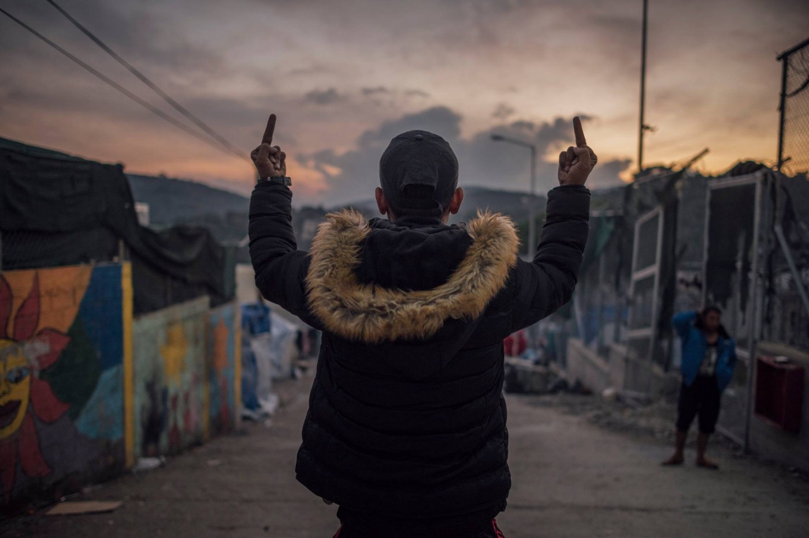

Moria bad\. Moria prison\. Photo by **Kevin McElvaney**
### Feature: A look into the main Organisation providing “aid” to refugees in Greece’s most notorious detention centre\.

Who are they? How did they get there? What is their agenda?

EuroRelief has been the main provider of housing and aid to refugees in Moria since late 2015\. However, if you speak to any refugees who have had to endure their services, you would find out that **they provide anything but aid\.**

This week EuroRelief have been busy\. They focused all their efforts toward cleaning the rubbish out of Moria and got rid of all the tents that people have been living in for months\. This was done just in time for a visit by European journalists and politicians who came to inspect the detention centre\. After all, Moria is only open to the media on very special occasions\.

> ‘They made Moria look like a hotel… but Moria is a hotel only for a day\. The Greek government and European NGOs do not want the world to know the reality in Moria\. Here is proof\.Claimed Arash who has lived in Moria for more than a year and a half\. 

**So who are EuroRelief ?**

> They are represented as the ‘humanitarian arm’ of a bigger organisation known as Hellenic Ministries\. 

> EuroRelief is HM’s humanitarian arm, dedicated to providing first responder and extended help in natural disasters throughout the region\. — [Hellenic Ministries Home Page](http://hm.hellenicministries.org/ministries/eurorelief/) 

**And who are Hellenic Ministries?**

> Hellenic Ministries purposes to reach communities holistically\. Through evangelism, we share the message of the gospel with those we encounter\. Through discipleship, we walk with others, helping them grow in their relationship with the Lord\. Through acts of compassion, we help the impoverished by responding to physical and spiritual needs\. And through training and support, we empower missions beyond the Greek borders\. Please visit our ministry pages above to see our vision in action\! — [Hellenic Ministries](http://hellenicministries.org/) 

From the way they make things sounds, you would assume that they are a Greek Organisation governed by Greek people\. But they are not… a deeper look and you will find that their main office is based in the U\.S\. After all, barely any Greek people are Evangelical\. In fact 98% of Greeks are Christian Orthodox\.

Last year, Hellenic Ministries invested a lot of time and money into a project named Operation Joshua, a project whose aim was to distribute millions of copies of the bible across rural households in Greece\.

[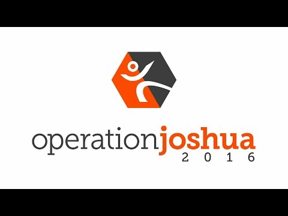](http://www.youtube.com/watch?v=9gS6U5x3rbs)

Operation Joshua required millions of dollars to execute\. With that much money at their disposal… surely over 6000 people shouldn’t be living in a prison camp that has the capacity to host 1800 people throughout the winter? Surely families with children shouldn’t be forced to sleep outside in summer tents in the snow? Surely the rubbish could be cleared? Surely safe and hygienic facilities could be established? Surely people should not be dying from preventable illnesses?

With that much money surely Moria shouldn’t look like this 2 years on…

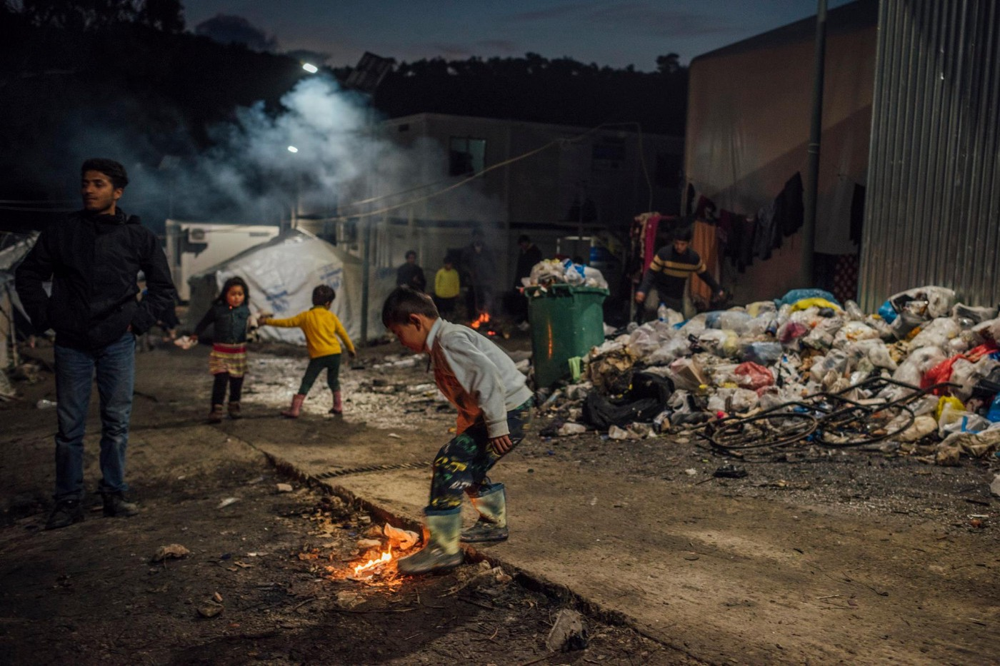

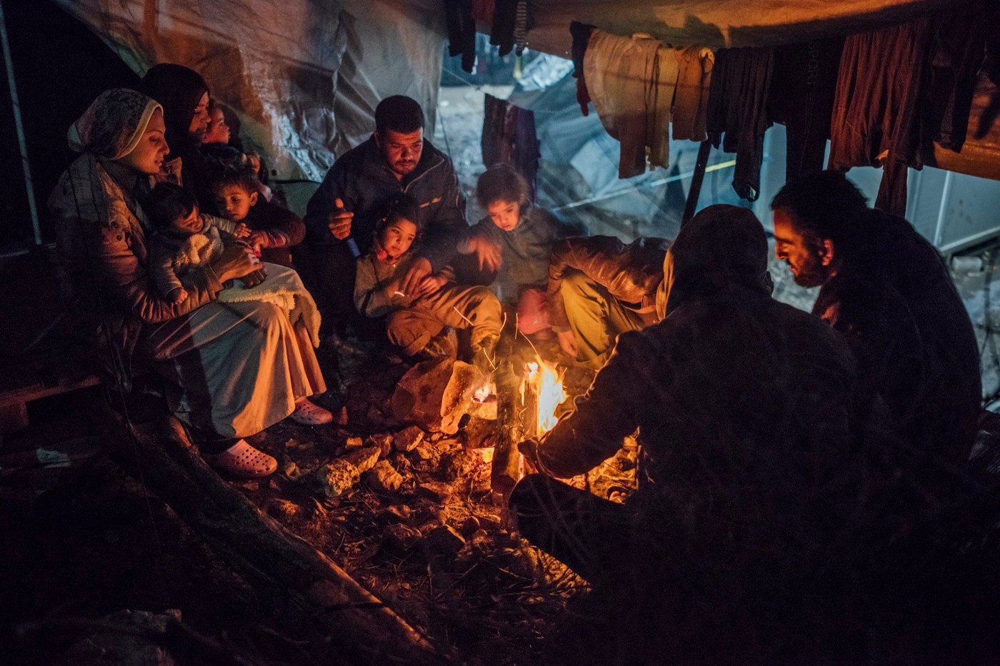

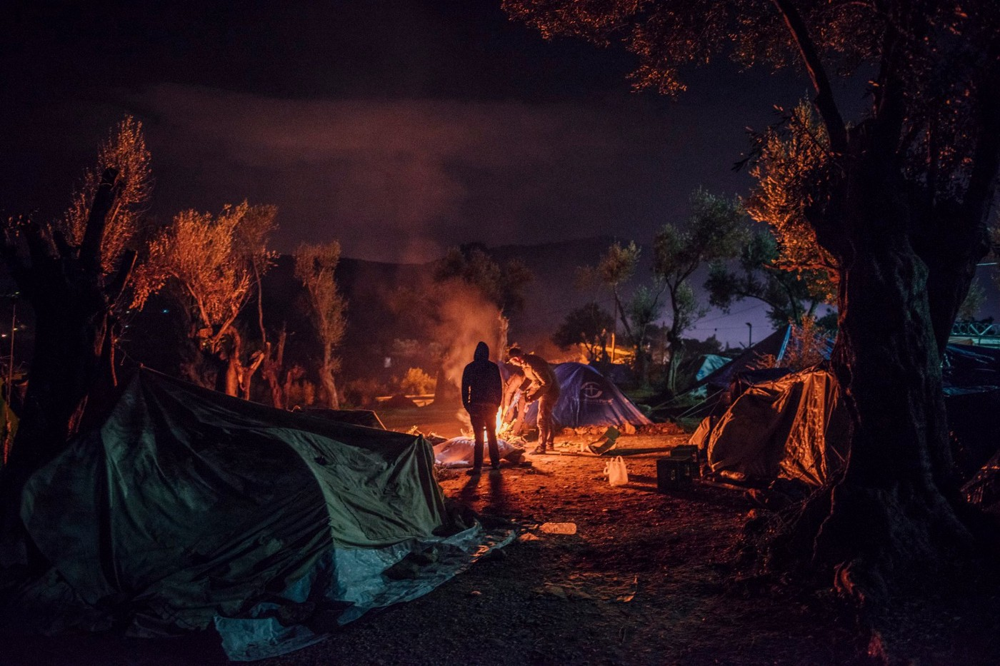

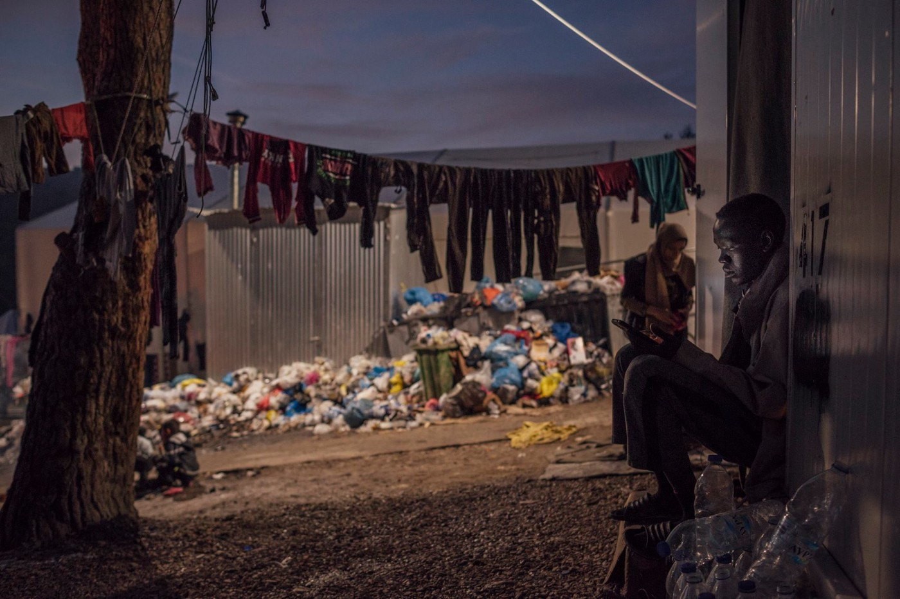

**Moria is a hell\. Moria is a Prison\. People are living in filth\. Families with children are sleeping outside in the middle of winter in summer tents\. Last winter seven people died in Moria due to the cold\.** Photos by **Kevin McElvaney**

Eurorelief is run by an American man named Jeremy Holloman\. He has been running the organisation for over 2 years\. The last we looked into the law, as an American citizen you are only allowed in the Schengen Zone for 3 months every 6 months\. His wife keeps a blog about all the humanitarian aid their family provides though, t [ake a look here](https://hollomanfamily.com/) \.

T [he Guardian also released a piece](https://www.theguardian.com/world/2016/aug/02/aid-workers-accused-of-trying-to-convert-muslim-refugees-greek-camp-detention-centre-lesvos-christianity) in August 2016 titled: ‘Aid workers accused of trying to convert Muslim Refugees at Greek camp”

**In response EuroRelief released _this [statement:](https://www.facebook.com/eurorelief/photos/a.1475282279443268.1073741828.1474685266169636/1570860233218805/?type=3&theater)_**

> Now, EuroRelief is an NGO\. As an NGO we provide humanitarian help wherever is needed\.
 

> We don’t do bible distribution\. And this is very clear in our code of conduct\. 

> The individuals though, our volunteers and our staff have the right in Greece, because of the Greek constitution and the European law, as you can see in previous post to hand out a Bible or another book\! It’s their right\! Nobody can prohibit them of practicing their rights, even in refugee camps\. 

This may be the case… but the most worrying part of this is that EuroRelief has been accused of favouring refugees who do change their faith to Christianity\.

Rumours are plenty within Moria that if you do change your faith — you are much more likely to be granted asylum\. EuroRelief also has the power to do this, because they work very closely with the authorities\.

**We asked a refugee whether they try to convert people:**

> Yes\. A lot\. I never want to take what somebody tells me for the truth, and I never do… So I didn’t completely believe what I was hearing about them\. Not until it happened to me\. 

> It was a cold night… Sometime in the winter, and I was sleeping in one of the big white tents\. They came into our tent and were giving us all chai\. I accepted a glass\. Before I could put the glass to my mouth, the guy turned to me ‘why are you Muslim?’ I was so shocked\. I didn’t know what to say\. You know for the rest of the world; we think that Muslim to them means terrorist\. I know it’s not like this for everyone, but that’s what we think\. That’s why a lot of us don’t want people to know that we are Muslim and some people even don’t want to be Muslim\. We think if you are Christian then you will have more chance at getting asylum\. I think it plays a difference in your Asylum Application if you do this\. I think Euro Relief can influence asylum decisions with this\. That’s why we are all careful what we say to them\. — refugee living in Moria 

The same way they have the power to accelerate the process of giving asylum to refugees — they also have the power to accelerate the arrest and deportation of refugees they do not deem worthy of asylum based on their own presumptions\.
#### We asked another refugee whether EuroRelief work with the authorities:

> They definitely work with the authorities\. We all know this\. They work with them in every way\. There was this one time, it was the middle of winter, it was so cold\. Our community representative went to the Euro Relief office late in the night asking for another blanket\. They told him no, sorry we cannot give you one and gave him a ticket to come back in a week\. He was very upset he didn’t overreact but began to raise his voice pleading with them to give him a blanket\. He didn’t get one\. They next day our representative was in Moria prison\. The police came to his room early in the morning and arrested him\. He spent a few days in jail before they released him\. We asked the authorities why he was in prison and they told us because Euro relief reported him and because he was drunk\. He wasn’t\. But they have this power over us\. They keep a record of who we are, of where we live and we always know that we can be arrested if we do anything wrong\. We don’t trust that they are here to help us\. — refugee living in Moria 

Being in charge of housing means that EuroRelief is able to segregate people based on nationality — which in the process of arrests and deportations is very convenient for authorities\.

In Moria, refugees are forced to wear coloured wrist bands with numbers on them in order to receive aid\. This tells volunteers and authorities where a particular person lives within the detention centre — and what nationality they are\. This makes the targets of arrests and deportations much easier, whether these deportations and arrests are lawful or not is a different story\.

**How do they do this?**

A day in the life of a EuroRelief Coordinator from their blog which you can [read here](https://peacepapergirl.wordpress.com/2017/04/28/working-in-a-refugee-camp-the-truth/) :

> As a coordinator I came in everyday starting the shift off by briefing in our volunteers\. Talking about what projects needed to be accomplished that day, talking about what challenges have surfaced that we may face throughout the day\. I would go over our rules and regulations, trying to remind the volunteers why were are there, encouraging people to keep their eyes on Jesus throughout the workday and dividing everybody up in the different areas we work in\. 

> I’d start by sending out a team to go check the new arrivals tent to see if any new boats had come in overnight, get the break down of the nationalities, genders, and ages of family members\. Then the housing team which was the main area I oversaw would begin looking at the boards that held the number of people living in which areas and what nationalities they were\. 

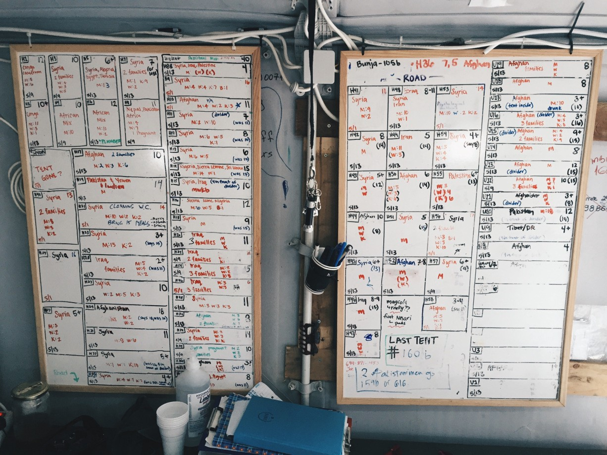

Housing boards showing the breakdown of housing units\. As you can see nationalities of residents are shown\. Source: peacepapergirl\.wordpress\.com

> Next, I would send out small groups of people to each possible living area to “negotiate” with people asking “Can one man from Syria move in here?” Usually coming back claiming the people had said no due to the overcrowded living conditions\. Much of what my job entailed was arguing…a lot\. People constantly lying claiming they had more people living in their tent than they really did\. 

EuroRelief may consider themselves as ‘invisible heroes’ … But many people beg to differ\. If their focus was providing aid to refugees — Moria would not be in the state it is now\.

At AYS we strongly believe an investigation is required into the organisation EuroRelief and the work they do\. If the authorities are not prepared to do this, we will\. We are urging any volunteers, refugees, locals to send through any information they may have through to our Facebook Page\.
### Syria
#### Syrian American Medical Society \(SAMS\) say doctors and civilians are risking their lives every day to receive treatment for their loved ones\.

[Statement by SAMS](https://www.facebook.com/SyrianAmericanMedicalSociety/posts/1580525805330548?hc_location=ufi) reports that over 600 patients remain on the medical evaluation list in the besieged area of Ghouta\.

> Join us in calling for the cessation of hostilities in [\#EastGhouta](https://www.facebook.com/hashtag/eastghouta?source=feed_text&story_id=1580525805330548) ; the immediate entry of humanitarian and medical aid to the area; and the continued evacuation of critical patients with the appropriate safety guarantees\. [\#SaveEastGhouta](https://www.facebook.com/hashtag/saveeastghouta?source=feed_text&story_id=1580525805330548) — SAMS 

### Libya
#### Dozens of migrants in Libya have been arrested and are facing deportation:

[A report by Reuters](https://uk.reuters.com/article/uk-europe-migrants-libya/dozens-of-migrants-arrested-in-east-libya-and-face-deportation-idUKKBN1F02XX) reveals that 81 persons from Eritrea, Ethiopia and Somalia who have escaped from the hands of smugglers after failing to reach Europe have been arrested and are to be deported\.

> “They were arrested in the Zueitina area at a camp of illegal migrants,” said Ahmed al\-Arifi, an official from the department for countering illegal migration in the eastern city of Benghazi\. “They were arrested for deportation back to their countries\.” 

### Turkey

News of a group of people in a rubber boat off the coast of Foça requesting help at 23:50\.

2 boats & 1 helicopter were dispatched by the Turkish coast guard and upon observing that the boat was deflating and taking on water, a rescue operation was launched\.

1 person feel in the sea but was rescued; all others were in turn taken off the rubber boat, which sank soon after\. The passengers reported that no one was missing\.

The 41 refugees taken to Foça included 13 from Afghanistan, 8 from Syria, 6 from Sierra Leon, 6 from Angola, 3 from Eritrea, 2 from Mali, 1 from Iraq, 1 from Somalia and 1 from the Comoros\.

■■■■■■■■■■■■■■ 
> **[SARwatchMED](https://twitter.com/SARwatchMED) @ Twitter Says:** 

> > #TurkishCoastGuard press release about last night’s #SAR in the #AegeanSea: 41 people rescued from a deflating dinghy headed for the Greek islands [sahilguvenlik.gov.tr/haberdetay/201…](http://www.sahilguvenlik.gov.tr/haberdetay/2018/01Ocak/11Ocak2018izmirfoca.pdf) https://t.co/N8G3Ic1RN3 

> **Tweeted at [2018-01-11 21:11:59](https://twitter.com/sarwatchmed/status/951562354168299521).** 

■■■■■■■■■■■■■■ 

### Sea
#### Already over 60 deaths in 2018

Yesterday Sea Watch [conducted their first rescue operation](https://twitter.com/seawatchcrew/status/951451062267006976) of the year saving over 90 people\. Today the Aquarius welcomed Nigerian actress Stephanie Linus as she attempts to raise awareness for the exploitation of Nigerian Women\.

■■■■■■■■■■■■■■ 
> **[SOS Humanity](https://twitter.com/soshumanity_de) @ Twitter Says:** 

> > "There is an urgent need to tell these stories" says the Nigerian actress @[StephanieLinus](https://twitter.com/StephanieLinus) during her visit on board the @[SOSMedGermany](https://twitter.com/SOSMedGermany) and @[MSF_Sea](https://twitter.com/MSF_Sea) rescue ship #Aquarius #TogetherForRescue https://t.co/3uiu921q5y 

> **Tweeted at [2018-01-11 16:12:34](https://twitter.com/sosmedgermany/status/951487006600826880).** 

■■■■■■■■■■■■■■ 

### Cyprus
#### Ahmed Solidarity Group continues to protest for Freedom of Ahmed H\.

Ahmed is a Syrian refugee currently in Cyprus who attempted to cross the border in September 2015 to help his family\. When Hungary closed its borders the police responded with violence and Ahmed along with 11 other people was arrested\. He was charged as the leader of the protest and was sentenced to 10 years in prison\. Currently retrials are going on\.

> Yesterday, on the day of the second trial of Ahmed H\. for this month, they gathered in front of the House of E\.U\. in Nicosia to demand his release and return to Cyprus, but also freedom to all detained migrants\. 

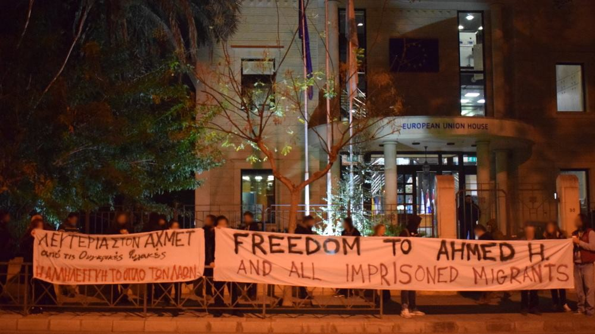

Source: Ομάδα αλληλεγγύης για τον Άχμετ / Ahmed solidarity group
### The EU:
#### [Joint statement by “Southern Seven”](http://www.infomigrants.net/en/post/6958/southern-eu-countries-pledge-to-improve-common-migration-policy)

The leaders of Cyprus, France, Greece, Italy, Malta, Portugal and Spain — known collectively as the “Southern Seven” — released a joint statement following a meeting in Rome saying they were “firmly committed to a common European policy on migration\.”
They agreed on the need to strengthen the EU’s external border, tackle human smugglers and combat the sources of migration, such as poverty and conflict, in origin countries\.
Leaders also suggested other member states needed to do more to help those countries that receive the most migrants\.
### Greece:
#### Arrivals and transfers continue on Aegean Islands

Numbers of [arrivals and transfers](http://mindigital.gr/images/prosfygiko/NSP_Eastern_Aegean_10.01.pdf) from the islands have remained consistent for the start of 2018 and a total of 803 refugees refugees arrived to the northern Aegean islands in the first ten days of January\. The Turkish Coast Guard has also announced on its official website that it has already intervened 18 incidents in January and returned 760 people to Turkey\.
#### Vial Hotspot will not close, says Immigration Minister

As tensions due to overcrowding continue in the notorious Vial hotspot on Chios, the [Migration Minister told](http://www.ekathimerini.com/224825/article/ekathimerini/news/vial-camp-will-not-close-migration-minister-says-on-chios-visit) disgruntled residents on the eastern Aegean island on Chios on Thursday that the centre will not close\.
#### [The Hope project](https://www.facebook.com/HopeProjectKempsons/posts/2006263939654728) that provides aid to refugees in Moria is urgently in need of help\.

To see a list of most needed items please [follow this link\.](https://www.facebook.com/HopeProjectKempsons/posts/2006263939654728)
#### Volunteers are needed on Lesvos:

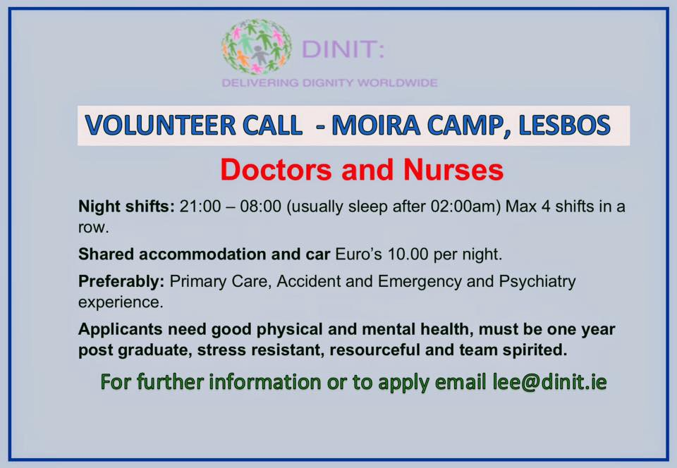

#### Refugee Info Bus provides crucial information on AMKA: Greek social security card\. Please watch and share this video\.

#### New arrivals to Katsikas Camp

96 New arrivals in the early hours of this morning\. 30 from Chios and 69 from Lesvos\.

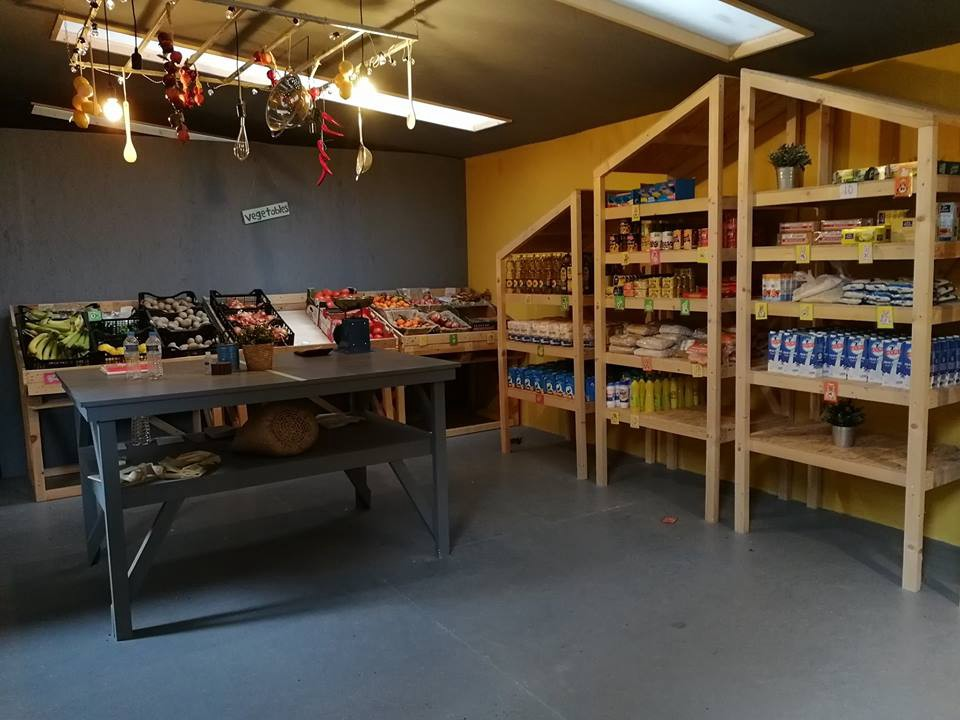

Source: Refugee Support Europe
#### The Idira Centre in Thessaloniki is now open — and looking for support

The Idira centre provides many interesting and engaging activities for refugees stuck in Thessaloniki\. These include zumba, yoga, making a recycled bags, cooking and socialisation\. You can [support them here\.](https://intervolvegr.com/get-involved/donate/)

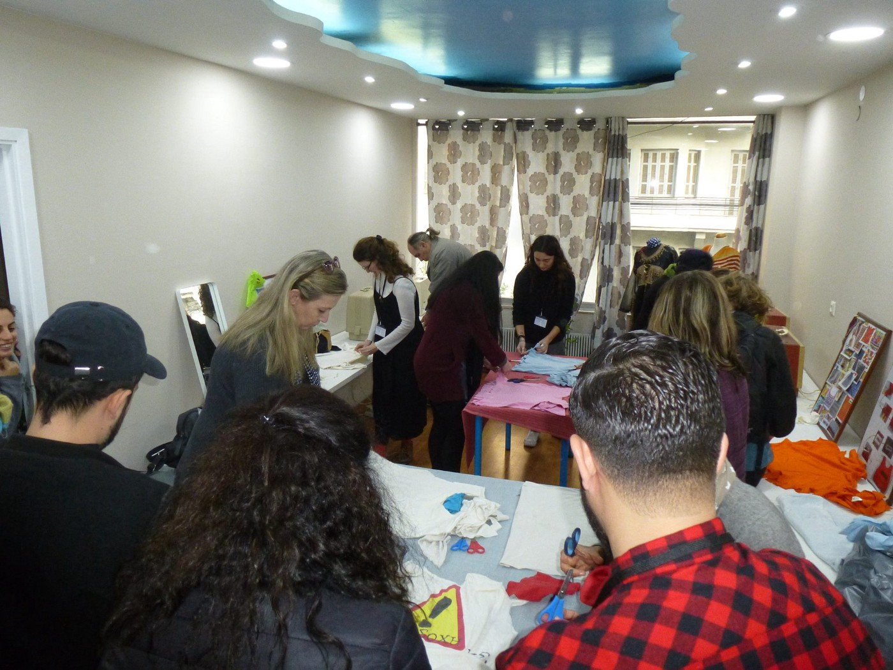

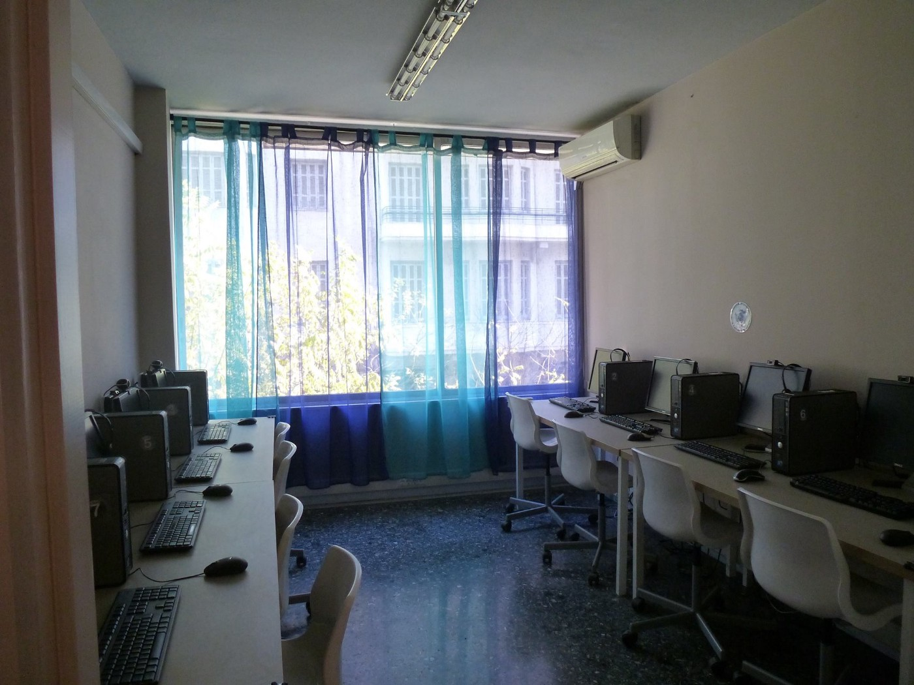

#### Reports that police plan to evict 46 occupied buildings in Athens

■■■■■■■■■■■■■■ 
> **[Anna Carastathis](https://twitter.com/AnnaKarastathi) @ Twitter Says:** 

> > #Greece: police has plan to evict 46 occupied buildings, an attack on autonomous organisation, solidarity with #refugeesgr, creativity and reclamation in the rubble of intersecting crises [thetoc.gr/koinwnia/artic…](http://www.thetoc.gr/koinwnia/article/epixeiriseis-gia-tis-katalipseis-stin-athina-etoimazei-i-elas) 

> **Tweeted at [2018-01-11 09:08:10](https://twitter.com/annakarastathi/status/951380203661615105).** 

■■■■■■■■■■■■■■ 

■■■■■■■■■■■■■■ 
> **[Anna Carastathis](https://twitter.com/AnnaKarastathi) @ Twitter Says:** 

> > Targets for eviction include social centers, neighborhood reclaimed parks, theatres, libraries, archives, and buildings used to house #refugeesgr including @Notara26 @[sol2refugees](https://twitter.com/sol2refugees) @[5olikeio](https://twitter.com/5olikeio) 

> **Tweeted at [2018-01-11 09:13:00](https://twitter.com/annakarastathi/status/951381415991619584).** 

■■■■■■■■■■■■■■ 

### Italy
#### For two years, the Farao Matricola clan of the Calabria\-based mafia organization the ‘Ndrangheta ran and made money off a 150\-bed migrant center for unaccompanied minors\.

[Reports say](http://www.infomigrants.net/en/post/6965/calabrian-mafia-controlled-youth-migrant-center-for-years) the center, called Casa Sant’Antonio, was fully controlled by the illegal organization and was used by it for high\-level meetings between its members\. Every aspect was under the control of the mafia\-type group: all the supplies, clothing and food were from companies linked to the clan, which saw their profits rise suddenly and inexorably\.

The Italian NGO Doctors for Human Rights \(MEDU\) said that in the Calabrian town of Rosarno migrant farm workers continue to live in inhumane conditions, as they have for years\. [They report that](http://www.infomigrants.net/en/post/6960/migrant-farm-workers-in-rosarno-still-in-inhumane-conditions) 80 percent of cases they are exploited by working unreported\.
### Hungary
#### Key asylum figures from Hungary in 2017 remain low

> As a result of the “8\-kilometre rule” legalising push\-backs, the daily limit of people admitted to enter the transit zone \(5–5 persons during working days since February 2017\), and the changes that entered into force on 28 March 20171 the number of registered asylum applications remains low\. 

To find out more information please [follow this link](https://www.helsinki.hu/wp-content/uploads/HHC-Hungary-asylum-figures-1-January-2018.pdf) to statistics provided by Hungary Helsinki Committee\.
### France
#### Sign petition to end border Deaths in Calais

> President Macron is due to visit Calais next week to see the situation refugees face in the area with his own eyes\. There is an petition that is certainly well timed\. Please sign\. 

Please [follow this link](https://www.change.org/p/stopdeath-at-calaisborder?link_id=2&can_id=ce76b71c42a9edc5b0a0325ad4c064f4&source=email-weve-had-enough-firstname-default-friend-have-you-too-2&email_referrer=email_284838&email_subject=weve-had-enough-firstname-default-friend-have-you-too) for the petition\.
#### Help Refugees are in need of donations of tents for Calais

Please follow [this link](https://www.facebook.com/HelpRefugeesUK/videos/549504072076937/?hc_location=ufi) to see how you could help\.

#### Informal Camp at St\. Denis evicted and refugees left on the street

Today the informal camp at st Denis, Paris, was cleared up again\. Prgs reported that around 400 refugees had to leave the area and many lost all their possessions that were just trashed like always\. What was thought initially as being an evacuation to take the people to centres was really just an eviction so everyone is still on the street\.
### Switzerland:

[Be Aware And Share — BAAS](https://www.facebook.com/beawareandshare.baas/?hc_ref=ARSMxrgOMvDEXUA2GH0MM_0RX0JqoupE9nuFxW9kxXwGI65CxqXt4p0X2YaFUjdGf98) are collecting physical donations for homeless refugees in Paris\.

To find out more please [_follow this link_](https://www.facebook.com/events/2505237226367184/) _\._
### UK
#### Donation collection for Northern France in Birmingham

> The Birmingham team for Help Refugees will be holding a donation collection THIS WEEKEND for items to be taken to refugees who are currently living in freezing temperatures in Calais and Northern France\. 

Please [follow this link](http://(https://helprefugees.org/calais/needs-list/)) for the current needs list and food items for Refugee Community Kitchen\.

[**The ‘Unofficial’ Women and Children’s Centre**](https://www.facebook.com/The-Unofficial-Women-and-Childrens-Centre-160982470942565/?hc_ref=ARQ6LHBn8nP12_hKgw7lC6SLGCHlUl6C2x0GOpfNkz5HNBS4jFegmewVcsH1RpONJdg&fref=nf) are looking for volunteers\. If you are in Birmingham and are interested you can email meena\.volunteers@gmail\.com for information\.

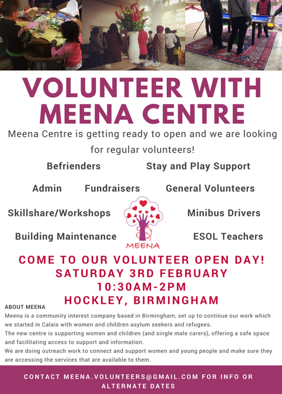

> **We strive to echo correct news from the ground through collaboration and fairness\.** 

> **If there’s anything you want to share or comment, contact us through Facebook or write to: areyousyrious@gmail\.com** 

_Converted [Medium Post](https://areyousyrious.medium.com/ays-daily-digest-11-01-2018-eurorelief-u-s-807717ec51f8) by [ZMediumToMarkdown](https://github.com/ZhgChgLi/ZMediumToMarkdown)._
