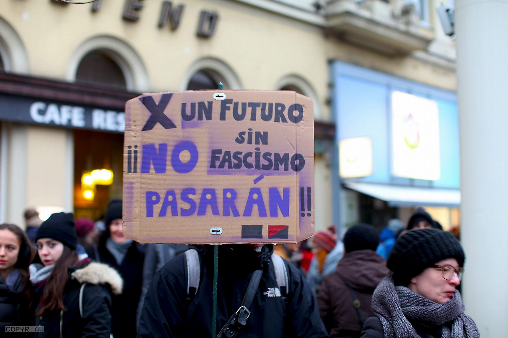
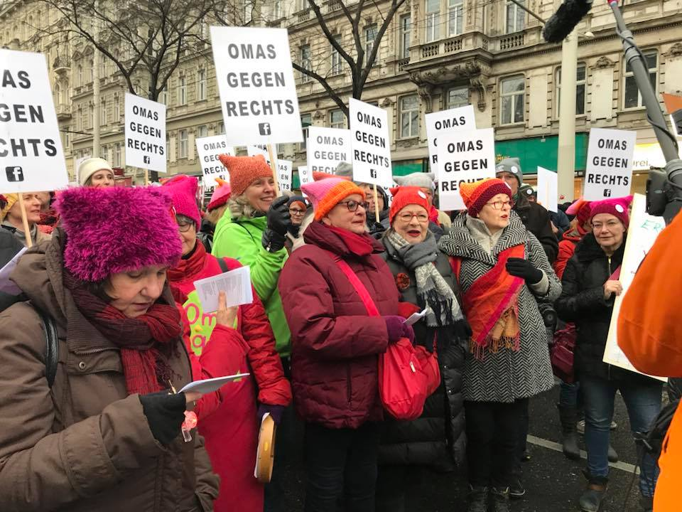
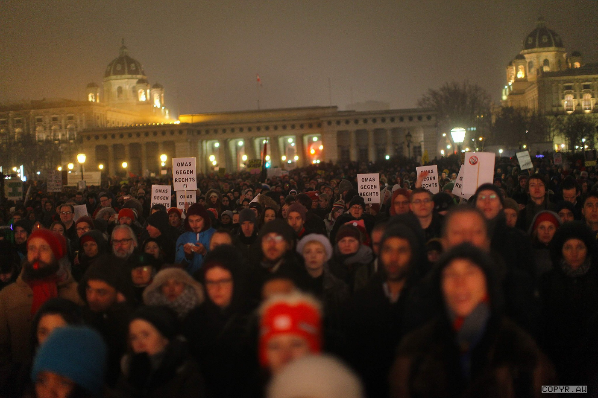
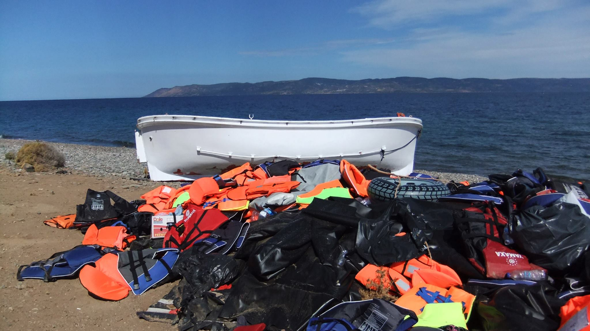

### AYS Daily Digest 13/01/2018: Protests in Vienna against far\-right

_Austrians protest against far\-right//43 refugees arrive on Lesvos//New information from southern Croatia//Amnesty International calls on the attacks against civilians in Idlib to stop_

Photo by Arye Wachmuth
#### Feature:
### Protests in Vienna against far\-right

Protests have taken place in the Austrian capital of Vienna over the inclusion of the far\-right Freedom Party in the new coalition government\.

The Freedom Party’s interior minister Herbert Kickl caused outrage earlier this week with his comments over asylum seekers, suggesting they should be kept concentrated in one place\.

Austrian newspaper Der Standard reports that the slogan “I say Kickl — you say resign” was amongst the most common slogans during the protest\. People called for a boycott of FPO ministers by other European governments and the shunning of Austria when it takes up the revolving European Union presidency in the second half of 2018\.

Many organisations warned against repeating history, including the federation of Austrian antifascists, resistants and victims of fascism as well as the Jewish Students Union\.

The “Grandmas against the Right” were at the forefront of the protest, fighting against antisemtisim, racism and fascism\.

Organizers say 70,000 people protested in the freezing rain despite expectations that only 10,000 — 20,000 would participate according to police\.

Photo by Arye Wachmuth
#### Greece
### 43 refugees arrive on Lesvos

One boat with 43 people on board landed on the South coast of Lesvos early in the morning\. One person was reportedly brought to the hospital for severe hypothermia\. A boat with 29 refugees arrived on the Ionian island of Cephalonia late Friday night according to [Ekathimerini](http://www.ekathimerini.com/224886/article/ekathimerini/news/refugee-boat-runs-aground-on-cephalonia) \.

Philippa and Erik Kempson on Lesvos say they are in need of supplies, including trousers, gloves, shoes and [more](https://www.facebook.com/thekempsons/posts/1976407082607195) \.

Photo by Philippa and Erik Kempson
### Volunteer needs

The Mosaico House, a shelter for 32 women and children refugees in Athens, is looking for volunteers\. The shelter includes school classes, activities and information events\. More volunteer needs can be found on [Greecevol](https://www.greecevol.info/) \.
#### Spain
### Boats arrive on the Spanish coast

The Spanish coastguard rescued two boats off the coast of Malaga, with a total of 109 refugees\. The Spanish Red Cross says five had to be transferred to the hospital\. Another 32 were brought to Almeria and 13 people including six minors were rescued from three inflatable boat in the Straits of Gibraltar\.
#### Croatia
### Route from Bosnia and Herzegovina to Croatia

According to AYS information, there are currently 13 refugees in the Trilj transit center in southern Croatia, on the border with Bosnia and Herzegovina — one from Syria, four from Tunisia and eight from Libya\. We suppose that most of these people crossed from Bosnia and Herzegovina or Montenegro to Croatia, and that they are waiting for readmission\.

This proves there is still activity on the route through Bosnia and Herzegovina and Montenegro, despite the closed borders\.
#### Syria

Amnesty International calls for the attacks to stop against civilians in Idlib which hosts thousands of internally displaced people from across Syria\. They now have nowhere else to flee to\. Amnesty declared _“All parties to the conflict MUST end attacks on civilians, hospitals & bakeries\!”_

> **We strive to echo correct news from the ground through collaboration and fairness\.** 

> **If there’s anything you want to share or comment, contact us through Facebook or write to: areyousyrious@gmail\.com** 

_Converted [Medium Post](https://areyousyrious.medium.com/ays-daily-digest-13-01-2018-protests-in-vienna-against-far-right-1cd26de8ad8f) by [ZMediumToMarkdown](https://github.com/ZhgChgLi/ZMediumToMarkdown)._
