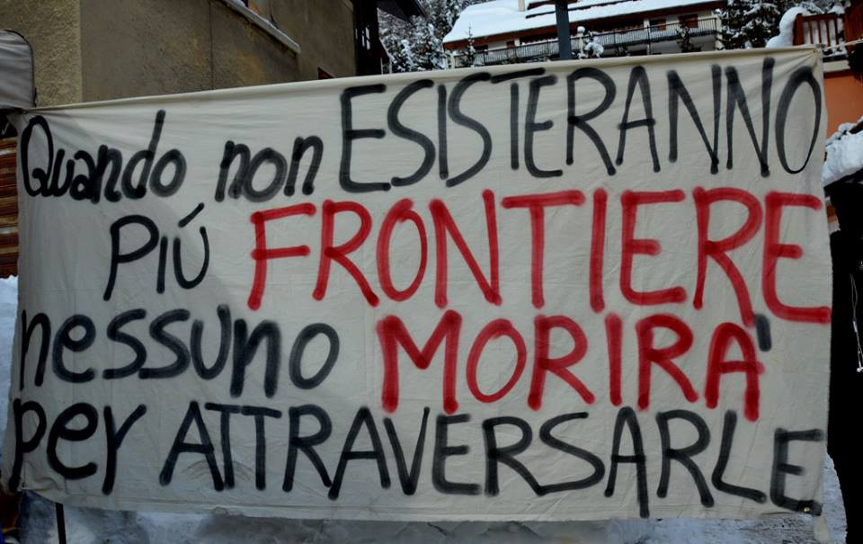
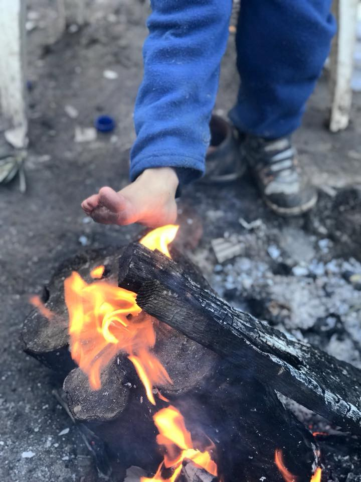
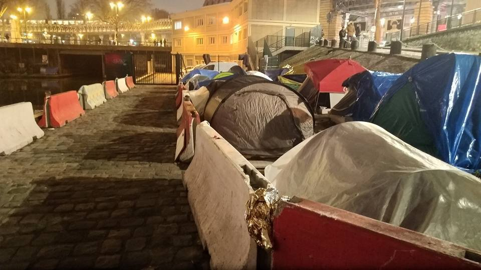
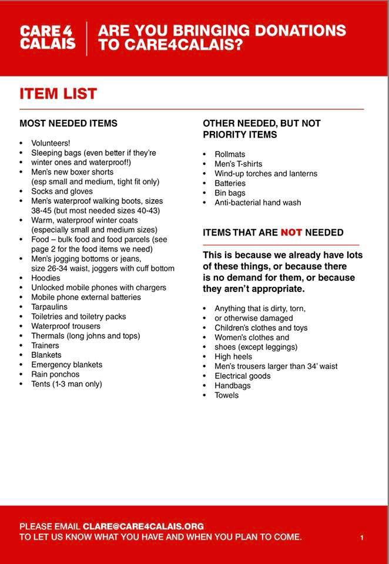
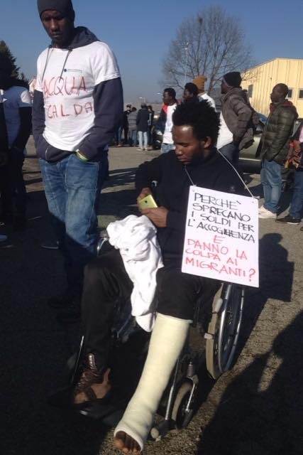
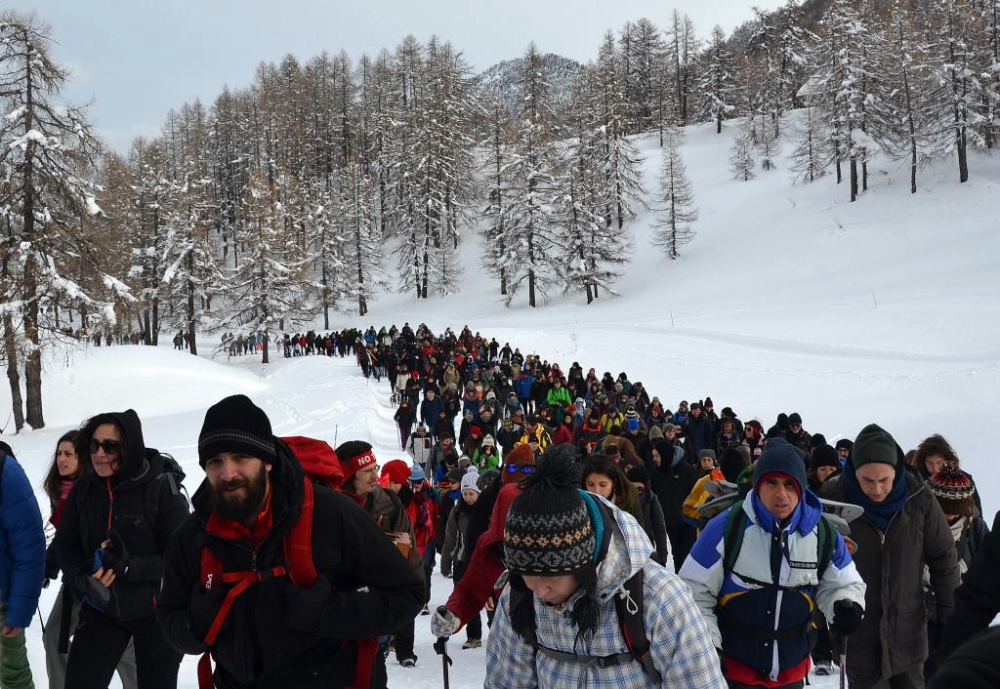
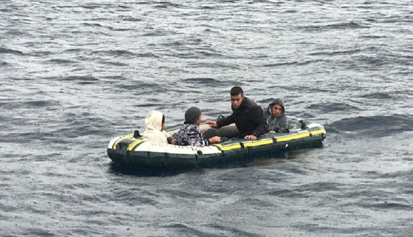

### AYS Daily Digest 14\.01\.18: In 21st century Europe, refugees warm their feet over an open fire

_Story about friendship and people with open hearts from one Italian town // Help needed for vulnerable man in Paris // Case against Italy at the European Court of Human Rights // And more from Greece, Italy, France…_

“When borders will no longer exist, one will not die crossing them\.” Photo Credit:
### Feature
### Residents of Italian town ask to host refugees

Ripabottoni is a village of around 500 people in Campobasso province, Molise\. The inhabitants have recently voiced their support for the resettlement of a group of asylum seekers to their village\. The reason for this is is the closure of the extraordinary receiving centre \(CAS\) Xenia, decided by the prefecture, hosting 32 people\.

150 inhabitants of the town have signed a petition against the closure of the CAS and many have participated to a protest demonstration because _“friendships were created and stories were intertwined”_ between the inhabitants and the centre’s guests\.

Xenia has been closed on 11 January\. The 32 asylum seekers have been transported to other towns: Roccavivara, Petacciato, Montecilfone e Portocannone\. The decision to close the CAS has not been clearly justified yet\. The local newspapers assume that the prefect has been pressured by the mayor\. The centre’s closure has also cause unemployment for 15 people who were working there\.

Ripabottoni is a town at risk of depopulation\. As Primonumero — local newspaper which gave the news — stated, this story “ _is related to the future of Molise’s towns where the presence of migrants — men, women and children born here — is capable of reviving the community, lower the average age, flesh out the football teams out of athletes, give life to a church choir that otherwise would not exist_ ”\.

Even the priest Gabriele Tamilia protested against the centre’s closure, printing a leaflet saying: _“our citizens have started to interact with these people establishing great relationships with them\. Our two communities, Catholic and Protestant Christians, have included them in their realities\. Many people have played a role in several types of aid_ ”\.
#### Greece
### Samos, the end of the world

We received more photos from camp at Samos showing dreadful living conditions for over 2,500 people who are forced to stay in this overcrowded camp\. People still sleep in tents\.

### Refugees warm their feet over fires

In the midst of this brutal winter, many people are left outside in the cold\. The situation is so severe that the Refugee Biryani & Bananas Facebook group posted a picture of refugees huddled around a fire, bare feet hovering over it to keep warm\. This is the reality for thousands of people in Europe\.

Horrorstricken by this display, the kind people of Refugee Biryani & Bananas are collecting donations for warm shoes, socks, coats, and solar\-powered lights\.

You may donate to their Paypal at ruhiloren@gmail\.com, or send a message to the Facebook page to receive bank information\.
### FoodKIND seeks new project leader

FoodKIND is an NGO that tasks itself with feeding refugees\. They are currently looking for a team leader to work with the operation in southern Greece\. The person chosen for the position will be responsible for overseeing the distribution of food, watching over things such as volunteer management, kitchen management, cooking, cleaning and administration\.

The position comes with living accommodations and a monthly allowance\. If you are interested in applying, please send an email to action@foodKIND\.org\.
#### France
### France demands that UK take in more refugees, pay for border security

France and Britain are currently in the midst of negotiations to decide on the future of the Le Touquet accord, which extended the British border into France in 2003\.

France demands that Britain shoulder more of the burden of border defense costs, as well as to take in larger numbers of refugees\. If the two sides cannot reach an agreement, then they will have to reinstate borders on either side of the English Channel, a move that neither party wishes to pursue\.

Paris\. By Danika Jurisic\.
### Refugee with broken back in need of help

A refugee man with a broken back is in need of help in many arenas, namely in the areas of housing, medicine, and law\. If any doctors or lawyers would like to take a look at his case, or somebody could provide him with more permanent accommodations, please message [Danika Jurisic](https://www.facebook.com/profile.php?id=100009499466124&hc_ref=ARQQbr_RzmUjhx09QzOTaTadsBpBe7xB8OocyKsVgPuoSxQaU1rpRoEnlZT2IPFabUM) on Facebook\.

You can read a story about him as one of [our specials](ays-special-paris-where-the-french-system-fails-people-provide-484c1889aa64) \.
### Le Vestiaire needs new volunteers

Le Vestiaire, an organization that caters to the basic needs of refugees, is looking for new volunteers\. Positions to be filled are as follows: clothing sorting on Wednesdays from 3pm, settling minors from 5 to 7pm\. Volunteers are also needed on Tuesdays and Saturdays from 9am for the distribution of clothes\.

Donations of clothing and hygiene products are also needed, as well as basic medications such as stromectol, spregal, flammazin, escabiol, and xyzall\. If you would like to volunteer or bring in a donation, please send a text to 06 03 02 83 72\.
### Care4Calais releases new list of needed items

### Italy
#### Children waiting relocation

More than 380 migrants arrived alone in Italy or turned orphans during the sea voyages still waiting to be relocated in other European countries, in the best conditions deemed by the tribunals of the minors, [La Republica reports](http://www.repubblica.it/.../minori_migranti_in_380.../...) \.

Only one migrant out of three in Italy has managed to use the relocation programme which was blocked in September last year\. Four months from the procedure’s block, 79 minors have seen their requests approved but are still waiting for a transfer, 151 requests are still pending, to be approved by the identified European states, and 154 are still waiting for a country to be designated\.

The programme has been active for two years: 1,083 accompanied children have found an adequate location from Italy, and only 99 unaccompanied ones\.

“Too many minors migrants arrived to Europe alone, with dramatic experiences behind them, are still lacking protection from an adequate receiving and opportunities of social inclusion,” Raffaela Milano, director of Italy\-Europe programmes of Save the Children, said\. “The decision to interrupt the relocation programme has meant to abandon again the unaccompanied minors to their destiny, forcing them — in many cases — to end up again in the hands of the smugglers, or to risk their life to cross the borders\. This often happens to many youngsters crowding the passes on the North border in Como and Ventimiglia, or as the images show, to the ones trying to cross the snowy Alps walking”\.

In 2017, 15,730 minors arrived from the sea to Italy were unaccompanied\. The receiving system in Italy currently reports the presence of 18,500 unaccompanied minors from 40 different nationalities\. Lack of staff in the structures and of services to facilitate integration, such as the school subscription or the participation to Italian language courses, are among the main criticalities highlighted by the younsgters\.

Good news come from the side of the volunteering tutors foreseen by Law Zampa\. More than 2,700 citizens have given their availability to follow a foreign unaccompanied minor guaranteeing the necessary support to the process of integration in Italy, from the school subscription to the health system\.
### Wheelchair\-bound refugee harassed by center supervisor

[Carovane Migranti](https://www.facebook.com/carovanemigranti/posts/1196096413867353) group publihsed an story about a boy in a wheelchair who has been yanked by the supervisor of the centre where he stays, Santa Maria La Morra\.

Apparently, the same person destroyed his mobile phone and his SIM when he tried to film the living situation\. His mates have protested outside of the centre against this action\.
### Police investigate suspected arson of reception center manager’s car

T [he police is inquiring](http://www.ansa.it/liguria/notizie/2018/01/13/a-fuoco-auto-prete-che-ospitava-migranti_37867f22-3269-48b4-a683-77622e646130.html) about the wildfire of a car belonging to don Mario Pieracci\. The priest is the ex\-manager of the centre for migrants in Belpiano di Borzonasca\.

The flames have destroyed the car and damaged the priest’s garage\. The firemen extinguished the wildfire\. The police is assuming the fire was set on purpose, but a short\-circuit because of the the car’s old age is not excluded\.

In the past, don Pieracci had been criticized and threatened with writings for the management of the receiving centre Oasi in Belpiano\. These tensions seemed to have subsided, since the number of migrants had diminished\.
### European Court of Human Rights receives appeals of Sudanese refugees

The European Court of Human Rights has [received the appeals](https://www.ilfattoquotidiano.it/.../migranti-la.../4086448/) presented by a group of Sudanese migrants against the Italian government, after they had been expelled at Ventimiglia border\.

The European Court of Human Rights has accepted the request to examine the case about the collective refoulement on 24 August 2016\. According to Arci organization, which dealt with the situation, “The Sudanese citizens had been object of a real police round up in Ventimiglia\. Some of them had been transported in inhuman conditions and then illegitimately locked in Taranto hotspot\. Then there had been the attempt to refoul them all”\.

Some of them were eventually sent to Sudan, where 5 of them met Asgi representatives \(Association for juridical studies on migration\) and Arci, which met them in Khartoum in December 2016\.

Now the European Court has formally communicated the appeals to the Italian government and has posed specific questions for the expulsion modalities and to find out if the rights and guarantees foreseen by the European Convention have been respected\. The Italian Government will have to reply by 30 March 2018\.

Arci adds: “All the people not repatriated have obtained the acknowledgment of the international protection in Italy, since they were subject to persecutions and discriminations in the origin country”\. These appeals have revealed the violation of several rules of the European Convention and Geneva Convention\.

“The juridical action represents one of the undertaken initiatives to tackle to processes of externalization of the border and of the asylum right implemented by the Italian Government, which have concretized also with the new agreements with Libya and Niger in 2017, the latter being where Italy will send militaries and weapons”\.
#### Protest in the mountains

Hundreds of people have marched toward the border of the Montgenèvre with the aim to send the message: Freedom of movement for all and all\!

“These borders kill and try to break the future of those who are forced to abandon their land\. We are not going to watch, things to do remain a lot and we are only at the beginning, but we are and will be more and more to shout Briser Les Frontières\!”

Photo by Briser Les Frontières
#### Mediterranean
### 4 refugees aboard small inflatable boat rescued at sea

The Arcturus Salvamar crew located and rescued 4 people stranded in the Mediterranean\. They have been rescued and taken to Tarifa\.

> **We strive to echo correct news from the ground through collaboration and fairness\.** 

> **If there’s anything you want to share or comment, contact us through Facebook or write to: areyousyrious@gmail\.com** 

_Converted [Medium Post](https://areyousyrious.medium.com/ays-daily-digest-14-01-18-in-21st-century-europe-refugees-warm-their-feet-over-an-open-fire-aaeccbb68bf3) by [ZMediumToMarkdown](https://github.com/ZhgChgLi/ZMediumToMarkdown)._
