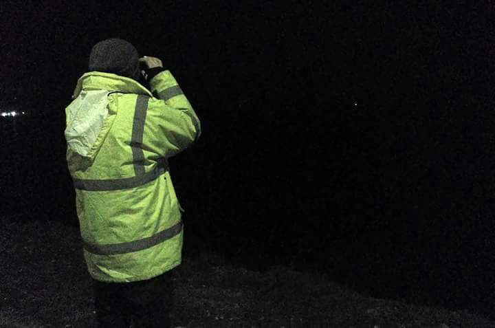

### AYS SPECIAL — Lesvos: The Other ‘Trip to Ithaca’

_I’ve come back to the island of Lesvos, to collaborate for a few weeks\. Same as I did last March, only now we’re in the depths of winter, and the nights are very cold\._

Photo by _SC Natzab\._

Here we are, watching over these coastlines, receiving those fleeing towards Europe\.

The watch shifts are from 11pm to 7am\. We spend the hours pacing the beach, with binoculars\. Watching the Turkish coastline, searching out any little light or shadow on the sea that could indicate the presence of a dinghy drifting towards the beach\. Every two hours we patrol our length of the coastline by car, slowly and with the windows open, scanning the shore in case we have missed a passing boat and must now help those arrived on land\.

Last night, no one arrived here\. Only the wind, the cold and the rain\.

But last 31st December and 1st January \(as well as the 6th January, the 20th March, or whichever of the year’s 365 days\), while the rest of the world waved goodbye to 2017 with grapes, champagne and festivities, and called in the new year, on Lesvos the dinghies continued to arrive\. As they did on Chios, on Samos, and on Kos, Leros and Rhodes\. Inside these boats, people fleeing different countries and different threats \(even though sometimes these threats are economic, and individuals facing these threats are not given the right to asylum\) \. Inside these boats, as is often the case, many women and children\.

The excitement of seeing themselves finally in Europe means no one waits to reach land to disembark, and this of course creates some dramatic moments\. My companions must wade out into the sea to prevent the boat capsizing and tipping everyone into the water\. After attending to all those who have arrived, with no time to change into dry clothes, a second boat arrives\. They are attended with the same care as the rest\.

The next night, the dinghy arrived battered by the Greek coastline, and before it could reach the shore, it spilled all its passengers into the sea\.

The tension of the journey, the stress, the extreme cold and the sodden clothes lead to many cases of hypothermia\.

There is anger among those of us on the beach watching, when those who have just arrived tell of the Turkish coastguard’s attempts to sink their dinghy by assaulting them from their patrol boat \(something I heard for the first time this last March, and I see is continuing to this day, with hardly any public condemnation\) \.

On this occasion, fortunately, no fatalities, but how many deaths like this can the Mediterranean be charged with? And not only in this part of Mare Nostrum…

Here, you will cry tears of fury \(at least I did\) at what you hear, what you see, and the profound wrongness of it all\. Above all when you meet those individuals later, here on Lesvos, and they tell you that, since they fled, the best moment was the kindness with which we received them at the coast\. Because after that, all is difficult: they are taken to camps like Moria, forgotten by the administration, beaten by the police, despised by the governments of different countries\.

And then you will cry more \(at least I did\), to hear them thank you\.

‘Thanks, for what?’ you will think\. ‘You tell us how brave we are for what we are doing\. But you are the brave ones, for leaving behind your whole life, including those people you most love \(sometimes they are already dead, murdered by a bomb in a war created and fed by our governments\); and you have risked it all on this exhausting ‘Trip to Ithaca’, full of mafias, violence and violation; and you have staked it all on this last crossing, across waters in which thousands have remained\.’

You are the heroes of this story\!

You, we mustn’t forget\!

‘Thanks, for what?’ you think, crying inwardly \(at least I do\) \.

And you decide, shame on Europe\! Shit on Europe\! Tomorrow I will return to the beach and I will give them even more care in these first moments \(because even if I don’t know their language, this is universal\) \.

> To see the above lines in context, these are the numbers of arrivals on Greek islands in 2017: 

> \-Lesvos: 292 boats; 12,709 people
 

> \- Chios: 148 boats; 6,655 people
 

> \- Samos: 131 boats; 5,433 people
 

> \- Other islands \(Kos, Leros, Rhodes\): 159 boats; 4,432 people\] 

**_\(By SC Natzab, independent volunteer who spent time in Athens, Lesvos, Chios, Samos and is currently on Lesbos\)_**

> **We strive to echo correct news from the ground through collaboration and fairness\.** 

> **If there’s anything you want to share or comment, contact us through Facebook or write to: areyousyrious@gmail\.com** 

_Converted [Medium Post](https://medium.com/are-you-syrious/ays-special-lesvos-the-other-trip-to-ithaca-600bd80975d1) by [ZMediumToMarkdown](https://github.com/ZhgChgLi/ZMediumToMarkdown)._
