### AYS Daily Digest 16/1/17: Tuesday brought largest number of people rescued in 2018
#### 2 lives lost, many babies, children, women and men saved in SAR actions across the Mediterranean / Donations and volunteers needed in mainland Greece / Italian politicians send out alarming messages / French president visited Calais, furious reactions followed / Calais mayor launches another verbal attack at the NGOs / and more news

 \)](assets/d9655bc95b54/1*I5MKHpcTYOkW4dRH9XKybQ.jpeg)

“ Unbearable what we see\. A dead child, and there may be more\. More innocent bodies to counter the shame\. 
Do many children, women and men have to die so that react before this huge crime? Cramped in darkness breathing death” \(Photo: [Proactiva Open Arms](https://www.facebook.com/proactivaservice/?hc_location=group_dialog) \)
#### FEATURE
#### In a single day more people found and rescued in the sea than from the start of the year

“About 600 people felt safe today for the first time in a while,” search and rescue teams of Proactiva said today, after having transferred several people with severe medical issues to Italian shores\.

■■■■■■■■■■■■■■ 
> **[IOM - UN Migration 🇺🇳](https://twitter.com/UNmigration) @ Twitter Says:** 

> > Breaking: 1,916 #migrants &amp; #refugees arrived by sea to Europe. 194 dead/missing ➡️ [missingmigrants.iom.int](http://missingmigrants.iom.int) https://t.co/IbfF9zF6sY 

> **Tweeted at [2018-01-16 10:26:16](https://twitter.com/unmigration/status/953211796055384065).** 

■■■■■■■■■■■■■■ 

An unusual number of people set off on their way from Libya towards Europe on a single winter day when the sea is rough and conditions difficult\. Some 120 migrants were rescued Monday in the central Mediterranean in two separate operations coordinated by the Italian Coast Guard’s central command off Libya, ANSA [report](https://twitter.com/ansa_med/status/953055028536889345) s\. Continuing their activities as the official coast guard and as a part of the joint operation Sophia, the officials report 1,400 people were saved from overcrowded boats off the coast of Libya on Tuesday\. During the operations, two bodies were recovered\.

■■■■■■■■■■■■■■ 
> **[Open Arms](https://twitter.com/openarms_fund) @ Twitter Says:** 

> > #ESTAPASANDO Larga jornada de rescates hoy. Subimos a bordo a 93 personas más halladas a la deriva aguas internacionales
En breve evacuamos 2 casos médicos graves a buque italiano.
La noche será también larga pero casi 600 personas hoy se sentirán seguras x 1a vez en mucho tiempo https://t.co/fFq2RFDxpS 

> **Tweeted at [2018-01-16 19:58:47](https://twitter.com/openarms_fund/status/953355871991418880).** 

■■■■■■■■■■■■■■ 

Proactiva reported earlier on Tuesday:

> “Today we rescued more 400 people on the high seas\. We take hours of rescue and there are still many more\.
 

> On Board more than 70 children, 175 women\.
 

> Unbearable what we see\. A dead baby, an adult too, and much more to do\. More innocent corpses for the counter of shame\.
 

> How many children, women and men have to die to react before this immense crime? Crammed into the darkness breathing hundreds of people under deck\.
 

> We’re very lonely here\.” 

■■■■■■■■■■■■■■ 
> **[Oscar Camps](https://twitter.com/campsoscar) @ Twitter Says:** 

> > Con 556 personas a bordo; 188 mujeres, 153 menores, 30 bebes, 2 muertos... Varios casos médicos graves pero seguimos rescatando https://t.co/geUVlZROee 

> **Tweeted at [2018-01-16 20:11:39](https://twitter.com/campsoscar/status/953359110690496512).** 

■■■■■■■■■■■■■■ 

> _A young migrant from Eritrea once said to me:_ “you can’t imagine how many boats are shipwrecked and how many migrants lose their lives during crossings, without anyone talking about it or taking care of it”\. they are the unknown victims — of which no statistics , no official report takes account of our fear, our rejection, our widespread inhumanity,” [_from_](https://www.facebook.com/MAMbeyondborder/posts/1776789969034031?hc_location=ufi) _Roberto Malini’s diary from Mom Without Borders organization\._ 

[Sea\-Watch](https://www.facebook.com/seawatchprojekt/?hc_ref=ARTV-2AEX_iAiHWWNiOQtOMVRFSepeol_Qn3GWoB833jjarENfBYxRkkPHWM1W-Ckok&fref=nf) reported they are back in the waters, working to prevent further danger for those stranded on their way accross:

> “The minister of interior in Germany has been pleased to see a fall of the asylum numbers\. SPD and CDU are exploring how they can lower them even further\. In this way, everyone will also forget to reduce the number of deaths in the Mediterranean\. They’re still high\. 

> We want to reduce these number\. That is why we are back on the Mediterranean since yesterday and we prefer to explore the sea for boats with refugees\. We continue to work to save people and not to make their escape more difficult\.” 

More people also arrived to Spain from Morocco by sea\.

■■■■■■■■■■■■■■ 
> **[SALVAMENTO MARÍTIMO](https://twitter.com/salvamentogob) @ Twitter Says:** 

> > Dos pateras rescatadas en Mar de Alborán. Salvamar Spica recoge una con 34 personas y van hacia Almería. Salvamar Alnitak otra con 14 personas hacia Málaga. Marina marroquí ha recogido otra con 35 

> **Tweeted at [2018-01-16 15:45:48](https://twitter.com/salvamentogob/status/953292209801105408).** 

■■■■■■■■■■■■■■ 

#### GREECE

Official statistics of registered transfers from the islands as of January 15

Lesvos 0 / 193
Chios 0 / 11
Samos 5 / 0
Kos 0 / 9
Total 5 / 215
### Lesvos

Horrible conditions in Moria were documented by another group that managed to get it\.

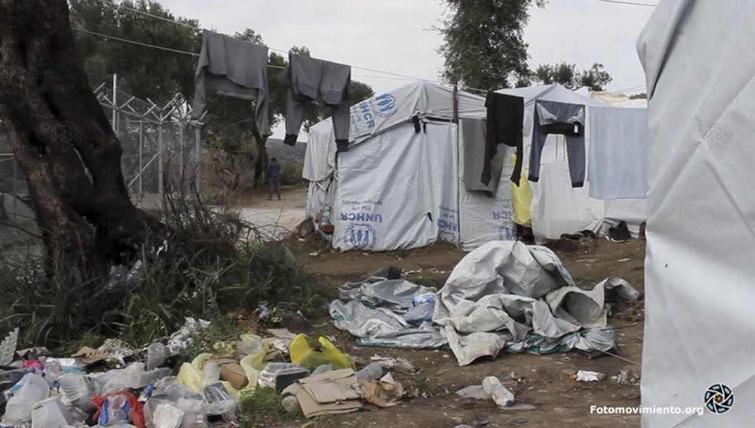

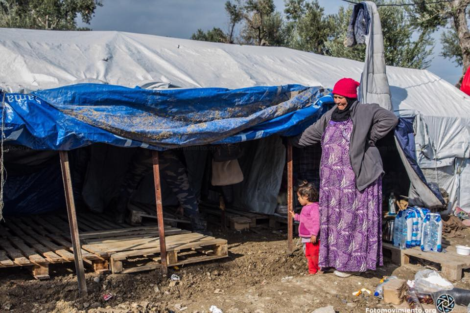

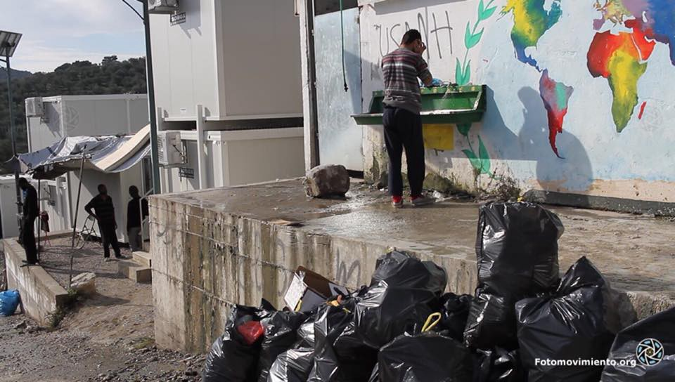

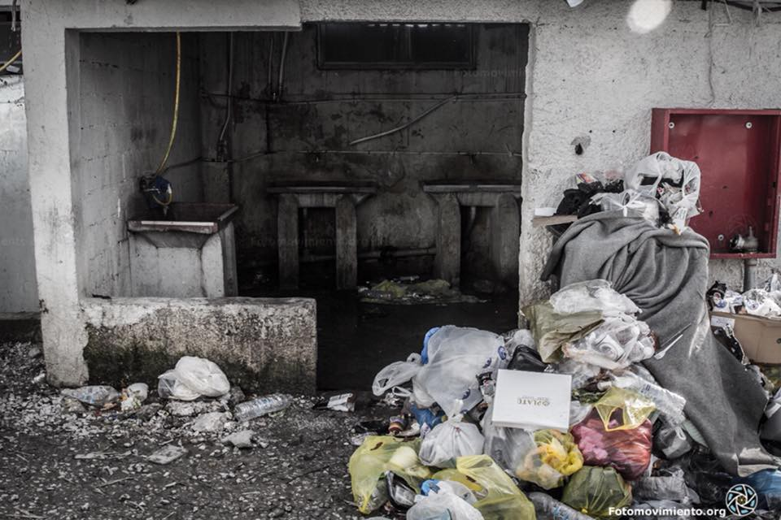

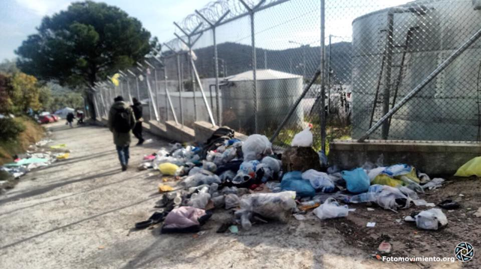

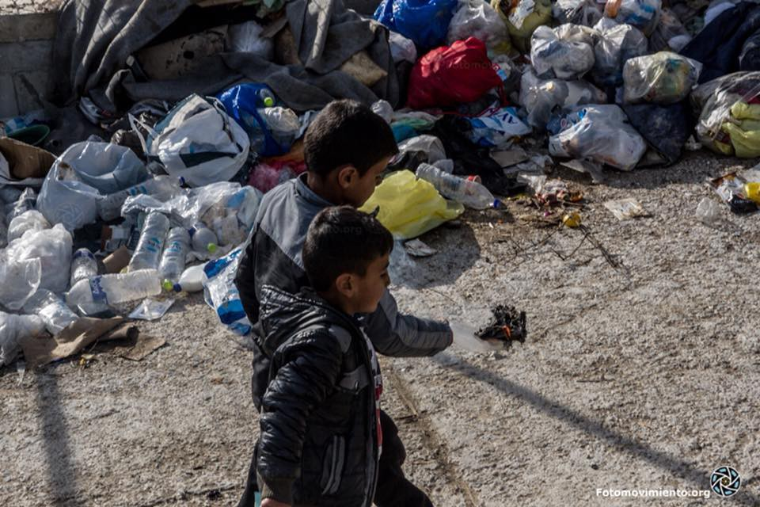

Enough is enough reports that Arash Hampay was forced to leave Lesvos\.
They [write](https://enoughisenough14.org/2018/01/15/riot-turtle-on-lesvos-and-athens-self-organized-spaces-where-people-can-live-in-dignity/) :

> “After numerous protests Arash Hampay was forced to leave Lesvos\. The UNHCR threw Arash out of his apartment in Lesvos and “offered” him to stay in a hotel in Athens\. This how the EU is silencing people who protests against the inhuman treatment of refugees on the Greek islands\. Arash is one of the most prominent victims of this kind of repression\. Others were deported and/or imprisoned\.” 

### Moria 35 crowdfunding

“Without sustained political pressure and international oversight, what hope of any semblance of equality of arms — let alone justice — can there be in the Moria 35 case, which essentially sets the claims of Greek state police forces against those of foreign migrants, already cast as inherently criminal? They will face the case against them in an unknown language, under an unknown legal framework\. Understandable fears about their own safety may prevent witnesses from coming forward\. For these reasons, the Legal Centre Lesvos is building a solidarity campaign alongside coordinating the criminal defence team of Greek lawyers who will represent the Moria 35 at trial\. Please support the campaign however you can\. Raise awareness, donate, act as an international trial observer\.”See more [here](https://l.facebook.com/l.php?u=https%3A%2F%2Fwww.opendemocracy.net%2Fcan-europe-make-it%2Fmaya-thomas-davis%2Fon-lesvos-police-violence-crushes-refugees-resistance-justice-f&h=ATN5eJNP1IMhSvs_dMO7eonRxumhU0q_e6PDNWrNEkVjIC_8FxlTGu_lSJKrbufzrI_5v6CfEg6gwt7B-XdKsSj6AP1FgpaJWwqAJIB0PpQZpJWsLbpKRCyGyPRHpTYaSmhTDpVzaaQc_GQeCFVS13dyeLgw7bE-i4b1dLIOYsaMKShqx-17e8hmAaoReJ6hdi2vbTXxcoZMcUjX62ItgSlWJj-ReOJ0HCjAIyMOohi0XodgR4We3AArvGZ32VE0EvFGqGnwAd6UmF14DetSJeuSMSNz5_aNiX4C-fOmUFZ3MTM) \.
### Chios

There are just a few grassroots groups remaining on Chios\.

The [Chios People’s Kitchen](https://www.facebook.com/chiospeopleskitchen/?fref=mentions) has existed since January 2016\. It now single\-handedly provides 150\+ warm and nutritious meals to [Refugee Education Chios](https://www.facebook.com/refugeeeducationchios/?fref=mentions) and girls/women at the Athena Centre for Women\.
### Athens — donations needed

The Pampiraiki warehouse needs help in getting more donations\.
You can help by purchasing much needed items\. This can be done through [needslist](https://needslist.co/pampiraiki-support-initiative-refugees…) \. With the decrease in funding generally, every little you can help with helps people in need\. You can also refer to the [longer list of needs](https://m.facebook.com/groups/289026728095066?view=permalink&id=586886501642419) \.
### Need for volunteers

[Dråpen i Havet](https://www.facebook.com/drapenihavet/?hc_ref=ARSZnFPAXC0jM2ClKj9n5m8UPAb_JRzSENmwCtHTsiEnQdoi_lv96xKRpJJf8RVlN6U) are in a immediately need of volunteers in the camp Nea Kavala in Northern Greece\. Some of the activities volunteers in Nea Kavala do are: Bike\-rental and training for those who need it, handing out dry food, vegetables and bread, working in “Dropshop Market” where the residents of the camp can “buy” clothes, shoes etc for fictional money, and a building program called “build and repair”, where residents can come to fix and build things with help from other residents with great experience and knowledge from construction\.

> _Are you over the age of 25 and have a chance to contribute for 10 days or more? Send an email to: Frivillig@Drapenihavet\.No_ 
 

> _For more information, visit our website [www\.drapenihavet\.no](http://www.drapenihavet.no/)_ 

#### SERBIA
### Statistics — arrivals, expulsions, asylum requests

4196 new refugees, asylum\-seekers and migrants were registered in Serbia on 14 January 2018\.

UNHCR and partners assisted 174 new arrivals, compared to 171 in the preceding two weeks\. About half of these people have arrived from Bulgaria, of whom 24% by air and 18% from Macedonia\.

For the first time in years, most new arrivals were from Iran \(30%\), followed by Iraq and Pakistan \(22% each\), and only 8% from Afghanistan\. 
61% were adult men, 13% adult women and 26% children\.

UNHCR and partners received reports of a total of 291 collective expulsions from Croatia, Hungary and Romania, \(compared to 311 in the preceding two weeks\) \. They included expulsions of eight men from Croatia and two from Hungary who claimed to have never been to Serbia before\.

In December 2017, 497 individuals registered intentions to seek asylum in Serbia\. 55% were registered by adult men, 12% by adult women and 33% for children\. Most applications were filed by citizens of Iran \(30%\) or Pakistan \(30%\), Afghanistan \(18%\) or Iraq \(12%\) \.

One person was awarded subsidiary protection, bringing the total number of positive first\-instance decisions by the Asylum Office in 2017 to 14, of which 3 received refugee status and 11 subsidiary protection, in comparison to 2016, when 19 persons were granted refugee status and 23 subsidiary protection\.

Praxis report for 2017 is also available, you can read it [here](https://www.praxis.org.rs/images/praxis_downloads/Praxis_Protection_Monitoring_Report_December_2017.pdf) \.
#### BOSNIA AND HERZEGOVINA
### New arrivals and full capacities

In the city of Višegrad and in Rudo \(a town and municipality in Bosnia and Herzegovina\) the police found seven illegal immigrants yesterday\. Three were found to be citizens of Pakistan, and 4 come from Afghanistan\.

Since the summer of 2017, the number of registered entries in Bosnia increased for over 250 percent, counting over 7000 single enteries\. Currently, all available capacities — that are not many — are full\.

People are entering Bosnia through Montenegro or Serbia\.
#### HUNGARY

Hungarian media report that Ahmed H\. was not responsible for the violence that erupted at the Röszke border crossing in September 15 according to a 40\-page transcript of more than four hours of silent surveillance camera footage acquired by Magyar Nemzet\.’ Read more [here](https://l.facebook.com/l.php?u=https%3A%2F%2Fbudapestbeacon.com%2Fahmed-h-not-incite-crowd-roszke-according-surveillance-footage%2F&h=ATPgDcgl3c7P_tqgiWIVcjjj0jeHFtzHWJsoTXtOR1iiP4AzivFhLrtCAxovCjkfs_sszl4Htymxa9I1JQ9kdncHu7hZCDzTFLV1iLpsaV4fFAJ4XmwEkz3e5TC-FmDl2EhVQpZFMASICu1ZSoXkdsMRnrDxipq7P-m8GNPcDZQgC5ErOCY6dHieNnEd-CnDQRGcI07FRo3ZNMZDhFgysr-Ef2y-eWL5IX5keYBq1sKEKZt1knSmb2c_mDc4roaOYSxDmgLwiXB_iy0sy-rHrwSaeeA_ELvi) \.
#### ITALY
### More than 15,000 unaccompanied minors arrived to the country

 of January 15](assets/d9655bc95b54/1*eLObG3pPCliHNxiN4F62GA.jpeg)

[UNHCR statistical data](https://www.youtube.com/watch?v=X2hsF6wDMMA) of January 15

UNHCR’s data documenting the situation of unaccompanied and separated minors shows that during 2017, **15,779 unaccompanied and separated children arrived in Italy by sea** , representing 13% of all sea arrivals in this period\. Similarly, 14 per cent of those arriving in the same period last year were UASC\.

The numbers of UASC arriving by sea, however, have decreased compared to last year, when over 25,846 UASC were registered at landing points, they demonstrate in latest [infographics](https://data2.unhcr.org/en/documents/download/61548) \.
#### Court of Appeal annulled the ruling of the Court of Naples resulting in a grant of humanitarian protection

A Malian national whose claim had been rejected by the Territorial Commission of Caserta as “manifestly unfounded,” lodged an appeal with the first\-instance Court of Naples which was dismissed as inadmissible\. 
[Reportedly](http://www.asylumineurope.org/news/15-01-2018/italy-court-appeal-condemns-retroactive-application-accelerated-procedure) , in order to safeguard the asylum seeker’s rights of defence, the accelerated procedure must be triggered by the Territorial Commission before a decision is taken, rather than retrospectively applied after a rejection decision has been issued following the regular procedure, the Court highlighted\.

> Accordingly, it annulled the ruling of the Court of Naples and examined the case on the merits, resulting in a grant of humanitarian protection\. The ruling brings welcome clarification to the use of the accelerated procedure, against the backdrop of several cases of [erroneously dismissed appeals](http://www.asylumineurope.org/reports/country/italy/asylum-procedure/procedures/accelerated-procedure) against “manifestly unfounded” decisions by the Court of Naples\. 

### Alarming statements

A candidate for governor of an Italian region on Monday raised a strong controversy by saying that Italy can not accept all the immigrants who want to live in the country if they want the “white race” to remain\.

Political opponents condemned the comment by Attilio Fontana, who is running in the rich region of Lombardy, with the support of a center\-right alliance\. The so called Northern League, which is a member of the centre\-right coalition leading in polls ahead of the vote vowed to stop the migrant “invasion”\.

Jewish leaders have already stated that these statements remind them of the anti\-Semitic racial laws of the time of Benito Mussolini’s dictatorship\.
#### FRANCE
### Paris

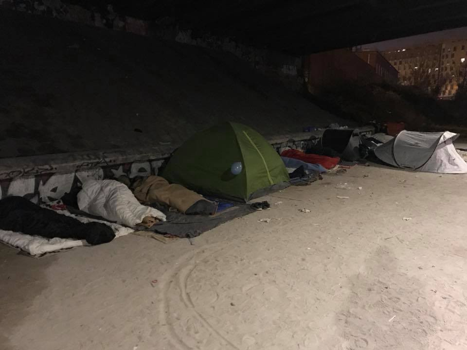

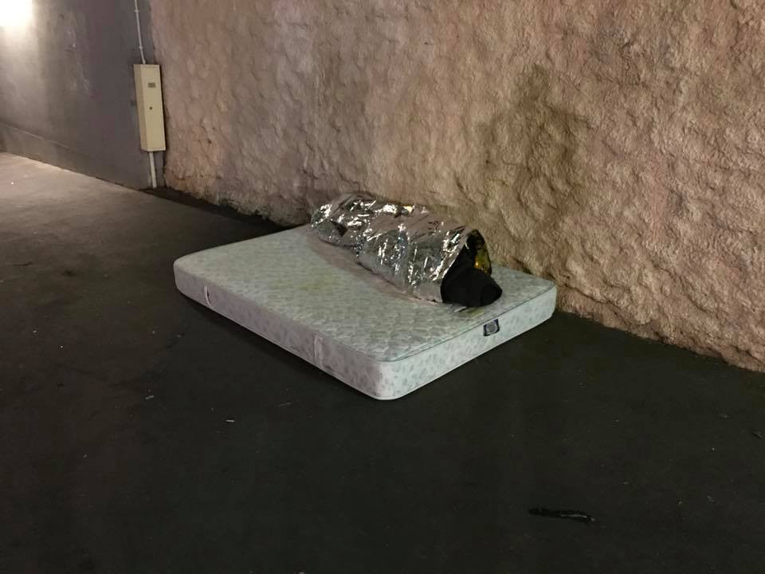

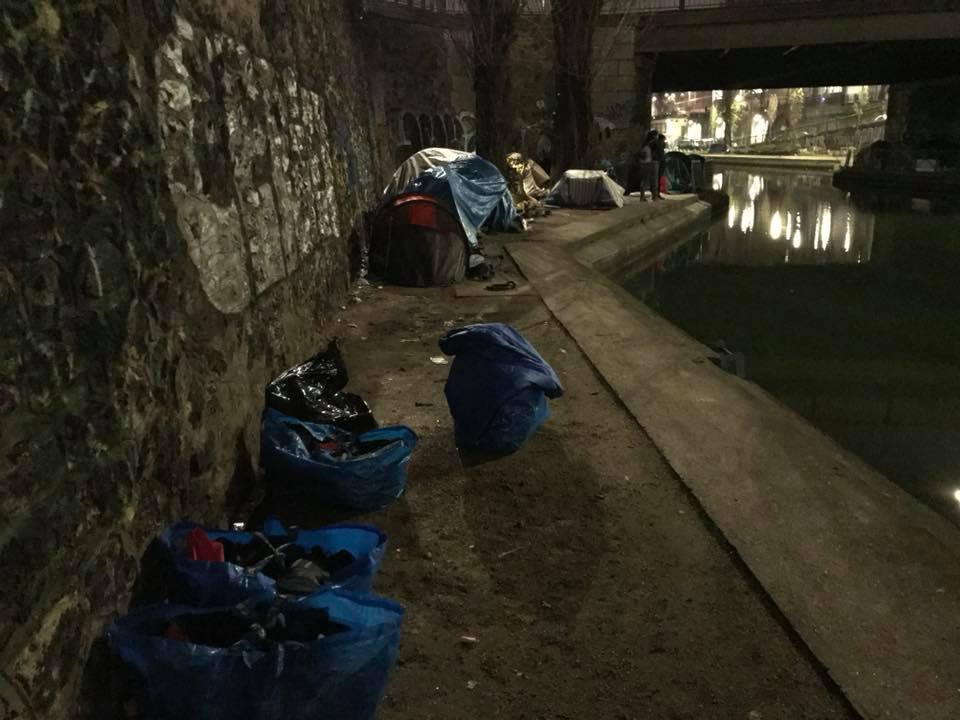

](assets/d9655bc95b54/1*xnN0_tzFL6M-ax9fsZdmVg.jpeg)

Photos: [**Merel Graeve**](https://www.facebook.com/merel.graeve)

A march to support the human rights will take place in Paris on February 3\.

### Iron fist in a velvet glove

First statements of the French president after having visited Calais are already stirring up the waters:

“ _I cannot allow the idea that the forces of order use violence\. If that is being done, it goes against all ethical obligation\. If that is being done and it’s proven so, it will be sanctined,”_ French president said on the accounts of the police violence towards the refugees and asylum seekers across the country\.

However, we were told from many volunteer sources who have been working for a long time in the Calais region that it was in fact with the arrival of Macron’s government that the police violence got harder, more persistant and frequent\.

We should hope these statements are not what they sound like — a scepticism and lack of trust that it’s true — and that they won’t just make for a pause in such police practices or simply remain empty words, but would lead to the end of the repressive mechanism forced upon the refugees and those helping them\.

Macron has promised to speed up waiting times for asylum applications while also stepping up expulsions of those who remain in France after being turned down for refugee status — an approach he touts as mixing “efficiency” and “humanity”\.

Contrary to what mr\. president perhaps wanted to achieve with the people, angry and disappointed reactions have been flooding the social media\.

> I’m sorry\. What? 

> Two options here — either Macron is completely ignorant of the situation in Calais — which would be seriously worrying — either he is trying to rewrite history — which is even more worrying\. 
 

> I strongly doubt the French president isn’t aware of what is happening on his own territory, so I’ll go with the second one\. 

> Not only is this outraging and disgraceful, it is dangerous\. This is a complete distortion of reality and we shouldn’t allow this to happen\. 

> YES police brutality in Calais happens daily and YES police’s confiscation of personal belongings is a daily reality\. 

> Mr\. Macron asked for pictures and proof that this is happening\. Here are mine\. And I am sure many others will be able to show him theirs\. \(…\) 

> Out of the 6 guys I was with, 3 of them had had their phone broken by the police\. 
 

> One had his SMASHED by the police\.
 

> Two had theirs broken whilst being BEATEN by the police\.
 

> Out of the 6 guys that I was with, the 6 of them had been pepper sprayed numerous times by the police, for no reason\.
 

> Out of the 6 guys I was with, the 6 of them had had their belongings confiscated/destroyed — blankets, jackets, mattresses, tents, you name it\. 
 

> Last July, I was with a 16 year old boy wouldn’t take off his coat when it was more than 24 degrees, because, he told me, “I can’t leave my jacket here, the police will take it”\. 
 

> And two weeks ago again, the police confiscated all of my friends’ belongings\.
 

> Out of the 6 guys I was with, the 4 of them had already been hit/beaten by the police\. 
 

> One of them had to go to the hospital as a result \(wrist pictured here\) \.
 

> Police brutality may not be done by every single policeman in Calais but it IS a reality and it IS happening daily\.
 

> To say otherwise is refusing to condemn it and allowing it to continue\. 

> In 2018, in France, I find this absolutely disgraceful\. 

> Mr\. Macron missed an opportunity to condemn these brutalities by trying to hide them instead and this is not okay\. _— [Faces Before Numbers](https://www.facebook.com/FacesBeforeNumbers/?hc_ref=ARTOgvaDjb6ciw6gtQVP1b8Z-T05SGKxW1gtemidkSRzQtj0mgI9WMGPGiBGxQJTucA)_ 

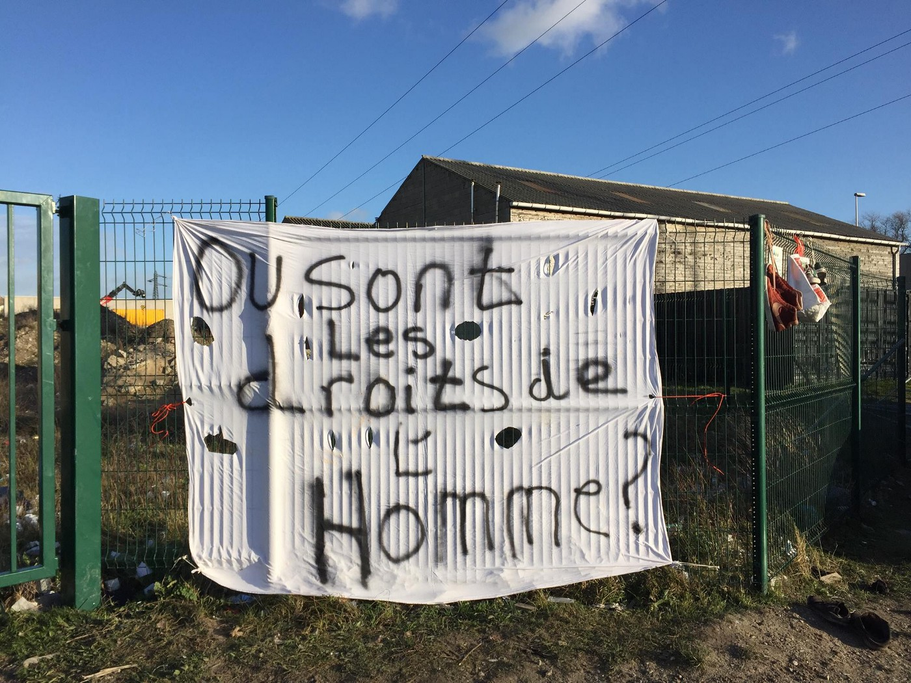

![Asylum in France is a right\.
Stop police violence\!
The Dublin agreements are against human rights\.
People are unable to find a country where they can resettle because they keep sending us back to the first country where we arrived, even if we have been rejected there\. We are happy to be in any European country where we can live and work\.
If Europe does not accept us, we want to go to Canada or to the US\.
We are not here to stay in Calais\.
We are not criminals, we just want to cross the border\.
We are wondering if Calais is part of France, there are no human rights here\.
We are not armed but the police are, and they are violent\. They beat us, they gas us, they destroy our shelters and our belongings\. They gas us even when we are sleeping\. They beat and gas also minors and women\. They cut our tents and spray our blankets and clothes with gas, making them unusable and impossible to clean\. It is too cold to sleep out without shelter\.
When temperatures drop below zero the Calais authorities open some shelters but there are not enough spaces for everybody\.
The police confiscate our documents\.
All these actions by police are illegal\.
We are not free to circulate because every time we encounter the police we can be arrested\. Sometimes they bring us to the police station then release us, sometimes they just drive very far and leave us in the middle of nowhere, sometimes they confiscate our shoes\. Sometimes they put us in detention\.
Instead of finding protection, people who have committed no crime are locked up in detention centres from where they are often deported to Dublin countries, or even to countries at war and handed over to the dictators they tried to escape\.
It has emerged that refugees deported back to Sudan from Italy and Belgium were beaten and tortured on arrival\. 80% of Afghans deported to Afghanistan leave again inside the first year because they feel not safe there\.
Mr Macron wants to double the time immigrants can be detained, and deport more people\.
All these repressive measures are not working: custom officers detected 115,000 attempts at crossing the Calais border last year and 167,000 the year 2016\. There is not much difference\. The only difference is that people have to hide, are more exposed to police violence and racist violence, cannot go to town for fear of being arrested, are invisible and are excluded from society; so we are pushed in ever more dangerous and even life\-threatening situations\.
No matter how much money the UK government spend in securing the border, people will keep trying to cross because they want to save their lives\.
Five refugees have died trying to cross the Calais border in the last two months including a minor, and two were seriously injured\. These are the ones we know of\.
We want to ask Mr Macron: where are our human rights? Where are Liberte’, Egalite’, Fraternite’?
We are here because of war and dictators, we are not ‘economic migrants’\.
Why is Mr Macron allowing the sale of arms to different countries at war and to dictators?
Mr Macron is encouraging the Libyan authorities to stop migration to Europe and this is causing people to die unnecessarily, to be detained in horrible conditions and to be sold in the slave markets\. \(Photos: [One World: OPEN the borders](https://www.facebook.com/noborders1world/?hc_ref=ARSjCOse0hp95SIdpXShFO9jAM-6XW8t6zUxXLzmlaaNI1DdyGXiT76wzaHamIqj8xs) \)](assets/d9655bc95b54/1*prFl44teExK6Yj3ArshvZQ.jpeg)

Asylum in France is a right\.
Stop police violence\!
The Dublin agreements are against human rights\.
People are unable to find a country where they can resettle because they keep sending us back to the first country where we arrived, even if we have been rejected there\. We are happy to be in any European country where we can live and work\.
If Europe does not accept us, we want to go to Canada or to the US\.
We are not here to stay in Calais\.
We are not criminals, we just want to cross the border\.
We are wondering if Calais is part of France, there are no human rights here\.
We are not armed but the police are, and they are violent\. They beat us, they gas us, they destroy our shelters and our belongings\. They gas us even when we are sleeping\. They beat and gas also minors and women\. They cut our tents and spray our blankets and clothes with gas, making them unusable and impossible to clean\. It is too cold to sleep out without shelter\.
When temperatures drop below zero the Calais authorities open some shelters but there are not enough spaces for everybody\.
The police confiscate our documents\.
All these actions by police are illegal\.
We are not free to circulate because every time we encounter the police we can be arrested\. Sometimes they bring us to the police station then release us, sometimes they just drive very far and leave us in the middle of nowhere, sometimes they confiscate our shoes\. Sometimes they put us in detention\.
Instead of finding protection, people who have committed no crime are locked up in detention centres from where they are often deported to Dublin countries, or even to countries at war and handed over to the dictators they tried to escape\.
It has emerged that refugees deported back to Sudan from Italy and Belgium were beaten and tortured on arrival\. 80% of Afghans deported to Afghanistan leave again inside the first year because they feel not safe there\.
Mr Macron wants to double the time immigrants can be detained, and deport more people\.
All these repressive measures are not working: custom officers detected 115,000 attempts at crossing the Calais border last year and 167,000 the year 2016\. There is not much difference\. The only difference is that people have to hide, are more exposed to police violence and racist violence, cannot go to town for fear of being arrested, are invisible and are excluded from society; so we are pushed in ever more dangerous and even life\-threatening situations\.
No matter how much money the UK government spend in securing the border, people will keep trying to cross because they want to save their lives\.
Five refugees have died trying to cross the Calais border in the last two months including a minor, and two were seriously injured\. These are the ones we know of\.
We want to ask Mr Macron: where are our human rights? Where are Liberte’, Egalite’, Fraternite’?
We are here because of war and dictators, we are not ‘economic migrants’\.
Why is Mr Macron allowing the sale of arms to different countries at war and to dictators?
Mr Macron is encouraging the Libyan authorities to stop migration to Europe and this is causing people to die unnecessarily, to be detained in horrible conditions and to be sold in the slave markets\. \(Photos: [One World: OPEN the borders](https://www.facebook.com/noborders1world/?hc_ref=ARSjCOse0hp95SIdpXShFO9jAM-6XW8t6zUxXLzmlaaNI1DdyGXiT76wzaHamIqj8xs) \)
### Calais mayor attacks again

“Aid organisations were capitalizing on the plight of the community of displaced persons living rough in the area”, said Natacha Bouchart to the French media, attacking again the NGOs and volunteer teams present in the area\. 
Whether this was to serve as a defence prior to Emmanuel Macron’s visit to Calais or if it is just yet another attack to shift the blame, it needs no reminding that, just as in Greece, the organizations and individuals helping wouldn’t have been needed to that extent had the officials been handling the matter in a proper way\. [Here](https://medium.com/the-warehouse-calais/mayor-of-calais-accuses-refugee-aid-organisations-of-using-migrants-to-exist-e4a02f4ec058) is another viewpoint of Bouchart’s statements\.
#### DENMARK

For 10 years, the _bedsteforældre for asyl_ movement has fought against the degradation and humiliation of refugees\. Every Sunday during the entire year they have demonstrated in front of Sandholm \( the first reception/asylum center and previous deportations centre\) and several other places in the country\.

On Sunday, January 14 they have moved the demonstration from in front of Sandholm to deportation center Sjælsmark to protest that children should not be forced to stay under prison\-like conditions\. They insist the children are taken out of the centres\.

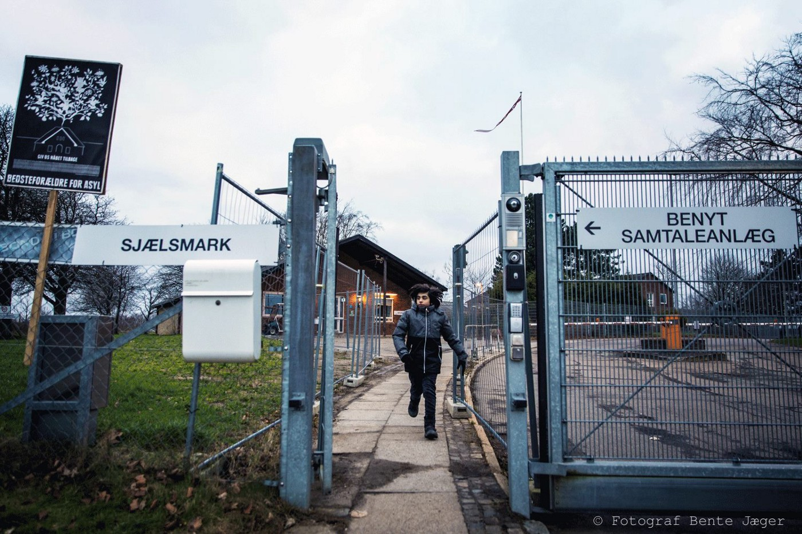

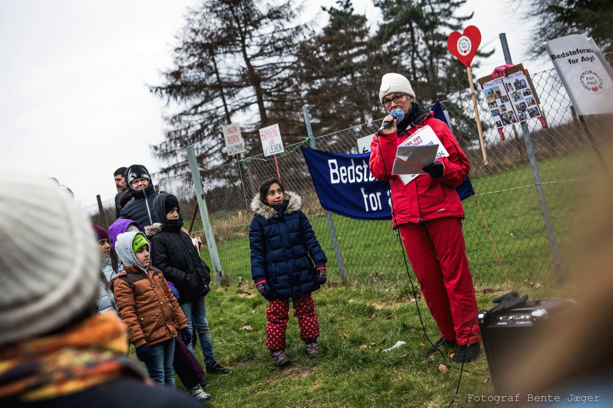

“Grandparents for asylum” hold a hearing on rejected asylum seekers’ and their children’s right in these horrible and expatriation centers\. It takes place on Thursday 25 January at 14–17 in the community hall at Christiansborg\.

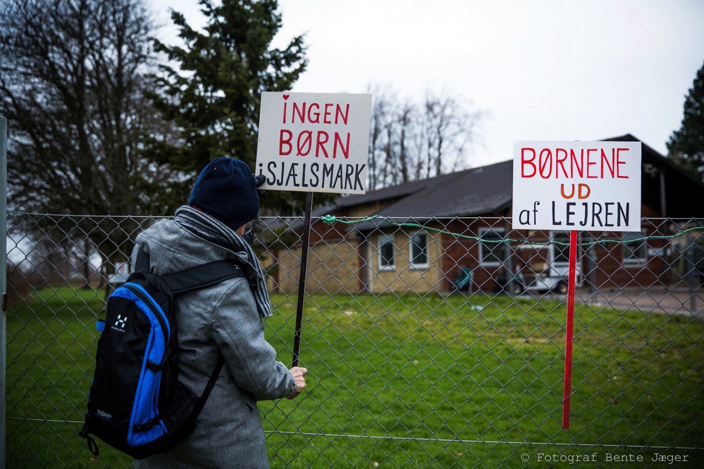

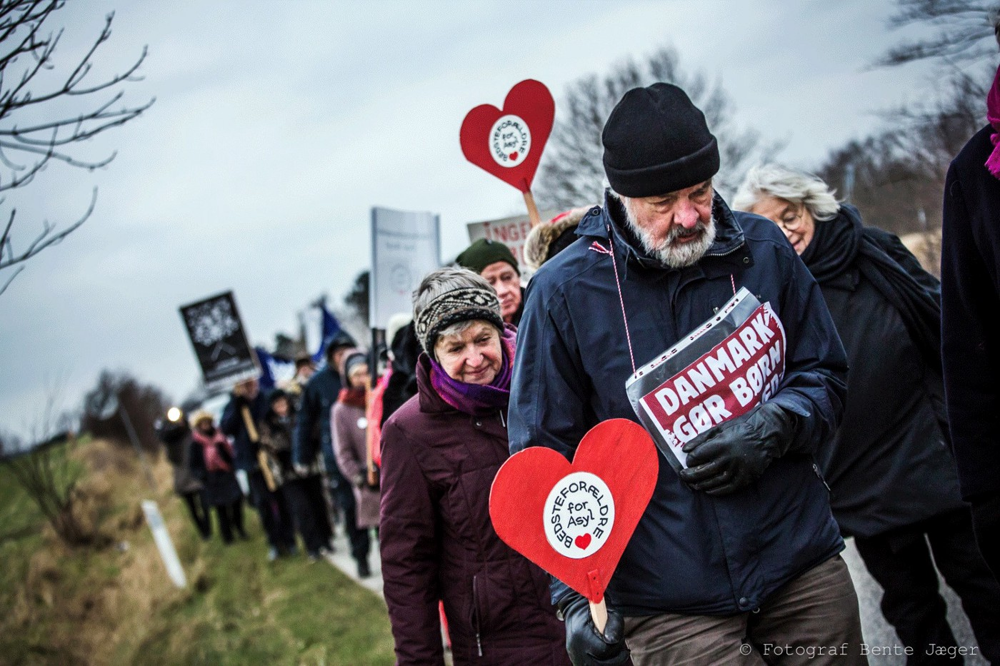

Photo credits: Bente Jaeger
### New rules in family reunification

The new regulations proposed by the Danish government in the field of family reunification would make it more difficult for certain groups in Denmark to bring partners to the country and easier for Danes based abroad to move back home with foreign spouses\.
The new requirements would be integration\-focused, with applicants required to fulfil four out of six to qualify for family reunification\.
Individuals applying for partners to be granted family reunification would be required to pass a high\-level Danish language test\. Additionally, both partners must meet three out of five further requirements\.
The five further requirements are based on areas such as employment and education, Danish [media report](https://www.thelocal.dk/20180116/danish-family-reunification-should-discriminate-based-on-language-skills-government)

\.
#### UK
### Women Asylum Seekers Together in London

A new [support group](http://www.refugeewomen.co.uk/support-refugee-women/) for lesbian and bisexual women who have sought asylum in the UK was started recently\. The group meets at 12\.30pm on Mondays near Old Street \(London\), providing a safe and welcoming space for women to benefit from confidential support\. Travel expenses paid\. 
For more info contact Sarah: 07950 118 998
### Financial support for the refugees in the UK

Refugee Action [stated](https://www.refugee-action.org.uk/home-office-announces-small-increase-asylum-support/) that, with soaring inflation and no increase to asylum support over the past three years, the increase of 80p for the asylum seekers that was mentioned in the [Home Office’s announcement](https://www.gov.uk/government/uploads/system/uploads/attachment_data/file/673545/Report_on_review_of_cash_allowance_paid_to_asylum_seekers_-_2017_-_final.._.pdf) should have gone much further — to at least 70% of mainstream benefits\.

> “More people seeking asylum are waiting longer for their asylum claim to be processed\. During this time, which in some cases can be years, people are left unable to work and struggling to survive on just over £5\.00 a day\.
 

> This takes a tremendous toll on the wellbeing of people who have fled conflict and persecution\. Expecting people to survive on so little is incompatible with a compassionate asylum system\.” 

### Immigration after Brexit

The public should have more of a voice in the debate on Britain’s immigration choices after Brexit, according to a [new report from the National Conversation on Immigration](http://www.britishfuture.org/articles/national-conversation-interim-report/) , the biggest\-ever public consultation on the issue — released as Parliament’s Home Affairs Committee publishes the report of its own inquiry on immigration

> **We strive to echo correct news from the ground through collaboration and fairness\.** 

> **Every effort has been made to credit organizations and individuals with regard to the supply of information, video, and photo material \(in cases where the source wanted to be accredited\) \. Please notify us regarding corrections\.** 

> **If there’s anything you want to share or comment, contact us through Facebook or write to: areyousyrious@gmail\.com** 

_Converted [Medium Post](https://areyousyrious.medium.com/ays-daily-digest-16-1-17-tuesday-brought-largest-number-of-people-rescued-in-2018-d9655bc95b54) by [ZMediumToMarkdown](https://github.com/ZhgChgLi/ZMediumToMarkdown)._
