### AYS DAILY DIGEST 17/01/2018: “Migration organizer fee” could be introduced in Hungary

_Weather alert for the Mediterranean // Reports from Lesvos and Chios // Conditions in Spain for new arrivals not much better than in Greece // Art for and by people on the move // Calls for protests and actions against deportation in Germany and the US_

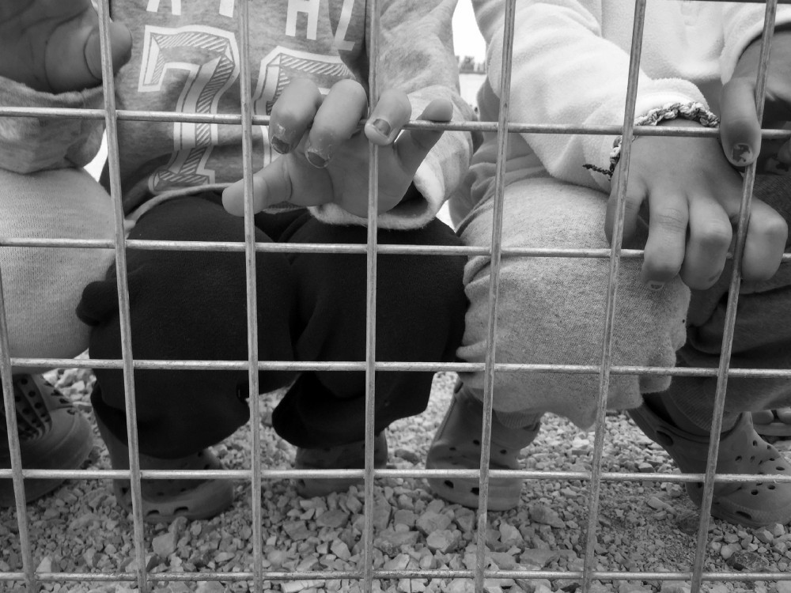

Photo by Keegan Nashan for AYS
### Feature

**Law proposal that sanctions activism and civic society**

Civil society in Hungary needs support from all over Europe in order to fight the latest proposal outlined by interior minister Sandor Pinter\.

He wants to introduce the law that will, among other things, sanction groups who are working with people on the move and who are receiving foreign donations\. According to this proposal, such groups would have to register with the courts and, if they get more than half of their funds from foreign sources, pay a 25\-percent tax on those funds\.

In addition, the government would charge such NGOs a “ [migration organizer fee\.](https://budapestbeacon.com/magyar-idok-government-tax-migration-advocacy-ngos/) ”

Additionally, restraining orders could be issued against Hungarian citizens considered to be “organizing illegal migration,” that would prevent them from going within eight kilometers \(five miles\) of Hungary’s Schengen borders, those with countries outside the European Union, like Serbia and Ukraine\. This may affect the media and number of volunteers who are in that area\.

At the border with Serbia, there are two container camps for asylum\-seekers called [transit zones](ays-special-inside-the-hungarian-closed-camp-98aec8c3e289) \. Conditions in these camps are dreadful and many reports are describing police violence\.

The new laws would apparently not apply to religious charity groups or the Red Cross, which distribute food, medicines and other aid to migrants\.

The new law proposal is coming less than three months ahead of a general election\.

The first reaction coming from the part of the civil rights organizations was that the law is aiming to conflate NGOs campaigning for refugees rights with groups organizing illegal people\-smuggling\.

The group that could be most affected is the Hungarian Helsinki Committee\. They are already suing the government for defamation over claims that the group assists illegal immigration\.

Additionally, Mate Szabo, programme director at the Hungarian Civil Liberties Union, [said that the main enemies](https://www.ft.com/content/4a591f56-fba7-11e7-9b32-d7d59aace167) identified by the government are civil society groups who are critical of their policies and promote the fundamental rights of asylum seekers\.

The government describes this draft law as the “Stop Soros Actâ,” alluding to the Hungarian\-American billionaire George Soros whose foundation supports numerous NGOs around the world\.

Annual Freedom House [Freedom in the World Report](https://freedomhouse.org/sites/default/files/FH_FITW_Report_2018_Final_SinglePage.pdf) describes Hungary as the weakest democracy in the European Union\.

The report notes that in Hungary, as well as in Poland, the government uproots democratic institutions and intimidates critics in civil society\.

We can just hope that the law will not pass, but even more that other EU countries will not follow the Hungarian example like they have done in the case of sealing their borders or violence against refugees and migrants\.
### General

The new year did not start well in Europe\. Even though many big NGOs, including IOM and UNHCR, but also governments are trying to present the situation in a positive light while comparing numbers of new arrivals and deaths of asylum seekers with the last years\. Their claims are that numbers are going down\.

The aim is to create the picture that the problem is almost gone and that only a small number of people are trying to reach the EU\. Unfortunately, for these organizations as well as for political leaders, people are just numbers\.

[The Missing Migrants Project](https://www.iom.int/news/mediterranean-migrant-arrivals-reach-1916-2018-deaths-reach-194) recorded **18 deaths in the Western Mediterranean** since the beginning of the year\. **Seven migrants died trying to reach Spain** ’s Canary Islands from North Africa on 15 January\.

On 11 January, a **26\-year\-old Afghan man was hit by a vehicle** in the A14 motorway near Castel San Pietro in Bologna, Italy\. A couple of days later, on 14 January, **a 28\-year\-old Gambian man died after being electrocuted on the roof of a train** traveling from Ventimiglia in northern Italy to Menton, France\.

Even one life lost due to closed borders is one too many and shows that this policy seriously does not work\.
### Turkey

Authorities in this country continue trying to prevent people from leaving\. [According to reports](http://harekact.bordermonitoring.eu/2018/01/14/101-migrants-were-stopped-in-the-aegean-sea/) , **101 people were caught in Izmir’s Dikili and Çeşme districts** , while they were trying to cross into Greece\. Most of them were from Syria\.

Of these, 40 children and 19 women will be sent to the Provincial Directorate of Immigration\.
### Greece

It seems like weather conditions will be rough over the next 24 hours\.
Any crossing in this weather would be extremely dangerous\.

The crew of ProActiva Open Arms was, like every day, out in the sea yesterday\.

### REMINDER: HYPOTHERMIA GUIDELINES

With the weather so cold, please review these guidelines for dealing with hypothermia if you are working on the islands in Greece\.
It is critical to distinguish between degrees of hypothermia, because the treatment is very different, and if you apply treatment for mild hypothermia to someone with acute symptoms, they could die\.

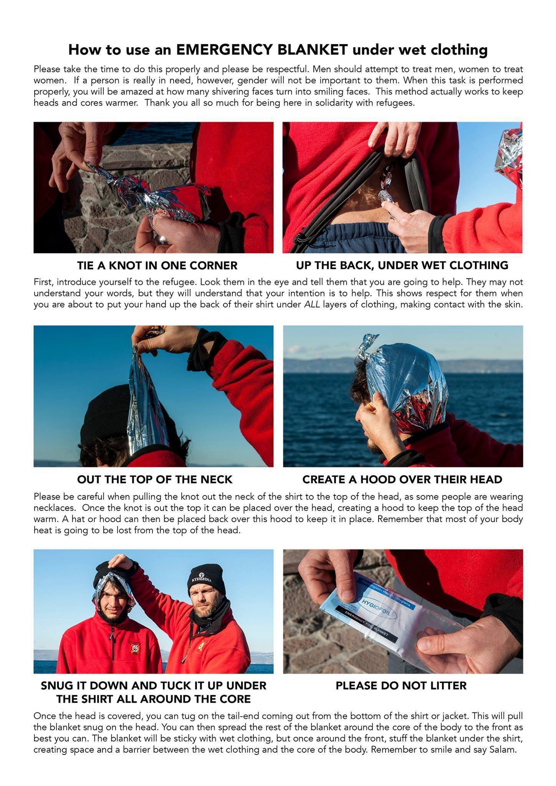

Overview:
[http://bit\.ly/lesvolhypothermia](http://bit.ly/lesvolhypothermia) 
How to use an emergency blanket with wet clothes:
[https://bit\.ly/lesvolblanket](https://bit.ly/lesvolblanket) 
Slides about CPR and AED for hypothermia patients:
[http://bit\.ly/lesvolhypothermia](http://bit.ly/lesvolhypothermia) 
These and other useful links live at [http://greecevol\.info/notes\.list\.php](http://greecevol.info/notes.list.php) \.

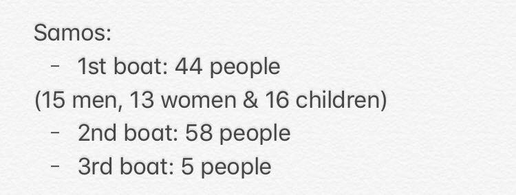

By Eric Gerhardsson, AYS

Registrations/Transfers \(Official\) 16\.1\.

Lesvos 0 / 17
Chios 0 / 7
Leros 0 / 6
Total 0 / 30

UNHCR published its [latest data](https://data2.unhcr.org/en/documents/download/61587) showing that in December most of the new arrivals to Lesvos and Samos were children and women, and they are coming from Syria and Iraq\.

After the arrival, people are placed endlessly in appalling conditions in overcrowded camps on the islands\. [FotoMovimento 15m](https://www.facebook.com/Fotomovimiento.org/) , who are at Lesvos presently, report about people who are sick, pregnant women and newborn babies in the Moria camp\.

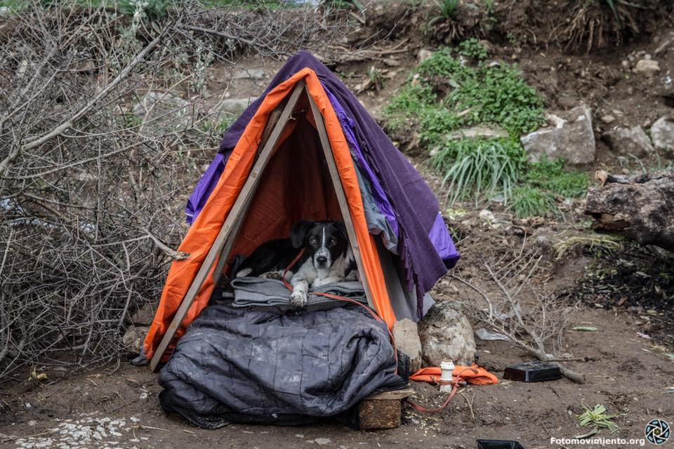

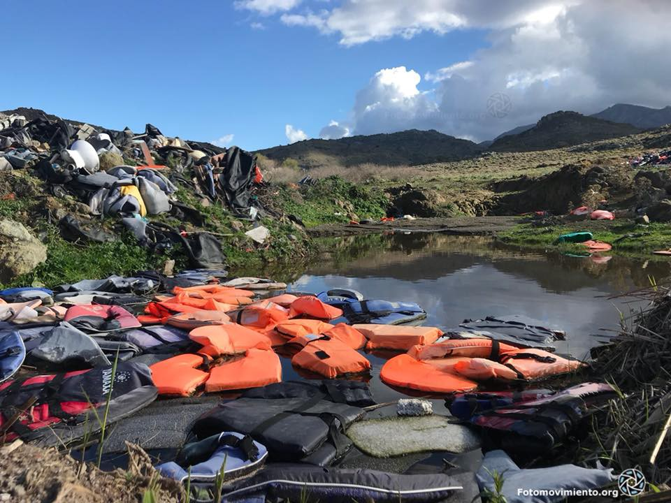

A family of the field that has adopted a dog that was abandoned\. They have built a beautiful and warm house\. \#Europe does not take care of people but they take care of the animal as if it were a child\. How much to learn from all these people\.

“In \#Moria, there are not enough bathrooms for everyone and around the smell of excrement is unbreathable\. There are people who build their own\. It is a token of dignity to the misery and cruelty to which they are subjected\.”

[The Timber Project](https://www.facebook.com/thetimberproject.org/?fref=mentions) is installing insulated floors underneath the tents to lift them out of the freezing groundwater and sewage, which swamps the camp\. Tents are given by the UNHCR, but they obviously did not think about this and instead leave people to sleep on the ground\.

> “Flooring is only one small component in the massive challenge of making Moria more humane\. The need for further projects here on Lesvos is pressing and almost endless\. Each floor has cost €240, with a total material project cost of €27,000 — all just to offer people a basic wooden floor to sleep on\. The scale of the situation means our resources are stretched to breaking point\. Never before have your donations been more valuable\.” 

If you can help them to continue with this winterization project in Moria, please go [here](https://helprefugees.org/donate/ https://www.facebook.com/HelpRefugeesUK/posts/552217045138973) \.

The situation remains dire in the Vial camp on Chios, too\. “Conditions are subhuman,” volunteers are reporting\.

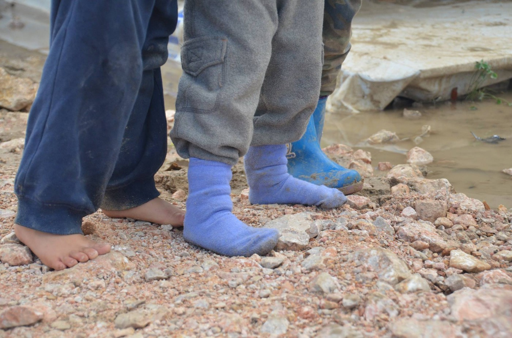

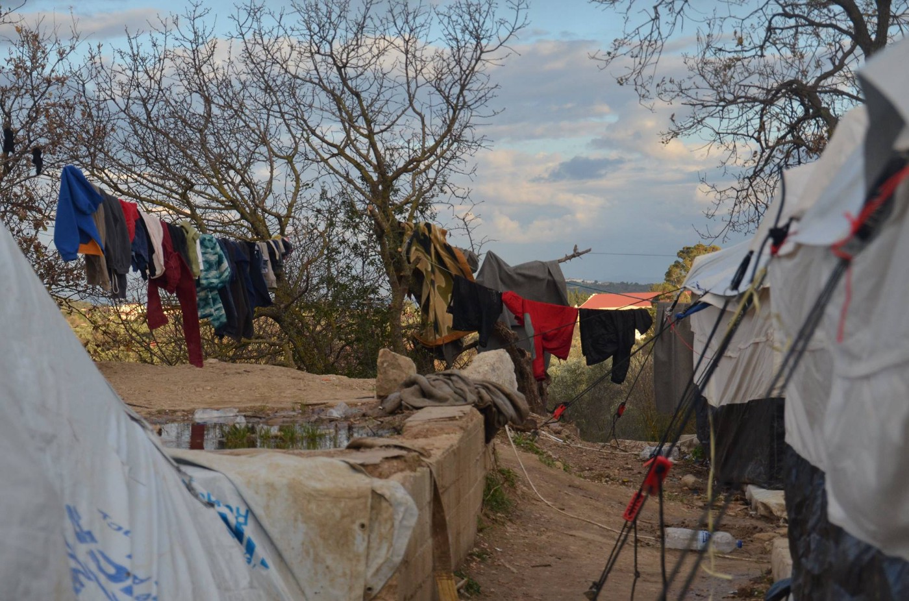

Photo Holes in the Borders

Meanwhile, the Economic Committee of the Municipality of Chios filed an application trying to prevent further construction of the Chios Reception and Identification Center at VIAL, in the village of Chalkios on the island\.
#### Athens

[Hope Café Clinic](https://www.facebook.com/events/142269063114185/) in Athens, with Team Kitrinos
A doctor and nurse team is available every Sunday 12\.00–16\.30\. 
Some medication available\.
All welcome, registered or unregistered\.

The medical team at [City Plaza is in need of doctors](https://www.facebook.com/sol2refugeesen/posts/1813858778906457) \(GP or pediatrician\) and nurses\!

[Truck Shop](https://www.facebook.com/truckshopfreeshop/posts/2010065922564291) in urgent need of volunteers, too\.

[Khora Community Center](https://www.facebook.com/KhoraAthens/) needs female German teachers to teach a women only class\. We take teachers with little or lots of experience, no certificate required\. We provide teachers with teaching resources and educational support\!
Please send an email to [khora\.education@gmail\.com](mailto:khora.education@gmail.com) if you are interested or have any further questions\!

[On Saturday at 13:00 a demo](https://www.facebook.com/nobordersnetwork/photos/a.659757107425518.1073741827.657905327610696/1626613300739889/?type=1&theater) in memory of 27\-year\-old Shehzad Loukman, a Pakistani asylum seeker who was killed 5 years ago by two persons with a connection to the neo\-Nazi Golden Dawn party, will be held in Athens\.

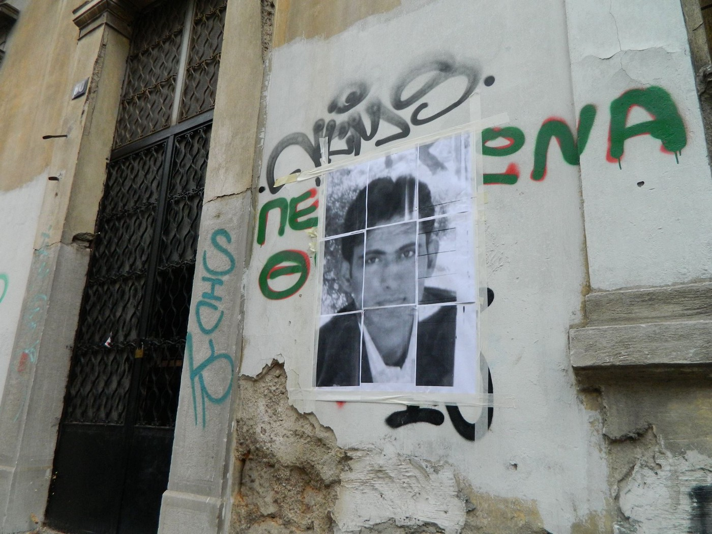

Phoot by Katja Lihtenvalner\.

Shehzad Luqman, who had been working in Greece for five years, was stabbed seven times as he made his way to work on his bicycle in the early hours of 17 January 2013 in the western Athens suburb of Petralona\.

The two, who denied Golden Dawn membership, were riding a motorbike and claimed the killing followed an argument over who had the right of way\. But the prosecutor argued the stabbing was a premeditated hate crime\.

The accused men were arrested a few hours after the murder when a taxi driver who witnessed the attack reported their motorbike numberplate to police\. During the reading of its verdict, the court did not classify the act as a “racist crime”\. However, the presiding magistrate said the court’s judgment will become obvious from the published version of the decision\.

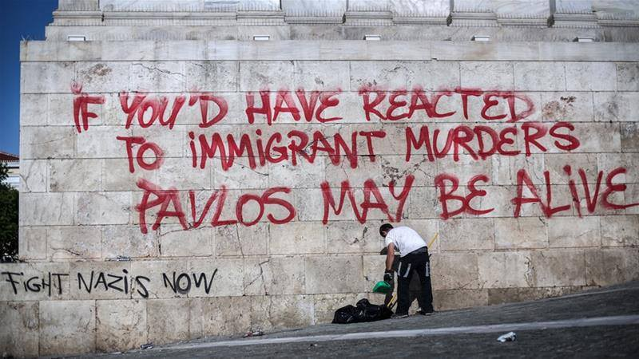

By No Border Athens
### Spain

The [new report](http://www.asylumineurope.org/sites/default/files/resources/informe-frontera-sur.pdf) by the Spanish Commission of Aid to Refugees \(CEAR\) writes that the state response to the reception of people arriving by sea during 2017 has been “arbitrary”\.

According to UNHCR figures, the number of people arriving in Spain by boat in 2017 reached 22,103\. The majority came from Morocco, Algeria, Côte d’Ivoire, and Guinea\.

Some people were automatically detained upon arrival in police stations where conditions are described as “substandard”\. Just one of the examples of these conditions given in the report is from the Málaga police station where there is no access to natural light and no protection offered from either heat or cold\.
### Bulgaria

The [Bulgarian Prison Association](https://www.facebook.com/BulgarianPrisonersAssociation/?hc_ref=ARTcOm4UY2kI5BCWcO7Dv2LyzWFGrkoGGAJh8Z7N4YPlYf_yeJAfY78q7RwJ0nzblf4) issued a statement warning about the violations of human rights of people in prison, including refugees and migrants\.

They report about the prison in Sofia where a new\-old director was appointed\. He was dismissed in 2014, and put back in the position in April 2017\.

> “2\.5 months later there was a public rape in the courtyard\. Not a single guard or director has been punished for torturing prisoners\. In this case the asylum seekers\.” 

Their post shows some photos of people being tortured stating that they are asylum seekers beaten by guards in Sofia Prison while they slept\.

Currently, Bulgaria is presiding over the EU\.

Better stories from Bulgaria\!

“Don’t judge a book by its cover” is a slogan by the [Human library](http://humanlibrary.org/) , “a place where people meet other people sharing their stories…It is designed to build a positive framework through dialogue… It’s a place where stereotypes and prejudices are destroyed and difficult questions are expected and answered\.”

If in Sofia on Sunday 28th of January, you can be part of the event ‘Wonders of Migration’ which aims at underlying the positive impact of migration on the society\.

Sunday 28th January from 1 pm to 4\.30pm at Dom na Kinoto — Cinema House, улица Екзарх Йосиф 37, 1000 Sofia Center\!

This event will be part of the [No more war festival](https://web.facebook.com/events/228722917668693/) \.
### France

On Thursday, the French president and UK prime minister will re\-negotiate the Le Toquet accords by which UK immigration controls are in France\.

France wants Britain to provide more money and resources to tackle migration and has suggested that the Le Touquet accord may have end if a compromise or a new set of arrangements can’t be reached\.

Under Le Touquet, Britain has its border in France and France runs border checks in Britain, a deal that French officials say favors the United Kingdom\.
Customs officers detected 115,000 attempts at crossing the Calais border last year and 167,000 in 2016\.

Again, people are different than their governments\.

[Care4Calais](http://www.care4calais.org) volunteers visited an elderly French couple who have converted their house into a day center for refugees who sleep rough locally\. Around 30 people, mostly Sudanese, come each day to rest, wash and eat at this place near a small French village\.

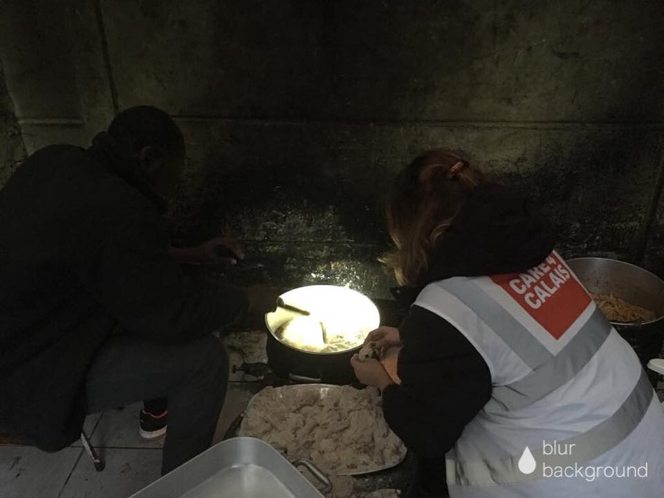

By Care4Calais

Paris remains a nightmare for many people\. [Volunteer Zeborah Zeb](https://m.facebook.com/story.php) brings a short story and photos about one night in the streets of the capital of France\.

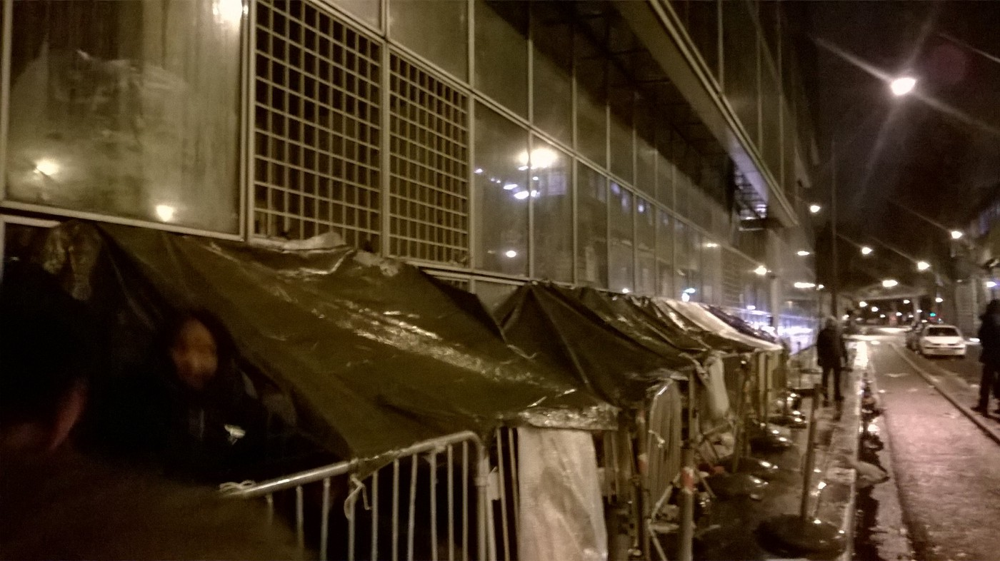

> “Last night was a great night\. We finished at 5 am but I’m not tired because my energy and enthusiasm were refreshed\. We gave boots to men whose feet were so wet they no longer noticed when they were walking through puddles\. We gave boots to everyone in a small camp in Jaures\. It took hours but it was light\-hearted and we got time to chat… 

> Less hopeful is the story of another young man, aged 24, who has his papers, has a job but can’t find anywhere to live\. He’s caught in a bureaucratic nightmare that means he’s not allowed to live in the town where he has worked so he lives on the streets and visits the town where he’s supposed to live to sign in…” 

Girls from [SolidariTea](https://www.facebook.com/refugeesolidaritea/posts/1247282012040219) last week raised £257 to support the guys under the bridge — this is enough to buy enough pieces of fruit for 180 people for two weeks\.

> “Every morning we arrive under the bridge with biscuits, fruit, gallons of hot milky chai and big smiles\! \(We have been described this week as ‘chipper’\) \! \! We spend a couple of hours socializing, listening to people’s stories and sharing moments of understanding\. We have been able to really connect with some of the guys who now feel able to trust us with more than their names and where they come from\. We have some trusty helpers that are waiting when the van arrives to carry all the heavy tea paraphernalia\. As of this week, we have installed water carriers that we refill twice daily under the bridge so the guys have access to some drinking water\. 

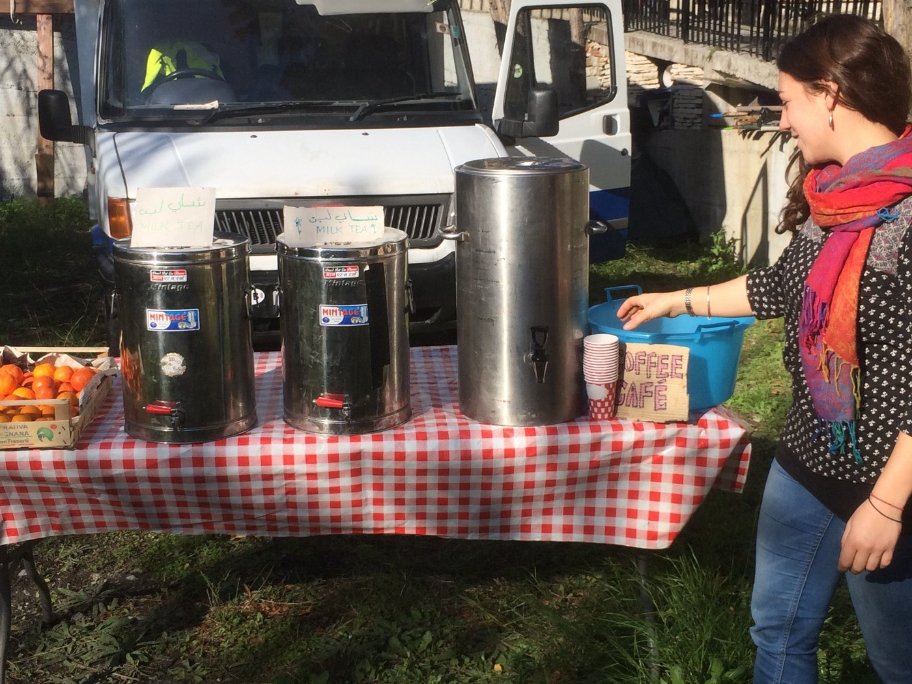

Photo by SolidariTea

> More and more children are arriving\. We spend time playing with them, engaging them with something more than a dusty tuna can\. The cooks from the mountains have started to provide ‘baby food’ every evening — so far it has been rice and pureed vegetables\. This is very gratefully received by their parents\. 

> We have recently been updated on the local law concerning the refugees\. We are anticipating ‘clean up’ actions to take place over the next few days\. Tomorrow the authorities will ‘clean’ the arches of the bridge where men have made makeshift shelters with cardboard to protect them from the wind\. The Red Cross camp’s capacity is dwindling so they are looking to take on more people — however, despite the conditions under the bridge, not many want to move\. No\-one wants their fingerprints on EU systems\. We hope that the ‘clean up’ is peaceful and no one is taken against his or her will…\. I hope that another ‘eviction’ is not on the horizon\.” 

> [Good Chance Theatre](https://www.goodchance.org.uk/volunteer) is returning to Paris from January — March 2018\. Check on what they do and how you can join them\. They are looking for “bold, talented and creative volunteers for our new temporary theatre in Porte de la Chapelle, Paris\.”
 

>  
 

> “Working alongside refugees, migrants and local artists, our volunteer team will help to create an ambitious and surprising weekly programme of artistic work, ranging from theatre, music, and dance, to sculpture, poetry and puppetry\. Each Saturday, we will stage a Hope Show, celebrating and showcasing all the incredible work made during the week\.” 

Please send a few lines about yourself and why you’d like to be involved and the dates that you can join us to [danica@goodchance\.org\.uk](mailto:danica@goodchance.org.uk) \.
### Germany

On Tuesday, 23 January, people are to be deported from Düsseldorf Airport to Afghanistan, Kabul\.

Dusseldorf Alliance “Afghan outcry”, in association with refugees of all backgrounds and human rights activists, as well as numerous other initiatives and organizations from North Rhine\-Westphalia \(NRW\), are calling for protests at Dusseldorf main station\.

▪ Date: Tuesday, January 23, 2018
▪ Time: 4 pm in front of Dusseldorf main station \(Hbf\)
▪ 5 pm at Dusseldorf airport, passengers’ hall, Terminal B

[Further information](https://enoughisenough14.org/2018/01/17/deportation-alert-and-call-for-protests-in-dusseldorf-germany/) \.

A group of Syrian women [adapted the Euripides’ tragedy “Iphigenia](http://theregion.org/article/12491-ancient-greek-tragedy-tells-timeless-story-of-syrian-flight) ”, using a play set during an ancient war to bring Berlin audiences closer to the plight of women driven from their homeland by conflict\.

The play, staged this month and next in Berlin’s historic Volksbuehne, is an adaptation of Euripides’ 2,500\-year\-old story of a princess sacrificed by her father, the Greek King Agamemnon, to placate an angry goddess\.

Nine Syrian young women living in Germany stood on the stage last Friday, telling their personal stories of escape and of their lives in a new country in this adaptation of a play set on the eve of Agamemnon’s 10\-year war to capture the city of Troy\.

It is the third part of an international theatre project aimed at showing the lives of displaced Syrian women, inviting audiences to identify them as individuals rather than as refugees from a war\-torn country\. The first two episodes were performed in Jordan and Lebanon in 2013 and 2014\.
### Denmark

[https://www\.facebook\.com/welcome2dk/posts/1925929481069235](https://www.facebook.com/welcome2dk/posts/1925929481069235)

11 people were deported to their home countries, even though they were seriously ill\. The foreigners and integration minister Inger Støjberg admitted this mistake, and agreed in a consultation that her ministry had wrongly treated asylum cases for people who are ill\. The first person, 30\-year\-old Naser Hosseini from Afghanistan, is now back\.

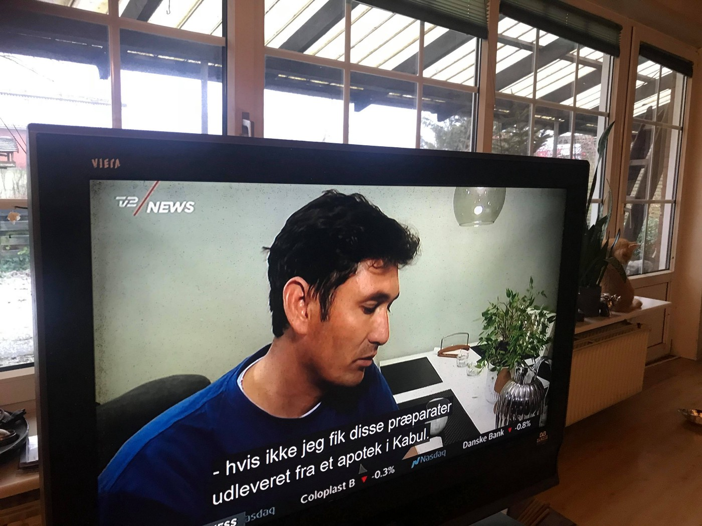

“Everything was hard down there,” says Naser Hosseini at Copenhagen Airport\.

He was deported last February after being given humanitarian residence in Denmark in 2010 due to a heart failure condition\.
### US

The US is considering removing protection for Syrian refugees, possibly sending nearly 7000 people back to Syria\. [This is the call for action](https://www.facebook.com/events/389231364867886) \.

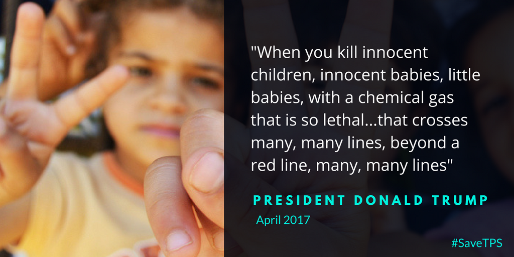

> “We agree with President Donald J\. Trump that gassing your own people, as \#Syria’s Assad has done multiple times, crosses “many, many lines\.” So, how could we send 6,900 Syrians back to a country governed by a war criminal? 

> **We strive to echo correct news from the ground through collaboration and fairness\.** 

> **If there’s anything you want to share or comment, contact us through Facebook or write to: areyousyrious@gmail\.com** 

_Converted [Medium Post](https://areyousyrious.medium.com/ays-daily-digest-17-01-2018-migration-organizer-fee-could-be-introduced-in-hungary-84ac68bf983d) by [ZMediumToMarkdown](https://github.com/ZhgChgLi/ZMediumToMarkdown)._
