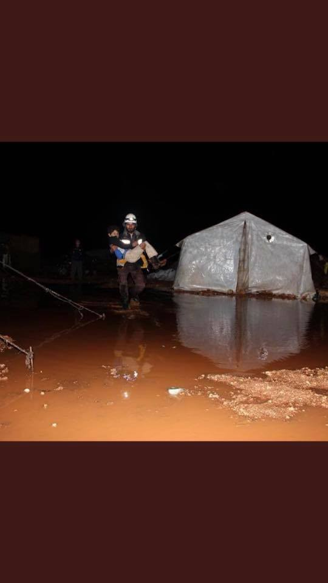
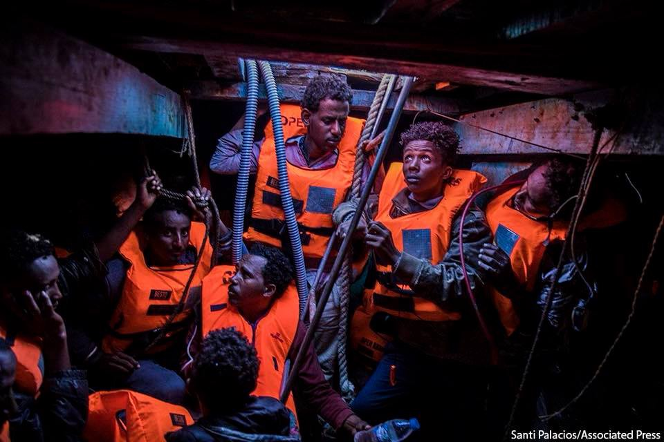

### AYS DAILY DIGEST 20/01/2018: Syria has become more and more the playground for international actors

_A military offensive carried out by Turkish forces has begun, targeting the area of Afrin/Heavy flooding in Syria/EU\-Turkey deal at stake/Deplorable conditions for refugees on Samos and in Thessaloniki/Voice in Bulgaria’s statement on EU Presidency/Protest in Lampedusa against the detention on the prison\-island/Extremely limited job opportunities for refugees in Ireland/More news from Austria, Germany, France, Spain, Sweden and the Mediterranean…_

 \. Many [\#Yazidi](https://twitter.com/hashtag/Yazidi?src=hash) civilians living peacefully in Afrin\. We have seen enough attacks and bloodshed\. International community must protect civilians\.](assets/4632bdb099cd/1*DbVur7dUN65io8bT63rdhQ.jpeg)

Credit: Free Yezidi Foundation\. Free Yezidi Foundation is VERY CONCERNED about the hundred air strikes by Turkish military and ground forces that are moving against [\#Afrin](https://twitter.com/hashtag/Afrin?src=hash) \. Many [\#Yazidi](https://twitter.com/hashtag/Yazidi?src=hash) civilians living peacefully in Afrin\. We have seen enough attacks and bloodshed\. International community must protect civilians\.
#### FEATURE:

Turkish military operations began on Saturday, as reported [here](http://www.aljazeera.com/news/2018/01/erdogan-operation-syria-afrin-begun-180120120424928.html) , targeting the Kurdish\-controlled area of Afrin in northern Syria\. There have been air raids against YPG \(People’s Protection Units\) groups and Syrian Kurdish PYDs \(Democratic Union Party\) after days of shelling\. This began as the Free Syrian Army \(rebels supporting Ankara’s polices\) started moving into the region along the Northern Syrian border with Turkey\.

This attack has been backed by a declaration from Erdogan and the will to push the military operations toward the city of Manbij, controlled by the Kurdish forces since the liberation from ISIL in 2016\.

It comes after decades of fighting inside Turkey carried out by the “terrorist groups” \(as defined by the Turkish president\) — the YPG and PYD, and collusion with the banned Kurdistan Workers Party\. Turkey has been targeting those they consider “terrorists” \(8–10,000 Kurdish militants\) but civilians are living in the surrounding areas\.

What the Turkish government most fears is the establishment of a Kurdish corridor along its border\.

What makes the situation even more complicated is the fact that Erdogan has bombed a US\-backed military force and their best ally in the battle against ISIS — the YPG previously received material support from the US for this reason\.

This attack obviously provoked reactions from the Syrian government who said they would “shoot down the Turkish fighter jets” and the Russians controlling the airspace over Afrin\. Russia will withdraw troops deployed near the city “to prevent possible provocations, to exclude the threat to life and health of Russian servicemen”, basically accepting the Turkish operations in the area\.

The UN published a statement repeating their alarm over further military attacks against the Syrian civil population\. The US has been warned by the Turkish government that their relationship would be “irreversibly harmed” if they agree to send units in support of the YPG\.

A number of intellectuals and academics, including Noam Chomsky, signed a [letter](https://www.facebook.com/FrontaBrezMeja/posts/2079061205499547?hc_location=ufi) to the leaders of Russia, Iran and the US calling on them to prevent any Turkish military action in the area and ensure that civilians would be allowed to live in peace\.

**_Note from the editor_** _: AYS is aware that this letter represents a symbolic statement and would like to underline the fact that, as a team, we don’t agree with some of the claims contained in it\. Nevertheless, we decided to publish it anyway and reported as a “fact”\._
#### SYRIA

[Heavy flooding](https://insaan-rights-watch.blogspot.de/2018/01/everything-is-drenched-heavy-flooding.html?spref=fb&m=1) during the week meant trouble for the approximately 500 Syrian internally displaced persons living in the Quneitra province, near the Golan Heights\.

Credit: Mohammad Al Toba
#### TURKEY

The EU\-Turkey deal might be [at stake](http://www.ekathimerini.com/225086/article/ekathimerini/news/turkey-threatens-migrant-deal-with-eu) , according to comments made by the Turkish minister for EU affairs, Omer Celik\. The minister rejected the idea of a partnership rather than full EU membership for Turkey, stating that similar approaches won’t be taken seriously\.

Celik also added that the EU was not fully respecting the agreement, not only in terms of access to the EU, but also in terms of financial aid\.

These claims sparked different reactions within the Greek political sphere\.

What is clear is that the cancellation of the deal would put more pressure on the Greek islands where thousand of people are already living under deplorable conditions in overcrowded camps\.
#### GREECE

_Samos_

More videos depicting the dire living situation on Samos have been published\. 2,600 refugees live at this camp, originally designed to host 700, now overflowing due to the heavy rain of the past days\.

■■■■■■■■■■■■■■ 
> **[RSA](https://twitter.com/rspaegean) @ Twitter Says:** 

> > Samos refugee camp in the rain fall few days ago.  2,600 refugees stranded in dire conditions in a camp designed for 700
#Greece #Refugees https://t.co/d8UusGRsQs 

> **Tweeted at [2018-01-19 18:55:56](https://twitter.com/rspaegean/status/954427222105960449).** 

■■■■■■■■■■■■■■ 

_Chios_

A [court ruling](http://www.amna.gr/en/article/222756/Third-court-ruling-on-container-huts-in-the-VIAL-camp-vindicates-Greek-state) on Thursday allows the replacement of tents \(currently used by migrants\) with container huts to house refugees at Vial\.

_Mainland_

A protest organised by nationalist groups concerning the use of the name “Macedonia” will be held on Sunday in Thessaloniki\. The presence of violent fascists is expected, therefore refugees are advised NOT to go near the designated area, in order to avoid clashes\. The protest is going to start around 1 pm at the White Tower\. See more [here](https://www.facebook.com/mobileinfoteam/posts/2106521872909864:0?hc_location=ufi)

Homeless refugees from Afghanistan, Syria and Pakistan are living in the basements of crumbling buildings\. They are not even able to light a fire as that would draw police attention, so the only option they have is to cover themselves with blankets\.

■■■■■■■■■■■■■■ 
> **[Brian Ging](https://twitter.com/brianging) @ Twitter Says:** 

> > Night in Thessaloniki. Homeless Afghan, Syrian, Pakistani appear from ruined buildings to be fed. https://t.co/uqvJ7fRhia 

> **Tweeted at [2018-01-20 18:10:28](https://twitter.com/brianging/status/954778167927037953).** 

■■■■■■■■■■■■■■ 

The inconsistency of the asylum service is well represented by [the story](https://twitter.com/ahampay/status/954708368710651904) of Arash Hampay, whose asylum application was accepted while his brother’s was rejected, despite both of them having the same reasoning for asylum\.
#### BULGARIA

The [Voice in Bulgaria](https://m.facebook.com/voiceinbulgaria/?hc_location=ufi) Center for Legal Aid sent us the following statement regarding Bulgaria’s EU presidency :

_Bulgaria has assumed the Presidency of the Council of the EU at a pivotal moment in European policy\-making in the area of migration and asylum\. \[…\] The question missing from the public discussions so far is — in what direction? Is this a good direction for refugees, for Bulgarians, for Europe, for the world? One does not need to read too deeply between the lines of the programme of the Bulgarian Presidency to come up with a negative answer\. The priorities set out in the programme concede to those imperatives in recent European policy in the area of migration that have produced pernicious results — above all, the policy of externalizing Europe’s borders\. The effects of these policies aiming to stop migrants, including asylum seekers, from reaching Europe at any cost, are out of sight for the average European — thus official Brussels easily touts the policies as successful\. The Bulgarian programme follows in line: it talks about “strengthening border control”, using “all possible instruments \[…\] to improve cooperation in the area of readmission” and “a pragmatic dialogue with third countries of origin and transit”\. The implementation of the EU Partnership Framework essentially promises development aid to several African countries as long as they commit to retaining migrants before they can reach Europe and the EU\-Turkey Statement of 18 March 2016 is cited as a specific priority\. What the programme does not mention and what both the Bulgarian Prime Minister and Juncker should be asked about, is the rising death rate in the Mediterranean, the redirection of migrant flows towards more dangerous and expensive routes, including several boats of Iraqi and Syrian asylum seekers crossing the Black Sea from Turkey to Romania last summer — a route described as one that only somebody who was desperate would take — and the shocking and inhumane images of slavery and torture of migrants trapped in Libya as a result of the EU externalization policy, not to mention the EU and individual Member States becoming hostage and subject to blackmail by countries with authoritarian regimes and dismal human rights record\. We cannot have an EU migration policy where the only measure of success is the number of people prevented from reaching Europe\. The Bulgarian Presidency of the Council of the EU is an opportunity for civil society from the region and beyond to shed light on what the policy direction taken actually means, and for progressive Europeans to have their voice heard and positions taken into consideration\._
#### ITALY

Protests at the hotspot of Lampedusa have been going on throughout the day, according to [this source](https://hurriya.noblogs.org/post/2018/01/20/lampedusa-tunisini-in-rivolta-nellhotspot/) \(in Italian\) \. Migrants from Tunisia, who are supposed to be expelled immediately after identification, according to the law, have protested by throwing stones at the police force present in the structure, causing the slight injuring of a policeman\.

The reason is obviously the fact that these people are being detained on the prison island, awaiting a possible deportation decision from the State\. According to the media, protestors have asked many times to be able to leave Lampedusa and some of them have also tried to board the boat to Porto Empedocle, and were stopped at the checkpoints\.

The protest is now over but [tensions in the island remain high](http://www.lasicilia.it/news/agrigento/134579/lampedusa-rivolta-con-sassaiola-dei-migranti-vogliamo-andare-via-da-qui.html) , with refugees showing clear signs of impatience with their prolonged stay on the island\.
#### AUSTRIA

[This petition](https://mein.aufstehn.at/petitions/kickls-massenquartiere-verhindern) \(in German\) created by Refugees Welcome Austria has the goal of stopping the creation of mass shelters for refugees, as it is “not only inhumane, but also socio\-politically and economically irresponsible”\.

For refugees this means a housing solution without privacy and no integration opportunities, for Austrians it means higher costs for the taxpayers and an increased polarisation and ghettoisation of the migration phenomena\.

According to [this post](https://www.facebook.com/AsylInNot/posts/1565228216906698?hc_location=ufi) , the asylum office is guilty of rejecting too many asylum applications, without adequate reasons\.
#### GERMANY

Another [deportation](https://www.facebook.com/ecada2017/photos/a.1881636765385654.1073741827.1880874508795213/2005293026353360/?type=3&theater) to Afghanistan is imminent, but there are problems finding members of the policing forces who agree voluntarily to take part in the deportation operations, as this represents a [psychological burden](https://www.welt.de/politik/deutschland/article172662379/Flug-nach-Afghanistan-Bundespolizei-beklagt-fehlendes-Personal-fuer-Abschiebungen.html) for them\.

Should we ask those being deported as well?
#### FRANCE

A g [eneral assembly](https://www.facebook.com/events/252790305257374/) in support of students sans papiers will be held in Paris on Monday\.

We are happy to publish this post by Refugee Rights Data Project on recent claims by President Macron, accusing NGOs of lying in their accounts of police violence in Calais\. [Here](https://www.facebook.com/RefugeeRightsData/posts/1761958327444338?hc_location=ufi) you can find useful links to resources related to police violence\.
#### SPAIN

A [court](https://www.thelocal.es/20180119/spain-holds-two-alleged-smugglers-over-migrant-deaths) on Thursday has accused two smugglers of the death of seven migrants, five of whom died from hypothermia, exhaustion and hunger, while two drowned\.

Credit: Proactiva Open Arms
#### IRELAND

Job opportunities for asylum seekers in Ireland will be “extremely limited” under a [new directive](https://www.irishtimes.com/news/social-affairs/job-options-for-asylum-seekers-under-new-scheme-exceptionally-limited-1.3361834) \.

_The Department confirmed that as of 9 February 2018 asylum seekers would have the right to apply for an employment permit under the Employment Permits Act 2003 but that the normal fee and conditions would apply\. This means applicants will have to pay between €500 to €1,000 for a six\- to 12\-month employment permit\. Applicants must also secure a job that pays a starting salary of at least €30,000 per annum and are unable to apply for jobs in more than 60 different areas including positions in hospitality, healthcare, social work, childcare, general care services, marketing, sales, administration, textiles, printing, housekeeping, food and construction\._

Under this condition, low\-skilled asylum seekers as well women will be extremely disadvantaged\.
#### SWEDEN

A demo to stop the deportation of five people to Afghanistan has been organised for Tuesday 23 January in Åstorp, in solidarity with the victims and as an act of resistance against the implementation of this inhumane practice\.

#### SEA

191 women, children and babies and another 384 men were found in wooden and rubber boats over the past days by Proactiva\. Three dead bodies among them\.

Salvamento Marítimo has rescued [33 men](https://twitter.com/salvamentogob/status/954654856148652032) from the island of Alborán and is moving them toward the port of Almería\.

Moreover, another boat with [23 men](https://twitter.com/salvamentogob/status/954651119032160256) was rescued and taken to Tarifa\.

There is, unfortunately bad news as well: a boat with [36 people](https://twitter.com/salvamentogob/status/954814140308230146) on board, sank off the island of Alborán, resulting in the death of two migrants on board\.

> **We strive to echo correct news from the ground through collaboration and fairness\.** 

> **If there’s anything you want to share or comment, contact us through Facebook or write to: areyousyrious@gmail\.com** 

_Converted [Medium Post](https://areyousyrious.medium.com/ays-daily-digest-20-01-2018-syria-has-become-more-and-more-the-playground-for-international-actors-4632bdb099cd) by [ZMediumToMarkdown](https://github.com/ZhgChgLi/ZMediumToMarkdown)._
