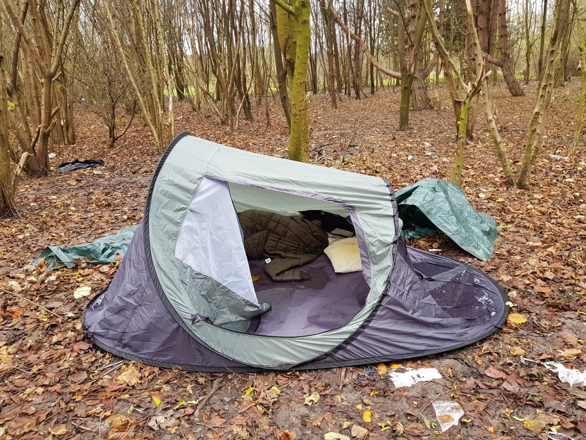

### AYS DAILY DIGEST 23/1/2018: European migration is seriously unhealthy

_Migrant population — especially women — frequently suffered from headaches, anxiety, insomnia, loss of appetite, abdominal and back pain // Children waking up in nightmares due to Dublin II regulation // Lampedusa is boiling // Campaigns against law changes in France and Belgium // Lesson about humanitarian duty from Israel_

\#Chios is harder than \#Lesbos because it is even more forgotten and is less visible\. \#Greece\(2/6\) Photo by Fotomovimento\.
### Feature

**Asylum seekers have higher mental health needs and multi\-trauma than an average EU citizen**

Condition refugees and migrants who are arriving in Europe are forced to live in are severely damaging their physical and mental health\. The situation is similar in almost all of the EU member states, probably even worse in non\-EU countries\.

In their latest report “ [Invisible emergencies? Physical and mental health needs of asyl](https://drive.google.com/file/d/18adwwfOuU8Ge-KszfZDqClPt-uO5-Fcm/view) um seekers in Croatia with a special focus on \(pregnant\) women and children”, [Medecins du Monde from Belgium](https://www.facebook.com/MdMHrvatska/) reminded about the fact that “the complexity of the migratory journey, the conditions of travel and the absence of, or inadequate access to, health care, can result in many migrants experiencing poor physical and mental health outcomes”\.

Photo by Fotomovimento

According to their research, asylum seekers in Croatia — as well as in some other countries they worked in — have higher mental health needs and multi\-trauma than an average EU citizen\.

Their report states that in the case of Croatia, asylum seekers have limited access to health care\. Just one of the examples is the fact that “necessary treatment,” that should be covered by the state, in the case of the asylum seekers does not include a full scope of primary health care and child, prenatal and post\-natal health care, and they have to pay these services by themselves\.

The same goes for the costs of medications which are not on the primary list/list A of the Croatian Health Insurance Fund, and this includes prenatal vitamins and food supplements, vitamins, syrups, etc\. The report concludes that many people on the move suffer from illnesses that are related to the migration route and the conditions they have to live in\.

“This population — especially women — frequently suffered from headaches, anxiety, insomnia, loss of appetite, abdominal and back pain\. Most of these symptoms were of a psychosomatic nature\. This is to be expected given the circumstances: uncertain future for them and their families and long waiting time for the processing of the applications, without any possibility to work and integrate into the local community, are some examples\.”

> MDM also noticed that many women complain about the absence of, or irregular, menstruation, especially among girls between age 15 and early 20, and it is happening as a consequence of stress\. 

“Women and girls are among the most vulnerable in the migrant population, and have to bear very difficult and dangerous situations,” the report concludes\.
 
Additionally, MDM team noted that children who were, in accordance with Dublin 2 regulations, deported from other countries to Croatia, have developed _“night\-time urination symptoms \(secondary enuresis\), which is most likely a result of sudden, unexpected and often violent changes in the environment and re\-traumatization”\._

That conditions people are forced to live in are damaging their health concluded Monika Gattinger, a psychologist, and psychotherapist who worked for 40 years in Austria before joining MSF in her retirement\. Her time at Lesvos made her asking one question: “ [How can Europe be more traumatizing than Mosul?](https://www.facebook.com/michael.graversen.568/posts/10157174489638677) ”

_“People really don’t need a lot to normalize and find stability\. If they feel safe and can begin to organize themselves and arrange activities then they can cope and begin to rebuild their lives — even if it is in a camp\. But the foundation that people need to be able to do that is completely missing in Moria, a refugee camp in Greece\.”_

And she continues saying that, there is a feeling among the people that they have to fight for many things to survive: clean water, decent shelter, warm clothes\.

Moria\. Photo by Michael Graversen who is on this 5 day trip with a child psychiatrist for the group flygtningeboern\.dk

> “People felt safer outside Mosul than they do here; the fences, the police, the anxiety of not knowing what will happen to them, it’s all too much\. Men, women, and children live in fear every day of being sexually assaulted, exposed to violence or being deported\. Access to legal aid is scarce and the only place people can receive psychological support is our mental health clinic 5km away\.” 

Gattinger concludes that she never saw anything bad as Moria\.

> **“What makes it so hard for me is that all of this is preventable\. Moria has been intentionally neglected by European governments in the hope that it will act as a deterrent to others considering making the journey to Europe\. But with this intention, it has failed\.”** 

Additional reports about what the EU approach to migration is doing to people come from Germany\. Süddeutsche Zeitung newspaper published information that _number of suicide cases amongst asylum seekers in on the increase, especially in the conservative southeastern state of Bavaria\._

In 2016, 158 refugees in Bavaria tried to commit suicide, with four of them succeeding, according to a report made to the Bavarian state parliament at the request of the Green Party\.

[InfoMigrant quotes](http://www.infomigrants.net/en/post/7129/refugees-attempting-suicide-due-to-fear-of-deportation-poor-conditions-in-the-shelters) psychiatrist Amer Masri, who works at the Berlin center for migrants who have survived violence, saying that the reason behind these suicide attempts may be a feeling of despair\.
### Italy

[UNHCR latest data on arrivals to Italy](https://data2.unhcr.org/en/documents/download/61681)

Total arrivals \(1 Jan — 21 Jan 2018\): **2,733**

Average daily arrivals in January 2018 so far: **130 Average daily arrivals** in December 2017: 75

Dead and missing in 2018 \(as of 21 Jan\) 184

Most of the people arrived in Italy from Nigeria, Guinea, Cote d’Ivoire, Bangladesh, and Mali\.

[InfoMigrants](http://www.infomigrants.net/en/post/7136/lampedusa-violence-rights-watchdog-to-visit) report from Lampedusa claims that it is “boiling” with many people waiting for too long to be transferred to the Italian mainland\. On Wednesday, ombudsmen for the right of persons detained and deprived of their liberty will visit Lampedusa to assess the situation\.
### Turkey

After initiating the insane military campaign in African, Turkey sends a message today that military operations in Syria will come to an end when the 3\.5 million Syrian refugees in Turkey can return safely, [Reuters reports](https://www.reuters.com/article/us-mideast-crisis-syria-turkey-refugees/turkey-says-operations-in-syria-will-end-when-refugees-return-home-idUSKBN1FC1L5) quoting President Tayyip Erdogan’s spokesman\.
### Sea

[Refugee Rescue / ‘Mo Chara’](https://www.facebook.com/RefugeeRescueUK/)

“Waves are high, temperatures low and winds are strong\. Crossing the Aegean Sea in a dinghy is already dangerous during quiet weather, so imagine how dangerous it must be now\.”

### Greece

According to the [refugee\.info blog](http://blog.refugee.info/transfers-from-the-islands/) , Greek government fulfilled its promise and move more than 5,000 people from the islands to the mainland\. Not before the winter, but yet, people are moved every day\. According to the official data, more than 4,200 people were transferred during December, an additional 1,294 in January\. But, it is not enough and more people are coming almost daily\.

“Meanwhile, on the islands, **about 1,000 people are forced to sleep in summer tents** , and large numbers of families, children, and sick people live in very bad conditions, without access to basic facilities\. Overcrowding is still a big problem\.”

Human Rights Watch issued [another report](https://www.hrw.org/news/2018/01/23/asylum-seeking-kids-locked-greece) stating that, despite earlier warnings, many children are being locked up in police cells and detention centers\. Only in December, 54 unaccompanied children were detained in so\-called “protective custody” in police station cells or in immigrant detention centers\.

_“Children live in unsanitary conditions, often with unrelated adults, and can be subject to abuse and ill\-treatment by police,”_ the reports concludes\.

> “Detention has a serious long\-term impact on children, including harm to their development, anxiety, depression, post\-traumatic stress disorder, and memory loss\. To make things worse, kids detained in Greece — who may have suffered horrific experiences while escaping from war zones — are often unable to receive medical treatment, psychological counseling, or legal aid\.” 

They demand that Greece finds space in open facilities for kids who are currently in custody\.

> “Greece’s EU partners also need to help\. Other EU members should speed up family reunification for children with relatives in other EU countries and should offer to relocate unaccompanied asylum\-seeking children — even if they lack family ties\. 

> Unaccompanied children in Greece should not have to spend another day locked up in filthy police cells\.” 

Greece’s Migration Policy Ministry on Tuesday confirmed that the director of an identification and processing center on Chios has [resigned after just a few months](http://www.amna.gr/en/article/223734/VIAL-hotspot-director-Tsigalakis-resigns) \. His explanation was that he is doing that because of the pressure from locals, but he gave no more details\.

[Jafra Greece](https://www.facebook.com/pg/JafraFoundationinGreece/about/?ref=page_internal) is introducing a new project and needs some help\.

_“We are refugees, helping refugees\. Volunteer with us\! Jafra is one of the only self\-organized initiatives in Athens that is run by refugees and for refugees\. Having just opened our new community center in Athens we are expanding our programs and we need some more hands to join the team\. As a team of refugees, we have a strong connection with the people who come to our center, we want to share that with you\. We are looking for people of all nationalities and backgrounds, with diverse skills to help us move forward\. Share our culture, be part of our team, be part of our family\!”_

If you want to volunteer with Jafra, fill out their volunteer form\.
[https://docs\.google\.com/](https://docs.google.com/) …/1FAIpQLSenlmAhtSCLhLFAg…/viewform… or write to them at [jafravolunteers@gmail\.com](mailto:jafravolunteers@gmail.com)

[Chios Eastern Shore Response Team](https://m.facebook.com/profile.php…) is looking for a carpenter volunteer or a very handy person that could help them continue to renovate their new center\.

[Action from Switzerland](https://www.facebook.com/actionfromswitzerland/videos/1240882126056274/?hc_location=ufi) announced the _Halcyon Days project in Athens_ , a safe and supportive living/learning space for women\.

Gabrielle Tay, who leads AfS, [wrote](https://actionfromswitzerland.ch/our-work/protection/halcyon-days-project/) :

_“The objective of this project is to minimize the risk of re\-exploitation trafficking, forced prostitution, by providing a safe nest, of a stable egalitarian living environment, and structured vocational training courses\. To draw on their own power to create change, rather than be the passive recipient of circumstances\. For whenever they are strong enough to fly away\.”_
### France

[Activists in France](https://freedomnews.org.uk/progressives-fight-macron-migrant-law/) are not ready to accept President Macron’s plan of tightening of deportation laws in the early part of 2018\. They announce a massive demonstration for this Saturday starting at 2\.30pm at Porte de Paris in Saint\-Denis, northern Paris\.

> The protest has three main themes:
 

>  • Against the Macron/Collomb immigration bill
 

>  • Against inhumane reception conditions for migrants
 

>  • For a decent welcome, accommodation, and regularisation of undocumented migrants \(sans papers\) 

They claim that, among another things, **Macron wants to reinforce the borders of Fortress Europe** “by setting up referral centers for asylum seekers in southern Libya” — similar to hugely controversial deals made with Turkey\. In a statement, campaigners, among other things, said:

> Faced with the deterioration of living conditions on French soil, we demand:
 

>  • Conditions in the Prefecture and waiting times that respect users
 

>  • Papers for everyone
 

>  • Closure of the long\-term migrant detention centers
 

>  • Dignified accommodation conditions and accommodations for all 

Photo by MObile Refugee Support\.

Donations needed

[Mobile Refugee Support](https://www.facebook.com/MobileRefugeeSupport/posts/704465636425717)

“We wholeheartedly appreciate every single penny that is sent to support our organization and thus supports refugees\. There are hundreds of people whom we work with that now have items to keep them warm while living in these dire conditions, and we would like to keep this going for the duration of the winter\. Your donation directly helps those in need, and we cannot thank each and every one of you enough\.”

[Phone Credits for Refugees](https://www.facebook.com/groups/P2PParis/permalink/1589998461087022/) needs donations

“If you haven’t done your good deed for the day please get on over to Phone Credit For Refugees group and make a small donation towards topping up a phone to keep a refugee safe and connected with their family\.”
### Belgium

Belgian government could soon [introduce legislation](http://deredactie.be/cm/vrtnieuws.english/News/1.3131007) that, if enacted, will make it easier to detain undocumented people through house searches\.

The police will also be able to raid the premises of volunteers who provide shelter to people who are being expelled from the country with greater ease\.

At the moment, people who have no papers could be arrested only in public places, and the police do not possess the power to carry out a raid without due reason\.

Since September this year, people all over the country, especially in Brussels, are offering shelters to migrants and refugees\. Hundreds have found the safe place in this way, place to rest, and friends\. If this new law introduced, this may prevent their further activities\.
### Germany

Germany has not offered any spaces for refugees in UNHCR camps in the Middle East or Northern Africa, the government answered to a question of the Green Party, the [Rheinische Post](http://www.zeit.de/gesellschaft/2018-01/unhcr-lager-fluechtlinge-un-hilfswerk-aufnahme-deutschland-verzoegerung) is citing\.

In Mid\-2017 chancellor Angela Merkel promised the UNHCR some 40\.000 places for resettlements EU\-wide, saying Germany would take its share\. But as of now, Germany has not signed\-up for any resettlement nor made any decision, what should have happened until October 2017\. A second deadline will expire in February\.

Because of the slow constitution of the new government, Germany maybe won’t take anyone through the resettlement\-scheme, Green politican fear\. \.
### Israel

So far, at least three El Al pilots [publicly declared](https://972mag.com/i-wont-fly-refugees-to-their-deaths-the-el-al-pilots-resisting-deportation/132582/) that they refuse to take part in the deportation of asylum seekers to countries where their lives may be in danger\.

_“There is no way that as part of the flight crew I will take part in flying refugees/asylum seekers on their way to a destination, in which their chance of survival after arrival \(“a third country”\) is close to zero\. Not much courage is required for such a mission, but I will not be able to do what is required of me in such a mission\. As a pilot and as a human being,”_ one of them wrote on his FB profile\.

_“Out of all people we, the Jews, must be attentive, empathetic, moral, and leaders of public opinion in the world in how we treat the migration of refugees, who have suffered and continue to suffer in their countries of origin\. \[…\] I will not fly deported refugees against their will for the legal reason \(there is no other legal reason\) that they are likely to endanger the safety of the flight,_ ” is the message by the other pilot\.

Their act is mostly symbolic since El Al does not fly directly to Rwanda or Uganda, and deported migrants usually fly on other airlines through Ethiopia or Jordan\. But they are jutting part of the movement that refuses to allow to the government to deport people to countries where they will be in danger\.

In recent weeks the Israeli government approved the deportation of refugees to third countries due to the closing of the Holot desert detention facility announced in March\. The plan is to deport most of the people and those who refuse to leave “voluntarily” to Rwanda and Uganda \(and perhaps other countries\) will be imprisoned indefinitely\.

This decision by the government prompted protests from social activists, among them Holocaust survivors saying that “the Jewish state has a moral duty to protect the migrants”\. Some people even announced that they will take migrants into their homes to hide them to prevent their deportation\.

Veronika Cohen, 73, a survivor from Budapest, Hungary, is one of the people who raised their voice against deportations\.

> **“I always asked myself what I would have done if, during the Holocaust, I was on the other side — would I have been strong enough to do what the Righteous Among the Nations did? I don’t know if I would have been able to risk the lives of my children, but here they aren’t asking us to risk our lives\. I feel that to do this is my humanitarian duty\.”** 

There are approximately 38,000 African migrants and asylum seekers in Israel\. About 72 percent are Eritrean and 20% are Sudanese, and the vast majority arrived between 2006 and 2012\.

Luckily, this is not the only example\. Last year over 200 deportations of asylum seekers “failed” because German pilots for Lufthansa and its subsidiary, Eurowings, refused to take off with them on board, declaring that flight safety could be compromised if someone says they do not want to take the flight\.

In the UK last summer, a Turkish Airlines pilot refused to take off upon learning that a refugee was being deported against his will to Afghanistan\.
### General

Beautiful initiative worth support coming from students at the University of Toledo\. They urge universities to create scholarship opportunities specifically for Syrian students to pursue a higher education\.

“The University of Toledo accepts over 16,090 students every year, offering many generous scholarships\. As students of UT, we think that some of the seats should go to Syrian refugees who would otherwise have no education\. We are calling on UT to join the Syria Consortium organized by the IIE to offer scholarship opportunities for Syrian students\. We hope that UT can be a leader to universities around the world by offering these Syrian students a second chance at getting their education\.”

Support their initiative [Books not bombs](http://books-not-bombs.com/uoftoledo) if you can\.

> **We strive to echo correct news from the ground through collaboration and fairness\.** 

> **If there’s anything you want to share or comment, contact us through Facebook or write to: areyousyrious@gmail\.com** 

_Converted [Medium Post](https://areyousyrious.medium.com/ays-daily-digest-23-1-2018-european-migration-is-seriously-unhealthy-e29b4922b5e0) by [ZMediumToMarkdown](https://github.com/ZhgChgLi/ZMediumToMarkdown)._
