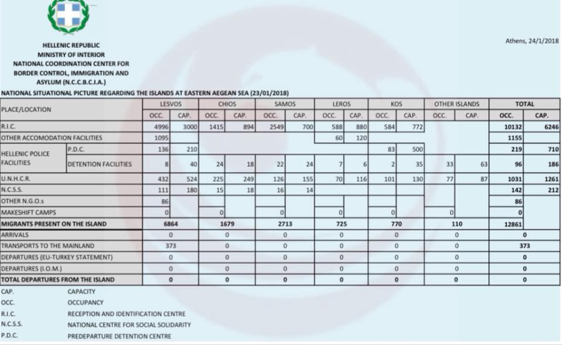
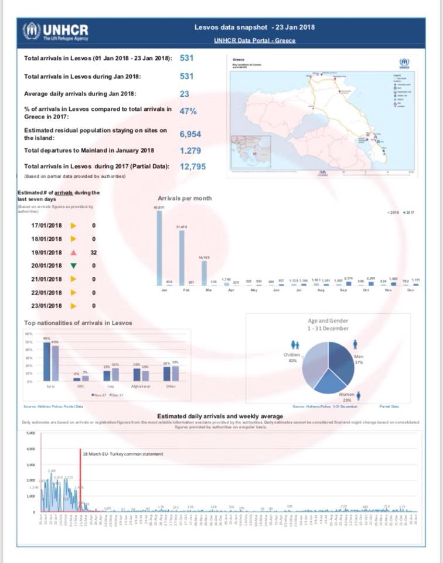
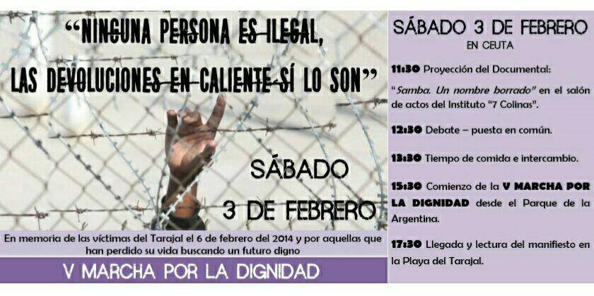

### AYS Daily Digest 24/1/18: Storm to hit Lebanon, refugees at risk
#### “Storm Oscar” prepares to slam into Lebanon on Wednesday night / Situation is worsening in Afghanistan, STC backing out after team members’ deaths / Greece: Locals demonstrate hate towards refugees and volunteers around Vial / Croatian minister of interior still evades responsibility / France\-UK: the new deal on family reunification / Indignation in Spain; new SAR actions / News from Libya, France, Spain, Germany and more

 \)](assets/91996ef4a566/1*cwrqdGCeuzCZBEuu5Gx1Xw.jpeg)

headquarters / shack of the local fascist groups barring the new containers from accessing Vial \(Photo: [Leslie Meral Schick](https://www.facebook.com/leslie.schick?fref=gc&dti=1652972374920129) \)
#### FEATURE — winter storm announced to hit Lebanon on Wednesday night

A fear of severe impacts for hundreds of thousands of refugees living in tents and substandard shelters in Lebanon was raised after it was announced winter storm “Oscar” prepares to slam into Lebanon onWednesday night\.

> “This is the sixth winter that refugee families live in these settlements\. Their tents are tattered and worn down, flooding is common, and in the winter, mud is everywhere,” _— NRC in Lebanon said\._ 

During that time refugees have been living in conditions where ceilings leak and the ground gets flooded, among other things that are considered a “normal” daily reality of theirs\.

“Informal tented settlements” and “below acceptable according to a UN assesment”… all of these categories don’t go near to describing a life that millions of people, forgotten by the rest of the world, have been leading for years now\. Nor does it entice more empathy and human solidarity\. 
The situation is beyond serious \- people are suffering and natural disasters are only going to outline the human disaster already existing\.

If you have the possibility to support or know of useful things to inform anyone in Lebanon of the places they can find safety during the storm, please also share it with us and on social networks\.

> **In one way, we are all here for the same reason\. If the world would have been different we either could have been neighbors or classmates, or never met at all\. Instead, we’re all here\.** _— Read [AYS special Lebanon story](ays-special-lebanon-dont-forget-me-please-d443b954be12) that we dedicated to the refugees in Lebanon earlier in December\._ 

#### AFGHANISTAN
### A country NOT safe for ANYONE

Seven out of ten Afghan refugees who return home are forced to flee again due to violence, according to a new [report](https://www.nrc.no/resources/reports/escaping-war-where-to-next-the-challenges-of-idp-protection-in-Afghanistan/) \.

“Now is not the time to deport Afghans\. War\-torn Afghanistan today is no place to be returned to\. Decision\-makers are likely to regret the massive involuntary returns at a time when conditions worsen all over Afghanistan\. It can destabilise the whole region and lead to immeasurable suffering among families deported,” said the NRC director\.

Further more, they found that three quarters of families forced to flee their homes are not receiving any aid assistance\. One in two are highly food insecure — often skipping meals and reducing their food intake\.

> Trapped in an endemic cycle of poverty, 80 per cent of internally displaced families NRC surveyed report taking on high levels of debt\. Almost 20 per cent sent at least one child out to work 

■■■■■■■■■■■■■■ 
> **[SavetheChildren News](https://twitter.com/SaveUKNews) @ Twitter Says:** 

> > BREAKING: with profound sadness we can confirm 3 #SavetheChildren staff were killed today in attack on our office in #Jalalabad #Afghanistan. 4 more were injured &amp; are receiving treatment. We are shocked and appalled. Our full statement is here. #JalalabadAttack https://t.co/loadxcxlO7 

> **Tweeted at [2018-01-24 17:29:52](https://twitter.com/saveuknews/status/956217501951647745).** 

■■■■■■■■■■■■■■ 

#### GREECE

373 people were transferred from the island of Lesvos to the mainland, making it the highest number of transfers from islands this year\.

Forwarded UNHCR island [updates](http://mindigital.gr/index.php/%CF%80%CF%81%CE%BF%CF%83%CF%86%CF%85%CE%B3%CE%B9%CE%BA%CF%8C-%CE%B6%CE%AE%CF%84%CE%B7%CE%BC%CE%B1-refugee-crisis/1905-national-situational-picture-regarding-the-islands-at-eastern-aegean-sea-23-01-2018) and statistics\.

### Local opposition turns fascist

Authorities on Chios are planning to lodge a new appeal against the ministry, taking out another injunction in a bid to block the planned expansion of the Vial camp, media [report](http://www.ekathimerini.com/225192/article/ekathimerini/news/ministry-chios-authorities-set-to-clash-over-plans-to-expand-vial-camp) \.

Local residents have stepped up their opposition to the project over the past two weeks, obstructing efforts by the ministry to transport prefabricated homes to Vial\. The containers are to replace tents that are in poor condition\. We have heard from volunteers on the ground that some of the locals have been threatening and obstructing those wanting to help or support the refugees\. Those who are obstructing have been in constant communication with the police officers on site, not having been told off for their agenda spreading, or having their provisional headquarters dismantled\. 
They are building up fear of further development as a Golden Dawn protest is being announced for January 31\.
#### The oldest volunteer\-run and donation\-funded kitchen still serving refugees in all of Greece needs help

The CPK now provides lunch daily to the students of the refugee school, the unaccompanied minors at the Metadrasi shelter, and women at the Athena women’s center\. In addition, every day, boxed warm lunches are distributed to refugees around town and there are the regular dry food distributions to thousands\.
Consider supporting them: [https://www\.gofundme\.com/refugeesupportgreece\-italy](https://www.gofundme.com/refugeesupportgreece-italy)

Showers are also needed and funds are being gathered in order to provide people with a slightly more decent shower option\. See [here](https://www.chuffed.org/project/we-all-love-a-shower) \.
### Athens

[**Workshops**](https://www.facebook.com/events/2237843736441975/)

“Are you a refugee or asylum seeker, trying to find a job in Athens or elsewhere in Greece? Generation 2\.0 RED brings you a series of Job Readiness workshops, including the all\-time\-classic CV and Motivational Letter Writing, the Job Interview Preparation, as well the Communication, Time Management & Goal setting workshops\!”
The aim is to get familiar with all things necessary for entering the Greek labor market and develop further the skills highly appreciated in the workplace\. 
January 31: Improve your Communication skills
February 2: Improve your Time Management & Goal Setting
February 5: CV Creation & Job Search
February 6: Cover Letter Writing
February 7: Job Interview Preparation

See [**here**](http://bit.ly/2n69Ul7) for more info\.

■■■■■■■■■■■■■■ 
> **[Mobile Info Team](https://twitter.com/mobileinfoteam) @ Twitter Says:** 

> > The Greek #television station #ERT is offering also a short #news bulletin in #Arabic. It includes news concerning #refugees and a weather forecast and is normally around 90 seconds long. Read more [bit.ly/2rySenH](http://bit.ly/2rySenH) https://t.co/mbwdUoLd8g 

> **Tweeted at [2018-01-24 11:51:13](https://twitter.com/mobileinfoteam/status/956132276177432576).** 

■■■■■■■■■■■■■■ 

#### BULGARIA

■■■■■■■■■■■■■■ 
> **[Moving Europe](https://twitter.com/MovingEurope) @ Twitter Says:** 

> > @[bm0eu](https://twitter.com/bm0eu) publishes hitting #police man at the Bulgarian #border: [youtube.com/watch?v=bR7roF…](https://www.youtube.com/watch?v=bR7roF0Fbx0) #borderpolice #violence #migrants #refugees #Bulgaria 

> **Tweeted at [2018-01-24 08:36:43](https://twitter.com/movingeurope/status/956083327190085632).** 

■■■■■■■■■■■■■■ 

#### CROATIA

After the Government of Croatia has explicitly accused the CSOs for ‘having the mission of facilitating illegal transfer a large number of illegal migrants to EU countries’ because of their criticism against the illegal push\-backs, parliamentarian Peđa Grbin has posed new questions to the President of the Croatian Parliament:

> \- does Croatia allow to refugees, migrants or other people to, in accordance with their rights, submit an asylum application; 

> \- which CSOs are trying to transfer large number of illegal migrants to EU countries and therefore ‘making inappropriate pressure to Croatian police’? 

> \- what are the ways in which they attempt to unable the efficiency of the Croatian police, whether it is established who undertakes such actions, what measures did the Government undertake to prevent such actions, and whether criminal charges have been filed against the persons who are allegedly giving false testimonies damaging the reputation of the Republic of Croatia?’ 

#### FRANCE
### The court condemns the practices of immediate refoulement of unaccompanied minors

A young 12\-year\-old Eritrean was arrested by the French security forces when he arrived at the Menton\-Garavan station\. [Reportedly](https://l.facebook.com/l.php?u=http%3A%2F%2Fanafe.org%2Fspip.php%3Farticle452&h=ATMX7RZ6p_v9kgnL3tOd8wiSZjh7KehE-wlBsSvjfqfi6G7BGNmiWQMeuQwkPptNI4floyKiZDtIi0qDJcS2BxqOK4HxRItu8Cso1sf_CIQG3egf2xXExymPJjhN29IOsJ9J3NgRFvMTyDY9xYLdHQPt3Artt8CxCT7clFKaI1cLZ--_Xn4cBARuTBu_gm_b6ZVQxPhYLa3P3FVTs2pw0uMI5XJxPpd5iYeFkO34TKrl1l1h81M-Akc_Gv-hfTC7mus) , he was denied entry to the territory and was pushed back, illegally, the same day by train to Ventimiglia in Italy, with no information, support or official guidance to the responsible institutions in the neighboring country\. 
The judge of the Nice administrative court considers that the decision refusing entry into the territory is an unlawful and serious infringement of the best interests of the child, guaranteed by the international convention on the rights of the child\.

> The French administration must respect its international commitments and the applicable legislation to provide effective protection to any isolated foreign minor, and more broadly to any person in need of protection, presenting himself at the French\-Italian border\. 

### Paris

### Help get laundry facilities set up in at the [L’Auberge des Migrants](https://www.facebook.com/AubergeMigrants/?fref=mentions) / [Help Refugees](https://www.facebook.com/HelpRefugeesUK/?fref=mentions) warehouse in Calais

Sponsor a month of running costs by pledging to raise 1000€ in your community \(the first 2 months is already pledged\) \. You’ll get updates showing how many sleeping bags, blankets, jackets, and other valuable donations are saved in the month you sponsor\.
Follow [Calais Laundry](https://www.facebook.com/Calais-Laundry-155985555055222/?hc_ref=ARSwHhzx3VYTwGkkWm5LG1c9CrSTcvQ8frT3jcw_rn_gmli50cAz97reL6rKnNmgRpY&fref=nf) for more info\.
### Family reunification according to Sandhurst

Demanding international protection and family reunification; meeting with the prefecture and/or PADA official; filling out both forms that state the minor is demanding asylum AND family reunification and consequently, after being called to meet their “ad hoc administrator”, defending it with documentation to prove the person’s story… These are some of the steps to follow in the complex procedure of family reunification that is supposed to make transit from France to UK more humane, easier and less lethal\. More info available in French [here](http://www.infomigrants.net/fr/post/7151/les-mineurs-isoles-de-calais-vont-ils-pouvoir-aller-plus-facilement-en-angleterre) \.
#### SEA — SPAIN

A raft with 40 people including 6 women has been rescued yesterday\. Another boat disappeared with 47 people on board, Spanish authorities contacted Algerian authorities to search their waters\. Since the beginning of the year, 22 people died crossing the sea to Spain\.

17 miles north\-east of Cabo Figalo the 46 people who were considered disappeared as of Monday were found by the vessel Argelia\. They are 36 men, 9 women, of whom 2 are pregnant, and a minor\.

■■■■■■■■■■■■■■ 
> **[SALVAMENTO MARÍTIMO](https://twitter.com/salvamentogob) @ Twitter Says:** 

> > Rescatadas por Argelia a 17 millas al noroeste de Cabo Figalo (zona SAR argelina) las 46 personas que se buscaban desde el lunes. Se trata de 36 hombres, 9 mujeres (dos de ellas embarazadas) y un menor 

> **Tweeted at [2018-01-24 19:11:55](https://twitter.com/salvamentogob/status/956243184497065985).** 

■■■■■■■■■■■■■■ 

[Caravana Abriendo Fronteras](https://www.facebook.com/Caravana.AF/) and friends gathered around the [V Marcha Por La Dignidad / Tarajal\-Ceuta](https://www.facebook.com/VMARCHAPORLADIGNIDAD/?hc_ref=ARQECDYZb558xoGe-Fn5bAE9_59BM9YN-BLrlcbjWI-0N9pDr8MwsX9VHjgkcizgTrc) are organizing another event to fight the tendencies that still exist and that have led to deaths commemorated through this symbolic action:

> Dear Friends / Comrades 

> February 6th will be the 4th anniversary of the Tarajal tragedy, in which 14 people drowned and one disappeared as a result of Guardia Civil \(Spanish Police\) intervention to prevent them reaching Spanish territory\. 

> Friends / Comrades from Ceuta have prepared a series of events for the 3rd February\. From Caravana Abriendo Fronteras \(Open Borders Caravan\) — 
 

> We believe it is essential all regions mobilise and participate on this Tribute to Victims and their families\. 

> Caravan Madrid has organised a bus from Madrid for anti\-racists groups who work in solidarity with displaced people and refugees, we can all join this 5th [March for Dignity](https://www.facebook.com/events/141467559854797/) , showing our support to people and social organisations who continue to demand truth, justice and reparation\. 

> We do not forget and want to continue to show the causes of forced displacement and the consequences of European Union migration policies on the lives of people who are crossing borders\. 

#### GERMANY

300 demonstrators joined the “Afghan outcry” initiative of civil society groups against the 9th collective deportation to Afghanistan in the past year\. The “safe areas” that German Interior Minister Thomas de Maiziere speaks of while justifying deportations to Afghanistan don’t exist\. The officials still seem to be “struggling” with their own problem regarding the deportations — there are not enough federal police to carry out the proposed deportations\. 
German [media](http://www.dw.com/en/protests-against-latest-afghan-deportations-from-germany/a-42281591) report that about 10,000 are allowed to stay for now because repatriation is not possible in the foreseeable future\.
### The cost of ‘Duldung’

For those who have not been granted asylum, access to state\-funded language and integration classes is limited\. While this saves the government expenses in the short term, it can also cause higher costs in the long term\. 
For people whose deportation has been temporarily halted and who do not have a sufficient income, it is the state who takes upon themselves to provide them with housing, health care, clothing and food, but from the 4th month onwards, municipalities take over\. 
Many countries refuse to accept deported asylum seekers if the German state does not supply identity documents that prove that the person had applied for asylum there\. Read more in InfoMigrants [story](http://www.infomigrants.net/en/post/7149/municipal-governments-concerned-about-costs-for-rejected-asylum-seekers) \.
#### UK
### “Our lawyer told us that I have to do a DNA test\. But he said I can only do it in the UK”

Thus, to prove his connection to his family, Ahmad has to do a DNA test in the UK; but to be able to do the test, he has to reach England first, which he is not allowed to do until his family reunification procedure is complete and approved, which can only be finalized… in the UK\.

Many children in Calais are in situations similar to that of Ahmad\. Their condition violates basic human rights conventions\. They are being failed by all sides, left with no other option than putting their fate in the hands of smugglers and traffickers\.

Frustrated by the lengthy delays and the bureaucratic intricacies, Ahmad gave up and decided to try his luck and reach the UK illegally\.

The following statement is here for the sake of documenting development of the topic on a larger political scale and does not imply any endorsements or political standpoints of the AYS team\.

#### LIBYA

According to the [media](http://sudantribune.com/spip.php?article64561) , on Tuesday evening the Libyan army managed to free a group of Sudanese migrants detained and tortured by Libyan human trafficking gangs\. Most cases document torture and detainment, along with asking their families to send money before releasing them to continue their journeys\.
Thousands of Sudanese are fleeing the country through Libya hoping to reach safety and the chance of a better life\. Many of them are living nightmares along the route, but it is because of the spread of a [video](http://www.infomigrants.net/en/) showing the five Sudanese hostages handcuffed, beaten and tortured by fire that this particular case has made it to the news\. Thousands unfortunately don’t\.
#### GENERAL
### Legalizing documents at the German embassy in Beirut — attention

If you do family reunification through the embassy to Germany, it is a necessity to legalize all the relevant documents in the German embassy in Beirut\. The Mobile Info Team has reached a lot of reports, that tricksters are trying to take advantage of this situation:

> _They are offering to help legalize the documents, but only for a huge amount of money\. Or they are offering their services for a low price and then later are threatening to only give the documents back, if a lot of money is paid\. Please keep in mind, that in general legalizing documents is for free, if you can prove that the legalization is needed for a family reunification\. Please be really, really careful whom you trust with helping you with your documents\. Don’t give your documents in the hands of people or organisations you don’t know\! To find out more about the process of legalizing documents, please click on the following links:_ 
 

> _Info in [German](http://bit.ly/2BjI8qn) and [Arabic](http://bit.ly/2DqWXcN)_ 

### Monitoring threats to civic actors and journalists in Europe

The new platform [http://civicspacewatch\.eu/](https://l.facebook.com/l.php?u=http%3A%2F%2Fcivicspacewatch.eu%2F&h=ATM5Bumnu9DveVwsavu54wn7bX9KyMSWqG64XRPviz-C5DMtOe3RS6FOUuHeH1YP26-rcgfPCiNa1v5AyeqjLAg4fRJclypkQc4LIGzp9VIpLvTvYLtU6lKFFPBRXHl3T2-g2XiFFAx1) monitors the citizens’ right to mobilise, organise, and act in order to change social and political structures around them\. In the ‘Take action’ section, there is a mutual support scheme and a reporting point where activists can report new developments on the ground \(abuses by the police, new laws restricting their ability to work or advocate, restriction to funds, physical or verbal attacks…\) and ask for support from other civic actors in Europe\.

> Currently, we are trying to do a comparative analysis of the criminalization of society in Europe, to understand how the work of active citizens helping migrants has seen a degradation following the criminalization of migration\. 
 

> We want the European Union and its member states to recognize the value of the work done by active citizens everyday, providing services where the state is unable to help\. If you have national or local legislative initiative, news articles, blog posts or simply a story to tell to support our analysis contact the platform or at the email address gnegri@civic\-forum\.eu\. These alerts and the analysis will support our common advocacy activities at the European institutions\.” 

**We strive to echo correct news from the ground through collaboration and fairness\.**

**Every effort has been made to credit organizations and individuals with regard to the supply of information, video, and photo material \(in cases where the source wanted to be accredited\) \. Please notify us regarding corrections\.**

**If there’s anything you want to share or comment, contact us through Facebook or write to: areyousyrious@gmail\.com**

_Converted [Medium Post](https://areyousyrious.medium.com/ays-daily-digest-24-1-18-storm-to-hit-lebanon-refugees-at-risk-91996ef4a566) by [ZMediumToMarkdown](https://github.com/ZhgChgLi/ZMediumToMarkdown)._
