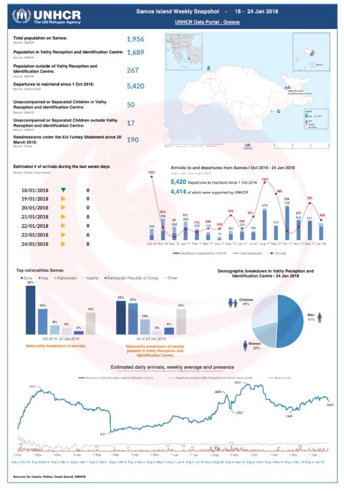
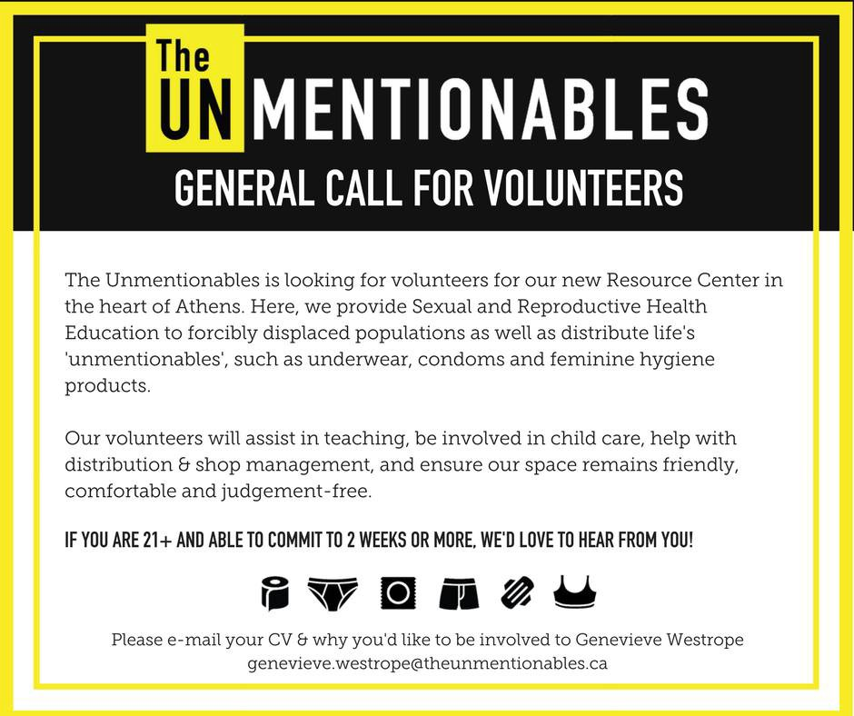
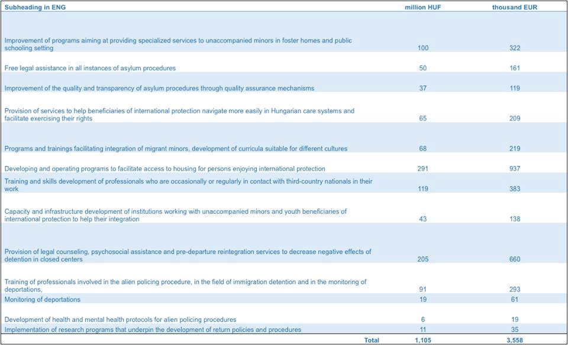

### AYS Daily Digest 26/01/2018 Protesters sew their mouths shut in Lampedusa

Chios authorities still trying to halt Vial camp expansion /// More people to be settled in Ritsona camp/// Extradition from Croatia to Turkey of Kurdish refugee temporarily halted /// EU to delay discussion over refugee quotas /// Police brutality in France /// Court ruling towards school inclusion in Baviaria /// ‘Stop Soros’ draft laws internationally condemned /// more from Greece, Serbia, Germany, France, and the EU

 \)](assets/625226844336/1*XGnpW8HlOYydIyBELzonxQ.jpeg)

No Homeland, deport fascist \(Photo by [Subversion \#1312](https://www.facebook.com/subanarchyshow/) \)
#### **Feature — Lampedusa: Protesters sew their mouth shut against deportation**

■■■■■■■■■■■■■■ 
> **[Mediterranean Hope](https://twitter.com/Medhope_FCEI) @ Twitter Says:** 

> > #Lampedusa dopo una notte passata di fronte la chiesa, continua la protesta di circa 50 tunisini contro i rimpatri collettivi https://t.co/1le7Z84RbJ 

> **Tweeted at [2018-01-26 08:54:58](https://twitter.com/medhope_fcei/status/956812697848426497).** 

■■■■■■■■■■■■■■ 

As we started reporting yesterday, around 50 Tunisian asylum seekers started a hunger strike yesterday in Lampedusa\.

This followed several days of protests, direct actions and confrontations with local police\. They are committed to stay in front of the San Gerlando church asking not to be repatriated to Tunisia and to be able to leave the island soon — as they should according to the law, within 48/96 hours — and all together\.

Last night they slept in front of the church supported by citizens who wanted to show their solidarity and who brought drinking water, food and blankets\.

> “Today \(January 25th\) 40 people have been transferred to Sicily by ferry\. The next boat could leave on Monday\.” _\(Alberto Mallardo, Mediterranean Hope\)_ 

On Friday 26th, some of them decided to sew their mouths shut in protest\.

As Askavusa says:

> “The demands are still to be transferred to Sicily all together and not to be repatriated\. 

> Make travels legal, close the hotspot, de\-militarise the island\. 

> Wake up Lampedusa\!”

The conditions on the tiny island are dire and many people end up being there for months\. On 5th January, a 50\-year\-old man from Tunisia, Wallid \(nicknamed Ali\), took his own life in front of the “welcome” centre of the island\. He was in need of psychological support and his case had been reported several times to the co\-operative in charge of the management of the centre, in particular by other detainees who were concerned about his mental health\. No action was taken\. Ali was ordered to leave the territory but his transfer to Sicily had been postponed several times\. This is one of many tragedies caused by the criminal policies of Fortress Europe\.

**Yemen**
#### 30 people drowned off the Yemeni coast

At least 30 refugees are [reported](http://www.aljazeera.com/news/2018/01/30-refugees-drown-yemeni-coast-180126112335099.html) to have drowned off the coast of Aden, Yemen, after their boat capsized\. There are believed to have been 152 people on board in total from Somalia and Ethiopia\. Their ill\-equipped vessel was bound for Djibouti and is thought to have capsized when the refugees were fired upon, causing panic\.

IOM has recorded at least 349 migrant fatalities across the world in the first month of 2018\.

**Sea**

Of these 349 people, 206 of them have died or gone missing on their way to Europe, statistically the deadliest border in the world\.

■■■■■■■■■■■■■■ 
> **[IOM - UN Migration 🇺🇳](https://twitter.com/UNmigration) @ Twitter Says:** 

> > Breaking: 4,742 #migrants & #refugees arrived by sea to Europe. 206 dead/missing ➡️ [missingmigrants.iom.int](http://missingmigrants.iom.int) https://t.co/w641eO98Mn 

> **Tweeted at [2018-01-26 09:53:17](https://twitter.com/unmigration/status/956827373059665920).** 

■■■■■■■■■■■■■■ 

**Greece**

Speaking at a panel on “Stabilizing Europe” at the World Economic Forum in Davos, Greek prime minister Alexis Tsipras said that Greece has managed the refugee crisis with “dignity” and accused European Union member\-states that have resisted relocation quotas of contributing to the bloc’s “existential problem”, local media [report](http://www.ekathimerini.com/225206/article/ekathimerini/news/greece-has-managed-refugee-crisis-with-dignity-pm-tells-panel-in-davos) \.

From our point of view this is only the last of many similar statements by the Greek PM that willingly ignores the constant violation of human rights on the Greek islands, transformed into open air prisons, the imprisonment of children and teenagers, the bias of the Greek asylum system, illegal deportations and the violence of security forces\.

The blame game, evidently the thing EU leaders are best at, has started again\.

Latest official data from the Eastern Aegean Islands:

UNHCR data on the situation in Samos:

#### **Chios authorities appeal to block the expansion of Vial**

Greek news outlets [report](http://www.ekathimerini.com/225295/article/ekathimerini/news/chios-takes-recourse-to-stop-expansion-of-migrant-camp) that in “stepping up their conflict with the government over its plans to expand a state migrant reception facility on their island, local authorities on Chios have appealed to the Council of State \(CoS\), the country’s highest administrative court, in a bid to block the project\.”

In the past weeks local residents and right\-wing groups have been blocking access to Vial camp to halt the installation of new prefabricated housing\.

Around 1,600 migrants live in the state\-run camp, facing winter in dire conditions and sleeping in summer tents\.

The opposition to the expansion of the site has facilitated the action of neo\-Nazi group Golden Dawn, who have organised a demonstration on the island for January 31st\. As reported yesterday, local authorities have declared Golden Dawn members “personae non gratae” on the island, but it is unclear whether the demonstration is banned or is still going to happen\.

These are the conditions in Vial camp, as reported by an independent volunteer:

**Mainland Greece**

Greek police announced the implementation of a new phone line to report hate crimes and racist violence\. Victims of any kind of racist violence can report incidents at the number 11414\. The line is active 24 hours a day, 7 days a week… Information and forms can be found [here](http://www.astynomia.gr/index.php?option=ozo_content&&perform=view&id=23698&Itemid=0&lang) , but they are only in Greek\.

[I Am You](https://www.facebook.com/iamyourescue/) report that Ritsona camp, in the Chalkida region, is preparing to host 200 more refugees transferred from the islands:

> Amongst the over 13\.000 refugees stuck in the islands, there are hundreds of unaccompanied children that would need safe zones\. There are pregnant women in these camps, disabled people and other vulnerable groups that don’t get the services needed\. 

> Some that we want to call ‘them’, not ‘us’, still stay in tents\. 

Read more [here](https://www.facebook.com/iamyourescue/posts/1879585825416470?hc_location=ufi)
#### New language classes in Khora, Athens

[Khora Community Centre](https://www.facebook.com/KhoraAthens/) is to start Saturday language classes in Farsi, Arabic and Spanish\.

**Volunteer opportunities**

Take a look at [Greecevol](https://www.greecevol.info/task.list.php) to see where volunteers are most needed\.

**Croatia**
#### Extradition to Turkey temporarily halted

The Croatian Supreme Court has temporarily halted the extradition of Nurettin Orala, a Kurdish refugee who is wanted by the Turkish authorities\. Mr\. Orala has been living in Switzerland for 13 years with his wife and children, and has political asylum there\. He visited Croatia for the summer holidays in 2017 and was apprehended by Croatian police based on the international warrant from Turkey\.

He is wanted in Turkey for having been a member of the Kurdish Workers Party \(PKK\) in Iraq in 1999\. He served 2 years in Iraqi prisons before escaping to Europe, where he got his asylum in 2005\.

If he was extradited back to Turkey, he would have to serve a 20\-year sentence\. His case became public after the regional court in Vukovar, Croatia, decided to allow his extradition to Turkey\. While we are awaiting the final decision of the Minister of Justice regarding the possible extradition of Mr\. Orala, representatives of the European Court for Human Rights have asked Croatian authorities to keep them posted about this case\.

**Serbia**

](assets/625226844336/1*sYEYJag9CATWDa6YJZZ4Lg.jpeg)

Language classes timetable @ [The Workshop Belgrade](https://www.facebook.com/theworkshopbelgrade/photos/a.319187745229460.1073741828.312431265905108/346127359202165/?type=3&theater)

[The Workshop Belgrade](https://www.facebook.com/theworkshopbelgrade/photos/a.319187745229460.1073741828.312431265905108/346127359202165/?type=3&theater) is now open from 2pm till 7pm and they are welcoming all refugees and asylum seekers in Belgrade to join their classes\. They offer English, German, Serbian, and Maths, as well as recreational workshops\.

If you have any questions email them at: theworkshop@northstarserbia\.org

**Hungary**
#### ‘Stop Soros’ Draft Laws Widely Condemned

](assets/625226844336/1*bpYBI7sgPovaCQfhnNlIdA.png)

by the [European Centre for Non\-for\-profit Law \(ECNL\)](http://ecnl.org/)

Amnesty International have produced a [report](https://www.amnesty.org/en/documents/eur27/7785/2018/en/) condemning the set of draft laws delivered by the Hungarian Government on 18th January in yet another attempt to target non\-governmental organisations and obstruct the work of human rights defenders\.

> The new proposals mark the latest initiative in the government’s escalating effort to crack down on the legitimate work of civil society groups seeking to promote and defend human rights, provide legal and social services to people in the country, and publicly express dissenting opinions in the press and on social media\. Amnesty International calls on the government to withdraw the draft laws in their entirety as they contravene Hungary’s obligations under international law\. 

Read the AYS analysis of these proposed laws [here](ays-daily-digest-17-01-2018-migration-organizer-fee-could-be-introduced-in-hungary-84ac68bf983d) and the full legislative package can be found at [The European Centre for Not\-For\-Profit Law\.](http://ecnl.org/stop-soros-assessment/)

The impact of this Governmental direction is, however, already being felt as [local media report](https://mno.hu/belfold/szigorit-a-kormany-ot-helyett-egy-ember-lephet-be-naponta-a-tranzitzonaba-2443033) that a decision has been taken to only allow one person through the transit zone per day\. This is a reduction from 5 per day\. As well as this, the Ministry of the Interior has withdrawn most parts of the recently published call for applications for 2017–18 under [AMIF](https://ec.europa.eu/home-affairs/financing/fundings/migration-asylum-borders/asylum-migration-integration-fund_en) \(3,5 million EURs\) \. This affects the funding priorities for NGOs, but not the ones allocated to state agencies and IOM — no explanation was provided\.

These new laws are also in direct conflict with the [migration strategy](https://budapestbeacon.com/in-2013-the-government-proposed-to-support-migration-advocacy-ngos/?_sf_s=asylum) that Hungary submitted to the European Union in 2013\. The key objectives of which were supporting NGOs dealing with migration, developing their capacities, setting up a cooperation forum for such NGOs, and organising programs seeking to encourage the inclusive attitude of Hungarian citizens\.

A breakdown of Hungarian Government spending can be found below:

**Germany**
#### Asylum Statistics

Numbers from Germany as [reported by Pro Asyl](https://www.proasyl.de/news/hohe-schutzquoten-eine-statistik-gegen-die-frustration/) : From 2015 to September 2017, 63% of refugees \(836,000\) received protection and 90% of negative decisions went to court for appeal — in September 2017, there were 365,000 open cases at court\. Of these appeals, 44% received a positive decision \(for Afghans, the quota was even higher — 61%\) \. Of the Syrians who appealed, mostly against limited “subsidiary” protection, 69% received full protection at court\. Only a very small percentage of these decisions was revoked in the second instance\.

**Refugee Children have Legal Right to Education**

A German Court has ruled that refugee children living in so called “Transit Centres” in Bavaria have the right to attend regular school, according [to local media](http://www.sueddeutsche.de/bayern/bildung-in-bayern-trotz-gerichtsbeschluss-rektor-schickt-fluechtlingskinder-weg-1.3840281) \. Until now the State of Bavaria has not allowed refugee children to go to regular school and they have only received very basic education inside the centre\.

Despite the court decision in favour of regular education for these kids, a school in Manching sent children back home when they came to visit the school after the court decision\.

In Bavaria, about 400 children are living in these transit centres and do not receive a proper education\.

“Transit Centres” are institutions for refugees from countries deemed “safe” \(like Kosovo\), and refugees are supposed to undergo a fast track procedure, are not allowed to work, and do not receive language courses\.

In reality these “fast track” procedures often look different, especially when refugees appeal their negative decisions and it takes up to two years for the courts to decide\. There are also families living in these centres who have been living independently in Germany for a couple of years while awaiting their decision, and their children have attended regular schools, but after the negative decision on their asylum request, they were transferred to transit centres\.

**France**
#### **An appropriate use of violence, Commissioner?**

Two videos show the continued abuse and violence of the police in Northern France\.

Thursday afternoon \(25\.01\.18\) in Calais, Rue des Verrotières, saw clashes between law enforcement and refugees when police officers and CRS arrived to ‘clean up’ an area where people have been living\. Meaning essentially that the area was evicted with the usual loss of all personal possessions and excessive police violence\.

> Yesterday, four people were injured\. A 16\-Year\-old boy, young S, was taken to the hospital in Calais, around 3 p\.m\. in a serious state\. Accompanied by two persons, a volunteer for the Catholic Relief, and an employee of a state operator\. The emergency doctor who received them asked after observation: “ what did he do to receive an exploded face?”\. He had a broken eye, nose, and multiple skull fractures\. 

> He’s a minor, sir\. He should benefit from your protection\. We repeat that this policy of rejection and exclusion is not tenable\. 

> [_Doctors of the world_](https://www.facebook.com/permalink.php?story_fbid=1604686586251380&id=850170168369696&hc_location=ufi) _— migrants’ hostel — Calais, 26/01/2018_ 

Yann Moix claims that “barbaric acts” are committed on migrants in Calais\. He answers Emmanuel Macron: “You humiliate France\.”

_President Macron — Are you stupid, blind, or both?_

At least 68 of the 118 young refugees transferred on Monday to a centre in Argousier have returned to Calais to continue with their attempts to reach family in the UK\. Some said they were disappointed because they thought that people at the centre would help them to join their families in the UK\. However, an official said that this is not the scope of the centre\. The migrants cannot be locked up and are free to move\.

**UK**
#### Help Refugees win right to Appeal Dubs

Help Refugees have been granted the right to appeal over the Dubs Agreement, with the hope that this will force the government to accept more unaccompanied minors through legal routes directly from France, Italy and Greece to the UK\. The support them in their continued litigation and for more information look [here\.](https://www.crowdjustice.com/case/dubs-now/)

**General**
#### Right To Escape

[Jugend Rettet](https://www.facebook.com/JugendRettet/photos/a.418621685013737.1073741828.409016039307635/782985411910694/?type=3&theater&ifg=1) are calling for a social media action day on Sunday for the Right To Escape campaign\. They ask that you post a photo and statement, story or video on the subject of the right to escape with the hashtag \#RechtaufFlucht\. Against the criminalization of escape\!

**EU**

In talks held on Thursday, 25th January, the EU presidency under Bulgaria appeared likely to wait until the very end of negotiations about the EU asylum reform bill before approaching the controversial refugee quota issue\.

The delay was sought by the German government, which is already [struggling to find a unified position](https://uk.reuters.com/article/uk-germany-politics/merkels-bloc-rules-out-immigration-concessions-on-eve-of-talks-with-spd-idUKKBN1FE1GO) between the different parties forming the ruling coalition\.

Read more [here](https://euobserver.com/migration/140714) , [here](http://detainedinbg.com/blog/2018/01/25/commentary-externalization-returns-and-border-control-the-migration-agenda-of-the-bulgarian-presidency-of-the-eu-council/) and [here](http://www.novinite.com/articles/187376/EU+%D0%9Cinisters+Discuss+Asylum+System+Overhaul%2C+Improved+Border+Management) \.

> **We strive to echo correct news from the ground through collaboration and fairness\.** 

> **Every effort has been made to credit organizations and individuals with regard to the supply of information, video, and photo material \(in cases where the source wanted to be accredited\) \. Please notify us regarding corrections\.** 

> **If there’s anything you want to share or comment, contact us through Facebook or write to: areyousyrious@gmail\.com** 

_Converted [Medium Post](https://areyousyrious.medium.com/ays-daily-digest-26-01-2018-protesters-sow-their-mouths-shut-in-lampedusa-625226844336) by [ZMediumToMarkdown](https://github.com/ZhgChgLi/ZMediumToMarkdown)._
