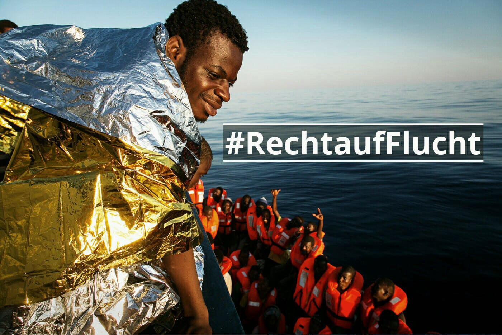
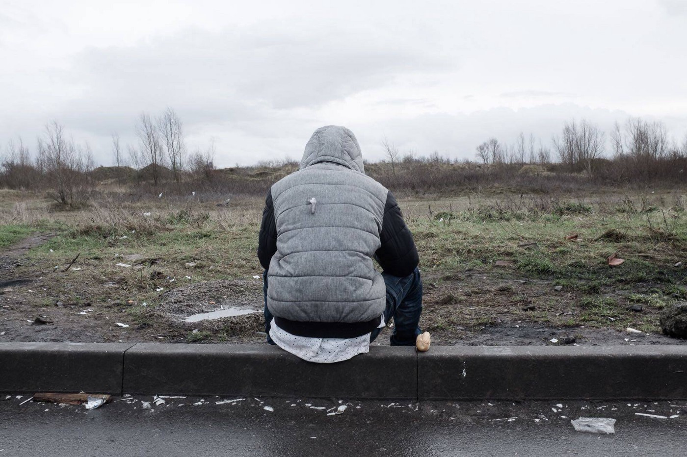

### AYS Daily Digest 27\.1\.18: Another Tragic Day on the Mediterranean

_Sea rescues and LCG crimes//Attack in Kabul//Fire kills two in Italy//Day of Action in Germany//Sickness and vulnerability for minor in Calais//Solidarity protests for Afrin//and more…_

 \.](assets/fcd3fab7ec64/1*sU1DJRHTpJjzo0yHAvhw_Q.jpeg)

Photo Credit: [SOS Mediterrannee](https://www.facebook.com/sosmedfrance/posts/2089338821339098?hc_location=ufi) \.

The rescue vessel the Aquarius was witness to another tragic day on the Mediterranean sea\. Early in the morning, the vessel responded to reports of an endangered dinghy floating off the coast of Libya\. When they arrived at the scene, the Libyan Coast Guard parked in front of their boat, preventing them from completing the rescue\. While the LCG took the refugees onto their boat, MSF [noted today](https://twitter.com/msf_sea/status/957257621882449920) , “This cannot be classified as a ‘rescue operation’\- the reality is that people are not being returned to a port of safety”\. This is true of all LCG operations\. When refugees are taken back to Libya, they are taken to a place where they are often kidnapped, ransomed, and enslaved\. A place where their lives have no value\.

The LCG completed this criminal action despite the fact that where the Aquarius encountered the dinghy occurred outside of Libyan waters, where the LCG has no authority\. This is yet another instance of the brutal LCG violating international and maritime law\. When will Italy stop funding these killers?

■■■■■■■■■■■■■■ 
> **[MSF Sea](https://twitter.com/MSF_Sea) @ Twitter Says:** 

> > BREAKING: Distressing incident on #Mediterranean this morning. Libyan Coastguard boat orders #Aquarius away from rubber dinghy in distress. At a distance of only 100 metres, #MSF team saw people’s faces and heard their screams but were prevented from rendering assistance. https://t.co/BPxcDpWJ8M 

> **Tweeted at [2018-01-27 11:14:32](https://twitter.com/msf_sea/status/957210210044727296).** 

■■■■■■■■■■■■■■ 

After being forced to stand by and witness this incident, workers aboard the Aquarius responded to a call later in the day about another dinghy sinking in international waters after fleeing Libya\. According to their report, “when the SOS Mediterranee rescue boats arrived near that boat in distress, people were already in the water\. 83 people were rescued and are safely aboard the Aquarius\.”

According to the coordinator from the Aquarius, when they approached the dinghy it was already sinking on one side and mnay people were in the water\. Eight of the people aboard the dinghy, six of whom were children, had taken water into their lungs and had to be transported via helicopter to a hospital in Lampedusa\. Two women drowned during the rescue\. Both had children with them who are now orphans\.

■■■■■■■■■■■■■■ 
> **[SOS MEDITERRANEE France](https://twitter.com/SOSMedFrance) @ Twitter Says:** 

> > 🔴 "The boat started to deflate. People started to panic. I was on top of the boat and someone started to pull on me and make me fall into the water" said a man from Cameroon who survived today's tragedy, to a rescuer #Aquarius https://t.co/oNpOhGVgzF 

> **Tweeted at [2018-01-27 18:55:06](https://twitter.com/sosmedfrance/status/957326114799673350).** 

■■■■■■■■■■■■■■ 

The rescue organization Proactiva Open Arms rescued over 350 people from a single boat in the Mediterranean today\.

The German Sea\-Watch rescue group responded to a call at 7am this morning\. After answering the call and taking the refugees on board, they immediately had to respond to another call\. They have not yet announced the number of people rescued today\.
### Afghanistan

Today a [car bomb](http://www.aljazeera.com/news/2018/01/huge-blast-rocks-afghanistan-kabul-180127084053950.html) on a crowded central street in Kabul took over 100 lives, with over 150 people severely injured\. The Taliban has claimed responsibility for this vicious assault on civilians\. Today we are forwarding this story as a reminder of the conditions in a country much of Europe has deemed “safe”\. Deportations to Afghanistan are being carried out regularly from many EU countries, including Germany\. This is the same country where over 10,000 security forces have been killed in the last year, and an average of 10 civilians are killed in terror attacks per day\.
### Greece

[Reports indicate](https://www.youtube.com/watch?v=KB0Am3wj8nk) that the land crossing between Turkey and Greece is becoming an increasingly popular route for smugglers\. There is not much information or reliable statistics from this portion of the EU border, but a number of smugglers have been intercepted in the area in the past months\. During past weeks, police reports have mentioned several arrests of smugglers on the land border, driving groups of between 30–40 refugees to the Greek mainland\.

While the land crossing may not have the same risks as the sea, it is nonetheless a dangerous journey\. There are wild boars and wolves in the woods between Greece and Turkey, and the risk of attacks is real\.

Furthermore, refugees have to pass across the freezing Evros River to make the crossing, where many have died of drowning and hypothermia\. And the risk of abuse, exploitation and rape at the hands of authorities and smugglers \(and the line between the two is not always distinct\) is ever\-present\.

The Mobile Info Team has released information in Arabic about the risk of being sent back to Greece from another EU country under the Dublin Regulation\. They report that deportations to Greece have become increasingly rare, but such deportations can still happen\. Information in Arabic [here](https://www.facebook.com/mobileinfoteam/photos/a.1800063030222418.1073741830.1796286800600041/2110873072474744/?type=3&theater&ifg=1) \.

The Greek Asylum Service published its report for 2017 this week\. The Asylum Service registered 58,661 people who applied for asylum, and of 26,668 who made their submissions on the Aegean island hotspots\.

According to the report, a total of 40,127 applications were submitted by men and 18,535 by women\. A total of 2,275 applications were submitted by unaccompanied minors in 2017\. The main countries of origin for asylum seekers were **Syria** \(16,396 applications\), **Pakistan** \(8,923\), **Iraq** \(7,924\) and **Afghanistan** \(7,567\) \.

In 2017 in Greece, 10,364 refugees were granted asylum, and 34,646 applications were rejected\.
### Italy

A [fire](http://www.ansa.it/calabria/notizie/2018/01/27/incendio-in-tendopoli-in-calabria-un-morto_518af28b-66d8-44fe-b269-5529d9dab4a1.html) at the refugee tent\-camp in San Ferdinando killed one woman last night and injured at least two others\. Investigators are still looking into the cause of the fire, but initial evidence seems to indicate that it was caused by a deliberate fire in a tent which people had set to keep warm\.

Over two hundred shacks and tents were destroyed in the fire\. Obviously this fire is an indication that the encampment is entirely unsafe, and new accommodations for those living there must be found immediately\. There was a fire in the camp last July as well, yet authorities did not take the proper measures to prevent it from happening again\.

While the fire may not have been a case of arson, from our perspective it is still a homicide, created by the negligence of a society and its government\.

> “How many deaths do we have to expect before launching rational and effective welcoming measures?” — SOS Rosarno group 

The woman who died was named Amine\. She was thirty years old and from Eritrea\.

■■■■■■■■■■■■■■ 
> **[Melting Pot Europa](https://twitter.com/MeltingPotEU) @ Twitter Says:** 

> > #Rosarno incendio al ghetto, morti e feriti. Morire di povertà nel 2018 mentre l'1% della popolazione mondiale detiene il 99% della ricchezza https://t.co/Mc8E26h4ug 

> **Tweeted at [2018-01-27 09:41:53](https://twitter.com/meltingpoteu/status/957186892713353216).** 

■■■■■■■■■■■■■■ 

### Germany

\#RighttoEscape\. Photo Credit: Sea\-Watch

The German rescue organization [Sea\-Watch](https://www.facebook.com/seawatchprojekt/) announced a day of protest tomorrow to demand safe passage for refugees\. The demonstration will start at 10 am at Alexanderplatz, Berlin\. Click [here](https://www.facebook.com/events/1944790475782085/) for more information\.

In conjunction with the day of protest, Sea\-Watch is asking people to share their own stories of fleeing from persecution, or the stories of others under the tag \#RechtaufFlucht \(right to escape\) \.
### France

Following an agreement between UK Prime Ministers May and Franch president Macron to speed up the movement of some refugees to the UK, many refugees in Northern France and Calais seem to have a newfound sense of hope\. Unfortunately, it will be a false hope for most of them, as very few will be allowed to enter the UK legally\. The transfers will almost all be children, and the agreement has placed the absurdly low cap of 480 children in total\.

According to volunteers from [Care 4 Calais](https://www.facebook.com/care4calais/?hc_ref=ARTtx6H5QAxMMd-uxP5X1Chs9B1QUktn7wn0luTV2Wv-i27GHzElRXWtbwh9fHUYSII&fref=nf&hc_location=group) , over 200 refugees have arrived in the Calais area in the past few days, expecting that they can make it to the UK\. Most of these people are unaccompanied minors\. In response to this influx, the local government has announced that they will not be doing any screenings of unaccompanied minors for the transfer of unaccompanied minors to the UK\.

While the cowardly local government buries their head in the sand, and ignores the plight of young refugees in their own backyards, volunteers have already stepped into action\. The German volunteer group [Franken Konvoi](https://www.facebook.com/franken.konvoi/) is planning a trip to Northern France in response to the influx of new arrivals in the Calais area, and has updated their needs list in preparation for the trip\. You can see the list and find out how to donate [here](https://www.facebook.com/franken.konvoi/photos/a.917776704981540.1073741827.917644168328127/1637790266313510/?type=3&hc_location=ufi) \.

Today Care 4 Calais shared the testimony of one of their volunteers, who befriended a young Afghani man in Northern France\. We are forwarding some of this account, simply as a reminder of the human lives and stories behind words like “refugee” and “exile”\. This story is also a reminder of the awful conditions and dangers many ordinary people face in a country that the EU has deemed largely “safe”\. From the account of Calais volunteer Samuel Jones:

> He \[the Afghani young man\] told me how one afternoon while walking home from school in his home city, he was taken captive by the Taliban and forced into slave labour\. He was made to carry weapons over snowy, roadless, mountain top terrain in Afghanistan\. If he arrived late with the heavy sacks, filled with guns and bullets, he would be beaten\. If he failed to arrive at all, he would be hunted and killed\. 

The 19\-year old from Afghanistan, in Calais\. Photo Credit: Care 4 Calais

> For nearly three years he would walk, cold and alone through snowy mountain mazes, simply to save himself from the pain that followed failure\. At the age of 19, he managed to make his escape, but knew the risk that staying in his country posed\. He packed his rucksack one last time, and made the nine\-month journey across land to this wet curb beside a slowly fading fire in a corner of northern France\. 

These are the sorts of hardships that countless refugees in Europe have had to face\. And now these same refugees, after making a brave and perilous journey, are being abandoned to the streets and woefully inadequate camps\.

The NGO [Medecins du Monde](https://www.facebook.com/Médecins-du-Monde-Hauts-de-France-850170168369696/) issued an alarming statement this week, concerning the high number of people who need medical care in Calais: “The Health\-Care Service of the Calais hospital now receives 30 or 35 refugees per day\. This is equivalent to the number of daily consultations during the time of the jungle camp \(which housed between nine and eleven thousand people, not just a few hundred as now\) \. The inhumane conditions under which people survive in Calais are the cause of 65 % of the pathologies we encounter at mobile clinics\. Stop the policies that are making people sick\!”

 \.](assets/fcd3fab7ec64/1*3K4OMrvlGyUj8XwQpeopCg.jpeg)

How would you feel if this were where you had to sleep on a cold night? A refugees sleeping\-quarters in Calais\. 26/1/18\. Photo Credit: [Medecins du Monde](https://www.facebook.com/Médecins-du-Monde-Hauts-de-France-850170168369696/) \.

Despite the usual bad news, today there was [one victory](http://www.sudouest.fr/2018/01/26/expulsion-d-un-dubline-omer-pourra-rester-a-pau-4146150-4344.php) for asylum seekers and their allies in France: a young Sudanese man who was facing a Dublin deportation to Italy had the decision revoked by a court, which cited the systematic failure to assist asylum seekers in Italy\. It is unclear at the moment how much this case could affect legal precedents in France and alter the application of Dublin deportations there\.

In further news from the French Courts, a [judge in Nice](https://humanite.fr/nice-les-pratiques-de-la-police-aux-frontieres-jugees-illegales-649422) has ruled that the longstanding practice of the French police deporting unaccompanied minors back to Italy is illegal and a violation of international human and child rights\. The case stemmed from an instance in which a 12\-year old Eritrean child was deported back to Italy by train, completely on his own and without any assistance, after his capture on the French border\.

The volunteer group [Rastplatz](https://www.facebook.com/rastplatz/?hc_ref=ARRp5qy_iNpvC40pmRxa9RtqwrOWEMkE2FzSHS6LlxyoNCJVaoDgTVvU08zjPwH1zcY&fref=nf) released a video today revealing the deliberate neglect of refugee encampments throughout Paris\. While the group, alongside many others, has repeatedly called upon the Parisian municipality to clean up these areas, they have been met with no response\. This is despite the fact that the municipal workers seem to have no issue cleaning up trash in other places throughout the city, such as those frequented by tourists, and seem to have taken the initiative of confiscating blankets from refugees\. Rastplatz is claiming that the municipal government allows these encampments to fester with trash so that they have the excuse to evict them\. Where the government fails to act, ordinary citizens and volunteers have stepped in and cleaned up the trash\. See the full video [here](https://www.facebook.com/rastplatz/videos/576665446014254/) \.
### General

Antifascist and solidarity groups across Europe announced a day of protest and demonstration today against the continued attacks on Kurds in the Afrin region near Turkey\. Marches were held in the Netherlands, Germany, France, Sweden, Australia, Switzerland, Greece, Cyprus, Austria, England, Belgium, Canada, Romania, and Italy\. In Vienna, protestors marched to the Turkish embassy\.

](assets/fcd3fab7ec64/1*euamJgVp0VxXWRQraDjQ_w.jpeg)

Showing solidarity in Vienna\. Photo Credit: [Autonomous AntiFascists Austria](https://www.facebook.com/autonome.antifa.w/?hc_location=group_dialog)

The [Flying Seagull Project](http://www.theflyingseagullproject.com/support-us/) is a volunteer circus group that tours refugee camps throughout Europe \(and Greece in particular\) to bring smiles and laughter to children who have faced incredible hardship\. They have recently updated their [website](http://www.theflyingseagullproject.com/what-we-do/) , with additional information and ways to [donate](http://www.theflyingseagullproject.com/support-us/) \.

](assets/fcd3fab7ec64/1*Hwtm9TeSfr3vsXLRIgfxEA.jpeg)

Performing for refugee children on Samos\. Photo Credit: [Flying Seagull Circus](https://www.facebook.com/pg/flyingseagulls/photos/?ref=page_internal)

> **We strive to echo correct news from the ground through collaboration and fairness\.** 

> **Every effort has been made to credit organizations and individuals with regard to the supply of information, video, and photo material \(in cases where the source wanted to be accredited\) \. Please notify us regarding corrections\.** 

> **If there’s anything you want to share or comment, contact us through Facebook or write to: areyousyrious@gmail\.com** 

_Converted [Medium Post](https://areyousyrious.medium.com/ays-daily-digest-27-1-18-another-tragic-day-in-the-mediterranean-fcd3fab7ec64) by [ZMediumToMarkdown](https://github.com/ZhgChgLi/ZMediumToMarkdown)._
