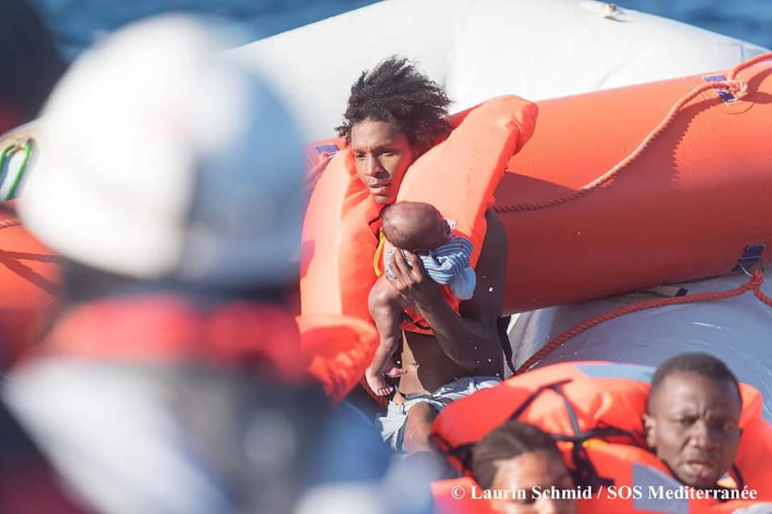
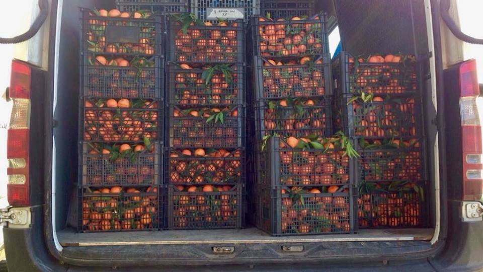
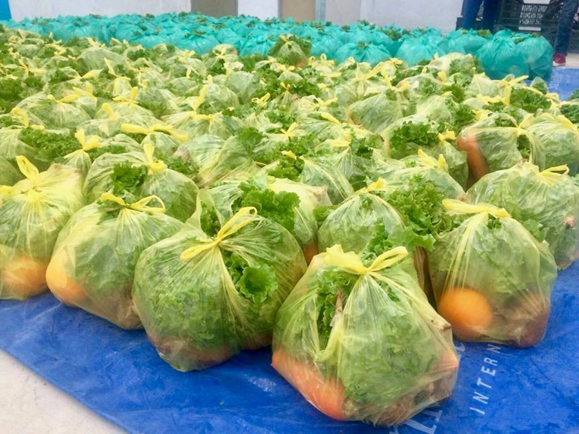
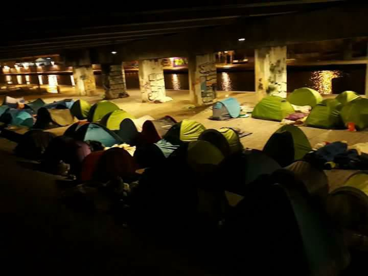
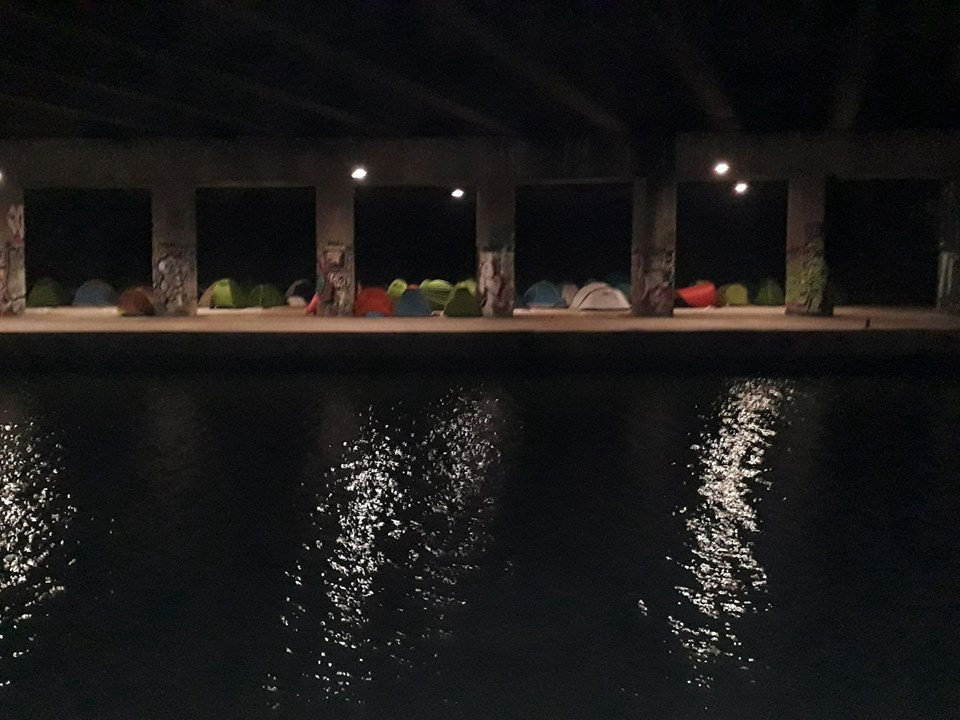

### AYS Daily Digest 28/01/2018: More than 200 reach Lesvos in one day
#### 200 arrive on Lesvos / Increasing pull\-backs in Libya / 1500 people in the streets of Paris / Tents needed in Calais / Calls for donations in Greece and Serbia / Updates on yesterday’s events in the Mediterranean and more

Lesvos, Greece January 2018
A refugee boy with a stray dog in Moria refugee camp\. People live under terrible and dangerous conditions in tents under freezing temperatures\.
Photo by Fotomovimiento
#### Feature

After many days of bad weather conditions and no new arrivals on the Greek islands, there was a long and hard night of work on Lesvos again\. Five boat arrivals have been reported so far with more than 200 people in total on board\.

The first boat landed in Kratigou, Lesvos south, carrying 60 people \(25 children, 15 women, 20 men\), the second boat landed on Korakas, Lesvos north with 26 people \(13 children , 6 women, 7 men\), the third boat was picked up by Frontex, outside Kratigou, Lesvos south, with 50 people \(20 children, 30 adults\) \. The fourth boat was picked up by HCG outside Agrelios, Lesvos south, carrying 65 people\. The fifth boat was reported to have landed in Agrielia, Lesvos south, with approximately 15 people\.

In [reports](http://www.ekathimerini.com/225221/article/ekathimerini/news/cold-snap-fuels-fears-about-migrants-in-tents) about improved conditions in Moria camp, it is not always mentioned that the Olive Grove next to Moria is now full of tents and an estimated number of 1000 people live there, including families with children, with no heating and no facilities, [Lesvos Solidarity — Pikpa](https://www.facebook.com/pikpalesvos/) reminded us\.

“The fact that people are allowed to go to the mainland \(around 400 people last week\) is of course good news\. But much more needs to be done for the thousands of people who are forced to spend the winter in these unacceptable conditions\.”
#### LIBYA
#### Increasing pull\-backs

So far in 2018, over 1,430 refugees and migrants have been disembarked in Libya by the Libyan Coast Guard \(LCG\) \. In January 2018, UNHCR has observed an increase in the numbers of rescue/interception operations conducted by the LCG when compared to the same month in 2017 \(1,025 individuals\) and previous months such as November \(1,214 individuals\) and December 2017 \(1,157 individuals\), [writes](https://migrantsatsea.org/2018/01/28/libyan-coast-guard-migrant-interceptions-pull-backs-steadily-increasing/) Migrantsatsea\.

Read the full UNHCR Flash update on Libya [here](https://reliefweb.int/report/libya/unhcr-flash-update-libya-20-26-january-2018) \.

Around 800 people were rescued in the Mediterranean yesterday \(Saturday 27/1\) as they tried to reach Europe and two bodies were recovered, Reuters [reports](https://www.reuters.com/article/us-italy-migrants/around-800-migrants-rescued-in-mediterranean-two-bodies-recovered-idUSKBN1FG0V4?feedType=RSS&feedName=worldNews&utm_source=Twitter&utm_medium=Social&utm_campaign=Feed%3A+Reuters%2FworldNews+%28Reuters+World+News%29) \.

People were picked up from two barges, two rubber dinghies and one small boat in five separate rescue operations\. During one of the rescues, two helicopters from the Italian navy were used to pick up seven children with water in their lungs and transport them to the nearest hospital in Tunisia where they were given the necessary care, the Italian coast guard said\.

SOS MEDITERRANEE published a [press release](http://sosmediterranee.org/tragic-day-for-aquarius-in-the-mediterranean-a-fatal-shipwreck-and-new-interception-of-migrant-boat-by-libyan-coast-guard/?lang=en) regarding yesterday’s [events](ays-daily-digest-27-1-18-another-tragic-day-in-the-mediterranean-fcd3fab7ec64) \. Early in the morning, the Aquarius vessel responded to reports of an endangered dinghy floating off the coast of Libya\. When they arrived at the scene, the Libyan Coast Guard parked in front of their boat, preventing them from completing the rescue\.

> “ _The scene was devastating, with many urgent medical cases\. They kept coming, one after another, unconscious and not breathing_ ,” said MSF nurse Aoife Ni Mhurchu\. 

> Seven unconscious persons \(one woman, three babies and three young children\) were resuscitated successfully\. Two other women did not survive despite the efforts of the medical team, leaving two children orphans: a baby of a few months, who is currently aboard the Aquarius, and a 4\-year\-old child, who was evacuated together with nine other persons to Sfax, Tunisia by an Italian Navy helicopter\. They need immediate care due to pleural effusion\. 

The LCG should not have refused the support of SOS Med\. SOS Med was instructed by MRCC and was better equipped\. According to the SAR rules, in such cases, SOS Med becomes the on\-scene co\-ordination and the activities shall be co\-ordinated to ensure the most effective result, [Paolo Biondi](https://twitter.com/PaoloBiondi82) wrote\.

](assets/f1c4b6283936/1*Wx0G-VjV78ZV5o316G79wQ.jpeg)

Photos by Laurin Schmid / [SOS MEDITERRANEE France](https://www.facebook.com/sosmedfrance/?fref=mentions)

MSF Sea updated on the course of action: Aquarius has safely taken on board 130 people — including 21 unaccompanied minors & 5 pregnant women — who were rescued earlier today by a supply vessel\. With now over 200 people on board, Aquarius will continue to patrol international waters tonight in case of more rescues\.

Here you can [sign the petition against the funding of the very often violent Libyan Coastguard](https://sea-watch.org/petition-eu-finanzierte-gewalt-gegen-fluechtende-durch-die-libysche-kuestenwache-beenden/) \.

■■■■■■■■■■■■■■ 
> **[MSF Sea](https://twitter.com/MSF_Sea) @ Twitter Says:** 

> > With nearly all rescued children medically evacuated yesterday there are just a few children left on board the #Aquarius. Including a 6-month-old baby boy, now an orphan after his mother drowned, &amp; a 5-year-old boy left with his father after his mother &amp; brother were evacuated. https://t.co/sKuR5IsYQg 

> **Tweeted at [2018-01-28 14:35:45](https://twitter.com/msf_sea/status/957623233007816704).** 

■■■■■■■■■■■■■■ 

#### GREECE

Athens Legal support team posted their 9th denouncement video\. This one is about the ineligible nationalities\.

“ We denounce the asylum system regime which functions from a perspective that some nationalities are ‘ineligible’ and so leaves human beings who are in great need on the streets with no proper or official access to basic services, information or legal advice\.”

AlJazeera [wrote](http://www.aljazeera.com/news/2018/01/evros-river-forced-pushback-refugees-edge-eu-180128105408674.html) about some refugees trying to enter Greece near the Evros river, through its northern land border with Turkey, who were threatened and forced to go back, in breach of international humanitarian law\. The Greek police have denied the allegations\. The land crossing between Turkey and Greece is becoming an increasingly popular route for smugglers\.
#### Lesvos
#### Free Hesam

Hesam Shaeri Hesari has continued his hunger strike in Moria, Lesvos\. Yesterday Hesam announced that he had been transferred to the detention center \(section B\) inside the Moria refugee camp on Lesvos, Greece\. He continued his hunger strike, which he started 18 days ago\. Three days ago Hesam also stopped drinking, Enough is Enough [wrote](https://enoughisenough14.org/2018/01/28/hesamshaerihesari-continues-hunger-strike-in-moria-on-lesvos/) \.

Hesan was a political activist in Iran\. His request for asylum was rejected\. His friend [wrote](https://enoughisenough14.org/2018/01/28/hesamshaerihesari-continues-hunger-strike-in-moria-on-lesvos/) :

“I have already experienced being in political and dictatorship prisons in Iran\. In spite of engaging in political activity against the regime, even I had the right to call and used my cellphone, but Hesam, without having any crime and just for claiming asylum, is kept in prison and not allowed visitors\.”
#### Calls for donations
#### Chios

For almost a year, RLCA has been providing legal information for asylum seekers on Chios\. The beginning of winter and thus constant rain makes consultations outside in front of the Hotspot Vial impossible\. Therefore, they would like to rent a small van and in the future purchase it in order to be able to continue to provide information in a confidential atmosphere and with direct access for asylum seekers from the camp\. See how you can help out [here](https://www.betterplace.org/en/projects/59633-mobilise-legal-aid-on-chios-greece) \.
#### Thessaloniki

[IHA — InterEuropean Human Aid Association](https://www.facebook.com/iha.help/) ’s Food Project currently supports three refugee camps and two community centres in the Thessaloniki area\. Their team on the ground considers people’s wishes as far as possible in their budget planning and when ordering at the greengrocer\. Though choice is limited during the winter months, they are able to offer a balanced selection of vegetables\. Donations are still welcome [here](http://www.iha.help/en/help/donating-money/) \.

Photos: IHA
#### SERBIA
#### Urgent call for diapers

The babies in the Serbian refugee camps \(Preševo, Bujanovac, Vranje and Krnjača\) need diapers\!

In the Serbian camps they depend on your donations\. If you want to make a whole “ dry month “ for a baby, donate 30 francs with the words “ diapers “ to the Border Free Association account\. The donated diapers are distributed fairly among all the babies\. For more info see [here](http://Borderfree Association) \.

All refugees and asylum seekers in Belgrade are welcome to join hourly classes in English, German, Serbian, and Maths, as well as recreational Workshops\. OPENING HOURS are 14h\-19h\. Team of volunteers will be happy to accommodate you and assign you a class, as well as provide you with a warm beverage and some snacks\.

If you have any questions, please write at: theworkshop@northstarserbia\.org

](assets/f1c4b6283936/1*sYEYJag9CATWDa6YJZZ4Lg.jpeg)

[The Workshop: Belgrade](https://www.facebook.com/theworkshopbelgrade/)
#### GERMANY

People gathered today for the [Recht auf Flucht](https://www.facebook.com/hashtag/rechtaufflucht?source=feed_text&story_id=783647998511102) \(“right to escape”\) at Alexanderplatz in Berlin, with the aim to stand up for the fundamental right to migration and asylum\. More on the event [here](https://www.facebook.com/JugendRettet/posts/783647998511102) \.

](assets/f1c4b6283936/1*Tlyk5e4V-Ltu0yqo-DmnbA.jpeg)

Photo by [Jugend Rettet e\.V\.](https://www.facebook.com/JugendRettet/?hc_ref=ARRtMbgl6GubZPqNDqo84HExn_H2yqIyF08oeZcVRiLCPJGFA8c26aVJVXKr2CVAAWU&fref=nf)
#### FRANCE

Our friends from PRGS are very busy and have reported still very high numbers of people on the streets of Paris and, even after three evacuations and one eviction, the count yesterday was 1173 in various locations of the city\. [Solidarithé](https://www.facebook.com/solidarithe/) writes about 1500 people in the street, sleeping rough and living in really bad conditions\. Among them the situation of unaccompanied minors is particularly dramatic\. They are in Port de la Chapelle almost every day helping out\.

Two weeks ago by the canal
#### Paris, where does you rubbish go?

“Authorities are purposely worsening the conditions in the street camps in Paris\. They then use it as a reason for evacuations\.”

Hard working volunteers like [Paris Refugee Ground Support](https://www.facebook.com/PRGS.team/?fref=mentions) are doing the job of the municipality\. Cleaning the camps and getting rid of the piled\-up rubbish\. Dedicating their already limited time and energy to to make conditions just a little better, [Rastplatz](https://www.facebook.com/rastplatz/?hc_ref=ARSWQzntHcHSjhG7Polk9wXqj7rvCwD5Wsu_mdFuQRNmjCUoDYaz4AIOnLzhiWh23dg&fref=nf) writes\.

Yesterday, there was a demonstration of Sudanese refugees against the political and economic collaboration of the French government with Sudan\.

Many people on the streets of Paris are from Afghanistan\. As everybody, they are barely surviving\. Instead of providing people with accommodation, food or at least stopping police violence, Paris major decided to preted he cares with the decision to symbolically turn off the Eiffel Tower lights for one night to pay tribute to the victims of the Kabul attack\.
#### Calais

With freezing temperatures, [donations, specifically tents, are much needed](https://www.facebook.com/groups/CalaisMigrantSolidarityActionFromUK/permalink/1804999939574745/?hc_location=ufi) \. There are currently around 1000 people sleeping outside in and around Calais at the moment\.

Preferably 1/2/3/4 person, good condition tents, to provide some sort of shelter for those who are sleeping rough, are most needed\. Pop\-ups are good too\. For more information/if you have any questions, don’t hesitate to contact calaisdonations@gmail\.com or PM [Charlotte](https://www.facebook.com/charlottemariahead?fref=gs&hc_ref=ARSyqbR7TMp_FgrBjdgrLOfKApbKx7AvL6ay5bkAKil-SJNmy1kkDwMG1IhD3dh0BMQ&dti=882751941799554&hc_location=group) \.

On 3rd February, 14h, at Rue de la verrotière people will [meet in support](https://www.facebook.com/events/889874634514651/) of refugees in Paris\.

[**Here**](https://www.facebook.com/calaisaction/posts/1801776496541514?hc_location=ufi) is a donation list for Calais, to be collected **next Friday \(Feb 2\) in London** at [Mycenae House](https://www.facebook.com/mycenae.house/?fref=mentions) , from 6pm\!

> _PRIORITY NEEDS_ 
 

> Emergency blankets and ponchos
 

> Handwarmers in bulk
 

> Tents
 

> Blankets and sleeping bags
 

> Thermals: socks \(sizes 40–43\), tops and leggings
 

> Gloves, scarves and hats
 

> Boots \(sizes 40–43, preferably waterproof\)
 

> Men’s Underwear \(Boxers, only new please — Small and Medium\)
 

> Waterproof and non\-waterproof jackets \(small and medium\)
 

> Unlocked and cleared mobile phones with chargers
 

> Tarpaulin \(at LEAST 2m x 2\.5m\) 

Calais Laundry needs [donations](https://www.facebook.com/permalink.php?story_fbid=156021025051675&id=155985555055222&hc_location=ufi) for seting up at the [L’Auberge des Migrants](https://www.facebook.com/AubergeMigrants/?fref=mentions) / [Help Refugees](https://www.facebook.com/HelpRefugeesUK/?fref=mentions) warehouse in Calais\. Initial set up costs: 5500€ \(1500€ already pledged, 4000€ still needed\), while monthly operating costs \(1000€ x 12\): 2 months pledged\. Go follow their work and fund them [here](https://www.gofundme.com/calais-laundry-set-up-costs) \!

> **We strive to echo correct news from the ground through collaboration and fairness\.** 

> **If there’s anything you want to share or comment, contact us through Facebook or write to: areyousyrious@gmail\.com** 

_Converted [Medium Post](https://areyousyrious.medium.com/ays-daily-digest-28-01-2018-more-than-200-reach-lesvos-in-one-day-f1c4b6283936) by [ZMediumToMarkdown](https://github.com/ZhgChgLi/ZMediumToMarkdown)._
