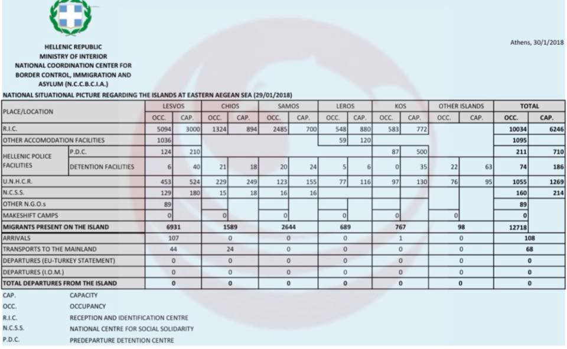

### AYS Daily Digest 30/01/18: Illegal police pushbacks at the Evros crossing
#### Evros illegal practices — why are they able to continue? / New arrivals on Chios / Police pressure on those standing up to injustice in Athens / Croatia: Dubious ways of integration nobody except IOM knows about / Humanitarian corridor brought new people to Italy and France / Help Refugees needs support to help Dubs minors / more news

](assets/90fb54f4046f/1*xjZ5NJcInq7twSuXZuQ8fA.jpeg)

Photo by: [Sol Carrillo](https://www.facebook.com/msolcarrillo?hc_ref=ARQCZzsQfBID3fu2GZjxnTzwfSbObUjx17ZAY5MsHR_jBFp9FkTa1HZBbyFwxNvEbHk)
#### FEATURE

The River Evros acts as a natural barrier for the remainder of the 200km land border between Greece and Turkey and has claimed many lives, especially following the erection of a fence as the safer route across the fields, previously widely used, has been closed\. 
A growing number of people in the region have been complaining that in the past few years there has been an illegal mechanism of push backs used on people who have crossed the Greek border back to Turkey\. In many cases police and masked men in camouflage uniforms are reported to beat migrants, steal their belongings and send them back to the perilous river in order to return to Turkey\.

There are testimonies to support claims that after they are arrested and transferred to police stations, the people are “loaded” into vans and trucks, and while they have received assurances that they are transported to a reception centre, they are taken to the border where teams threatening with fire arms make sure they pass to the opposite side\. 
Often they say that before their illegal return to Turkey, they are transported and remain in the “military” areas for hours until the night falls, away from the indiscretions of the residents and without the possibility to ask for a lawyer\.
#### Cases

**Strong indications of push backs in 4 cases**

Lawyers Antonis and Thodoris Karagiannis have dealt with refugee affairs for the past 4 years\. Since the summer of 2017, at least four cases have evidence of illegal returns\. Read more: [**here**](http://m.tvxs.gr/mo/i/251335/f/news/ellada/tvxs-apokleistiko-bromiko-mystiko-stis-oxthes-toy-ebroy-ntokoymenta.html) \.

On October 21, the two lawyers received messages on their mobile phones from refugees, informing them that they have crossed the border and are in Greek territory\. Written messages include the exact location of the refugees through a GPS application, photos in front of Greek signs and photos of their passports\. The Police officers in Neo Chimonio who then detained them denied the story\. However, through a mobile phone the refugees continue to communicate with their lawyers for hours and seek medical help\. Also detained was a pregnant woman that bleeds and many children, and reports of the prisoners being beaten in detention\. Refugees claimed they were in the detention center, kept in two rooms, with 100 people, including 45 children\.
Communication was interrupted by noon on the October 22, when refugees report they were being transported by cars from the back doors of the police station, only to find themselves at the river straight afterwards\. 
The police then threatened them with arms and took them to Turkey\.

**The story repeats on October 27**

The Police Internal Affairs department was also informed but did not reply, or ask the lawyer for existing data\.

**The last incident was recorded on December 31\.** Refugees, who could not stand the cold anymore had alerted the police, calling 112\. The audio messages they sent to the two attorneys depict the dramatic situation in which the police is present\.

There is a pressure on lawyers throughout lawsuits, as well as constant threats\. Lawyers at NGOs also confirm that it is especially common to receive complaints of illegal returns to the area\.
#### So far\. \.

In the past, violent push backs have been recorded by organizations dealing with the rights of refugees and immigrants, but the Greek state has never carried out a thorough investigation\. In December 2013, activists told the media that 150 immigrants were violently taken by the Greek authorities into Turkish lands\.

Illegal push backs were denounced in the months of May and June 2017\. Hellenic League for Human Rights had denounced the return to Turkey of 17 Turkish citizens, including journalists, while the Network for Social Support of Refugees and Immigrants’ rights denounced publicly and specifically elements of the violent return of a Syrian family\.
#### TURKEY
### The myth of voluntary deportations

> _What happens to migrants who sign up for the IOM return programme during the process and after the return to their home countries? Why do asylum seekers agree to leave Europe again?_ 

> The observation of several cases reveals that many migrants face detention and serious physical and mental harm during and after their participation in the programme of “Assisted Voluntary Return and Reintegration”\. 
 

> _— Read the entire text explaining and documenting the story: [**here\.**](http://harekact.bordermonitoring.eu/2018/01/30/the-myth-of-voluntary-deportations-assisted-voluntary-return-and-reintegration-from-greece/)_ 

#### SEA

Libyan coast guards on Monday found 121 people aboard a rubber boat off the coast of Garabulli district, east of Tripoli\.
“The migrants were from 10 African nationalities, including 95 men, 12 women, and 14 children, according to the Libyan Coast Guard Information Office”, media [reported](https://www.libyaobserver.ly/inbrief/121-illegal-immigrants-rescued-east-tripoli) \.

■■■■■■■■■■■■■■ 
> **[SOS Humanity](https://twitter.com/soshumanity_de) @ Twitter Says:** 

> > UPDATE At 5 pm this afternoon, 215 people rescued in dramatic conditions in the Mediterranean over the week-end will finally reach a place of safety in the south of Italy. Relief... and grief on board the #Aquarius as 2 young mothers didn't make it, and many people are missing. https://t.co/waZQTEtDhq 

> **Tweeted at [2018-01-30 12:27:56](https://twitter.com/sosmedgermany/status/958315843254931456).** 

■■■■■■■■■■■■■■ 

■■■■■■■■■■■■■■ 
> **[Paolo Biondi](https://twitter.com/PaoloBiondi82) @ Twitter Says:** 

> > MRCC Rome sometimes decides in an arbitrary way who should assume SAR “on scene command”. SAR rules require the most effective result. This could include consideration relative to equipment, training and port of disembarkation. [twitter.com/GerrySimpsonHR…](https://twitter.com/GerrySimpsonHRW/status/958031506454274054) 

> **Tweeted at [2018-01-30 10:43:38](https://twitter.com/paolobiondi82/status/958289596965707776).** 

■■■■■■■■■■■■■■ 

Missing Migrants Project tracks incidents involving migrants, including refugees and asylum seekers, who have died or gone missing in the process of migration towards an international destination\. Here is their latest [**update** \.](http://missingmigrants.iom.int/)
#### GREECE

Official figures from the islands as from January 29 document the following:

New registrations on the islands/Transports to the mainland
Lesvos 107/44
Chios 0/24
Kos 1/0
Total 108/68
### Chios

60 people have arrived by boat to Chios on Tuesday morning, near Kallimassias\.
In the group, there were 13 women, 17 men and 30 children\.

The weather on Chios is still making lives of those staying in the canvas tents very difficult, with the wind tearing and dismantling even the more “solid” materials…
### Lesvos

 **\)**](assets/90fb54f4046f/1*KD17DHrlSr-6KBCSQ10jKA.jpeg)

“After stormy and bad weather, more than 200 people arrived in less than 24 hours\. Most of them had been waiting on the Turkish border to cross over for some time\. We report and share data to keep track of the overall situation\.” \(by [**Refugee Rescue / ‘Mo Chara’**](https://www.facebook.com/RefugeeRescueUK/?hc_ref=ARSn2dZmjvjIGzSr_F1TLxnRRFoySchrqaGDUpR01jMfXBmlckUfwNHB4STb3BdtwL4&fref=nf) **\)**
### Samos

 \)](assets/90fb54f4046f/1*cOM--zW-7KGuAtJdDum2dQ.jpeg)

“The leakage of sewage from the main sewage pipe at the entrance to Samos camp\. The foul smell and the dirty water are indescribable” \(Photo: [عشتار للهجرة واللجوء](https://www.facebook.com/%D8%B9%D8%B4%D8%AA%D8%A7%D8%B1-%D9%84%D9%84%D9%87%D8%AC%D8%B1%D8%A9-%D9%88%D8%A7%D9%84%D9%84%D8%AC%D9%88%D8%A1-687993924641223/?hc_ref=ARRauTSi2aLfcKuYe4BLpUIx_WJggQnYsdOCsPq30FxrLTFqbhyNJgMeAsrZn7495LY&fref=nf) \)

](assets/90fb54f4046f/1*ia_N4Rh0dd5vMX5-CR7F_w.jpeg)

[https://www\.facebook\.com/refugee\.info/](https://www.facebook.com/refugee.info/)

On Monday, the Kurdish refugees in the camp Thermopyles have [protested](http://altpressfthiotida.com/%CF%84%CE%BF%CF%80%CE%B9%CE%BA%CE%AC/%CE%B8%CE%B5%CF%81%CE%BC%CE%BF%CF%80%CF%8D%CE%BB%CE%B5%CF%82-%CE%BA%CE%BF%CF%8D%CF%81%CE%B4%CE%BF%CE%B9-%CF%80%CF%81%CF%8C%CF%83%CF%86%CF%85%CE%B3%CE%B5%CF%82-%CE%B4%CE%B9%CE%B1%CE%B4%CE%B7%CE%BB/) in support of the Kurds in Afrin and against the attack on them\.
### Athens

A lawyer was arrested because of defending an immigrant who was being beaten by the police officers in Omonia, in central Athens\. 
After having been transferred to Omonia police station \(not known for defending human rights\), she then went on her own to testify for the beating of the person and instead of providing some support, they arrested her on several loose charges, according to our sources\.
She was released, but will still go to court with the following charges: resistance to authorities, obfuscation and humiliation\.
#### CROATIA
### Another suicide attempt

The long, pointless waiting for an asylum decision has managed to make another person desparate today in Zagreb reception center Porin\. The asylum seeker from Eritrea, who was transferred to Croatia through the Relocation scheme attempted suicide today, allegedly because of 9 months of waiting without an answer in Porin\. After the negotiation, he came down the pier and he was taken by the ambulance car\. Long waiting has became a usual practice in cases of the asylum seekers who did not come through the relocation or resettlement scheme — some people are waiting for their decision for over a year\. AYS knows of the case of a married couple who did not get any answer whatsoever for 14 months\. We wonder what is the reason for a country that has about 600 asylum seekers \(altogether\) to make the process so long and difficult for the people?
### IOM’s pilot project raises doubts

As we reported yesterday, by an exclusive and uncoordinated decision of IOM, 40 refugees who got asylum have been transferred to the coastal city of Zadar — and now they live in a hostel\. Apparently, they will stay there until 1st of June this year\. In a TV news show, a local businessman and the owner of the hostel said that he wanted to help integration by bringing the people to Zadar and employing them in his and his friends’ construction work companies\. Also, IOM has said that this is a part of a ‘pilot project of integration’\.

> “In addition to helping Croatia meet its internationally agreed obligations, the protection and humanitarian character of the pilot resettlement project continues to ensure the availability of a much\-needed safe and legal channel for the most vulnerable refugees,” _IOM [said](http://www.infomigrants.net/en/post/7263/more-syrian-refugees-arrive-in-croatia-under-resettlement-program) \._ 

AYS would like to emphasize that social integration is a complex social process that requires planning and collaboration, and not a ‘pilot project’ with real human beings, where one organization makes uncoordinated decisions that impact people’s lives\.
#### MONTENEGRO
### 17 people saved in the sea

A group of migrants were rescued on Tuesday from an Italian fishing trawler in the Adriatic Sea and taken to Montenegro, Reuters [reports](http://news.trust.org/item/20180130132534-c90aj/) \.
Montenegro may have been the only convenient place to disembark after the group drifted into the Adriatic through the Otranto pass separating Italy and Albania\.
There were 11 Syrian nationals on the vessel, two people from Morocco and two from Yemen, one person from Afghanistan and one from Pakistan\. The group included four children\.
#### ITALY
### Humanitarian corridor

30 Syrian refugees arrived at Fiumicino airport from Syria thanks to an ecumenical initiative, the ‘humanitarian corridors’\. 13 people from the group were children, some in need of medical treatment\. Two children were admitted in the pediatric hospital of Bambin Gesu’ in Rome\.
So far over one thousand refugees were able to reach Europe thanks to the initiative launched two years ago and which has been imitated by countries such as France and Belgium, it is [reported](http://www.onuitalia.com/2018/01/30/humanitarian-corridors-30-refugees-syria-arrive-rome/) \. Yesterday another small group of 40 refugees arrived from Beirut to Paris\.
#### BELGIUM

Police checks at the motorway services in Jabbeke resulted in tragedy last night when a person intending to leave for the UK died as they tried to escape across the carriageway of the motorway, it is [reported](http://deredactie.be/cm/vrtnieuws.english/videozone_ENG/1.3135365) \.
Investigations are under way\.
#### FRANCE
### Paris

On Wednesday, January 31, a protest is planned in support of all the students belonging to the “sans papiers” category frequently sought by the authorities:

![One of the buildings of Paris 8 in Saint Denis is inhabited by migrants since tuesday january 30th 2018\. 
The committee of support to migrants are joining the protests of the general movement against european migrant politics and are mobilizing against the shameful and disastrous treatment of migrants in europe\. From the horrible situation in libya to the welcoming conditions in the schengen zone, the tens of thousands of drowned people in the Mediterranean sea, to the harrassment of migrants by the police in porte de la chapelle and villette etc the migration policies of europe are racist and inhumane\. The Dublin Regulation is responsible for the expulsion of exiled people to the peripheries of europe and forces these people to sleep on the streets and suffer from the weather and harrassment\. 
In the upcoming months, the french government is gonna vote for the asylum and immigration law\. This law condemns the majority of migrants to deportation, confinement and clandestinity\. We condemn those political choices and demand:\- the immediate end of the Dublin Regulation 
\- The end of the distinction between political and economical migrants to stop the sorting of good and bad migrants 
\- Official papers for everyone 
\- The freedom of circulation and housing for everyone 
\- \[ \] The right to housing, education and formation
\- public apologies to the thousands of destroyed lives\.
Were inviting you to join and support us on the place of occupatio \(materially, physically and financially\) and to participate to the march of solidarity on march 17th everywhere in France\. We’re joining the call of lyon and nantes\. University should be a political place and open to everyone\. We defend a free and collective university against the elitist and selective one that the government wants\. And especially, we’re calling you on occupying universities and all other place everywhere you can\.](assets/90fb54f4046f/1*ys-Ui2JfMOmLfp4f9P9cmg.jpeg)

One of the buildings of Paris 8 in Saint Denis is inhabited by migrants since tuesday january 30th 2018\. 
The committee of support to migrants are joining the protests of the general movement against european migrant politics and are mobilizing against the shameful and disastrous treatment of migrants in europe\. From the horrible situation in libya to the welcoming conditions in the schengen zone, the tens of thousands of drowned people in the Mediterranean sea, to the harrassment of migrants by the police in porte de la chapelle and villette etc the migration policies of europe are racist and inhumane\. The Dublin Regulation is responsible for the expulsion of exiled people to the peripheries of europe and forces these people to sleep on the streets and suffer from the weather and harrassment\. 
In the upcoming months, the french government is gonna vote for the asylum and immigration law\. This law condemns the majority of migrants to deportation, confinement and clandestinity\. We condemn those political choices and demand:\- the immediate end of the Dublin Regulation 
\- The end of the distinction between political and economical migrants to stop the sorting of good and bad migrants 
\- Official papers for everyone 
\- The freedom of circulation and housing for everyone 
\- \[ \] The right to housing, education and formation
\- public apologies to the thousands of destroyed lives\.
Were inviting you to join and support us on the place of occupatio \(materially, physically and financially\) and to participate to the march of solidarity on march 17th everywhere in France\. We’re joining the call of lyon and nantes\. University should be a political place and open to everyone\. We defend a free and collective university against the elitist and selective one that the government wants\. And especially, we’re calling you on occupying universities and all other place everywhere you can\.
### Calais

> In the days since the recent mass destruction of tents and the use of tear gas and rubber bullets, everyone here has been trying to get their lives back to ‘normal’\.
 

> \(…\) 

> Other signs of complicated ‘small mercies’ were everywhere: evidence of untiring help which should never have been needed in the first place\. First\-aid volunteers such as the F\.A\.S\.T\. group had bandaged the injured hands of people we were distributing food to, and empty capsules of saline solution were everywhere, having been given by first aid volunteers to wash out the worst of the tear gas from refugees’ eyes\. 

> Black eyes on the faces of people we served were further visible evidence of what had happened, but not all wounds are visible\. One of the F\.A\.S\.T\. volunteers spoke to a 14 year old boy who has lost hope after everything he’s experienced in Calais; he told her that he no longer cares if the police kill him or not\. 

> The poor boy who lost his eye after being shot from close range with rubber bullets has no one who can look after him\.
 

> \(…\) 

> Meanwhile we heard this morning that the police appear to be destroying the new tents, on this frosty morning\. The state has not opened the accommodation centres, despite this\. 

> I just want to note that this kind of behaviour by the police and the French and British states — because we are funding these ‘security operations’ — is not an exception: it is systematic and it is the norm\. — _a report by [Chris Swann](https://www.facebook.com/cswann?hc_ref=ARTHY1Aa4pXp40pMs59WhM0gW1gxaJwUK2cJabM5hoCl5GSid3u1cNqr2WfP-WJSEZs&fref=nf)_ 

#### UK
### Appeal for Dubs

Help Refugees has won the right to appeal the Government’s decision to relocate only 480 lone refugee children under the Dubs Amendment\.

A coalition of MPs, lawyers and celebrities are teaming up with charity Help Refugees to launch a new [**crowdfunding campaign**](https://www.crowdjustice.com/case/dubs-now/) today to help finance the case against Home Secretary Amber Rudd over the ‘unlawful’ closure of the Dubs Amendment\. They argued that the eligibility date needed to be amended so that very vulnerable recent arrivals could be considered for transfer and because many unaccompanied children who had arrived long ago could no longer be traced\. Now the Government has accepted that children who arrived in Europe before March 2018 will be potentially eligible for transfer\.

### Volunteering opportunities in Birmingham

](assets/90fb54f4046f/1*4hd6NoigG50yhyQ0ClB7jQ.png)

Stand up against the criminal regime of Fortress Europe\!
Stop Europe’s funding of slavery in Libya\! 
Stop Wars on Migrants\!
For freedom of movement and safe passages\!
 [https://18m\.commonstruggle\.eu/](https://18m.commonstruggle.eu/)

**We strive to echo correct news from the ground through collaboration and fairness\.**

**Every effort has been made to credit organizations and individuals with regard to the supply of information, video, and photo material \(in cases where the source wanted to be accredited\) \. Please notify us regarding corrections\.**

**If there’s anything you want to share or comment, contact us through Facebook or write to: areyousyrious@gmail\.com**

_Converted [Medium Post](https://areyousyrious.medium.com/ays-daily-digest-30-01-17-illegal-police-pushbacks-at-the-evros-crossing-90fb54f4046f) by [ZMediumToMarkdown](https://github.com/ZhgChgLi/ZMediumToMarkdown)._
