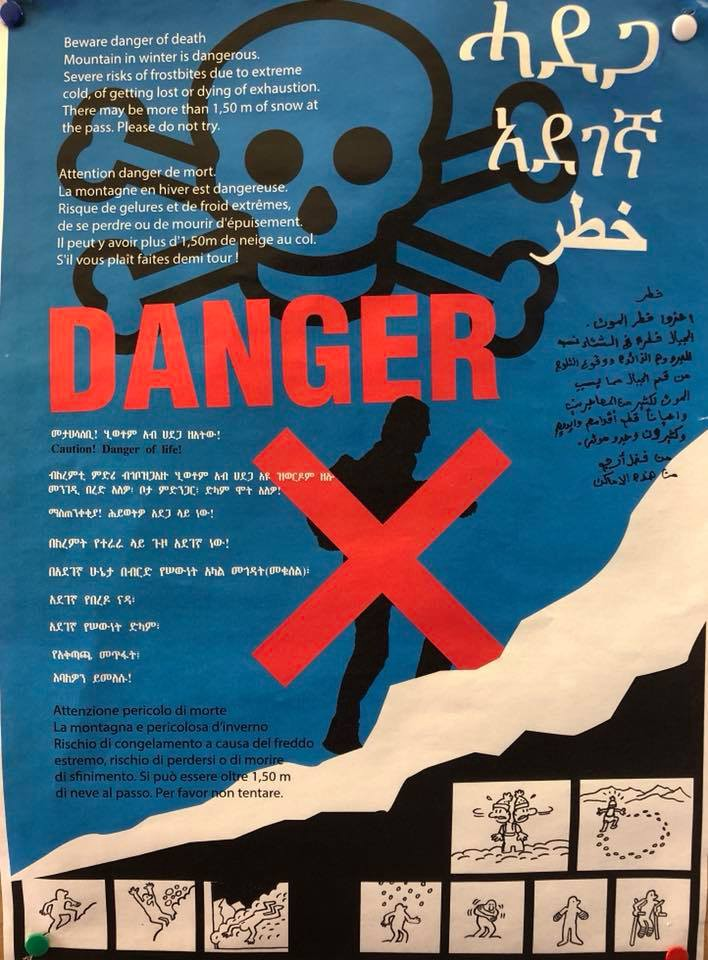
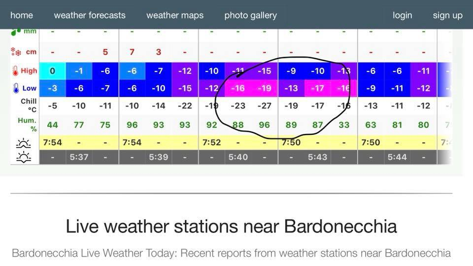
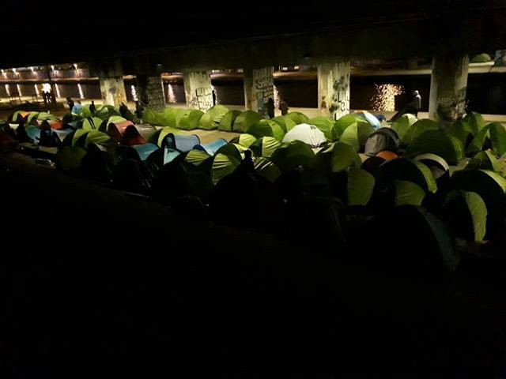

### AYS DAILY DIGEST 31/1/2018: Calls for the International day of Action against EU dirty deals, 17/18 March 2018

_Golden Dawn cancel march in Chios /// Unfair detention of Tajiki family in Poland /// Hungarian NGOs appeal at the European Court against anti\-Soros law /// New evictions in Paris /// New Frontex operation to start in the Central Mediterranean_

■■■■■■■■■■■■■■ 
> **[Fotini Rantsiou](https://twitter.com/FotiniRantsiou) @ Twitter Says:** 

> > ‘We do bad things to bad people’. FRONTEX officer on this evening’s flight Athens-Mytiline. Any comments anyone? Do we trust this person to respect human rights??? #Refugeesgr @[tsipras_eu](https://twitter.com/tsipras_eu) @[greekgov](https://twitter.com/greekgov) @[MediaGovGr](https://twitter.com/MediaGovGr) @[imouzalas](https://twitter.com/imouzalas) @[Frontex](https://twitter.com/Frontex) @[Avramopoulos](https://twitter.com/Avramopoulos) @[eu_comission](https://twitter.com/eu_comission) @GreekAsylum https://t.co/klluSTgXeH 

> **Tweeted at [2018-01-31 18:50:08](https://twitter.com/fotinirantsiou/status/958774417169018881).** 

■■■■■■■■■■■■■■ 

**FEATURE: 17–18 March 2018 International Day of Action against EU anti\-migration deals**

In Greece as all over Europe, international calls for demonstrations against the EU’s dirty anti\-migration deals to take place this March 17–18 are being published [here](https://18m.commonstruggle.eu/) \.

From the call of City Plaza in Athens:

> **17m18CommonStruggles: Stop EU’s Dirty Anti\-Migration Deals** 

> \[…\] we continue to fight against all of the EU’s racist anti\-migration policies, dirty deals and its deadly consequences\! The European anti\-migration policy has many sides, so let’s show up their connections and unite our struggles\! 

> On the occasion of the International Day Against Racism and two years after the signing of the EU\-Turkey deal we will take again the streets on the 17th of March\! Join our fight Let’s fight together against the EU\-border regime and struggle with us for a world without nations and borders\! 

> Take action wherever you are and be part of this international day of action\.
 

> Stand up against the criminal regime of Fortress Europe\! 

> Stop Europe’s funding of slavery in Libya\!
 

> Stop Wars on Migrants\!
 

> For freedom of movement and safe passages\!
 

> \#OpenTheIslands\! 

### Syria

■■■■■■■■■■■■■■ 
> **[Conrad Hackett](https://twitter.com/conradhackett) @ Twitter Says:** 

> > Syria has had more of its population displaced (about 60%) than any other country in recent history

Displaced Syrians in
Syria       6,300,000
Turkey    3,400,000
Lebanon 1,000,000
Jordan       660,000
Germany   530,000
Iraq           250,000

US              33,000 https://t.co/TuBS3OZcJ7 

> **Tweeted at [2018-01-30 13:27:21](https://twitter.com/conradhackett/status/958330796544266240).** 

■■■■■■■■■■■■■■ 

### Turkey

The situation in Turkey, a country that the EU considers safe enough to make a deal with, is becoming more and more dangerous for refugees and migrants, as well as for its own citizens\. However, the International Crisis Group, and think\-tank, issued a report titled “ [Turkey’s Syrian Refugees: Defusing Metropolitan Tensions](https://d2071andvip0wj.cloudfront.net/248-turkey-s-syrian-refugees.pdf) ,” claiming that there is huge potential for anti\-refugee violence in Turkey’s three biggest cities, which host over a fifth of Syrians in the country\.

According to the ICG findings, incidents of inter\-communal strife trebled in the second half of 2017 compared to the same period in 2016\.

“While the ICG recorded 35 deaths last year, the victims mostly Syrians, the number of violent incidents is likely much higher,” the ICG claims\.

> “The majority of Syrian refugees do not speak Turkish\. Though a recent study cited by the ICG showed that 72% of Syrians feel “close” or “very close” to Turkish society, the feeling isn’t mutual\. Of the Turks polled, more than half said they felt “far” or “very far” from Syrians… A survey published in December 2017 found that 75% of Turkish citizens did not believe they could co\-habit harmoniously with Syrians\.” 

The government do nothing to prevent hostilities\. Even more, their military engagement in Syria, among other goals, aims to stop refugees from coming\.

Welcome to Europe’s [guide book](http://w2eu.info/turkey.ar/articles/turkey-interceptions-or-readmissiondeportation-to-turkey-mylumat-yn-ma-gb-alqam-bx-fi-xhal-aytradat-u-trdtrxhl.html) with information on what to do in case of interceptions or readmissions/deportations to Turkey is now available in Arabic too\.
### Italy

Starting from February 1st, Frontex, the European Border and Coast Guard Agency, will engage in a new operation in the Central Mediterranean assisting Italy in border control activities\. The new operation, as Frontex team stated in their [press release](http://frontex.europa.eu/pressroom/news/frontex-launching-new-operation-in-central-med-25ZiLR) , will have “an enhanced law enforcement focus” and will cover the route in the Central Mediterranean used by people coming from Algeria, Tunisia, Libya, Egypt, Turkey and Albania\.

Raher than saving lives, this operation aims at “collection of intelligence and other steps aimed at detecting foreign fighters and other terrorist threats at the external borders”\.

Additionally, as in Greece, in Italy Frontex is present at hot spots in order to, officially, “assist the national authorities in registering migrants, including taking their fingerprints and confirming their nationalities”\.

Volunteers from [Care4Calais](https://www.facebook.com/care4calais/posts/1807764922589790) group followed a group of refugees on a desperate journey over the snowy Italian Alps where many try to cross the high mountains into France\.

People started using this route last year when the French/Italian border controls were tightened up\. However, during the winter things have become more serious\.

Photo: Care4Calais

> “The mountains are now covered in thick snow and temperatures drop to between \-10 to \-20 at night; but night time is when people have the best chance of avoiding police detection\. A local lady explained to me her fears for people walking over large areas of the mountain that are frozen solid and slippery, with no marked paths and no one to find you if you fall down injured\. There are signs that the local villagers have put up on the walls, translated into Arabic, Pashto, and three other languages\. These read ‘Danger of death … please do not try’ and ‘Please STOP… some people already died’\.” 

Most of the people who are on this route do not have proper clothes or shoes\. Some even lost their feet while trying to cross due to frostbite\.

There are many volunteers in this area trying to do their best to help people who are forced to take this perilous journey due to the ridiculous EU policy of closed borders\. If you can help to buy a pair of waterproof walking boots or a coat for a refugee go to [https://goo\.gl/jmkx7A](https://l.facebook.com/l.php?u=https%3A%2F%2Fgoo.gl%2Fjmkx7A&h=ATNA7b2EpzfhkhRZgQl5Ez6tLoFZZqqGFzYMAWkXUdCEU_SNOIOVf5EtHW0uSXJwKwo7crHkzqdnxhbocTm66iv0FSoAUwpxujecxbDu4wDXLvJbbPMehDNbExgoxl9wWMwu4IJ5yZJX8lv-LydKlttS1iJ-1JsShDCGvJXQncgStmjzhxqhUlKsA3HfU67YSSw8IBB32lsjT-9-UCeSWtQAgMnmNpgcvG6n6KEtrp9999CNj-OF9_H6tskvQcFH)
### Greece

**Arrivals** 
From [Aegean Boat Report](https://www.facebook.com/AegeanBoatReport) :

> One boat was picked up by HCG outside Mistegnon, Lesvos east, 07\.30\. 64 people, information so far is that it’s a lot of children\. 

> One boat arrived on Farmakonisi 01\.30, 31 people was on the boat, amongst them 8 children\. HCG was informed that this boat would arrive on Farmakonisi, and was waiting for them\. Picked up and transported to Leros\. 

**Registrations/Transfers \(Official\) 30\.01\.2018** 
Lesvos: 0 / 156
Chios: 60 / 2
Others: 1 / 0
Total 61 / 158

You can find the full table [here](http://mindigital.gr/images/prosfygiko/NSP_Eastern_Aegean_30.01.pdf)

**Video of Crossing**

**Breakdown of Arrivals to Lesvos in 2017 \(original in Greek [here](https://www.amna.gr/home/article/226332/Sunolika-12726-metanastes-kai-prosfuges-perasan-apo-ti-Lesbo-to-2017) \)**

A total of 12,726 migrants and refugees arrived in Lesvos in 2017\. Of these, 40% were men, 24% women, while 36% were children under the age of 18\. According to the official statistics of the reception and identification center of Moria, the 12,726 refugees and immigrants registered were from 64 countries in Africa, Asia, South America and the Caribbean\.

5,281 from Syria\.
2,184 from Afghanistan\.
1,800 from Iraqi\. 
826 from the Democratic Republic of Congo\. 
352 from Cameroon\.
341 from Iran\.
282 from Algeria\.

The remaining 1,660 were from 57 different countries around the world\. In particular:
167 from the occupied Palestinian territories\.
166 from Morocco,
146 from Egypt and Ethiopia,
133 from Eritrea,
112 stateless people coming mainly from Kuwait,

74 from Guinea, 67 from Ghana, 64 from Somalia, 39 from Yemen, 38 from Nigeria, 37 from Pakistan, 36 from the Dominican Republic, 34 from Tunisia, 32 from Sudan, 31 from Mali, 28 from Palestine, 26 from Kuwait, 24 from Turkey, 22 from Lebanon, 16 from Côte d’Ivoire, Gambia and Togo\.

Also, 15 people from Bangladesh, 15 from Burkina Faso, 11 people from Zimbabwe, 11 from Senegal, 11 from Sierra Leone, 9 from Libya, 9 from Uganda, 7 from Haiti, 7 from Mauritania, 6 from Jordan, 6 from Burundi,
5 from Angola\.

At the same time, four fugitives from Côte d’Ivoire, the Comoros and Sri Lanka\. Still, 3 from Bolivia, 3 from Gabon, 3 from Central African Republic, 3 from Western Sahara and 3 from Liberia\. 2 people from India, 2 from Colombia, 2 from Benin, 2 from southern Sudan, 2 from Saudi Arabia and 2 from Jamaica\. Finally, 1 from Guinea\-Bissau, 1 from Central African Republic, 1 from Malawi, 1 from Peru, 1 from Rwanda and 1 from Tanzania\.

**Golden Dawn cancel its march on Chios**

On the island of Chios Golden Dawn far right group cancelled tonight’s racist event after long protests all week and a demonstration of local solidarity groups this afternoon\.
Police tried to prevent demonstrators from reaching Golden Dawn gathering, that saw around 20 lonely Nazi supporters\.

_Solidarity is our weapon\!_

 \)](assets/b6ef7bbc8459/1*HB8CHnr87JOB88UMhQ-Grg.jpeg)

Chios Antifa \(Photo by [Theurgia Goetia](https://medium.com/u/18d0b19d81f4) \)

**Northern Greece**

Local and International media have gathered various testimonies clearly showing illegal pushbacks from the Evros area of northern Greece, which borders Turkey\. Yet, they [report,](http://m.tvxs.gr/mo/i/251617/f/news/ellada/biaies-epanaproothiseis-ginontai-thema-einai-me-poianoy-entoli.html) the Minister of Citizen Protection has strongly denied that this is possible even though it is reported to be the Greek police who carry out these illegal actions\.

Urgent need for doctors

### Croatia

After yesterday’s suicide attempt by Eritrean asylum seeker in Zagreb reception center Porin, another person, from Bangladesh, tried to commit suicide today by drinking excessive amount of alcohol\-vinegar\. Allegedly, the person was desperate because of the negative asylum decision that he received today\.

This is a second suicide attempt related to asylum process in two days in Zagreb\.
### Hungary

**Civil society organisations appeal against Hungarian government** Fourteen Hungarian civil society organisations have submitted a joint appeal to the European Court of Human Rights, asking the court to declare that the new law on “foreign funding” violates the groups’ fundamental rights, Liberties [report](https://www.liberties.eu/en/news/fourteen-hungarian-ngos-have-brought-an-action-before-the-ecthr/14186) \.

The same organisations had previously lodged a complaint with the Hungarian Constitutional Court concerning the stigmatising act\. However, the Constitutional Court has failed to place the case on its agenda during the last five months\. The complaint was signed by 23 NGOs and submitted to the Constitutional Court in last June\.

Given that there is no binding deadline for the court to complete inquiries and the concerned NGOs continue to be affected by the law, in the absence of other legal remedies, 14 NGOs brought an action before the European Court of Human Rights in Strasbourg in December\.

In their appeal, NGOs claim that the act on “organisations funded from abroad” violates the rights to freedom of association and to freedom of expression as well as the right to respect for private and family life\. Furthermore, they say that the act unnecessarily and disproportionately discriminates between NGOs using only national funds and those funded from abroad, discouraging potential donors and inhibiting cooperation with concerned NGOs\.
### **Poland**

**Unfair detention of Tajiki family**

A new case of unfair detention of asylum seekers in Poland has arrived to the European Court of Human Rights\.

As the Helsinki Foundation for Human Rights in Poland \(HFHR\) [report](http://www.hfhr.pl/fundacja/) , the case concerns a family from Tajikistan \(parents with two small children\), who repeatedly tried to submit an application for international protection in Medyka, on the Polish/Ukranian border, due to persecution in their country of origin, however, they were prevented by Border Guard officers\. Finally, the application was accepted in October 2016, after several attempts to cross the border\. Then the whole family was placed in the Guarded Centre for Foreigners in Przemyśl\.

During their stay, psychiatric disorders were dignosed, related to both violence experienced in Tajikistan and the prolonged detention in Poland\. The detention also had a negative impact on the condition of children\. Nevertheless, neither the Border Guard nor the courts took into account the medical documentation presented by them\. There was also no appointment of an expert who would assess the impact of detention on the woman’s health, who attempted suicide after 10 months\. Despite this, the Border Guard extended their detention even further and started the process for expulsion and repatriation\.

Only in July 2017 the District Court in Przemyśl decided not to release them, while still waiting for a decision about their expulsion\.

You can read the appeal lodged at the ECHR [here](https://hudoc.echr.coe.int/eng#%7B%22itemid%22:[%22001-180603%22]%7D) \.
### Germany

Media [report](http://www.novinite.com/articles/187504/Bulgarian+Citizen+Arrested+in+Germany+for+Human+Trafficking) that a Bulgarian man and a Turkish man have been arrested for people trafficking\. They are thought to be involved in a larger trafficking ring that operates along the Balkan route\.
### France

**Photo Update from Calais — Nothing changes**

50\+ arrivals last night, every two people got one tent and a sleeping bag each from Paris Refugee Ground Support\.

[Taranis News](https://www.facebook.com/taranisnews/posts/2017090388504472?hc_location=ufi) report that while there have been two evictions of refugee camps in two days — Villette and du Wharf, the occupation of the university has survived to a second night\.

> A lot of students on the spot, an organization already in place\. Dozens of on the scene\. The Presidency of the university does not object to the end of the control of student cards at the entrance\. 

A volunteer will be travelling to Paris from the UK next week and can bring donations\. She is especially looking for winter waterproof jackets for men and teenagers\. More info [here](https://www.facebook.com/sarah.griffith.54738/posts/10160010349990008?hc_location=ufi) \.

[**Help4refugee Children**](https://www.facebook.com/help4refugeechildren/?ref=gs&hc_ref=ARQyQZYUlmX4WlmvzOomcd84kymM3erdtgp-zT0Bih9kykqGbCLX7QyDy2hEiI_9Ijg&fref=gs&dti=882751941799554&hc_location=group)

> Do you have good quality stationary or artist materials you can donate to help run activities with children in refugee camps and illegal settlements? 

> If so, please get in touch with us: help4refugeechildren@gmail\.com\. 

> We are always in need of small canvases, water based paints, aprons, brushes, fun stickers, fabric pens and wonderful things alike\. 

> Get in touch\! 

### UK

**British _damaging_ family reunification policies** 
A new research, [Safe but not settled](https://www.refugeecouncil.org.uk/assets/0004/2515/Safe_but_not_settled.pdf) , carried out by the Refugee Council and Oxfam, is one of the first to look at how family reunion and ongoing forced separation from loved ones affect the ability of refugees to successfully integrate into UK society\.

Eleven of the 44 families interviewed have now been reunited in the UK with some of the loved ones they left behind\. For 9 out of the 11, integration into British society was quicker and easier as a result\.

As the Independent newspaper [reports](https://www.independent.co.uk/news/uk/home-news/refugees-suicidal-immigration-policies-family-reunification-refugee-council-oxfam-a8185371.html?utm_content=bufferd96e6&utm_medium=social&utm_source=twitter.com&utm_campaign=buffer) , those who can’t be reunited with their families are left “desperate — and in some cases suicidal — due to government immigration laws”, as they develop mental health problems as a result of being separated from their relatives because of the Home Office’s “damaging” reunification policies\.

> Many are “plagued” by worry, making it difficult for them to successfully integrate into British life as they struggle to focus on finding work, making friends and learning English\. In some cases they are said to be so anxious they rarely leave their homes\.
 

> The UK currently only allows adult refugees to apply for their spouses and dependent children under 18 to join them\. This means their grandparents, parents, siblings and children above the age of 17 are prevented from coming to Britain to join them in starting a new life\. Additionally, legal aid has not been available for refugee family reunion since 2013, making it even more difficult for families separated by war and persecution to reunite\. 

**Right to Remain and Refugee Info Bus joint fundraiser**

Right to Remain and the Refugee Info Bus are working together to provide vital information videos on claiming asylum in the UK, in Arabic and Farsi, to begin with\.

> By joining forces, we will provide this vital information to refugees so that they can access their own right to information and their rights, in order to fight their case for safe protection… 

Support them [here](https://mydonate.bt.com/events/rtrxrib/455651) \.

**Volunteer needed in London**

### EU

The European Commission have issued a [press release](http://europa.eu/rapid/press-release_IP-18-384_en.htm) stating that they will be giving humanitarian assistance of €37\.5 million to help people affected by conflict and natural disasters in Afghanistan, Iran and Pakistan\.

> **_We strive to echo correct news from the ground through collaboration and fairness, so let us know if something you read here isn’t right\._** 

> **_If there’s anything you want to share, contact us on Facebook or write to: areyousyrious@gmail\.com\._** 

_Converted [Medium Post](https://areyousyrious.medium.com/ays-daily-digest-31-1-2018-calls-for-the-international-day-of-action-against-eu-dirty-deals-17-18-b6ef7bbc8459) by [ZMediumToMarkdown](https://github.com/ZhgChgLi/ZMediumToMarkdown)._
