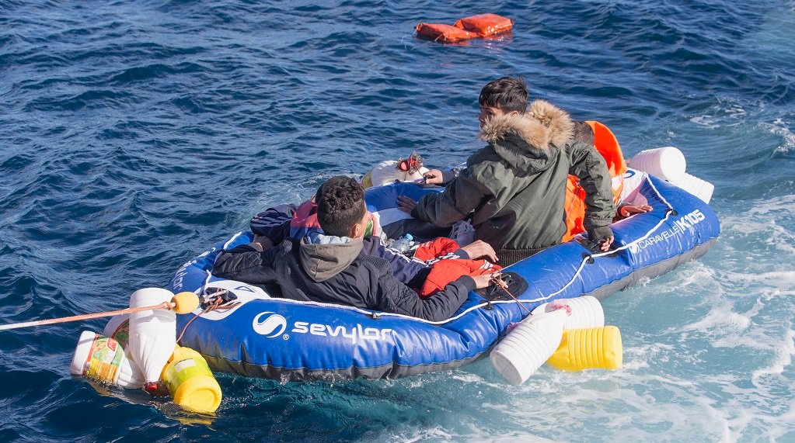
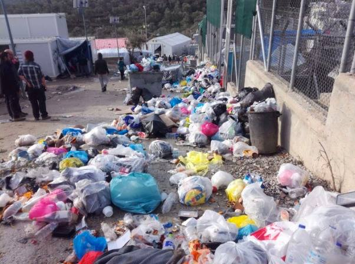
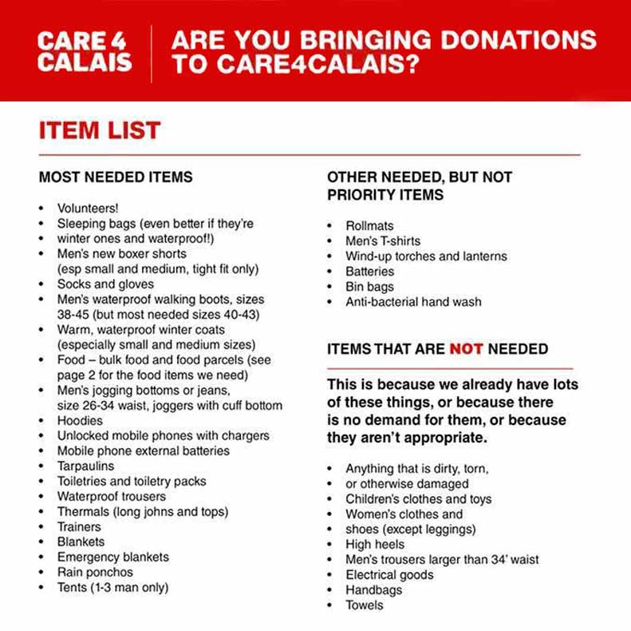

### AYS Daily Digest 03/02/18: Oxfam and Amnesty International call on EU to end refugees’ suffering in Libya
#### _Hungary allows only two refugees per day to cross the border//Returnees face violence in Afghanistan///Border guards shoot fleeing Syrians at the Turkish border_

](assets/10d3f22b3d3e/1*wN2EsEKpgYMKYuBmt9Zi9A.png)

SAR mission of a team in the Mediterranean — Photo: [**Maydayterraneo — Proyecto AitaMari**](https://www.facebook.com/MAYDAYTERRANEO/)
### EU

Two reports by [Oxfam](https://www.oxfam.org/en/pressroom/pressreleases/2018-02-01/one-year-libya-migration-deal-people-still-captivity-and) and [Amnesty International](https://www.amnesty.org/en/latest/news/2018/02/a-year-after-italy-libya-migration-deal-time-to-release-thousands-trapped-in-misery/) call on Italy and Europe to stop their deal with Libya\. Iverna McGowan of Amnesty International says:

> One year ago, the Italian government, backed by their European counterparts, agreed on a dodgy deal with the Libyan government that has trapped thousands in misery\. People are being forced to endure torture, arbitrary detention, extortion and unthinkable conditions in detention centres run by the Libyan government\. 

Italy and the EU have provided the Libyan Coast Guard with boats, training and other assistance to patrol the sea and pull back refugees and migrants desperately trying to sail to Europe\. Refugees who have managed to escape Libya following the deal have told Oxfam of on\-going kidnapping, murder, rape and forced labor\.

The EU has essentially allowed Libya to detain refugees fleeing their country and to bring them back to even more torture and death\.

■■■■■■■■■■■■■■ 
> **[Amnesty International](https://twitter.com/amnesty) @ Twitter Says:** 

> > This is what happens when your saviour becomes your captor. https://t.co/LcH4cgFvf1 

> **Tweeted at [2018-02-02 14:28:50](https://twitter.com/amnesty/status/959433431552798720).** 

■■■■■■■■■■■■■■ 

IOM says nearly 250 died in the Mediterranean in January, nearly all on route to Italy—the worst month since June\. Meanwhile, the Spanish coastguard saved four children in an inflatable toy boat\.

#### Greece
### Better garbage disposal in Moria

Help Refugees reports the watershed foundation has doubled the number of garbage trucks coming to Moria, Lesvos, from three to six per day and installed 20 new garbage bins\. This has already made a massive difference in the camp, making living here just that little bit more bearable\. The overcrowded camp squeezes in more than 6,000 people, in a place meant for one\-third that amount\. The conditions there are unhygienic, with a lack of running water and inadequate sanitary facilities\.

#### Inadequate reception for unaccompanied children in Greece and Italy

The [European Council on Refugees and Exiles](https://www.ecre.org/shortages-in-reception-systems-expose-unaccompanied-children-to-harmful-conditions-in-italy-and-greece/) reports on the inadequate reception of unaccompanied children in Greece and Italy\. By the end of the year, 2,290 were waiting in Greece to be placed in a dedicated shelter due to a shortage of capacity, leading to a problematic policy of detention — 54 children remained in “protective custody” in police stations, while another 438 were held at reception and identification centres\.
#### Hungary
### Hungary reduces number of asylum seekers it admits to two per day

NPR reports that since Jan\. 22, Hungary has been allowing only one asylum seeker per day to cross from Serbia into each of its two “transit zones\.” The near closure of the border “is absolutely unbelievable,” said Marta Pardavi, co\-chair of the Hungarian Helsinki Committee\. “This means only unaccompanied minors or single men can get in — no families whatsoever\.”
#### France
### New building occupied in Paris

TIMMY, a group working with unaccompanied minors in Paris, has taken part in the occupation of a vacant building for several months now\. Around 20 minors are now living there, sleeping two to four per room, with their own bathroom and kitchen\. The building also has a classroom and regular activities are organised\. One of the goals of the project is to develop their autonomy and allow their integration in France\. Many unaccompanied minors have trouble being recognised as such in Paris and therefore face long months on the streets, recognised as neither minors or adults\.
### Updated needs list from Care4Calais

Care4Calais has updated its needs list for 2018 and drop off points can be found [here](https://www.google.com/maps/d/viewer?ll=47.63592467028903%2C2.3729749750000337&z=4&mid=1bqc9Lc5uOE0o8lXPYmLc2RwGn7zNSxdh) \.

#### Afghanistan
### Returnees face violence, discrimination in their home country

[Al Jazeera](http://www.aljazeera.com/news/2018/02/refugees-deported-europe-attacked-taliban-isil-180203080943505.html) reports on the risks faced by refugees deported to Afghanistan, due to recent Taliban and ISIL attacks — a November 2017 survey of Afghan returnees from Europe by REACH shows that most would make another attempt at returning to Europe\. Returnees also face special threats because of the time they spent in Europe\. A report by [Asylos](https://asylos.eu/afghanistan-research-project/) on young male ‘Westernised’ returnees mentions how many asylum seekers have spent their teenage years in Europe but are rejected shortly before or after they turn 18\. It mentions their lack of a support network in Afghanistan, notes that they are prone to recruitment by armed non\-state actors and that they are perceived by society as being “intoxicated by western values”, making them foreigners in their own country\.
#### Turkey
### Border guards shoot Syrian refugees and return them to the country

[Human Rights Watch](https://www.hrw.org/news/2018/02/03/turkey/syria-border-guards-shoot-block-fleeing-syrians) says guards at Turkey’s closed border with Syria are indiscriminately shooting at and summarily returning Syrian asylum seekers attempting to cross the border\. HRW spoke to 16 Syrian refugees — thirteen said Turkish border guards shot in their direction or at other fleeing asylum seekers as they tried to cross while still in Syria, killing 10 people, including one child, and injuring several more\.

**_We strive to echo correct news from the ground through collaboration and fairness, so let us know if something you read here isn’t right\._**

> **_If there’s anything you want to share, contact us on Facebook or write to: areyousyrious@gmail\.com\._** 

_Converted [Medium Post](https://medium.com/are-you-syrious/ays-daily-digest-03-02-18-oxfam-and-amnesty-international-call-on-eu-to-end-refugees-suffering-in-10d3f22b3d3e) by [ZMediumToMarkdown](https://github.com/ZhgChgLi/ZMediumToMarkdown)._
