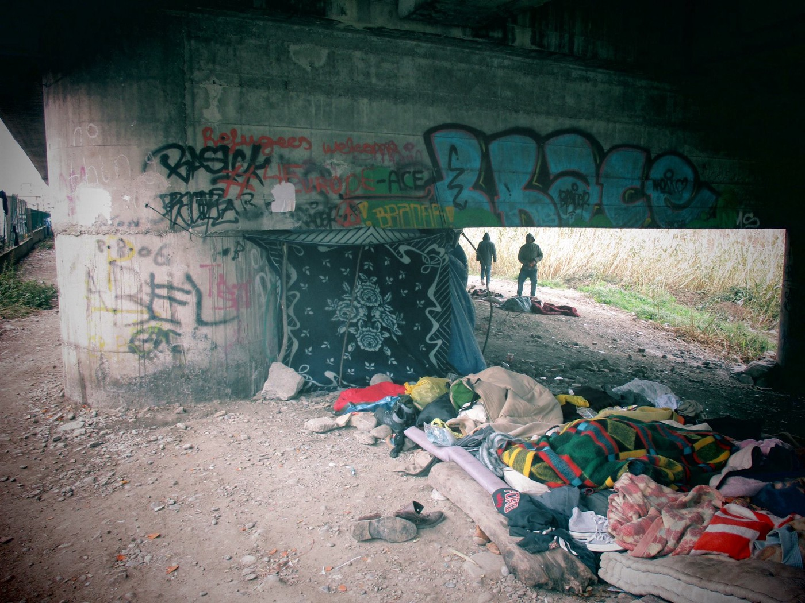
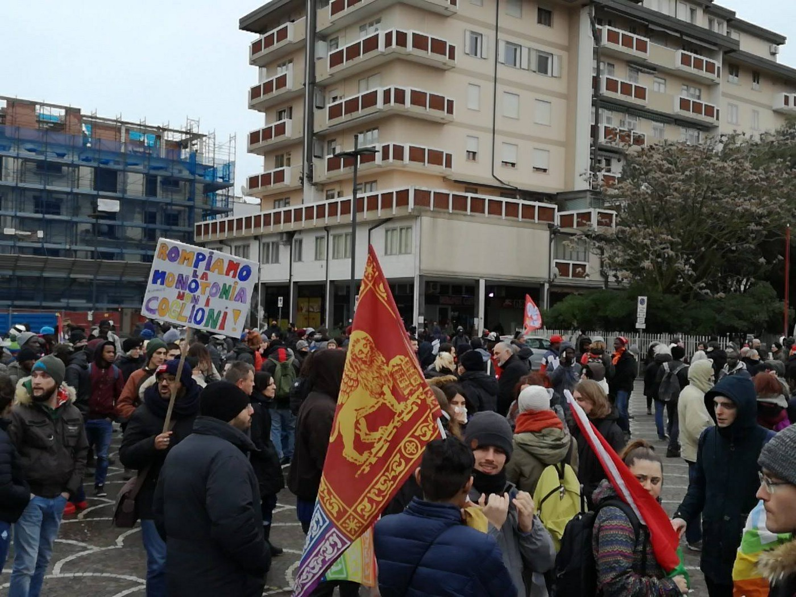
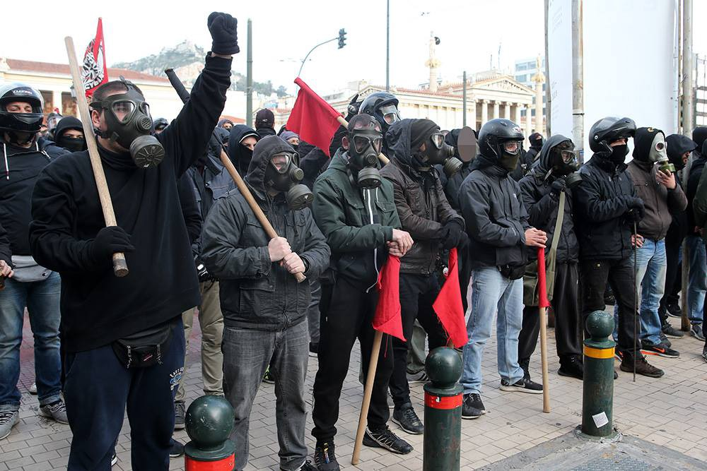
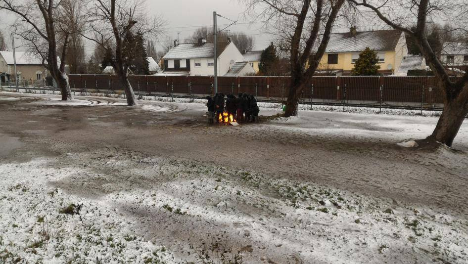

### AYS Daily Digest 04/02/18: 47 Believed Dead off Coast of Melilla
#### _Protests in Ceuta//Right\-wing terrorist attack in Italy//Stories from Ventimiglia//Fascist rallies in Athens//Statements from Calais//Preparing for Cold in Paris//Racist laws proposed in Denmark//And more…_

 \.](assets/b824a0ab9a15/1*I5MKHpcTYOkW4dRH9XKybQ.jpeg)

Migrants aboard an intercepted boat\. 1/16/18 Photo Credit: [Proactiva Open Arms](https://www.facebook.com/proactivaservice/) \.
### Sea — Feature

Today was another tragic day in the Mediterranean\. The bodies of 21 people were found in the waters near the Spanish territory of Melilla\. The journalist [Helena Maleno Garzon has reported](https://twitter.com/helenamaleno/status/960107875157839872) that among the dead are people from Mali, Guinea, and the Cote D’Ivoire\. The rescue organization [Proactiva Open Arms](https://www.facebook.com/proactivaservice/posts/1785497001481143) [reported today](https://www.facebook.com/proactivaservice/posts/1785497001481143) that there were 47 people aboard the dinghy that sunk, and that there were no survivors\. Thus 21 is only the number of people who have been found so far, not the total number of people who lost their lives\. Helicopters from the Spanish National Guard [have been combing the area](https://twitter.com/ondaceromelilla/status/960220494329991168) for more bodies, but as of yet have not found any\.

In response to today’s tragedy, Garzon wrote that while African migrants die trying to reach EU shores, “European companies make migration control profitable”\. The fact that refugees have to embark on such dangerous routes to reach the EU is partly due to the migration controls the EU has put in place, and the militarized borders that exist in places like Mellila and Ceuta\.

Mellila is a small territory on the coast of Morocco, and is one of only two land borders the EU shares with Africa\. Because of its location, Mellila has become a common route for refugees trying to reach the EU\.

Today’s deaths are another sign that the EU needs to create more options for refugees to apply for asylum safely without having to risk their lives on dangerous land and sea crossings\. Including today’s deaths, over 250 people have died this year crossing the Mediterranean\. This is not merely a number or a statistic — each person who died in the crossing this year was a human being with hopes of finding safety and a better future for themselves and their family\.

The SMH rescue team reports having made 110 rescues in the past two days\.
### Spain

Four years ago this week, [15 people were murdered](http://www.telegraph.co.uk/news/worldnews/europe/spain/10638607/Spain-admits-firing-rubber-bullets-at-migrants-swimming-to-enclave.html) by the Spanish National Guard\. They were among a group of over 200 people who were trying to swim across a barrier from Morocco to reach the Spanish enclave of Ceuta\. As they were swimming, the national guard began to fire rubber bullets at the people in the water, causing 15 people to drown\. To this day, no one has been held responsible for this vicious attack on refugees\. Yesterday, activists from across Spain met on Ceuta to protest the lack of action on the part of their government\.

### Italy

Yesterday, a [right\-wing terrorist shot six migrants](https://www.bbc.com/news/amp/world-europe-42930749) in the central town of Macerata\. The shooter has been identified by the authorities, and was known to have been a party member of the anti\-immigrant, right\-wing “Northern League” party\. Police recovered a gun from the suspect’s car, and he was found wrapped in an Italian flag at the time of his arrest\. Local media has reported that he gave a fascist salute when arrested\.

Only one of the victims of the attack is believed to have been critically injured at the moment\. This attack shows the very real consequences of the anti\-immigrant rhetoric that is becoming more prevelant in Italy, and throughout Europe\. The shooter’s alleged ties with right\-wing parties shows that this kind of violence is not as far from the mainstream as one would hope\.

The [SolidariTea](https://www.facebook.com/refugeesolidaritea/) volunteer group, based in Italy, recently shared the testimony of one of their volunteers who had been working in Ventimiglia\. Her stories from the field show that the situation for refugees in Ventimiglia is still extremely difficult and unjust\. Many refugees, including children and families, are still sleeping in the cold, in tents or just in blankets under bridges\. They are still being harassed by police and border authorities on a daily basis as they try to make it to France\. From her [report](https://www.facebook.com/refugeesolidaritea/posts/1261556610612759?hc_location=ufi) :

Sleeping rough in Ventimiglia\. Photo Credit: SolidariTea\.

> After helping at a shoe distribution I met a 14 year old Somalian boy named Ferhad\. He was pleased with his new walking boots, that would help him treck across the mountains later that night\. He told me he had been “walking for a long time” after leaving his home a year and a half ago\. His mum thought he was in France, and going to school… He didn’t want to tell her the truth; he was ashamed to live under this bridge and to be caught by the police every night as he tried to get across the border\. “ I just want to make my mum proud”\. Instantly I was reminded of all the boys I had met whilst in Serbia last year\. Where are they now? The lost boys, still searching for safety and the dream of Europe\. 

> On my last night, I was helping volunteers distribute hundreds of portions of curry when I met a group of newly arrived Eritreans, all women\. “Please help us” one woman said, “we need tents and blankets, where can we stay?”\. After realising there was nothing I could offer them, I resorted to salvaging pieces of grubby cardboard out of the bin to sleep on, and collecting a few thin blankets that others didn’t need\. As we walked together to the end of the settlement I saw it all through the eyes of these young women\. Hundreds of men silhouetted in the wasteland shouting in unknown languages, risk and danger everywhere \. “We must sleep here? I’m scared” one woman said, and took my hand\. Again, I felt ashamed\. “I’m sorry”, was all I could say, as I turned around and walked away\. “Thank you”, they cried out\. “Sleep well”, I shouted back at them\. How ironic, how unjust\. 

> And now I am leaving it all behind\. I look around me and glance at the rich Italian couple next to me on the train, wearing fur coats and expensive watches, on their way to the airport with their passports\. Suddenly the world seems so unbalanced I can only shut my eyes and hope, “Inshallah” one day this will all be over\. 

Yesterday there was a march in Chioggia to show solidarity with migrants and refiugees in the area, and to demand human rights for all people on the move\. One of the groups which helped organize the march, [Melting Pot Europa](https://www.facebook.com/meltingpoteuropa/) , released a statement explaining their demands:

People power In Chioggio\. Photo Credit: Melting Pot Europa

> We demand safe and regular ways through which people can move between continents and within Europe, because this can no longer be a right based on race, or linked only to certain social classes\. 

> We march against criminals agreements between Italy and Libya\. 

> We ask for a humanitarian residence permit for all migrant people present in Italy, to give them the opportunity to get out of invisibility and build a dignified life, to free themselves from the blackmail an undocumented life\. 

### Greece

There were large right\-wing and fascist rallies in Athens today, featuring many members of the Golden Dawn fascist party and other violent far\-right groups\. The rallies were ostensibly over the “Macedonia” question — Greek nationalists object to Macedonia \(or FYROM\) calling itself “Macedonia” because they believe this implies a territorial claim to the Greek region of Macedonia in Northern Greece\. While the battle over the name “Macedonia” has been a long and bitterly contested issue, it is clear that the right wing rallies of today were concerned with more than this issue alone\.

Antifascists defending the anarchist community of Exarchia during the fascist rally\. Photo Credit: Marios Lolos\.

The “Macedonia” question partly served as cover for fasicists and right wingers to congregate in Athens\. As the jounrnalist [Anna Karastathi](https://twitter.com/AnnaKarastathi) [wrote](https://twitter.com/AnnaKarastathi/status/960101214267543552) , “international media has not covered the neo\-Nazi and far right mobilization happening today in [\#Athens](https://www.facebook.com/hashtag/athens?hc_location=ufi) ostensibly over the [\#Macedonia](https://www.facebook.com/hashtag/macedonia?hc_location=ufi) issue; military has been deployed\. This is not a simple protest, there have been attacks on migrants, and leftists were threatened\.” Following the rally, there were many instances of right\-wing militias attacking refugee squats and social centers, including [an attack](https://twitter.com/ChristofakisN/status/960162390527692801) on the offices of the left\-wing NAR party\. Antifascists came out to defend refugees and others who were being threatened by the fascists, and protected anarchist neighborhoods\.

■■■■■■■■■■■■■■ 
> **[eⒶtps](https://twitter.com/eatps_) @ Twitter Says:** 

> > "A few minutes ago, Nazis from the nationalist rally attacked the #Empros social center in the neighborhood of #Psirrí. CS activists have repelled the attack." #FF More to come, via @[Refugees_Gr](https://twitter.com/Refugees_Gr)  @[Hibai_](https://twitter.com/Hibai_) #Athens  #antifagr #antifa #antireport  https://t.co/yVovK3rKtU 

> **Tweeted at [2018-02-04 15:21:53](https://twitter.com/eatps_/status/960171559745937408).** 

■■■■■■■■■■■■■■ 

Forwarding a call from [A Drop in the Ocean](https://www.drapenihavet.no/en/home/) group: “We are currently seeking Logistics Coordinator to our operation in the refugee camp, Skaramangas in Athens\. The Logistics Coordinator is responsible for managing A Drop in the Ocean´s warehouse, distribution and logistics at the destination\.” More details [here](https://www.facebook.com/groups/204202716585823/permalink/592213314451426/) \.
### France

As AYS reported earlier this week, there have been large clashes in Calais\. Reportedly, the clashes have been between various ethnic groups, but police and people smugglers have also played a role in the violence\. Following the clashes, a number of volunteer groups and NGO’s have had blame cast upon them, and been unfairly accused of playing into the violence\. One of the organizations which has been under scrutiny since the clashes, [L’Auberge des Migrants](https://www.facebook.com/AubergeMigrants/) , today released a public statement in repsone:

Trying to stay warm in Calais\. 12/19/17\. Photo Credit: L’Auberge des Migrants

> L’Auberge des Migrants is a humanitarian organisation for people living in the street, whatever their skin color, religion or legal status is\. We are not taking any public statement against/in favor of the government\. 
 

> We act in a legal way\. We think that the European and French laws should be improved, and we try to encourage citizens to help\. We don’t create disorder\. We are convinced that our help contributes to the safety of refugees\.
 

> We try to provide objective information to the migrants about the asylum procedure, the risk of crossing the Channel, and try to contribute to peaceful coexistance between the different communities\. 
 

> We know from our experience that the differentiation between “economic migrants” and “migrants deserving protection from the French State” doesn’t make sense\. 
 

> We are not subsidized by the State\. We had a budget of 600\.000 Euro in 2017, only 10\.000 Euro \(1\.5%\) came from a delayed grant from the Department Pas\-de\-Calais for our food assistance\. 
 

> We are sad that the people who insult us by phone, FB pages etc\. don’t have any historical or economical argument\. They are full of negative emotions like fear, anger, frustration, jealousy and limit their compassion \(if they have any\), to their relatives, neighbors, fellow countrymen, or lost cats\. We remind you that racism is not an opinion, but a crime\. 

The [Refugee Community Kitchen](https://www.facebook.com/pg/refugeeCkitchen/posts/?ref=page_internal) in Calais has faced similar unfounded criticism in the past week\. They also released a statement concerning the violence in Calais and their reponse to it:

> Recent troubles in Calais have been exasperated by the cruel and inhumane conditions and treatment of refugees\. We do not condone any forms of violence, either state or criminal, and it is very sad to see such circumstances unfolding that create unsafe and violent situations for a lot of innocent and vulnerable people\.
 

> We work extremely hard every day with distribution logistics so that RCK volunteers are never put at risk and their safety is the first and foremost priority\. 
 

> We have seen increased amounts of support in Calais the last few days with a lot of kind people bringing donations and wanting to help, this is deeply encouraging when all the groups working here face blame and attack from the media and governments looking to divert their own responsibility\. 

We have another update from Calais from the [Citizens of the World Choir](https://www.facebook.com/CitizensoftheWorldChoir/?hc_ref=ARQrMaXXfFCtPIcigY0S4u35mJ5TyQa2AXl3EOBItyuqoMstKd0fGwdpSOWub9RawNg) , which has been providing aid to people in Northern France\. They described the situation they saw during a distribution run yesterday:

> The situation \[in Calais\] is dire; we saw people huddled around campfires in hedgerows, and sheltering under bridges from the freezing rain\. Most seemed very young, from early teens to early twenties, often with only a thin plastic poncho over their clothes to protect them from the elements\. 

> At a nearby aid distribution point, young people sheltered in doorways and under tarps, some of them played football in a deserted car park or drank cups of tea and coffee from a volunteer van\. It’s terrible to see how people have literally been reduced to living rough in the streets and fields after the Jungle’s demolition\. The constant insistence on removing any possible “pull factor” means people languish in horrifically inhumane conditions, and does not take into account “push factors” of wars, dictatorship, persecution and extreme poverty that forces people to leave their countries in the first place\. 

 \. “Over this weekend in Calais we asked 300 refugees what is the one thing they most need\. The answers were as follows: 38% waterproof shoes, 19% trousers, 15% coats, 9% phones, 19% other”\.](assets/b824a0ab9a15/1*y-PdKFtatbRKMesweijdEQ.jpeg)

Migrants in Calais\. Photo Credit: [Care 4 Calais](https://www.facebook.com/care4calais/) \. “Over this weekend in Calais we asked 300 refugees what is the one thing they most need\. The answers were as follows: 38% waterproof shoes, 19% trousers, 15% coats, 9% phones, 19% other”\.

Authorities in Paris have been fencing in areas under bridges and parks where homeless refugees congregate and set up tents\. These are people who the government has ignored and abused, and they are forced to sleep rough due to the lack of social services and accommodation\. To try and solve this problem with more fences and walls is the height of stupidity\. To protest the physical barriers put up against refugees, local activists have been wrapping the fences in plastic and marking them with signs reading, “barriers of shame”\.

](assets/b824a0ab9a15/1*Pxfg7hcOVmYbw_JOGkTa2A.jpeg)

Photo Credit: [P’tit Dej\. Flanders](https://www.facebook.com/ptitdejaflandre/)

According to the [InfoMigrants outlet](http://www.infomigrants.net/en/post/7277/tension-builds-after-migrants-move-into-decrepit-building-in-marseille) , tensions have been rising in the suburbs of Marseilles surrounding the issue of over 100 refugees who have moved into a squat\. Residents have been making many unverified claims about the mafia and people smugglers being behind this squat\. A far likelier explanation would be the lack of acceptable accommodation for refugees living in France\.

A cold snap has been forecasted in the Ile\-de\-France region \(Paris is located in this area\) \. In response, the French government has activated their “ [Great Cold Plan](http://m.leparisien.fr/info-paris-ile-de-france-oise/ile-de-france-le-plan-grand-froid-declenche-l-etat-ouvre-687-places-d-hebergement-en-plus-04-02-2018-7541055.php) ,” which involves opening up additional shelters\. The temperature will drop below zero tomorrow, and all those living on the street are advised to seek shelter\.

The Azmari NGO in Paris is starting a new session of free courses for women\. There will be a sign up sesssion on February 11 at 3pm, more information [here](https://www.facebook.com/assoAzmari/posts/1226307330847351?hc_location=ufi) \.
### Denmark

The Danish Social Democratic Party \(SDF\) has proposed today a system for immediate deportations of all refugees arriving in the Danish border center of Sandholm to a UNHCR run camp in a third country\. Mette Frederiksen, leader of the Social Democrats, stated that these camps would ideally be in North Africa or the Middle East\. “It is imperative to create a refugee system that is more humane than what we have today,” stated Frederiksen\. “The situation is that there have been more refugees to Europe than we can manage\. But most of the world’s refugees do not help us at all\.”

In recent years Denmark has drastically tried to prevent anyone from crossing their borders\. In 2016 the Danish government ran anti\-Refugee campaigns in Arabic newspapers, discouraging people from coming to the country\. They also extended the time a person has to wait before applying for family reunification from one year to three\. The SDF has also recently floated a racist proposal to limit migration from non\-Western countries\.

Mette Frederiksen states that if the outsourcing of refugee camps was to happen, Denmark would increase its quota for refugees and fund the camps\. She does not however address how these camps would be built, run, or set up in “North Africa or the Middle East”\. Would they look like the Italian\-funded torture and kidnapping centers in Libya?

Frederikson has dishonestly framed this proposal as stemming from a humanitarian impulse\. Citing the number of refugees trapped in non\-EU countries, she claims Denmark has an obligation to help them, and not only refugees in the EU\. However, her policies and statements show that she is clearly motivated by an urge to prevent “non\-Western immigrants” from reaching Denmark, not a desire to aid refugees\. Once again, we see racism and inhumanity being falsely presented as humanitarianism\. We condemn the cynical and racist policy proposals of the SDF in the strongest terms\.
### UK

Volunteers are needed in North London on Feb\. 17 for a one day fundraiser for the Refugee Community Kitchen\. Details [here](https://www.facebook.com/groups/PeopletoPeopleSmallCamps/permalink/751613395009285/) \.

**_We strive to echo correct news from the ground through collaboration and fairness, so let us know if something you read here isn’t right\._**

> **_If there’s anything you want to share, contact us on Facebook or write to: areyousyrious@gmail\.com\._** 

_Converted [Medium Post](https://medium.com/are-you-syrious/ays-daily-digest-04-02-18-47-believed-dead-off-coast-of-melilla-b824a0ab9a15) by [ZMediumToMarkdown](https://github.com/ZhgChgLi/ZMediumToMarkdown)._
