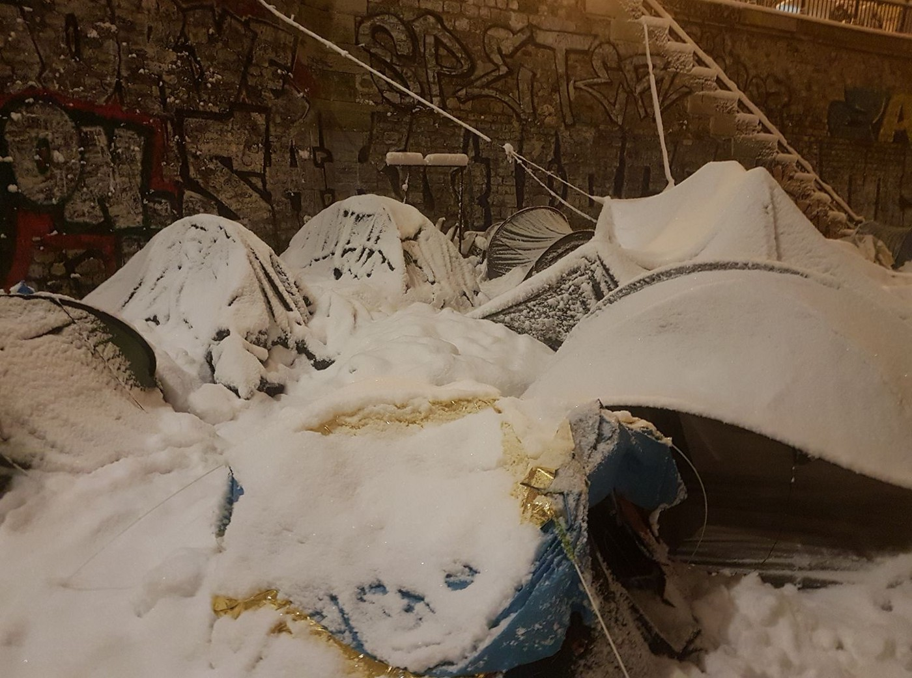

### AYS Daily Digest 6/2/18: Immediate help needed across Paris
#### Horrid conditions for many in tents in freezing temperatures / Returns to Turkey continue; hundreds of thousands of refugees are at risk of being pushed to return to Syria; new arrivals in the Aegean / Croatian ombudsperson turns evidence of Madina’s case to the State Attorney / The Swiss are likely to allow the electronic devices of asylum seekers to be checked for evidence of their identity / more updates

 \)](assets/45ad2ff428fc/1*o6z1CYQrT0bdB7RIm_f2ew.jpeg)

Paris \(Photo: [Paris Refugee Ground Support](https://www.facebook.com/PRGS.team/) \)
#### FEATURE: PARIS — HELP DESPERATELY NEEDED

AYS volunteer writes from Paris:

It was a really long day in Paris due to the very difficult weather conditions\. It has been snowing for over 24 hours non\-stop and the forecast it that it will only stop on Wednesday at lunch time, only to bring even colder temperatures to the ground \( \-6 predicted for the next 2 days\) \. 
Despite talks about a cold plan to take people off the streets and to shelters, as far as we know, only 50 or so people were allowed in the bubble but anywhere else there were more people sleeping rough\. Not less, anywhere\. 
In the afternoon volunteers started getting calls from refugees about new arrivals that needed shelter\. In the Jaures area, a refugee was fortunately taken to hospital after others told us he was very sick, so he won’t spend the worst of these days in a tent bending with the weight of snow\. Most refugees got extra blankets, sleeping bags, duvets, etc, which kept volunteers busy all day and most of the night\. 
But still the conditions are terrible and more emergency aid will be needed for at least the rest of the week\.

> This is Paris tonight\. Around 1300 people are in tents or on the ground in a foot of snow and sub\-zero temperatures\. 
 

> Blankets delivered by PRGS will literally save lives\. 
 

> If you can support the ground team of volunteers distributing blankets and other amenities, please consider donating — PayPal: sarahfenby@outlook\.com 

Another member of the AYS Info Team writes from Paris, explaining that the situation is also complicated for unaccompanied minors who can’t call the 115 to at least try and sleep in gyms, as minors can’t sleep in the same place as adults\.

“MSF has paid some additional hotel rooms, others are sleeping in apartments\. A volunteer from Paris d’Exil says that two days ago the [Samu Social](https://www.samusocial.paris/) wasn’t able to find shelter for 30 teenagers who were waiting at the ADJIE, a legal centre for unaccompanied minors\. 
They had to sleep in the streets\.

An interesting comment by another volunteer came yesterday night: Dominique Versini, who works for the city of Paris, said the city is adding another 70 beds, including 35 for “vulnerable young people” who aren’t minors — as she insists that those who waited to find shelter are adults, even if they said they were minors\. These young people will therefore have to say that they are adults to get shelter\.

I don’t think they went there in the end, as MSF was able to pay for 50 hotel beds\. Still, it all has to do with the evaluation of unaccompanied minors by the Red Cross, which leads to many of these teenagers being recognised as adults, even though they clearly seem underage\.

> But this allows Versini to say that “there are no underage people sleeping in the streets”… ? 

Politician Danielle Simonnet has [called for the opening of a new shelter, specifically for minors](https://www.youtube.com/watch?v=M11O6AfwBvQ) , in spite of the rhetoric that goes to undermine the young people presenting themselves as minors\.

Photos: AYS

On January 30 some people went to occupy the building of the University [Paris 8](https://t.co/VGP4VpZqJ7) in Saint Denis\. They are trying to make it work, but for the time being, they too need an extra hand:

■■■■■■■■■■■■■■ 
> **[Les Exilé.e.s Occupent P8](https://twitter.com/ExileesOccupP8) @ Twitter Says:** 

> > /!\ Nous recherchons en urgence un.e [électricien.ne](http://xn--lectricien-96a.ne) /!\ Le DGS de P8 refuse de rétablir l’électricité dans certaines salles occupées, ce qui nuit au bon fonctionnement de la vie des occupant.e.s!! Nous négocions, mais avons besoin de vous en attendant! #Help #OccupP8 

> **Tweeted at [2018-02-06 21:31:40](https://twitter.com/exileesoccupp8/status/960989393199747074).** 

■■■■■■■■■■■■■■ 

Photos: AYS

■■■■■■■■■■■■■■ 
> **[France terre d'asile](https://twitter.com/Franceterdasile) @ Twitter Says:** 

> > Canal Saint Martin : nos équipes se st mobilisées pr 1 opération de mise à l'abri tôt ce matin avec la mairie de @[Paris](https://twitter.com/Paris) et la préfecture. Au 2 février, ns avions décompté 278 personnes dormant à la rue le long du canal Saint-Martin. https://t.co/pVWfquR89z 

> **Tweeted at [2018-02-07 09:53:58](https://twitter.com/franceterdasile/status/961176199329468416).** 

■■■■■■■■■■■■■■ 

#### SEA

■■■■■■■■■■■■■■ 
> **[SALVAMENTO MARÍTIMO](https://twitter.com/salvamentogob) @ Twitter Says:** 

> > El gran hermano del #mar que puede salvarte la vida. Descarga nuestra APP @[SafeTrx](https://twitter.com/SafeTrx) en: Google Play [bit.ly/1pRDAvP](http://bit.ly/1pRDAvP)  y App Store [bit.ly/1rFdUHn](http://bit.ly/1rFdUHn) También os dejamos este link al folleto: [bit.ly/1pRGUHh](http://bit.ly/1pRGUHh) EN LA MAR… ATENTOS! https://t.co/DJgz8wArcw 

> **Tweeted at [2018-02-06 08:15:16](https://twitter.com/salvamentogob/status/960788973751816193).** 

■■■■■■■■■■■■■■ 

#### TURKEY
### Returns

UNHCR documents that the vast majority of people returned to Turkey are nationals from countries other than Syria, with Pakistani nationals presenting the largest number, 42 per cent of the total\. Syrians constitute 16 per cent of the total number of people returned, and are followed by Algerians, Bangladeshis and Afghans\.
In total, 250 Syrians have been returned to Turkey to date\. Twelve of them have been returned on the basis that their asylum claims were found inadmissible at the 2nd instance\. Of all those returned, 51 per cent did not express a will to apply for asylum or withdrew their will to apply for asylum or withdrew their asylum claims in Greece\.

However, Migration Policy Minister Yiannis Mouzalas [accused](http://www.ekathimerini.com/225552/article/ekathimerini/news/arrivals-have-doubled-since-august-migration-minister-says) the European Union of contributing to the problem by failing to honor its commitments to Turkey in a deal for that country to take back asylum seekers whose applications are rejected and to crack down on migrant trafficking from its shores\.

Apart from the returns to Turkey, a serious concern arises from the fact that hundreds of thousands of refugees are at risk of being pushed to return to Syria in 2018, despite ongoing violence, bombing and shelling that are endangering the lives of civilians\. 
Several large NGOs and humanitarian agencies warned about the problem in a [**report**](https://www.nrc.no/resources/reports/dangerous-ground---syrias-refugees-face-an-uncertain-future/) released yesterday\.

In the early morning of Tuesday 6, 208 people heading towards Cyprus were found and stopped by the Coast Guard in the Manavgat County \(Antalya\)
#### GREECE
### Islands

![“Tobi about the situation on the Lesvos: The past weeks or so it has become more apperant to me, that the people stuck on this island are more than just stuck\. They are frozen\. Their lives stuck in limbo, unable to move somewhere\. Across the south coast you see people, stripped of all political agency, reduced to being mere “alive” as opposed to being “people”\. Reduced to being dependend on outside forces for their basic needs, because someone that is only “alive” is only required to have “basic” needs\. 
The frost not only spreads over the land, but also into the hearts of the people\. Their hope transformed from fluid, streaming expectation to christalysed, inmovable dispair\. The absence of light, of any indication that the situation might change soon\. No control over who decides they can leave, like the clouds that decide if there is going to be snow\. And this merely because their suffering is decided to be less important then that of others, decidions based on facts colder than a mid winter day\. Only waiting, like waiting for the spring to come\. And so it is, that the police found a body in the water at the port of Mytillni\. The body had been in the water for 10 days\. After autopsy, and police checks it turned out to be a refugee\. The person in question had attempted to swim to a ship, in order to be able to leave this Island\. In order to have dry clothes to wear once on the ship, he had decided to wear only his shorts\. Imagine that\.” — [**Volunteers for Lesvos**](https://www.facebook.com/volunteersforlesvos/)](assets/45ad2ff428fc/1*y09jvip4WNPXdoGuKLy6CA.jpeg)

“Tobi about the situation on the Lesvos: The past weeks or so it has become more apperant to me, that the people stuck on this island are more than just stuck\. They are frozen\. Their lives stuck in limbo, unable to move somewhere\. Across the south coast you see people, stripped of all political agency, reduced to being mere “alive” as opposed to being “people”\. Reduced to being dependend on outside forces for their basic needs, because someone that is only “alive” is only required to have “basic” needs\. 
The frost not only spreads over the land, but also into the hearts of the people\. Their hope transformed from fluid, streaming expectation to christalysed, inmovable dispair\. The absence of light, of any indication that the situation might change soon\. No control over who decides they can leave, like the clouds that decide if there is going to be snow\. And this merely because their suffering is decided to be less important then that of others, decidions based on facts colder than a mid winter day\. Only waiting, like waiting for the spring to come\. And so it is, that the police found a body in the water at the port of Mytillni\. The body had been in the water for 10 days\. After autopsy, and police checks it turned out to be a refugee\. The person in question had attempted to swim to a ship, in order to be able to leave this Island\. In order to have dry clothes to wear once on the ship, he had decided to wear only his shorts\. Imagine that\.” — [**Volunteers for Lesvos**](https://www.facebook.com/volunteersforlesvos/)

The [officially registered](https://l.facebook.com/l.php?u=http%3A%2F%2Fmindigital.gr%2Fimages%2FNSP_Eastern_Aegean_05.02.pdf&h=ATPRYl4XeqPycHYX6HmB7VPdouFFdbZIfUw2GW8RKfOJ9D1vFtJ1rmP2-UhSJLnTRfM-rmCmy__Pbc28wib7zoZT8Z7T0GuRhp_nRkjPtiR7lfy3M4NdXgYFpS_I3bZ0RVjs2rCWIKE) people transferred from the Greek islands document the situation as follows:

Lesvos 0 / 7
Chios 0 / 61
Samos 0 /22
Kos 0 / 2
Total 0 / 92

“In 2017, we transferred 27,000 people to the mainland and 19,000 arrived on the islands,” said Greek Minister Mouzalas commenting on his ever present concern that moving all people to the mainland will simply encourage more arrivals\.

■■■■■■■■■■■■■■ 
> **[Lighthouse Relief](https://twitter.com/LighthouseRR) @ Twitter Says:** 

> > 27 people arrived to the north shore of Lesvos this morning, having crossed the Aegean Sea in the hull of a speedboat. Our landing team worked alongside @RefugeeRescueUK to provide emergency relief &amp; a warm welcome. Luckily everyone - including the 14 children - made land safely. https://t.co/3gqFGJI1WR 

> **Tweeted at [2018-02-06 17:49:15](https://twitter.com/lighthouserr/status/960933422540775425).** 

■■■■■■■■■■■■■■ 

> Last night at 5 am, our volunteers identified a dinghy landing near Eftalou\. Two volunteers welcomed the 27 people on board, while another one continued on our lookout and handled all necessary communication\. The 7 men, 6 women and 14 children are all safe now\. — [**Refugee Rescue / ‘Mo Chara’**](https://www.facebook.com/RefugeeRescueUK/) 

#### Help needed on Rhodes

A family of refugees in Ialysó Rhodes needs food and emergency supplies\. Whoever can contribute by offering one of the following items please send a message\.
Chicken
Seeds
Rice
Pulses \(Lentils, chickpeas, etc\. \)
Tea
Coffee
Sugar
School supplies 
School bag
Sheets
Towels
\- [Στο Κόκκινο — Ρόδος 103\.7](https://www.facebook.com/kokkinorhodes/?hc_ref=ARQTuJUemVP6Ei60WDQdnXS1uOUPgfFvHpU_HK9w77Ut29TqN7h8WymoLHNRpk5EJuI&fref=nf)
### Insisting on respect

NGOs on Chios insist on their demands even after the EU Commission’s answer to their [open letter](https://l.facebook.com/l.php?u=http%3A%2F%2Fwww.statewatch.org%2Fnews%2F2018%2Ffeb%2Fgreece-chiou-com-complaints.htm&h=ATOorGszQPwHfWQOF3oYOPS6Kkcfj7GUgNZMk_eihZO0PwZ8f58wt9EN_aF6EKd6m-X0OeNkPTb48nNm4gBznXa31a_bnjaoq2MUzo0JG2pvIiRGj9iyLEVRDeZytSo1Bbay2DjV_dqXcWDyuRq9fiDxMPnZC8XxqQ0w7l6Alwnkd2pOEWmg9jpysLuvhGVv15pTCNa9qw6gJeG2vsjAV6DAybADZ50_z_lhVlQFsESnWZvLOEfVEF6ybWJF6QcMLJ9uHDfGJ53OBVn1PZASqw) , urging the EC to consider the closure of the EU Hotspot on Chios if they don’t provide and implement a plan for ensuring access to the rights granted under the Geneva Convention for Refugees\.

> The EU hotspots constitute a failure both in terms of their human rights implications as well as in their alleged “stabilising effect”\. Consequently, we urge the EU to urgently consider the closure of the hotspots on Chios and other Greek islands\. In addition, we urge that the European Commission must immediately provide and implement a plan for ensuring access to the rights — in particular the right to medical care, housing, education and free legal aid — every refugee has when arriving in the European Union\. 

### Updates from the [**Greek Asylum Service**](https://www.facebook.com/Greek-Asylum-Service-%CE%A5%CF%80%CE%B7%CF%81%CE%B5%CF%83%CE%AF%CE%B1-%CE%91%CF%83%CF%8D%CE%BB%CE%BF%CF%85%CE%A5%CF%80-%CE%9C%CE%B5%CF%84%CE%B1%CE%BD%CE%B1%CF%83%CF%84%CE%B5%CF%85%CF%84%CE%B9%CE%BA%CE%AE%CF%82-%CE%A0%CE%BF%CE%BB%CE%B9%CF%84%CE%B9%CE%BA%CE%AE%CF%82-481351218685655/?hc_ref=ARQGhAEgPFJDXLqsjC2JpcJxcrs9JUYhk_9zYeEOhsKj8n6hcIvWriFYaBAPN1fLtW4&fref=nf)

An Asylum service is [being established](https://www.facebook.com/permalink.php?story_fbid=955449611275811&id=481351218685655&hc_location=ufi) , which is based and operates in the Municipality of Ioannina and is responsible for receiving and examining applications for national protection for Corfu Epirus and the Ionian Islands, starting March 15\.

To modify the information regarding the identity of applicants for international protection, the now accepted documents include documents of marital status and/or civil status, a birth certificate from the country of origin or previous document of residence, if these data can not be derived from their passport or identity card\.
These documents are valid in accordance with the laws of both countries and in accordance with the International Hague Convention of 5 October 1961 \(Principal Law No 1497/1984\) \. They need to be translated in accordance with the law\.
### Cultural Mediation Training Program for refugees

A no\-charge Cultural Mediation Training Program has opened up, designed to cover the existing gaps in training cultural mediators, by combining general and theoretical education with specialized and practical application\.
This program is open for refugees and asylum seekers, with 100 hours of mandatory training\. 
Required: 
The potential participants must be fluent in English\. 
There is a limited number of spaces, those interested should **apply until February 11** on this link: [http://bit\.ly/2GOJBsN](https://l.facebook.com/l.php?u=http%3A%2F%2Fbit.ly%2F2GOJBsN&h=ATNKL8v6DzhuEiYw82t68b639gHcNxSlTEqxZjpkrGYqNfyOxXeoBxiOg7j2Z37AHbMIxtAekoK4H_nOSp8SS9cKpm4yzDuvy3Sj7kPvGscjQfWzVqzHCsXs_V_h32OfpQ9Xz9KCWHI) 
Find more information [here](https://g2red.org/cultural-mediation-training-program/) \.

 is on\. Check out their programme\.](assets/45ad2ff428fc/1*b_T_zTbfJWnE2Eky9MsrXw.png)

First week of [Velos Youth delivered by RYS](https://www.facebook.com/Velos-Youth-delivered-by-RYS-1705690253061937/) is on\. Check out their programme\.
### Family reunification — Refugee Info Team updates

“For Germany, all people that had their Dublin approval in March 2017 should already have been flying to Germany\. People with approvals in April from Germany should get a call from the Asylum Service or the travel agency very soon with details about their flight dates\. How long it will take until they start with people approved in May for Germany is unclear\. 
For other countries than Germany, such as Austria or the UK, people with Dublin approvals in September are starting to fly at the moment\.”
Find the text in Arabic and more information on their [Facebook page](https://www.facebook.com/mobileinfoteam/?hc_ref=ARRHJim4nOI-RI1YUNx0XBjv1iqHDoNXCLBJFrYJa8GpXpzsewQC68YYLkzjaG84j38&fref=nf&hc_location=group) \.

> “It’s their right to start a new life after nearly five years of suffering\.” 

#### SERBIA

**Latest UNHCR statistics regarding the refugees in Serbia**

Total \(observed\) arrivals — January: 282
Total \(observed\) arrivals of unaccompanied/separated children — January:37
Total occupancy of government centres — end January: 3,900
Total presence of refugees/migrants/asylum\-seekers — end January: 4,100
#### CROATIA

The Croatian ombudsperson has [delivered all the informatio](http://ombudsman.hr/hr/npm-novosti/cln/1263-pravobraniteljica-dostavila-dorh-u-sve-informacije-o-okolnostima-pogibije-madine-husseini-modulnpm) n regarding the death of Madina Hosseini, the girl who died in the border area of Croatia and Serbia, to the State Attorney\.

Any further action in this case would mean breaching the limits prescribed by law, and the exact factual story can only be established with a proper criminal investigation, the ombudsperson stated\. The d [ocument](http://ombudsman.hr/attachments/article/1263/Dostava%20podataka%20DORH-u.doc) was delivered to the Minister of the Interior, the Domestic Policy and National Security Committee and the Committee for the Rights of Minorities of the Croatian Parliament\.
#### ITALY
### Politicizing people’s need for help

“It is in our interests to defeat the business model of traffickers whose profits are used to finance organized crime and, we have the evidence for this, terrorism,” said Italian Foreign Minister, fearing the jihadi fighters trying to slip into Europe following the recent military eviction of the ISIS militias\. However, these statements come ahead of the March elections that concentrate largely on the question of migration and refugees\. In line with the rhetoric, their prime minister said that the refugees are now arriving due to the war imposed in Libya by the previous Italian government, politicians who are now also running\. They, on the other hand, [pledged to deport](https://uk.reuters.com/article/uk-italy-election-migrants-deportations/italian-rights-election-promise-to-deport-migrants-will-be-hard-to-keep-idUKKBN1FQ2F4) hundreds of thousands of migrants if they win the March 4 parliamentary election\.

Unfortunately, none of the politicians have chosen solidarity with the people in need as their election tactics\.

**UN’s statistical data regarding the arrival of people fleeing war to Italy:**

> _Total arrivals \(1 Jan — 04 Feb 2018\): 4,702_ 
 

> _Total arrivals 1 Feb — 04 Feb 2018 544_ 
 

> _Average daily arrivals in February 2018 so far: 136_ 
 

> _Average daily arrivals in January 2018: 134_ 
 

> _Dead and missing in 2018 \(as of 04 Feb\) 321_ 
 

> _Dead and missing in 2017 \(as of 04 Feb\) 257_ 

Estimated number of people who arrived during the last seven days is **1,494** \.
#### SWITZERLAND

A Swiss National Council committee has come out in support of a parliamentary initiative put forward by the country’s right\-wing Swiss People’s Party \(SVP\) that would allow the electronic devices of asylum seekers to be checked for evidence of their identity, media [report](https://www.thelocal.ch/20180206/switzerland-svp-pushes-ahead-with-plans-to-analyse-asylum-seeker-phones) \. An example of suspicious behavior was given, saying that for example anyone who claimed they were Somalian but made a lot of calls to the Ivory Coast was probably revealing information about their real origin\. However, those opposing the proposal say it would be an intrusion into the private life of those concerned, calling it “legally dubious” and “disproportionate\.”

**We strive to echo correct news from the ground through collaboration and fairness\.**

**Every effort has been made to credit organizations and individuals with regard to the supply of information, video, and photo material \(in cases where the source wanted to be accredited\) \. Please notify us regarding corrections\.**

**If there’s anything you want to share or comment, contact us through Facebook or write to: areyousyrious@gmail\.com**

_Converted [Medium Post](https://medium.com/are-you-syrious/ays-daily-digest-6-2-18-immediate-help-needed-across-paris-45ad2ff428fc) by [ZMediumToMarkdown](https://github.com/ZhgChgLi/ZMediumToMarkdown)._
