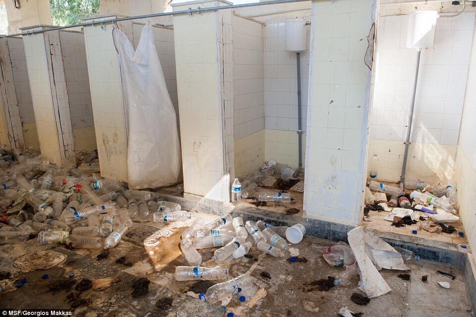

### AYS Daily Digest 07/02/18: Living in Purgatory on the Aegean Islands

_More people arrived in Greece //IOM report released//UN panel of experts confirms Libyan open secrets//Turkish Coast Guard interceptions//Sea rescues//Sleeping rough in Ventimiglia//Freezing on the streets of Paris//Reports from Serbia//Update on coalition agreement in Germany//and more…_

Showers on Lesvos\. Photo Credit: MSF
### Greece
#### Feature — Unacceptable conditions on the Aegean islands

Thousands of people are still trapped on the Aegean islands, still living in tents, suffering from the cold and an uncertain future\. Many have been awaiting their asylum decisions for a year or more, or are appealing rejection decisions\. The asylum procedures on the Aegean islands are often set up to confuse people\. The authorities look for reasons to reject people for asylum, rather than dealing with their cases honestly\.

The constant threat of deportation, combined with past traumas and the continuous trauma of living in these camps takes a serious toll on people\. Self\-harm and suicide attempts have become commonplace in refugee camps in Greece\. All of the islands are overcrowded\. [The Moria camp on Lesvos is currently seven times over capacity\.](https://www.facebook.com/AegeanBoatReport/photos/a.285312485325196.1073741828.285298881993223/303880573468387/?type=3&theater)

The head of Amnesty International Greece, Gavriil Sakellaridis, visited Moria and the camps on Chios this past week\. Sakellaridis saw many people suffering from depression and mental health issues, made worse by their detention in the camps\. “The living conditions of asylum seekers at Moria and Vial \[on Chios\] are an open wound for Greece and Europe and for human rights,” Sakellaridis said\.

“The lives of those people have been put on hold for a period of up to two years in some cases and as a result the number of cases of despair and mental distress are growing\.”

Today an independent volunteer on Lesvos, who has been offering up his house as a place for refugees to shower, voiced his outrage at the total lack of acceptable facilities on the island: “How dare they ‘lock’ down thousands of people in a camp with hardly any sanitation? A few showers, working for a couple of hours a day, in a state one can’t believe\. How dare they allocate hundreds of millions and still, after years, they are not capable of providing the basic needs of food, sanitation, security and a just legal system\. How dare they pay, on a daily basis, the wages of all the politicians, CEO’s, managers and whomever else has the duty to solve this?”

Despite the lack of meaningful action by politicians and large NGOs, volunteers on the Aegean islands are trying their best to help people with their needs\. One group is the [One Happy Family Center](https://www.facebook.com/OHFLesvos/?hc_ref=ARQvNuvRLPsaQjUFr25bvwvTYxBoJGeb0DZMUT__IamJnZ8dD6CtHt6oxZwuiwcCWew&fref=nf) on Lesvos\. Their community center is open from Monday to Saturday, from 10am to 5pm and has many activities going on throughout the week\. Click [here](https://www.facebook.com/OHFLesvos/videos/403568063420422/) for more information\.

According to newly released data from the UNHCR, 83 people arrived in Lesvos over the past week\.

Eight children contemplated suicide from the top of a tall building in the Vial camp on Chios today\.

■■■■■■■■■■■■■■ 
> **[RSA](https://twitter.com/rspaegean) @ Twitter Says:** 

> > 8 unaccompanied children threatened this morning to fall from the top of a building @[Chios](https://twitter.com/Chios) Vial refugee camp in protest of their containement on the islands #Refugees #Greece #unaccompaniedchildren https://t.co/33BYvFnDTg 

> **Tweeted at [2018-02-07 17:26:44](https://twitter.com/rspaegean/status/961290140663631872).** 

■■■■■■■■■■■■■■ 

The [Chios Solidarity](https://www.facebook.com/chiossolidarity/) group released new photographs from the extension of the Vial camp on Chios today\. The extended area is more isolated than the main camp\.

 \. “Some indicative photos from the “Extension” of the camp — 1,350 people are forced to live here, trapped, away from any urban infrastructure, without sufficient information, with their lives on hold\. Three buses a day to the city are only enough for a few\.”](assets/f8b0246ab055/1*HUteNV4-V3GBrGxlaoRpCA.jpeg)

Photo Credit: [Chios Solidarity](https://www.facebook.com/chiossolidarity/) \. “Some indicative photos from the “Extension” of the camp — 1,350 people are forced to live here, trapped, away from any urban infrastructure, without sufficient information, with their lives on hold\. Three buses a day to the city are only enough for a few\.”

The IOM reported that 1,501 refugees arrived in Greece this year\.

Here are the official numbers of people registering/transferring for 6 February on the Aegean islands:

Lesvos 27 / 0
Chios 0 / 8
Kos 0 / 1
Total 27 / 21
#### Mainland

The [Perspectives Art](https://www.facebook.com/events/2041474469465038/) organization is hosting a show of art made by asylum seekers and locals at the [TAF Theartfoundation](https://www.facebook.com/tafTheArtFoundation/) , Normanou 5, 10555 in Athens on 15 February\. Click [here](https://www.facebook.com/events/2041474469465038/) for more information\.

The Irida organization is offering services and activities for pregnant women and new mothers in Thessaloniki\. Click [here](https://www.facebook.com/IridaWomensCentre/posts/591648757837556?hc_location=ufi) for more info\.

There will be a food\-donations collection point for Kurdish political refugees in Lavrio from Monday, 5 February, and for the whole month at K \* BOX squat Exarchia\. Come during its open hours, daily, 12:00–23:00

> G2RED, in collaboration with the Social Hackers Academy and the support of the International Rescue Committee, is launching a free\-of\-charge Coding School at the end of February 2018\. 

> Make sure you carefully read the prerequisites and the steps to follow before participating\! Applications will be open until 27 February\. Click here for more [info](https://docs.google.com/forms/d/e/1FAIpQLSdmQHDswy6b0Pvetmam3XukQkwzkEUBuVfNetY8nFX9Y7VsiA/viewform) and to apply\. 

### General

Today the IOM released a new report on new arrivals and death at sea for 2018\. According to their figures, 7,511 people entered Europe by sea in the first five weeks of this year\. Approx\. 62% of these people arrived in Italy, 19% came through Spain, and 19% came through Greece\.

On 17–18 February, there will be demonstrations across Europe against deportations to Afghanistan\. Click [here](https://dontsendafghansback.eu/information/protest-18-2-18/) to find an event near you\.
### Libya

A [confidential UN report](https://aawsat.com/english/home/article/1167461/libyan-authorities-accused-helping-smugglers-un-experts) written by a panel of experts described ties between Libya’s EU and UN\-funded security forces, and people\-smugglers and traffickers\. It is misleading to claim there are “ties” between traffickers, kidnappers, and government forces in Libya — they are not tied together but are one and the same\.

The UN report, which has been seen and quoted by various news outlets, voices concern “over the possible use of state facilities and state funds by armed groups and traffickers to enhance their control of migration routes\.”

We know that these instances are factual, not “possible”, and have been documented countless times both by journalists in Libya and refugees who escaped the country\. According to the UN report, the department of the Libyan government that is in charge of refugees has zero control over what happens at detention facilities for refugees\. As we know from numerous reports, these “detention facilities” are sites of kidnapping, torture, rape and slavery\.

The UN report concludes that “a political solution in Libya remains out of reach in the near future”\. This suggests that the only viable option is for the EU to stop funding the dysfunctional and criminal Libyan government\.

A Libyan Embassy official [revealed this week](https://www.reuters.com/article/us-europe-migrants-libya/smugglers-holding-migrants-feared-drowned-in-libya-shipwreck-official-idUSKBN1FR1ZI) that a group of approximately 20 people who were feared to have drowned off the coast of Libya last week are in fact being held hostage by smugglers in an unknown location in the country\. Kidnapping and ransoming are a common fate for refugees who are forcibly returned to Libya\.
### Turkey

The Turkish Coast Guard released their figures for two boat interceptions yesterday, during which all the refugees found aboard were forcibly taken back to Turkey\. One dinghy was intercepted off the coast of Izmir with 60 people on it\. A fishing boat was taken in off the coast of Antalya with 195 people on it\.

](assets/f8b0246ab055/1*53lm2gklC2fhjGIpE7cPBA.jpeg)

Photo Credit: [Aegean Boat Report](https://www.facebook.com/pg/AegeanBoatReport/posts/?ref=page_internal)
### Sea

The [Salvamento Maritimo](https://twitter.com/salvamentogob) rescue organization saved six people from a dinghy off the coast of Tarifa this morning\.

■■■■■■■■■■■■■■ 
> **[SALVAMENTO MARÍTIMO](https://twitter.com/salvamentogob) @ Twitter Says:** 

> > Salvamar Arcturus rescata patera con 6 personas 7 millas al W de #Tarifa , a donde los traslada. Se buscaba desde esta mañana por Guardamar Concepción Arenal y Helimer 220. Avistada por embarcación particular. https://t.co/NddXG7bBc5 

> **Tweeted at [2018-02-07 12:37:55](https://twitter.com/salvamentogob/status/961217460732157952).** 

■■■■■■■■■■■■■■ 

■■■■■■■■■■■■■■ 
> **[Jugend RETTET - IUVENTA](https://twitter.com/jugendrettet) @ Twitter Says:** 

> > @[Frontex](https://twitter.com/Frontex) Why is #Themis operational area 24 nautical miles from the Italian coast, thus reduced compared to #Triton with 30 nautical miles? Please explain us the basis of your decision? #safepassage 

> **Tweeted at [2018-02-07 09:42:56](https://twitter.com/jugendrettet/status/961173424273088514).** 

■■■■■■■■■■■■■■ 

The rescue organization [Sea\-Watch](https://www.facebook.com/seawatchprojekt/posts/1980394292178642) is asking for their allies to become monthly supporting members to sustain their life\-saving work\. More information [here](https://www.facebook.com/seawatchprojekt/posts/1980394292178642) \.

](assets/f8b0246ab055/1*I500QGaiP-jfGCsKCJTl1g.jpeg)

“Human life is priceless, sea rescues are not\!” Photo Credit: [Sea Watch](https://www.facebook.com/seawatchprojekt/posts/1980394292178642)

Today the [AlarmPhone](https://alarmphone.org/en/2018/02/06/entering-2018-mediterranean-migration-struggles-continue/) organization released their bi\-monthly report\. Among other figures, they report having received 1,925 emergency calls in the past two months\. One of the most important aspects of their letter was their commentary on the increased pressure sea rescue organizations face, and how this has made the crossing more dangerous for refugees\. From their [letter](https://alarmphone.org/en/2018/02/06/entering-2018-mediterranean-migration-struggles-continue/) :

> The criminalisation of NGOs, coupled with the increasingly aggressive behaviour of emboldened Libyan coastguards, have had dramatic effects: a year ago, about a dozen NGO assets were patrolling to rescue lives in the Mediterranean\. Today, only Sea Watch, ProActiva Open Arms and SOS Mediterranée are continuing this work, while an increasing number of the people who are trying to escape the inhumane conditions in Libya are pulled back\. [\[12\]](https://alarmphone.org/en/2018/02/06/entering-2018-mediterranean-migration-struggles-continue/#_ftn12) According to the UNHCR, more than 15,300 people were captured by the Libyan forces and returned in 2017\. According to an estimate by the IOM, even more than 19,000 people have experienced this practice\. 

### Italy

According to IOM Rome statistics, 4,723 people arrived in Italy this year\. This is a 45% decline from the same period last year\. However, this decline in new arrivals should not be taken to mean that the situation in Libya or the Middle East is any less dire, or that the EU’s refugee policies are “working”\. This decline is largely the result of Italy and the EU’s collaboration with criminal forces in Libya who are detaining, kidnapping, and enslaving refugees\.

Volunteers in Treviso \(in the Veneto region\) are asking for material donations to support Italian classes for refugees\. They are looking for pens, notebooks, book, etc\. More information [here](https://www.facebook.com/FUORICLASSEITALIANOPERILMONDO/posts/853304691498010) \.

Independent volunteers with [SolidariTea](https://www.facebook.com/refugeesolidaritea/posts/1264719910296429?hc_location=ufi) have provided an update on the situation for refugees in the Ventimiglia area\. Many are still sleeping rough, and are confronted with the racism and rejection of locals and police on a daily basis: “The further we become involved, the more the seriousness of mental health problems stand out\. The gaze of the mothers at their children, blank and disinterested\. The downward spiral of those who have turned to drinking in order to cope with the appalling conditions here\. It goes on and on and on… In what sort of society is it acceptable to have a two\-month\-old baby and her mother sleeping rough under a bridge?”

There will be an anti\-racism demonstration in response to the fascist terrorism of the past week in Macerata\. More information [here](https://www.facebook.com/globalproject.info/photos/a.252970521408259.59476.250607964977848/1726200907418539/?type=3&theater) \.
### France

](assets/f8b0246ab055/1*Wc-GQW3yHmNebjTCtP6buA.jpeg)

Photo Credit: [Danika Jurisic](https://www.facebook.com/profile.php?id=100009499466124&hc_location=group_dialog)

](assets/f8b0246ab055/1*3A0ekLp-tE7szJYhC7EhYQ.jpeg)

Photo Credit: [FOTOMOVIMIENTO 15M](https://www.facebook.com/Fotomovimiento.org/?hc_location=group_dialog)

Independent volunteers across Paris are reporting that there are still a huge number of people \(estimated at over 1,000\) sleeping on the streets in freezing temperatures\. While some people have been accommodated in temporary shelters, there are still far too many on the street\. As [Paris Refugee Ground Support](https://www.facebook.com/PRGS.team/?hc_ref=ARRC6MJa-gR423ATlSyBosxw3lk31LzMTFoh1ohp2cR2afgjWYYzIGzHGb9Lj_2WoB8) stated today,

> “Still no humane solution\. Still thousands of people heroically surviving night after night, day in day out in these conditions\. Still our governments neglect people seeking refuge\. It’s time to put a stop to this madness\!” 

As one member of the AYS info team who is currently working in Paris wrote, “Refugees keep arriving and it’s even colder these past few days, so we are going through a huge amount of donations\. We really need more donations especially duvets, sleeping bags, blankets and tents \(for PRGS\) \. Very cold weather is forecast to continue for next week and we will continue to need to distribute big loads every night\. There is also snow forecasted for Friday so that may aggravate things again\.”

There will be a solidarity demonstration for refugees living in Paris on 8 February at 6pm, more information [here](https://www.facebook.com/events/789268601277863/) \.

The organization [Exiles of Paris](https://www.facebook.com/cpse75/posts/1509278682454766) has put out a list of suggestions for how people can put pressure on their local government to take action and help to accommodate refugees sleeping rough\. You can read it [here](https://www.facebook.com/cpse75/posts/1509278682454766) \.
### Spain

The IOM Spanish office reports that 1,503 people have arrived so far in the country this year\.

[Bad weather and dangerous conditions](http://www.infomigrants.net/en/post/7430/bad-weather-not-stopping-migrant-arrivals-in-ceuta-melilla) have not slowed the number of new arrivals to the Spanish enclaves of Ceuta and Melilla on the Moroccan coast\. The coast has been battered by rough waters and freezing temperatures, yet over the past 48 hours, 81 people have arrived on the islands\. Last week a boat crashed off the coast of Melilla, and 21 people were found dead in the water\. Not all the bodies have been recovered from this tragedy, and the death toll is suspected to be over 40\.
### Bulgaria

The Bulgarian PM Byoko Borisov [assailed the EU’s asylum policies](https://www.neweurope.eu/article/bulgarian-pm-criticizes-eus-migration-approach/) this past week at a conference on security and migration, calling the policies a “complete failure”\. Borisov took the harsh stance that the EU needs to focus on deporting refugees, and should not be held accountable “for damage caused by someone else”\. Borisov’s comments ignore the fact that most refugees in the EU come from places where return means a huge risk to their lives\. Furthermore, Borisov’s comments about problems caused by “someone else” ignore Europe’s violent role in Middle Eastern and African history, not to mention its continuing arms deals\.
### Serbia

The [UNHCR released a new report this week](https://data2.unhcr.org/en/documents/details/61802) about the number of refugees and people seeking asylum in Serbia\.

According to their statistics, there are 4,081 refugees living in Serbia as of this month\. 95% of them are supposedly accommodated at reception centers\. Afghanistan is the most common country of origin for refugees in Serbia—46%\. The report also mentions that 120 refugees were seen sleeping by the Serbian\-Hungarian\-Croatian border this week\.

However, UNHCR numbers do not always count the full number of people living outside of official camps\. According to an anonymous volunteer organization in Serbia, there are approximately 150 people staying around Subotica, almost all of whom are men and boys\. There are also 70–80 people sleeping rough in the Sombor area\. Independent volunteers have reported that a minimum of 600 refugees are sleeping rough in Serbia\. This is three times higher than the official numbers estimated by the UNHCR\.

The [Umino](https://www.facebook.com/umino.org/?hc_ref=ART9v-_VsDcKdkekjGB2suW3qOxVNvlN_BeU15AaiI6zriNNhqlVwbwWYD6JvBJh5bs&fref=nf) volunteer group is preparing for another trip to Serbia, where they will be supporting the [No Name Kitchen](https://www.facebook.com/NoNameKitchenBelgrade/) and [Rigardu](https://www.facebook.com/rigardu/) teams\. You can donate [here](https://www.paypal.me/SupportUmino/) \.

[Rigardu](https://www.facebook.com/rigardu/) is asking for people to send their old and functioning smartphones\. [Click here](https://www.facebook.com/rigardu/photos/a.1576891692610709.1073741828.1572923943007484/1792145394418670/?type=3&theater) or contact the group for more information\.

](assets/f8b0246ab055/1*MbyR7Jnfv22Jcnu-V7Lx_g.jpeg)

Your old phone sitting in a drawer could be a lifeline for someone else\! Photo Credit: [Rigardu](https://www.facebook.com/rigardu/)
### Switzerland

Mario Gattiker, the Swiss Secretary for Migration, [has announced](https://www.middleeastmonitor.com/20180207-switzerland-to-accept-2000-syrian-refugees-from-lebanon/) that the country will accept 2,000 Syrian refugees from Lebanon\. Gattiker called the decision “symbolic”, and intended to show solidarity with Lebanon, which has accepted a very high number of refugees\. There are over one million refugees registered with the UNHCR living in Lebanon, although the actual number is believed to be much higher as many are still awaiting registration\.
### Belgium

There will be a protest in front of the Rwandan embassy in Belgium against the deportation of people from Israel\. Israel and Rwanda have signed a secret agreement wherein Israel will pay $5,000 for every refugee deported to Rwanda\. Click [here](https://www.facebook.com/events/1451004395021699/) for more information\.
### Germany

Today the SPD, CDU/CSU arranged their coalition government contract\. Members of the SPD now have to vote and approve or refuse the contract\. The election results will be published on 4 March\.

A member of the AYS info team has provided us with a detailed summary of the changes to the coalition contract\. What follows are the core changes or details that have now been added, compared to the explanatory results \(starting on page 104\) \. You can read the draft contract in full [here](https://www.spd.de/fileadmin/Dokumente/Koalitionsvertrag/Koalitionsvertrag_2018.pdf) \.

\- Germany wants to contribute to reforming the Dublin procedure\. The core points are a fair relocation system, the question of human rights in third countries and the principle of responsibility\.

\- They want to “harmonize” the asylum procedure, the housing and supply\. Full benefits will only be granted in the allocated EU country\.
 Asylum procedures should be conducted together at the EU borders as well as deportations from there\. \(“Human rights will be met”…\)

\- They will support an EU policy intended to prevent smugglers from deciding who comes to Europe and to eliminate expulsion, because of which parents send their minor children on the journey\.

\- They support resolutions for relocation and want to do their “appropriate” part\. The amount depends on the overall number\.

\- Family reunions for subsidiary protections will be dealt with under a different law\. From 1 August on this will be limited to 1000/month \+ hardship cases \(until then it’s suspended, etc\. \)

Then there are sections about “economic migration”, “successful integration” \(they intend to improve the health care for the first generation, which came in the 50’s and 60's\)

And “more effective procedures”, where they added some points:
\- People should remain no longer than 18 months in the AnKER centers \(new arrival centers\), families with children no longer than six;
\- They want to distinguish between people who had no choice but to leave their countries and those who supposedly do have a choice and are seeking social benefits, etc\.
\- People with resident permits who commit crimes should leave the country\. This also applies to benefit fraud and violations against the narcotic acts, if they are convicted\.
\- Detention and departure custody, including the complaint procedure, should be more practicable, the requirements lowered and more clearly defined\. The goal is to increase the delivery rate to repatriation measures\.
\- The Central Register of Foreigners should grant access to all relevant authorities and be used to better control deportations and voluntary returns\. In collaboration with the federal states this should be developed into a central “foreigner file system”\.

Today the [InfoMigrants](https://www.facebook.com/InfoMigrants/posts/1432747186847062) outlet released [a story](http://www.infomigrants.net/en/post/7435/germany-s-invisible-illiterate-refugee-women) on the problem of illiterate female refugees\. Their reporting focused on people living in Germany, but the problem of illiteracy among refugees is widespread, and not only limited to adults\. Many adult and child refugees struggle with illiteracy, because they come from areas where education is challenging, or even dangerous, to access, or their schooling was interrupted by war\.

According to newly released statistics, 11% of newly arrived female refugees in Germany are illiterate, and 17% have never been to school\. Being illiterate in one’s native tongue makes learning to write in a foreign language exceptionally difficult\.

While Germany is offering basic literacy and speaking courses to refugees, and has tripled funding for these programs in the past year, the programs have not been successful for the majority of participants\. According to statistics from the German Office of Migration, less than 20% of illiterate refugees who participate in these courses attain the minimum level of skills to hold a job\. Recently, some groups have suggested the courses might be more successful if people were taught to read and write in their native tongue first\.

**We strive to echo correct news from the ground through collaboration and fairness\.**

**Every effort has been made to credit organizations and individuals with regard to the supply of information, video, and photo material \(in cases where the source wanted to be accredited\) \. Please notify us regarding corrections\.**

**If there’s anything you want to share or comment, contact us through Facebook or write to: areyousyrious@gmail\.com**

_Converted [Medium Post](https://medium.com/are-you-syrious/ays-daily-digest-07-02-18-living-in-purgatory-on-the-aegean-islands-f8b0246ab055) by [ZMediumToMarkdown](https://github.com/ZhgChgLi/ZMediumToMarkdown)._
