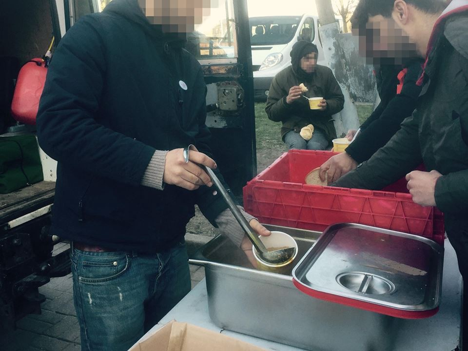

### AYS Daily Digest 08/02/18: A letter to Paris

_Emergency accommodation in Paris / Syria Civil Defence Center attacked / More people arriving in Bosnia / Ombudswoman’s letter to the Croatian State Attorney / News from Italy, France, Sweden, and Greece / And more news…_
### FEATURE: A letter to Paris

At least 128 unaccompanied minors \(aged 13 to 17, mainly boys\) are [reported](http://m.leparisien.fr/faits-divers/grand-froid-des-avocats-signalent-128-mineurs-isoles-en-danger-absolu-a-paris-08-02-2018-7549035.php) to be on the streets of Paris at these freezing temperatures, while some reports are saying there are around 400\. “Many unaccompanied minors \(…\) are currently left to their own devices in the streets of Paris, without shelter, in negative temperatures, and thus exposed to a serious and immediate danger to their physical and mental health,” lawyers Catherine Delanoë\-Daoud and Isabelle Roth, heads of the unaccompanied minors section of the Paris Bar, and Emmanuel Daoud, a member of the Council of the Paris Orde, alarmed in a letter sent today to the prosecutor and the prosecutor in charge of minors\. They are [asking](http://m.leparisien.fr/faits-divers/grand-froid-des-avocats-signalent-128-mineurs-isoles-en-danger-absolu-a-paris-08-02-2018-7549035.php) the city and the prefect of Paris to put “all the material and human means in work to ensure effective protection of these minors\.”

As long as a minor’s age has not been confirmed, they have no support from the State\. This procedure takes up a couple of months\. [C\-N\-R](https://www.facebook.com/collectif.pour.une.nation.refuge/?hc_ref=ARTF5BATABnj0x0hXLWTLT4GiVkSs2U20nAscBXLRAa0uSoOKN9iMdHheO6GzgHoU74&fref=nf) is now looking for private hosts for these kids \(some as young as 13\) who can host them \(short or long term\) as well as other volunteers for various jobs\.

If you’re looking for more information, you can find it every Saturday, from 17:00–19:00, at Cafe Fluctua\. At the moment, 80 kids are hosted\. On average, three persons are needed for one child to not have to return to the streets\.

](assets/55f6ce548eed/1*AAMIMtyRDKAraIbPz4xYsA.jpeg)

Thousands sleeping in freezing Paris today, photo from **‎** [Pierre Linguanotto](https://www.facebook.com/SAMDIPA?hc_ref=ARTMHYxYtjmHzRS59Vm9xrmI7yig5ablO23q6lNUoN4CjGyR3qcrGPtgyS6Mz4-_a68&fref=nf)

The French Refugee Council is offering emergency accommodation to those who have not yet been received in emergency housing\. Please call \+33 6 17 34 69 51 to register, or meet their volunteers wearing FRC\-coats near Jures Metro Station for immediate registration\.

Temperatures at night are below zero now, with snow expected again tomorrow\. Support is still URGENTLY NEEDED\.
### SYRIA
#### White Helmets Centre attacked

Two recent airstrikes targeted the Syria Civil Defence center in Khan Shaykoun, Idlib\. Eight rockets were fired, killing three volunteers and injuring five more\. Other teams responded to rescue them, but the center is out of action\. More than 35 civilians were killed in the preliminary tolls and dozens more were wounded from the morning hours until now, White Helmets [reported](https://twitter.com/syriacivildef/status/961613537201348608) \.

In the past three days, the UN has received reports of air strikes across Idlib that resulted in civilian death and injury, and damaged medical facilities, schools, and other civilian infrastructure\. Over 1,200 schools in Idlib reportedly remain closed due to the ongoing hostilities, impacting thousands of students\.
### GREECE

[Official registrations/transfers](http://mindigital.gr/images/NSP_Eastern_Aegean_07.02.pdf) have been published \(February 7th\):

Lesvos 0/4
Chios 0/34
Samos 0/30
Kos 45/0
Total 45/68

This is the first time since October that Kos has more than 100 registrations within a few days\.

28 people arrived to Lesvos today, half of them children, Advocates Abroad reported\. An update on unaccompanied minors in Greece is available [here](https://data2.unhcr.org/en/documents/download/61808) \.
#### How you can help: calls for donations and volunteers

LGBTIQ refugees [need your support with housing](https://www.youcaring.com/lgbtqirefugeeswelcomeingreece-882600) \.

DiO desperately needs volunteers in Nea Kavala, northern Greece\. Contact them at north\.admin@drapenihavet\.no\.

The Notara refugee housing squat posted a [list of needs](https://twitter.com/notara26/status/961649388044144641) \. Food dobations are also needed in [Athens](https://www.gofundme.com/Kerrielesvosgreece) \.

[Washing powder is much needed](https://www.facebook.com/ercintl/posts/762059860660434) in Kara Tepe refugee camp, currently housing 1,200 vulnerable people\.

[Refugee Info Bus](https://www.facebook.com/RefugeeInfoBus/) needs donations to keep doing their work\.
### SEA

36 people have been rescued this morning 11 miles south east of the island of Alboran\. They disembarked in Motril, [Salvamento](https://twitter.com/salvamentogob) Maritimo wrote\.
### BOSNIA AND HERZEGOVINA

More and more refugees mainly from Syria, Tunisia, Libya, Afghanistan, and Pakistan are arriving in Bosnia and Herzegovina\. The reception centers, according to official data, have been filled up to 80 percent, Slobodna Evropa [reports](https://www.slobodnaevropa.org/a/migranti-bih/29025756.html) \. They mostly arrive through a new route along the border with Montenegro\. Over the last few months, and generally in the last year, there has been a large increase in the number of asylum seekers in BiH\. In 2017, an increase of some 500 percent was recorded, says UNHCR regional spokesman Neven Crvenković\.

“They are vulnerable categories that need special care and have special conditions for accommodation\. We are now looking for solutions for these vulnerable categories, including children and mothers with small children, but also elderly and sick,” commented BiH Security Minister Dragan Mektić\.
### CROATIA

In the wake of the death of little Madina, that occurred near the border between Serbia and Croatia, the Croatian Ombudswoman has [submitted a letter](http://hr.n1info.com/Binary/173/Pravobraniteljica-o-Madini.pdf) to the State Attorney regarding the circumstances of the event\. Croatian police issued two orders \(one on 24 November 2016 and on 15 February 2017\) that match the data on increasing violence against refugees and unlawfully preventing refugees from seeking asylum in Croatia that us civil society organizations have been warning about\. The police, however, do not want to submit the text of the order to the Ombudwoman due to “technical difficulties\.”

The Croatian Center for Peace Studies, in addition to [initiating](https://www.cms.hr/hr/azil-i-integracijske-politike/mup-izdao-nezakonite-naredbe-svojim-djelatnicima) proceedings before the Constitutional Court on the constitutionality of police orders relating to the treatment of refugees, requested a conscientious and objective investigation into a series of alarming allegations in the treatment of refugees by the police\. CMS believes that the State Attorney will initiate a series of proceedings based on the Ombudswoman’s letter\. In addition, they once again urge police officials not to deal with possible unlawful orders\.
### ITALY
#### Vulnerability and marginalisation

MSF released a [report](http://www.msf.org/en/article/out-sight-second-edition) today saying Italy’s inadequate reception policies leave around 10,000 refugees living in inhumane conditions\. The reports is a follow\-up on monitoring of slums, squats, and occupied buildings in Italy during 2016 and 2017\.

A second [study on Ventimiglia](http://www.msf.org/sites/msf.org/files/harmful_borders_def.pdf) documents push backs from the Italian\-French border\. The study records more than 20 deaths in the past two years resulting from people trying to cross restricted borders into France, Austria, or Switzerland\.
#### Voluntary guardians

In 2017, the figure of voluntary guardians, individuals who offer to take legal responsibility for an unaccompanied minor after special training, was introduced nationwide in Italy\. Thirty\-eight unaccompanied minors attending day centers run by Save the Children in Rome, Milan, and Turin have drawn up a [list of five qualities](http://www.infomigrants.net/en/post/7449/unaccompanied-minors-recommendations-for-guardians) which they think voluntary guardians should have\.

They are:
- Help us to obtain the documents we are entitled to \(passport, permit of stay, tax code, health card, residency, identity card\)
- Come to see where we live and the conditions we live in, keeping in constant contact to ensure that the conditions are adequate
- Meet us and get to know our interests and passions so we can follow them in Italy too
- Build a relationship of trust with us, always respecting our culture, customs and religion and letting us get to know your own
- Give us advice on schooling and guide us in our formative decisions, helping us in the passage to majority age, so we are ready and do not find ourselves alone or on the streets\.

### FRANCE

A guide for refugees in France is available in several languages [here](http://www.leguidedurefugie.com/pdf/guide-du-refugie-version-en.pdf) \.

The [Refugee Community Kitchen](https://www.facebook.com/refugeeCkitchen/?fref=mentions) \(RCK\) are still working hard in northern France to keep hundreds of displaced people fed\. RCK already provide lunch and dinner in Calais and dinner in Dunkirk everyday\. They are now also helping to provide lunch for the communities living in Dunkirk\.

](assets/55f6ce548eed/1*k-hlUdcD1CNoSVvCbwAJAQ.jpeg)

Photos from [Mobile Refugee Support](https://www.facebook.com/MobileRefugeeSupport/?hc_ref=ARQLeRWUvnLvNy26zlXjDdPiOGRiqlKEAGiAzYYwwr0zqvLUmI0vVhHzW654L8FTXlw)
### SWEDEN

Of all asylum applications that were handled in 2017 \(in total 25,666\), 4,000 came from people who had previously applied for asylum in Sweden\. During the last three years, 17,000 applications have been from people who had applied for protection and gotten rejected at least once before, Dagens Nyheter [writes](https://www.dn.se/nyheter/manga-soker-asyl-upprepade-ganger/?forceScript=1&variantType=large) \.

According to Patric Engström, head of the border police, this is data that can be used to gain knowledge about how many people stayed in Sweden after they have been rejected\. If a person is rejected, the person must wait four years before the application is prescribed and a new one can be registered\. Moderaterna \(the biggest opposition party\) has suggested prolonging the time limit to ten years\.

The numbers of people who have repeatedly claimed asylum in the past three years are as follows:

2015: 6,435
2016: 6,410
2017: 4,106

In the last four years, more than 27,000 people have “disappeared” after receiving negative asylum decisions\. 4,500 of them were children\. In the next four years, an estimated 42,000 more people will “disappear” after being rejected and receiving information about upcoming deportations\. [According to](https://www.dn.se/nyheter/sverige/tusentals-forsvinner-varje-ar-efter-besked-om-utvisning/) the Migration Agency, that number is expected to be at an all\-time high in 2018, due to the big number of people fleeing war and persecution who came to Sweden in 2015 \(162,000 people\) \.

So far in 2018, Sweden [has received](https://www.migrationsverket.se/Om-Migrationsverket/Statistik.html#Text3) 192 people from Greece and Italy as part of the EU relocation program\.

**We strive to echo correct news from the ground through collaboration and fairness\.**

**Every effort has been made to credit organizations and individuals with regard to the supply of information, video, and photo material \(in cases where the source wanted to be accredited\) \. Please notify us regarding corrections\.**

**If there’s anything you want to share or comment, contact us through Facebook or write to: areyousyrious@gmail\.com**

_Converted [Medium Post](https://medium.com/are-you-syrious/ays-daily-digest-08-02-18-a-letter-to-paris-55f6ce548eed) by [ZMediumToMarkdown](https://github.com/ZhgChgLi/ZMediumToMarkdown)._
