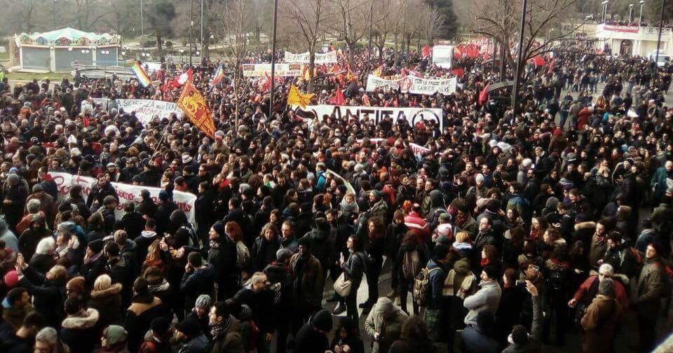
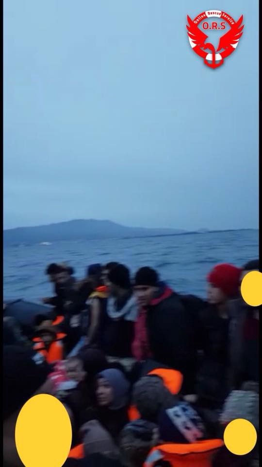
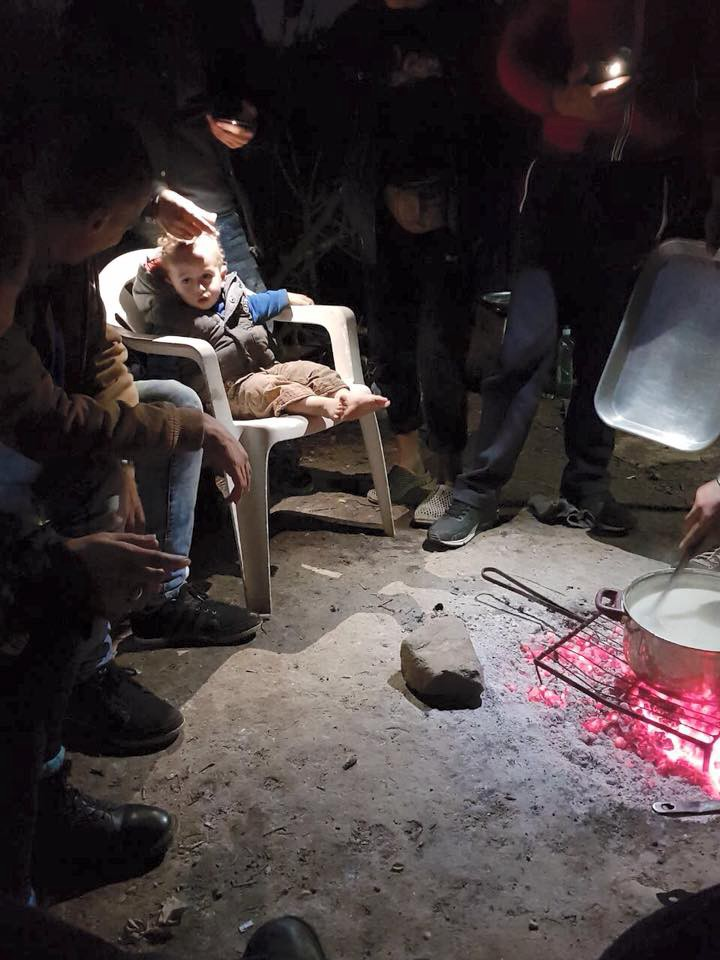
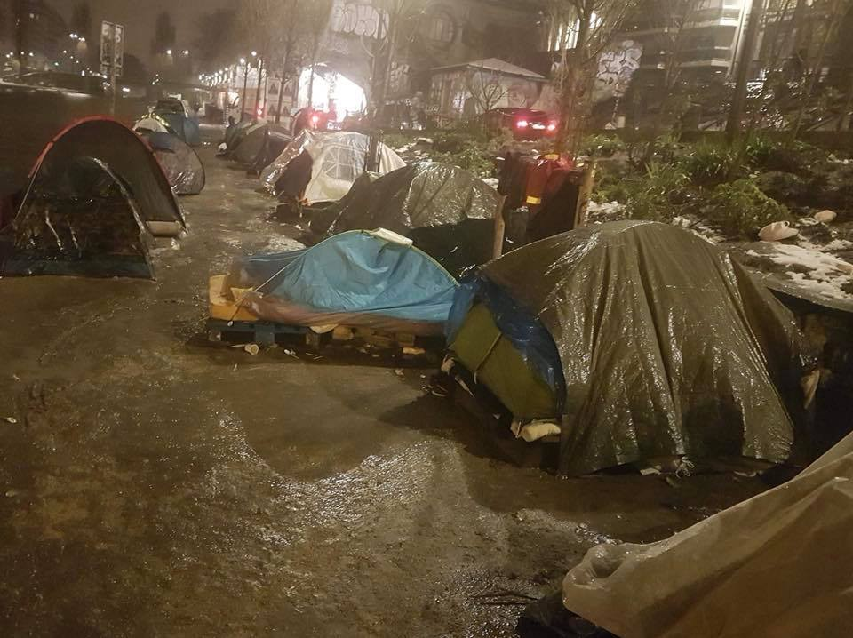
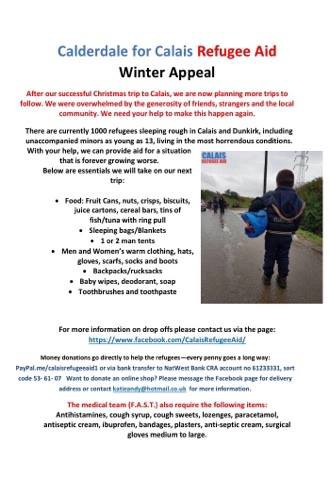
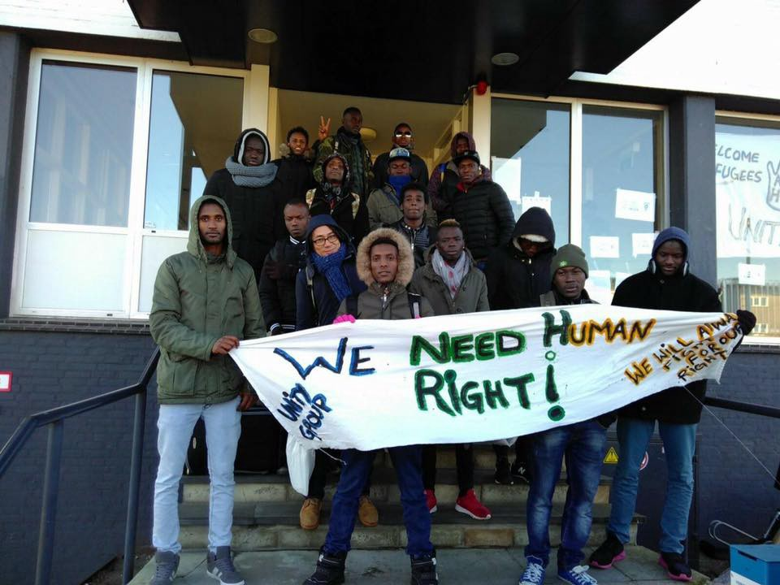

### AYS Daily Digest 10/02/2017: “Fascism, racism, xenophobia, we will wipe them off our streets\!” Whose streets are these — a reminder\.

_Anti\-racism demonstration draws 40,000 in Italy\! // Interceptions in Greece, escalating violent pushbacks at the Greek\-Turkish border, citizens band together to support people outside the system // Velika Kladuša, Bosnia in need of humanitarian aid for increasing numbers of people\. // Salvage operations in the wake of police evacuations in Paris // Squat supports people trapped in a bureaucratic void\._

### FEATURE: Wiping hate off the streets, a call to action\!

In several cities across Italy, regular citizens from a variety of backgrounds took to the streets in order to protest racism and fascism\. In recent weeks, the news from Italy has been bleak\. Protestors seeking asylum on Lampedusa [resorted to sewing their mouths shut](ays-daily-digest-26-01-2018-protesters-sow-their-mouths-shut-in-lampedusa-625226844336) in response to a lack of support or timely decisions regarding their status\. Italian politician and former Prime Minister \(technically barred from running for office again due to tax fraud, but who remains a powerful force on the scene of Italian politics\) Silvio Berlusconi pledged to deport the “600,000 illegal immigrants” should a right\-leaning coalition win in March elections in an effort to “reduce tensions”; this in the wake of a Nazi\-sympathizing Italian man shooting foreigners\.

Indeed you read that correctly, in response to an attack by an Italian man, politicians are _essentially blaming the victims themselves_ , seeking to assuage the discomfort of those who would resort to violence against the victims\. Volunteers rightly pointed out that the number of “illegal immigrants” \(translate as: “individuals with no paperwork status in Italy, or ‘undocumented’” as no human is illegal\) is actually around 66,000 as the other 600,000 are at some point in the paperwork process\.

However, yesterday, tens of thousands of people took to the streets to protest this escalating tension\.

](assets/e71831586125/1*ih0PdfODr4IjT8aMH3yuDA.jpeg)

Protest in Macerata\. Photo credit: [**Csa Sisma**](https://www.facebook.com/CSASISMA/)

Estimates place the protestors at around 40,000, and the largest demonstration took place in [Macerata, Italy](https://www.google.hr/maps/place/Province+of+Macerata,+Italy/@43.1526682,12.7258767,9z/data=!3m1!4b1!4m5!3m4!1s0x132de5eb825f98cb:0x3082c90e3e48010!8m2!3d43.2459322!4d13.2663479) \. There a participant and volunteer described the police presence as well as the general mood of the protest\.

> The city centre was barricaded, with police at every entrance of the old town\. Police in some cases had shields and riot helmets, but the demonstration was absolutely peaceful and it was a great response to the tension of these days\. We estimate that the number of police was definitely over 300, including police, Carabinieri, finance police \(not counting those outside the highway tolls and at major roundabouts before entering the city\) \. Over it all a helicopter \(police\) flew above the crowd\. All shops in town were closed apart from some cafes\. 

> “The participants were people from all over the country, belonging to different social political and cultural realities\.” 

](assets/e71831586125/1*fl4W9UxBPrCJNAvOLhw80w.jpeg)

Photo from the protest\. Photo credit: [**Csa Sisma**](https://www.facebook.com/CSASISMA/)

If you have the time, a local television station posted a live feed lasting two hours\. :\) But watch a few minutes of it regardless to get a sense of the magnitude and excitement\.

At least one other solidarity protest \(shared with the statement “Solidarity without Borders”\) was held in [Milan, Italy](https://www.google.hr/maps?q=Milan,+Italy&um=1&ie=UTF-8&sa=X&ved=0ahUKEwiI9Z3xsJ3ZAhUKzKQKHQDMBX0Q_AUICygC) \. Protestors shouted slogans including “Fascism, racism, xenophobia, we will wipe them off our streets\!”

](assets/e71831586125/1*qIBSGqLsPfKaddDO4LtmMw.jpeg)

Protest in Milan Photo credit: [**Mshikamano**](https://www.facebook.com/associazionemshikamano/)

As the bad news piles up, it is tempting to become paralyzed, to forget that the purpose of being informed is to be moved to action\. Do not succumb to the fatalism of the news cycle\. Fear is our most powerful enemy and has the power to make us give up before we’ve even begun\. Take heart and reach out to those around you and speak up\! It is not an option in these dark days to be silent as silence is what has brought us to this dreadful situation and to horrors time and time again\. Use your voice\.
### GREECE

The boat intercepted towards Kos\. Terrifying winter waters\. Photo credit: ABR

According to [Aegean Boat Report](https://www.facebook.com/AegeanBoatReport/posts/304986480024463) , ten people were picked up by Frontex from a speed boat with engine trouble yesterday around 01:00\. They were transported to Skala Sikamineas\. Additionally, 46 people landed on Samos yesterday\. One boat headed to Kos was intercepted, and there is a noted increase in boats going towards Kos\.

Conditions in Vial remain appalling, with a shortage of coats, gloves, socks, and other winter wear\. Long\-term volunteer Ruhi Loren recently published [heartrending stories from the camp](https://www.facebook.com/ruhi.akhtar.7/posts/1922345997782299) \.

Photo credit: Ruhi Loren

People are struggling to survive the cold\. Volunteers should educate themselves on hypothermia and frostbite in order to keep an [eye out for life\-threatening cases](https://www.cdc.gov/phpr/documents/hypothermia-frostbite_508.pdf) \.

The desperation for basic needs is only serving to strengthen those who would abuse this power\. In relation to this, UNHCR recently called upon Greece to strengthen security for camps as at least 180 cases of sexual or gender\-based violence have been reported\. One woman even said that she had been too frightened to shower for two months\. Read more [here](https://www.facebook.com/ruhi.akhtar.7/posts/1922345997782299) \.

Although we support UNHCR’s condemnation, we also feel it must be stated that aid agencies are not exempt from monitoring as various international NGOs have been implicated in enabling sexual and gender\-based violence around the world\. Any agency that is helping inadvertently or overtly to support these situations should be held responsible, and we know that the power given to those “helping” is often leveraged cruelly to their own sick advantage\.

> We call on UNHCR, IOM and all NGOs and support structures to vet and monitor vigorously for sexual abuse within their own ranks in order to do some justice to victims and to prevent further victimization\. If people cannot trust those whose supposed duty it is to help them, then the chance for criminal activities to be reported and brought to light becomes even slimmer\. 

A new development in the trial of the eight Turkish officers who sought asylum in Greece\. Vasilis Papadopoulos, former general secretary of Immigration Policy and coordinator of legal services for the Greek Council for Refugees \(GCR\) issued a statement wherein he highlighted efforts being taken to strengthen the network of support for the men, reaching out to academics and others on behalf of their case\. Additionally, the topic was raised of the recent news of pushbacks at [Evros, Greece](https://www.google.hr/maps?q=Evros,+Greece&um=1&ie=UTF-8&sa=X&ved=0ahUKEwikza3sxZ3ZAhXEzqQKHXFGAkUQ_AUICygC) \.

> “The Greek\-Turkish border of Evros is a border that is not merely guarded, what happens there does not honor the country\. These are tactics approaching those in Hungary and what’s worrying is that we are constantly hearing reports\. 

> Pushbacks have started again since summer and continue systematically, indiscriminately, and not only for those entering — but also for people who are already on Greek territory, who call from Istanbul and enter from an island, indicating that they have driven beyond the river \(Evros\)” 

Both Hungary and Bulgaria have become synonymous with references to violent pushbacks and human rights abuses, so this increase in violence is notable and disturbing\.

A citizens’ initiative in Thessaloniki seeks to help those who have crossed via Evros and who have been effectively barred from entering the system\. Aware of the barriers erected against those people fleeing poverty and unrest who do not meet the EU\-Approved “appropriate criteria”, citizens of Thessaloniki are seeking to house those who, therefore, do not have access to asylum support services\. In a rousing statement published on 9 February, they took their stand:

“When they are asylum seekers, they clearly receive different treatment\. Although Greece is obliged to provide shelter to asylum seekers and has the ability to do so as there are vacancies in the hospitality structures, these people are left to live on the road\. This category also includes a large number of unaccompanied minors…\. Unfortunately, the conditions in which these people were found in Thessaloniki and other cities are extremely unfavorable\. Nearly no care is taken by the state or the international and domestic humanitarian organizations dealing with these refugees because they are usually single, young men\. This means that they are living on the road under very adverse conditions\. They often fall victim to robbery, they are beaten by gangs, systematically evicted by the police, and are subject to arrests and imprisonment…\. It is therefore up to us, the movements, civil society, to try to solve the problem\. To help these people live with dignity, as it suits every human being to have a roof over their head and what is necessary for their survival\.”

Their first priority is to provide rent and basic shelter support to these individuals\. For those interested in assisting, the contact information is: 
 tel: 2310222503, 
e\-mail: oikopolis\.social\.center@gmail\.com or 
visit us at: 29th Ptolemaion, 5th floor, Thessaloniki

Read more [here](http://parallaximag.gr/life/einai-prosfyges-einai-anthropoi-aksizoun-anthropini-metacheirisi) \(in Greek\) \.

■■■■■■■■■■■■■■ 
> **[lazara m.](https://twitter.com/lazaralazara) @ Twitter Says:** 

> > This is Puppy. For 2 years he lives in the tent in transit zone on Serbian border with Hungary with two refugee communty leaders (mediators/translators) helping others in turn to cross. Only 10 people per week are allowed to enter Hungary’s closed transit camp for asylum process. https://t.co/wbqtlKEqTO 

> **Tweeted at [2018-02-09 13:45:29](https://twitter.com/lazaralazara/status/961959239844495361).** 

■■■■■■■■■■■■■■ 

### BOSNIA

Help is needed\! The tiny town of [Velika Kladuša](https://www.google.hr/maps?q=velika+kladusa&um=1&ie=UTF-8&sa=X&ved=0ahUKEwjzsfDfvJ3ZAhXRzqQKHWdGBEMQ_AUICygC) near the Bosnian\-Croatian border has been coming together to help support the ever\-growing community of people fleeing danger\. The current number of people they are helping is around 50, but more are coming every day, say local community members\. Currently, citizens are supporting them, and they are being hosted overnight in local mosques\.

> “Everything started after the big snowfall, that is, about a week ago\. In the beginning there were fewer people, but it is quite noticeable that more and more are coming\. They arrive and are showing up in the middle in the night …\.and we could see they were frozen, wet and exhausted\. Since temperatures are below freezing at night, it is inhumane to leave these people outside to freeze, so for those humane reasons we let them into the mosque and let them sleep” says Imam Muamer Ćatić\. 

Many of these people have already faced a long, harrowing journey\. One who was interviewed started his journey in Morocco and had traveled through Turkey, Greece, Albania, and Montenegro\. He attempted repeatedly to cross over into Bosnia and Croatia, but was unsuccessful time and time again\. Now in Bosnia, he says he has experienced kindness\. The full story is available in Bosnian [here](https://www.klix.ba/vijesti/bih/migranti-u-velikoj-kladusi-traze-utociste-u-dzamijama-domacini-pozivaju-nadlezne-da-reagiraju/180210037) \.

The town of Velika Kladuša remains one of the poorest cities in one of the poorest regions of Bosnia\. Help is very much needed as the number of individuals stranded here seem to be on the rise\. 
The list of items needed is as follows:
- Telephone chargers
- Light bags and backpacks
- Water
- Candy/Chocolate bars
- Wet tissues
- Plasters and bandages
- Probiotics, analgesics, and paracetemol for children
- Sanitary napkins
- Hand sanitizer
- Diapers
- Baby food
- Socks and underpants for children and adults
- Winter footgear \(winter boots/hiking boots/trainers\. Please no fancy formal footwear ;\) \)
- Hot food

Those interested in helping can contact Muamer Ćarić \(the local Imam\) at \+387 37 770–596

_As a general reminder to those interested in assisting — Bosnia and Herzegovina is not a member of the European Union, which could pose complications for those seeking to import donations via formal channels\. We will continue to seek out and publish the most efficient means of assisting local groups on the ground as we become aware of them\._
### FRANCE

Snow has turned to rain in Paris, but this thaw provides little relief as wet clothing can kill\. Again, volunteers are encouraged to educate themselves on spotting hypothermia\. “Juares Canal now in Paris: weather is sh\*t\. \. raining and windy… but most tents have extra cover and they are mostly well covered”

Photo credit: AYS

Paris Refugee Ground Support spent the night of the 10th salvaging in order to prepare for the police following “cleaning” of the area\. 200 people were evacuated, but risked losing many useful items\.

_“The police will be at the canal to evacuate the rest this morning\. They will send in the cleaners and take all the tents and dump into rubbish/landfill…_

_So we spent the whole bloody night salvaging\. We’ve packed every single empty tent and every sleeping bag, blanket and duvet that can be washed and reused\._

_Now we have a mountain nearly up to the ceiling of dirty laundry\.”_

Although Paris was a site of critical need this week, one must not forget the needs of those in Calais\. Above is a flyer with the most urgently\-needed winter items\.
### NETHERLANDS

Photo credit: Wir Zijn Hier

Today \(10 February\), a group of undocumented refugees from the collective We Are Here, mainly form West Africa, have moved into a building in the centre of Amsterdam that has been empty for over six months\.

For more than five years the refugee collective We Are Here has been fighting for “a normal life for refugees, equal to that of all citizens\.”

The collective is raising awareness for those who fall into the “asylum gap” — those who are not allowed to remain in the Netherlands as their application has been rejected, but cannot return home due to dangers at home or bureaucratic snarls\.

The current institutions often only allow people to use shelters at night, “leaving the people on the streets during the day in heavy rain, in the freezing cold and in the snow taking away self determination and dignity\.”

As such, the natural response to this is to form squats in vacant buildings, although the group has had to move more than 30 times in the past five years\. “The group of 35 people intends to have a respectful relationship with the neighborhood as well as the building and hopes for solidarity\.” Read the full post, in Dutch, [here](https://www.facebook.com/WijZijnHier/photos/a.657256904307876.1073741830.423445664355669/1782479941785561/?type=3) \.

> **We strive to echo correct news from the ground through collaboration and fairness\.** 

> **Every effort has been made to credit organizations and individuals with regard to the supply of information, video, and photo material \(in cases where the source wanted to be accredited\) \. Please notify us regarding corrections\.** 

> **If there’s anything you want to share or comment, contact us through Facebook or write to: areyousyrious@gmail\.com** 

_Converted [Medium Post](https://medium.com/are-you-syrious/ays-daily-digest-10-02-2017-fascism-racism-xenophobia-from-our-streets-we-will-wipe-them-e71831586125) by [ZMediumToMarkdown](https://github.com/ZhgChgLi/ZMediumToMarkdown)._
