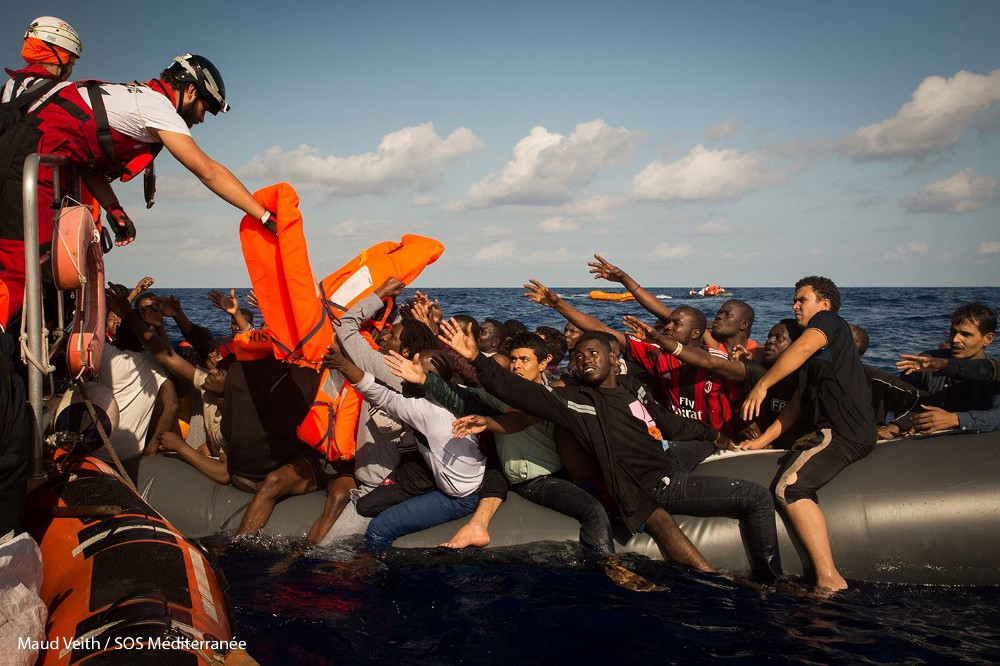
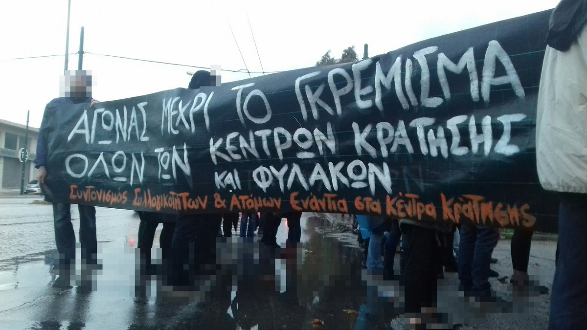
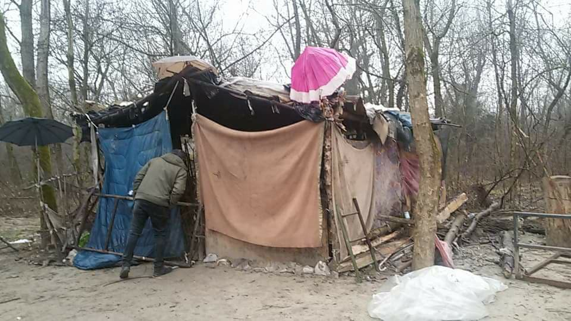

### AYS Daily Digest 11/02/2017: Refugees at risk of human trafficking

_Update on Lesvos and the Moria 35//Volunteer needs in Greece//Possible deportations to Sudan from France//Donations needed in Italy//_

SOS Mediterranee\. Rescue of people who came across the sea from Libya to Italy\. Photo by Maud Veith\.
### Most refugees face human traficking along the route

**Human trafficking is prevalent for refugees,** especially on the Central Mediterrean route according to an [IOM report](http://migration.iom.int/docs/FMS_CT_Analysis_male%20female_Central_Eastern_2017.pdf) — 76% of male and 67% of female respondents answered “yes” to at least one of four human trafficking indicators\. The indicators include experience of physical violence, work without payment and imprisonment\. 80% of males and 66% of females experienced physical violence of any sort during their journey, while 64% of male and 56% of female were held against their will\.

**In Libya in particular, refugees face torture and are sold in open\-air slave markets\.** Despite this, the EU continues to hold on to its deal with Libya and supports the country in stopping sea crossings and containing people\. Millions are given to the Libyan coast guard despite widespread abuse by the coast guard itself and in Libyan prisons\. Reports on collusion between Libyan forces and smugglers have also emerged\. A [UN report](https://www.alaraby.co.uk/english/news/2018/2/6/libya-forces-may-be-colluding-with-migrant-smugglers) for example cites accounts from Eritrean migrants arrested by agents of a special force affiliated to Libya’s interior ministry who handed them over to migrant smugglers “against payment”\. As Amnesty Internaional says, “ _by training and providing the Libyan coastguard with ships to transport migrants back to the country, European leaders are contributing to unspeakable suffering_ ”\.
### 92% of all children arriving through the Central Mediterrean route are unaccompanied

**Risks of human trafficking are even more severe for children** , with 88%
of children showing indications of human trafficking along the Central Mediterrean route\. 92% of all children who arrived through the Central Mediterrean route \(mostly from Libya to Italy\) were unaccompanied and separated children, according to the [UNHCR](https://data2.unhcr.org/en/documents/details/61915) \.

The difficulties faced by these children often do not end there — in France for example, unaccompanied minors face trouble being recognised as such\. Traumatised by their journey, they are asked to give a detailed account of their journey to prove their age\. Often victims of trafficking and torture, they are also asked to describe which cities they traveled through, even though they were being hidden in buses and prevented from going outside\. The traumatism once they reach Europe is often worse, as they faced extreme difficulties during their journey in the hope of living a normal life, hopes that are often shattered once they reach the continent\.

Recently, the [European Council on Refugees and Exiles](https://www.ecre.org/shortages-in-reception-systems-expose-unaccompanied-children-to-harmful-conditions-in-italy-and-greece/) also worried about the difficulties in securing adequate reception for unaccompanied children in Greece and Italy\. In Greece for example, 2,290 were waiting at the end of 2017 to be placed in a dedicated shelter — “ _54 children remained in “protective custody” in police stations, while another 438 were held in Reception and Identification Centres_ ”\.

An [UNHCR document](https://data2.unhcr.org/en/documents/details/61915) on refugee children in Europe says “ _over 25,300 children arrived in Greece, Italy, Bulgaria and Spain between January and September 2017, of whom more than 58% were unaccompanied and separated children_ ”\.
#### Greece
### Update on Lesvos and the Moria 35

10 people have arrived to Lesvos on Saturday and 46 to Samos\. The Legal Centre Lesbos [reports](http://www.legalcentrelesbos.org/2018/02/10/january-2018-report-on-rights-violations-and-resistance-in-lesvos/) on the continued inhumane treatment of refugees and arbitrary detention practices on the island\. In particular, it reports on the case of a man who drowned end of January, while trying to swim to climb aboard a ferry bound for Athens\. They believe the man to be Saihi, a 30 year old Algerian, who had been trapped on the island for more than six months, living the last two months in an abandoned house and who was denied assistance by NGOs because of his lack of legal status\.

It also notes that six months have passed since the arrest of 35 refugees in Moria camp after protests denouncing dehumanising conditions and calling for freedom of movement\. A trial date has still not been set and an additional two refugees face identical criminal charges\. The legal centre reports they are in a state of limbo, as they are “ _denied help by organizations like Mercy Corps, because their asylum claims have been rejected in the second instance, yet they are prohibited from leaving the island due to the ongoing criminal case against them_ ”\. Some are restricted to Lesvos while many still live in the Moria Camp\. Other members of the Moria 35 are detained in the infamous pre\-removal detention centre of Petrou Ralli in Athens\. On Saturday, people gathered outside its gates in soldiarity with the prisonners\.

Meanwhile, refugees have protested on Sunday against the food in Moria\. On top of bad food, there’s also no running water, tents are crammed in every corner and rubbish is everywhere\. A mix that has led MSF to warn against a [mental health emergency](http://www.msf.org/sites/msf.org/files/2017_10_mental_health_greece_report_final_low.pdf) in October and to call for an end to the containment of asylum seekers on the Greek islands\. [Huffingtonpost](http://www.huffingtonpost.de/entry/lesbos-moria-pikpa-fluechtlinge_de_5a71807ee4b0ae29f08c2fa5) recently noted the stark difference in conditions between Moria and the self\-oganised open [Pikpa](https://www.facebook.com/pg/pikpalesvos/) camp for vulnerable refugees which wants to “stand in active solidarity with the refugees and fight against the barbaric European immigration policies”\. The website argues the contrast shows how “the EU has failed in its treatment of refugees on Lesvos”\.
### Only 16% of asylum seekers can be returned to Turkey

[Ekathimerini](http://www.ekathimerini.com/225723/article/ekathimerini/news/only-16-pct-of-asylum-seekers-can-be-sent-back-to-turkey) reports that “only 16% of asylum seekers who undertook the journey to Greece can be returned to Turkey under Greek law and European directives” according to the former head of the Greek asylum service Maria Stavropoulou:

> “Given what we know about Turkey, those who can be shipped back are mostly Syrians, who enjoy a high level of protection” 

### Volunteers needed
- The Open Cultural Centre in Polikastro needs volunteers from the 15th of March\. The centre offers non\-formal education and cultural activities\. Volunteers need to have a good level of English, be more than 23 old and have experience in the field of education\. You can email hhrr@openculturalcenter\.org for more information\.
- The Orange House, a shelter for women and children, as well as a day centre open to all refugees also needs volunteers for March and April\. Volunteers are required to commit to a minimum of two weeks of volunteering\. Please send an email to [volunteer@zaatarngo\.org](mailto:volunteer@zaatarngo.org) with your CV and availability\.
- The 2nd School \(aka Jasmine\) refugee accommodation squat, which is now back to normal operation, invites solidarity volunteers who would like to assist refugees in various activities to attend the next refugees and volunteers assembly this Monday at 4PM on the ground\-floor hall\.
- Please check out [Greecevol](https://www.greecevol.info/) for more volunteering opportunities\.

### New Refugee Center for Serres Camp

Lifting Hands International has opened its Refugee Center just outside the Serres Camp, with several class spaces, a women’s only space and a library\. There are also picnic tables and a sports field outside\. The grand opening took place just last week\.

](assets/464142f6c0ba/1*ukTlUJi3K5hNiXpVOss5tg.png)

Photo by [David Lohmueller](http://davidlohmueller.com/en)
#### France
### Possible deportations to Sudan

[Calais Migrant Solidarity](https://calaismigrantsolidarity.wordpress.com/2018/02/10/two-possible-deportations-to-sudan-no-flight-scheduled-yet-but-stay-awared/) says a Sudanese man has been arrested in Calais and detained since 30 days in the Coquelles detention centre\. All legal possibilities were tried, but he is still inside\. The judge has decided to prolong his detention for 15 days and Calais Migrant Solidarity warns that he could face deportation\. Another man was deported from the Netherlands to France and has been in detetion for 15 days\. He also faces deportation to Sudan\. His friends in Belgium have warned:

> _“_ A return to Sudan would significate for him death, because he’s very sick\. He left his country, his family, his roots, because of threats against him, of a real danger of death, he’s actively searched by the dictature and certainly not to profit from a very lamentable Europe\. But as long there is hope, we’ll fight along his side … We’ll not abandon him …” 

### Situation in Paris

The occupation of the Paris 8 university is still going strong and donations are needed, including books in Arabic, toilet paper, mobile credit and [other items](http://---  https://www.facebook.com/permalink.php?story_fbid=1948045962180466&id=1943620965956299&hc_location=ufi   ---) \. Donations can be brought to the “A Building” in the classrooms A280 to A283\.

Paris Refugee Ground support says that the snow has thawed but that rain however is forecasted for the rest of the week with temperatures still in the minus at night\. People are still sleeping in the streets\.
### Protest against the new immigration and asylum law

[A protest is planned on Wednesday the 21st of February](https://www.facebook.com/events/143529396312758/permalink/146772455988452/) against the new immigration and asylum law\. BAAM organises the protest against a law that would “marks a turning point towards an ultr\-repressive immigration policy”\. It notes the law shortens delays to present an asylum demand and to make an appeal, increases “administrative detention” from 16 hours to 24 hours and increases the maximum time in detention centres from 45 days to 135\.
#### Italy
### Donations needed in Gorizia, Gradisca d’Isonzo, Pordenone and Rome

In Gorizia, blankets, sleeping bags, soap, shampoo and food are needed as refugees are still forced to sleep in the woods despite the snow and cold temperatures\. In Rome, clothes and hygiene items are needed for around 200 people\. More donation needs can be found on the page “ [Italy — Refugee Crisis Darabase](https://www.facebook.com/groups/1834254390190027/1996501840631947/) ”\.

Mauro Chiarabba
#### **We strive to echo correct news from the ground through collaboration and fairness\.**

> **Every effort has been made to credit organizations and individuals with regard to the supply of information, video, and photo material \(in cases where the source wanted to be accredited\) \. Please notify us regarding corrections\.** 

> **If there’s anything you want to share or comment, contact us through Facebook or write to: areyousyrious@gmail\.com** 

_Converted [Medium Post](https://medium.com/are-you-syrious/ays-daily-digest-11-02-2017-refugees-at-risk-of-human-trafficking-464142f6c0ba) by [ZMediumToMarkdown](https://github.com/ZhgChgLi/ZMediumToMarkdown)._
