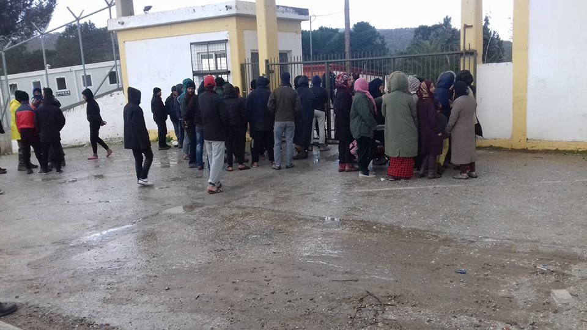
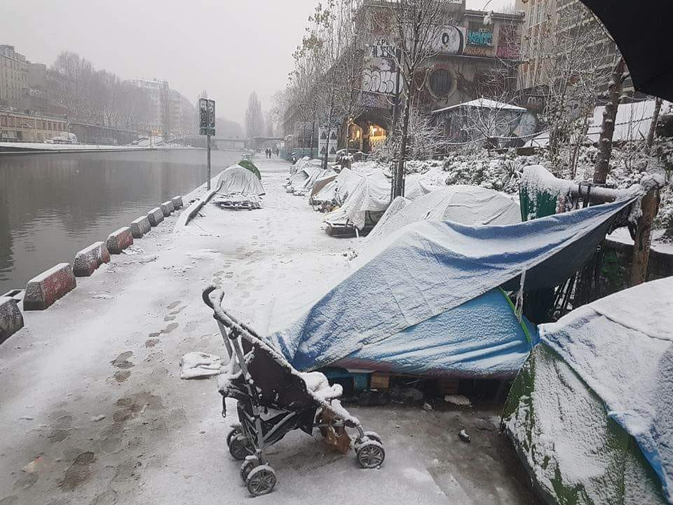

### AYS Daily Digest 12/02/18: K\. got his documents stolen and was pushed back to Turkey despite legal refugee status in Germany
#### Migration statistics from Turkey and Greece / Volunteers urgently needed in Serbia / People sleeping rough in Sarajevo, Bosnia / Paris remains cold and snowy / Protest against deportations in Austria / Riots in Italy / Civilians continue to fill gaps in Belgium / And more news from France, Finland, UK, and elsewhere

 \)](assets/ebe78ca5e92e/1*ZHGl1zkeBz7OgG5KlHsppg.jpeg)

K\.’s documents were basically thrown away, just as 14 months of his life\. Photo: Vasco Gargalo \( [Art Against](https://www.facebook.com/artagainstproject/) \)
### Feature

[The 23 year](http://www.efsyn.gr/.../moy-piran-ta-hartia-me-pigan-sto...) old Syrian refugee K\. went from Germany to Greece to meet his younger brother who were supposed to come from Turkey by the end of November 2016\. When he looked for him in Didimoticho, Greece, showing a photo of the 11\-year old brother, he was arrested\. 14 months later, K\. is back in Greece after being pushed back to Turkey with 50 other migrants on the 30th of November 2016\.

K\.’s young brother was supposed to come from Turkey to Greece by the end of 2016\. But, the younger brother were lost before he arrived safely in Greece, and K\. who already had legal refugee status in Germany and therefore the right to travel within the EU, went from Munich to seek for the brother in Didimoticho, Greece\. Back then, in November 2016, three policemen caught him\. They didn’t care about the document K\. had from Germany\. Instead, the three Greek policemen took his documents and only gave him back his Syrian identity card\. They also kept his cell\-phone without any obvious reason or explanation\. K\. had a refugee passport, or travel document, so that he could be travelling all across the EU for six months during a year\.

[The following day](http://www.efsyn.gr/.../moy-piran-ta-hartia-me-pigan-sto...) , after having spent the night in a cell with around 50 other migrants and refugees, the police pushed them all into a green jeep and K\. found himself pushed back to Turkey\. He, who only was supposed to travel back to Greece to meet his younger brother\. It took K\. more than 14 months to be get back to Greece\. He decided to come back to Greece the highly infamous way — the same he was deported through, the Evros river\. It wasn’t easy, but on the 25th of January he succeeded and is still in Athens, waiting for permission to go back to Germany\. He has filed reports about what he has been through to the German Embassy in Athens\.

This case is of particular interest since the German authorities are involved\. Push\-backs like this one has been recorded and happened before\. With that said, human beings with documented refugee status and permission to reside in a European country have been abused in similar cruel ways before\.

The Greek police is denying the incident, claiming that the high water in the river of Evros around the 30th of November 2016 was to high\. K\. and his fellow imprisoned refugees was forced to cover their faces and put in a truck\. K\. met another Syrian there, who said that he was recognised as a refugee in Switzerland\.

This is a clear violation of not only human rights, but also refugee rights that should be known to a greater public\. We hope and will try to make sure that this case, and every other similar case, will get the attention they deserve and need\.

The number of recorded incident in the Evros river is likely to be much higher in reality, as it so often is with this king of violations\. The paper [“Ef\.Syn\.](http://www.efsyn.gr/.../moy-piran-ta-hartia-me-pigan-sto...) ” has recorded dozens of incidents the past couple of years\.
### Turkey

Monthly migration statistics for 2017 and the first months of 2018 available for [Turkey here\.](http://www.sahilguvenlik.gov.tr/baskanliklar/harekat/faaliyet_istatistikleri/duzensiz_goc_istatistikleri.html) The numbers cover all seas around Turkey and the crossings counted are what is called “irregular” ones, just as as good as all crossings are today due to Fortress Europe\.

More statistics and numbers from Turkey here:

](assets/ebe78ca5e92e/1*Mu0Cso7szjM6cIIYbaGm0w.jpeg)

Photo and information: [**Aegean Boat Report**](https://www.facebook.com/AegeanBoatReport/?hc_ref=ARSOMxjNGf2Spehl_wZSbXGQLDPKDexqYXzUb4VzdcVQI8Z1YxG9wuxxJBPMbA1ZekM)
### Greece
#### Mainland

It is soon [two years since the EU\-Turkey deal](http://harekact.bordermonitoring.eu/2018/02/11/investigation-coercive-voluntary-deportations-leave-refugees-trapped-in-jail/) , and the impcats for refugees and migrants well\-being are huge\. Nonetheless, the deal often is described as a successful decision\. Successful in terms of keeping people away, or as in this new report \(yet not surprising\), so successful so people return back to their war torn countries\.

As a part of this, Moria on Lesvos remains [hell on earth](http://harekact.bordermonitoring.eu/2018/02/11/january-2018-report-on-rights-violations-and-resistance-in-lesvos/) , a new report shows\.
#### Fire fighters face prison

[Three fire fighters](http://www.eldiario.es/andalucia/juicio-bomberos-lesbos_0_737726779.html) from Andalusia are facing up to 10 years in jail for helping migrants in the Mediterranean\. The trail will be held in Greece\. More information will hopefully be available soon, as this is yet another try to criminalise humanity\.
#### Athens

[**Hestia Hellas**](https://www.facebook.com/hestiahellasGR/?hc_ref=ARRz82CKMRq1UnuY5JmFq6ya0RoxYzujk9hHu3eraEvSI9txQmIMkWPZv6kWfULPn8Y&fref=nf) is open every Monday, Wednesday and Friday from 11:00 until 14:00\. Book an appointment and join in and improve your computer skills, including basic typing skills, using microsoft Word and Excel\. Contact them for more information\!

](assets/ebe78ca5e92e/1*ep5ElVU69LO-WBAEKK7puQ.jpeg)

Photo: [**Hestia Hellas**](https://www.facebook.com/hestiahellasGR/?hc_ref=ARRz82CKMRq1UnuY5JmFq6ya0RoxYzujk9hHu3eraEvSI9txQmIMkWPZv6kWfULPn8Y&fref=nf)

[Also in Athens](https://www.facebook.com/zaatarngo/posts/1698930050127331?hc_location=ufi) , [**Zaatar — non\-profit organization**](https://www.facebook.com/zaatarngo/?hc_ref=ARQPic9g8iL2tIX04btdsrClMzkmLFPU1EnOEIt4kiDzlrnMjyChs534sixI0uVD5Us) is open\! Se the schedule below for this weeks activities and language classes\.

](assets/ebe78ca5e92e/1*OLxnPB5nKf66U_yzONiEzQ.jpeg)

Photo: [**Zaatar — non\-profit organization**](https://www.facebook.com/zaatarngo/?hc_ref=ARQPic9g8iL2tIX04btdsrClMzkmLFPU1EnOEIt4kiDzlrnMjyChs534sixI0uVD5Us)
#### Islands

[**Aegean Boat Report**](https://www.facebook.com/AegeanBoatReport/?hc_ref=ARTSBZ68iRiT1xtx0h0Fu-5lFPBlRWZUcvPPwMVg5vTuyklVBue7Ozg-sVC28DMbCMM&fref=nf) released the latest figures [for the islands](https://www.facebook.com/AegeanBoatReport/posts/306015703254874?hc_location=ufi) , as of the 11th of February\. See the photo below for more details and numbers from different organisations and islands\.

](assets/ebe78ca5e92e/1*oyBKapVchDsp2vYdNTX_Kg.jpeg)

Photo: [**Aegean Boat Report**](https://www.facebook.com/AegeanBoatReport/?hc_ref=ARTuCcTJlraR9XB8NWU6DliQmCvby_c1YDL6DdGZauS8gr_3pphBxi_zDdW2al7BP2o&fref=nf)
#### Lesvos

[At 11 pm tonight](https://www.facebook.com/AegeanBoatReport/posts/306044589918652) , the 12th of February, a boat with 34 people was picked up by Frontex\. Among the people on the boat, there was 13 children, 9 women and 12 men\. They were all transfered to Skala Sikamineas and dropped there around midnight\.

](assets/ebe78ca5e92e/1*uWUMneRSe5N0kJLLDSASAw.jpeg)

Location of the pick up\. Photo: [**Aegean Boat Report**](https://www.facebook.com/AegeanBoatReport/?hc_ref=ARSq0wNyoCGOAZMf55RwUWKa1UMP9HLmyeSj3lSeNX5YMa1v6-2X433ccXZqF9qqRW4&fref=nf)
#### More protests in Moria

[Today there](https://www.facebook.com/nobordersnetwork/posts/1652499711484581?hc_location=ufi) was protests in Moria again, [**NoBorders**](https://www.facebook.com/nobordersnetwork/?hc_ref=ARSJMXMRD7dgp8PfjyXpBtorewxgJH9HHW9Mag3B9DorGRrP5WjLkwx-8qXK6tIA3RA) writes\. This time due to bad food and especially bad breakfast\. People have been living under these conditions for years now, and no wonder they complain over poor food\. To eat is an important part of life, which the people in Moria are neglected to do with dignity\.

](assets/ebe78ca5e92e/1*jO3m971_e4x802kOH8HzWQ.jpeg)

Moria today\. Photo: [**NoBorders**](https://www.facebook.com/nobordersnetwork/?hc_ref=ARSJMXMRD7dgp8PfjyXpBtorewxgJH9HHW9Mag3B9DorGRrP5WjLkwx-8qXK6tIA3RA)
### Italy
#### Sicily

[Riot and fire in the hotspot](https://l.facebook.com/l.php?u=http%3A%2F%2Fpalermo.repubblica.it%2Fcronaca%2F2018%2F02%2F11%2Fnews%2Friuvolta_nell_hotspot_di_trapani_sessanta_tunisini_tentano_la_fiuga-188618411%2F%3Fref%3DRHRS-BH-I0-C6-P6-S1.6-T1&h=ATOKkD8e6YE4cnAQ6tyHQFhZzeZxov3lPvTvn1nQyKKJkiU2Jq0AnIs1_p9STR-3hT0D4Q4QJqKIHVH-ptcBOyGG-LMHlpkBrDnqnNhKbSybf1_c7R8f_z4szLYw6zzHHxr9aexxQqo1BjWloo6sxq1ibqe3sb1POWgvN8-t4rHsEgHGdVtRz0uOrYqltGvY2LZlAqb3G-I2Y3eTEpS1G4mcfbVC7a4AzWPxBu_dBbOOWVTWCeIZ4ITQJJRM4aJP5y5JJdvnRiNc) Milo of Trapani where 60 people from Tunisia tried to break free\. There were clashes with police, where three policemen were wounded and one of the protesters managed to escape\.

It started during Saturday night, when sixty Tunisians waited for dinner time in order to try to escape from the reception center\. It was well planed and the men living here, all waiting for repatriation, jumped on the ten policemen who came to give them food\.

The company that provides the meals, in fact, arrives at 7 pm and the gates, under police supervision, are opened wide\. The men from Maghreb, this time, did not line up to receive the meal but they placed themselves in block and jumped on the 10 policemen\. The Tunisians, waiting for repatriation, tried to escape\. The police managed to contain the uprising, but a fire broke out within the hotspot immediately after\. People set fire to the mattresses and clothes and tore the windows\. They also threw pieces of glass towards the police\. The situation was, in other words, not good for any of the parties\. The police is at risk as well as the wellbeing of the migrants\.

Mass escapes is in the article, originally in Italian, used as a cause of an unsafe situation for citizens in the village, and the migrants are called “desperate”\.

The situation, it seems, turned out okay\. The police shall have acted professionally\.
#### Ventimiglia

Car needed\! [**Progetto20k**](https://www.facebook.com/progetto20k/?hc_ref=ARQPN1yvdSOzcBE4kWQ_0sMOg2kNBljUE1lPzXYJO9f4f4ahOnepE4vOFLqBoaQ3C4o&fref=nf) need a car to use for their activities [in Ventimiglia](https://www.facebook.com/progetto20k/posts/576386106054641) \.
#### **Rome**

[**Baobab Experience**](https://www.facebook.com/BaobabExperience/?hc_ref=ARRraP0vJ3JxVUMjzirr56Wg-V4N0dB4CkbtKtbRrPO_RG21j3B6qojL8fpmut6UeIg) in Rome is in need of a lot of items\. Get in touch with them if you have something to donate\. As well clothes as food is needed, but write to them in order to find out more details\.
### France
#### Paris update

Paris d’Exil says that thanks to pressure by civil society, with mails sent to the city of Paris and lawyers protesting against the presence of unaccompanied minors in the streets, several shelters specifically for minors have been opened: all the minors that they know have slept inside this week\. Six additional minors have nevertheless been added to their network of hosts because they were particularly vulnerable\.

However, these emergency centres are supposed to close this week, which means that a big amount of hosts will be needed again\. The team is also looking for additional volunteers\.

If you can help in any way, get in touch sooner rather than later\!
#### More Paris\-news

[Help Refugees](https://www.facebook.com/HelpRefugeesUK/) posted an update today\. The tents are bending under heavy snow and the grassroots groups, including [Paris Refugee Ground Support](https://www.facebook.com/PRGS.team/?fref=mentions) and [Solidarithé](https://www.facebook.com/solidarithe/?fref=mentions) , are helping each other out in order to help as many fellow humans in need as possible\.

People stuck in Northern France need the same support and emergency supplies\.

To donate to either Paris or Calais and the surroundings, get in touch at calaisdonations@gmail\.com

](assets/ebe78ca5e92e/1*Ti3mfflWfvETEgeKKuAiqQ.jpeg)

The beautiful city of Paris today\. Photo: [**Help Refugees**](https://www.facebook.com/HelpRefugeesUK/?hc_ref=ARR-C2iA59P0p8HGGOvspDg6MAE_7eFcz9OwWHVUpgFPoqBUAuMgAdeIirjPB2FnPpg)
#### Chinese — French translator needed for a court case\!

Please contact Les Exilé\.e\.s if you can help\.

■■■■■■■■■■■■■■ 
> **[Les Exilé.e.s Occupent P8](https://twitter.com/ExileesOccupP8) @ Twitter Says:** 

> > Besoin d’un traducteur chinois-français pour un demandeur d’asile au tribunal de grande instance demain 9h métro cité ! 

> **Tweeted at [2018-02-12 15:15:34](https://twitter.com/exileesoccupp8/status/963069072098447360).** 

■■■■■■■■■■■■■■ 

#### No to Dublin returns to France\!

A reminder to say no to Dublin returns to France, where as mentioned above, more people than manageble with the current procedures, already are stuck\. Follow [this link](http://www.stopdublin.fr/) for more information in French\.
### Bosnia

About 40 people are currently sleeping rough in Sarajevo\. They were found by volunteers today, and the number seem to be increasing day by day\. Among the people here there are several Syrians\. AYS was in touch with two Syrian families who were pushed back three times from the Bosnia\-Montenegro\. In the group sleeping rough, there are children and sick people\. So far, local people are trying to organise and bring food, blankets and clothes to the humans sleeping here\. Unfortunately the existing capacities are very limited, and the accomodations that are available here are already overcrowded so people have no other choice but to find their own place to stay\. Many cannot afford that and are therefore forced to stay outside\.

AYS will continue to be present here and we’ll update as soon as we know more\.
### Serbia
#### Volunteers needed\!

The German [organization Rigardu](https://rigardu.de/en/welcome/) is currently in urgent need of new volunteers to work with them in Subotica, Northern Serbia\. They need two to three people to join them in the beginning of March\.

If interested in helping, contact them at: projekte@rigardu\.de
### Belgium

[In the EU\-capital Brussels](https://amp.ft.com/content/4848628a-0831-11e8-9650-9c0ad2d7c5b5?__twitter_impression=true) , Belgium, families are continuing to help the city’s migrants\. The homestays are helping more than 400 people who otherwise would be forced to sleep out on the cold streets\. This, “give them back some humanity and dignity”, according to the organisers\. The people helped by civilians this way are often not registered officially, and it clearly shows one of the biggest failures of the European asylum politics: those in transit are left alone\. Several bottlenecks have occurred, in France, Belgium and elsewhere\. Not to say Greece and Italy, the first countries of arrival who have had to take more responsibility than others due to geographical circumstances\. But, as we all know — they can’t keep it up as long as all other countries escapes what should be a shared responsibility based on human needs and solidarity\.

Many at Gare du Nord in Belgium are also, according to people interviewed, afraid of being sent back to Italy or Greece in case of registration\. They therefore prefer to continue to live in limbo\.

Instead, [charities in Brussels](https://amp.ft.com/content/4848628a-0831-11e8-9650-9c0ad2d7c5b5?__twitter_impression=true) fill a gap the authorities fails to fill\.
### Austria

In Austria there will be an demonstration against deportations to Afghanistan [this Sunday](https://www.facebook.com/RefugeeCampVienna/posts/1730019123717340) , arranged by [Netzwerk Flucht und Migration](https://www.facebook.com/Amnesty.Flucht.Migration/?ref=gs&hc_ref=ARSle-ZPPIXSvBek4yxlstuoaMQg9qO8lRDHCGejn9cQ5hWxFvg-NsF72gYMAx_ql4U&fref=gs&dti=1652972374920129&hc_location=group) \.

### UK

A new and extensive report has been done on refugee living standards and accommodations in London\. In 2012, The Home Office decided to divide the responsibility for housing into six smaller regions\. Three private actors without much previous knowledge about this kind of work is responsible for the accommodations\.

One of the questions asked was: _“Do you feel safe inside the accommodation?”_ A shocking 45 percent answered no, and more than 18 percent said that they felt “very unsafe”\. Only 9 percent felt safe in their current housing situation\. This, of course, affects the general well\-being of a person\. For more information, the full report is [available here](http://refugeerights.org.uk/wp-content/uploads/2018/02/RRE_A-Hostile-Environment.pdf) \.

](assets/ebe78ca5e92e/1*uvVe_4hOS9BdicjRMTb3WA.jpeg)

Photo: [**Faces Before Numbers**](https://www.facebook.com/FacesBeforeNumbers/?hc_ref=ARRu2Fpd8tjW0ufXHdHpBNtMoSpCu4nvWEGpG25r4qepWWlMAfhumhidykGiUJIwx84&fref=nf)

Important story about a Sudanese man called Salah, rights, being a refugee and what governments could do differently [available here\.](https://www.facebook.com/FacesBeforeNumbers/posts/388610218276973?hc_location=ufi)
### Finland

[An asylum seeker](https://yle.fi/uutiset/osasto/news/asylum_seeker_killed_in_iraq_weeks_after_repatriation_from_finland/10071096) from Iraq was killed only weeks after repatriation from Finland\. His daughter is also to be deported\. The daughter’s children, borned in Finland, will also be sent back\. She is currently living in the shadows of as well her father’s death and a deportation order\.

Ali, the man killed, was 46 years old and according to Baghdad’s hospital the cause of the death was three gunshots on December 17, 2017\. He used to work against corruption and was an police officer, who refused to take bribes\.

His daughter Noor is not mainly worried about herself now when she is to be returned, but more for the sake of her young children\. [More details here\.](https://yle.fi/uutiset/osasto/news/asylum_seeker_killed_in_iraq_weeks_after_repatriation_from_finland/10071096)

[The Finish interior minister](https://yle.fi/uutiset/osasto/news/interior_minister_case_of_murdered_iraqi_asylum_seeker_sad_and_tragic/10071374) commented the incident, saying that it is a tragic incident\. He refers to the neighbouring country Sweden, saying that the two countries have a similar evaluation of the situation in Iraq\. It’s unstable, but improving\. And in this case the personal reasons for getting protection wasn’t enough until it was too late\.
### **_We strive to echo correct news from the ground through collaboration and fairness\._**

**_Every effort has been made to credit organizations and individuals with regard to the supply of information, video, and photo material \(in cases where the source wanted to be accredited\) \. Please notify us regarding corrections\._**

**_If there’s anything you want to share or comment, contact us through Facebook or write to: areyousyrious@gmail\.com_**

_Converted [Medium Post](https://medium.com/are-you-syrious/ays-daily-digest-12-02-18-k-ebe78ca5e92e) by [ZMediumToMarkdown](https://github.com/ZhgChgLi/ZMediumToMarkdown)._
