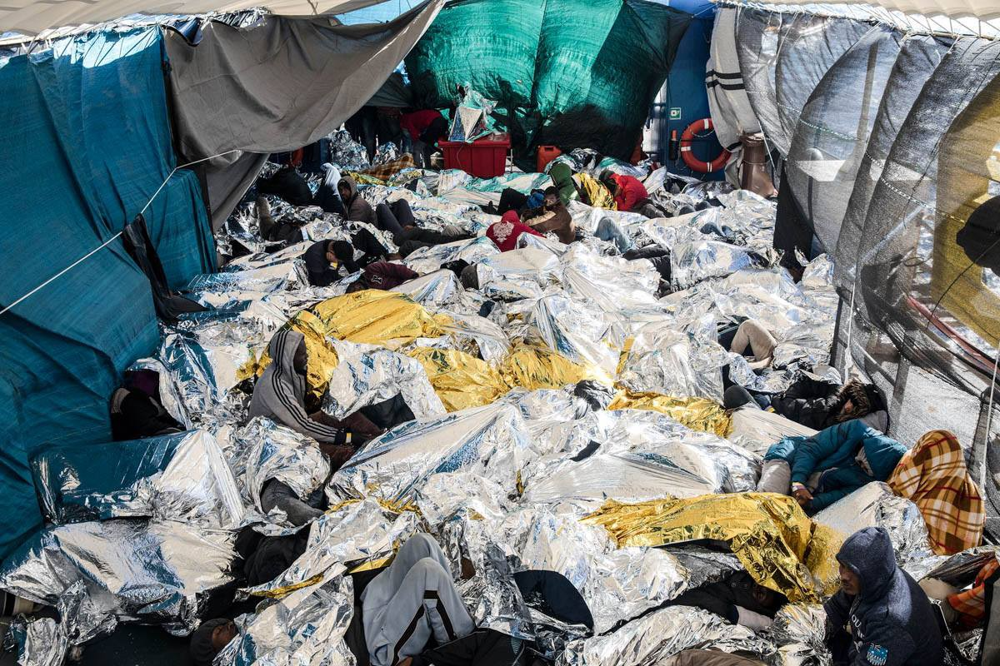
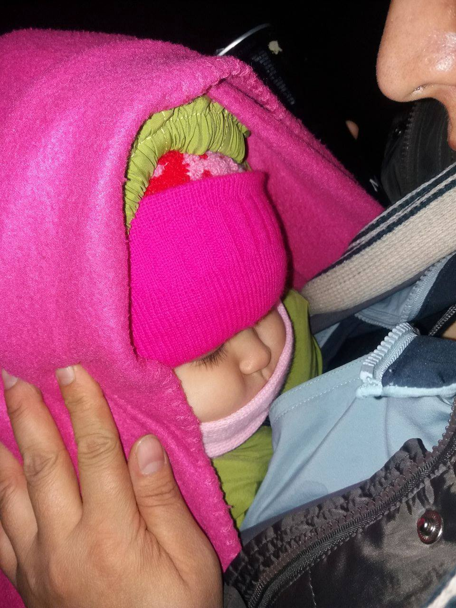
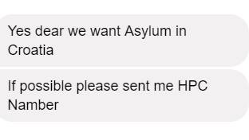

### AYS DAILY DIGEST 13/2/2018: More victims at the gates of Europe

Tragedy at Evros River // Help needed in Greece // More people died in Mediterranean this year than last year in the same period or time // At least 20 people have died in the past two years while trying to cross from Italy to France // More people arriving to Bosnia daily, but the borders are closing

Mediterranean Sea, 17 January 2018\. Refugees try to get warm after being rescued by SeaWatch3 rescue boat from an overcrowded wooden boat, 34 miles north of Libya\. Photograph by Giuseppe Carotenuto
### Feature

Another tragedy at the EU borders\. According to [media reports](https://www.dailysabah.com/turkey/2018/02/13/3-killed-7-missing-after-migrant-boat-capsizes-on-river-between-turkey-greece) , a woman and two children died and four people remain missing after a boat capsized in Evros River while trying to cross from Turkey to Greece\. The boat was found after nearby residents heard yells and informed the local gendarmarie forces\.

One child was around 12, and the other four, according to local sources\.

The EU borders are sealed since the deal with Turkey at the end of March was put into place\. This deal, even though it has taken many lives and left tens of thousands of people trapped in limbo, is still considered as a success story in Brussels\. It is a success merely because it has reduced the number of people coming to the EU\. Many people who are “victims” of this agreement are at the same time victims of wars who are searching for safety\. The other are people who are leaving their homes, often not happy to do so — rather, they are forced to do so in order to survive\. They dream about Europe\.
### Sea

■■■■■■■■■■■■■■ 
> **[SALVAMENTO MARÍTIMO](https://twitter.com/salvamentogob) @ Twitter Says:** 

> > Aviso pateras en el Estrecho. Guardamar Calíope y  Helimer 220 movilizados. La Calíope rescata patera con 11 varones subsaharianos. Otra patera con 30 personas llega a la playa del Palmar (Conil) y otra con 9 es rescatada por Marruecos. https://t.co/iEa7G5e81F 

> **Tweeted at [2018-02-13 11:19:54](https://twitter.com/salvamentogob/status/963372151041650694).** 

■■■■■■■■■■■■■■ 

Since the beginning of the year, 8,154 people entered Europe by sea, [according to IOM](https://www.iom.int/news/mediterranean-migrant-arrivals-reach-8154-2018-deaths-reach-401) \.

Out of this number, Italy received 4,731 people\. Official sources in Greece are reporting that over the course of four days \(7–10 February\), the Hellenic Coast Guard encountered at least two incidents requiring search and rescue operations off the island of Lesvos and Samos\. The Coast Guard rescued 74 people and transferred them to those islands\. So far this year, 1,729 people have arrived on Greek shores\.

In Spain, officials recorded the arrival of 1,683 people\.

At the same period of time, 401 people died while trying to reach Europe — an increase from 2017, when 261 deaths were recorded over the same period of time\.
### Greece

35 people arrived on Lesvos last night\.

[Dentists, Assistants are needed](http://www.healthpointfoundation.org) on Lesvos from 26th February\.

From the organization Health Point Foundation: “Things are now moving very fast on ground and there are thousands of men women and children who need your skills and care to relieve them of dental pain\. We are ideally looking to take on volunteers who have been with us before for this first round of clinics as the experience you’ve had will help with what we feel will be a particularly challenging start\- but please still do apply even if you have not attended with us before and you will be seriously considered for this opportunity to truly get stuck in with helping the project behind the scenes\.”

Email dental@healthpointfoundation\.org to start the registration process\.
### Italy

The European Court for Human Rights will ask the Italian Government about the [treatment of minors at hot spots](http://www.meltingpot.org/Minori-stranieri-trattenuti...) \. Their investigation comes after activist groups reported several incidents in hot spots\.

“Detained for days without a written communication, in a promiscuous situation with adults, under one single tent surrounded by high metal fences, checked by Italian soldiers, no possibility of contact with the outside world, no information received on how or why to apply for international protection by the police staff nor the NGO responsible for cultural mediation nor the UNHCR\. These were the conditions under which lawyers of ASGI \(Association for Juridical Studies on Immigration\) found 14 minors from Bangladesh, Côte d’Ivoire, Gambia, Ghana, Guinea, Mali, Senegal, detained in the hotspot of Taranto in July 2017\.”

On January 19th, the CEDU asked the Italian Government to clarify the situation in regards to these violations by May 14th\.

“The request for clarifications from the European Court of Human Rights to the Italian Government is an important result to counter the serious lack of protection and the disturbing picture of the child’s lack of protection that we found in the center of Taranto \[…\] however the whole system of the so\-called hotspots is to be re\-considered \[…\] \.”

[MSF publishe](http://www.infomigrants.net/.../border-rejection-violence...) d a report showing that refugees have suffered violent pushbacks while attempting to cross the border from Italy into France/Austria/Switzerland\. At least 20 people have died in the past two years in the attempt to make the crossing\.
### Bosnia and Herzegovina

There are no official data on the number of refugees who are in Bosnia and Herzegovina now, but it is easy to notice that all over the country there are more and more people\. Most of them are heading toward the north of the country, but also south, trying to reach Croatia\. Nevertheless, Croatian police are pushing them back or sending them according to the agreement about readmission between the two countries\. 
Officially, last year about 100 people were returned in this way\.

According to information obtained by AYS, this week Bosnian police started pushing people back to Serbia and Montenegro, which has not been happening up until now\. We also received reports about police violence at the border with Montenegro\.

Officials are claiming that most of the people in Bosnia are from Turkey and Kosovo, but volunteers on the ground are in contact with people from Syria, Morocco, Algeria, Afghanistan…
### Croatia

On Monday night, another Afghan family with small children contacted AYS from the freezing forest in Croatian territory near the Serbian border \(Šid\), asking for help in requesting asylum\.

They told us that their children are sick\. In the morning, the mother was transported to Vinkovci hospital because of loss of consciousness, and after that, she and other family members were taken by the border police to the policce station at Bajakovo border crossing\.

AYS volunteers were on the spot and talked to the police, but did not get access to the family\. It was said that the Red Cross of the town of Županja provided assistance to the family and that they would be transferred to Tovarnik transit center\. From there, the family would supposedly go to Zagreb reception center in Porin if they request asylum, or be forced to leave the country if they don’t\.

Police is claiming that they have not applied for asylum, but the family has clearly stated in their messages to AYS that they want to apply for asylum in HR\.

We also sent an email to the Police of Vukovar\-Syrmium County, RC Županja and UNHCR Croatia to check whether the family had the opportunity to seek international protection in the Republic of Croatia and were given all the necessary information about their rights, given that the family of the deceased Madina Hussiny were told that ‘the asylum centers in Croatia are full’\.

On Monday afternoon, police informed AYS that after the family was kept in the police station at the border crossing Bajakovo for more than 24 hours, they asked for asylum and will be transferred to Porin\.

We believe that this case has not culminated in another push\-back \(like the case of the family last week\) largely because our volunteers were present in the field and we contacted the police regularly with proof that family wanted to ask for asylum in Croatia\.

Last night we had a similar call from a family with a pregnant woman and 7 children who were stuck walking towards a town with a police station, in the middle of the night, asking for someone to support them while visiting the local precinct so they could be sure they wouldn’t be pushed back to Serbia\. We managed to contact our volunteer friend from the area, who was able to escort them to the police this morning\. So far they’ve been in questioning and we hope everything turns out for the best\. 
Although we don’t normally work in this way and don’t have the capacity to accompany everyone in their quest for international protection as we are not permanently present in that part of the country, in these two cases \(after numerous attempts to reach organizations normally in charge of such activities\), we were compelled to do so in order to try to protect these vulnerable people in serious circumstances and we will always try to do so — because people come first\.
### France

Paris update from the ground:

The situation has been calmer in the last 3 days since the big cold snap… the emergency calls made many groups go out and distribute to the people on the street, so anyone who wasn’t taken to shelter \(the majority still\) was well covered\. Volunteers have been promoting cleaning and recovering aid that we will wash and redistribute again\. The weather has improved a bit but it’s still cold and snows occasionally\. There are still people in shelters but with the better weather conditions we expect everyone to come back to the street soon\.
### Finland

UNHCR [sharply criticized](https://yle.fi/uutiset/osasto/news/unhcr_criticises_finland_over_repatriations/10072533) Finland for increasingly relying on ‘internal flight’ in its asylum decisions\.

Also known as internal relocation, the concept is that a person who might otherwise have the right to asylum may receive a negative decision if the Finnish Immigration Service \(Migri\) decides that he or she can be safely returned to a different part of their home country\.

Finnish authorities have adopted stricter asylum policies since the [sudden influx of asylum seekers](https://yle.fi/uutiset/osasto/news/total_of_32478_asylum-seekers_in_2015/8566544) in late 2015, most of them from Iraq and Afghanistan\. As a result, a larger proportion of asylum seekers have received negative decisions on their applications\. While in 2015 it was still relatively simple for Iraqis to gain asylum in Finland, the situation had changed dramatically by mid\-2016\.

In June of that year, 77 percent of Iraqi applicants were rejected, compared to 13 percent a year earlier\.

“The fact that we began increasingly using internal flight solutions led to a rise in the number of negative decisions,” says Jorma Vuorio, head of the Interior Ministry’s migration department\.

In practice, this means that Migri may first decide that an asylum seeker meets the criteria for international protection\. But it may then decide that the individual could settle down somewhere else in their country of origin and on that basis hands down a negative decision\. Finland’s Supreme Administrative Court has already ruled that Migri acted improperly in one such case\.

According to Vuorio, there is often one part of a war\-torn country where it is safe for people to return to, even if they come from an unsafe area\. He sees no problem in such decisions, although he is aware that Finland has been criticised for them by the UNHCR and others\.

“That is of course the UNHCR’s view of the matter but their view is not binding\. They put together valuable country surveys that map out the security situation\. But they are just part of the overall decision\-making process,” says Vuorio\.

Thomas Bergman, a legal officer at the UNHCR’s Regional Representation for Northern Europe in Stockholm, says that his organisation has long been concerned over the situation in Finland\. He says the UNHCR has an exceptional position as an expert on refugee law\.

“We see in statistics that Finland increasingly applies internal flight in its decisions, especially regarding Iraq and Afghanistan\. This concerns us, and we have raised the issue with the Finnish authorities,” he told Yle’s Swedish\-language news\.

Katja Creutz, a senior research fellow at the Finnish Institute of International Affairs, also says that these concerns should be taken seriously\. She notes that French courts, for instance, have decided [not to hand over asylum seekers](https://yle.fi/uutiset/osasto/news/french_court_questions_finnish_asylum_policy/10067871) to Finland or other Nordic countries sunder the EU’s Dublin Regulation because of the risk of potentially dangerous repatriation\.

In Bergman’s view, there are clear stipulations as to when one can use internal flight in the asylum process — and the UNHCR is worried that Finland is not following these rules\.

Finaly, we share a call for peace by an activist from Syria\.

“Join hands with me and say: ‘It’s enough\. Stop the war\.’

Let’s spread peace in this world\.

The oppressed people need you\. Lend them your voice\.”

#### We strive to echo correct news from the ground through collaboration and fairness\.

> **_Every effort has been made to credit organizations and individuals with regard to the supply of information, video, and photo material \(in cases where the source wanted to be accredited\) \. Please notify us regarding corrections\._** 

> **_If there’s anything you want to share or comment, contact us through Facebook or write to: areyousyrious@gmail\.com_** 

_Converted [Medium Post](https://medium.com/are-you-syrious/ays-daily-digest-13-2-2018-more-victims-at-the-gates-of-europe-97d954be5ae0) by [ZMediumToMarkdown](https://github.com/ZhgChgLi/ZMediumToMarkdown)._
