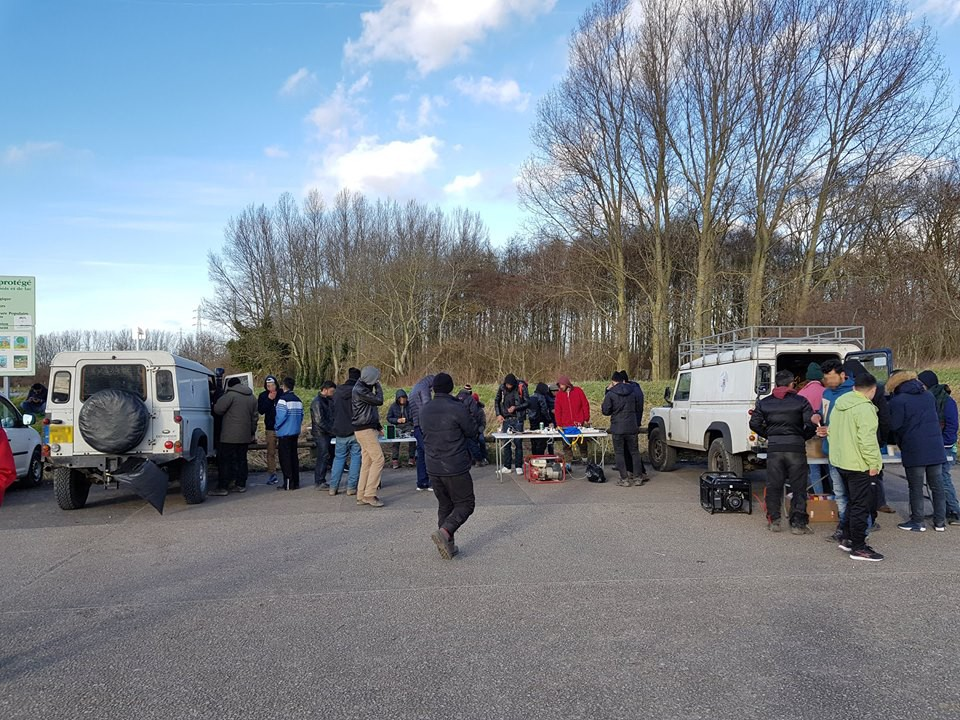

### AYS DAILY DIGEST 14/2/2018: We are a welcoming Europe, let us help

_New law targeting NGOs proposed in Hungary / Evros river takes lives of two young children / New AMKA law directions for public services / New family support center near Vial, Chios / Updated AIDA country reports / and more_

 has hundreds of blankets on board\. 350 of them were used in the last mission alone, now they have to be professionally cleaned\. You can help them out [here](http://sea-watch.org/spenden) \. Photo by Sea\-Watch](assets/fb6956485b34/1*K-7jpcg-6wpfHA-9MKD5iA.jpeg)

In order to keep people reasonably warm after rescuing them, [Sea\-Watch](https://twitter.com/seawatchcrew) has hundreds of blankets on board\. 350 of them were used in the last mission alone, now they have to be professionally cleaned\. You can help them out [here](http://sea-watch.org/spenden) \. Photo by Sea\-Watch
#### FEATURE

The legislative package proposed to the Hungarian Parliament last night requires national security clearance and a government permit for **NGOs** that “support migration”, [Amnesty warns](http://www.amnesty.eu/en/news/press-releases/all/hungary-new-law-poses-existential-threat-to-ngos-1101/#.WoShIiXwa02) about a new dangerous law threatening **Hungary** \-based organizations\.

“This law would give the government _carte blanche_ to target NGOs on the flimsiest of pretexts\. In reality, these proposals have nothing to do with protecting national security or borders, and everything with muzzling those who work to assist people in need and dare to raise their voices” [said](http://www.amnesty.eu/en/news/press-releases/all/hungary-new-law-poses-existential-threat-to-ngos-1101/#.WoShIiXwa02) Amnesty International’s Gauri van Gulik\.

The law would require NGOs to obtain the authorization of the Minister of Interior to perform basic functions, including campaigning, organizing networks and recruiting volunteers\. The Minister would then involve national security services for security clearance\. This procedure would possibly take up to nine months while organizations that fail to meet the requirements would be seriously fined \(up to 5,800 Euros\) \.

The point of this law is obviously to interfere with aiding refugees and asylum seekers and additionally aggravate the work of NGOs\. The Hungarian government has in the past accused organizations working with refugees of breaking the law\. Human Rights Watch’s Todor Gardos recently [said](https://www.hrw.org/news/2018/01/20/hungarys-government-strengthens-its-anti-ngo-smear-campaign) regarding a “Stop Soros” draft law that aims to stop foreign funding for organizations helping refugees:

_“…even if the bill never becomes law, it can serve a different purpose — to stir up anti\-immigrant sentiment and mistrust against NGOs critical of the government’s stance on immigration and other issues…”_

At the same time, the organizers of European Citizens’ Initiative [called on the European Commission](http://europa.eu/rapid/press-release_IP-18-746_en.htm) today to _“_ support local groups that help refugees… stop governments punishing volunteers… defend victims of exploitation, crime and human rights abuses\.” Their ‘We are a welcoming Europe, let us help\!’ initiative will be registered tomorrow \(February 15\) \. It allows one million citizens from at least one quarter of EU Member States to invite the European Commission to propose a legal act in areas where they have the power to do so\. See more about their initiatives [here](http://ec.europa.eu/citizens-initiative/public/initiatives/ongoing/details/2015/000005) \.
#### TURKEY

Three boats \(two inflatable, one fiber\) were stopped yesterday by the Turkish Coast Guard off the coast of Izmir and Aydin, carrying 44, 61 and 5 people — mostly Syrians\.
#### GREECE
#### Update on yesterday’s capsized boat

After a boat with 8 to 10 people sank in the freezing waters of Evros river in northern Greece [yesterday](ays-daily-digest-13-2-2018-more-victims-at-the-gates-of-europe-97d954be5ae0) \(Tuesday\) morning, the bodies of two young children and one woman were found on the Turkish side of the river today\. The children were 4 and 5 years old, while the woman was about 30 years old, newsbomb [reports](http://www.newsbomb.gr/ellada/news/story/860906/tragodia-ston-evro-dyo-paidia-3-kai-5-eton-anasyrthikan-nekra) \.

Two people had managed to swim to the Turkish shore and ask for help\. The others are still missing\.

There are some new important law [directions](http://www.immigration.gr/2018/02/3154796622018.html?m=1) for public services, after issues occurred for editing the AMKA social security number in Greece\. Basic clarifications are: 
\- Asylum application/pre\-registration/asylum card or residence permit recognised as I\.D\. for refugees/immigrants
\- No need for someone to already have a job to get an AMKA 
\- No need for proof of address, just declaration of it as communication data for the service

In the past the AMKA social security number has been denied to refugees and asylum seekers, often requiring a work contract to be issuedfirst\. This has caused serious difficulties for people needing to access to health services\.
#### Chios

A new family support center “House of People” opened today near the Vial camp\. They were able to welcome 11 families, a total of 50 people with approximately 30 children\. All of them, parents and teenagers included, had the chance to get a set of winter warm clothes as well as a hygiene kit \(diapers, shampoo, nappy cream, soap, toothbrushes, toothpaste, face towel, washing powder, razors, deodorant, sanitary pads, wet wipes, comb\) and if/when needed, a sleeping bag, a milk bottle and a dummy, [Chios Eastern Shore Response Team](https://www.facebook.com/groups/421759534684819/permalink/749474018580034/) wrote\.

Photos of the new center by the CESRT volunteers

Language classes at [Orange House](https://www.facebook.com/zaatarngo/) in central Athens:

#### BULGARIA

The updated [AIDA Country Report](http://except for Vrazhdebna shelter in Sofia) on Bulgaria documents persisting obstacles to refugees’ access to a fair asylum procedure and dignified reception conditions, despite a substantial drop in the number of arrivals and asylum applications registered in the country\.

Some nationalities, including people from Algeria, Bangladesh, Pakistan, Sri Lanka, Turkey and Ukraine are discriminated against during the asylum procedure, with 0% recognition rate\. Interpretation and appropriate communication in the language preferred by the applicant is often not available during registration and eligibility interviews\. Living conditions in the reception centres remain poor or below the level of minimum standard, except for Vrazhdebna shelter in Sofia\. There is also still no working integration plan\.
#### SWITZERLAND

The updated [AIDA Country Report](http://www.asylumineurope.org/sites/default/files/report-download/aida_ch_2017update.pdf) on Switzerland documents developments in the asylum procedure, reception conditions, detention and content of international protection throughout 2017\. As part of the restructuring of the asylum procedure that comes into force next year, the State Secretariat for Migration \(SEM\) has confirmed the implementation of another pilot phase of the accelerated procedure in the federal centres of Boudry \(canton of Neuchâtel\) and Chevrilles \(canton of Fribourg\) \. This new pilot project, based on the accelerated procedure already applied in Zurich, will start in April 2018\.
#### FRANCE

The Respite centre is a place where 50 young people from Mali, Chad, Guinée, Côte d’Ivoire, Afghanistan and Pakistan are awaiting their placement after seeking asylum\. 
Care4Calais attended a trilingual \(French, Arabic, English\) lesson there yesterday while bringing donations\. Their volunteers describe the young people there as extremely committed and resilient, so keen to learn or improve their French as they are trying to integrate into French society, especially knowing quite a few of them had never been to school in Western Africa\.

Photos by a Care4Calais volunteer

The last week has seen temperatures plummet once again, and although an emergency centre was opened in the Dunkirk area back in December, these centres quickly reach maximum capacity\. This leaves those unable to get a space outside slumped against the wall or left to retreat back into the surrounding woodland or ‘“jungle”, Mobile Refugee Support [writes](https://www.facebook.com/MobileRefugeeSupport/posts/713921812146766) \.

They are inviting people willing to volunteer on the ground with them to contact them [here](https://www.mobilerefugeesupport.org/volunteer/) \.

Photos by MRS
#### We strive to echo correct news from the ground through collaboration and fairness\.

> **_Every effort has been made to credit organizations and individuals with regard to the supply of information, video, and photo material \(in cases where the source wanted to be accredited\) \. Please notify us regarding corrections\._** 

> **_If there’s anything you want to share or comment, contact us through Facebook or write to: areyousyrious@gmail\.com_** 

_Converted [Medium Post](https://medium.com/are-you-syrious/ays-daily-digest-14-2-2018-we-are-a-welcoming-europe-let-us-help-fb6956485b34) by [ZMediumToMarkdown](https://github.com/ZhgChgLi/ZMediumToMarkdown)._
