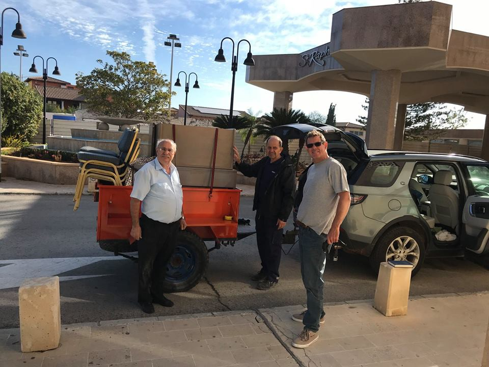
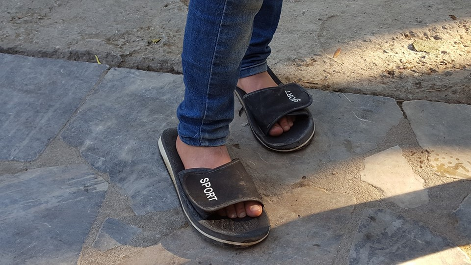
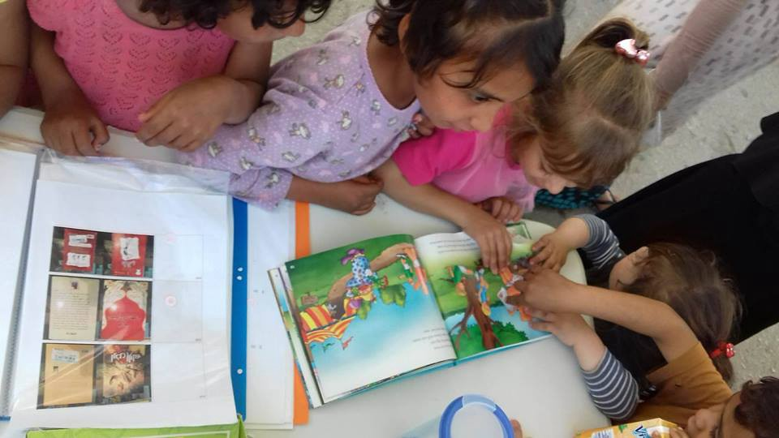
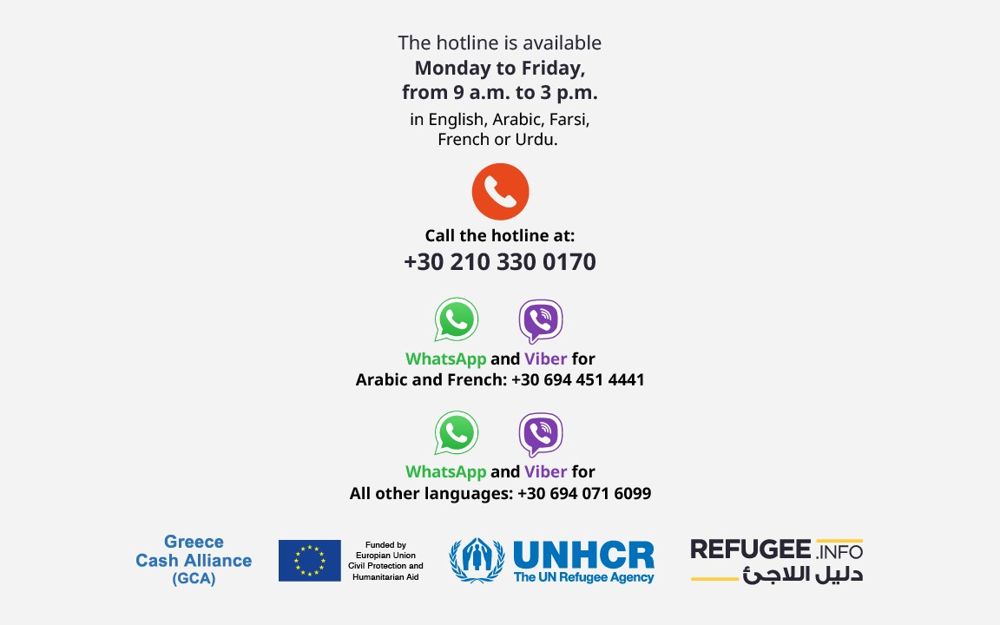

### AYS DAILY DIGEST 16/2/2018: The money and the aid

_How the EU prioritizes its funding for Africa / New cash card provider in Athens / Sharp increase of people arriving in Boasia / UN and CoE slam Hungary over “Stop Soros” law / Donations and volunteers needed in Greece, Serbia and Belgium / And more…_
### Feature: The money and the aid

](assets/e3677a98fd61/1*Xkq-_gcHWZlqHa5x82kTbw.jpeg)

Credits: [MAM Beyond borders](https://www.facebook.com/MAMbeyondborder/photos/a.563901896989517.1073741828.563881680324872/1806700572709637/?type=3&theater)

Announcing funds to support people in need might sound like a useful thing\. In reality, this has often proven to be the opposite, with dubious people/groups benefiting from the money, which does not reach the people in need\. Greece is sadly just one [good and visible example](https://www.theguardian.com/world/2017/mar/09/how-greece-fumbled-refugee-crisis) of this; up to 75 out of 100 Euro are said to be misused there\.

When the number of people arriving in Europe increased sharply, the EU promised to tackle the causes of flight and fight smugglers, who were guiding people in need to dangerous routes\. Therefore it has set up the “EU Emergency Trust Fund for Africa” \(EUTF\) with a budget of 4\.3 billion Euros, what is far more than the 405 million Euros disbursed as of December 2017 for Greece as emergency funding\.

As Deutsche Welle has now discovered, in the EUTF there is a big gap in funding between the people in need and their countries of origin\. This means that the countries which most of people leave — such as Nigeria, Eritrea or Somalia — are not the ones that receive the most money/aid under the fund\. Ethiopia, Mali, Niger or Libya, which can be considered as transit countries, are the ones that get the most funding\. “The country most in need of EU funds to fight the root causes of migration is far down on the list of countries actually receiving those funds”, the authors conclude\.

OK, one could say, if you cannot fight the causes of flight directly, help the neighboring country to host more people, so they do not need to continue a dangerous journey\. Indeed, DW says, investments to support a region financially and creating prospects can help to decrease migration\.

Now, it is important to have a look at the priorities of the funds\. With 32 percent, the “greater economic and employment opportunities” is the biggest topic\. But large amounts are also being spent on preventing people from [making their way](http://www.aljazeera.com/indepth/opinion/stop-migration-stop-abuse-africa-resources-180213114944137.html) to Europe or [tightening border controls](https://www.swp-berlin.org/fileadmin/contents/products/comments/2017C33_adt_kpp.pdf) \. By May 2019 the EU wants to resettle some 50,000 people — since 2012 more than 830,000 from African countries applied for asylum in the EU\.
### Cyprus

Volunteers of Cyprus Refugee Solidarity offer support for people in need\. They can provide clothing and footwear as well as transfers for people who are not residents of Kofinou from Larnaca to the store room in Aradipou\. Residents of Kofinou can use the distribution center in the camp, which is also supplied by CRS\. Starting next week, the team can also supply a limited selection for people who are setting up their homes\. Additionally, more volunteers are needed on the islands\. If you are in need or support or want to join the solidarity network on Cyprus, please get in touch with [Adam](https://www.facebook.com/adam.flude.7/posts/10215698453960502) on Facebook\.

Donated furniture\. Photo: Adam Flude
### Greece

Humans 4 Humanity has ran out of shoes these days\. “There is a severe shortage of men’s shoes on the island and our visitors are turning up in flip\-flops and flimsy broken sandals\. It’s been cold, rainy and the conditions in the camps are awful”, volunteer Leah Wild [states](https://www.facebook.com/leah.wild.106/posts/928170954008312) \. The next container is scheduled to arrive in one month and not before\. In order to buy more shoes directly in Mytilini, she has set up a fundraiser on [Paypal](https://www.paypal.me/bluedoorglobal) \.

All what’s left, flip\-flops\. Credits: Leah Wild

Also on Lesvos, an MSF team [vaccinated](http://www.dailymotion.com/video/x6euwxa) a total of 1314 children outside Moria and Kara Tepe in a new campaign this month\.

A Drop in the Ocean is creating a new space for workshops, a café and kids’ activties\. The venue is planned to open in a couple of weeks and will be accessible for residents of Moria, Kara Tepe, and people who have housing in Mytilini\.

52 people — 20 children, 12 women and 20 men — arrived on Samos this morning, according to A [egean Boat Report\.](https://www.facebook.com/AegeanBoatReport/) Meanwhile, the authorities have not yet registered the people who arrived on the islands y [esterda](http://mindigital.gr/images/prosfygiko/NSP_Eastern_Aegean_15.02.pdf) y\. A total of 52 people \(28 from Lesvos, 15 from Chios\) were transferred to the mainland, 5 Syrians were deported to Turkey and one voluntarily returned to his country of origin from Leros via the IOM programme yesterday\.

On Samos, Help Refugees and Samos Volunteers host a makeshift library in a pop\-up tent for the children living in the camp on Tuesdays and Thursdays\. “The project aims to give everyone the opportunity to become immersed in a story and experience the joys of reading a good book”, HR [says](https://www.facebook.com/HelpRefugeesUK/posts/567344003626277?hc_location=ufi) \.

Children enjoying some stories and escape the harsh reality on Samos\. Credits: Help Refugees
#### New Cash Card provider in Athens

The Catholic Relief Services \(CRS\) has taken over the Cash assistance programme for people living in private accomodation in Athens from the beginning of this month\. This means that Refugee\.Info is no longer available to submit registrations for the cash card\. All info and instructions can be found on Refugee\.Infos homepage in [English,](http://blog.refugee.info/cash-hotline/) [French,](https://l.facebook.com/l.php?u=http%3A%2F%2Fblog.refugee.info%2Fcash-hotline-fr%2F&h=ATNNfsr_ULD3TCUi5yfkEuqEEva3_piB2H5H4r6iiO2ZX-BtOaQYauzzPLR8KUIsa6BWcCmDjV7X2cws2M4wMjJu9YOAeOg6ee1Jg1e_DmtuHfBg17xAbsUkHKW76S-YsVrET_tzELHDp0IRVdopqGQpXQp5aZ0dAwQHh1ot-pLbhX5qQp3TGyH7H_fcTmC3rnGLKig4zqfA_KzMwNI7Au_lihaZU0TWBKcMC5qF3mE) [Arabic,](https://l.facebook.com/l.php?u=http%3A%2F%2Fblog.refugee.info%2Fcash-hotline-ar%2F&h=ATNAqTDq5eB5LvCg4jJv5AL66bQhOp1hU1rjx1-ozkWSs_tg0wF3Ku__65_w9Lw_ILSDWin3LXyxOjCZCTKR7I__oXkomgbkPZ6LOdDj7XRpEMLY_eYvoarajuDZEyJip30g2C1j01B_M54xGAs3i6N368U7R0cuuEHvyY9GRR_Z0VWYNPoDV60RSuLxDG1hGgkpOpyKKi0bT5HkkNVzcGwu5AEj1UC-tuxyPVOEaV8) [Farsi](https://l.facebook.com/l.php?u=http%3A%2F%2Fblog.refugee.info%2Fcash-hotline-fa%2F&h=ATO8-6zo6l8qiPeE4UjVYHhVh5z8yyGc2RUZKim2TLX6jDOHa8LNSH2nKU-w2pFE9NM8tCUEyO1YLD5vfzVy9XCVt55a5ZoIRK696eMwdnpeX2aviuUcWXYl7TCR4-xEO-lkwsTdj7TqPKo7JetTRcwDH25a735FnLfHbQ4gPnuZ44rMkG_PiRFlK0JNrML7DUp1Ja3hb2OAcq3sQOLmfCSd53rqNc2G4anTwydLB2w) and [Urdu](https://l.facebook.com/l.php?u=http%3A%2F%2Fblog.refugee.info%2Fcash-hotline-ur%2F&h=ATM-Z2Fv4NbfCYiqIHglTpbS3gtBBaY43DrNVLHL5Oa7uqeOkrgkkuNZHuHxfc1Q20wNvzCf-9L8vyMKWcgU4bmP46soLHemMp8f3aGY2XrA7YHQzpUCMxt4SaVk7OAClB3TrwGu-mTqwVBiBxe6cGOi0r0rMs1enRvkOHrTPjSFx7c68Ez0OAW606XUTex4BvGrtWStkdsWDdeKyxgmR7r-JBoft-AYyW0pVX7vO4w) \.

The hotlines\. Credits: Refugee\.Info

The Mobile Info Team for refugees in Greece has published two important updates today\. One explaining [how to get birth certificates](https://www.facebook.com/mobileinfoteam/photos/a.1800063030222418.1073741830.1796286800600041/2118015988427119/?type=3&theater) in Greece and the other one informing about the [new Skype schedule of the Greek Asylum Service to apply for international protection](https://www.facebook.com/mobileinfoteam/posts/2123094001252651?hc_location=ufi) \.

NoBorders [reports](https://twitter.com/refugees_gr/status/964441697890521088) that a man from Albania hanged himself in a police station in Kissamos in the North\-West of Crete\. The 54\-year\-old man was arrested one week ago for not having a residence permit and was in the deportation process\. NoBorders has stated that the officers did not reach the man in time to prevent his death\.

The Greek Asylum Service published statistics for January, showing that every third person is between 0 and 17 years old and therefor a minor\. A total of 4752 people asked for international protection in the first month of 2018, mainly on Lesvos followed by Samos, Attica and Thessaliniki\. The main nationality remained Syrians \(1213\) and Iraq \(528\) \.

### Sea

At least four boats, carrying more than 130 people, have been rescued in the Alboran sea\.

■■■■■■■■■■■■■■ 
> **[IOM - UN Migration 🇺🇳](https://twitter.com/UNmigration) @ Twitter Says:** 

> > Breaking: 8,407 #migrants &amp; #refugees arrived by sea to Europe. 

404 dead/missing. Learn more ➡️ [missingmigrants.iom.int](http://missingmigrants.iom.int) https://t.co/oYbtfmMg5L 

> **Tweeted at [2018-02-16 09:07:31](https://twitter.com/unmigration/status/964426002951675907).** 

■■■■■■■■■■■■■■ 

### Serbia

[The Refugee Language Initiative](https://www.facebook.com/TheRefugeeLanguageInitiative/posts/579945019009113) is calling for voluntary English teachers in Serbia, who can commit for at least one month\. Subsidized housing and transport to the camp can be provided\. Additional skills are Farsi, Arabic, Serbian, German, music, STEM and sport an advantage\. Interested volunteers can contact ehammock@refugeelanguageinitiative\.org
### Hungary

The “Stop Soros” law \(we [reported](ays-daily-digest-15-02-18-where-do-the-legal-procedures-and-corridors-take-people-dd5f8ccdd10c) \) has been criticized by the UN as well as the Council of Europe\. The EU Observer quotes Rupert Colville, the UN Human Rights spokesman, [slamming](https://euobserver.com/tickers/141011) it as an assault on human rights: It would be “an unjustified restriction on the right to freedom of association”\. Nils Muiznieks, human rights commissioner at the CoE, also [expressed](https://euobserver.com/political/141004) his concerns, saying the law could “aggravate the situation of freedom of association in Hungary even further”\.

■■■■■■■■■■■■■■ 
> **[ECRE](https://twitter.com/ecre) @ Twitter Says:** 

> > 🇭🇺@[CommissionerHR](https://twitter.com/CommissionerHR) concerned at proposed legislative package; @refugees, @[AmnestyUK](https://twitter.com/AmnestyUK) call on HU Parliament/gov' to withdraw the bill: [bit.ly/2F5RfyA](http://bit.ly/2F5RfyA),  [bit.ly/2C1X9lt](http://bit.ly/2C1X9lt), [bit.ly/2BAJi4y](http://bit.ly/2BAJi4y) |
Translation of the #LexNGO2018 @[hhc_helsinki](https://twitter.com/hhc_helsinki) [bit.ly/2sxZzEy](http://bit.ly/2sxZzEy) https://t.co/l7JbaMyRHd 

> **Tweeted at [2018-02-16 12:56:05](https://twitter.com/ecre/status/964483521346719746).** 

■■■■■■■■■■■■■■ 

### Bosnia and Herzegovina

During the past weeks, and just [yesterday](ays-daily-digest-15-02-18-where-do-the-legal-procedures-and-corridors-take-people-dd5f8ccdd10c) , AYS has highlighted the increasingly worrying situation in the country\. According to immigration office staff, the majority of people entering the country from Serbia and Montenegro are Syrians, Afghans and Algerians, [InfoMigrants](http://www.infomigrants.net/en/post/7592/number-of-migrants-rising-significantly-in-bosnia?ref=tw) reports\. While in the whole of 2017 the number of people registered as entering the country was 754, this year it has already reached 458\.
### France

A new asylum law for France is in preparation which will be presented on 21 February, InfoMigrants [reports](http://www.infomigrants.net/fr/post/7585/greve-a-l-ofpra-on-porte-atteinte-au-droit-d-asile-en-faisant-passer-les-demandeurs-pour-de-potentiels-fraudeurs) \. The law includes a plan to shorten the processing time of classical asylum procedures from 90 to 60 days as well as speeding up the process and Dublin deportations\. The OFPRA, the department where asylum requests are processed, wants to strike on 21st February as a protest against the planned law\. They say that the law treats all refugees as potential scammers, and that they are afraid that the number of “accelerated” procedures will increase\. An accelerated procedure means that the processing time is only 15 days, and that this is hardly enough to hear and thoroughly investigate asylum requests\. Refugees with appointments on 21st February will receive a new appointment\.

The two people who were forcibly taken into custody over the P8 occupation [returned](https://www.facebook.com/1943620965956299/photos/a.1943636545954741.1073741828.1943620965956299/1950850261900036/?type=3&ifg=1) to the squat today\.

C\-N\-R [reports](https://www.facebook.com/collectif.pour.une.nation.refuge/posts/372951956513983?hc_location=ufi) that two infants have been detained at Rossy Airport in Paris today, the backgrounds or more details are not known yet\. A legal representative is with them\.

[L’Auberge des Migrants](https://www.facebook.com/AubergeMigrants/posts/10155819248890339?hc_location=ufi) has set up a new place to store and cut wood \(mainly from pallets\) which is then distributed to refugees around Calais living outdoors\. Refugees are very happy about the wood to make fires to keep warm\. The police is occasionally extinguishing the fires, but not systematically\.

### Belgium

Volunteers in Brussels are asking for donations, including hygiene products, clothes, bags and sleeping bags\.

### Sweden

Around 30 CEOs of prominent companies have criticized the government in an open letter for deporting highly\-skilled workers\. The companies needed to “hire globally” and cannot “expect engineers, IT\-technicians, and other specialists to leave their countries if they risk expulsion from Sweden for unpredictable reasons”\. According to [TheLocal](https://www.thelocal.se/20180216/stop-deporting-skilled-migrants-swedish-ceos-say) , the migration agency recently refused the extent work permits of foreign employees due to strict laws\.

The companies are totally right in their statements\. But it should be added that not only highly skilled workers should not be deported to their country of origin\. Also people fleeing war, persecution, natural disasters or poverty have a right to find international protection, education and work\. Hence it is not only important to import skilled workers, but also to enable more people to access the health, educational, social and labor systems\.
### EU

> **_We strive to echo correct news from the ground through collaboration and fairness\._** 

> **_Every effort has been made to credit organizations and individuals with regard to the supply of information, video, and photo material \(in cases where the source wanted to be accredited\) \. Please notify us regarding corrections\._** 

> **_If there’s anything you want to share or comment, contact us through Facebook or write to: areyousyrious@gmail\.com_** 

_Converted [Medium Post](https://medium.com/are-you-syrious/ays-daily-digest-16-2-2018-the-money-and-the-aid-e3677a98fd61) by [ZMediumToMarkdown](https://github.com/ZhgChgLi/ZMediumToMarkdown)._
