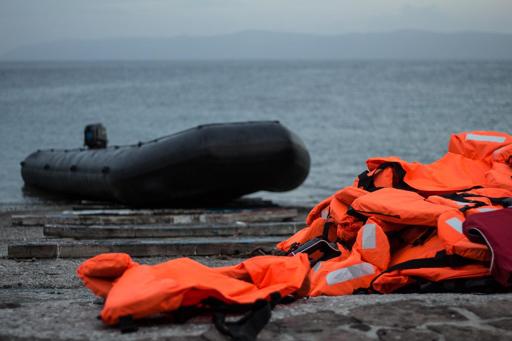
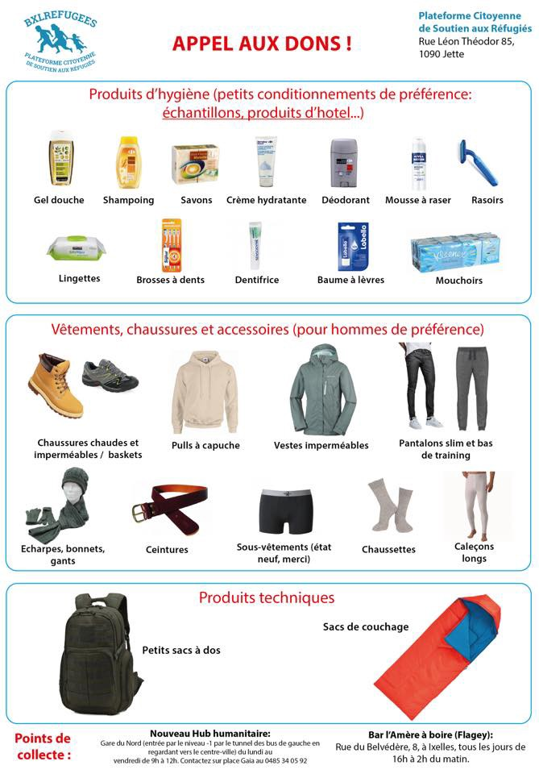

### AYS Daily Digest 17/02/18: Children denied school on the Greek islands

_Seven die in river crossing//TCG intercepts boat//Sea rescues//Guide for refugees in Bulgaria//New arrivals and donation needs in Paris//March against deportations in Hamburg//and more…_

](assets/17c148c899ff/1*6sscDfm59Kk7aqKmyjIqjg.jpeg)

Photo Credit: [Refugees Welcome International](https://www.facebook.com/refugeeswelcomeinternational/?hc_ref=ARRObqVkd_2NXUQwJ9i1WR-Qy0EsWW_7ndmZBDj0TNYmC4X_GhaoyQaupxMLojrg6a8&fref=nf&hc_location=group)
### Greece

Earlier this week, Greek migration minister Mouzalas \(nicknamed the “muzzler of human rights” by rights activists\) absurdly proclaimed the success of Greek efforts to integrate refugee children into local schools\. His self\-congratulations are misplaced given the fact that **only 10 children in total are attending Greek schools on all of the Aegean islands** \. In the absence of formal education, NGO’s and volunteer groups have worked to fill the gaps with schooling programs\. These programs, while often led by people with good intentions, are no substitute for formal education as they can be intermittent and haphazard\. For example, before they pulled out of the Aegean hotspots, the Save the Children NGO was known to host school for only half an hour a day in some of their locations\.

Today the [Refugee Support Aegean](http://rsaegean.org/majority_of_refugee_children_in_the_aegean_islands_hot_spots_are_excluded_from_education/) NGO released a report on the lack of school for refugee children on the Greek islands\. From their [report](http://rsaegean.org/majority_of_refugee_children_in_the_aegean_islands_hot_spots_are_excluded_from_education/) :

> Despite government announcements that they will ensure access to education for all refugee children living in Greece, the majority of the children living in the Aegean islands Hot Spots, have no access to formal education\. These include, amongst others, children of families who have been trapped for many months in these camps and live in deplorable conditions\. These children remain until today deprived of the right to education\. 

> The current lack of access of refugee children to formal education accentuates the pre\-existing problems of discontinued education or illiteracy\. At the same time, this continued lack of access to education creates significant problems and difficulties for refugee families, as it increases further social inequality and strengthens already existing racist stereotypes\. 

Seven people are believed dead after a boat sank on the Marista River near the Greek\-Turkish border\. Three bodies were found by rescue teams after the dinghy sank, two of whom were children\. The boat was carrying eight people and only one person is believed to have survived\. Among the dead were a couple with a young child from Turkey\. They had both worked as teachers in Turkey until they were detained on charges of being associated with the Gulen movement after the coup attempt\.

A group of volunteers are hosting a food event on Lesvos where refugee chefs will be collobarating with Greeks to showcase different dishes from their home countries\. More information [here](https://www.facebook.com/events/471051419957306/) \.
### Turkey

A boat was picked up by the Turkish Coast Guard \(TCG\) early Saturday morning after people on a rubber dinghy made a distress call\. The boat was intercepted on the coast of Sığacık, headed for Samos\. There were over 50 people aboard, many of them children\. The [Aegean Boat Report](https://www.facebook.com/AegeanBoatReport/posts/308139486375829) group wrote of the incident, “A rubber boat in this kind of weather wouldn’t stand a chance\. Why they went out is not clear, but people are desperate to leave Turkey\. Luckily no lives were lost this time\.”

The volunteer group “Empathy Makes us Human” based out of Izmir is calling for donations to continue their work with refugee children, and hold Turkish language classes, among other initiatives\. Link to donate [here](https://www.raklet.com/imece/Donations/Details/2bd52a5e-bdd9-4c5a-82ba-9a43a2a83fe1) \.
### Sea

Despite freezing temperatures and dangerous weather, people are still risking their lives in the Mediterranean to reach a place of safety\.

The [Maydayterraneo](https://www.facebook.com/MAYDAYTERRANEO/?hc_ref=ARToEpwmLSPKgDmi_BspfZOWM4pvflP0oJjtQto4GYuy-3pM8TBgprdEUF_k_Vu0OFU&fref=nf&hc_location=group) organization rescued 87 people off the coast of Tunisia, and reported 45 arrivals on the island of Lampedusa\.

The Moroccan Royal Navy intercepted a dinghy carrying 25 people which was headed towards the peninsula\. Twenty of the people on board were African, and five were Rohingya Muslims\. Reportedly the Rohingya people managed to get flights to Africa from India, and made the sea voyage from there\.

The Tunisian Coast Guard saved 48 people from a sinking boat off the coast of Sfax today\.

The [SMH](https://twitter.com/salvamentogob) rescue organization saved [62 people](https://twitter.com/salvamentogob/status/964956149601759232) from two boats today\.

■■■■■■■■■■■■■■ 
> **[Open Arms](https://twitter.com/openarms_fund) @ Twitter Says:** 

> > Dos barcos, dos realidades. Un viejo barco lleno de voluntarios zarpa con la misión de no dejar ni una sola vida a la deriva, de poner humanidad allá donde los gobiernos la niegan, frente al lujo más ostentoso.Todo en ese #Mediterraneo que tanto duele. https://t.co/vmzOkvJ4Do 

> **Tweeted at [2018-02-17 22:04:41](https://twitter.com/openarms_fund/status/964983970613153792).** 

■■■■■■■■■■■■■■ 

■■■■■■■■■■■■■■ 
> **[Missing Migrants Project](https://twitter.com/MissingMigrants) @ Twitter Says:** 

> > At least 576 children have lost their lives in the Mediterranean since 2014, but the real figure is likely to be much higher [bit.ly/2sz9jP4](http://bit.ly/2sz9jP4)  #MissingMigrants https://t.co/urmrS2R67F 

> **Tweeted at [2018-02-17 14:00:03](https://twitter.com/missingmigrants/status/964862008653963269).** 

■■■■■■■■■■■■■■ 

The [_Mo Chara_ Refugee Rescue](https://www.facebook.com/RefugeeRescueUK/?hc_ref=ARTFAJrIMu0WIRJo2pAX5BpDzQpTcaDrqOpckpGLpoecCFc_P6X9oblzdwSUnnLe2IY&fref=nf) organization put out a call for donations today\. Over the past month, they rescued 360 people from the Mediterranean\. You can find the donation button through the link above\.

Photo Credit: Refugee Rescue
### Serbia

In collaboration with the Rigardu volunteer group, the [No Name Kitchen](https://www.facebook.com/NoNameKitchenBelgrade/?hc_ref=ARTTkwjvTe-VXpg0-2NogAC0cVKDYVCoiRA-qar4wKfxmQSjV0M2e1Dw3Wf9a1RZxbQ&hc_location=group) group has created a new mobile shower system\. You can support their work [here](https://www.generosity.com/volunteer-fundraising/no-name-kitchen-serbia) \.

](assets/17c148c899ff/1*VYR0AY3L8qIDjbN0SbrY5g.jpeg)

Part of the mobile shower unit\. Photo Credit: [No Name Kitchen](https://www.facebook.com/NoNameKitchenBelgrade/?hc_ref=ARTTkwjvTe-VXpg0-2NogAC0cVKDYVCoiRA-qar4wKfxmQSjV0M2e1Dw3Wf9a1RZxbQ&hc_location=group)
### Bulgaria

The Refugee Info outlet has put out a guide for people who have been deported to Bulgaria\. The guide helps you understand your rights and provides a list of legal services in the country\. The guide is available in English, Arabic, Farsi, Urdu, and French \(go down to bottom right of the page to change languages\) \. Link [here\.](https://www.refugee.info/bulgaria/returned-to-bulgaria/returned-to-bulgaria)

](assets/17c148c899ff/1*CaC-tUhQbKUG1A8d6VAbxQ.jpeg)

A border fence in the Balkans\. Photo Credit: [Gabriel Tizon](https://www.facebook.com/gabrieltizonfotografo/?hc_ref=ARQuR_3ZdtV6BTjLjcELwH8wuuvISaQehgvEaASjHMyJEjmfPKjorYwHNhKpnAVUoHU&fref=nf)
### France

The [Paris Refugee Ground Support](https://www.facebook.com/PRGS.team/?hc_location=group_dialog) volunteer group has reported that there were over 65 new arrivals to an area in Paris where they have been assisting people\. Many of the newly arrived refugees are children\.

](assets/17c148c899ff/1*6sLjj-WHGgU1VhAfMNevcQ.jpeg)

Sleeping rough in Paris\. Photo Credit: [Paris Refugee Ground Support](https://www.facebook.com/PRGS.team/?hc_location=group_dialog)

Life is not safe on the streets of Paris, and this is no environment for children\. Today it was reported that at least [11 homeless people](http://www.revolutionpermanente.fr/11-SDF-sont-morts-dans-la-rue-a-Paris-depuis-janvier-a-qui-la-faute) have died on the streets of Paris this year\. France has promised additional facilities during especially cold nights, but far too many people in the city, both refugees and French homeless people, are still sleeping rough on the coldest of nights\.

New collection points for material donations have opened in Paris, where volunteers will be collecting hygiene products, clothing, backpacks, and sleeping bags\. Click [here](https://www.facebook.com/photo.php?fbid=574731402889368&set=a.113129339049579.1073741828.100010575392539&type=3&theater) for drop\-off points and item lists\.

There will be a demonstration in Paris on 20 February to support refugees who have been living in a squat near the Paris 8 University\. More information [here](https://www.facebook.com/events/181533945944274/) \.

Today a volunteer with Care4Calais shared his story of a night spent with some Iranian friends who have been sleeping in Northern France\. His story was a simple reminder that despite the media presentation of refugees as either threats to society or helpless victims, displaced people are simply ordinary people who have lived through extraordinary circumstances\. Today we are including his goofy photo of one of his friends as a reminder that refugees are people with agency and often a sense of humor\!

](assets/17c148c899ff/1*nYBq-aAORiYYFIU327z0BA.jpeg)

This is what a refugee looks like\! A young person who could have been me or you, had we been born under different circumstances, or enjoy putting chess pieces up our noses\. Photo Credit: [Care4Calais\.](https://www.facebook.com/care4calais/)
### Germany

Over 1,200 people marched in Hamburg today to protest the deportation of refugees\. The march was held specifically against deportations to Afghanistan, which the EU has deemed a “safe third country” despite the fact that over 10,000 civilians were killed in attacks in the last year there\. There is a large Afghan community in Hamburg, with an estimated 20,000 Afghanis living in the city\. A group of Afghan people are set to be deported this Tuesday from the Hamburg airport\.

Today German chancellor Angela Merkel [called upon the EU](http://www.ekathimerini.com/225941/article/ekathimerini/news/merkel-calls-for-progress-on-common-eu-asylum-system) to improve their common asylum system\. She cited the need of other countries to accept refugees if they are going to continue to receive EU funding\. Countries such as the Czech Republic and Hungary have refused to accept the quota of people seeking asylum\.

> **_We strive to echo correct news from the ground through collaboration and fairness\._** 

> **_Every effort has been made to credit organizations and individuals with regard to the supply of information, video, and photo material \(in cases where the source wanted to be accredited\) \. Please notify us regarding corrections\._** 

> **_If there’s anything you want to share or comment, contact us through Facebook or write to: areyousyrious@gmail\.com_** 

_Converted [Medium Post](https://medium.com/are-you-syrious/ays-daily-digest-17-02-18-children-denied-school-on-the-greek-islands-17c148c899ff) by [ZMediumToMarkdown](https://github.com/ZhgChgLi/ZMediumToMarkdown)._
