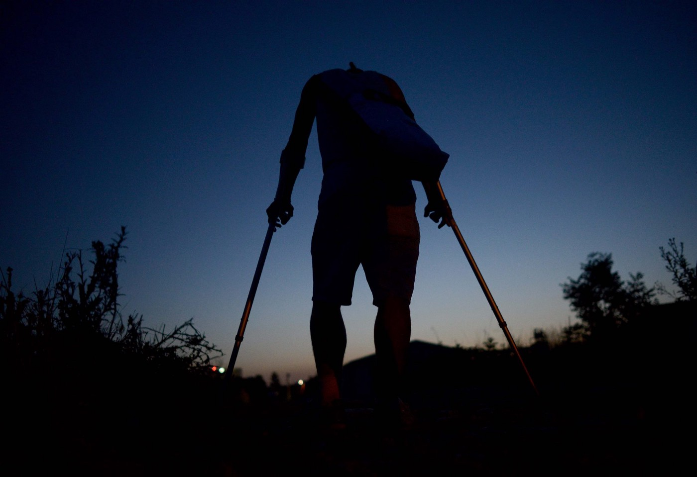
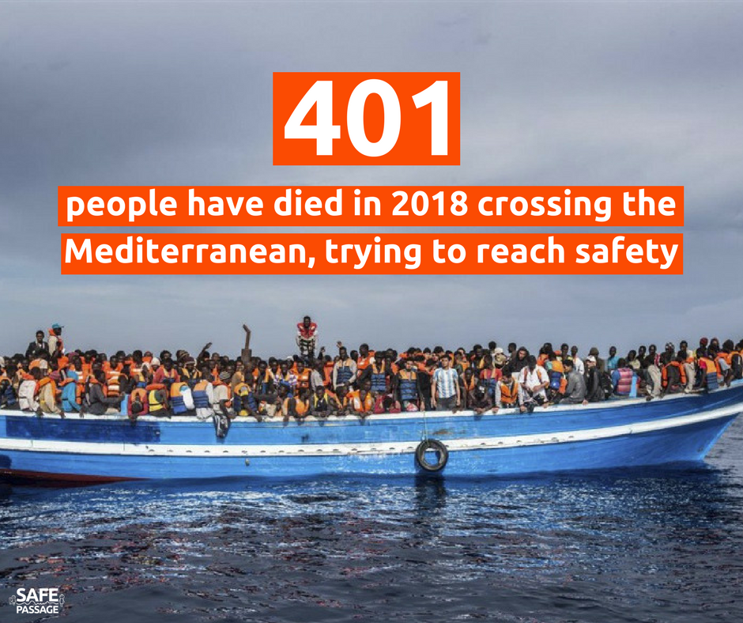

### AYS Daily Digest 18/02/18 — EU member states deny Human Rights violations at EU borders

_EU countries are denying Human Rights violations at border crossings despite evidence// Reports that Syrian males are forbidden from marrying Lebanese women// Boat stopped by TCG // Death toll on Mediterranean for 2018 surpasses 400 // Protests across EU against deportations to Afghanistan// News from Greece// Balkan weather forecast // News from Serbia, Hungary, Austria and France_

Source: No Name Kitchen
### Feature:
#### A Denial of Human Rights Violations at EU Borders

[Rigardu](https://rigardu.de/2018/02/18/aktion-reaktion-wirkung/) has been collecting information about human rights violations at the external EU borders for almost one year\. So far, they have published 135 reports on their site [borderviolence\.eu](https://www.borderviolence.eu) \. Several media outlets have covered this topic based on the Rigardu publications\. The response of authorities to these allegations has widely been one of denial

**Hungary:**

> “the Hungarian police protects the borders of the EU and Hungary” — Hungarian Interior Ministry response 

**Croatia:**

> “unprofessional or unlawful behaviour of police officers against migrants” — Spokesperson for Croatian Police response 

**Slovenia**

> “Slovenia has high standards regarding professionality and lawfulness at their work” and they were “surprised” by the accusations\. “We are not aware about such cases of push\-backs or violence by the Slovenian police\.” — Slovenian Interior Ministry response 

Based upon these responses, Rigardu is protesting that the authorities have not truly responded to the allegations, but only dodged the relevant questions\. Furthermore, the contacted EU institutions did not react to their findings\. Despite having received negative answers from several institutions, they were most shocked by the answer of the German representative of the European Commission\. Mr\. von Peter said that the Commission would investigate specific allegations, if they are precise\. But Rigardu’s reports were

> “too general to investigate the described situation\.” — European Commission response 

> “A sluggish EU system supports and protects the practice of human rights violations for the protection of the EU’s external borders,” Rigardu concludes\. 

Based on their official complaints, they have concluded the EU has little interest in bringing these crimes to light\. They plan to start a complaint procedure against the EU Commission for individual cases\. The group is also submitting two complaints to Frontex\.
### Lebanon

Reports are emerging from Lebanon that authroities within the country are forcing male Syrian refugees who want to attend university to sign a document promising that they will not marry Lebanese women\.

](assets/8613b4de5c49/1*a9SUJWUbn2ggINYwzEGaNg.jpeg)

A copy of the “pledge” Syrian students are being forced to sign\. Provided by [Free Syria Salam\.](https://www.facebook.com/Free.SyriaSalam/)
### Turkey

A boat carrying 55 persons: 11 children, 16 women and 28 men has been stopped by the Turkish Coast Guard\. All 55 persons were arrested\. The boat was heading towards Tsonia, Lesvos\.
### Sea:

So far in 2018, 401 people have died crossing the Mediterranean in search of safety\.

Source: Safe Passage

Proactiva Open Arms has rescued 101 persons from a rubber boat 100km off the coast of Libya\.

### General

There were protests across the EU today against deportations to Afghanistan\. As the organizers of these protests wrote, “With this action, we express our solidarity with all refugees\. We call for resistance against the Austrian policy and the European border\. Both deportations and European border security endanger and kill people who are looking for safety and a better life\. Under the current övp / fpö government there is a further tightening of the asylum procedures and an increase in deportations\. That is why we are demanding that all deportations to Afghanistan stop immediately\!”

](assets/8613b4de5c49/1*ixOekt_hwQm6zM4YVkBoMw.jpeg)

Photo Credit: [Refugee Protest Camp Vienna](https://www.facebook.com/RefugeeCampVienna/)

 \.](assets/8613b4de5c49/1*L4Fs444XCRTrddrEbJm4-Q.jpeg)

Protest In Stockholm, Sweden\. Photo Credit: [Ung i Sverige](https://www.facebook.com/ungisverige.nu/) \.
### Greece

A single boat carrying 52 persons \(12 children, 15 women and 25 men\) was picked up by the Hellenic Coast Guard outside Kratigou, South Lesvos at 03\.20\.

[Another boat was picked up by the Croatian Coast Guard](https://www.facebook.com/AegeanBoatReport/photos/a.285312485325196.1073741828.285298881993223/308838549639256/?type=3&theater) also outside Kratigou, Lesvos south at 00\.30\. A total of 58 people were on board and no breakdown has been released as yet\.

Atikka Warehouse on Lesvos is in need of support and donations in order to continue their operations\. Please follow [this link](https://www.facebook.com/AttikaHumanSupport/posts/556088734746786?hc_location=ufi) to see how you can help\.

[Refugees 4 Refugees are in urgent need of 20–30 volunteers](https://www.facebook.com/Refugee4Refugees/posts/621371428206536?hc_location=ufi) to help within their clothing distributions warehouse\. If you want more information please email refugee4refugees@gmail\.com or message them on their Facebook page\.

The 2nd School \(ex Jasmine\) Refugee Shelter \(Mayer & Acharnon Strs\) are in need of supplies to assist various projects they are running:

What is needed:
1. Basic set of tools and materials
2. Cleaning equipment
3. 20 chairs, 3 whiteboards and whiteboard markers

For more information please follow [this link](https://www.facebook.com/groups/PAMPIRAIKI/permalink/595878974089544/?hc_location=ufi) or contact Hesham on heshamkhozam0@gmail\.com
### Balkan Weather Forecast \(for 19\.02\)

This week AYS is forwarding a weather forecast from the Balkans as many people are on the move in the region right now\. We have reports of a large number of new arrivals in Bosnia, who are trekking through remote areas at freezing temperatures to reach Sarajevo\.
#### Montenegro

In Montenegro it will be mostly cloudy with rain\. In northern areas there will be snow and sleet, and during the day rain in lower parts\. The wind will be weak to moderate, with a strong east and northeast wind along the coast\. Morning temperature \-4 to 8, highest daily 0 to 11 degrees\.
#### Serbia

In Serbia it will cloudy and cold with more snow expected in the east and in the mountains\. The wind is weak to moderate form the north and northeast, during the day it will change from the east to southeast\. The morning temperature will be \-2 to 2 ° C, the highest daily 1 to 4 degrees\.
#### Bosnia and Herzegovina

Monday in Bosnia and Herzegovina it will be cloudy withsnow fall and rain\. Weak winds will be blowing from the north and northeast\. The temperature will be between \-2 and 10 ° C\.
#### Croatia

Monday will be cloudy with snowfall and rain expected in the mountains, and in the central and eastern parts there will be rain and possibly snow towards the end of the day\. The Adriatic will be very windy\. The temperatures will between \-3 and 10 degrees\.
### Bosnia

60–70 people are currently in Velika Kladusa but more people continue to arrive\. The local people are providing food and clothes but there are some problems with limited sleeping spaces\. The Imam was afraid of police reaction and he stopped allowing people to sleep in the mosque\. In Bihac, there are no refugees in the city anymore — they are all staying in the forest\.
### Hungary

According to our colleagues in the Magyar Helsinki Committee \(MHC\), the UNHCR has announced their opposition to new border restrictions in Hungary and a tightening of asylum procedures\. From MHC’s statement today: “The United Nations High Commissioner for refugees \(UNHCR\) has been shocked by the new border restrictions, as well as the bill for asylum seekers and civilian organisations working for refugees\. The UNHCR calls on the Hungarian government to withdraw the bill that would deprive refugees of vital support from civil organisations\.

In his annual state of the nation address, Hungarian PM Viktor Orban delivered an attack on refugees and migrants, backing his claims up with flase statistics and information\. In his speech Orban claimed that country was the last protection against the “Islamization” of the West, as if those fleeing violence and persecution were religious crusaders rather than refugees\.
### Austria

There were protests in Vienna today against the deportation of Afghan migrants\. As the organizers of these protests wrote, “With this action we express our solidarity with all refugees\. We call for resistance against the Austrian policy and the European border security\. Both deportations and European border security endanger and kill people who are looking for safety and a better life\. Under the current övp / fpö government there is a further tightening of the asylum procedures and an increase in deportations\. That is why we are demanding that all deportations to Afghanistan stop immediately\!”

](assets/8613b4de5c49/1*ixOekt_hwQm6zM4YVkBoMw.jpeg)

Photo Credit: [Refugee Protest Camp Vienna](https://www.facebook.com/RefugeeCampVienna/)
### Netherlands

A protest has been announced for this coming Tuesday in the Netherlands \(20\.02\) to demonstrate against universities investing in arms companies\. They are focusing on two companies in particular: Thales and Airbus\. From their statment: “TU Delft has been cooperating with Thales and Airbus on research and development of advanced military technology, such as radar systems and composites for military aircraft\. Their products are being used in war\-zones and by EU border guards, making the borders more and more deadly\. They spend huge amounts of money to lobby the European Union to militarize its borders\.” Click [here](https://www.facebook.com/events/407164006406889/) for more information\.
### France

Many people have arrived in Paris in the past three days, as our contact in the capital has reported\. After a few quieter days with some people getting accommodation, there have been around 40–50 arriving each day this week\. Yesterday volunteers estimated that there are about 80 refugees split among the main camp areas, St\. Denis canal, Jaures and Poissoniers\. “In one of the places we are getting now also many minors and families, with the age range of the children going from only a few motnhs old to 15–16\. Many are unaccompanied,” our contact reports\. Volunteers have been trying to get younger children and families to hotels for more comfort and safety but with higher numbers and little assitance from the authorities this is getting more difficult\. The weather is due to become colder again next week, posing additional risks for those sleeping rough\.

](assets/8613b4de5c49/1*52kuUbhQRrdejRI6NwrbAg.jpeg)

Sleeping rough in Paris\. 18\.02\.18\. Photo Credit: [Worldwide Tribe](https://www.facebook.com/theworldwidetribe/)

Volunteers in Paris are looking for assistance with clothing sorting and distribution\. Help is needed particularly on wednesdays to sort and distribute and on weekends for distribution\. The adresss is 12, rue st\. Bruno at the corner with rue St\. Luc\. Click [here](https://www.facebook.com/groups/177642579245883/permalink/575517042791766/) for more details\.

[Solidarité migrants Wilson](https://www.facebook.com/598228360377940/photos/a.599438026923640.1073741828.598228360377940/849769588557148/?type=3&hc_location=ufi) is looking for volunteers to help them with distributions in Paris\. Click [here](https://www.facebook.com/598228360377940/photos/a.599438026923640.1073741828.598228360377940/849769588557148/?type=3&hc_location=ufi) for details\.

[Care4Calais](https://www.facebook.com/care4calais/?hc_ref=ART5sZlyIR-1rW0jRVonCzrDb4NDDyu724_Ap6VeMuO81zYdvQsfrYS54lAxcac-J0Y&fref=nf&hc_location=group) distributed over 400 pairs of jeans and jogging bottoms in the freezing cold in Calais\. “Sadly it is not uncommon to meet people who have not changed their trousers for eight or ten weeks, leading to skin infections and scabies,” C4C reports\. To continue their distributions, they are asking for more donations\.

In Caen more than 1000 people demonstrated to show solidarity with refugees, and in protest against human rights violations in the country\.

](assets/8613b4de5c49/1*9YKnYj9tb-Hg0BrDM0Pefw.jpeg)

“We will not close our eyes to human rights violations”\. Photo Credit: [Phillippe Rifflet](https://twitter.com/prifflet?lang=en)

> **We strive to echo correct news from the ground through collaboration and fairness\.** 

> **If there’s anything you want to share or comment, contact us through Facebook or write to: areyousyrious@gmail\.com** 

_Converted [Medium Post](https://medium.com/are-you-syrious/ays-daily-digest-18-02-18-a-denial-of-human-rights-violations-at-eu-borders-8613b4de5c49) by [ZMediumToMarkdown](https://github.com/ZhgChgLi/ZMediumToMarkdown)._
