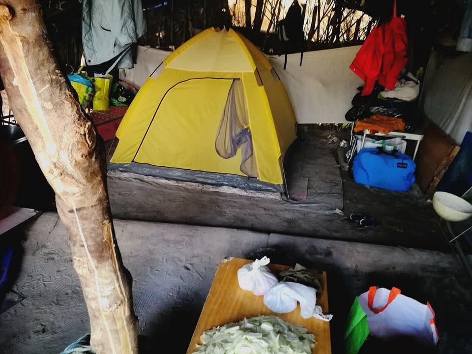

### AYS DAILY DIGEST 19/02/2018: People deported to Afghanistan are risking their lives again to reach Europe

Stop deportations to Afghanistan\! // numerous rescues at sea// News from EU/New arrivals and information from Greece// Balkan Weather Forecast//Serbia//New laws proposed in Hungary target Civil society groups// News from Italy//Spain//France//Finland// Norway

### Feature: New evidence finds that a large number of people who have been deported to Afghanistan are forced to flee a second time

[In a report by Pro\.Asy](https://www.proasyl.de/en/news/escape-again-afghan-refugees-deported-from-germany-are-forced-to-flee-a-second-time/) l, it is revealed that many of those forcibly returned to Afghanistan from Germany are desperately trying to reach Europe again in a secondary bid to seek protection\. Many are now stuck in deplorable conditions on the Greek Islands\. This only highlights the sheer danger people face upon their deportations to Afghanistan and their desperation to find safety\.

The report reads:

> The Pro\.Asyl staff interviewed four Afghan refugees who managed to find a way back to Europe, and in the process risked their lives for a second time\. They described their horrible experiences of deportation from Germany, the second escape from Afghanistan and the degrading living conditions they now face while trapped in Greece as a result of the EU\-Turkey migration deal\. None of them had a criminal record in Germany\. All were well integrated 

Germany recommenced deportations to Kabul in December 2016 under the ‘joint way framework’ — an agreement between EU and Afghanistan for the forcible return of Afghan protection seekers from Europe\.

> So far, 174 persons have been deported \[from Germany\] despite a recent spate of deadly attacks in the conflict ravaged country\. 

Pro\.Asyl interviewed people who after deportations were now stuck in Greece\. The reports describe the danger they faced upon their return to Afghanistan\. Being forced to flee again\. The traumatic experience of the apprehension and deportation from Germany\. Risking their lives in Turkey and the devastating conditions they find themselves in now on the Greek Islands\.

> “I was independent from the help of the German state\. I had a stable income\. I don’t understand why I was sent back\.” 

> Hassan Jan\*, a 29 year\-old Afghan refugee describing his life before deportation 

#### The next expulsion to Afghanistan will allegedly take place on Tuesday the 20\.2\.2018 From Munich\.

■■■■■■■■■■■■■■ 
> **[RSA](https://twitter.com/rspaegean) @ Twitter Says:** 

> > Tomorrow #Germany will deport more  #Afghan refugees back to Kabul. Meanwhile, four refugees told @[rspaegean](https://twitter.com/rspaegean)  and @[ProAsyl](https://twitter.com/ProAsyl) how they had to flee Afghanistan for the second time following their deportation from Germany #Refugees #afghanistanisnotsafe 
[rsaegean.org/escape-again/](http://rsaegean.org/escape-again/) 

> **Tweeted at [2018-02-19 18:27:35](https://twitter.com/rspaegean/status/965654111390781440).** 

■■■■■■■■■■■■■■ 

Here you find the most important information for Afghans in Farsi:

Pressure has been building across Europe to stop deportations to Afghanistan\. This week saw a number of collective protests take place across many member states\.

#### New data states that 2017 was the deadliest year on record of civilian casualties in Afghanistan

[A report by the Guardian](https://amp.theguardian.com/uk-news/2018/feb/19/uk-under-pressure-over-afghan-asylum-seekers-as-civilian-deaths-rise?CMP=share_btn_fb&__twitter_impression=true) states that the UK government is under pressure to stop deporting people back to Afghanistan amidst data that shows civilian casualties in 2017 reached over 10,000 for the fourth year in a row\.

**The home office of the UK recognises Afghanistan as the world’s least peaceful country after Syria** \. Despite this, 785 people were returned in 2016 from the UK to Afghanistan despite it being the deadliest year recorded of civilian casualties\. Furthermore between the years 2007 and 2015, over 2,000 unaccompanied children who sought asylum from Afghanistan have been deported back according to a report that was released by [Amnesty International](https://www.amnesty.org.uk/press-releases/european-governments-return-nearly-10000-afghans-risk-death-and-torture-new-report) \.

Afghanistan is not safe\. It is time to end this nonsense\.
### Sea:

High waves in the Mediterranean during the night made search and rescue efforts of the Aquarius difficult\. They were alerted by authorities of 3 boats in distress\. Weather has calmed as they continue their search and prepare for rescue efforts\.

■■■■■■■■■■■■■■ 
> **[MSF Sea](https://twitter.com/MSF_Sea) @ Twitter Says:** 

> > #Aquarius actively searching for boats in distress in #Mediterranean after being alerted by competent authorities. Weather conditions making the search difficult with waves over 1.5 metres high this morning. https://t.co/ehqnNTwtdp 

> **Tweeted at [2018-02-19 13:16:37](https://twitter.com/msf_sea/status/965575853110452224).** 

■■■■■■■■■■■■■■ 

Proactiva Open Arms in the night rescued 101 persons who are due to arrive in Italy\.

> We can’t leave the rescue zone deserted, so we’re still alert\. Let us remember that it remains the most lethal area on the planet\.
 

> More than wars, much more\. 

Source: Proactiva Open Arms

Meet the crew of Mission Lifeline\!

[SALVAMENTO MARÍTIMO](https://twitter.com/salvamentogob/status/965620494513958913) rescued two boats during the early hours of the morning\. On the first boat 31 people were rescued\. On the second boat 35 were rescued\.

■■■■■■■■■■■■■■ 
> **[SALVAMENTO MARÍTIMO](https://twitter.com/salvamentogob) @ Twitter Says:** 

> > Esta madrugada la Salvamar Gadir ha rescatado 31 personas (27 hombres, 3 mujeres y un menor) de una patera localizada 5'5 millas al sur de #Barbate y los ha trasladado al puerto de dicha localidad. https://t.co/YutLvgg037 

> **Tweeted at [2018-02-19 08:16:17](https://twitter.com/salvamentogob/status/965500269395103744).** 

■■■■■■■■■■■■■■ 

### General:
#### ECRE is concerned with reform of the Dublin System

ECRE is calling on all EU member states to ensure fundamental rights protection in the reform of the Dublin system\.

> Council negotiations have resumed under the Bulgarian Presidency and ECRE remains concerned that the revised proposals under discussion continue to represent a deterioration in the rights of refugees and asylum\-seekers, while failing to address the fundamental dysfunctions of the Dublin system\. 

To read more about ECRE’s concerns and recommendations please [follow this link](https://www.ecre.org/wp-content/uploads/2018/02/Legal-Note-3.pdf)
#### UN Migration Agency records that over 1200 Children who were seeking safety in Europe have died since 2014

Since the picture of Alan Kurdi made headlines around the world, many more children have died during migration\. Despite over 1200 reported deaths, Julia Black, the coordinator of the Missing Migrants Project concludes:

> “We know that our data are incomplete\. The truth is that the number of children who die during migration is much higher than what we know\. Obtaining better data could help to reduce such tragedies in the future, as well as help families to identify their loved ones\.” 

Nearly half of recorded deaths occurred while attempting to cross the Mediterranean\.

To read more please [follow this link\.](https://reliefweb.int/report/world/un-migration-agency-over-1200-migrant-children-deaths-recorded-2014-true-number-likely?utm_medium=social&utm_campaign=shared&utm_source=twitter.com)
#### Counselling service for the support of female refugees who have suffered gender based violence \(GBV\)

A new European project aim to create and provide training for counsellors in order to equip them with the skills to provide support to women who have suffered GBV\.

Several International Organisations are involved in the project which is titled: **“Co\-creating a Counseling Method for Refugee Women Gender\-Based Violence Victims\.”**

> The initiative aims to create a specific model for counselling to help women who have requested or been granted international protection and who have suffered GBV or persecution linked to their gender\. 

To read more please [follow this link\.](http://www.infomigrants.net/en/post/7621/counseling-for-refugee-gender-based-violence-victims)
### Greece:
#### Arrivals:

New arrivals documented by [Aegean Boat Report](https://www.facebook.com/AegeanBoatReport/posts/308962942960150) \.

One boat was picked up outside Lesvos south, Kratigou at 00\.30am by Frontex\. 58 people on board, no breakdown so far\.

One boat landed on Korakas, Lesvos north at 05\.25am\. 25 people were on board \(4 children, 10 women, 11 men\)

One boat picked up outside of Samos early this morning, it was taken to port Samos\. 25 people were on board \(9 children, 4 women, 12 men\)

One boat is reported to be on its way towards Rhodes, 15 people are on board \(8 adults and 7 children\) \. Landing has not been confirmed\.
Update:

> Latest info is that this boat most likely did not make it to Rhodes\. Last known position was 45 km from Rhodes, at 23\.30, inside Turkey waters\. TCG was informed about this boat, and was looking for it, unknown if they found it\. — Aegean Boat Report 

One boat was stopped on its way towards Samos by the Turkish Coastguard\. TCG was perusing this boat for some time, maneuvering dangerously close to the rubber dingy in high speed\. TCG was dragging a long metal chain to try to rip off the engine on the rubber boat, extremely dangerous\. \.

A boat with 17 Turkish citizens \(7 men, 5 women, 5 children\) landed on the small island of Oinouses, off of Chios today\.
#### Update from Dirty Girls Lesvos

Dirty Girls have washed nearly one ton of blankets that would otherwise have been sent to landfill\. So far during their time working they have saved 600 tons of material that otherwise the government and International NGOs would have discarded\. They urge that this sort of response makes no economical or environmental sense in humanitarian aid\.

Blankets washed and ready for re\-use\. Source: Dirty Girls Lesvos
#### Zaatar — Non Profit Organisation has released a schedule for their classes this week

#### EU commission will extend funding of apartments in Greece for Refugees until end of 2019

[Reveals head of UNHCR Greece](https://www.facebook.com/groups/PAMPIRAIKI/permalink/596351500708958/?hc_location=ufi) Phillippe Leclerk in an interview with Reuters\. The plan for transfer of responsibilities to local government for apartment management will therefore for the moment be postponed to 2020\. It remains unclear what role UNHCR will play after 2019 — but the plan involves UNHCR to have a more ‘supervisory role’ according to Leclerck\.

After 2019

> According to UNHCR weekly data, the ESTIA program currently includes 23,374 accommodation places in apartments, buildings and hotels across Greece, hosting 19,331 refugees and asylum seekers\. The program involves seven NGOs as well as the municipalities of Athens and Thessaloniki with neighbouring municipalities\. 

### Balkan Weather Forecast for 20/02/2018
#### Montenegro

Tuesday will be partly cloudy with rain showers and possibly thunderstorms and in the higher regions snow\. The Eastern wind will be moderate to strong\. The lowest temperature will be \-2 in the morning with a maximum temperature of 13 degrees during the afternoon\.
#### Serbia

Weather warning, during the night as well as day and the next day there will be snowfall from 10 to 20 cm in Eastern parts of the country\. In the mountainous areas further increased snowfall and strong winds\. It will be mostly cloudy with rain and snow, with intensified precipitation in the higher regions as well as the north and eastern parts\. Moderate to strong southeastern winds will be blowing with a possibility of very strong winds locally\. The temperatures will be ranging between a low \-1 in the morning and a high of 6 degrees during the day\.
#### BiH

Cloudy weather is expected with snowfall and in the southern part of the country rain\. Moderate north and northeastern winds will be blowing\. The temperature will be mainly between \-3 and 2 degrees, and in the south a bit warmer between 4 and 8 degrees\.
#### Croatia

Cloudy weather is expected, and in the mountains there will be snow\. Alongside the coast there will be heavy rainfall and maybe some snow in the northern parts of the coast\. Landinwards moderate northeastern and eastern winds are expected, and in the mountains strong winds\. The winds alongside the coast will be strong\. The temperatures will be between \-4 and 0 degrees landinwards, alongside the coast temperatures from 3 to 7 degrees are expected\.
### Serbia:

Make Aid Happen report that the Situation in Sid is deteriorating and people trying to cross the borders in Europe are losing hope\.

Temperatures in Sid remain below 0 degrees celsius
### Hungary:

On 13 February 2018, the Hungarian government proposed 3 new laws referred to as ‘Stop Soros’ which would put further restrictions on Hungarian civil societies ability to carry out their work, especially those working with refugees\.

The new laws require organisations that ‘support migration’ to go through procedures in order to obtain an national security clearance and a government permit in order to perform basic work\. It would also require these organisations to pay a tax of 25% of any foreign funding that is aimed at helping those seeking asylum\.

> Failure to do so, would subject them to steps so serious that they could lead to exorbitant fines, bankruptcy, and the dissolving of the NGO involved\. 

They may even face risk such as attacks and jail\.

> As defenders of rights and freedoms, we want people everywhere to be able to speak out without being attacked, threatened or jailed\. 

You can read more [via this link](http://www.enar-eu.org/In-solidarity-with-Civil-Society-in-Hungary) \.
#### Hungarian Prime Minister spits anti Muslim Rhetoric in lead up to elections

As Viktor Orban competes for his third term in office, he stirs fear by saying **‘The West will fall’ and ‘muslim immigration will destroy Europe\.’**
#### Comments from the Hungarian Prime Minister proposal for new legislation that will penalise NGOs assisting refugees

> “If they do not stop their dangerous activities, we will simply expel them from the land, no matter how powerful or rich they may be,” he said during his annual State of the Nation address\. 

#### Further Information on the proposed ‘Stop Soros’ bill

### Italy
#### Pictures from Gradisca

> In the jungle; life continues as always\. Fortunately, today there is the sun\. We continue to bring blankets, sleeping bags, clothes and food to those who frequent the jungle\. Now the main problem is the boars that destroy everything at night — Mauro Chiarabba 

Source: Mauro Chiarabba
#### Walk of Solidarity to French Border

Yesterday 150 people took part in a walk of solidarity along the path that people take to reach France \.

Source: Ape Milano
#### Italian Refugee Iris Database is looking for translators to join their team\.

[You can find more information here](https://www.facebook.com/migszolcsoport/posts/1700185316699288?hc_location=ufi)
#### [An event](https://www.facebook.com/events/532772807095324/) is being held in Italy to remember deaths at borders

The event will be held on the 25th of February at 4\.30pm, near the Chiasso border, at the gardens of Piazzale Anna Frank \(close to the parish church\) \.

> Every year thousands of migrants die at our borders hoping to achieve life conditions worthy of a human being\. In the first 2 months of 2018 already 390 migrants died or got missed in the Mediterranean\. 

> They are people, not numbers\. So that none of them is forgotten, we invite you to join a moment of memory and reflection\. 

#### [Protest: Let the Refugee Children In](https://www.facebook.com/events/412914395816670/)

A protest will be held outside the Royal Court of Justice, Strand, London, WC2A 2LL,On Weds 28th Feb and Thurs March 1st at 9\.30am\.

> When the dubs amendment was passed the intention for the House of Lords was for 3000 unaccompanied asylum seeking children to be relocated into the UK\. When it was passed law they did not specify number\. The Home Office pledged to relocate 480 children under the scheme however, as of 23 January, 2018, only 230 children having relocated from Europe to the UK under the provision\. 

### Spain:

According to police reports, At least 300\.000 people in Barcelona demonstrated demanding that ‘from this moment’ Spain takes in the thousands of refugees it committed to host in 2015\.

> The Mayor of Spain’s second largest city, ada koláou called on protesters to ‘flood the streets’ as part of this mobilisation entitled “ we want to welcome “ \(“ volem acollir “, in Catalan\) \.” 

[ 18.02.2017")](https://www.dailymotion.com/video/x6ezklh)

### France:
#### Report from PRGS about Government Camp in La Chappelle

Volunteers were told they were only allowed to hand out food to the children but nobody else\.

> In 1 of the coldest weeks during our usual distribution round we saw the line of people, outside the government camp in la Chappelle, mainly young men but also there were a few families also waiting to enter the camp, waiting at 3am on the street in \-3 degrees\. We gave out emergency blankets, duvets and blankets to those that needed them while the police looked on from the comfort of their van \(with the engine running to keep it warm\) with complete indifference to the situation around them\. 

#### French National Assembly adopts a new law

New Law allows French authorities to detain asylum seekers who could be transferred to other EU member state country under Dublin Regulation\.

> The law sets out a framework whereby an asylum seeker may be detained throughout the procedure of determination of the Member State responsible for his or her claim under the Dublin system, whereas the current state of the law would only allow detention after a transfer decision has been issued\. 

A protest has been organised against\. The protesters label ‘This law marks an ultra\-repressive turning point in migration policy\.’

The protest will be held on February 21st at 18h30 at la place Saint Michel\. It will then head to the National Assembly\.

To find out more please [follow this link](https://www.facebook.com/events/143529396312758/)
#### The occupation of a university Paris 8 building continues

You can’t evict a movement\! The university Paris 8/Saint Denis has been occupied now for three weeks by students and people sleeping rough\. They are joining forces to protest for the right of people seeking asylum to stay in France and for an end to be put to Dublin regulations\.

> This year, Paris is seeing one of its coldest winters in decades\. The masses of snow have caused traffic and public transport chaos and have left thousands of people sleeping rough — many of them migrants — in life\-endangering conditions\. At the same time, the Macron administration is planning a further neoliberalization of France’s universities and keeps tightening French asylum laws and is criminalizing supporters\. Recently, in Nantes, Grenoble, and Lyon, refugees, students, and people in solidarity have started occupying university buildings converging these struggles\. 

Their demands are:
- **documents for everyone**
- **decent, permanent housing**
- **to be allowed to learn French and continue our studies**
- **an end to the non\-recognition of unaccompanied minors \(DEMIE\)**
- **an immediate halt to deportations to all countries, European and abroad**

You can read more [via this link](https://oplatz.net/you-cant-evict-a-movement-les-exile-e-s-occupy-a-building-of-university-paris-8/)
#### A rally in support of this occupation is planned for Tuesday

The occupiers have released a statement outlining their needs which incorporate various supplies for cooking\.

#### Refugee Community Kitchen is in [need of your support](https://www.facebook.com/refugeeCkitchen/photos/a.1224302977587070.1073741828.1214750961875605/2067944253222934/?type=3&theater) \.

#### Photos of the living conditions in Calais

### Finland:
#### Family reunification numbers increasing in Finland

In 2017 immigration Authorities in Finland granted approval to 80% of over 10,000 family reunification cases\. This figure has doubled over the past 10 years and is expected to continue rising\.

To read more please [follow this link](http://Como)
### Norway:

**A court has acquitted a man accused by police of being behind an arson attack against an asylum centre\.**

A 37 year old Polish citizen who was sentence to seven year in prison by Bergen City Court for starting a fire that burnt down Lune Huler Hotel which was to be used as asylum seeker accomodation in December 2015 has been acquitted\. He has been found not guilty after testimony from his brother\.

To read more please [follow this link\.](https://www.thelocal.no/20180219/man-acquitted-over-asylum-centre-arson-by-norway-appeals-court)

> **We strive to echo correct news from the ground through collaboration and fairness\.** 

> **If there’s anything you want to share or comment, contact us through Facebook or write to: areyousyrious@gmail\.com** 

_Converted [Medium Post](https://medium.com/are-you-syrious/ays-daily-digest-19-02-2018-people-deported-to-afghanistan-are-risking-their-a-second-time-to-42cc696fe8b0) by [ZMediumToMarkdown](https://github.com/ZhgChgLi/ZMediumToMarkdown)._
