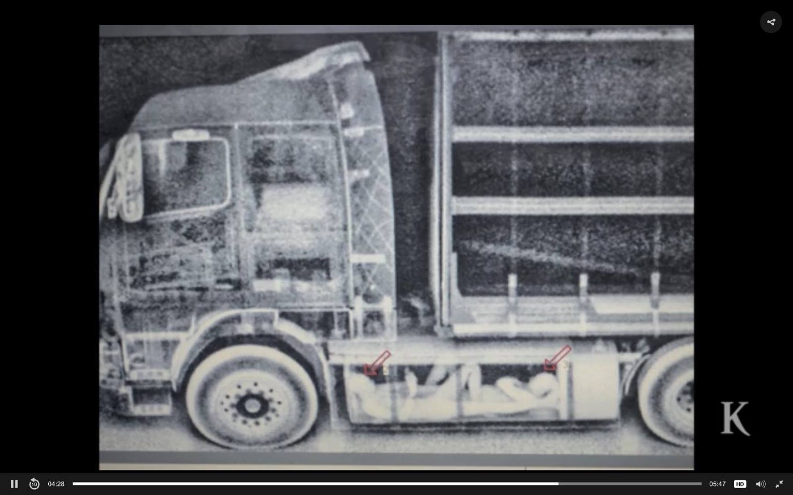
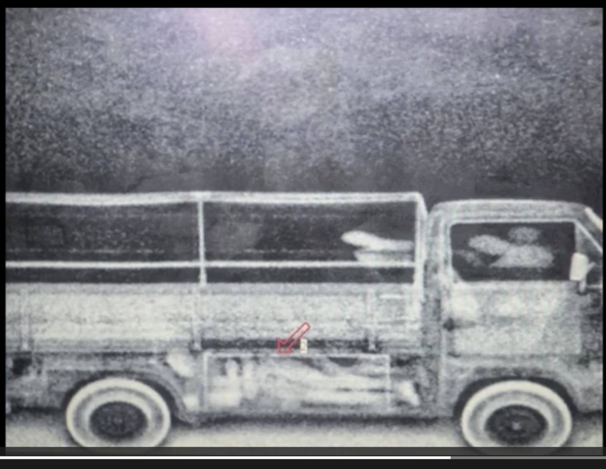
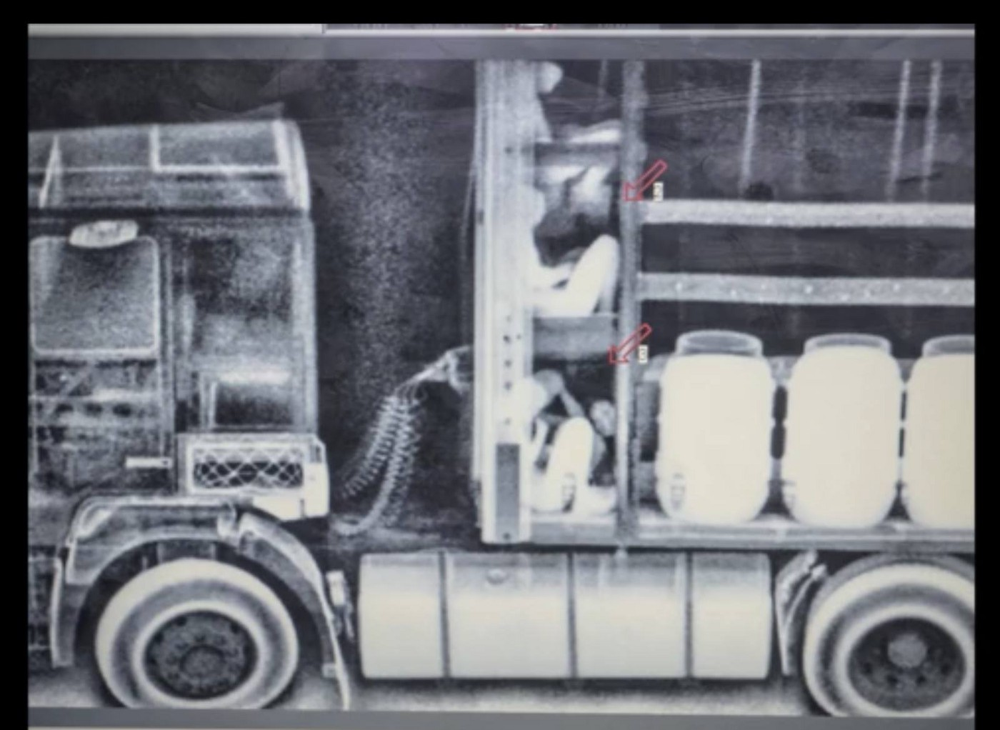
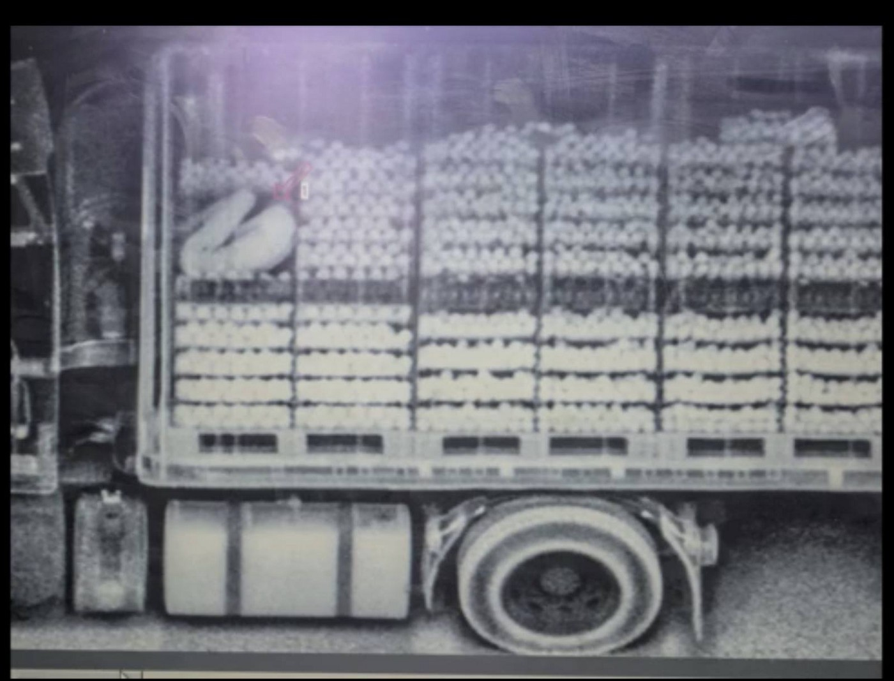

### AYS Daily Digest 20/02/18: Deadly route continues

_New boats with people intercepted by the coast guard// evidence of illegal pushbacks at the deadly crossing in Evros// Bosnia and Herzegovina have an increasing number of refugees this year// Weather report for people in the Balkan area// French organizations fight the new law// Germany continues deportations// more news and calls for help_

#### FEATURE PHOTO STORY

These screenshots show images of some of the incredible — and to most people unimaginable — ways that people risk their lives to try to get to safety and countries that could provide them international protection\.
The images are from the Patras area, where people have often tried to cross to Italy, but similar scenarios have taken lives in the Balkan route, in the Italian Ventimiglia crossings, and especially on the way from Calais to the UK\. The reasons for attempting the crossing, and the severity of the situation for these people, are unfortunately beyond understanding for some of the media and officials “dealing” with the situation\.

### EU sounds a reaction to massacres in Syria

While the world looks away, Syrians continue to suffer, trapped under constant air strikes and killing\.

Calling “ _on all parties to the conflict to take all necessary measures to ensure the decrease of violence”_ \(sic\), the European Commission issued a [Statement](http://europa.eu/rapid/press-release_STATEMENT-18-941_en.htm) by High Representative/Vice\-President Federica Mogherini and Commissioner for Humanitarian Aid and Crisis Management Christos Stylianides on the humanitarian situation in Eastern Ghouta and Idlib, Syria:

> There have been dozens of civilian deaths and hundreds of wounded in Eastern Ghouta yesterday alone\. More than 300,000 civilians have been displaced in the northern Governorate of Idlib, with destruction of civilian infrastructure, such as hospitals\. 

> Unhindered humanitarian access to civilians inside Syria and the protection of civilians and civilian infrastructure is a matter of urgency to prevent further loss of lives\. To prevent further children and families, the most vulnerable, being killed\. The international community should unite to stop this human suffering\. 

The UNICEF issued a statement containing reports of mass casualties among children in Eastern Ghouta and Damascus\. Read the document [**here**](https://l.facebook.com/l.php?u=https%3A%2F%2Fwww.unicef.org%2Fmedia%2Fmedia_102678.html&h=ATP7JksSI9yWO3tsNWDUm38WQgZcDzGCiakx6nzFBvz3pfgzxyKMkQNcH1DZBL63PPISALDQSrQQaHdMi3Ikb7c44r6MIi6ptcLJv8CWXlGnslt-) \.
#### SEA

On Monday the Turkish coast guard stopped a boat trying to cross to Lesvos south side, carrying 28 people, and another one heading towards Samos, with 50 people on board\.

In the other part of the Mediterranean, Salvamento Maritímo reports saving 60 people from 2 boats \(33\+27\) in the north of the island Alborán\.
#### GREECE
#### Arrivals and transfers to the mainland

Transfers \(on Lesvos, Chios, Leros\) are still in higher numbers than new official registrations\. With about 600 people arriving throughout the first two months of the year, Samos recently reached 10,000 arrivals since the so\-called Turkey deal, while about 25,000 people have since arrived on Lesvos, about 1,250 this year only\.
The average number of arrivals per day, after the first 50 days of 2018, is 47\.22, making a total of 2,361 people who have come to the islands thus far\.
### Repeated reports of systematic push backs at Evros

Along with a [14\-page](http://gcr.gr/index.php/el/news/press-releases-announcements/item/790-anafores-gia-systimatikes-epanaproothiseis-ston-evro-apo-eksypiretoymenous-tou-esp) listing of events and evidence, the Greek Council for Refugees published:

> Reports and complaints about the illegal return of refugees at Evros borders are steadily increasing\. According to them, persons in need of international protection, asylum seekers and recognized refugees, after crossing the border through Evros, are arrested on Greek territory, detained and accompanied by police at the border where they are returned to Turkey\. 

> GCR receives many complaints, some of which are published today, which show a well\-established practice by the authorities in managing the populations of third\-country nationals seeking irregular entry into the country\. The way and the circumstances in which they take place add further, in already arbitrary and contrary to national and international law, practice\. The most worrying issue, however, is that lately the reported incidents appear to be increasing and systematizing\. 

> Considering the repeated and growing reports on pushback practices in Evros, the GCR calls on the Greek authorities to look at these reports in a thorough manner, and recalls that both these practices, once confirmed, also failure to be effectively addressed and in the context of an independent procedure, constitute a violation of national law and international obligations of the country\. 

Read the entire report [here](https://www.facebook.com/notes/noborders/repeated-reports-of-systematic-push-backs-at-evros-by-members-of-the-greek-counc/1661338950600657/) \.
### Renewing residence permit

[Mobile Info Team for refugees in Greece](https://www.facebook.com/mobileinfoteam/?hc_ref=ARTSE27ox1Z7k50tLHilTu0hzP-v1iq5XSct2IZWDKheBaj4w_2GWaNBTCqp8NbRDVc&fref=nf) published information on how to renew a residence permit in Greece\. See their page for info in other languages\.

If your asylum is granted in Greece, you will get a residence permit that is normally valid for three years\. Some months before the three years pass, you need to apply to renew your residence permit, because without a valid residence permit you will face a lot of troubles\. The Asylum Service has recently announced that all applicants whose residence permit will expire by 30 June 2018 need to submit their application for renewal of the residence permit by 30 April at the latest\. To do this, you need to send an email to residencepermits@asylo\.gov\.gr 
This email needs to contain two things\. First of all, you need to send the completed application for renewal\. You can find the application [**here**](http://asylo.gov.gr/…/RESIDENCE-PERMIT-RENEWAL-APPLICATION.….) — and [**here**](http://asylo.gov.gr/en/?page_id=2498.) you can find a guide how to fill the application\.
You also need to send in the email a digital passport type picture of yourself\. You can find more information in the guide\. Please read the guide very carefully and comply with all the steps suggested in it\! If you need help with the application or the mail, look for help at a community center or a NGO near you\.
### Athens

**Khora needs laptops**

If you are in Athens or coming here to volunteer and happen to have a spare laptop, please consider giving it to us\!
If you are bringing us a laptop, make sure that it is working and that it is not too old\. The laptops will be used in our computer lab\.
Get in touch with khora\.computer@gmail\.com

**Arabic for volunteers**

If you are interested in the Arabic language: every Tuesday, Thursday and Friday 2–3 p\.m in Jafra Cultural Forum you can join the group learning Arabic\.

[**Jafra foundation in Greece**](https://www.facebook.com/JafraFoundationinGreece/?hc_ref=ARTbpAY-0MuxBAX9ZEQ7u3gy4W0KybZqjby4xJ5Zp1CRFUbWwBJGqzJQIVay00yalaA&fref=nf) **activities for women:**

Zumba: Wednesday/Friday 4–5
Yoga: Tuesday/Thursday 4–5
Aerobics: Monday 4–5
#### BALKAN WEATHER FORECAST FOR 21/2/18:

> **_Montenegro_** 
 

> _Mostly cloudy with occasional rain, chances of rain and thunderstorms in southern and central parts of the country; snow is expected in the mountains in the north\. The wind blowing from the east will mostly be moderate to strong\. The temperature in the morning will be between 0 and 9 degrees; daytime temperature will be between 3 and 14 degrees\._ 

> **_Serbia_** 

> _During the next 72 hours more snow will be creating 30 to 40 centimeter snow covers, locally possibly even more snow\. Strong to stormy winds are expected in the coming days\. It will be mostly cloudy with rain and snow in the north and east of Serbia, as well as in the mountains\. The lowest temperature will be between \-1 to 4 degrees, and the highest 1 to 8 degrees\._ 

> **_BiH_** 

> _Tomorrow will be mostly cloudy with rain in the northern, central, eastern and northeastern parts of the country\. In the mountains there will be snow\. The lowest temperature will be between 5 and 10 degrees with up to 13 degrees in the south\. The highest day temperature will be between 10 and 15 degrees\._ 

> **_Croatia_** 

> _Tomorrow will be partially sunny and above\-average warm, with possibly strengthening southern winds\. Occasionally the weather may be cloudy with chance to some rain\. At the end of the day and during the night there will be clouds from the south with rain\. The wind will be moderate to strong blowing from the south and southwest, while alongside the coast strong to stormy winds are expected\. The temperatures will be between \-3 and 1 and alongside the coast between 3 and 15 degrees\._ 

#### BOSNIA AND HERZEGOVINA

Reopening questions about a new route and the reassurances from the side of the agencies and politicians, going along with the kind words of the Turkish official stance and policies regarding the refugees and their treatment — these are some of the main points [reported](https://www.nacional.hr/nema-opasnosti-od-ponavljanja-migrantske-krize/) about the meeting of the regional UNHCR head and the government officials\.

Apart from the usual rhetoric, some statistical data were given: 77 asylum requests were received in 2018 so far, while during the entire 2017 year, 479 people asked for asylum once they reached Bosnia and Herzegovina — according to these statements\.

“The government is trying to respond to the challenges of the new arrivals to BiH and the UNHCR is helping them in this effort”, said the regional UNHCR representative to the gathered media at a press conference addressing the possibility of opening a new route in the Balkans\. We do not know what are the strategies of helping the officials and as for the refugees — we do know that people never stopped traveling, only now they are in the hands of the criminal milieu and left alone in struggles to find a way out of the limbo situations in the border areas, in places around Serbia and Bosnia and Herzegovina, etc\. Citizens in Sarajevo and other towns and volunteers who came to support them are helping those who found themselves in Bosnia and Herzegovina and are in dire need of shelters, aid, and a helping hand\.
#### ITALY

There have been 130,000 asylum requests in 2017 in Italy\. That is the highest number registered so far\. From the 82,000 requests that have been examined, 52\.4% have been refused\. Read more [here](http://www.vita.it/it/article/2018/02/19/richieste-di-asilo-nuovo-record-nel-2017-ma-piu-della-meta-sono-negate/146006/) \.

#### FRANCE
### Macron’s new law under criticism

Some of the organizations working to help refugees in France say the new policy proposed by the French president breaches people’s right to seek shelter without fear of being questioned or interrogated\. They have even taken the case to the highest national administrative court\.

The law aims to cut the waiting time on asylum applications from 11 months to six, while help will be given to those wanting to return home\. In the future people will be put in detention centres for a maximum of 90 days — double the current limit\. Apart from that, tighter deadlines for different stages of the court process, making it more difficult to appeal a decision, have also prompted concern among activists and immigration lawyers, according to media [report](https://www.thelocal.fr/20180219/macrons-repressive-migrant-law-faces-rough-ride-in-parliament) s\.

A protest against the measures of this law will be held in Paris:

### Volunteers need new space

Utopia 56 is looking for a new centre, a place to rent and conduct their work, preferably in the north of Paris\. Find more info [here](https://l.facebook.com/l.php?u=http%3A%2F%2Fwww.utopia56.com%2Ffr%2Factualite%2Fparis-recherche-urgente-dun-local-ou-hangar-travail&h=ATOuYth6iZqMGJiFyDCgvOM3Pp8Nsz_U9YVdhJeoGZfh2z0vw4AbL_Bxj_tLI17T75N-POnWQR5QwGcgGXCU4uwRE0fSz5jHdJbJtVoPDPbsrsgMQ0U7Q2-F9sibmHtL5nWeudt0lOlS8hSAuIBJ24l7B-Svy0jTA-YxeuvwzqdBVZlfnhx5feSL7NIexJED72QgCdW4ddbhtMZQNFg9oCe1xK_CNsyrqKVElK7q_j2rzWJu5SiTPIwZp7wy) \.

The city of Paris has published a [**list**](http://bit.ly/2odBiz4) of locations where you can donate winter clothing and blankets\. If you are active in Paris, let us know if you have any additional info/comments on this particular action, since we noticed a lot of mistrust through comments that came after this announcement\.
### Calais

An excerpt from the statement of a volunteer in Calais:

> A young man, 27 — a lawyer by background\. He had been in Calais for around 5 months having fled from Oromia, a region in Ethiopia\. We talked for a while about his family, but as he began to tell me about his journey to France \(which had cost him over £8000\) he got visibly distressed and told me he didn’t want to think about it — it was too hard\. It was heartbreaking watching him struggle with his emotions\. We joked around and he asked me how I looked so young compared to him\. I said it was because I ate lots of vegetables but the reality is I haven’t had to travel across deserts, spent days without food or water, or see some of the things he had seen\. As I was talking to him it began to snow but by now he was so used to sitting in the cold that he didn’t even flinch\. 

](assets/433a78d8a592/1*IG3eRSt-HPd1CtSjXDEzIA.jpeg)

Photo: [**Care4Calais**](https://www.facebook.com/care4calais/)
#### GERMANY
### New deportations to Afghanistan

A Boeing 737 engine of a Czech airline boarded 14 Afghan asylum seekers, who [were deported](https://l.facebook.com/l.php?u=http%3A%2F%2Fwww.deutschlandfunk.de%2Fabschiebeflug-abgelehnte-asylbewerber-nach-afghanistan.1939.de.html%3Fdrn%253Anews_id%3D853098&h=ATO8XdEKxmfglwe3yVtmhc4WkqzUWJoNYTAhiKBkLZhLL-Nh7HS5APlTJ1jflafkQQdttq60giJPmPEw6k9SXEFdb5IyMxqPnhNrrZcqmlQZwLUWSp1ZAtVzFVLh6gbtevvNzzbxT4kedjgEVpKTphS_0uuOi4NR_nDv42xLcj0fFK2ROelUqxhw4-7PCWLS6DROKDyN56R-PPIfcKo) back to Afghanistan\. Around [200 people protested](https://l.facebook.com/l.php?u=https%3A%2F%2Fwww.br.de%2Fnachrichten%2Fempoerung-ueber-erneuten-abschiebeflug-nach-afghanistan-100%7Eamp.html%3F__twitter_impression%3Dtrue&h=ATOJNkG0QViicNRb_WGkNLYDoWOBWMGISJ7q7ttzAHIBEQEZvMPiuZsjGc1_vULB23mHeZku3f0cM_BvDCvKJk1NBtQPOso9PjpEQtuwEAWG84ZgZhalheTt16_CgAe9lf85x1uQYubeRRP_ZFilNR6AOCpSX8icPzAu) the decision\.
Despite the protests at the airports and general and continuing disagreement with such practices — given that many people have experienced violence upon their return to Afghanistan — the deportations continue\. Here is the [original press release](https://l.facebook.com/l.php?u=https%3A%2F%2Fwww.stmi.bayern.de%2Fmed%2Fpressemitteilungen%2Fpressearchiv%2F2018%2F54%2Findex.php&h=ATMS1VRrjIGwjN6IYgB5fTHM3ySQMtcMvt4tOtwOWcF7vTipncnBioCdy88fHfkATw_jIRbavM_LO1LXNvBluVp49LwK6jc9HspavNGErravsMoy33NnrgWX4viK2m2Pwx_dNqaL5yRxiRMv4amus1Bh9hdU5iznpMUl) from the Bavarian interior ministry\.

**We strive to echo correct news from the ground through collaboration and fairness\.**

**Every effort has been made to credit organizations and individuals with regard to the supply of information, video, and photo material \(in cases where the source wanted to be accredited\) \. Please notify us regarding corrections\.**

**If there’s anything you want to share or comment, contact us through Facebook or write to: areyousyrious@gmail\.com**

_Converted [Medium Post](https://medium.com/are-you-syrious/ays-daily-digest-20-2-18-deadly-route-continues-433a78d8a592) by [ZMediumToMarkdown](https://github.com/ZhgChgLi/ZMediumToMarkdown)._
