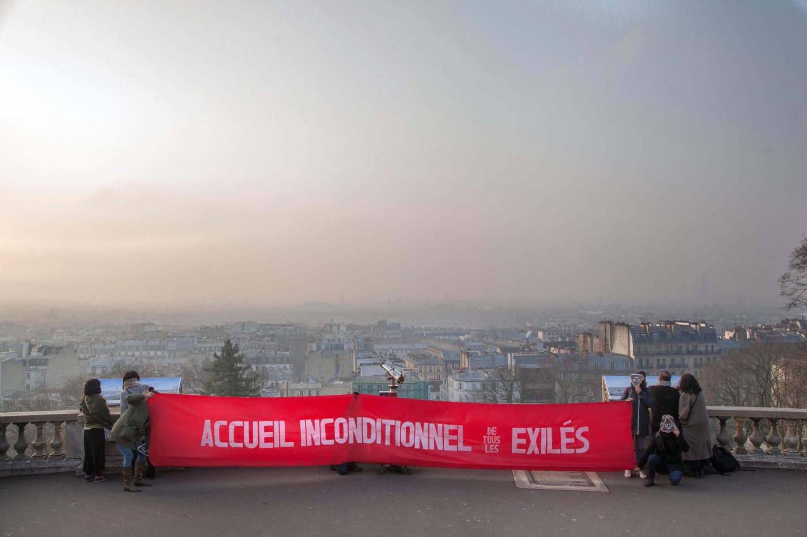
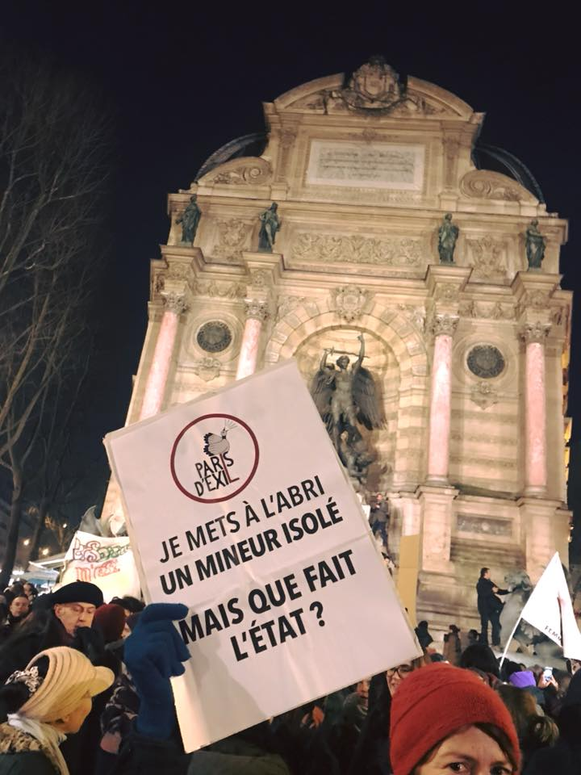
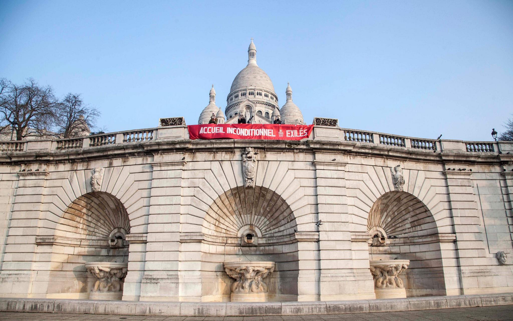
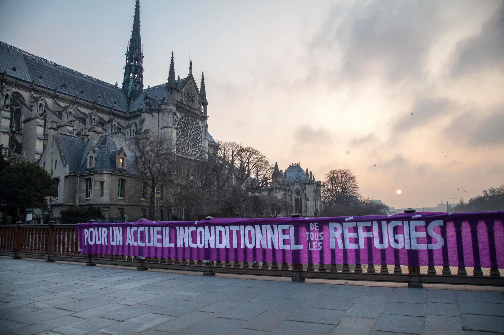
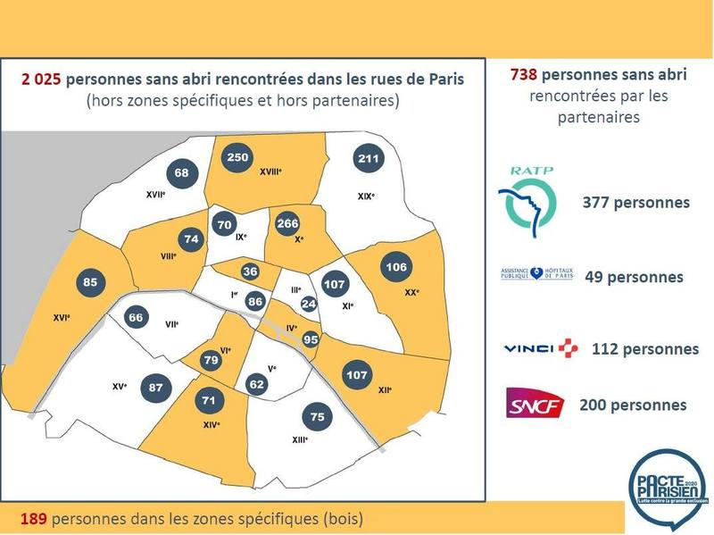

### AYS Daily Digest 21/02/18: France unveils repressive immigration and asylum law

_Concerns about cooperation between Bulgarian and Turkish border guards // At least 3,624 people sleeping in the streets of Paris //Rescue operation obstructed near Rhodes in Greece_

Photo by BAAM
#### France

The government presented its new immigration bill today, which the association BAAM says “marks an ultra\-repressive turning point in migration policy”\. It points out that the law reduces the time to submit an asylum application from 120 days to 90 days\. The law also reduces the appeal period from one month to 15 days and increases the maximum period of confinement in a detention center from 45 days to 135 days\. Meanwhile, the appeals before the National Asylum Court is becoming non\-suspensive for some, meaning that they could be deported before a decision is taken about their appeal\.

The association Cimade says the whole spirit of the law seems to be to discourage people from seeking asylum, in particular those who are fragile, hesitant and less informed\. The law also seeks to accelerate deportations\. Amnesty International accused France of “still not living up to its responsibilities” with regard to the reception of refugees\. Director of Action for Amnesty International France, Catherine Gaudard said:

> “ _Macron had carried strong messages on human rights\. Nine months after his election, it’s clear that this speech has not translated into facts_ ”\. 

The presentation of the law was marked by protests in Paris\. Banners were displayed across the city to protest against bad reception conditions and a repressive immigration policy\.

“I shelter an unaccompanied minor\. But what is the state doing? “\. Paris d’Exil

Employees of the National Asylum Court, which reviews appeals from OFPRA decisions, have gone on strike and also protested against the law today\. In an interview with [Streetpress](https://www.streetpress.com/sujet/1518608463-greve-juges-asile-immigration) , one employee said the shortened delays will increase their workload and make it more difficult to make correct decisions\. He insisted that their role is not to manage the “influx” of asylum\-seekers but to listen to stories of suffering and evaluate asylum cases\. He added that behind asylum cases there are men and women, that they are not only numbers\. OFPRA employees have now also joined the strike\.

](assets/254d49f0df96/1*fIWuuFafZpyiqjILuhI6yw.png)

[CNDA en Grève](https://twitter.com/CNDAengreve)
### 3,624 people sleeping in the streets of Paris

The city of Paris, with the help of volunteers, has tried to count the number of people living in the streets\. It encountered 2,025 people, in addition to 200 sleeping in train stations, 49 in hospitals, 377 in metro stations, 112 in private parking and 189 in public parks\. 672 were sleeping in temporary emergency shelters due to the cold weather\. The number is very much a minimum, as many places remain unexplored, especially in construction sites and near the Paris ring road where a lot of refugees are sleeping\.

This comes as easterly winds from Siberia will bring increasingly cold conditions to Northern Europe this weekend and into next week\. Perceived temperatures could reach up to \-20° in the larger Paris region\. Some ways to help: Donate to [Care4Calais](https://mydonate.bt.com/donation/v4/chooseAmount.html?charity=164447&currentMonth=1) who will distribute clothes and tents in Calais and Paris\. Directly bring clothes and sleeping bags to the St\. Bernard de la Chapelle church in Paris, which does distributions every weekend\.
#### Turkey
### Hostility towards Syrians in Turkey’s urban areas

[Infomigrants](http://www.infomigrants.net/en/post/7667/report-authorities-need-to-combat-hostility-towards-syrian-refugees-in-turkey?ref=tw) features a new report by the International Crisis Group that says people have become increasingly hostile towards Syrians in Turkey’s urban areas\. At least 35 people, 24 of whom were Syrian, have died in clashes between Syrians and locals in Turkey in 2017\. The potential for tension is particularly high in low\-income communities and in neighborhoods with a strong presence of ethnic and sectarian minorities according to the report\.
#### Bulgaria
### Concerns about cooperation between Bulgarian and Turkish border guards

[Novonite](http://www.novinite.com/articles/188106/Marie-Christine+Vergiat%3A+The+Teaming+Between+Bulgarian+and+Turkish+Border+Guards+is+Disturbing) reports EU MEPs visited the Bulgarian land border with Turkey from 12 to 14 February\. Marie\-Christine Vergiat, who led the delegation expressed her concerns:

> “ **The issue of major concern for us was to see the efficiency of the cooperation between the Bulgarian and the Turkish border guards** \(…\)Last week the European Parliament adopted a report on human rights in Turkey, and this police cooperation was puzzling us, especially since **both sides were telling us that when they saw large groups of people on the Turkish side of the border, that the Bulgarian border guards called on the Turkish border guards\.** So this avoids the push\-back \(…\) From the way the \[Bulgarian authorities\] answered to many of our questions, the least we can say is that we can have our doubts\. **When they tell us: “we alert the Turkish border guards”, this is tantamount to push\-backs, made by the Turkish authorities, following a gentle notification from the Bulgarian authorities\.** These people are simply prevented from claiming for asylum at the border, and maybe among them are Turkish citizens”\. 

#### Greece
### Turkey obstructs rescue operation

Local news outlet dimokratiki\.gr says two Turkish aircrafts hindered a Greek coastguard boat as it was attempting to rescue 15 refugees near the island of Rhodes\. The “extremely risky maneuvres” of the Turkish aircrafts made it difficult for the Greek coastguard vessel to tow the half\-sunk boat\. On Tuesday, 29 people were stopped by the Turkish coastguard while trying to reach Kos and 53 while trying to reach Samos\.

48 people arrived on Lesvos and 40 on Samos\. 55 people were registered to Kos while 19 were transferred from Chios and 12 people from Lesvos\. In total, 342 refugees departed from Lesvos to the mainland in February according to UNHCR numbers while 322 arrived on the island\.

On Lesvos shots were fired by two farmers against refugees near the Moria camp, claiming they were stealing their animals\.
#### Italy
### Threats agains volunteers and refugees in Rome

Baobaob Experience volunteers were threatened by racists:

“The defenders of the homeland have come to visit us again\. Not to bring food, or curtains, or for a journalistic service, but to intimidate us and threaten the volunteers and guests who at that time were at the entrance of the camp”\.

This comes as migration seems to have become the biggest focus of political parties ahead of the March 4 election, with parties like Lega Nord spreading the idea of refugees as a security threat\. The Macerata shooting, in which a right\-wing extremist wounded six Africans in a drive\-by shooting, was even blamed on Italy’s permissive migration policy by Silvio Berlusconi\. **It has become the victim of the shooting that is to blame — it isn’t the shooting itself that is marking the elections but rather the origins of the victim itself that have become the focus\.**

](assets/254d49f0df96/1*g6Ee5mcxa9NmL7J0pw_XMQ.png)

Photo by [Matteo Nardone](http://www.matteonardone.com/)
#### Spain
### 55 people rescued at sea

The Spanish coastguard rescued 55 people from a boat that was adrift in the Alboran Sea\. One person was brought to the hospital because of hypothermia\.
#### Balkan Weather Report

This week AYS is forwarding a weather forecast from the Balkans as many people are on the move in the region right now\. We have reports of a large number of new arrivals in Bosnia, trekking through remote areas at freezing temperatures to reach Sarajevo\.
#### Montenegro

Tomorrow will be moderately cloudy during the first part of the day with a chance of rain, and in the south short periods of rain and thunder could happen\. In the higher mountains snow is expected\. The wind will be moderate to strong\.

The temperature during the morning will be \-2 to 9 and 3 to 15 degrees during the day\.
#### Serbia

Tomorrow will be predominantly cloudy with rain while it will snow in the mountains, increasing the height of the snow cover\. Most precipitation is expected during the first part of the day\. The wind will be weak to moderate blowing from southeast and east\. In the mountains of east Serbia strong to stormy winds are expected\. The temperature will be ranging from \-1 to 4 degrees in the morning and from 1 to 8 degrees during the day\.
#### Bosnia and Herzegovina

Cloudy unstable weather with snow or rain is expected in most parts of Bosnia\. The winds will be moderate to strong blowing from south\-east or east\. The temperatures will be from \-2 to 2 in most parts of the country and from 6 to 10 in others\. The unstable weather will become very cold towards the weekend and next week\.
#### Croatia

It will be predominantly cloudy, land inwards it will snow especially in the mountains, while alongside the coast it will occasionally rain\. Moderate to strong northeast winds will be blowing landwards while moderate to strong winds are expected alongside the coast\. On the mainland the temperatures will be generally between \-3 to 2 and from 1 to 11 alongside the coast\.
#### General
### Drop in border crossings

Amidst reports of concerning cooperation between Bulgarian and Turkish border guards, the obstruction of a rescue operation by Turkish coastguards and other measures to close off Europe, Frontex has announced that the number of migrants entering the EU has fallen by 60% compared to 2016\. Last year, around 205,000 people arrived illegally in the EU compared to 511,000 in 2016\. Frontex says the decline was prominent on the eastern Mediterranean migratory route connecting Turkey and Greece as well as on the central Mediterranean route which connects Libya and Italy but that there was an increase on the route from Morocco to Spain\.

**We strive to echo correct news from the ground through collaboration and fairness\.**

**Every effort has been made to credit organizations and individuals with regard to the supply of information, video, and photo material \(in cases where the source wanted to be accredited\) \. Please notify us regarding corrections\.**

**If there’s anything you want to share or comment, contact us through Facebook or write to: [areyousyrious@gmail\.com](mailto:areyousyrious@gmail.com)**

_Converted [Medium Post](https://medium.com/are-you-syrious/ays-daily-digest-20-02-18-france-unveils-repressive-immigration-and-asylum-law-254d49f0df96) by [ZMediumToMarkdown](https://github.com/ZhgChgLi/ZMediumToMarkdown)._
