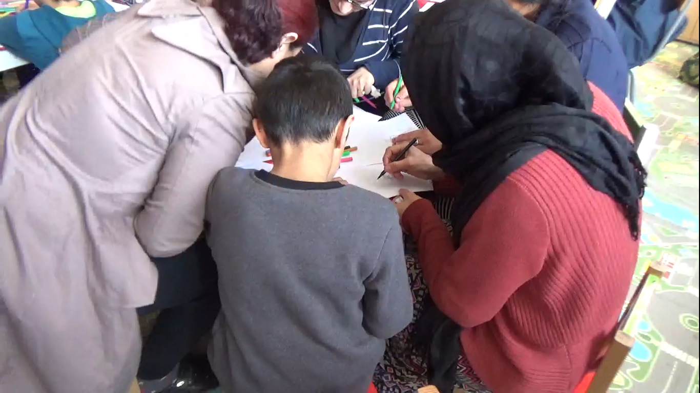
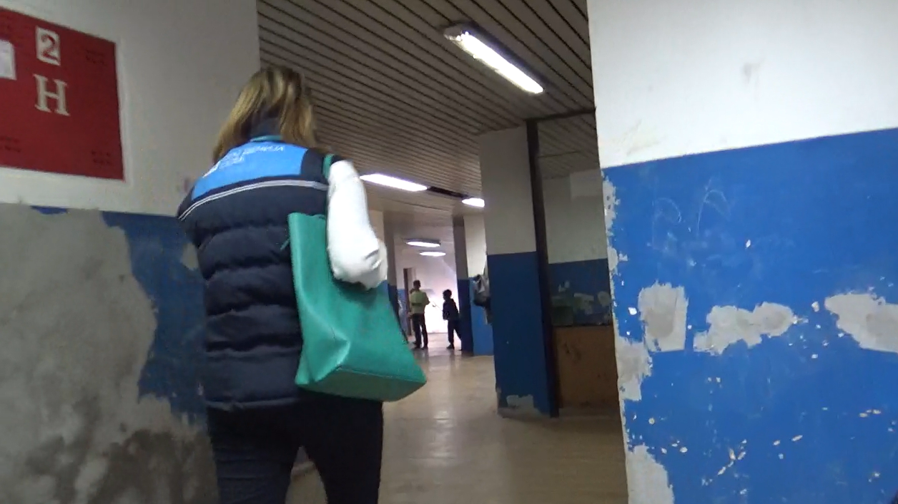
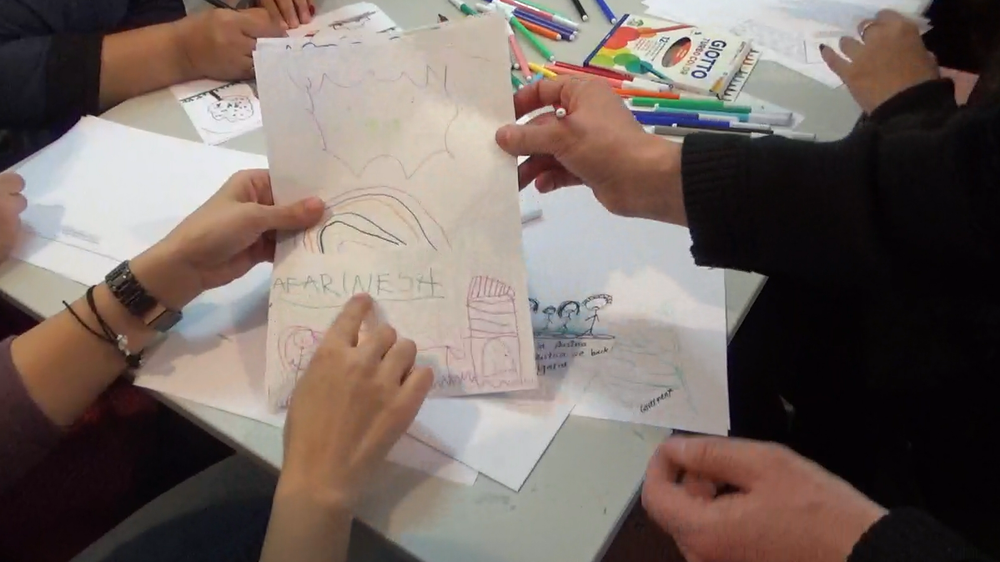
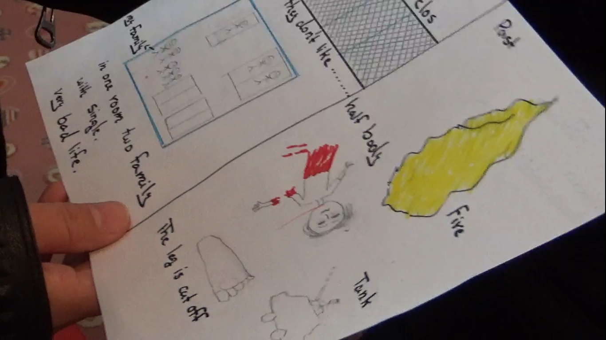
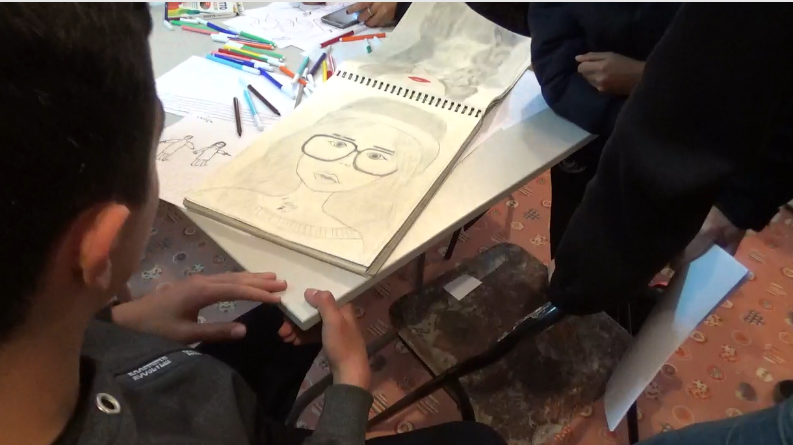

### AYS SPECIAL FROM SERBIA: _“Are you here to open the borders?”_

_A volunteer story from Serbia and detailing Elizabeth Pennington’s work alongside Paris\-based Irish artist Bryan McCormack and his colleague Stratis Vouyoucas, from France on an art project called ‘Yesterday, Today, Tomorrow,’ by McCormack\. McCormac and Stratis have been travelling around refugee camps, centres and squats in Europe for around 18 months, asking refugees to draw their past life \(yesterday\), their current life \(today\) and their future life \(tomorrow\) \._

In Serbia alone, there are approximately 4,500 refugees\. Many unaccompanied children from Middle Eastern countries such as Syria, Iraq and Afghanistan\. It is a crisis that has fallen away from the World’s media\.

I recently travelled to Serbia, working alongside Paris\-based Irish artist Bryan McCormack and his colleague Stratis Vouyoucas\. We were working on an art project called _‘Yesterday, Today, Tomorrow,’_ by Bryan McCormack\. He and Stratis have been travelling around refugee camps, centres and squats in Europe for around 18 months, asking refugees to draw their past life _\(yesterday\),_ their current life _\(today\)_ and their future life _\(tomorrow\) \._ I began working on this project in October 2016 at my university in England\. Now, fast\-forward another 18 months from that time, we have taken the project to Italy, France and now to working directly in the centres in Serbia\.

**Adasevci Centre: 12th February 2018:**

On the first day, on a cold February morning, we arrived at our first centre, Adasevci, close to the Serbian/ Croatian border\. I was nervous, anticipating all I would see and all I would hear\. Walking through the doors of the centre, surrounded by fencing, a new addition, we were greeted by curious stares and smiles\.

The room that we would be working in, felt like a pre\-school, with children, no more than 5 years old, and their mothers\. There were a number of nationalities, Iraqi, Afghan, Iranian as well as a woman from Sierra Leone in West Africa\.

Immediately, I was struck by a young girl who was perhaps 3 years old from Iraq\. As we began the project, handing out the paper and pens for the drawings, her eyes widened with excitement\. She proceeded to draw _many_ colourful swirls, regularly holding up her artwork for approval\.

If we didn’t respond she would tap us to get our attention\. It was heart\-warming and heart\-breaking all at the same time\. For the most part, these children’s lives have only been spent in war and they have more than any child should have to see\. The centre was by the side of a busy motorway with young children playing right alongside as cars raced past\.

**Principovac Centre: 12th February 2018:**

_“Are you here to open the borders?”_ This was the first question I received from an Afghan woman in Principovac Centre just a few metres shy from the Croatian border\. I was numb having only just travelled from the Adasevci Centre\.

Principovac is a former hospital for children who are mentally handicapped, now a centre for refugees\. With very strict rules and guidelines enforced by the Commissariat _\(the governing body for all the refugee centres in Serbia\),_ there are fears that the centres will close, becoming more and more like a detention centre with nobody allowed to enter or leave\.

In Principovac, I met a 13\-year\-old artist, a painter, from Kabul, Afghanistan\. She had been at the centre for approximately a year\. “ _Art is what keeps me_ alive _,”_ she tells me\. I could see both the raw determination and the pain from the last few years of her life, all that she has sacrificed in order to give herself the best opportunities for her future\.

Also, I met a toddler, around 18 months old who was born in the centre\. Her mother brings her to the centre each day and leaves her, meaning that the NGO’s present practically became her family\.

What was perhaps most shocking to me was that if a child is born in a refugee camp or centre, the child is stateless\. They will have no rights, making the situation all the more horrific and tragic\. As I walked around the room, watching as the refugees drew their memories, their lives today and their aspirations, one, in particular, caught my eye and needed no explanation\.

A woman from Afghanistan had drawn the memory of seeing _“half a body with the leg cut off”_ read the words beneath as she explained her drawing to me via a translator\.

Another drawing detailed how the Taliban mutilated corpses after a car bomb attack in Kabul\.

**Obrenovac Centre: 13th February 2018:**

The next day, we travelled to Obrenovac Centre on the outskirts of Belgrade\. It is a former army barracks, now a well\-equipped space for refugees with gym facilities and a recreation game room\. The centre is entirely for single male refugees and unaccompanied male minors bringing the total to around 900 refugees\. It is the largest refugee centre in Serbia\. The men and boys have classes in a variety of subjects: English, Serbian, Mathematics, Geography and Civil Rights\. We were told that one member of the centre began to cry when he was told about human rights, something that he had never had or known about in Afghanistan\. While at Obrenovac, I met a young man, 21 years old, again from Kabul\. He explained to me how he hid in the forests in Bulgaria for 4 days, watched as people drowned on the crossing from Turkey\. He said: _“there was no difference between being beaten by police in Bulgaria and being beaten by the Taliban\.”_

I had no words\.

At night, I was restless, my mind racing, having nightmare after nightmare from the previous days spent at the centres\. During the day, I was often either numb or in a kind of dazed state as I struggled to process what I was seeing and hearing\. The crisis in Serbia is intense with thousands simply waiting for answers, unsure of what the next day will bring\.

If there is one thing that I have learned through this experience, it is that we all have a voice that needs to be heard, no matter what nationality we are, our religion, the language we speak\. We are all human, we all have gifts and talents to share and we should not be made to feel inhuman\.

**_\(By Elizabeth Pennington, volunteer\)_**

You can read the story on Elizabeth’s blog [here](https://epenningtonarticles.wordpress.com/2018/02/16/refugee-crisis-in-serbia/) \.

**We strive to echo correct news from the ground through collaboration and fairness\.**

**Every effort has been made to credit organizations and individuals with regard to the supply of information, video, and photo material \(in cases where the source wanted to be accredited\) \. Please notify us regarding corrections\.**

**If there’s anything you want to share or comment, contact us through Facebook or write to: [areyousyrious@gmail\.com](mailto:areyousyrious@gmail.com)**

_Converted [Medium Post](https://medium.com/are-you-syrious/ays-special-from-serbia-are-you-here-to-open-the-borders-e5d7f609678) by [ZMediumToMarkdown](https://github.com/ZhgChgLi/ZMediumToMarkdown)._
