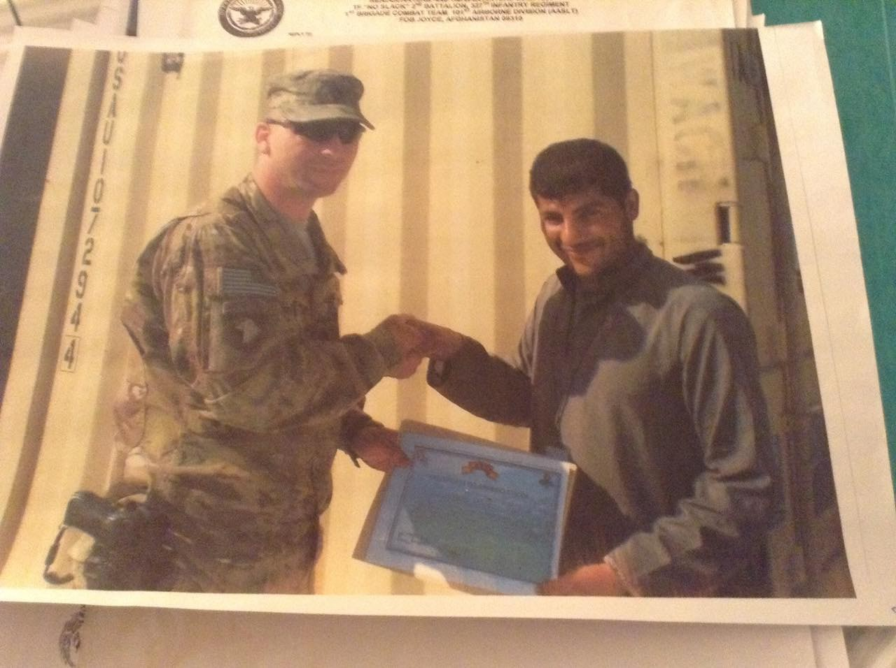

### AYS Daily Digest 22/02/18: Unjust detentions in the UK

_Amnesty report condemns EU policies / UN calls EU to end detention of children / Forced returns to Turkey / Greek man who shot refugees released / Increasing number of people passing through Bosnia / And more news…_

 \)](assets/d3dec23ffc04/1*R_yQthcwWKdiDsemFzStEw.jpeg)

No one is illegal\! \(Photo by [Faces Before Numbers](https://www.facebook.com/pg/FacesBeforeNumbers/posts/?ref=page_internal) \)
### FEATURE: UK

Today the [Detained Voices](https://detainedvoices.com) organization announced a hunger strike by approximately 120 asylum seekers who are being detained in the Yarl’s Wood facility\. These are people who are being detained for violation of immigration laws and illegal border crossings — in other words, the crime of seeking safety and a better life\. The hunger strikers argue that it is not themselves but the UK government that is acting criminally\. The group has put forward a [list of demands](https://detainedvoices.com/2018/02/21/yarls-wood-detainees-began-a-hunger-strike/) by the hunger strikers:

> The violation of Habeas Corpus… If someone’s Liberty is to be taken, let it be taken not lightly and by a qualified Judge in a court of Law\. The majority of detainees \[in the UK\] are not detained by a Judge\. 

> The UK is the only country in the EU with no time limit on detention and people are detained indefinitely pending the Home Office’s incompetent and untimely manner in handling cases\. 

> Rape: The Home Office refuse to accept that rape is torture, we find this fundamentally offensive as they continue to detain victims of sexual and gender based violence\. 

> Victims of Torture, Human trafficking, modern Slavery, asylum seekers and sick and disabled people continue to be detained\. 

> Young Adults who come as minors and are culturally British are detained because of parent’s failure to complete paperwork 

> The healthcare system does not meet the needs of most detainees\. Ailments are left to become dire before being dealt with if at all\. 

> The L\.G\.B\.T community is affected negatively due to prejudice, even discontinuing hormone treatment for transgender people\. 

One of the hunger strikers put forward a statement which was published anonymously by Detained Voices, so as not to jeopardize their case\. The woman’s words give some sense of what daily life is like for those trapped in this facility:

> I know that the Home Office works tirelessly to deport people no matter what their circumstances, what they may or may not do, I am sick of feeling like a helpless institutionalised victim and refuse to participate in detention\. 

> From Monday the core group of activists will not work for £1 an hour in their kitchens or gardens, we refuse to help them detain us\. 

> We are not your guests, we are your captives whom you choose when to detain and when to release and when to deport\. 

### GENERAL

Today Amnesty International released their [annual report](https://www.amnesty.org/en/documents/pol10/6700/2018/en/) on the state of human rights across the world\. The report harshly criticized the treatment of refugees and asylum policies throughout the EU\. From the [report](https://www.amnesty.org/en/documents/pol10/6700/2018/en/) : “Leaders of wealthy countries have continued to approach the global refugee crisis with a blend of evasion and outright callousness, regarding refugees not as human beings with rights but as problems to be deflected\.”

The report also noted the threat that growing far\-right movements across Europe pose to human rights\. Far right parties in France, Hungary, Germany, and elsewhere have advocated for inhumane and often illegal policies to deter and deport refugees\. The authors of the Amnesty report wrote that, “in this climate, state\-sponsored hate threatens to normalise discrimination against minority groups\. Xenophobic slogans at a nationalist rally, sweeping crackdowns on LGBTI communities … open advocacy of intolerance is increasing\.”

The report singled out Hungary for especially arbitrary and inhumane treatment of migrants\. As an EU border country, there are many refugees attempting to enter Hungary, and the government currently only allows ten asylum applications to be submitted on its borders per day\.

Finally, the report attacked the EU for its collaboration with “buffer states” to deter and detain refugees\. The EU is funding both Libya and Turkey for this purpose, despite the fact that both countries largely ignore the human rights of refugees\. Refugees in Turkey have reported abuse and torture at the hands of officials\. As the report noted, “Turkey has become even more unsafe for refugees since the 2016 coup attempt\.” Refugees in Libya often face imprisonment, ransom, and ensalvement at the hands of EU\-funded militias\. Amnesty found that “up to 20,000 refugees and migrants were held arbitrarily and indefinitely in overcrowded, unsanitary, detention centers and exposed to torture, forced labor, extortion and unlawful killings at the hands of the authorities and militias who ran the centers\.”

UN children’s rights experts have [called upon the EU](http://www.ohchr.org/EN/NewsEvents/Pages/DisplayNews.aspx?NewsID=22681&LangID=E&utm_source=ECRE+Newsletters&utm_campaign=573d26c943-EMAIL_CAMPAIGN_2018_02_21&utm_medium=email&utm_term=0_3ec9497afd-573d26c943-422318901) to end the detention of child refugees across all member states\. The detention of children is currently permitted as a “last resort” in the EU\. However, the detention of children is a common practice in many EU countries\. Last year on the French mainland, there were 275 refugee children held in detention centres\. Renata Winter, Chairwoman of the UN Committee on Children’s Rights said that, “there can be no exceptions to this principle\. All EU Member States have ratified the UN Convention on the Rights of the Child, and there should be no provisions in EU law that allow for practices that violate EU Member States’ international obligations\.”

The Civil March for Aleppo organization is forwarding a list of solidarity marches and actions against the atrocities in eastern Ghouta\. There will be marches throughout Europe, in Turkey, as well as Canada\. See the full list of activities [here](https://www.facebook.com/CivilMarchForAleppo/posts/572466779755992) \.
### TURKEY

The UNHCR has put out a warning that there is false information circulating on social media regarding the asylum processes in Turkey\. The agency is telling people not to trust any information that is put out on social media, particularly on Facebook\. All UNHCR services are free, so don’t trust anyone asking for payment to help with resettlement or registration procedures\.

The Turkish Coast Guard \(TCG\) intercepted two boats carrying refugees yesterday and forcibly returned them back to Turkey\. There were a total of 98 people aboard both boats\.

](assets/d3dec23ffc04/1*g5BUZJinzce-5SB0zeayqg.jpeg)

Courtesy of [Aegean Boat Report](https://www.facebook.com/AegeanBoatReport/)
### SEA

The [Refugee Rescue “Mo Chara”](https://www.facebook.com/RefugeeRescueUK/?fref=mentions) organization is fundraising this week\. Please click [here](https://www.facebook.com/RefugeeRescueUK/?fref=mentions) to support their work\.

> In the last month alone, the team helped ensure the safety of 87 women, 146 men and 127 children, who were driven to attempt the dangerous sea crossing from Turkey to Greece\. 

> For many refugees, the helmets and friendly faces of the Refugee Rescue team mark the end of a terrifying journey\. And it’s your generosity that’s enabling to continue delivering this vital work\. 

### GREECE

A Greek farmer shot in the direction of three refugees on Lesvos yesterday\. The victims of this crime are still in detention while the perpetrator was released today\. When the shooter was released from jail, he was met with cries of celebration from a far\-right crowd\. Sadly, the farmer is not only being supported by violent right\-wing elements, but also by the mayor of Lesvos\. It was stated in court that the perpetrator owned 4 guns, 166 bullets, and two wooden bats\. He made no expression of remorse during the proceedings\.

The farmer being released to celebratory cheers\. \(Photo by AYS\)

■■■■■■■■■■■■■■ 
> **[NoBorders](https://twitter.com/Refugees_Gr) @ Twitter Says:** 

> > it is unbelievable that 24 hours now we have no news from the side of the refugees. That's what happens when you exclude and oppress people, generally. The results are dangerous, for all of us. 
#refugeesgr [twitter.com/Refugees_Gr/st…](https://twitter.com/Refugees_Gr/status/966795005473026050) 

> **Tweeted at [2018-02-22 22:11:36](https://twitter.com/refugees_gr/status/966797648773767168).** 

■■■■■■■■■■■■■■ 

It was reported today that the Vial camp on Chios had no running water\. Volunteer organizations on the island have also been protesting the lack of acceptable food this week\.

■■■■■■■■■■■■■■ 
> **[Miss Montag](https://twitter.com/miss_montag) @ Twitter Says:** 

> > 22.02.2018, #Vial, #Chios. No electricity, but a lot of water... dirty water. https://t.co/ShBXFWopla 

> **Tweeted at [2018-02-22 17:40:45](https://twitter.com/miss_montag/status/966729489198743552).** 

■■■■■■■■■■■■■■ 

The [Boat Refugee Foundation](https://www.facebook.com/stichtingbootvluchteling/?hc_ref=ARS4r0dmJ00h-L3Un8YbOgcYvxgKqm9wcW4y3sW4zj9bJRNwLfzblgoPdvE2ygFf5qg&fref=nf) , which provides medical care and other services, announced that it will be returning to the Moria camp on Lesvos due to the lack of medical care being offered by Greek authorities\.

> On the 31st of December 2017, Boat Refugee Foundation withdrew its medical mission from camp Moria\. It was not possible to run the mission on our desired level during that time, combined with a lack of sufficient funds\. Unfortunately, we see now that the capacity of the current local care providers to ensure long\-term medical care for the camp inhabitants is lacking\. For this reason, we have decided to restart our medical mission as per 1 May 2018\. 

The Welcome Project, a startup which aims to employ and empower refugee women in Ritsona, is looking for a long term project coordinator\. Click [here](https://www.facebook.com/iamyourescue/posts/1915232595185126) for more details\.
### SERBIA

NGOs are hosting a [“Human Library”](https://www.facebook.com/events/1824659970901122/) in Belgrade this coming Saturday\. The event is free, but organizers are asking people to [RSVP here](https://docs.google.com/forms/d/e/1FAIpQLSdREvXdGw14w4ZQg4YhmupZtm52oQltKfZW0vlvR2yrvpkCsQ/viewform) \.

> We are inviting you to participate in Human Library event around the topic of migration\. Come and listen to unique stories that our “books” will share with you, on February 24th between 18h\-20h at KC Grad\. Find out how Syrians live in Serbia, what people who work with them come across in their daily work, how does it look like being a foreigner in Belgrade or working every day with people who try to cross the borders in search of a better life… and a lot more\! 

### BOSNIA AND HERZEGOVINA

Bosnian security minister Dragan Mektic has reported that there has been an approximate 600–700% increase in arrivals of refugees to the country\. The increase in arrivals is likely due to the closure of the “Balkan route” \(pictured below\), and the increased patrols and militarization of other borders in the region\. Most refugees who arrive in Bosnia are on the move to other destinations\. According to data from the UN, while 376 asylum requests were filed in Bosnia last year, 43 percent of applicants left Bosnia before the end of the year\.

](assets/d3dec23ffc04/1*c0BeqI-lwAbEuNNv_HF69Q.png)

Graphic Credit: [InfoMigrants](http://www.infomigrants.net/en/post/7702/bosnia-700-increase-in-arrivals-of-migrants)
### BALKAN WEATHER FORECAST \(for 23/02\)
#### Montenegro

Cloudy with some sunny intervals and warmer weather\. During the morning rain in the southwest and west and fog in the north are expected\. The wind will coming from the east and is expected to be weak to moderate, alongside the the coast and in the north moderately strong to strong\. The lowest temperatures will be during the morning ranging between \-2 and 10 degrees and the highest during the day between 5 and 17 degrees\.
#### Serbia

During the morning slight rain or snow is expected, while it will be mostly dry during the day\. The winds coming from the east and southeast winds will be strong in the mountains of eastern Serbia\. Morning temperatures will be between 0 and 3 degrees at night and during the day 5 to 9 degrees\.
#### BiH

Friday in Bosnia will be cloudy\. Light snow is expected in the west and north of the country, not so much in the central part while in the south\-west rain or sleet may occur\. In Herzegovina, there will be light rain in the morning\. In the evening hours towards the end the day the weather will start clearing up\. Wind will be weak to moderate blowing from the north and northeast\. The lowest morning temperature will be between \-2 and 1 degrees, in the south of the country between 3 and 6 degrees\. The day temperature will be between 0 and 6 degrees, in the south of the country between 9 and 14\.
#### Croatia

Friday will be cloudy with precipitation while the northern parts of the coast will be windy\. Land inwards it will occasionally snow, in the far east east there will be sleet and rain which could freeze due to the light temperatures\. The most snow is expected during the night especially in the morning in the central part of the country and in the mountains\. Alongside the coast it will mainly rain, with most rain during the morning hours, while on the north coast some snow can fall\. Wind will be moderate to strong blowing from the northeast also alongside the coast, land inwards in the Velebit area very strong and stormy winds are expected\. The temperature land inwards will be between \-3 to 2, in some parts slightly higher\. Alongside the coast the temperature will be between 4 to 9, and in the south of 9 to 14 degrees\.
### FRANCE

Similarly to the UN panel of children’s rights experts, France’s human rights ombudsman Jacques Toubon demanded an end to the detention of child refugees in the country\. 275 children were held in detention facilities in 2017 on the French mainland\. Toubon issued a report which noted that France’s practice of child detention is in violation of international conventions on child’s rights\. France has also been condemned multiple times by the European Court of Human Rights for detaining families with children\. Toubon’s report demands that France change policies allowing these detentions\.

In an [interview today](http://www.lemonde.fr/idees/article/2018/02/22/jacques-toubon-le-demandeur-d-asile-est-maltraite-par-ce-projet-de-loi_5260748_3232.html) with Le Monde, Toubon also heavily criticized new asylum laws in France \( [reported on yesterday by AYS](ays-daily-digest-20-02-18-france-unveils-repressive-immigration-and-asylum-law-254d49f0df96) \) \. Toubon stated that these new laws will only increase the likelihood of mismanagement of asylum cases, given the new accelerated procedures\.

While the detention of children is an acute issue on the mainland, it is even worse on the French island of Mayotte off the coast of East Africa, where 4,285 children were held in detention facilities in 2016\.

In proof of Toubon’s criticism, two families have been detained in the past 24 hours in the Mesnil\-Amelot detention center in north\-central France\. Both families have young children, one family has a 6 month old infant, and the other children who are two, six, 10, and 12 years old\. The [Cimade](http://agir.lacimade.org/retention) organization has started a petition to end the practice of child detention, you can see it [here](http://agir.lacimade.org/retention) \.

Volunteers are warning Afghani people not to go to the Afghan embassy in Paris to get a passport\. Rumours that you should get a passport there are false, as going to your embassy is a legal ground for OFPRA to terminate your protection\. If you are an asylum seeker you will not be granted asylum or protection if OFPRA knows that you have been in contact with your embassy\.

A French psychologist and independent volunteer has organized a speaking group in Paris for refugees to talk through issues they are facing\. While the group is currently mostly minors, it is open to all\. You can [contact her](https://www.facebook.com/juliette.manoutch) through a Facebook private message to learn more\.

We are still following our friend Abdul Sabor, an Afghani refugee who wrote [a letter from Paris](ays-daily-digest-9-2-2018-letter-from-paris-55aeccc1f21a) recently for AYS, and went through the Balkans in order to reach France\. Abdul is a friend everybody wants to have: a good, honest, amazing human being\. However, asylum service in France rejected his claim\. His story serves as an example of the arbitrary and inhumane French asylum process\.

While his is merely one among countless unjustified rejections, his case is notable because he became a refugee after working for US and NATO forces in Afghanistan\. Given that France is a NATO member, they have an obvious obligation to protect those involved in NATO work\. Sabor wrote about his rejection today:

> I am really disappointed in the decision of the France government\. I worked as contractor with NATO for several years and I put myself and my family in serious risk in the battlegrounds of Afghanistan\. I condemn the judgment of the asylum office\. I had a normal life in Afghanistan but because of security reasons I had to leave my country\. I migrated to Europe not for economic ambitions, but only because my life was in danger after I worked as contractor with US troops and the NATO alliance\. 

> As a NATO member state France has responsibility to accept me as refugee\. During this horrible immigration to Europe I lost my health\. Also border police broke my hand and nose, and now I am mentally also unstable because I lost my hopes and dreams and trust\. I see this is as complete hypocrisy and a double standard\. 

> Shame on the people who took action against me\. 

> Where is human rights? Where is humanity? 

A photograph of Sabor receiving a recommendation from US troops\.

Over 3,000 people gathered in the French capital yesterday to protest the new asylum law\. From independent volunteer Lola Siran: “To see so many people raising their voices together was heartwarming and I can only hope that our governments will come to its senses and that this oppressive and freedom\-destroying bill will not be adopted\. A lot of refugees, asylum seekers and migrants were part of the march and it was so good to see them having their voices heard\.”

The UK charity [Help Refugees](https://www.facebook.com/HelpRefugeesUK/?hc_ref=ARR8OjIHbjxjLrUzfvPHCHeo10qt9Pfx1BlUKDwxV9Ro-EbH7Ei53qqjXMZQUltnvy0&fref=nf) put out a [joint statement](https://www.facebook.com/HelpRefugeesUK/videos/570558283304849/?hc_location=ufi) today with French NGO’s condemning the new asylum law:

> NGOs on both sides of the channel have condemned President Emmanuel Macron’s draft bill as “incompatible with internationally recognised human rights standards and provisions for refugee protection”\. 

> The draft bill would cut the deadline for refugees and migrants to apply for asylum from 120 days to 90 days following their arrival\. It would double the maximum period of asylum detention from 45 to 90 days\. The bill would also criminalize illegal border crossing, making it punishable by one year in jail and fines\. 

The volunteer group [Solidarithe](https://www.facebook.com/solidarithe/?hc_ref=ARSst6UX_cAFzRVoXihIDhQ_UMkz96tNuX8XAAFhRfCHAYjJNakj1A66wDj_G2ef0SI) commented today on the increasingly dire situation on the streets of Paris:

> The distribution yesterday was one of the most intense we have had in a while\. Amongst many things, an entire family from Afghanistan, with three kids and a pregnant mother arrived in Paris without anything\. We managed to get them some warm clothes while some of us tried to distract the kids with games and art\. Whilst other groups started the nearly impossible task of finding them a safe place for the night\. 

> The number of unaccompanied minors we meet every night is getting out of control\. As always,the number of people sleeping rough is increasing and the temperatures are really cold \(it will be even worst next week\) \. 

> Sometimes these situations can seem overwhelming and it is ridiculous that it falls on the shoulders of grass roots volunteer groups to sort it out\! 

 \)](assets/d3dec23ffc04/1*k8lQ3vm9zSCURcttftmvAQ.jpeg)

Refugees sleeping rough on the bank of the Seine\. \(Photo by [Fotomovimiento](https://www.facebook.com/Fotomovimiento.org/) \)

The [Paris d’Exil](https://www.facebook.com/cpse75/?hc_ref=ARSZk4p8GxyRcD-O7klb9n2EjSZvhq6X_sJiKdoDHFyxefsuV_XQNyHVz208NqteH1Y&fref=nf) organization released a statement today describing the neglect and abuse unaccompanied minors are facing at the hands of authorities:

> Leaving unaccompanied minors on the street has dramatic consequences\! 

> On a regular basis, we are told of desperate cases: Yes, there are attempts to commit suicide among young people who on the streets\. Yes, unaccompanied minors face rape\. Certain unaccompanied minors are reduced to lying about their age \(pretending to be adults\) to find accommodation\. 

> On a regular basis, the institutions themselves are appealing to us to host teenagers in extreme danger\. 

> In the last cases we have reported a young person who has been self\-harming, and another hospitalized for four months for intense burns he got at the Italian border, and has been amputated\. He comes out of the hospital and, like so many others, there is no room for him in the centre of accommodation \(they are reserved for adults, families, or full\) \. 

> Oh\! By the way\! The few young people who had been “welcomed” after the “cold plan,” and whose situation had to be re\-examined, had to go back to the streets\. 

An independent volunteer shared an alarming photo and report from the town of Tatinghem in northern France:

■■■■■■■■■■■■■■ 
> **[Brice Benazzouz](https://twitter.com/BriceBenazzouz) @ Twitter Says:** 

> > #Tatinghem 5 centimètres de boue. Quelques tentes posées sur des palettes pour tenter d'échapper au froid. Pas de toilettes. 1 heure de marche aller + 1h retour pour voir un médecin. #France2018 #CriseDelAccueil https://t.co/bBVKY4KJrv 

> **Tweeted at [2018-02-22 11:14:14](https://twitter.com/bbnzzouz/status/966632216284381185).** 

■■■■■■■■■■■■■■ 

**We strive to echo correct news from the ground through collaboration and fairness\.**

**Every effort has been made to credit organizations and individuals with regard to the supply of information, video, and photo material \(in cases where the source wanted to be accredited\) \. Please notify us regarding corrections\.**

**If there’s anything you want to share or comment, contact us through Facebook or write to: [areyousyrious@gmail\.com](mailto:areyousyrious@gmail.com)**

_Converted [Medium Post](https://medium.com/are-you-syrious/ays-daily-digest-22-02-18-unjust-detentions-in-the-uk-d3dec23ffc04) by [ZMediumToMarkdown](https://github.com/ZhgChgLi/ZMediumToMarkdown)._
