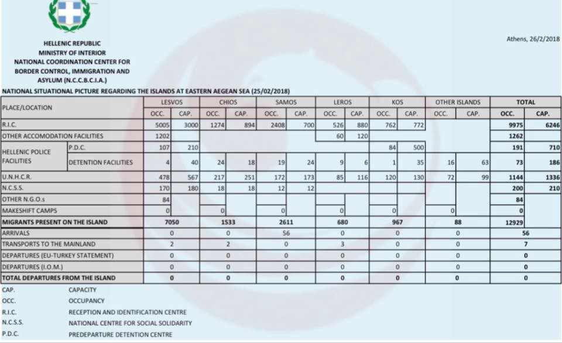
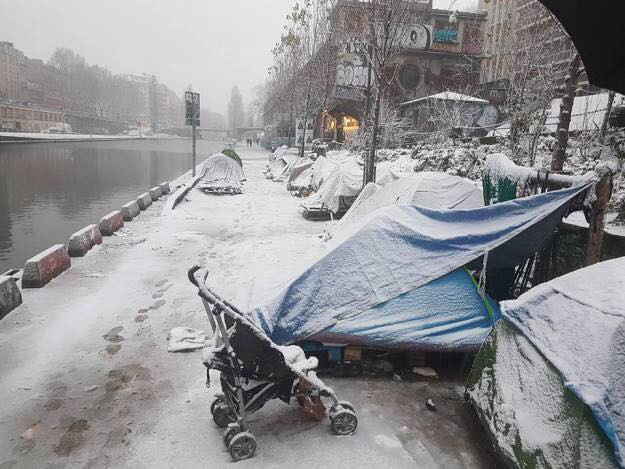

### AYS Daily Digest 26/02/18: Cease Fire in Syria is Another Broken Promise
#### _Italy gives mores ships to criminal Libyan Coast Guard//One refugee dies after making sea crossing//New arrivals in Greece//Fascists attack social centers in Athens//Snow in Rome endangers those on the streets//More Iranians seeks refuge through Serbia//And more…_

](assets/43e9c9555be4/1*HHLJFaaf8St56x1NWcZL7w.jpeg)

Paizzale Maslax\. 02\.26\.18\. Photo Credit: [**Umberto Masci**](https://www.facebook.com/umberto.masci.9)
### Syria — Feature

Although a UN cease\-fire treaty was announced this week, attacks on civilians have not stopped in Eastern Ghouta and Damascus\. Almost immediately after the cease\-fire was declared Eastern Ghouta was hit by missiles believed to be fired by Assad’s forces\.

For its part, Russia has rejected the UN cease\-fire, instead offering to stop shelling in the region for five hours a day\. The fact that five hours a day free of shelling could even be considered a “cease\-fire” speaks to the dire situation there\.

Today the [Syrian\-American Medical Society](https://www.facebook.com/SyrianAmericanMedicalSociety/?hc_ref=ARQDLaR6ZCRZDGW_390lO9stMsg20yxHtm9o16pNYsVhsRRPRbvERsrfmBFkOd7aq08&fref=nf) NGO released a statement and figures on the number of civilians killed this weekend\. They reported that the cease\-fire has had no effect on the ground, and has become a “dead letter”\. From their statment:

> On Saturday, 58 people were killed, and 136 injured\. On Sunday, 29 people were killed and 206, almost half of whom were women and children\. On this day, a SAMS\-supported hospital received 16 patients suffering from symptoms consistent with the use of a chemical weapon, chlorine\. One of these patients, a child, died due to exposure to the chlorine\. 

> We have also received reports from the United Relief Office that this morning, at 1 am local time, 11 people from one family were killed in airstrikes\. 

> From February 19 to 25, we have recorded 540 deaths in East Ghouta due to the horrific escalation\. Over half of whom are women and children\. Over 3,000 have been injured\. 

### Libya

The Italian government delivered [three additional patrol ships](https://betweenlibyaanditaly.wordpress.com/2018/02/25/italy-has-reportedly-delivered-further-vessels-to-tripolis-coast-guard-in-libya/) to the Libyan Coast Guard \(LCG\) this week\. Italy continues to cooperate with the Libyan regime and the LCG despite many documented instances of the LCG attacking refugees and forcibly returning them from international waters where they have no authority\) \.
### Turkey

This weekend the Turkish government [announced](https://www.euractiv.com/section/global-europe/news/turkey-says-un-syria-ceasefire-wont-affect-kurdish-offensive/?utm_term=Autofeed&utm_campaign=Echobox&utm_medium=Social&utm_source=Facebook#link_time=1519668986) that the UN security council’s demands for a 30 day cease fire in Syria will not stop their offensive against Kurdish troops in the Afrin region\. The Turkish offensive has already resulted in civilian casualties on both sides of the Turkish\-Syrian border\.

The Erdogan regime has harshly cracked down on any criticism of the Afrin offensive\. Over 700 social media users have been arrested for questioning the assault, and approximately 100 journalists and politicians have also been detained for speaking out\.
### Sea

A boat carrying five people was rescued off the coast of Spain and taken to the town of Tarifa this morning\. At mid\-day the Spanish medical group [Emergencias 112 reported](https://twitter.com/E112Andalucia/status/968176153222631428) that one of the five people died due to heart complications\. Accoriding to the [EuropaPress](http://www.europapress.es/andalucia/cadiz-00351/noticia-fallece-cinco-migrantes-patera-trasladada-tarifa-cadiz-20180226184515.html) outlet, all five people were taken to medical services, but doctors were unable to revive the man\. It is currently unclear how this death is related to the sea crossing, but it seems likely that this attack was caused or made worse by the extreme stress and physical exposure of the crossing\.

The Emergencias 112 team is reporting strong winds off the coast of Andalusia tomorrow, making crossing especially hazardous\.
### Greece
#### Islands

_Arrivals_

Today one boat was picked up off Samos by a German Frontex vessel\.
There were 33 people on board, 11 children, 9 women, and 13 men\.

](assets/43e9c9555be4/1*_WTJlLtH_DgJwm8MgNWk0g.jpeg)

Photo from landing on Kos this morning\. Photo Credit: [**Aegean Boat Report**](https://www.facebook.com/AegeanBoatReport/)

Another boat landed on Kos\. 36 people were reported on board, 9 children, and 27 adults\. These numbers have not yet been independently verified\.

■■■■■■■■■■■■■■ 
> **[Miss Montag](https://twitter.com/miss_montag) @ Twitter Says:** 

> > 26.02.2018, #Vial, #Chios https://t.co/Jd1KgEQXZL 

> **Tweeted at [2018-02-26 19:34:12](https://twitter.com/miss_montag/status/968207587840839680).** 

■■■■■■■■■■■■■■ 

■■■■■■■■■■■■■■ 
> **[RSA](https://twitter.com/rspaegean) @ Twitter Says:** 

> > Moria refugee camp during today’s rain - 5 000 refugees stranded in a camp with reported capacity for 3000 #atoxicdeal #WelcometoMoria #Refugees #Greece #Lesvos https://t.co/dTxuX8ddfH 

> **Tweeted at [2018-02-26 17:57:39](https://twitter.com/rspaegean/status/968183293765091328).** 

■■■■■■■■■■■■■■ 

The Greek Ministry of the Interior released their official figures for the number of people trapped on the Aegean islands yesterday\.

The [Health Point Foundation](https://www.facebook.com/healthpointfoundation/?hc_ref=ARTANeJzcMNTKHVksdKJ-QRM0TKFf4CeYXPjb5WQWaHHj9rd2dBzYxGmqQZ5FSgBqy8&fref=nf) is looking for volunteerd entitsts and dental assistants to help people on Lesvos:

> The dates we require volunteers are :11th\- 17th march, 18th\- 24th march, 1st\- 7th April 

> If there are other dates you are interested in please still get in touch\. Email us : dental@healthpointfoundation\.org 

#### Mainland

There were two attacks on social centers in Athens yesterday by fascists, including many Golden Dawn members\.

■■■■■■■■■■■■■■ 
> **[City Plaza Squat](https://twitter.com/sol2refugees) @ Twitter Says:** 

> > 2 separated fascist attacks last night in 2 social center in #Athens. In the 1st attack in #Favela social center 5 people injured including the lawyer of #Fyssas family. In the second attack at #panetoliou #squat, they tried to burn the building but it was unsuccessfull. #Antifa https://t.co/A5L0OWjHYf 

> **Tweeted at [2018-02-26 09:46:58](https://twitter.com/sol2refugees/status/968059807528816640).** 

■■■■■■■■■■■■■■ 

The [Drop in the Ocean](https://www.facebook.com/drapenihavet/) put out on update today on the situation in the Nea Kavala camp in Northern Greece:

](assets/43e9c9555be4/1*vjW5QtUb1CwJRyhAgUIvJA.jpeg)

Photo Credit: [A Drop in the Ocean](https://www.facebook.com/drapenihavet/)

> Winter is not over in Greece\! Amber Vandam, our coordinator in Nea Kavala refugee camp reports today: 

> “With temperatures reaching to \-12 degrees, Winter has arrived in Nea Kavala\. Our volunteers battled the snow and ice to ensure we were still able to distribute clothes & food, and provide our services to the residents of the camp\. 

> We had to cancel the bike rentals due to the poor conditions, which meant no class or supermarket for many\. Whilst the snow seemed beautiful for a short while, realities soon hit when we discovered the water pipes had frozen — no water to the showers or toilets, and only two working for drinking water\. The camp was quiet today, as everyone huddled around their heating — my only hope is that the electricity generator does not freeze over…” 

### AMKA

Today the [Mobile Info Team for Reufgees in Greece](https://www.facebook.com/mobileinfoteam/) published an [article](https://www.facebook.com/groups/1652972374920129/?hc_ref=ARRh3f6PhMZwTYARRusBjMK-JNo7JDTR5eXWp26gMSPMgRfsuU17k1LEQdMCC_iKq78) on how to get an AMKA number\. The article is available in Arabic and Farsi\. From the Info Team:

> What is AMKA?
 

> AMKA is the labor and national insurance number of all citizens in Greece and is the number/card you have to get to work and access welfare services in the country\. 

The [Open Cultural Center](https://www.facebook.com/OpenCulturalCenter/) is looking for volunteers in Polikastro\. 
Click [here](https://www.facebook.com/groups/1652972374920129/?hc_ref=ARRh3f6PhMZwTYARRusBjMK-JNo7JDTR5eXWp26gMSPMgRfsuU17k1LEQdMCC_iKq78) to find out more\.
### BALKAN WEATHER REPORT \(for 27/02\)
#### Montenegro

Tuesday will be moderately cloudy to cloud with occasionally snow, during the day alongside the coast heavy rain and snow are expected\. The wind will be moderate to strong blowing from the southwest and west\. During the morning the temperature will be between \-14 and \-3 while during during the day it will be between \-7 and 6 degrees\.
#### Serbia

It will be cloudy and very cold\. It will continue to snow\. The wind will be weak to moderate blowing from the east and southeast, creating snowdrifts\. The lowest morning temperatures will be ranging from 12 to \-6 and the highest daily from \-7 to \-4 degrees\.
#### BiH

The weather will be very cold and mostly cloudy with snow, up to 20 centimetres locally\. In the afternoon the clouds will clear up in some parts of the country\. The wind is expected to be weak to moderate blowing from the north and northwest\. In the morning it will be from \-12 to \-6, in the mountains up to \-20, in the south from \-5 to 0, and during the day from \-8 to \-4, in the south from 0 to 4 ° degrees\.
#### Croatia

It will be cloudy in the morning with snow in some parts of the country\. In the afternoon the weather will start clearing up\. The north wind will gradually turn weaker becoming weak to moderate on the mainland\. Morning temperatures from \-13 to \-8 land inwards and from \-5 to 0 alongside the coast, during the day between \-8 to \-4 land inwards and \-2 to 4 ° alongside the coast\.
### Serbia

Forwarding a report on a new trend of Iranian refugees and asylum seekers entering Serbia under tourist visas, written by the Serbian [Info Park](https://www.facebook.com/infoparkserbia/?hc_ref=ARRj2XeYT2AnXnuqryFozjp_ZvkFiknnENlo4MT_8MdScYLGB_jQyP3L9lZ-28HVQ6A&fref=nf&hc_location=group) team:

> Since the visa liberalization of Iranian citizens, over 6,000 “Iranian tourists” entered the country in the past five months, according to official Ministry of Interior data\. It is interesting that a large number of them decided not to return from Serbia to their country of origin, but to continue the illegal pathway towards Western Europe, which is presenting a new test to the migration management systems\. 

> According to the results of structured interviews of Iranian citizens, conducted by Info Park since the autumn of 2017, Serbia is used as a transit zone\- felt to be the safest and cheapest bypass to their final destination in Western Europe\. This situation accords with the bilateral agreement between Iran and Serbia on 22 August 2017; which introduced a visa liberalization allowing citizens of Iran to enter Serbia as tourists, with the right to stay up to 30 days\. 

> Although they entered Serbia as tourists, interviews have revealed that many Iranians use their stay in Belgrade to establish connections with smugglers, who will transfer them to their desired destination, across the borders of Croatia, Bosnia and Herzegovina, Hungary or Romania\. Interviewed respondents cite their reasons for fleeing Iran as the following: the sense of endangered human rights and freedoms, primarily in the domain of political, religious and sexual orientation\. Many Iranians want to go to a country where there is a greater chance of economic prosperity, and see in the West the prospects of a better life\. Among the interviewed population there are predominantly young couples or single men, who identify as Christians, LGBTQ population or as opposition voters\. They feel unsafe and that they have been subjected to persecutions in their country of origin\. 

### Italy

The Italy Refugee Crisis Database has shared a document of questions and answers on asylum seekers living in governmental reception centers and camps throughout Italy based on concrete cases supported\. The document is available in Italian, English, French, Spanish, Arabic, German, Dutch, Portuguese and Greek\. Click here to [download](https://l.facebook.com/l.php?u=https%3A%2F%2Flookaside.fbsbx.com%2Ffile%2FFAQs%2520-%2520ASYLUM%2520SEEKERS%2520HOSTED%2520IN%2520GOVERNMENTAL%2520CENTERS.pdf%3Ftoken%3DAWzFokJ2za_7f2n-fhOa1h-Nw6zk2M1gcTPCQPnWUp2F1zzUMDczdnsOqB5fs3U1EZBtirTXErRaC3n6HB5k1uFiDpHlM2k29oIUSx031N0ULOtqZ6WMoovrMInrr6Fh6aBPwSUdXuQeVrMNVbu_w3EWlpSXtsJzZ-lcyvF_M0lAjEmYWbFKJZl9yfxFXIf94kWO9sk32PvZdP82kouwkCGHAEAqVuDsqrYHZ5trvDZERA&h=ATM9QjAELbRRBaHqpXtVcvoJZEIlPT6cgGefkB_vMaEXDPnvIYlVGZwOFJruucZmxk235tJFasIn7O_ca0n1jhZqTOwVduTQdiQCr-rALFnVwwXThpICzeE) \.
#### Rome

](assets/43e9c9555be4/1*9ZuU1_ttxlHGJuZ87aa1xQ.jpeg)

“Baobab Base Camp” Photo Credit: [Andrea Costa](https://www.facebook.com/profile.php?id=1652089954&hc_location=group_dialog)

](assets/43e9c9555be4/1*Dse7bQe-_JwkX8C5xjsPog.jpeg)

Today was the first day of snow in Rome in years\. Not good news for the 100\+ African refugees sleeping In Piazzale Maslax\. 02\.26\.18 Photo Credit: [**Francesco Pistilli**](https://www.facebook.com/francesco.pistilli?hc_ref=ARQ-swMSzmYBEwiTEvrcB40y2NfY1x8_aQXoX7xEs-0R0bAjUfgDLfEa1evqk4qfI4U)

The volunteer group Baobab Experience in Rome is looking for pallets and wood to help refugees living in tents in the capital\. The group and the refugees they support have been facing increased threats by fascists in Piazzale Maslax, as AYS [reported yesterday](ays-daily-digest-25-02-italy-condemned-for-pushing-back-migrants-to-libya-in-2012-63254866a02) \. Click [here](https://www.facebook.com/pg/BaobabExperience/posts/?ref=page_internal) to contact the group and learn more about how to support their work\.

](assets/43e9c9555be4/1*XDQjQqicQHYdi79jD040zA.jpeg)

Photo Credit: [InfoMigrants](https://www.facebook.com/InfoMigrants/)

Forwarding a report from Rome courtesy of the [InfoMigrants](https://www.facebook.com/InfoMigrants/) outlet:

> This picture \[above\] shows the protest of migrants and refugees staying in the housing facility in Largo Tommaso Perassi in Rome\. The migrants and refugees had locked the door and barricaded themselves inside, preventing the facility staff from reentering the building\. 

> They were protesting the delays in the payment for their phonecards, a sum included in the so\-called pocket money for they receive each day from Italian authorities\. 

#### Ventimiglia

The [SolidariTea](https://www.facebook.com/refugeesolidaritea/) volunteer team is reporting freezing conditions in Ventimiglia, making life unbearable for refugees sleeping on the streets\. The group reports that there are approximately 250 people sleeping under a bridge in the area\. Today volunteer Kesha Niya commented on the situation in Ventimiglia:

> The weather has seriously turned and the whole of Ventimiglia is under snow\. We are preparing as best we can but it could continue for days\. The weather conditions are so harsh that we can no longer travel in to distribute food and so a few of our group have moved down to Ventimiglia over the next days \(thanks to Solidaritea for hosting us\) and will provide emergency food and other services as necessary to the many people, including children and pregnant women, who will sleep in snow covered tents under a highway bridge tonight\. We need support right now more than ever\. 

](assets/43e9c9555be4/1*hC1yDrG_5E9slOSYgt4fhA.jpeg)

Photo Credit: [SolidariTea](https://www.facebook.com/refugeesolidaritea/)

Update from Gorizia — On Wednesday the Caritas NGO will be closing their large tent, which will likely leave many people on the streets\. Temperatures are expected to drop below zero in the area this week, posing a big risk for those sleeping homeless\. Blankets, clothes and food are needed for refugees in the area\. Those wishing to assist can coordinate with [Mauro Chiarabba](https://www.facebook.com/mauro.chiarabba) \.
### France

](assets/43e9c9555be4/1*CBoLtx9vrAYeUEC6x-tTpQ.jpeg)

France 02\.26\.18\. Photo Credit: [Fotomovimiento](https://www.facebook.com/Fotomovimiento.org/)

Independent volunteers and NGO’s are still reporting a dangerous situation on the streets of Paris\. Although the large piles of snow are gone, the capital is heading into another week of sub\-zero temperatures\. As one volunteer bluntly put it,

> “People are going to die if they are forced to live outside in these conditions\. It’s that simple\.” 

The [RefuComm](https://www.facebook.com/refucomm/?hc_ref=ARSPGGvbNYItHLJO4I1kVLOc-3iCuddDAU7nsBHvFWDIf64cnWO2XGMGS1cPd2m7CdE) information team has spent the last week in Paris, working with grassroots organizations and speaking with refugees living on the streets\. They reported a brief summary of their findings today:

> Information is not easily accessible in formats and languages people understand or prefer\. This has a really negative affect on their asylum applications\. 

> 50% of the respondents in the sample could not read and therefore need information in film format\. 

> Conditions for refugees in Paris are abominable\. The procedures are complicated and drawn out\. 

Photo Courtesy of Sarah Fenby\-Dixon

To support refugees in Paris, you can make a donation or volunteer your time with [Paris Refugee Ground Support](https://www.facebook.com/PRGS.team/) or [Utopia 56](https://www.facebook.com/asso.utopia56/) , two of the many groups operating in Paris\.

Solidarity workers who are assisting refugees squatting in Paris University 8 are asking for material donations including food, clothing, and bedding\. You can go to building “A” in the University complex to drop off aid and follow their [twitter feed](https://twitter.com/ExileesOccupP8) for more updates\.

The CNR organization \(Collective for a Refuge Nation\) has out out a petition and is mobilising people agains the asylum bill which makes it easier to arrest and deport displaced people\. Click [here](https://www.facebook.com/collectif.pour.une.nation.refuge/posts/376910299451482) for more information\.
### Portugal

A new UNHCR relocation plan has been annoounced this week, with the intention of placing 50,000 refugees in different EU countries by the end of 2019\. The Portugese government has announced that they wil be accepting 1,010 refugees \(in addition to the 1,700 already living in the country\) by the end of next year\.

This week it has been reported that many refugees living in Portugal have been denied the opportunity to re\-unite with their families, as the country is not accpeitng the wives, husbands, and children of reufgees who have already been granted residence permits\.
### Belgium

Over 10,000 people marched on the streets of Brussels yesterday in a demonstration of solidarity with refugees and migrants\. The marchers were protesting increasing arrests and deportations of refugees in the\. Video of the march [here](https://www.facebook.com/CNEWSofficiel/videos/10156244192106977/) \.
### UK

There will be a demonstration in solidarity with the hunger strikers in the Yarl’s Wood facility\. The demo will happen this Wednesday at 4Pm in front of the Home Office in London\. [Details here\.](https://www.facebook.com/events/195464954519861/)

■■■■■■■■■■■■■■ 
> **[Right to Remain](https://twitter.com/Right_to_Remain) @ Twitter Says:** 

> > Over 100 people in #YarlsWood immigration detention centre are on strike &amp; have "ceased to participate in detention; we will not eat, use their facilities or work for them."

Here are 4 actions you can take TODAY to support them &amp; their demand for freedom: [righttoremain.org.uk/blog/actions-s…](http://www.righttoremain.org.uk/blog/actions-support-yarls-wood-strikers/) https://t.co/VoBMNhqjds 

> **Tweeted at [2018-02-26 13:11:48](https://twitter.com/right_to_remain/status/968111356468695045).** 

■■■■■■■■■■■■■■ 

### Ireland

Volunteers are looking for drivers to take participants to a refugee and migrant dinner North of Dublin on March 10\. Click [here](https://www.facebook.com/events/148008099208850/permalink/148285635847763/) for more details or contact refugeeandmigrantsolidarity@gmail\.com\.

> **We strive to echo correct news from the ground through collaboration and fairness\.** 

> **Every effort has been made to credit organizations and individuals with regard to the supply of information, video, and photo material \(in cases where the source wanted to be accredited\) \. Please notify us regarding corrections\.** 

> **If there’s anything you want to share or comment, contact us through Facebook or write to: [areyousyrious@gmail\.com](mailto:areyousyrious@gmail.com)** 

_Converted [Medium Post](https://medium.com/are-you-syrious/ays-daily-digest-26-02-18-cease-fire-in-syria-is-another-broken-promise-43e9c9555be4) by [ZMediumToMarkdown](https://github.com/ZhgChgLi/ZMediumToMarkdown)._
