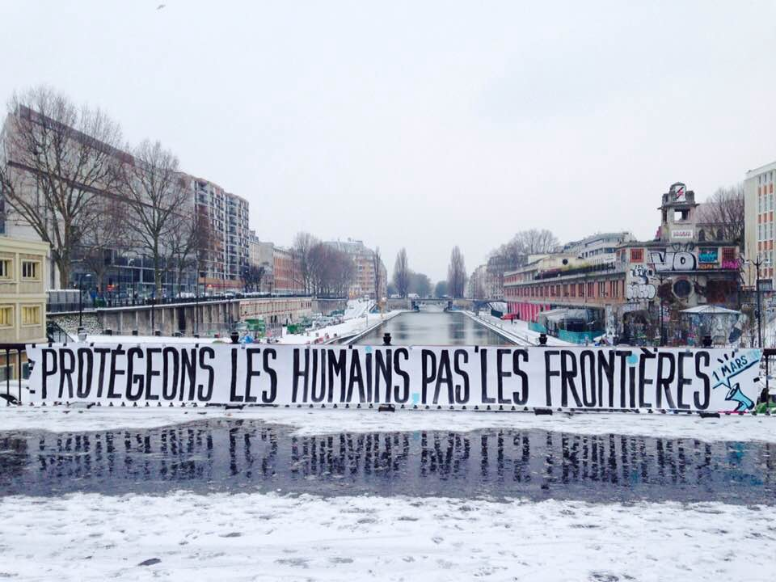

### AYS Daily Digest 01/03/18: AYS discusses illegal push backs and human rights violations in a session at the Croatian Parliament

_AYS took part in the Thematic Session of the Parliamentary Committee for Domestic Policy and National Security in order to discuss the worrying trend of illegal push backs in the Balkans / Pikpa asks for donations to cover legal expenses for innocent migrants / Donations needed in Greece / Volunteers needed in Serbia / Balkan weather report / New data on arrivals in Italy / Volunteers and donations needed in France / More news from Cyprus, Germany, Poland, Sweden…_

Photo by Jean Jacques Clement
### FEATURE

In relation to what [we have reported](ays-daily-digest-27-2-18-people-pushed-back-even-in-severe-conditions-35dd08e65011) about violent push backs in the Balkans and desperate calls for help received by AYS:

“ _Today — one day after the publication of the [4th report](https://www.cms.hr/hr/azil-i-integracijske-politike/izvjestaj-o-nasilnom-protjerivanju-izbjeglica-iz-rh-sustavno-nasilje-prema-izbjeglicama-mora-prestati) on illegal push\-backs from Croatia, by AYS, NNK, CMS and Welcome Initiative, in which we described the most recent developments regarding the push\-backs also to Bosnia and Herzegovina and to Montenegro, the special Thematic Session of the Parliamentary Committee for Domestic Policy and National Security was held in the Croatian Parliament\. The name of the session was ‘Denial of international protection in Croatia’ and it was summoned related to the letter of the Ombudsperson, Ms\. Lora Vidović, to the State Attorney with the information on the case of little Madina Husseini \(Hosseini\) where she underlined the disappearance of the crucial 15 minutes of thermovision cameras at the border that might prove the push\-back and contradict to the allegations of the Croatian police\. Besides the members of the Committe, State Secretaries in MoI Gras and Katić, Ombudsperson Vidović and Ombudsperson for children, Chiefs of the police \(including the border police\), Red Cross, JRS, CMS, Croatian Law Center and AYS participated in the session\. [http://ombudsman\.hr/\. \. \./1263\-pravobraniteljica\-dostavila\. \. \.](https://l.facebook.com/l.php?u=http%3A%2F%2Fombudsman.hr%2Fhr%2Fnpm-novosti%2Fcln%2F1263-pravobraniteljica-dostavila-dorh-u-sve-informacije-o-okolnostima-pogibije-madine-husseini-modulnpm&h=ATMKSwdl1LNhzjksPDygbJTogDgeChn5TxcVnbOEMvps4v9SHzDte9LNvZQpgm9zBJg9SFFy8TkHy-JdeQZrb-bF7u8Y451jOdO54HNdY4MfwvQ3Z-ChDOn89w)_

_AYS representatives stated the following:_

_‘When talking about asylum seekers, it is very important not to mention only people who have come to Croatia through the relocation and resettlement programs, but also about the people who come directly to the territory of the Republic of Croatia for international protection\. And this is when we are faced with the overwhelming number of statements about the systematic denial of access to the international protection in the Republic of Croatia\. UNHCR data indicate about 2000 illegal expulsions from our country in 2016, while the figures for the last year are even bigger: UNHCR and their partners report about 3242 illegal expulsions in 2017 and 189 only in January 2018\. It should be emphasised that this is only the data that UNHCR has managed to collect, while many people do not want their testimony recorded: many of their statements have been collected by small and independent organisations in the field, including ours\. These data relate only to the illegal expulsion of refugees from Croatia to Serbia, while more and more credible statements of expulsion come from Bosnia and Herzegovina and Montenegro\._

_The trend that our volunteers are witnessing in recent weeks is a particularly worrying — we are almost every night contacted by entire families with young children and sick people, and who arrive to the territory of Croatia \(and confirm this with their geolocation\) \. We inform the Ministry of the Interior about the cases and intentions of asylum seeking, but then, as a rule, we lose contact with the families — and we find out a day or two later that they are back in Serbia\. We want to share a paradigmatic example of a family, consisting prevalently of women and children, who contacted us on February 20, and said they wanted to seek asylum in Croatia\. They were scared, sick and freezing\. Among them, there were five children of 1, 3, 3, 4 and 17 years old, with one year old child being ill, and one three year old child with disabilities, according to the mother’s statement\. We informed the MoI about their case and we later learned that they were expelled to Serbia, despite the repeated intention to seek asylum or at least medical care for children\. Such families contact us, even in this cold, almost every night\. It is interesting that only two families who contacted us were able to seek asylum in Croatia\. These were the cases in which our volunteers sat in their cars in Zagreb in the middle of the night, and went to Bajakovo border crossing \(about 3 to 4 hour drive\), where they waited for the situation to be solved\. It is extremely worrying if the physical presence of non\-governmental organisations is a decisive factor in the situation of whether someone will be able to seek asylum in our country, especially when talking about the most vulnerable groups who are forced to walk back for hours in the snow to Serbia, in the same way that Croatia expelled little Madina\._

_We also want to respond to the allegations of the MoI and the State Secretary, Mr\. Žarko Katić on how 77% of the international protection assessment procedures were suspended before their end, where this information is used to prove the suspicion of abusing the international protection system in the Republic of Croatia and to support the claim that Croatia is only a transit country for refugees\. We can only partially agree with such interpretation, that is, we want to offer an alternative interpretation based on our work at the Zagreb reception center Porin\. We believe that factors influencing the decision to leave Croatia \(either with smugglers, either back to their war torn countries\) include negative asylum decisions \(especially the ones without explanation, based only on security intelligence opinion\), as well as long waiting and uncertainty of outcomes\. At this point in Porin, we have a couple from Syria with two little children who have not received any response for 16 months — the father has in the meantime even learned the Croatian language\. Also, in front of us we have a list of 49 children, the vast majority of whom spent 9 and more than a year waiting in vain for a decision on their status — we will mention only the Afghan family with 4 children, one of whom was born in Croatia\. They waited for the answer for 15 months and never got it\. After they went to France, France has processed the case in six months and they got a positive decision\. Also, there is an increased number of suicide attempts in the reception center Porin due to long period of waiting and uncertainty\.’_

_While a part of the parliamentarians supported the lawful conduct and investigation, the MOI representatives and the Chiefs of the police did not provide any new information, while the State Secretary Gras stated that the accusations by the organisations were not supposed to be shared so much with the media because it creates the ‘negative image of the Croatian police’ and has invited the organisations to ‘dialogue’, at the same time underlining severely that the Republic of Croatia will have ‘zero tolerance to the illegal migration’\. All participants were invited to share the suggestions of the sessions’ conclusions within 8 days\. While we are drafting the conclusions, we really need one answer from the MoI:_

_Does MoI statement means that when a young child or a family, who entered in illegal way to Croatia, asks for asylum in this country, they will be deterred/discouraged/pushed pack?_ ”
### CYPRUS

In 2017, 4,582 asylum applications were lodged in Cyprus, mainly from people from Syria\. The Cypriot Asylum Service was assisted by EASO \(European Asylum Support Service\), who deployed 4–8 experts, to carry on personal interviews with the applicants\.

The AIDA \(Asylum Information Database\) has published a new report that underlines the extremely slow bureaucratic procedure as the “Refugee Reviewing Authority still continues to examine asylum applications at second instance, even though it should have ceased operations following a 2015 reform\.” This plus the lack of staff made the applications’ backlog volume rise from 650 to 1,123 at the end of last year\.

The report also denounces the inadequate information on asylum procedures, lack of free legal assistance and difficulties to access legal aid and representation during the trial, and insufficient legal representation for unaccompanied minors and vulnerable people\.

“ _Reception conditions in the community continue to be inadequate to ensure a dignified standard of living, despite consistent criticism from NGOs and [UNHCR](http://bit.ly/2oxwNPi) \. Further deterioration has been observed with regard to the timely provision of material reception conditions and the ability of asylum seekers to timely secure housing in the community\. In addition, conditions in the Kofinou Reception Centre have deteriorated over the course of 2017\. Recently, [riots](http://bit.ly/2GMf9yQ) have taken place in the centre_ ”\.

More details and information on detention conditions can be found [here](http://www.asylumineurope.org/sites/default/files/report-download/aida_cy_2017update.pdf) \.
### GREECE
#### New arrivals: Lesvos

[1,365 people](https://www.facebook.com/lighthouserelief/posts/1601104770012058) have reached Lesvos in 2018, \+70% in respect to the the same period of last year\.

“ _Since the beginning of 2018, 1365 people have arrived on the island \(UNHCR as of 25 February\) \. This marks a 70% increase compared to January 2017\. There are currently 7022 people living in overcrowded camps and accommodation facilities on Lesvos: 4902 in Moria, 123 in Prokeka, 1150 in Kara Tepe, 70 in Pikpa and 777 in accommodation facilities and Illiaktida_ ”\.
#### Pikpa calls for donations and solidarity

Please [support Pikpa](https://www.facebook.com/pikpalesvos/posts/2045207079088046?hc_location=ufi) and their call for solidarity with the three asylum seekers from Eritrea, wrongly accused of theft last Wednesday\.

“ _We are supporting the three defendants with legal aid and court fees, which are in the thousands\. Please consider donating so we can defend their rights and justice will prevail: [https://lesvossolidarity\.org/…/donate\-en/financial\-donations](https://lesvossolidarity.org/en/donate-en/financial-donations)_ ”\.
#### _Donations needed_

■■■■■■■■■■■■■■ 
> **[Starfish Foundation](https://twitter.com/starfishlesvos) @ Twitter Says:** 

> > Most refugees have little possessions when crossing the sea to Europe. Many, even, only come with one set of clothes: the one on their bodies. 🎽 Once on #Lesvos, NGOs try to provide as much as they can , but we need constant help. Check what's needed on: [needshub.org](http://www.needshub.org) 

> **Tweeted at [2018-03-01 12:58:36](https://twitter.com/starfishlesvos/status/969195199497953281).** 

■■■■■■■■■■■■■■ 

### SERBIA

Wrappers’ call to action\! Volunteers are needed today to wrap presents that will be distributed throughout the month in refugee camps and Roma settlements\! ❤

If you’re available get in touch with [RAS](https://www.facebook.com/refugeeaidserbia/posts/2011923955797453) \.
### BALKAN WEATHER REPORT: FRIDAY, MARCH 2ND

**Montenegro**

Cloudy and rainy weather for Friday\. In the south and centre of the country there will be heavy rain, thunder and moderate to heavy precipitation, while in the north during the morning and evening here can be light snow or sleet\. The wind will be moderate to strong blowing from the south\. The morning temperature will be from \-1 to 9 and during the day from 3 to 14 degrees\.

**Serbia**

Red weather alarm\! Tomorrow in Serbia will be mostly cloudy and cold and for most parts of the country a red weather alarm is issued predicting very dangerous weather\. It will be extremely cold, with freezing rains and locally snow\. The snow will be mostly light and locally moderate\. In the southwest, the rain will be freeze on the ground, in the south it will be mostly dry\. Morning temperatures will range from \-8 to \-2 degrees and during the day from \-2 in 7 degrees\.

**BiH**

Cloudy weather with rain that will locally freeze when it comes in contact with the ground\. In the morning snow is expected in parts the north and northwest is expected\. There will be heavier precipitation in the east and south\-east of Herzegovina, while the rest of the country precipitation will be low to moderate\. The morning temperature will be from \-5 to 1, in the south from 2 to 6, and the highest daily will be from \-1 to 5 degrees, in Herzegovina and in the southwest of Bosnia to 6 to 10 degrees\.

**Croatia**

Friday will be cloudy and less cold than previous days\. Alongside the coast it will occasionally rain, and in the south can rain heavily\. Land inwards the precipitation will be on the border of rain and snow and will freeze in contact with the soil, especially in Lika and Slavonia\. The wind will be predominantly weak, while alongside the coast it will be moderate to strong, and strong in the evening\. The temperature will be between \-9 and \-6, alongside the coast mostly 0 to 6 ° degrees\. During the day it will be from \-6 to \-1, and alongside the coast from 5 to 12 ° degrees\.
### ITALY

New data published by the [Italian Interior Ministry](http://www.interno.gov.it/sites/default/files/statistico_giornaliero_28.02.2018.pdf) compared arrivals of January\-February 2018 with those of the same period in 2017 and 2016, observing a drop on the number of arrivals of 61%\.

2018: 5,247 people arrived in Italy \(3,739 from Libya\)

2017: 13,439 people arrived in Italy \(12,842 from Libya\)

2016: 9,101 people arrived in Italy

Of the asylum seekers landed in Italy, the majority are from Eritrea \(1,312\), Tunisia \(1,060\) and Nigeria \(326\) \.

The regions that host the highest number of asylum seekers are Lombardia \(25,730\) and Campania \(16,201\) \.

The report gives an idea on the number of people relocated to Europe as of February 23rd, 2018: 11,980 relocated mainly to Germany \(4,908\), Sweden \(1,407\) and the Netherlands \(940\) \.

The number of unaccompanied minors who reached Italy in 2018 is stated at 747\.

The drop of the number of arrivals is obviously a great achievement for the Italian government who keeps high the enthusiasm for the EU\-Libya Deal, supporting the idea that traffickers have been extremely damaged by the entering into force of the deal itself, not taking into consideration the side effect, like the inhumane detention conditions of the Libyan prisons\.

When a system enforces a [ridiculous game](https://www.borderlinesicilia.org/comunicato-stampa-dello-sportello-immigrati-di-caltanissetta-2/) \.

Caltanissetta \(Sicily\) \. Immigration office\. Asylum seekers are left waiting outside the office, out in the rain, from 9 AM to 5 PM, even after having received a convocation for an interview\. At 5 PM then, this person is given an appointment for the following week\. Here again, he will have to wait 8 hours to receive an appointment for the following month\.

The office is supposed to be open from 9 to 12, but it never opens before 9\.30 and people are never able to sit inside in a waiting room but always have to wait like animals, squeezed in between the metal bars of the external gate\.
### FRANCE
#### _Paris_

People keep queuing in front of the Asylum office, even with snow and freezing temperatures:

“ _Tonight four men were found specifically searching out and offering the underage people cigarettes and 10 euros for sex_ \.” In this specific area, 600 people are living, many of whom are minors\.

#### _List of needs for Paris 8 and other donations needed_

■■■■■■■■■■■■■■ 
> **[Les Exilé.e.s Occupent P8](https://twitter.com/ExileesOccupP8) @ Twitter Says:** 

> > On tourne a à peu près 10kg de sucre par jour, besoin de sucre! Et la nouvelle liste des besoins ici! Aussi toujours besoin de soutien humain sur place, de relai des tâches.. Venez participer à la lutte et ses tâches quotidiennes au bâtiment A ! :) #OccupP8 #RefugeesWelcome https://t.co/vhKB7mjkrX 

> **Tweeted at [2018-03-01 18:21:28](https://twitter.com/exileesoccupp8/status/969276447478214656).** 

■■■■■■■■■■■■■■ 

#### _V_ olunteers and donations needed in Calais\!

### GERMANY

The [German Interior Ministry](https://kleineanfragen.de/bundestag/19/921-ergaenzende-informationen-zur-asylstatistik-fuer-das-jahr-2017-schwerpunktfragen-zu-dublin-verfahren) , after a request of the left\-wing party “Die Linke,” declared that Greece and Hungary refuse to take back refugees under the Dublin III regulation\. Even though the overnment in Athens admitted its responsibility only in 81 of 2,312 requests from Germany in 2017, it didn’t take back any of these 81 people\.

The BAMF further states that Greece was responsible for 2,735 cases of returns\.

3,189 people were transferred for family reunion from Greece in 2017, mainly from Syria, Afghanistan, and Iraq\. The Greek Government sent 5,807 requests, Germany accepted 5,310 and 3,100 are still waiting for transfer\.

The number of Dublin deportations from Germany has almost doubled from the period 2016 to 2017, from 3,968 to 7,102\.

At the same time, Germany accepted 8,754 Dublin requests \(relocation\) \. The overall proportion of Dublin cases raised from 7\.7 to 32\.4%, forcing the BAMF to employ 311 professionals, only to deal with Dublin cases\.

To Hungary, Germany sent 3,304 requests of returns, but since May 2017 no one has been deported there\. The reason is, that the Hungarian government refuses to treat Dublin refugees with respect of EU law\.

However, before May 2017, 31 people were deported from Germany to Hungary\.

[Information](http://w2eu.info/germany.ar/articles/germany-dublin3.ar.html) related to Dublin III and deportation procedures in Germany are now available in Arabic thanks to Welcome to Europe\.

In relation to what was reported in [AYS Daily Digest](ays-daily-digest-27-2-18-people-pushed-back-even-in-severe-conditions-35dd08e65011) few days ago, another NGO, called “ [Tafel in Marl](http://www.radiovest.de/vest/lokalnachrichten/lokalnachrichten/archive/2018/03/01/article/-4ae308224b.html) ,” stopped accepting foreigners as new customers, as “ _many of them have showed no respect and accosted and beset women,_ ” chairwoman Renate Kempe said\.

80% of the 2000 customers were foreigners\.

This NGO distributed food to people living on social welfare\.
### POLAND

The new AIDA country report on Poland contains the most recent information and developments related to asylum procedures, the reception system, and detention in the country in 2017\.

A total number of 5,053 people applied for asylum in Poland in 2017 \(with 2,884 of these still pending at the end of the year\) \. 490 people on the move obtained either refugee status or subsidiary protection, while the number of the rejected applications is 2,091\. Russia, Ukraine, and Tajikistan were the top three countries of origin\.

The most worrying part of the report concerns the systematic push backs to Belarus, happening, most of the times in the area of Terespol of people seeking asylum in the country\.

Four cases have been brought in front of the European Court of Human Rights and in all cases the court ruled that people should not be deported to Belarus \(according to Rule 39 of the Rules of the Court\), but, according to the Warsaw Bar Council, Poland returned the applicants to the neighbour country, causing a reaction from the Ombudsman who also intervened to guarantee the respect of the ECtHR sentence\.

The very same Ombudsman published a report of irregular detention of Dublin returnees suffering from PTSD\. “ _According to the report, the problems occurred due to numerous procedural shortcomings during the transfer of the family to Poland by the German police as well as due to the lack of appropriate operational algorithms that should have been implemented in order to promptly identify victims of torture and violence as well as persons whose mental and physical condition should rule out placement in detention_ ”\.

Lack of psychological support and ineffective identification of people with special needs were also contested against Poland\.

You can find the full report [here](http://www.asylumineurope.org/sites/default/files/report-download/aida_pl_2017update.pdf) \.
### SWEDEN

Kaliber \(a Swedish radio program\) found [50 cases](http://sverigesradio.se/sida/avsnitt/1022598?programid=1316) where asylum seekers’ lawyers, assigned to them by the Migration Agency, have messed up people’s asylum process by not handing in appeals on time \(normally three weeks after the decision has been received\) \. If someone wants to get their case tried again after a first negative answer, this must be done within a limited time frame\. Otherwise the case will be closed and cannot be opened again\. This is what happened with Ali \(whose name in reality is different\), who now will be deported\. The wrongful way a lot of cases have been handled affects the asylum seekers in life\-changing and devastating ways\. The lawyer who destroyed Ali’s case admits that this was a horrible mistake\.

None of the 50 cases with lawyers who had overextended the time limit for handing in their clients’ cases for appeal had been reported by the Migration Agency\. Very few lawyers are reported by the agency, and the asylum seekers themselves often can’t speak the language and aren’t familiar with the system — so they are not in a position where they can take matters into their own hands\.

Representatives from the Migration Agency and the lawyers’ association say that this should be acknowledged more often and not happen as frequently as it does, since it’s not a safe and just legal system\.
### UK

Solidarity with Yarl’s Wood hunger strikers\!

■■■■■■■■■■■■■■ 
> **[Right to Remain](https://twitter.com/Right_to_Remain) @ Twitter Says:** 

> > Over 200 people took to the streets in solidarity with those on hunger strike in #YarlsWood immigration #detention centre.

As one of the hunger strikers told the crowd: "You're fighting for our liberty today; but we are fighting for your liberty for tomorrow."

#HungerForFreedom https://t.co/J5zo1iY2CG 

> **Tweeted at [2018-03-01 11:15:50](https://twitter.com/right_to_remain/status/969169336983343104).** 

■■■■■■■■■■■■■■ 

### GENERAL

The International Federation of Red Cross and Red Cross Societies has published a [list of tips](https://l.facebook.com/l.php?u=https%3A%2F%2Flookaside.fbsbx.com%2Ffile%2FENGLISH_Surviving%2520the%2520Extreme%2520Cold%2520Weather%2520in%2520Europe_Red%2520Cross%2520Advice.docx%3Ftoken%3DAWzjWFRjQd6zgQ65M85U4VteASvVXlyJBCSinlpOqsxsK7gM-aJzKPvdg-KXFyHh2P2DfS0SML02MK59gyVlOGZBmY3xlZl6-CqgXqKgtopcFMGvre4XBqEF46WuhrP1D6_ISke28dOTW3pBLjhX64lDXL64S2Bppsa7dPKsYNcP9K7zJyIHh1jg54Gpx29L7gzaA2zyRVqwFlVQRMN_3qrz3GJm-HIBp7F1ji4bwXQRTA&h=ATN9BEC2J4mQLsPJ-mg9JNgw-yogx2gqtQBcXIHx0fhA4Wsg-Ifv0hn8JgLnoNxqAGXaOCrBUNPoPQu22FIQM3Qmvhjbj5EHxromkLZCYnWEXEOCNkqVEA2MR103Wsv4i15cK1cgbD4) that could be useful to avoid hypothermia\. You can also find different signs to recognize stages of hypothermia and a to\-do list when you have to immediately help someone in a cold\-related emergency\.

**We strive to echo correct news from the ground through collaboration and fairness\.**

**Every effort has been made to credit organizations and individuals with regard to the supply of information, video, and photo material \(in cases where the source wanted to be accredited\) \. Please notify us regarding corrections\.**

**If there’s anything you want to share or comment, contact us through Facebook or write to: areyousyrious@gmail\.com**

_Converted [Medium Post](https://medium.com/are-you-syrious/ays-daily-digest-01-03-2018-ays-discusses-illegal-push-backs-and-human-rights-violations-in-a-d304780ca858) by [ZMediumToMarkdown](https://github.com/ZhgChgLi/ZMediumToMarkdown)._
