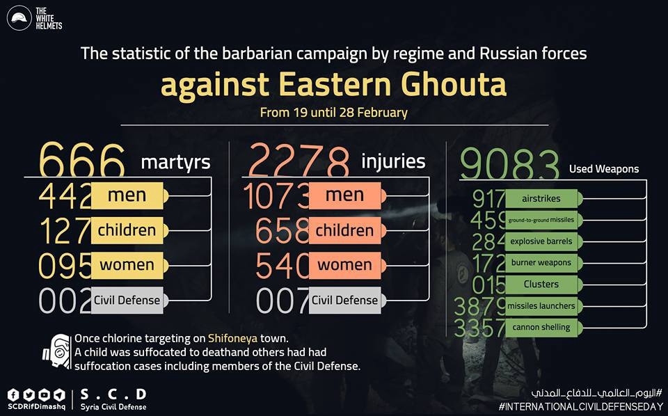
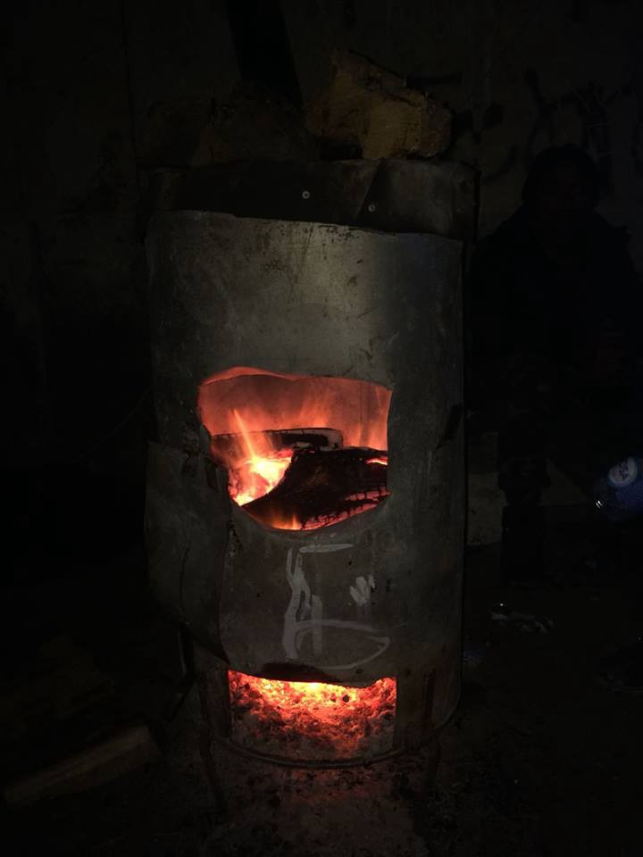
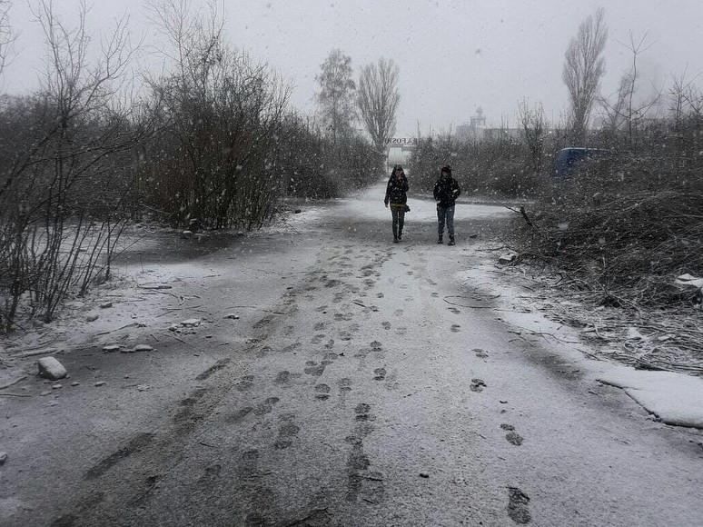

### AYS DAILY DIGEST 3/3/2018: Likely war crimes in Syria’s Ghouta

_Potentially crimes against humanity in Syria / Greece refuses Dublin returns / Persistent human rights violations in Bulgaria / Increasing number of families and children locked up in detention centers in France / More from Italy, UK, Germany_

Syrian Civil Defense
#### Feature

Syrian government air strikes against the besieged Syrian enclave of eastern Ghouta and shelling from the rebel\-held zone into Damascus probably constitute war crimes and must be prosecuted, said top UN human rights official on Friday\. Zeid Ra’ad al\-Hussein, United Nations High Commissioner for Human Rights, said the perpetrators of such crimes in Syria should know they were being identified and that dossiers were being compiled for future prosecutions, [reports](https://www.reuters.com/article/us-mideast-crisis-syria-ghouta-rights/u-n-points-to-likely-war-crimes-in-syrias-ghouta-idUSKCN1GE24H) Reuters\.

> “Once again, I must emphasise that what we are seeing, in eastern Ghouta and elsewhere in Syria, are likely war crimes, and potentially crimes against humanity\. Civilians are being pounded into submission or death\.” 

Zeid repeated his call for the situation in Syria to be referred to the International Criminal Court, adding: “Attempts to thwart justice and shield these criminals are disgraceful\.”

Last Saturday, the UN Security Council, including Russia, passed a resolution calling for a cessation of hostilities, allowing humanitarian aid into the besieged enclave and urgent medical evacuations\. Since the passage of this resolution, reports of attacks on civilians and civilian buildings in Eastern Ghouta have continued and no humanitarian convoys have had access, [writes](https://www.hrw.org/news/2018/03/02/past-time-end-impunity-atrocities-eastern-ghouta) HRW\.

“Eastern Ghouta cannot wait\. It is high time to stop this hell on earth\. When civilians are dying in real time, the Council should respond in real time,” UN Secretary General Guterres [told](https://www.hrw.org/news/2018/03/02/past-time-end-impunity-atrocities-eastern-ghouta) the Human Rights Council at its opening session\.

Syrian civilians are [**trapped, hiding in their basements**](https://www.middleeastmonitor.com/20180302-syrian-civilians-in-eastern-ghouta-trapped-in-shelters/) because of the ongoing bombardments and assaults\.

](assets/f1254de7081/1*C-tSFvF0LiNvcHwvv4aE-w.jpeg)

[Live Updates From Syria](https://www.facebook.com/liveupdatesfromsyria/)

In the meantime, Syrian authorities have given the UN the green light to deliver aid to Eastern Ghouta, [according to the NGO Voice of America](https://www.voanews.com/a/syria-eastern-ghouta-humanitarian-aid/4278816.html) \. Tomorrow, Sunday, the first delivery of aid in months will arrive in Douma/Ghouta on a UN convoy\. Given the high number of malnourished children in Ghouta, one of the first priorities will be nutritional and health supplies\. Currently an estimated 200,000 children are living in the area, and hopefully, deliveries like this will become a regular occurrence and reach all of the 400,000 inhabitants\.

Here is footage showing what medical staff have had to endure while helping the injured\. They were targeted while working yesterday in Ghouta\. The video may be disturbing for some\.

Another White Helmets volunteer was killed today\. “Aiham Jabawy” passed away after being hit by a stray bullet in Daraa, southern Syria, his colleagues reported\.
#### BALKAN WEATHER REPORT
#### Montenegro

Early Sunday will be moderately to mostly overcast with intermittent rain; there may be thunderstorms along the coast, while sleet and snow are expected in the higher northern parts of the country\. The wind will be weak to moderate from variable directions\. In the morning the temperature will range from 0° to 9°C and from 3° to 15°C during the day\.
#### Serbia

Sunday will be overcast with rain, sleet and snow, and icy rain in the north and east\. In the far north there will be no rain\. Precipitation will stop throughout the country later in the day\. The maximum temperatures will range from 0°C in the north to 10°C in the south\.
#### Bosnia and Herzegovina

Sunday will be mostly overcast\. There will be snowfall in Bosnia in the afternoon, and rain in Herzegovina\. The precipitation is expected to be low\-intensity and with partial clearing in the afternoon\. The wind will be weak to moderate from the east and northeast\. In the morning the temperatures will range from \-4° to 2°C, in the south from 6° to 11°C, and during the day from 1° to 6°C, in the south from 8° to 13°C \.
#### Croatia

Partly sunny but increasingly overcast in the early part of the day\. Light precipitation is still possible locally during the night and in the morning there may be freezing in some places inland\. The wind on the mainland will be weak, along the coast it will first be moderate and diminish later during the day\. Inland, the temperature in the morning will range from \-5° to \-1°C, along the coast from 4° to 10°C, during the day on the mainland, 1° to 5°C, and along the coast, 9° to 14°C \.

](assets/f1254de7081/1*IJSJQ6dK8RDp2VIIEazSjg.jpeg)

Serbia; photos: [No Name Kitchen](https://www.facebook.com/NoNameKitchenBelgrade/?hc_location=group_dialog)
#### GREECE

![So far this year a staggering number of 161 boats have tried to reach the Greek islands, carrying a total of 6622 people\. Only 68 boats made it\. The rest, 93 boats, with a total of 3828 people on board were arrested by the Turkish Coast Guard or police\. Over 12,000 people are living under extremely poor conditions on the Greek islands\. The small organizations and NGOs that are working on the islands need all the support they can get\. They are filling the gaps where the bigger organizations have failed\. — [Aegean Boat Report](https://www.facebook.com/AegeanBoatReport/)](assets/f1254de7081/1*jnGVXW-cnp2jkexaNeEiSQ.jpeg)

So far this year a staggering number of 161 boats have tried to reach the Greek islands, carrying a total of 6622 people\. Only 68 boats made it\. The rest, 93 boats, with a total of 3828 people on board were arrested by the Turkish Coast Guard or police\. Over 12,000 people are living under extremely poor conditions on the Greek islands\. The small organizations and NGOs that are working on the islands need all the support they can get\. They are filling the gaps where the bigger organizations have failed\. — [Aegean Boat Report](https://www.facebook.com/AegeanBoatReport/)

According to the German Agency for Migration and Refugees, a total of 2,735 refugees and migrants currently living in Germany should return to Greece, based on the Dublin Treaty \(the first country of entry in the EU is responsible for examining asylum applications and granting asylum to those who qualify\) \. Greece however has refused 95 percent of the cases, [writes](http://greece.greekreporter.com/2018/03/01/german-press-greece-refuses-to-take-back-refugees-from-germany/amp/?__twitter_impression=true) Greek Reporter\.
#### Volunteers needed

for Search and Rescue and Site Support in Greece\. Please apply to aid@ercintl\.org of you are a reliable and confident person with an International/EU driver’s license who can commit for at least two weeks\. Ability to swim in open water and first\-aid qualifications are plus\. More info at: [ercintl\.org/placements](https://l.facebook.com/l.php?u=http%3A%2F%2Fercintl.org%2Fplacements%2F&h=ATOaIzbe2PQV9M7rQUCHMb7pjFw12QqIGGobRcY1QJKsVuoGyrIZ_kcR9n9VdA6sV1M6ZedQ-nOOHymgeYHMsblSxj8aHrXcj16eqoX-9GM9BjDYUmHz1_i5MkNGUFtMmIO0)
#### Children’s after school classes at Agios Nikolaos, age 6–18

Elix X Unicef has an educational programme \(mainly to support children in the afternoon after their Greek school day but also for children who are not attending school at all\) \. They have extended the program to a location very near the Agios Nikolaos metro stop\.

The program needs more children, in particular, from age 9–12, so that they can start a new class\. They have daily classes for two\-hour slots every day in the afternoons from 4–8 pm, with instruction in English, Greek, Math and Science\. The parents also have English classes held twice a week\.

If you know any families who may be interested, they can register at the 48th School, address: Michail Koraka 44\. They should bring their white cards or ID cards between Monday to Friday between 4 pm to 8 pm to register\.

The guidelines for correcting incorrect information on asylum \(white\) cards are [**available here**](https://www.facebook.com/mobileinfoteam/posts/2131177963777588:0?hc_location=ufi) in Arabic and English\.
#### BULGARIA

Persistent human rights violations against people seeking protection at Bulgaria’s border with Turkey have been confirmed following a recent visit of the European Parliament Committee on Civil Liberties, Justice and Home Affairs \(LIBE\) \. At the Greek\-Turkish border push\-backs remain the norm, [writes](https://www.ecre.org/push-backs-and-human-rights-violations-at-bulgarian-and-greek-borders-with-turkey/) ECRE\.
#### GERMANY

13,248 white chalk paintings, representing 13,248 people along a total of 22 km of the streets in the old city of Regensburg, Germany, were painted today by Sea\-Eye, symbolizing the lives saved from drowning last year in the Mediterranean Sea\. There were also 8,000 red paintings made showing the number of fatalities over the same period\. The dying is still ongoing and real\. We should keep reminding those who are responsible\.

#### ITALY

May asylum seekers in Italy travel to other EU countries? How long may international protection holders in Italy stay in other EU countries? This and more information on work and travel documents can be found [**here**](https://lookaside.fbsbx.com/file/FAQs-TRAVELING%20OUT%20OF%20ITALY.pdf?token=AWx4p6hGs70KrszBpPUv1OB8uUJH2Adx-TRwmZPladzy84sE-OV-Z6ebqZTi10FeCe3URwO875-PBQ1Vyng1XmZ_UrKL8erum-ZWE2wdWheQnTJ2HBegpSx4zYZ5hHDtFlyRX0AUFsU36s4Fe5kRcJdp) \.
#### FRANCE

An increasing number of families and children are being locked up in detention centers in France, including a prematurely born infant who had to sleep in a room where the temperature was as low as 10°C in the detention center of Mesnil\-Amelot\. The report was posted on Friday on Twitter by Nicolas Brown, working for the La Cimade NGO, [writes](https://www.nouvelobs.com/monde/migrants/20180302.OBS2976/on-n-a-jamais-vu-autant-d-enfants-en-centre-de-retention.html) L’Obs\. The sight of children in detention centers used to be the shocking exception, but it has become the norm over the last few years\. The age of the children detained in Mesnil\-Amelot is between three months and 12 years\.

Families are supposed to stay a maximum of one or two days in these centers, but one family has been detained in Mesnil\-Amelot for eight days\. Other than the cold, one of the main problems is the noise, the center is 10 minutes from the airport and directly on an aerial corridor for planes\. They have no sanitary wipes or baby bottles and the elder children are asking questions about why they can’t go back to school and see their friends\. Officials did not wish to comment on these reports\.

La Cimade has been fighting against the lock\-up of families in detention centers for years, and a petition has collected 92\.000 signatures\. According to their statistics, there have been 30 children in detention centers since the beginning of the year \(more numbers can be found [**here**](https://media.nouvelobs.com/ext/uri/ureferentiel.nouvelobs.com/file/16450970.JPG) \) \.

Despite the European Court of Human Rights condemning France in 2016 because of the “degrading practice” of locking up children, and the Defendant of Human Rights in France, Jacques Toubon pointing out that France is violating the international convention on children’ rights, nothing has changed since, and the number of detained children is, in fact, increasing\.

Because of the cold \(from \-7° to \-15°C\), a group of activists started to squat a building of the University of Jussieu in 6th arrondissement of Paris\. About 20 students asked refugees in a camp close to porte de la Villette to join them for the squat\. Some preferred to go into public shelters instead, but about 30 joined the students\. The squat started well, despite only being planned a few days before and the activity less well organized than the squat in Paris\-VIII\. 
The administration was not willing to negotiate and gave an ultimatum for them to leave \(until which time the migrants would not be controlled/arrested\), or police would come and evict\. They had an hour to decide\. The refugees as well as activists decided to give up and go, afraid of arrest\. Most of the refugees are afraid to go into official centers such as Porte de la Chapelle because of the Dublin regulations and they might be sent back to Italy\. Some returned to their camp on the street, some decided to join the squatters at the university in Paris\-VIII\. Altogether, the occupation lasted only a few hours, [writes](https://www.lesinrocks.com/2018/03/01/actualite/ils-devraient-avoir-honte-de-les-jeter-dans-le-froid-une-occupation-de-migrants-et-detudiants-echoue-jussieu-111053021/) Les Inrockuplibes\.
#### UK

Upbeat Communities wants to equip refugees skilled in electronics to work in the UK\. They’re looking for local electricians who will be able to offer a few hours of mentoring\. Email michael@upbeatcommunities\.org for more information\.
#### Join the Refugees Welcome Bloc at the March Against Racism March 17th in London\.

and show that the UK cares about refugees\. More info on the event [**here**](https://www.facebook.com/events/1514162848632433/) \.

> **We strive to echo correct news from the ground through collaboration and fairness\.** 

> **If there’s anything you want to share or comment, contact us through Facebook or write to: areyousyrious@gmail\.com** 

_Converted [Medium Post](https://medium.com/are-you-syrious/ays-daily-digest-3-3-2018-likely-war-crimes-in-syrias-ghouta-f1254de7081) by [ZMediumToMarkdown](https://github.com/ZhgChgLi/ZMediumToMarkdown)._
