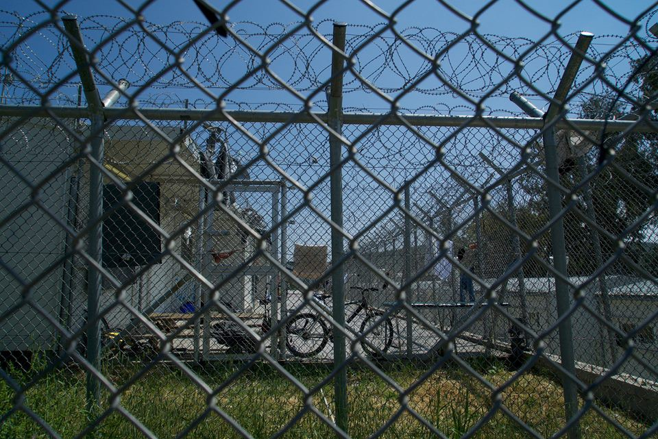
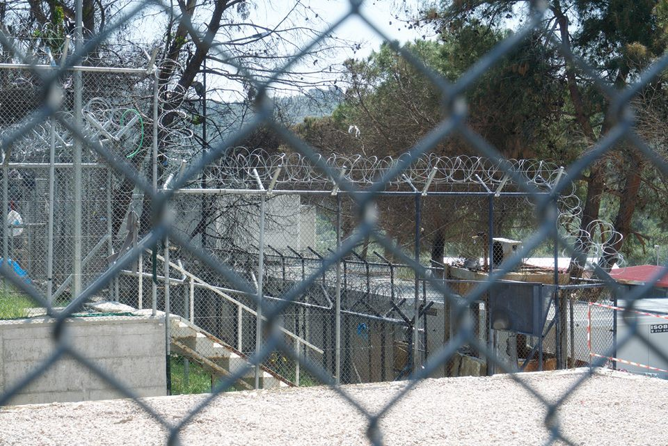
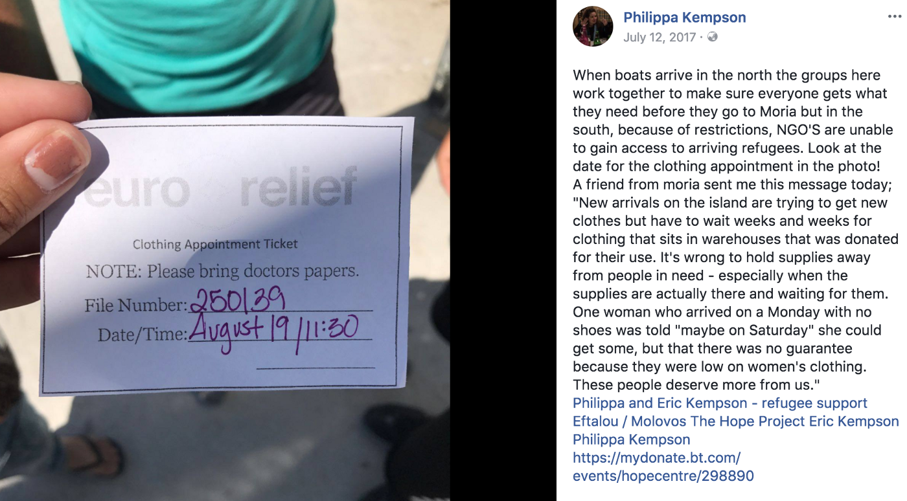
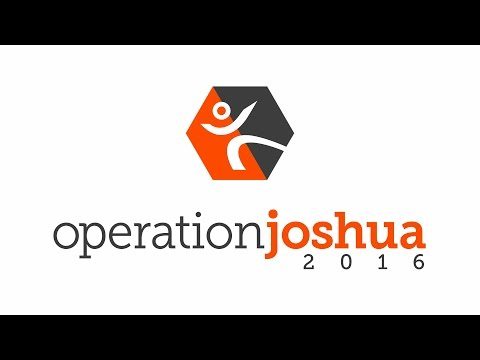
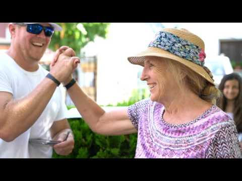
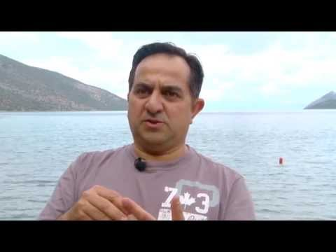
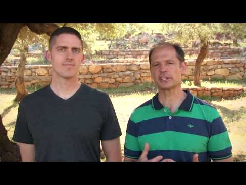
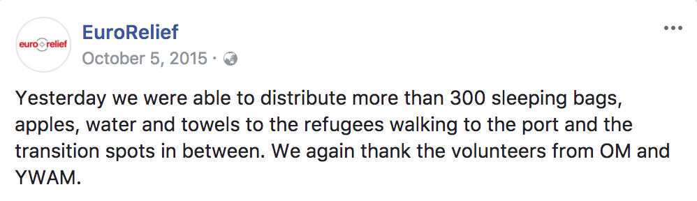

### AYS Special on EuroRelief II: Testimonies, new evidence and a call for accountability
#### At AYS we take concerns and issues raised by refugees and persons working on ground extremely seriously\. The operations, motivations and general management practices of Moria Hot Spot, by the organisation EuroRelief, has been a concern that has been brought to our attention by numerous volunteers and refugees on Lesvos over the last 18 months\. As we announced, we have continued an investigation into the work of this organization in Moria\.

Moria\. By AYS

_On the 11th of January 2018 we released a [feature](ays-daily-digest-11-01-2018-eurorelief-u-s-807717ec51f8) in our daily digest highlighting some of the concerns we heard from the ground\. AYS are well aware of the weight of accusations that have been raised in this feature\. That is why we cross\-checked the information with many different volunteers, as well as our own staff members who have volunteered for extensive periods of time on ground in Moria, before we decided to publish any information\._

_Due to the disturbing nature of some of these accusations, AYS expected to receive a powerful response to this feature, which has occurred\. In many ways the response has been overwhelming\._

_A large debate has opened up in response to the accusations which only confirms to AYS that this is indeed an issue that needs to be examined further\. Some people have written to to us in defence of EuroRelief, but unfortunately, many more have confirmed and even added to what was published\._

_We have asked the head of EuroRelief to comment on these accusations but have unfortunately received no response\. We are therefore unable to publish their point of view in this follow up\._

_Our entire editorial team would like to emphasise that it is a very sad and difficult decision for us to publicly call out another NGO for misconduct\. AYS never publishes such content with the intent to offend or discredit, but instead as a last resort when there is no other choice\. Regrettably, it has become impossible to ignore calls for help from refugees and volunteers who’ve encountered problems while dealing with EuroRelief\. In such a tense and inhospitable environment, such as Moria, these types of concerns can become life threatening, and thus we are morally obligated to act\. We sincerely hope this debate will have some positive outcomes for the refugees on Lesvos\._

In response to the last feature we have had a large number of individuals step forwards with testimonies and further information, which we have decided to collate into this follow up AYS special\.

With new concerns and perspectives brought to light, we will once again go over the concerns that were first raised in the January 11 feature\.

Moria\. BY AYS
#### Table of Contents:
1. **Moria — The ‘Guantanamo of Europe’**
2. **EuroRelief are struggling to provide basic aid to refugees in Moria**
3. **How are EuroRelief and Hellenic Ministries connected?**
4. **Religious Bias — vulnerability should under no circumstances be abused**
5. **Is the identification bracelet system implemented by EuroRelief inhumane?**
6. **Identification bracelet system is also putting refugees at risk**
7. **Testimonies raise concern for the extent of the cooperation between EuroRelief and the authorities**

#### 1\. Moria — The ‘Guantanamo of Europe’

EuroRelief function as one of the main humanitarian actors and distributors of aid in Moria Hotspot\. Therefore almost all refugees living there are dependant on them for basic aid\. With this much responsibility in one of the most inhumane and deadly camps in Europe, it is imperative that EuroRelief are doing their job to the best of their capabilities\.

Since it’s establishment in March 2016, the situation in Moria has not improved at all\. Moria has been dubbed as ‘ [_The Guantanamo of Europe\.’_](http://www.aljazeera.com/news/2017/11/greeces-lesbos-guantanamo-bay-europe-refugees-171129134253661.html) At it’s peak this winter it was concluded that over 6000 refugees were living in Moria, a former prison which has a capacity of no more than 2000\.

Despite transfers to the mainland having picked up in pace over the last months, overcrowding is and remains huge problem\. The Guardian published an article in December titled ‘ [welcome to prison’](https://www.theguardian.com/world/2017/dec/22/this-isnt-europe-life-greece-worst-refugee-camps) which describes graphically the the conditions in Moria\. Throughout winter many residents including children and the elderly have been forced to sleep in flimsy summer tents that offer no insulation from the harsh weather conditions\. The camp is dirty, big piles of rubbish line the pathways\. There are no sanitary or safe hygiene facilities available, nor access to hot water\. The air throughout winter is laced with thick smoke from plastic bottles that are burnt by refugees to keep warm due to lack of better option\. New arrivals wait weeks to receive warm clothing\. There is a long waiting list for blankets too\.

In the winter of 2016/2017 six people died in Moria from what is believed to be cold related deaths\. The rest of 2017 was milder, but more deaths followed suit\. One of the deceased; a young girl aged five\. She was sick and cold and sleeping outdoors in a flimsy summer tent\.

At the start of this years winter, [Lesvos Mayor Spyros Galinos warned](http://www.aljazeera.com/indepth/inpictures/rare-life-lesbos-moria-refugee-camp-180119123918846.html) that the Greek Islands could be turning into ‘concentration camps, where all human dignity is denied\.’ Indeed as an onlooker passing through Moria this is what you would think\.

Many people speak of the fact that conditions in Moria and the rest of the Greek Islands are purposefully kept as bad as they can be in order to deter further arrivals from Turkey\. But how is this being achieved?
#### 2\. EuroRelief are struggling to provide basic aid to refugees in Moria

Being the main distributors of aid in Moria encompasses a lot of responsibility\. Countless testimonies AYS has received from refugees and volunteers describe that EuroRelief are struggling to provide the most basic of aid to refugees, such as blankets during winter months and diapers to mothers\.

One EuroRelief volunteer wrote to us following the release of the feature:

> Other examples that particularly upset me were their rules surrounding blankets and diapers\. I saw multiple families with young children and infants denied these necessities because “the rules say they get a specific amount and there are no exceptions\.” Mind you, this is during the winter in frigid temperatures and pouring rain when families are simply asking to be able to keep their children safe and warm\. Diapers are only handed out to families once per week, 14 diapers at a time per child\. This means two diapers per day\. Anyone who has ever had to care for a baby knows this is inhumane\. I saw one mother begging for a SINGLE diaper only to be turned down by EuroRelief\. 

> Another thing I found upsetting about my time volunteering in Moria is that it quickly became clear that my role there was to make EuroRelief’s lives easier, when I had signed up to solely help the refugees\. They essentially told me that my job was to say “no” and turn people down for services and supplies they so desperately needed\. In fact, I became so fed up with this that I ended up taking things into my own hands and helping people as I saw fit, breaking numerous EuroRelief rules in the process\. The amount of gratitude and happiness that the refugees showed in response to truly be helped and cared for broke my heart because it was something they so clearly were not used to\. — **former EuroRelief Volunteer** 

Other testimonies confirm that new arrivals must wait weeks to receive urgently needed items of clothing\.

There are often over one month waiting periods in order to access basic and urgently needed aid
#### 3\. How are EuroRelief and Hellenic Ministries connected?

In the initial feature we made a connection between the organisation Hellenic Ministries and EuroRelief\. Hellenic Ministries are a large organisation and one of their main projects in Greece involves the distribution of translated evangelical bibles across rural townships\.

With the [director of Hellenic Ministries, Jonathan Macris, being the founder of EuroRelief](https://www.premier.org.uk/News/World/Christian-NGO-on-refugees-These-are-human-beings-that-occupy-the-planet-just-like-you-and-I) and with EuroRelief being described as ‘the humanitarian arm’ of Hellenic Ministries — it can be understood that there is a connection between the two organisations\.

On the Hellenic Ministries webpage the connection was clearly described:

> EuroRelief is HM’s humanitarian arm, dedicated to providing first responder and extended help in natural disasters throughout the region\. — [_Hellenic Ministries Web Page_](http://hm.hellenicministries.org/ministries/eurorelief/) 

Since the release of the initial feature on January 11, this statement has been removed from the Hellenic Ministries website\. AYS has not received any comment as to why\.

While the situation remains dire for refugees in Moria, on the mainland, the bible distribution project ‘Operation Joshua’ appears to be functioning perfectly well\.

AYS would like to emphasise that we are not challenging anyone’s right to practice and/or share their religion\. There are many various religious organisations that work ethically and provide immense support and we praise the work they do\.

We are however concerned about the priorities of EuroRelief/Hellenic Ministries in such a critical environment where needs for emergency aid are still immense\.

Operation Joshua would not be a cause for concern if EuroRelief/Hellenic Ministries did not play such a vital role in Moria and/or if the conditions in the camp were not so dreadful\.

Bearing in mind the obvious lack of the most basic necessities being provided such as blankets and diapers, we must ask if the money being spent on evangelisation projects could be put to better use\. If the priority of evangelising overreaches the priority of providing direct aid to thousands of people who depend on your service, and are currently living in life threatening conditions, AYS deems this unacceptable\. We therefore call for accountability and information regarding the connection and distribution of funding between EuroRelief and Hellenic Ministries\.
#### 4\. Religious bias — vulnerability should under no circumstances be abused

The point where we condemn religious organisations of various faiths is when we have reason to believe that religious bias is playing a role in the provision of aid\. These two things should under no circumstances intersect\.

> “As these people are searching for hope we want to be the ones to point them in the right direction, where their hope can be found truly in the one who gives hope “ — [Johnathan Macris, Founder of EuroRelief](https://www.youtube.com/watch?v=oycZYsEouv4) 

EuroRelief has been exposed in the past for bible distributions in Moria by Patrick Kingsley in an [article published by the Guardian\.](https://www.theguardian.com/world/2016/aug/02/aid-workers-accused-of-trying-to-convert-muslim-refugees-greek-camp-detention-centre-lesvos-christianity)

Since this article there has not been much, if any, follow up on this issue other than a statement which the director of EuroRelief released\.

> The Greek constitution, the European and Greek legislation is valid not only outside but also inside Moria camp\. Even if sometimes we disagree in some issues, religious political or other we have the right to express our personal opinions freely\. And this right is something we should all try to protect\. 

> Some of the refugees come from environments that such rights do not exist\. They have not experience religious freedom before\. We cannot suppress religious freedom here in Greece to make them feel like home\. They have to learn and adapt to operate in an environment where the individual’s freedom has to be respected\. Many of the refugees come from countries where there is significant persecution and even genocide in some cases for people with different religion\. They have to realize Greece is a democratic country, **it’s a privilege for them to be here** \. They have religious freedom but they also have to respect the religious freedom of others\. 

> The article of Guardian by Patrick Kingsley is reproducing false accusations by Muslims to Christians that came here in Greece many times on their own expenses to work 24/7 in a very difficult environment, dirty, under the sun, sometimes without any water in the camp, without any compensation, to help them, to provide for their needs, just because they love them\. 

> If somebody handed out a gospel of John, is this a crime? Since when? 
 

> Since when in Europe we cannot share as individuals our faith?
 

> When sharing our faith became a crime of “trying to convert refugees”? 

> I was discussing this subject with one of the other’s organizations representative and I asked her: If Jesus was living now and working in the camp, will He be accused also for trying to covert refugees? The only thing she had to say, was that He doesn’t live now\.
 

> Yes, but if he lived then maybe we should punish Him\. Do you have any idea Mr\. Kingsley how to punish Jesus and His followers for sharing their faith? 

> Maybe the next big success of The Guardian and Mr\. Kingsley would be the article: 
 

> “Radical islamists accuse the X christian for blaspheming prophet Y\.” 
 

> Is this the Europe we want to have? 

> Instead of trying to comply with the demands of the refugees we have to show them the way of freedom and democracy and love\. When there is freedom and somebody is offering you a John’s gospel, DON’T TAKE IT, IT’S THAT SIMPLE\. Don’t accuse somebody for giving you the gospel of john — **Stefanos Samiotakis, Director of EuroRelief** 

Read the whole statement [here\.](https://www.facebook.com/eurorelief/posts/1566159143688914)

Hellenic Ministries is very open about their work on sharing the gospel of Jesus Christ with refugees\. Below is a video of the founder of EuroRelief, who is also the director of Hellenic Ministries, discussing their role in sharing the gospel of Jesus Christ with those that arrive in the EU searching for asylum\.

In another video posted by Hellenic Ministries, they discuss a Summer camp they run each year in collaboration with other organisations, that focusses on converting Muslim refugees to Christianity

> “Pray for their lives as they go back to the Muslim environment and seek to be a testimony of Christ“ — Hellenic Ministries \[quote from video\] 

What concerns us most about the message in this video, and numerous others, is the religious bias that is conveyed\.

> “These camps have been life changing — some of the comments have been ‘you have taken us from hell to paradise… for the first time in our life we have experienced hope and joy and true care and compassion, our souls have been able to rest here\.” — Camp Organiser, Hellenic Ministries \[quote from video\] 

In this context, where the Muslim faith is being discussed and portrayed as inferior to the Christian faith, we question the ethics of these sorts of practises that strip people of their religious identity\. We question whether people in a such a vulnerable and distressing situation may feel that conversion may provide them with extra benefits\.

> The most annoyed I was at them this summer was when they were supposed to get a bus of male Muslim refugees for us to take to a fancy restaurant Iftar dinner\. The euro relief guy instead decided to send us all the Christians he went to church with\. As all these Christians got off the bus for dinner and I was furious\. They give perks to the people that go to church with them and it’s ridiculously frustrating — Long Term Volunteer 

EuroRelief are also contracted volunteers from a number of organisations which include [YMAM](https://www.ywam.org/) and [OM\.](https://www.om.org/en/content/syrian-refugee-relief)

Both OM and YMAM are publicly open about their their aim of converting Muslim refugees to evangelism\.

In a [news post published on OM’s website](https://www.om.org/uk/en/news/light-dark-lesbos) they casually discuss distributing bibles to Muslim refugees\.

> From handing out Bibles to talking to people who want to become Christians, on Lesbos, Hein said, “opportunities poke out \[their\] head everywhere\. We don’t even have to do the work\. It’s almost like God is here Himself… Of course he is, but we feel it almost tangibly\.” 

> I’ve started to realise the more open I am about my religion, the more questions people ask and the more Bibles I hand out,” he noted\. “It’s become easier and easier to share with Muslims: ‘We are Christians\. We are here to help because that’s what Christ expects from us\. 

> Offering that help in Jesus’ name is key to OM’s role in Greece and throughout Europe, according to Robert Strong\*, who is coordinating OM Europe’s refugee response\. 

> “If we are not here, then some other group will pick it up and will maybe run that camp gladly, but they will not do it in Jesus’ name, and that’s where the difference is,” he stated\. “I believe that right now, **especially in the first couple of months when these people arrive, you have a window of opportunity to speak into their lives about Jesus** \. Many of them have never had that chance… This is a wide open gate for God to use us to be His hands and feet to proclaim the name of Jesus to these people\.” 

Numerous testimonies of conversion and favouritism have also been sent to us\. It also seems that some refugees believe that EuroRelief have influence over asylum applications\. If this is true, this possibility is a huge area of concern for AYS\. As any other religious organisation working with vulnerable people, steps should be taken to prove that religion and faith are not being mixed up with aid and definitely not with asylum applications\.

> I did not have any experiences observing religion play a role in the asylum or police process\. I was told that EuroRelief has no involvement in the asylum process, as it is all handled by the UN\. However, I can say that EuroRelief volunteers did show greater care for and better treatment of Christian converts in the camp\. Whereas they treated their rules as law for the general camp population, they seemed much more willing to make exceptions for a few specific individuals who have converted to Christianity since being there\. With that said, they were really strict about making sure all volunteers did not bring Christian literature into the camp or directly evangelise — **EuroRelief volunteer** 

Indirect benefits and unequal treatment are often described by refugees in Moria\. Some of the perceived injustices have even exploded in riots\.

> EuroRelief always give more attention to Muslims than Christians in the camp which always give me much concern\. Most of times I started seeing a lot of Muslim going to a church whose name is oasis and some going to the Catholic church in Mytilini because they are looking for a way to get through\. We came across a Muslim guy who told us that EuroRelief asked him to become a Christian \[they told him\] that’s the only way he can get through easily\. We all were surprised because we are all Christians and we are not getting through\. How can a Muslim become a Christian and get through at once? We have been celebrating our mass everyday as Christians and Catholics \. Sometimes with a priest or bishop who visit the church to pray for everyone and wish us well in life and the journey ahead of us\. For me I don’t think what EuroRelief are doing is right by lying to Muslims, because by doing this we as Christians are really ashamed of them\. You can’t lie to someone who is really desperate to have freedom that if he or she becomes Christian he or she will have that freedom they need\. Because of EuroRelief many people have been arrested in one way or another, because of them many have been arrested and deported\. They don’t know what they are doing because they don’t understand what humanity is all about\. They don’t know what people pass through to be here **— Refugee testimony** 

#### Identification bracelet system implemented by EuroRelief is inhumane

As we mentioned in the last feature — refugees in Moria are required to wear coloured identification bracelets in order to receive any aid or housing from EuroRelief\. These bracelets automatically signal to an observer where the person is housed within the camp and what subgroup and/or nationality the individual belongs to\.

> EuroRelief’s main job at the camp is to coordinate housing allocation, however their process is so disorganised and haphazard that it often does more harm than good for the refugees\. They are constantly moving people around, preventing them from truly being able to settle, and treat people with such disrespect in the process of moving them\. Whenever a family would understandably resist moving or being forced to share the little space they had with even more people, EuroRelief would respond with threats and sometimes even physical force\. One coordinator went as far to “joke” that she would pick a woman up herself to move her\. This behaviour is sick and unacceptable\. I have never seen a more chaotic and disorganised system and it seems EuroRelief makes life harder for the refugees rather than easier\. — **EuroRelief Volunteer** 

The following Open Letter by Stephanie Lachef \(an ex\-Eurorelief volunteer\) defends EuroReliefs identification bracelet system and suggests that segregation between nationalities, which we discussed in the previous feature, is used as a _necessary_ means for ‘housing management\.’ She adds that this is the sole reason why it is being conducted by EuroRelief and that many other camps in Greece function in this way\.

> In the many camps that I have worked in, and in fact, in almost every area of refugee work, the most complicated aspect is the different nationalities getting along\. You see conflict after conflict between groups\. So, the fact that refugees in Moria have identification bracelets and are housed in areas according to their demographics is only logical and it is how most camps are set up\. Vulnerable cases in one area\. Unattended minors in another\. Syrians, Afghans, Iraqi, Yezidi, Iranian, Norther African, Bangladeshi, Pakistani, etc etc… all separated\. It is not easy to get a housing unit that is already full to take in another family, and it is virtually impossible if they are of a different ethnicity\. That is just common sense in housing management — **Stephanie Lachef** 

Read whole Open Letter [here\.](https://www.facebook.com/search/top/?q=open%20letter%20eurorelif&ref=eyJzaWQiOiIwLjMxNzY1MTkxNTEwMTMwODY0IiwicXMiOiJKVFZDSlRJeWIzQmxiaVV5TUd4bGRIUmxjaVV5TUdWMWNtOXlaV3hwWmlVeU1pVTFSQSIsImd2IjoiYmVlMDlmOTNmYTczMmNmYTU5YTFjYjZkOWY0NTBkMzg5MjQyNGU0OSIsImVudF9pZHMiOltdLCJic2lkIjoiNTQ1Nzg3MTA2NjA1MGM4NWM4Njk1N2ZhY2Q2ZjEyNTkifQ)

Regardless of the factors mentioned in Stephanie’s Open Letter, the identification bracelet system raises concerns regarding EuroRelief’s ethical practices\. To the best of our knowledge, is not true that most camps are run in this way\. In fact, Moria is the only camp in Greece that requires refugees to wear coloured identification bracelets in order to receive aid\. Other camps use refugee medical papers and asylum cards as proof of identity in order to receive aid\. EuroRelief could do the same\. **Refugees are not criminals and deserve autonomy and privacy as they conduct their daily routines\.**

> I have been in Moria camp for more than one year six month as a refugee in the camp, my first nightmare started with EuroRelief who call themselves evangelists and an aid agency\. I have never respected there style of help to humans in need of help because there way of helping is not really a way to help people in need\. EuroRelief will never give you a pen without asking for your medical papers\. EuroRelief will never help anyone under emergency until the take the information of the person and give he or she an appointment on when to come for the clothes, shoes or blanket\. Sometimes if you are lucky two weeks, three weeks or one month for someone under emergency **— Refugee testimony** 

#### The identification bracelet system is putting refugees at risk

Despite AYS’s moral objection for the bracelet identification system, it also raises serious concerns regarding the potential risk involved for refugees and their safety within the camp\.

Exposing private information of an individual such as nationality and where they live so clearly on their arm is an exceptional risk of their privacy, security and safety\. This system makes it exceptionally easy for refugees to become targets at risk of bias and prejudice from aid\-workers and authorities\.

With EU\-Turkey deal being in effect since March 2016 — arrests and deportations have been frequent occurrences\. Many of these have been d [isputed by human right activists and lawyers as unlawful\.](https://www.alaraby.co.uk/english/indepth/2017/10/23/racist-and-illegal-fast-track-deportations-target-refugees-in-greece)

It must be considered then, whether the identification bracelet system for housing allocation and aid, **which is enforced by EuroRelief** , has the possibility to be used to the advantage of authorities and their objectives in relation to the EU — Turkey deal and deportations\.
#### Testimonies raise concern for the extent of the cooperation between EuroRelief and the authorities

Once again, AYS has received numerous testimonies from refugees that EuroRelief are coordinating their operations and working together with the authorities\. While basic coordination with authorities is indeed a necessity of working within an official military operated camp, numerous refugee testimonies have reported concern regarding the extent, form and consequence of this cooperation\.

> **Eurorelief are perfectly working with the authority and giving out people’s information to the police\.** When the new iso Box were being allocated to people eurorelief ask every individual to sign a contract with them after taking all the details of our medical report at the same time they force every one of us to snap a private picture holding a white board as someone who has been sentence to live in prison which is not normal\. We ask them why why do the need our pictures after taking our document and every other thing the ask for, the lady \(EuroRelief volunteer\) said it’s not her fault\. The police ask them to do it, we ask them are you working as aid agency or working for the authority to give out people’s information? She said it’s a command if the fail to do it the authority will push them out of the camp…\.we have no option than to do as the say because we are really in need of new place to keep ourselves warm **— Refugee testimony** 

We understand that a cooperation with authorities may be an unavoidable situation due to the circumstance\. One reader rightfully responded to our last feature with this comment:

> Yes, crap conditions in Moria, but do EuroRelief have the freedom to do what they want subject only to funding, or do the authorities place limits on how good they make the place, as part of the general policy of making Greece as unattractive as possible? And of course they work with the authorities, at least to some degree, otherwise they couldn’t operate in Moria at all\. The question is more what form that cooperation takes\. 

Despite this, as a humanitarian organisation, EuroRelief’s primary concern should be the wellbeing of refugees — and **they should not comply with practises that dehumanise refugees and especially not ones that put them at risk\.** EuroRelief, as one of the main humanitarian organisations working within Moria Hot Spot should be a voice that advocates to uphold the basic human rights of refugees\. They should not be complicit in orchestrating a system, such as the bracelet identification system, that is inhumane and that abuses these rights\.

Therefore to support the authorities, via the enforcement of this system, with unlawful arrests and deportations that place people in life threatening situations, is unacceptable\.

**Confirmation is needed from EuroRelief that this system is currently not being used, nor has the potential to be used to aid arrests and deportations\. We also need confirmation that it is not being used in any other way to the detriment of refugees and refugee asylum procedures\.** AYS strongly condemns any such system being used by any humanitarian organisation\.

At AYS our focus is to report on issues and concerns from the ground in an attempt to find resolutions\. We understand that this is a sensitive topic that may upset some readers, however we are obliged to report on issues and concerns that are brought to our attention\.

Our one and only priority is improving the conditions for the people currently living in Moria\. We hope this article will be the start of a dialogue/process that will result in changes for the better\.

> **We strive to echo correct news from the ground through collaboration and fairness\.** 

> **If there’s anything you want to share or comment, contact us through Facebook or write to: areyousyrious@gmail\.com** 

_Converted [Medium Post](https://medium.com/are-you-syrious/ays-special-on-eurorelief-ii-testimonies-new-evidence-and-a-call-for-accountability-2866c3275e04) by [ZMediumToMarkdown](https://github.com/ZhgChgLi/ZMediumToMarkdown)._
