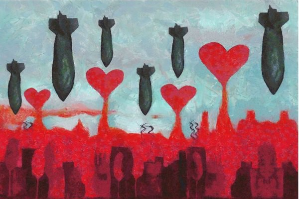
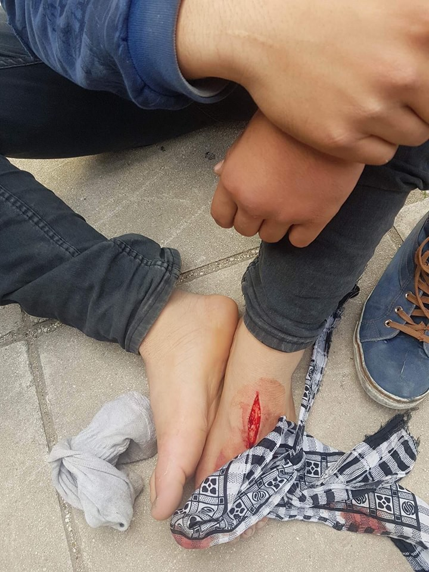
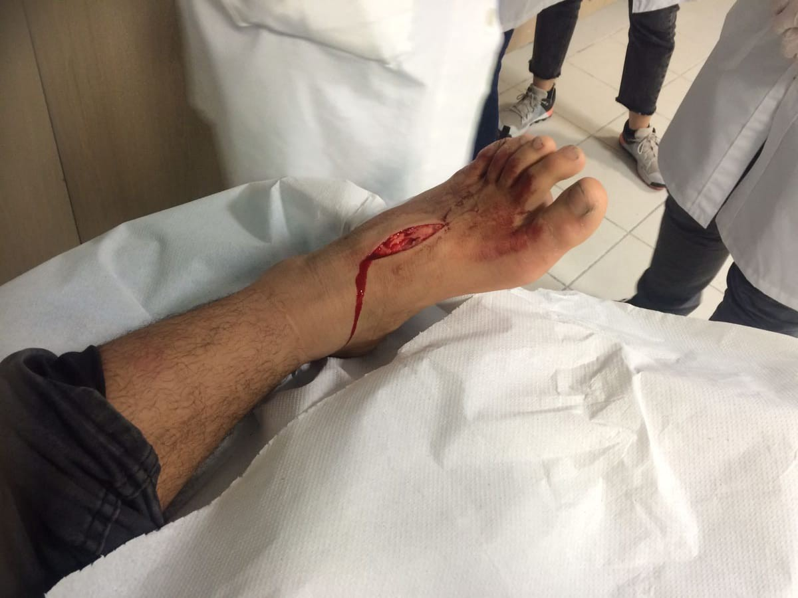
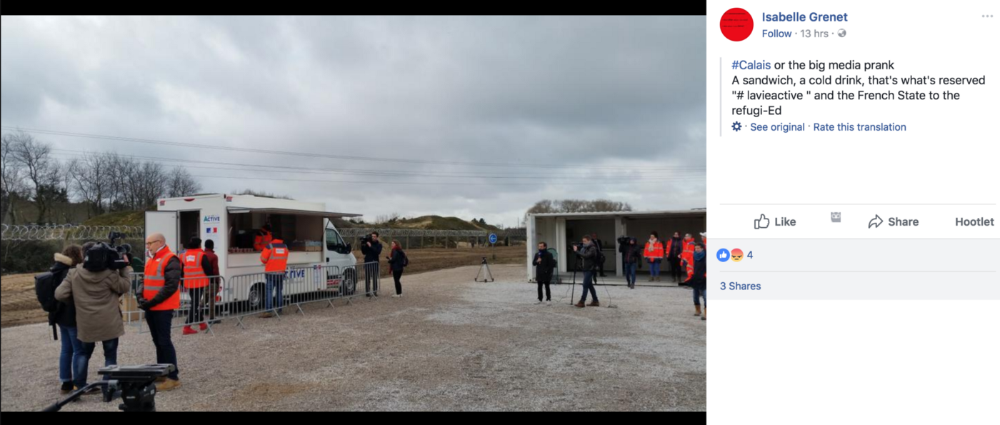
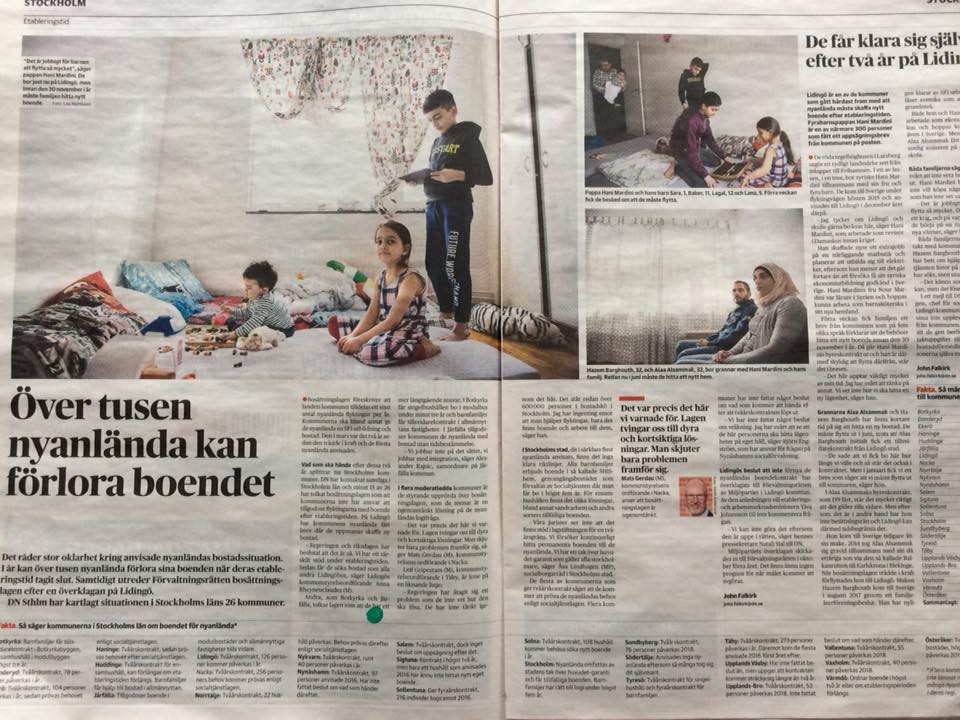

### AYS Daily Digest 06/03/2018: More deaths on land, more deaths at sea\. Surprise, surprise…
#### 23 people, including two infants, are feared to have died in the Mediterranean today\. Meanwhile, over 70 civilians have died in the besieged region of Eastern Ghouta, marking it the deadliest day since the 30 day ‘ceasefire’ was called by the UN\.
Overcrowding on Greek Islands continues/News from Greece/ Balkan Weather Report/ Anti\-muslim rhetoric intensifies in Hungary ahead of elections/ Family deported from Austria/ News from Spain/France/Sweden/Ireland

Painting by Wissam Al Jazairy
#### FEATURE — 23 People died at sea yesterday, bringing the death toll for 2018 to 421

23 people are feared dead after a rubber dinghy and wooden boat capsized off the Libyan Coast on its way to Italy, according to [SOS Mediterranee](https://www.iol.co.za/news/africa/21-feared-dead-72-rescued-from-migrant-ships-off-libyan-coast-13620714) \. 72 persons have been rescued thus far\. The organisation says most persons were from West African countries\.

IOM reports that 21 missing people were among 51 on the wooden boat\. In addition, two infants were discovered dead on board — bringing the presumed death toll to 23\.

■■■■■■■■■■■■■■ 
> **[Flavio Di Giacomo](https://twitter.com/fladig) @ Twitter Says:** 

> > IOM staff talking with some of the #migrants arrived today in Pozzallo.
It is confirmed that 21 migrants went missing at sea: 4 women and 17 men, all Western African nationals. https://t.co/YpSJwsj7rv 

> **Tweeted at [2018-03-06 11:59:35](https://twitter.com/fladig/status/970992286485139456).** 

■■■■■■■■■■■■■■ 

IOM spokesman [Joel Millman said](https://www.reuters.com/article/us-europe-migrants-libya/23-migrants-likely-dead-on-trip-from-libya-to-italy-iom-says-idUSKCN1GI1CC) that All 132 people on the rubber dinghy were rescued\.

■■■■■■■■■■■■■■ 
> **[MSF Sea](https://twitter.com/MSF_Sea) @ Twitter Says:** 

> > "Uncle don't leave me" - The last words one man told #MSF he heard from his 7-yr-old niece, as they were separated during a sea rescue. He is now safely on board the #Aquarius, while she was last seen with the Libyan coast guard as they returned people to #Libya. https://t.co/HXaF0uzWvW 

> **Tweeted at [2018-03-05 17:30:01](https://twitter.com/msf_sea/status/970713055003754503).** 

■■■■■■■■■■■■■■ 

■■■■■■■■■■■■■■ 
> **[MSF Sea](https://twitter.com/MSF_Sea) @ Twitter Says:** 

> > The #MSF team on board the #Aquarius are busy on deck today talking with the survivors from our latest transfer. With over 20 people reported missing, feared drowned, and others taken back to #Libya by the Libyan coast guard, there are many heart-breaking stories. https://t.co/NqLpQIPkAY 

> **Tweeted at [2018-03-05 16:00:03](https://twitter.com/msf_sea/status/970690414289268738).** 

■■■■■■■■■■■■■■ 

In the first two months of 2018, over 10,500 people have arrived to Europe by sea and the death toll has reached 421\.

■■■■■■■■■■■■■■ 
> **[IOM - UN Migration 🇺🇳](https://twitter.com/UNmigration) @ Twitter Says:** 

> > Breaking: 10,584 #migrants &amp; #refugees arrived by sea to Europe. 

421 dead/missing. Learn more ➡️ [missingmigrants.iom.int](http://missingmigrants.iom.int) https://t.co/IoJc9o7w0v 

> **Tweeted at [2018-03-06 08:49:37](https://twitter.com/unmigration/status/970944477434122240).** 

■■■■■■■■■■■■■■ 

### Syria

Over 70 civilians died in Eastern Ghouta yesterday as airstrikes continued in the region, marking it the deadliest day in Syria since the 30 days ceasefire was called by the UN\.

At 10pm local time, reports were released of [a chlorine gas attack by the Syrian regime in the town of Hamoreyeh\.](https://www.middleeastmonitor.com/20180306-chemical-attack-on-ghouta-injures-dozens/) 30 civilians were evacuated and emergency workers were able to save them, despite many including children being close to suffocation\.

Furthermore, adding to the prolonged suffering, [a convoy filled with desperately needed medical supplies](https://www.aljazeera.com/news/2018/03/syria-war-eastern-ghouta-sees-deadliest-day-battle-rages-180306063039157.html) and food evacuated before it was able to unload due to resumed shelling by Syrian Government forces\.

> As a result, nine trucks were prevented from unloading surgical supplies and medicines, as well as 5,500 bags of food and flour, enough to feed about 27,500 people\. 

Officials from international aid organisations confirmed that the government had blocked the offloading of about 70 percent of medical supplies, preventing trauma kits, surgical kits, insulin and other vital material from reaching the area\.

> Airstrikes continued as the UN and the ICRC entered Ghouta to deliver aid in the afternoon\. 70% of the convoy’s supplies were confiscated at regime checkpoints\. With more than 5,600 people injured over the last couple of weeks — and at least a dozen medical facilities damaged or destroyed — the trauma kits and surgical supplies that were taken by the regime were desperately needed by brave doctors and nurses working around the clock to save lives\. After making it aside, the UN convoy was forced to turn back early because of the bombing\. 14 of the 46 trucks that made it into Ghouta were not offloaded — [The Syria Campaign](https://www.facebook.com/TheSyriaCampaign/photos/a.608812989210718.1073741828.607756062649744/1688749317883741/?type=3&hc_location=ufi) 

[")](https://www.facebook.com/msf.english/videos/vb.33110852384/10155176158727385/?type=2)

Help Refugees have released a campaign to help rebuild a shelter that was damaged by shelling\. You can read more [via this link](https://donate.helprefugees.org/campaigns/syria-emergency-appeal/) \.

> Your donations will help Women Now rebuild their centre, as well as help to fund emergency medical supplies in Eastern Ghouta\. 

### Balkan Weather Report for Wednesday 07\.03

**Montenegro**

Wednesday in Montenegro will be moderately cloudy to cloudy with occasionally rain and locally rain showers or thunderstorms\. During the day in the far north there will be longer periods of dry weather and in the afternoon there will be sleet and snow in the mountains\. More intense precipitation is expected during the night\. The wind will be moderate to locally strong blowing from the south\. The temperature in the morning will be from 0 to 11 and during the day from 4 to 16 degrees\.

**Serbia**

Weather in Serbia will be cloudy with locally rain, the snow in the mountains is still rapidly melting therefore the hydro meteorological institute has issued a weather weather warning\. The winds are still expected to be strong, the weather warning for the winds is also still in place\. In the morning the temperature will be from 0 to 5, and during the day from 8 to 15 degrees\.

**BiH**

In Herzegovina it will be cloudy while in Bosnia it will be moderately cloudy\. During the day rain and rain showers are expected in Herzegovina and in the south west of the country\. In other parts locally rain of lower intensity and duration\. During the night from Wednesday to Thursday there will be more intense rainfall\. In the mountains snow is expected\. The wind will be weak to moderate from the south and southwest\. In the morning the temperature will be between 0 and 8 and during the day between 7 and 14 degrees\.

**Croatia**

In Croatia it will be variably cloudy with periods of sun, alongside the coast and the areas adjacent to it will be occasionally more cloudy with locally rain and possibly some rain showers\. In the second part of the day a little rain may fall in the central and eastern parts of the country\. Land inwards in the morning locally fog is possible\. The wind will be weak to moderate from the southwest, alongside the coast the wind will be blowing from the south\. Morning temperatures will be ranging from \-1 to 11, and during the day from 5 to 15 degrees\.
### Greece

Some of the services of GAS will be disrupted starting march 5 as short\-term employees go on strike due to lack of payment for 3 months — information in a number of languages is available [via this link\.](https://www.facebook.com/mobileinfoteam/photos/a.1800063030222418.1073741830.1796286800600041/2132813700280681/?type=3&theater)
#### Athens

The Elinko Warehouse in Athens is in desperate need of donations, primarily dry food and supplies\. They supply squats, mainland camps and the islands, families in apartment and the homeless in Athens\. Any groups that have the capacity to send containers of dry food \(and also needed, but less critical, hygiene supplies\) are urged to get in contact and PM Negia Milian for more details\.

> The way to register as an asylum seeker in Greece if you don’t come through the islands is by calling Skype\.
 

> The asylum offices are still only providing 3 computers for the thousands of people who have been trying for months and months to register\.
 

> In Khora we daily meet these people, who are afraid of walking the streets, afraid of being arrested — being arrested because of the failure of a registration system\.
 

> How long will the politicians let these people wait? — Khora 

#### Patras

Extreme police brutality again is witnessed in Patras\. A fourteen year old Afghan boy was stabbed by coast guard on his foot and hit with batons while they tried to remove his shoes\. He was then driven to the hospital by the policemen who claimed he stabbed himself\.

#### Greek Islands

Almost two years after the signing of the EU\-Turkey statement, thousands of people are still trapped on the Aegean islands in very poor conditions\. Over 200 are detained\.

[Nine organizations, among which the Greek Council for Refugees, continue the campaign for the decongestion of the islands](http://www.gcr.gr/index.php/en/news/press-releases-announcements/item/793-almost-two-years-after-eu-turkey-statement-people-are-still-trapped-on-the-islands) , which was launched in December, and urge the Greek government and the EU to end the containment policy\.

■■■■■■■■■■■■■■ 
> **[GreekCouncilRefugees](https://twitter.com/GCRefugees) @ Twitter Says:** 

> > As EU-Turkey deal anniversary nears tell @PrimeMinisterGR &amp; #EU leaders: No one should be trapped and sleep in a tent on #Greece's Aegean Islands. End the containment &amp; #OpenTheIslands now. (Photo credit: Dimitris Michalakis/GCR)

[gcr.gr/index.php/en/n…](http://www.gcr.gr/index.php/en/news/press-releases-announcements/item/793-almost-two-years-after-eu-turkey-statement-people-are-still-trapped-on-the-islands) https://t.co/XinY2wUeMf 

> **Tweeted at [2018-03-06 12:28:39](https://twitter.com/gcrefugees/status/970999599673507840).** 

■■■■■■■■■■■■■■ 

Today [a joint press release](https://www.hrw.org/news/2018/03/06/greece-13000-still-trapped-islands) has been issued by numerous organizations, calling to \#OpenTheIslands\.

■■■■■■■■■■■■■■ 
> **[Janine Louloudi](https://twitter.com/janinel83) @ Twitter Says:** 

> > Thousands of asylum seekers are trapped on the Aegean islands in deplorable conditions and without access to adequate protection and basic services, nine human rights and humanitarian organizations said today. #Refugeesgr #Greece #migrants #Refugees [hrw.org/news/2018/03/0…](https://www.hrw.org/news/2018/03/06/greece-13000-still-trapped-islands) 

> **Tweeted at [2018-03-06 06:46:37](https://twitter.com/janinel83/status/970913525819494401).** 

■■■■■■■■■■■■■■ 

Refugee Support Aegean also released a statement and videos that insist to [stop the toxic EU\-Turkey Deal](http://rsaegean.org/stop-the-toxic-eu-turkey-deal/) \. ‘Stories for two disgraceful years for Europe\.’

#### Lesvos:

[A celebration is occurring on Lesvos for International Women’s Day\.](https://www.facebook.com/events/337581620064565/)

> For this occasion we invite everyone to send messages to the women on Lesvos from now on\! Let’s join hands of solidarity from all over the world\. A picture, a video, some words — we’ll exhibit everything this Saturday at the Mosaik Support Center\! 

### Bulgaria

Refugee Info has released information on how to find a good lawyer in Bulgaria\. You can [find out more via this link\.](https://www.refugee.info/bulgaria/legal-services--bulgaria/finding-a-good-lawyer-in-bulgaria)
### Hungary

Hungarian Prime Minister; [Viktor Orbán’s government has been accused](https://www.politico.eu/article/hungary-syrian-terrorism-trial-election-spotlight/) of using a terrorism case to boost anti\-migrant message, just one week before parliamentary election\.

> The court in the southern city of Szeged is due to give its verdict in the retrial of a Syrian man convicted of terrorism and jailed for 10 years for his role in a confrontation between police and asylum\-seekers on the border with Serbia in 2015\. 

Human Rights groups and EU officials have frequently condemned Hungary’s treatment of Ahmed H\., arguing that is senseless to charge him with terrorism over a altercation at the borders\. They state that this only highlights how Orbán’s government has exploited vulnerable people for its own political gains\.
### Austria

[A Kurdish family has been deported](http://burgenland.orf.at/news/stories/2899462/) from Austria to Bulgaria despite many locals in Burgenland attempting to prevent the deportation\.

> The mother was deported with the four children, at the age of 2\.5 to 11 years, without the family man, which I do not understand at all\. He is currently undergoing inpatient medical treatment in a hospital in Austria\. What I do not understand yet is that the family was deported to a country where they had to make traumatic experiences while fleeing\. They have been in jail before and have been mistreated\. 

### Germany

[Info Migrants have released a statement](http://www.infomigrants.net/en/post/7881/munich-integration-plan-successful-but-there-is-still-work-ahead) praising Munich for its attempts at integration despite challenges faced, however they also warn that there is still much work left to do\.

> The Bavarian city of Munich received 21,541 refugees between 2012 and 2016, according to Munich\-based organizations dedicated to assisting refugee with integration\. The organizations say the work that has been done in the city has been successful\. 

### Spain

Three days of talks relating to migration to be held in Madrid:

### France

A cinema for refugees sleeping rough in Paris —If you want to get involved or find our more please [follow this link](https://www.facebook.com/lola.siran/posts/10215684877098949) \.

Phone top ups are important\! Read this story to find out how just one top\-up can impact a life\.

Today the French Government took over the responsibility of providing food to those stuck in Calais\. Safe Passage reports that only two people turned up to get food — being intimidated by the razor blade barbed wire fence and many journalists present\.

While [some are happy to see the State finally assuming on some responsibility](https://twitter.com/aubergemigrants/status/970928042569797633) , volunteers are labelling the state operation a big ‘media prank’

### Sweden

More than 1000 newly arrived people can lose their accommodation in Stockholm in 2018, according to Dagens Nyheter\. The paper has mapped the situation in Stockholms 26 different municipalities, and depending on political leadership in the municipalities, the situation for the people of concern can be different\. 15 out of 26 municipalities think that their responsibility to help provide housing ends after two years time\.

In Sweden, there is a “residence act”, which is laws about accommodation for newly arrived people, that says that during the establishment phase \(two years from the positive decision\), the responsible municipality has to provide housing\. After that, the family or person is considered to be just as any other Swedish person, which means that they will have to find their own apartment, house or accommodation\. Given the fact that the housing market, especially in Stockholm, is pure madness, as it is both expensive and a big lack of affordable apartments, this is very hard for those who don’t speak the language fluently, have no previous knowledge about Sweden and in many cases still are unemployed\. Some municipalities are doing a more narrow interpretation of the law, saying that the responsibility ends after two years, whereas some say that it won’t be possible for the people to find their own accommodations and will continue to provide help\. People pay the apartments by themselves anyhow, with money provided by the state\.

Different politicians with different belongings and agendas are of course motivating both the law and their interpretations of it in different ways\. One conservative/liberal \(Moderat\) politician claim that they knew the situation would get out of hand since promising to house for two years is to postpone problems \(since there is a big lack of housing in general\) \. In one municipality where they ended all contracts, the Green Party filed a lawsuit, the case will be up in court but it’s not clear when\.

Due to the big influx of refugees in 2015, and many decisions taken in 2016, this situation will just increase since a lot of people will finish the “establishment phase” in 2018\.

### Ireland

Syrian refugees in Roscommon are demanding that the Irish Red Cross stops managing their settlement cases\.

The group of 30 single residents have signed a letter that urges the Department of Justice to step in and take over control\.

The letter states that there has been ‘a lack of any progress in advancing their position, leaving them feeling like “prisoners in a plan” that is depressing their ability to join Irish society\.’

The full letter can be read [via this link\.](https://www.rte.ie/eile/2018/0305/945242-refugees-demand-irish-red-cross-stop-managing-settlement-cases/)

**We strive to echo correct news from the ground through collaboration and fairness\.**

**Every effort has been made to credit organizations and individuals with regard to the supply of information, video, and photo material \(in cases where the source wanted to be accredited\) \. Please notify us regarding corrections\.**

**If there’s anything you want to share or comment, contact us through Facebook or write to: areyousyrious@gmail\.com**

_Converted [Medium Post](https://medium.com/are-you-syrious/ays-daily-digest-06-03-2018-more-deaths-on-land-more-deaths-at-sea-surprise-surprise-3b262b49679e) by [ZMediumToMarkdown](https://github.com/ZhgChgLi/ZMediumToMarkdown)._
