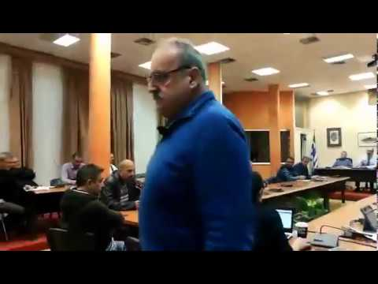
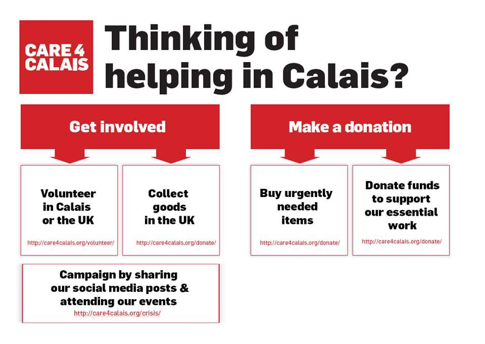

### AYS Daily Digest 07/03/2018: No place for fascism

_Members of Greek Neo\-nazi groups arrested ahead of major bomb attack / Chemical weapons used again in East Ghouta, at least 50 died / Turkey plans to establish refugee camps in Syria / New government funded distribution point in Calais / AIDA reports on Romania, Austria and more_

](assets/f507e9374c57/1*r0uEjtpY0UpdQfTSqzWI5w.jpeg)

Vial, Chios — photo by [Advocates Abroad](https://www.facebook.com/advocatesabroad/?hc_ref=ARTi13qwNy8WSbYZGLjuFLVAd3l5PWJojEnFFYsK3i0rjlTGZ6MwarRvPmjtEHWIURk&hc_location=group)
#### FEATURE

Members of two groups of Greek neo\-Nazis, both having connections with the far\-right party, Golden Dawn, were arrested today in a police crackdown across the country, DW [reports](http://www.dw.com/en/greek-neo-nazis-arrested-in-police-crackdown/a-42855743) \. The groups Combat 18 \(Hitler symbolics\) and Autonome Nationalists \(Independent Meandrian Nationalists\), suspected of many attacks on refugees and antifascists, were planning a major bomb attack, a police spokesperson said\. Police confiscated material that included 50kg of nitrous ammonia, butane canisters, petrol bombs, knives, clubs, hunting weapons, flags and other objects bearing extreme right imagery\.

Photos of arrests can be found [**here**](https://l.facebook.com/l.php?u=http%3A%2F%2Fwww.lifo.gr%2Fnow%2Fgreece%2F183183%2Foi-neonazi-tis-organosis-combat-18-hellas-ston-eisaggelea-fotografies&h=ATMHgxeS0nbgGxIAhXNx2pP1T5vYLPnL-DmZLK663OSHvx8pR-9iMA7LaNEPmAMKVijgVQGqWMQwUoO8kkQOoKLp6O1Km4UNjk1hr_7n-sj7n4bmzw) \.

Among the arrested is a lawyer, who appears to be a former party leader, as well a founding member of the right wing advocacy group, DIESY, and also a former member of the National Council of “Nea Dexia”, meaning “New Right”, borderline reports [writes](https://borderlinereports.com/2018/03/07/former-new-right-party-leading-member-among-arrested-extreme-rightists/) , adding:

> if it is confirmed that a former National Council member of “New Right” was arrested for extreme right wing terrorism, this raises questions about what sort of relationship the extreme right has with legitimate right wing parties\. 

#### Chios City Council members leave room as a reaction to Golden Dawn presence at council meeting

Meanwhile, two members of Golden Dawn were present at a City Council meeting today in Chios\. One of them, John Flax, complained both about the fact that police blocked the access road to Karfas on the day of their party’s planned event and about the adoption of a resolution by the City Council condemning the presence of its parliamentary representatives, Politis Chios [reports](http://www.politischios.gr/aytodioikisi/binteo-adeiase-to-demotiko-sumboulio-episeme-parembase-tes-khruses-auges) \.

As a direct reaction during the intervention of Golden Dawn, Mark Skoufalos tacitly left the meeting\. His reaction was followed by almost all members of the City Council, symbolically showing their repudiation for Golden Dawn and what it stands for\.

The President of the Municipal Council, Yannis Georgiades, explained that he was present in the room as the representative of the institution\. In response, he refused to withdraw the resolution, pointing out that it reflects the unanimous position of the City Council\.

#### SYRIA
#### East Ghouta

“Hysterical” bombing, with banned chemical weapons \(Napalm, Phosphorus, Cluster Bombs, and now Chlorine\) occurred again today in East Ghouta\. SAMS facilities are receiving patients suffering from symptoms consistent with exposure to chlorine gas\. At least 14 children with these symptoms are being treated at just one of their facilities, they [reported](https://www.facebook.com/SyrianAmericanMedicalSociety/photos/a.258039294245879.57539.187820854601057/1638366382879823/?type=3) \.

> At least 50 people have been killed today\. People are dying on the streets because ambulances and the Syrian Civil Defense cannot access the injured due to the shelling\. Civilians are being killed and gravely injured by the hour — nowhere is safe, even hospitals and underground shelters\. If they don’t die immediately, the injured often succumb to their wounds because of lack of medical care\. Just a few days ago, surgical items and trauma kits were cruelly removed from an inter\-agency convoy heading into East Ghouta\. 

This is the eighth use of a chemical weapon in Syria in 2018, and the fourth in East Ghouta in the same time period\.

Nearly two weeks ago the UN Security Council passed a resolution that urged those involved in Syria’s conflict to allow humanitarian aid and medicine to reach nearly half a million desperate civilians trapped in East Ghouta\. So far, the resolution has been largely ignored by the Syrian government, HRW [writes](https://www.hrw.org/news/2018/03/07/un-security-council-should-protect-eastern-ghouta) \. About 38% of civilian casualties during 18 days of shelling in East Ghouta were killed after the resolution and during Putin’s truce, SOHR [reported](http://www.syriahr.com/en/?p=86316) \.

White Helmets [called for immediate action\.](https://www.facebook.com/1489609321340242/photos/a.1500284590272715.1073741829.1489609321340242/1842119066089264/?type=3&theater)

Rebels in Syria’s East Ghouta “refuse to leave” and have reiterated they will defend the area, saying a Russian\-proposed withdrawal was not a serious offer, Al Jazeera [reports](https://www.aljazeera.com/news/2018/03/syria-army-intensifies-fight-rebels-eastern-ghouta-180307092826609.html) \.

Here is a [**map**](https://www.google.com/maps/d/u/0/viewer?mid=1YYKybUEcQMxmDwW0Pf01UgdygcWWLIfA&ll=14.771114417940483%2C-70.9609069999999&z=2) of all solidarity actions for Ghouta worldwide\.
#### LIBYA
#### UN wants to remove 8000 refugees from Libya

The UN High Commissioner for Refugees has so far removed 1,344 refugees qualified as vulnerable from Libya, with the goal of reaching 8,000 by the end of the year\. These refugees were re\-routed to third countries, namely Niger and Italy\. This group is only a fraction of the 48,000 registered refugees in Libya, abola [writes](https://www.abola.pt/Mundos/Noticias/Ver/719646) \.
#### TURKEY
#### Plan to establish refugee camps in Syria

The Turkish government announced it will set up camps for 170,000 displaced people within Syria ahead of an influx of refugees from the Syrian region of Afrin, InfoMigrants [reports](http://www.infomigrants.net/en/post/7937/turkey-plans-to-establish-refugee-camps-in-syria?ref=tw) \. A spokesman for Turkey’s foreign ministry, Hami Aksoy, said on Tuesday that new refugee camps would be established in nine different regions in Syria including Azaz, Elbil, Tugli, Teleffer, Naddah, Bardakh and Masad Rufi\.

230,000 Syrian refugees are living in camps on the Turkish side of the border, according to the Turkish government\. The majority of refugees in Turkey, numbering **more than 3 million** , are living outside the camps\.
#### GREECE
#### Amnesty International on Samos

Amnesty’s team was in Samos last week to assess the living conditions of people in camps on the island\. Their reports said that the camp was massively overcrowded and described it as a security and health nightmare\. [Amnesty says](http://www.infomigrants.net/en/post/7923/amnesty-international-puts-spotlight-on-samos?ref=tw_i) the refugee camp on the Greek island of Samos is “crawling with rats”\. After the visit, they have renewed calls for people in the overcrowded camps to be transferred to the Greek mainland\.

The police stations in the islands are being used as detention centers for those who have been refused asylum claims\. According to NGOs working with prisoners there, many men have been held in the police stations for months, in inappropriate places for long\-term detention\. One of them told Amnesty: “There is no natural light in this place; there are no mattresses or pillows\. People who are detained are going crazy if they are not already crazy\.”

Here are the latest official governmental statistics on arrivals to the Aegean islands:

#### Spanish firefighters accused of trafficking people in Lesvos

Manuel Blanco, Julio Latorre, and Enrique Rodriguez, three firefighters from Seville, Spain, who have helped out in multiple refugee rescue missions on the Greek island of Lesvos, could be facing 10 years in prison due to accusations of smuggling by the Greek government, Euronews [reports](http://www.euronews.com/amp/2018/03/06/three-spanish-firefighters-accused-of-trafficking-people-in-lesbos) \.

“If a person is drowning and you bring them ashore to try and save them, that can be seen as facilitating their entry,” Blanco said\. This, in his opinion, blurs the fine line between human trafficking and humanitarian aid\. He spoke to Euronews from Brussels, where he’s trying to gather support from Spanish MEPs ahead of the May 7 trial in Mitilini, Lesvos\.

In honor of International Women’s Day tomorrow, City Plaza hosted a release [event](https://www.facebook.com/events/738815169660989/permalink/739419196267253/) for “Plaza Girls’ Zine”\. Refugee ‘girls of City Plaza’ presented 7 small zines, as a result of their working group\.

> ‘As Women we are powerful\. We want our freedom to be able to do all the things that men are allowed to do\. We need to continue our education, so we too can have our dreams and put them into practice\. The dreams that we have been harbouring for years’ _— Plaza Girls_ 

#### BALKAN WEATHER REPORT for Thursday 08\.03\.

**Montenegro** 
In the early morning there will be moderate to heavy rain, while in the north in the mountains moderate snow will fall\. Later in the morning in the south and centre, and in the afternoon in the north, precipitation will decrease and it will partially clear up\. The wind will be weak to moderate, alongside the coast it will be intensified to strong blowing from the northwest and north\. The temperatures in the morning will be from \-1 to 10 and during the day from 2 to 16 degrees\.

**Serbia** 
In Serbia it will be cloudy and a bit colder, locally it will rain and in the higher mountains snow is expected\. Snow will be melting rapidly in the lower mountains\. In the evening and during the night precipitation will cease\. The wind will be weak to moderate blowing from the west and northwest\. In the morning the temperatures will be from 2 to 7 and during the day from 7 to 11 degrees\.

**Bosnia and Herzegovina** 
Thursday in Bosnia and Herzegovina it will be mostly cloudy with rain before noon while in the mountains there will be sleet and snow\. In the afternoon gradually both precipitation and clouds are going to decrease\. The wind will be weak to moderate blowing from the east and southwest\. The morning temperatures will be from 1 to 7 and during the day from 5 to 13 degrees\.

**Croatia** 
In the morning it will be moderately to predominantly cloudy with local rain\. Before noon it will gradually start clearing up from the west with local rain in some parts of the country\. The wind is mostly weak, in the eastern part of the country and on the Adriatic to moderate northwestern and western\. The temperatures in the morning will be from \-1 to 9 and during the day 6 to 14 degrees\.
#### ROMANIA

Asylum Information Database \(AIDA\) published a new Country Report on Romania, covering a thorough analysis of the legal framework and practice relating to the asylum procedure, reception conditions, detention of asylum seekers and content of international protection\. Read it in full [**here**](http://www.asylumineurope.org/sites/default/files/report-download/aida_ro.pdf) \. The number of asylum seekers applying for protection in Romania has more than doubled from 1,880 in 2016 to 4,820 in 2017\. The vast majority of applicants originated from Iraq, followed by nationals of Syria, Afghanistan and Pakistan, they wrote\.
#### AUSTRIA

The updated AIDA Country Report on Austria [provides](http://www.asylumineurope.org/news/07-03-2018/aida-2017-update-austria) detailed information and statistics on asylum procedures, reception conditions, detention and content of protection, covering recent legislative and policy restrictions on the rights of asylum seekers, as well as case law developments\.

The new government has announced further restrictions in the asylum procedure, residence restrictions including specific accommodation, extended the maximum duration of pre\-removal detention and further restrictions in the level of social benefits in a number of provinces\.

Find the full report [**here**](http://www.asylumineurope.org/reports/country/austria) \.
#### FRANCE

Local authorities in Calais fulfilled the promise made by president Macron to provide food to refugees sleeping rough\. Yesterday, for the first time in 28 months, [**Refugee Community Kitchen**](https://www.facebook.com/refugeeCkitchen/?hc_ref=ARSW8Trh_b7NnypiloobpubeziSHig3NvDsSPn_PXU3QKxTFQo7n4TTCifhSaA6kJy4) didn’t provide food for these people\.

They posted [footage](https://www.facebook.com/refugeeCkitchen/videos/2087920247892001/) of the new government funded distribution point in a compound surrounded by fences crowned with razor wire\. “The wall of journalists waiting inside to film was most inappropriate and completely deaf to the peoples’ needs and safety\. The food consisted of beef and potatoes\. No fresh vegetables” they said, adding that hundreds of people refused to eat there, some for political reasons \(people won’t accept food until the government halts its violent evictions and confiscation of their belongings\) and others out of mistrust for authorities\.

**How you can help:**

**Paris — [Solidarité migrants Wilson](https://www.facebook.com/Solidarit%C3%A9-migrants-Wilson-598228360377940/?hc_ref=ARRNmUQIbaksWUi-nv0XVg93oSNMs6DJtIEHFVhsAVDAo2l-Vot95IBNHX1czPsVdXY&fref=nf)** is looking for volunteers for their breakfast distributions in the morning\. If you have a few hours to give you are welcome to contact them or register right away [**here**](https://docs.google.com/spreadsheets/d/1CDTu2aZcuhldwhfPfrch75FxfsIFTbe97SN17bq2MQc/edit?ts=5849bb00#gid=0) \.

](assets/f507e9374c57/1*E_jp6TvS5jcH4McI8Fqccw.jpeg)

Snow and freezing temperatures hit Calais this past week\. Emergency accommodation is now closed and refugees have been sleeping rough in this awful weather\. Volunteers have been working tirelessly to keep refugees safe and warm\. — [Help Refugees](https://www.facebook.com/HelpRefugeesUK/)

Tents are [desperately needed](https://www.facebook.com/heather.young.94009841/posts/10160158719470302?hc_location=ufi) around Paris\! Firewood is [needed](https://www.facebook.com/AubergeMigrants/posts/10155872256725339?hc_location=ufi) in Calais\.

Tents and belongings were destroyed in yet another evacuation:

**We strive to echo correct news from the ground through collaboration and fairness\.**

**Every effort has been made to credit organizations and individuals with regard to the supply of information, video, and photo material \(in cases where the source wanted to be accredited\) \. Please notify us regarding corrections\.**

**If there’s anything you want to share or comment, contact us through Facebook or write to: areyousyrious@gmail\.com**

_Converted [Medium Post](https://medium.com/are-you-syrious/ays-daily-digest-07-03-2018-no-place-for-fascism-f507e9374c57) by [ZMediumToMarkdown](https://github.com/ZhgChgLi/ZMediumToMarkdown)._
