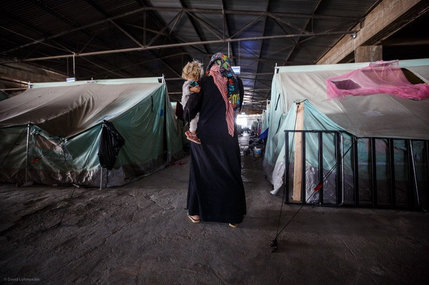
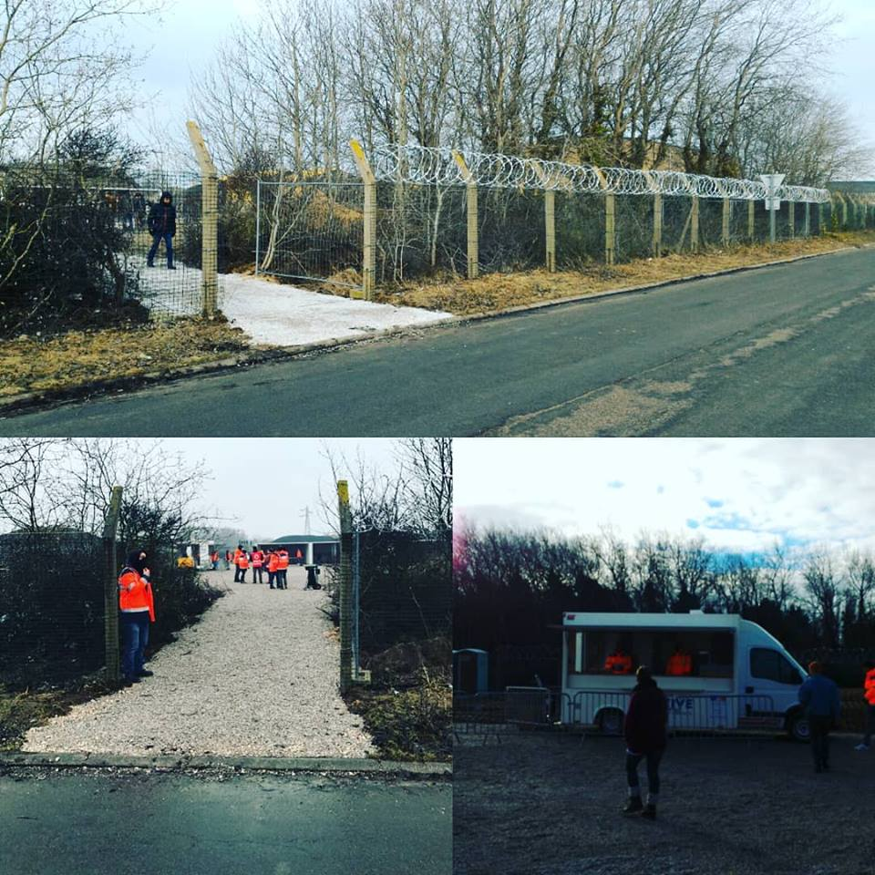
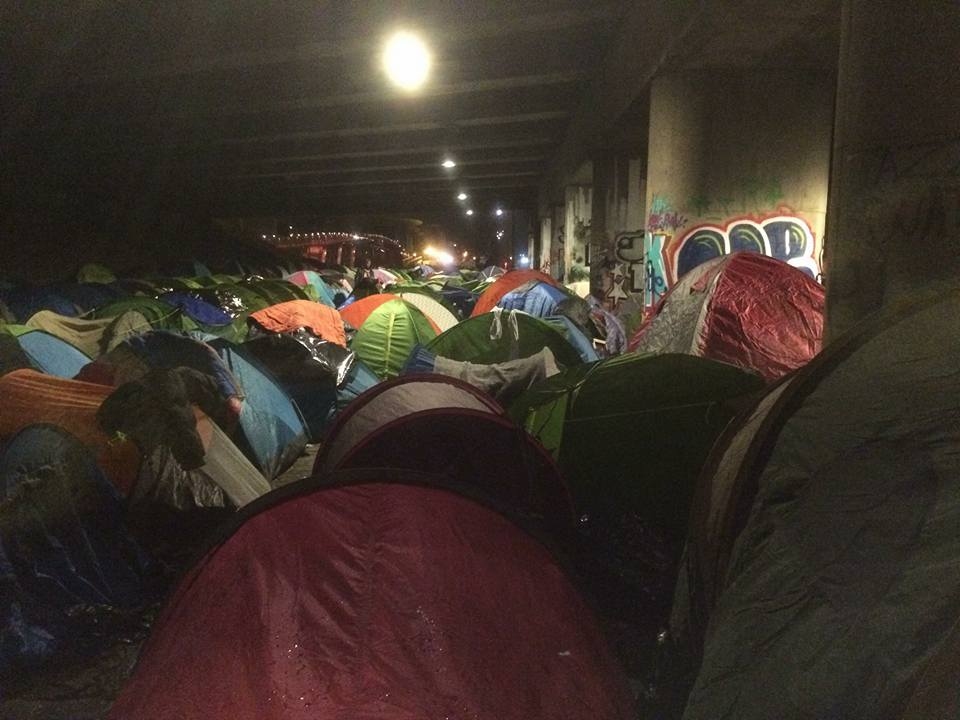
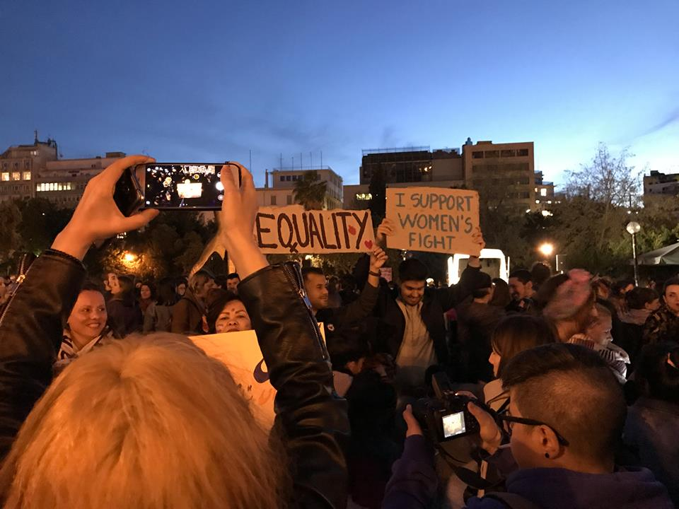

### AYS Daily Digest 08/03/18: Refugee women at risk

_Update on food distributions in Calais / Refugee women at risk in Greece / Women continue their hunger strike at the Yarl’s Wood Immigration Removal Centre in the UK / Help needed in Sarajevo / EU anti\-slavery mission hits a deadlock / And more news…_

Part of out of sight, out of mind story\. \(Photo by David Lohmueller\)
### FRANCE
#### Update on food distributions in Calais

The French government has started taking over the distribution of meals in Calais through the association La Vie Active\. 700 meals will be distributed daily, but the number can be “adjusted according to need” according to the prefecture\.

Most associations say they are standing by and waiting to see how it all goes down\. However, the three distribution points are situated on the periphery of the city, and L’Auberge des Migrants said it was disappointed by this decision, as “people who live in the town center will have trouble getting there\.” The organization also called for dignified distributions, as they currently take place behind razor wire and are surrounded by security forces\. The Refugee Community Kitchen meanwhile said, “the food consisted of beef and potatoes\. No fresh vegetables”\. It adds that “hundreds of people refused to go to the government\-funded food distributions yesterday, some for political reasons \(…\) and others out of mistrust for authorities\.” According to Care4Calais, only 170 people turned up to get food during the first distribution on Monday\. It says, “the French authorities have continually underestimated the numbers in Calais and we do not consider it likely that the need for independent associations to provide support will disappear\.” Last night, Mobile Refugee Support’s night patrols were busier than usual, as many people had not eaten in the last 24 hours\.

Photos by L’Auberge des Migrants
#### Paris

According to Paris Refugee Ground Support, around 1,000 people are currently sleeping along the canal\. Last night, three full van\-loads of tents, sleeping bags, duvets, roll mats, and blankets were distributed\. More tents and sleeping gear are [desperately needed](https://www.gofundme.com/4dwnptc) \.

### GREECE
#### Refugee women’s rights in Greece

Last night, an International Women’s Day demonstration against sexism and for the rights of refugee women took place in Athens\. Women from the Jafra refugee center were leading the march, attended by around 500 people\.

Photo by AYS

[MSF](http://becauseimawoman.msf.org/en/) notes that women that were forced to leave their country are most at risk of sexual violence, unwanted pregnancies, and mental health issues\. Refugee women also face a heightened risk of sexual violence on the Greek islands because of tensions and overcrowding in reception facilities, according to Human Rights Watch\. A lack of lit hygiene facilities for example, leads women to be afraid of going to the washrooms after dark\. The lack of safe spaces for women forces them to rely on men for protection, placing them even more at risk of exploitation, according to [Help Refugees](https://www.allwomencount.co.uk/single-post/2018/03/06/Women-on-the-move-need-safety) \. The One Happy Family Center on Lesvos says that especially unaccompanied women in Moria often become victims of abuse and are struggling to be safe every day\. To improve the situation, Human Rights Watch calls on Greece and the EU to [end the containment of asylum seekers on the islands](https://www.hrw.org/opentheislands?platform=hootsuite) and to accelerate transfers to the mainland\.

At a global level, the [UNHCR](https://news.un.org/en/story/2018/03/1004342) points out that refugee girls are only half as likely as their male peers to enrol in school\. The reports notes that this is not only due to cultural aspects, but also to poor facilities, such as the lack of appropriate toilets and sanitation facilities\.
#### Dentists needed on Lesvos

The Health\-Point Foundation needs dentists over the next few weeks on Lesvos\. Please get in touch at [dental@healthpointfoundation\.org](mailto:dental@healthpointfoundation.org) \.

More volunteer needs can be fund at [Greecevol](https://www.greecevol.info/) \.
### TURKEY
#### Refugees continue to try reaching Greece from Turkey

[Refugee Support Aegean](http://rsaegean.org/stopthetoxicdeal-reception-conditions/) reports that poor reception conditions in the island hot spots, coupled with the policy of geographical restriction, are two of the most important deterrence factors for refugee flows from Turkey\. However, people still try to cross from Turkey to Greece in large numbers\. [Legis](http://legis.mk/news/2502/turkey-over-1-280-undocumented-migrants-held-in-2-days) says that more than 1,200 people have been held over the last two days in Turkey for attempting to illegally cross the country’s borders\. 57 people were held while they were trying to illegally cross into Greece\.
### BOSNIA AND HERZEGOVINA
#### Help needed in Sarajevo

More people are arriving every day to Bosnia—Sarajevo in particular\. So far, the state and large NGOs’ response has been minimal, and volunteers are doing everything by themselves\. The biggest support comes from local NGO pomozi\.ba\. They ask us to spread their call for help\. Here is the information, if you can support them:

Name of the bank: Intesa Sanpaolo Banka BiH
SWIFT CODE:UPBKBA22
IBAN: BA39 1541802008533048
Receiving: Udruženje “Pomozi\.ba”, dr\. Fetaha Bećirbegovića br\. 8, 71000 Sarajevo
Purpose: help for refugees

If you want to send financial support from Austria:
ERSTE BANK
IBAN: AT64 2011182266475400
BIC: GIBAATWWXXX
Wien, Oestereich
Name: hilfhelfen\-pomozi\.ba

If you want to volunteer in Bosnia, please get in touch through the AYS inbox on Facebook\.
#### UK
#### Hunger strike at Yarl’s Wood Immigration Removal Centre continues on International Women’s Day

Women in Yarl’s Wood Immigration Removal Centre continue their hunger strike on International Women’s Day:

> “We wish we could be celebrating with you on this day, but we are not free to do so \(…\) We women here in Yarl’s Wood did not anticipate our freedom would be taken from us or the impact it would have\. We are on a hunger strike because we are suffering unfair imprisonment and racist abuse in this archaic institution in Britain\. This is a desperate measure due to desperate circumstances\. We feel voiceless, forgotten and ignored\. We needed a voice and more importantly we needed someone to listen”\. 

Their demands include an end to indefinite detention, the respect of human rights law and the end of deportations for people before their cases are decided or appeals are heard\. In the context of International Women’s Day, the hunger strikers insist on the need for the Home Office to recognise rape as torture:

> The fact that they won’t in itself just shows how far we have to go\. Many women in here are victims of sexual violence, trafficking and torture and this place is retraumatising them\. This is against the Home Office’s own guidelines\. 

The hunger strike started on the 22nd of February over “inhumane” conditions at the facility\. Women told the [Independent](http://www.independent.co.uk/news/uk/home-news/yarls-wood-women-immigration-detention-centre-hunger-strike-home-office-a8223886.html) that they had “given up thinking about the outside world” due to uncertainty over being locked up indefinitely, saying the centre was “failing” to meet their health needs\.

](assets/294fbe016fd9/1*MRiIObZ2ldz7TggcXMagYw.png)

Photo by [RefuAid](https://www.facebook.com/refuaid/)
### ITALY
#### Revolt on Lampedusa

A protest took place inside the hotspot of Lampedusa, leading to a fire that was rapidly contained by firefighters\. None of the people inside the hotspot were injured\.
### AUSTRIA
#### Deportations accelerate

On the 20th of March, a deportation flight will take place from Austria to Afghanistan, and to Nigeria, Gambia, and Ghana from the 18th to 20th of April according to [No Racism](http://no-racism.net/article/5317/) \.

People who may be concerned by a mass deportation flight are those who have had a definite negative result on their asylum case and those who are living “irregularly” in Austria\.

The updated [AIDA Country Report on Austria](http://www.asylumineurope.org/news/07-03-2018/aida-2017-update-austria) notes that the time limit for appealing a negative decision has been established at four weeks in all cases, regardless of whether the application is processed in the regular, Dublin, or accelerated procedure\. It also provides details on a November 2017 reform, that extends the maximum duration of pre\-removal detention from four months to six months for adults\.

The UN High Commissioner for Human Rights has expressed his concerns over the situation in Austria, noting that the new government includes an openly anti\-migrant party that plans to embark on a broad criminalization of “irregular migrants,” “with the stated intention to automatically expel them\.”
### LIBYA
#### EU anti\-slavery mission in Libya at risk

[Reuters](https://www.reuters.com/article/us-europe-migrants-libya-niger/refugees-stuck-in-libyan-prisons-as-u-n-evacuation-plan-stalls-idUSKCN1GJ33U) reports that the UNHCR says an emergency plan to evacuate refugees from dangerous prisons in Libya has stalled because European countries are taking too long to resettle them\. The plan was to bring refugees from Libya to Niger and then resettle them in Europe\. Karmen Sakhr from the UNHCR said “we were advised that until more people leave Niger, we will no longer be able to evacuate additional cases from Libya,” according to the [EU Observer](https://euobserver.com/migration/141205?utm_content=buffer92b4d&utm_medium=social&utm_source=twitter.com&utm_campaign=buffer) \. The slow pace of resettlement is leading to distrust in the programme\. Most refugees brought to Niger are Ethiopian, Eritrean, and Somalian and more than a quarter are unaccompanied children\.
### SEA

Salvamento Maritimo rescued 36 people off the island of Alborán, in the sea between Spain and Morocco\. Frontex intercepted a boat with 48 people off Italy’s eastern coast coming from Turkey\.

On International Women’s Day, rescue organisations point out the particular situation of women crossing from Libya to Europe\. SOS Méditerranée says of the 27,173 people rescued by the _Aquarius_ over the last two years, 4,268 were women\. Sea\-Watch calls on the EU to stop supporting push\-backs to Libya, especially given the widespread reports of sexual violence experienced by women in Libyan camps\.

**We strive to echo correct news from the ground through collaboration and fairness\.**

**Every effort has been made to credit organizations and individuals with regard to the supply of information, video, and photo material \(in cases where the source wanted to be accredited\) \. Please notify us regarding corrections\.**

**If there’s anything you want to share or comment, contact us through Facebook or write to: areyousyrious@gmail\.com**

_Converted [Medium Post](https://medium.com/are-you-syrious/ays-daily-digest-08-03-2018-refugee-women-at-risk-294fbe016fd9) by [ZMediumToMarkdown](https://github.com/ZhgChgLi/ZMediumToMarkdown)._
