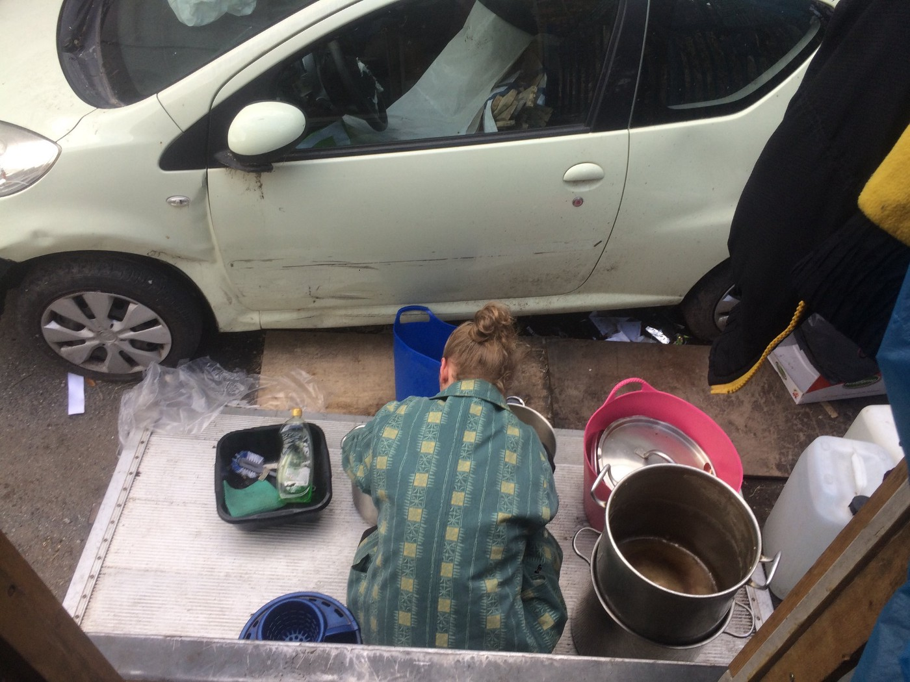
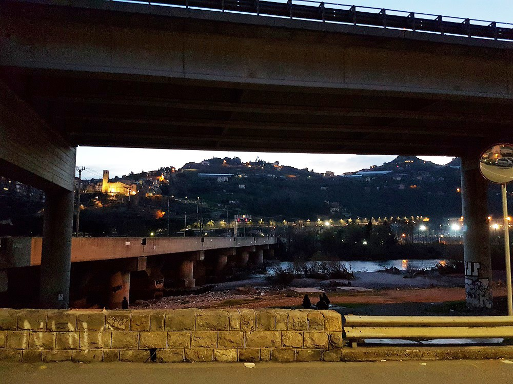
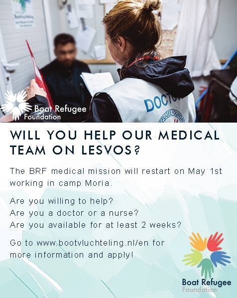
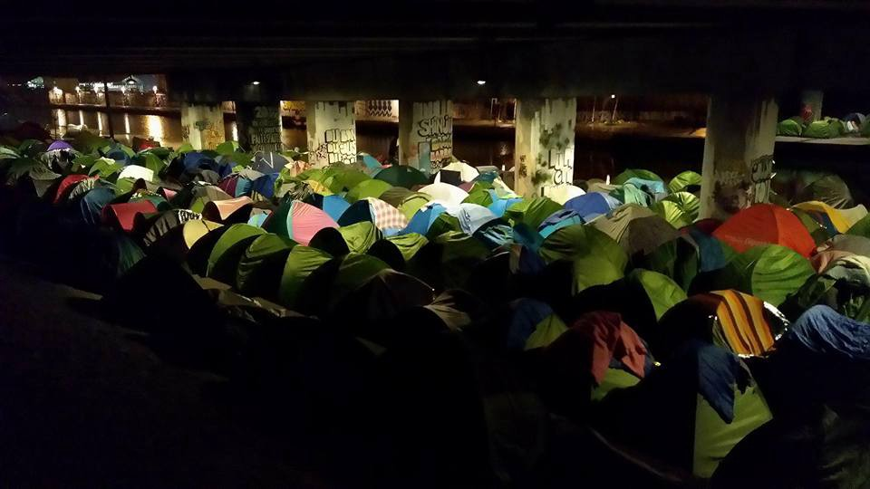

### AYS Daily digest 11/03/18: The war in Syria marks its 7th year

_Air strikes, fighting and more deaths in Ghouta / Fear increases in Afrin / Nearly 2000 people sleeping rough in Paris / Update on sea arrivals to Italy / Experienced volunteers needed in several locations in both Greece and France / Information about asylum in UK / and more news\. \._

](assets/c48bba3cfbb6/1*ZuCSDgJVAsPI-mdWfQqNVQ.jpeg)

Dreaming of another, peaceful future\. Drawing: Gio, from [**Art Against**](https://www.facebook.com/artagainstproject/?hc_ref=ARSKy4r932QAAY7apya_OPoO5Ec6ps1CCbjln8zbbcGoLPC1iUj4hgS6VWhVCzqW6cQ&fref=nf)
#### Feature — timeline of humanitarian tragedy

This March, marks the seventh anniversary of the war in Syria\. Seven years ago, what did you do back then? It’s hard to remember, right? So many years have passed\.

Seven years ago, a lot of people in Syria packed their bags\. Some left to Europe, some are now living in France, Germany, Belgium or Sweden\. Some are still stuck in Greece, Italy or elsewhere along the route\. Some, too many, lost their lives somewhere in Syria or on perilous journeys towards Europe\. Some are stuck in settlements, living below the line for extreme poverty in neighbouring countries\.

[_This is the timeline of the war,_](https://reliefweb.int/report/syrian-arab-republic/seven-years-timeline-syria-crisis) _from the start in March 2011\. Some claim, or claimed, that the upbringing of the war was some boys who painted regime critical messages on a wall in the southern city of Dar’aa\. That is, of course, to simplistic\._

But, unrest started in **March 2011** \. There were protests in several locations, just as in so many places following the Arab Spring\. **In May 2011** , Syrian families started to flee their homes\. In Turkey, the first refugee camp opened\.

**In July 2012** , the nowadays well\-known Za’atari camp opened in Jordan, as a cooperation between UNHCR and the Jordanian authorities\. In **December 2012** half a million Syrians had registered themselves as refugees with the UNHCR\.

**March 2013, two years in** , one million Syrians were registered with UNCHR as refugees\. The needs of funding only increased during the year\. **In August the same year, 1 million children** was registered with the UNHCR\.

**In June 2014,** half of the 22 million people population in Syria is estimated to be suffering from the war and in need of immediate aid\. **In October 2014,** there is an increase in Syrians crossing the Mediterranean sea to try and find safety in Europe\.

The number of Syrian refugees registered reaches **4 millions in July 2015\. In August 2015,** around 12 million people are displaced from the war\. An estimated 250 000 lives are lost\. **In September 2015** , Alan Kurdi, the young boy who died trying to reach the Greek islands, was photographed on a beach\. His death is as tragic as the fact that it was needed to wake up the international community\.

**The autumn of 2015** , the so called “refugee crisis” came to Europe\. Sweden and Germany are among the countries that received the most people, all of whom were seeking safety after the war\.

**In January 2016** , a lot of aid was delivered to Syria\. Just months after, **in March 2016** , the borders in Europe are closed\. Europe needed “a break”, it was said\. But what about the people who needed to save their lives? **In July and August the same year** , the battle for Aleppo took place\.

**In January 2017** , the disaster in Syria is huge\. **In March 2017** , the number of people who have left Syria passes five millions\.

**In January 2018** , the Syrian army starts an offensive to “free” Eastern Ghouta\. More than 1,100 people have lost their lives so far\.

**After seven years of war** , [6\.1 million people have escaped](http://www.unhcr.org/5aa1ad2e4.html) their homes inside Syria, and forced 5,6 million others to seek safety in neighbouring countries in the region\. In Syria, 69 percent of the people live in extreme poverty\.

_And here we are today, the 11th of March 2018, it’s not over yet\. Seven years of war, and millions of people are still living in the middle of it\. The neighbouring countries are hosts to more people than they can manage to take care of\. Ghouta is ongoing\. The borders in Europe are closed\._

](assets/c48bba3cfbb6/1*Dlmzrcorc9j4osg-dQdOKg.jpeg)

Ghouta, March 2018\. Photo: Abdulmonam Eassa, from [**Art Against**](https://www.facebook.com/artagainstproject/?hc_ref=ARQCJ3KTG4c8HRa9bZnnqnl6VoYVHqUzfG4y6v3JSjY2fUYdlvwwHR2frCCL7Plh0Kk&fref=nf)
#### Syria — Ghouta

[According to Syrian state television](https://www.reuters.com/.../syrian-army-splinters-rebel...) , Assads army, backed by its Lebanese ally Hezbollah, has broken through the previously rebel controlled enclave in eastern Ghouta\. Two major towns are now cut off from the area, according to Reuters\. Hezbollah’s military media unit also reported that the city of Douma is surrounded by the army\.

[Photos show heavy bombardments on several locations](https://www.reuters.com/.../syrian-army-splinters-rebel...) , smoke rising towards the sky and if you are close enough, the sound of the blasts could be heard during this not so safe March Sunday\. Since the start of the offensive in Ghouta three weeks ago, 1100 people have been killed, according to the UK\-based Syrian Observatory for Human Rights \(SOHR\) \. After Mesraba was taken yesterday, and now soon Mudeira, the major towns in Ghouta, Harasta, and Douma, are cut off from the rest of the area\. In the middle of all of this, there are civilians, captured in between fragmented rebel groups with a million different agendas, and the Syrian government’s forces, backed by Iran, Hezbollah, and Russia to mention some\.

Rebels in Eastern Ghouta, including The Free Syrian Army \(which isn’t one army, but several independent groups and fighters\), have said that they won’t surrender\. With the area split up, different so called rebel groups have different strongholds, Jaish al\-Islam in Douma, Ahrar al\-Sham in Harasta, and Failaq al\-Rahman in the south part of eastern Ghouta\.

The legitimacy and goals of the different groups is another topic: what’s important to remember is that innocent human beings are trapped in between the actors of the war\.

**Chemical weapons in Ghouta**

[US today warned Syria](https://www.middleeastmonitor.com/20180311-us-warns.../) and the Assad\-government about using chemical weapons in Eastern Ghouta, saying it would be very unwise to do so\. With that said, the US has just as much blood on their hands as any other of the main participants in the Syrian “civil war”\. Assad on the other hand, has hinted about that the rebels in Ghouta have used chemical weapons\. The Syrian authorities strongly denies that they should be responsible\. But, accusations from people on the ground is in clear contradiction to this governmental statement\.
#### Syria — Afrin

[Yesterday marked the 50th day of the Turkish offensive](http://www.syriahr.com/en/?p=86469) , operation Olive Branch, in Afrin\. Since it started the 20th January, the Kurdish autonomy in the region is more under threat than ever\. Reportedly, the people of Afrin have taken shelter in basements and different safe places underground, as the Turkish army and airforce are present and continues to spread fear\. Hundreds of thousands people are living in the northern parts of Afrin city, many of them farmers living on the countryside\. Approximately 12,000 civilians have been forced to flee their homes in northern Afrin and the northern parts of Aleppo’s countryside, according to The Syrian Observatory for Human Rights \(SOHR\) \. SOHR documented 204 deaths since the start of the Turkish intervention in Afrin the 20th of January this year\. Syrian citizens of different backgrounds are among the victims, Kurds, Arabs and Armenians, including 32 children and 26 women\.

](assets/c48bba3cfbb6/1*NMLfYToc5s_MqHv3t7NjUg.jpeg)

Photo: [**Irida ίριδα إريدا**](https://www.facebook.com/IridaWomensCentre/?hc_ref=ARSZdqkk64AU6comQRNUIuxLYebs2pM0gdZvssqnVLvadAgGZc7eWkxQf7GkjDC7NwA&fref=nf)
#### BALKAN WEATHER REPORT

**For Monday 12\.03**
#### Montenegro

Monday in Montenegro will be moderately cloudy to entirely cloudy with rain, rain showers and thunderstorms\. Moderate to heavy rainfall is expected, the far north and northeast being an exception\. The wind will be amplified and strong blowing from the south\. At the end of the day or during the night rain and wind will decrease\. In the morning the temperature will be ranging from 3 to 13 and during the day 5 to 16 degrees\.
#### Serbia

In Serbia the temperature during the day will be around 17 to 19 degrees\. In parts of the country, there will be some rain, mostly showers from light to heavy\. Between the rain sun will seen in some locations\. In the border area of Subotica there seem to be partly cloudy, but no rain as in the rest of the country\.
#### Bosnia and Herzegovina

In Bosnia and Herzegovina it will be cloudy in the west and southwest while in the rest of the country it will be sunny, with gradual cloud formations in the afternoon\. Rain is expected in Herzegovina and in the west and southwest of Bosnia\. In the afternoon or in the evening rain is expected in most parts of the country\. The wind will be from weak to moderate blowing from the south\-west\. In the morning the temperatures will be from 4 to 14 and during the day from 10 to 19 degrees\.
#### Croatia

In Croatia the week will start variably cloudy with sunny periods and rain in most parts of the country\. Locally rain showers and thunderstorms are possible while in central Croatia it is expected to stay mostly dry and sunny\. They will be moderate to strong from the southwest, and alongside the coast from the south\. In the morning the temperatures generally will be from 6 to 15 and during the day from 14 to 19 degrees, in the mountains a bit lower\.
#### Sea

There is not only the Syrian tragedy, as Philippo Grandi described the situation on the 9th, it is also an ongoing tragedy at the Mediterranean sea\.

■■■■■■■■■■■■■■ 
> **[Oscar Camps](https://twitter.com/campsoscar) @ Twitter Says:** 

> > SOS 40 miles off Libyan coast by 150 people adrift. While our rescue boats assist them, a Libyan patrol paid and supported by Italy, approaches to push them back again to torture in Libya. Europe funds pushbacks and puts all us in danger https://t.co/9TZcg3nXGY 

> **Tweeted at [2018-03-11 09:43:20](https://twitter.com/campsoscar/status/972769936216068101).** 

■■■■■■■■■■■■■■ 

#### Italy

[**ITALY — REFUGEE CRISIS DATABASE**](https://www.facebook.com/profile.php?id=1834254390190027&ref=br_rs) released [a new report with numbers](https://l.facebook.com/l.php?u=https%3A%2F%2Flookaside.fbsbx.com%2Ffile%2FSEA%2520ARRIVALS%2520TO%2520ITALY.pdf%3Ftoken%3DAWwgvJ5Z8PzGV7LSG2dtTRJO--lmclHrGFdWmvSEiM7xObmO5lHMjqaMUjFWw-lEhFl0PWR2wYu6UOSHKPGicIFs-0ypEKkLluRx4kNfZ5w0j0IJ1UwY72Aic82U6Pj4WZ4MjvTiQ2xtSmJ7ykWCSlKju-wX4JtFCSc3RZmGuYvCel1FCvcYTc_O4Z-_5Sw6xihlyBM3AJRFhU1dZq7Zj-MT&h=ATPVFn4Tc7FWQJpgsqRDY1oMZzR1-BEmgZ20_OPewvXtulWaaQcMPkSnEG7XjwHt09vm80q27IE3hU7rEIoGEaM97mXR3r-FtKeIJq3vnaFgUM4gFm1e2xrk) on and information about sea arrivals to Italy in 2018\. Since the first of January until the 9th of March, 5,457 people arrived to Italy\. Compared to the same period last year, that is a decrease with 65,5 percent when 15,843 people came\. Different EU decisions and agreements between Italy and Libya, among other things, have affected this\. It does not mean that less people are in need of protection this year than last year\. The decrease in numbers, only mean that it has gotten harder for people in need of protection to receive it\.

The biggest ports of entry was Messina \(Sicily\), with 1118 arrivals, Pozzallo \(Sicily\), with 1088 arrivals and Catania \(Sicily\), with 925 arrivals\. Besides that, ten other locations saw newly arrived people, with numbers between 50 to 492 people\.

If you want to support their future work, do it [here\.](https://www.youcaring.com/theitalyrefugeecrisisdatabaseswork-759281)

**Ventimiglia update**

[**SolidariTea**](https://www.facebook.com/refugeesolidaritea/?hc_ref=ART70xchFDfkf-jzWWKuF9P5FnN3xSb5VAgqjy8jx1gaE9i3REcfnG3g34GmzMaraeQ) **,** who will leave soon, are still in Ventimiglia\. Here is their latest update, about the harsh circumstances too many young men call their everyday life, under the bridge and close to the border\.

On Sunday, there was a fight\. Some of the people living in Ventimiglia decided that they have had enough of the refugees in the city\. After the Italian election, right wings and populist gained more power\. The inhabitants was probably strengthened by this\.

As a cause of the recent developments in Italy, who are already noticeable on the ground, several of the men have been too frightened to leave the bridge\. The local priest, who is fighting fascism the way he can, has been knocking doors, trying to make people a bit more friendly minded\. We hope this will have an effect soon\.

Ventimiglia\. Photos: SolidariTea
#### Greece

**Mainland**

[From March 25](https://www.facebook.com/OpenCulturalCenter/photos/a.1304076196287462.1073741828.1302471973114551/2059414800753594/?type=3&theater) , [**Open Cultural Center — OCC**](https://www.facebook.com/OpenCulturalCenter/?hc_ref=ARS76UN_f0zMKuZiBxJ_uo4BrpsksTXhSX6YDu1dzQsvZvjWYC8GGdbUSlAaZR8jZ1Y&fref=nf) is in need of volunteers in Polikastro, Northern Greece\. You need to have a good level of English, be over 23 years old and have some previous experience from teaching\. If this sounds like you, send an email to hhrr@openculturalcenter\.org\.

](assets/c48bba3cfbb6/1*Mi_SHEWZXymk0gCnPBkxog.jpeg)

Photo: [**Open Cultural Center — OCC**](https://www.facebook.com/OpenCulturalCenter/?hc_ref=ARS76UN_f0zMKuZiBxJ_uo4BrpsksTXhSX6YDu1dzQsvZvjWYC8GGdbUSlAaZR8jZ1Y&fref=nf)

**German teacher needed**

In Serres, northern Greece, a german teacher is needed\. Experience is great, but not essential\. Housing for five euro per night, or included if you can stay more than 90 days\. You have to dedicate at least 30 days\. It’s better for everyone involved, especially the students\.

Get in touch with: greecevolunteer@liftinghandsinternational\.org if you have skills and time to help out\.

](assets/c48bba3cfbb6/1*ucXrwVAfvtm3XVRiDsxOtA.jpeg)

Photo: [**Anika Patel**](https://www.facebook.com/anika.12?fref=gs&hc_ref=ARTUGIf0M1aDaYxvIvWkpEkSpxJkRJ-uLtRDCcdXxFkV5eROQxQ6mIEe7lLYuOdm-qY&dti=228469170832717&hc_location=group)

**Islands**

[**Aegean Boat Report**](https://www.facebook.com/AegeanBoatReport/?hc_ref=ARThuTLwuX0y4ld8LQyaRS5GCMqbJ4JZXsIBnjtfgOC5H2phCmWtZJOhNEvQwPBsP3U) [has information](https://www.facebook.com/AegeanBoatReport/posts/317774038745707) about the latest arrivals to the islands, as of the morning the 11th of March\. According to them, a total of five boats landed on the Greek islands\. The boats were carrying 215 people, of whom 80 children\. Three of the boats landed on Lesvos \(145 people\), one at Samos \(53 people\) and one at Farmakonisi \(17 people\) \.

For more information about the demography and arrivals, follow [this link\.](https://www.facebook.com/AegeanBoatReport/posts/317774038745707)

](assets/c48bba3cfbb6/1*KoH2_Amp_aZ9XCqe8UcBtg.jpeg)

Boat picked up outside Agrilia, 45 people\. Photo and info: [**Aegean Boat Report**](https://www.facebook.com/AegeanBoatReport/?hc_ref=ARThuTLwuX0y4ld8LQyaRS5GCMqbJ4JZXsIBnjtfgOC5H2phCmWtZJOhNEvQwPBsP3U)

[**Advocates Abroad**](https://www.facebook.com/advocatesabroad/?hc_ref=ARS-sGKl5s1_WOg7FIgOKkqAV52-58JkIgHI8ixT57hh0Zz_VvHvUiaXqtBeFBfzoT4&fref=nf) had at mid\-day today the 11th of March recieved 147 people, on Lesvos\. [Another source](https://www.facebook.com/RefugeeRescueUK/photos/a.1209475672453214.1073741828.1206400986094016/1648326505234793/?type=3&theater) , [**Refugee Rescue / ‘Mo Chara'**](https://www.facebook.com/RefugeeRescueUK/?hc_ref=ARRB8TW4vvivAE-8oDMQBhj_ZA2rSu3bBglXPspYHT5ZTwekLKie7jD5AQdRwXlTGKI&fref=nf) **,** said 142 people arrived\. The numbers can vary a bit, depending on when they counted and if all arrivals was included and the information posted on Facebook\. But, that it was a busy weekend on the islands, there is no doubt about\.

**Lesvos Solidarity — [Pikpa](https://www.facebook.com/pikpalesvos/posts/2050755125199908)** [,](https://www.facebook.com/pikpalesvos/posts/2050755125199908) foresees a spike in arrivals now when spring is coming\. During the weekend, they counted to around 260 new arrivals to Lesvos, the number could be higher by the time this digest is published\.

And as they write:

> “Next step after setting foot on European soil: Moria camp…” 

](assets/c48bba3cfbb6/1*E5fTaWw7-uVaYcNZ5s3C8Q.png)

Morning sun at Lesvos\. Photo: [**Lesvos Solidarity — Pikpa**](https://www.facebook.com/pikpalesvos/?hc_ref=ARTa36B4-4P24XURkHnIUuhFZAC0MliRX8_tWtJA-R0rIfLv1zgQEuoiM6RLVHBXtdA&fref=nf)

**Nurses and doctors needed**

In May, Boat Refugee Foundation will start their work in Moria\. In order to do so, they need skilled volunteers\. Doctors and nurses, who can dedicate some of their time and help people who need medical treatment in the horrible detention camp Moria\. If you are interested in helping, have a look and get in [touch here\.](http://bit.ly/2Fx6Kz0)

**Chios**

A group of Spanish volunteers, called [**Balloona Matat**](https://www.facebook.com/BalloonaMatata/?hc_ref=ARR3mKX4QrHDjgKPZ3GpVBdKFP2jAKlGOhOI4aX6MM7FvMKNZHhVN0FQp3zxDDFsdHE&fref=nf) **a,** are collecting clothes and other equipment to refugees living at Chios, in the camp Vial to mention some locations\. Their 9\-seat van, Ballooneta, has been donated by Spanish volunteers for this purpose\. The car has been used on the island since the summer, and to be able to continue doing so they need to register the car in Greece\. This is not done for free, so the team is in need of donations to continue their job, for which the van is needed\.

So far, 1000 euro is donated\. But the total costs exceeds this by far\. Additionally 1500 euros is needed\. Note your contribution with Ballooneta\. Everything donated will be used for this purpose\.

TRIODOS
ES85 1491 0001 2330 0006 6566

](assets/c48bba3cfbb6/1*Z-9t6QZo4Nr12yztuIOWEA.jpeg)

The much needed van\. Photo: [**Balloona Matata**](https://www.facebook.com/BalloonaMatata/?hc_ref=ARR3mKX4QrHDjgKPZ3GpVBdKFP2jAKlGOhOI4aX6MM7FvMKNZHhVN0FQp3zxDDFsdHE&fref=nf)

**Also on Chios — donate and help people in need\!**

If you had an easy online way to purchase a pair of sneakers or a kilo of chickpeas for refugees living in a Greek refugee camp and know that your purchase would be delivered directly to them, would you do it?

Essentially an Amazon wishlist equivalent that bypasses shipping costs and is run through a trusted US\-based company, but uniquely for refugees in Chios, Greece\.

Please consider purchasing a pair of sneakers, or a $10 gift card from the wholesaler through which the Chios People’s Kitchen buys food to distribute to refugees on the island\. It’s a direct way to help and to choose exactly what it is that you are donating [HERE\.](https://needslist.co/buoy-fund-inc)
#### France

**Calais**

[Care4Calais](https://www.facebook.com/groups/956020314476605/permalink/1647095575369072/) currently needs new volunteers to join them for their important mission in Calais\. If you have time and can help, get in touch with clare@care4calais\.org\. If you know someone who might, spread the word\!

](assets/c48bba3cfbb6/1*vGH5CkwRnqq_VJZ8aEiZuw.jpeg)

Photo: [**Care4Calais**](https://www.facebook.com/care4calais/)

**Paris**

This is Paris earlier today\. Rain is pouring and the weather cold, as AYS reported several times this week, nearly 2,000 people are still sleeping rough\.

Night time, people are squeezing themselves into small tents, cheap ones, that doesn’t even resist summer rain\. Paris Refugee Ground support estimates that 1,200 people are sleeping under the bridges only\.

](assets/c48bba3cfbb6/1*ouXbJiRQVx0YiBtJFWgWFg.jpeg)

Photo: [**Paris Refugee Ground Support**](https://www.facebook.com/PRGS.team/?hc_ref=ARSY_G2Lh1gmCUhV3zOdw3I6begGb5EANnZql_rg8cnArl4i-ZN5iALC6SMk_leI0do&hc_location=group)

To at least try and change this, as volunteers do every day, there is an urgent need of experienced volunteers with a van, [**Rastplatz**](https://www.facebook.com/rastplatz/?hc_ref=ARSiGvBHGpxmWNi7Cf_SgCmkG54RbgsnjCwHx4SY6bJg6gEx_xYin9aKfKmgYjVsbkM&fref=nf) says\. They are supporting [**Paris Refugee Ground Support**](https://www.facebook.com/PRGS.team/?hc_ref=ARSY_G2Lh1gmCUhV3zOdw3I6begGb5EANnZql_rg8cnArl4i-ZN5iALC6SMk_leI0do&hc_location=group) **,** who are in need of a second team of volunteers for night distributions\. Get in touch with either one of the groups on Facebook if you can help\. Deliveries to and from the warehouse in Calais is also requested\.

](assets/c48bba3cfbb6/1*fVnKGHilK9gnpEDD0g9LuQ.jpeg)

Photo: [**Rastplatz**](https://www.facebook.com/rastplatz/?hc_ref=ARSiGvBHGpxmWNi7Cf_SgCmkG54RbgsnjCwHx4SY6bJg6gEx_xYin9aKfKmgYjVsbkM&fref=nf)

**25 year old died in Paris, due to neglect**

[**Paris Refugee Ground Support**](https://www.facebook.com/PRGS.team/?hc_ref=ARTIQopupTAT0MhCyKBqe5WUkLggwtS_qNMQyT1r0NIthwmW0bB7ufL25KuycBG79AY) [reports on a tragic incident\.](https://www.facebook.com/PRGS.team/photos/pcb.2064112640535512/2064112553868854/?type=3&theater) As mentioned above, the streets in France, as well Paris as Calais, are cold in more than one way\. 25 year old Alhadi Abrahim Jmaa, called Karim, died\. The first time PRGS met him, one and a half years ago, he was already a broken man\. A life on the streets had led to alcohol abuse, and he missed his mother dearly\. Karim needed support, psychosocial support he never got\. He couldn’t go back home to Sudan, and he couldn’t reunite with his family in the UK\.

Deaths as Karim’s should never happen this way\.

](assets/c48bba3cfbb6/1*EcOJUZKKBvmKwhsgOP-BZw.jpeg)

Karim and a group of volunteers\. Photo: [**Paris Refugee Ground Support**](https://www.facebook.com/PRGS.team/?hc_ref=ARTIQopupTAT0MhCyKBqe5WUkLggwtS_qNMQyT1r0NIthwmW0bB7ufL25KuycBG79AY)
#### UK

Ever wondered how the asylum process in UK looks like? [InfoMigrants just did a summary\.](http://www.infomigrants.net/en/post/7991/what-does-the-uk-asylum-process-look-like) The country is about to leave the EU, but is still host for a big number of refugees in Europe\.

The conditions to gain asylum in UK is based on the [1951 Refugee Convention](http://www.unhcr.org/1951-refugee-convention.html) , even though the country just as so many other countries, have forgotten what it was all about after WW2\. Below are some criteria that can make you eligible for asylum in the UK:
- race
- religion
- nationality
- political opinion
- other reasons that puts your life and wellbeing at risk due to social, cultural, political or religious circumstances in your country of origin\. Those can be gender, gender identity or sexual orientation\.

> It is important to get in touch with the authorities as soon as possible after arrival to claim asylum and start the process of hopefully gaining it\. 

The first step is a “screening interview” with the UK Border Agency, where your case is evaluated and heard for the first time\. You will get some questions about if you have been applying for asylum elsewhere in Europe before and then you will get a registration number\. After that, you will be given a person who is responsible for your case\. Then, a substantial and more thorough interview will be done\. Your decision will be given during the process, it is important to stay in touch with the authorities and the worker you are assigned with\. It is possible that you are eligible for financial support and other kind of help during the process\.

If you get a negative answer and want to appeal, you have the right to remain in the country during the time for the appeal\. **It is important to file the appeal within 14 days after the first negative answer\.**

For more information, follow [this link](http://www.infomigrants.net/en/post/7991/what-does-the-uk-asylum-process-look-like) to InfoMigrants article\.

**_We strive to echo correct news from the ground through collaboration and fairness\._**

**_Every effort has been made to credit organizations and individuals with regard to the supply of information, video, and photo material \(in cases where the source wanted to be accredited\) \. Please notify us regarding corrections\._**

**_If there’s anything you want to share or comment, contact us through Facebook or write to: areyousyrious@gmail\.com_**

_Converted [Medium Post](https://medium.com/are-you-syrious/ays-daily-digest-11-03-18-the-war-in-syria-marks-its-7th-year-c48bba3cfbb6) by [ZMediumToMarkdown](https://github.com/ZhgChgLi/ZMediumToMarkdown)._
