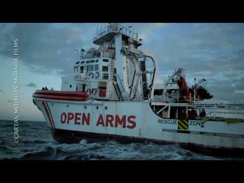

### AYS Daily Digest 12/03/18: Thousands of newly displaced people

_The ongoing fights in Syria force the people to leave their home / Volunteers needed in Greece / Pro Asyl and RSA publish timeline of hate crimes on Greek islands / Incoming German interior minister wants more deportations / Unaccompanied minors in Croatia lack of support / Niger halts evacuations from Libya_

](assets/e3758561d33c/1*PJ3wyWf4wQCqmrb1uZK5ng.jpeg)

The war leaves thousands of people displaced\. Credits: [**Syrian American Medical Society\- SAMS**](https://www.facebook.com/SyrianAmericanMedicalSociety/)
### Syria

Hundreds of people recently fled the Turkish\-led advance on Afrin, a Kurdish hold enclave, AFP [reports](https://www.yahoo.com/news/hundreds-flee-turkish-advance-afrin-city-monitor-152347780.html) \(via Yahoo\) \. According the Syrian Observatory for Human Rights, more than 2000 people have already in the area of Nabul, which is controlled by Syrian governmental forces\. Due to the number of people exiting the Afrin region, nearby areas opened schools and mosques to accomodate the new arrivals\. 16,000 internally displaced people are said to be in the area of Nabul and Zahra\.

Since the start of the operation, only one Convoy made its way to Afrin\. Reportedly, the Turkish forces have already captured 60 percent of the region\.

Even worse seems to be the situation in Douma, a city in the area of Eastern Ghouta\. Since the Syrian forces started capturing parts of the area and divided it, thousands of people have left their homes and went to Douma, which is still held by opposition forces\. The local council now highlighed, that Douma faces a catastrophe, the Middle East Monitor [reports](https://www.middleeastmonitor.com/20180312-syrias-douma-faces-catastrophe-local-council/) \. Thousands of families would have to sleep rough in the streets or public gardens\. Existing basements were overcrowded already\.

### Iraq

Not only in the war\-torn Syria many people have to leave their homes\. Also in Iraq many people are internally displaced\. In a statement, the IOM [said](https://www.iom.int/news/un-migration-agency-iraq-appeals-funding-assist-idps-and-returnees) that some 700,000 people are in urgent need of assistance\. More than 2,3 million are still internally displaced, while 3,5 million managed to return home since January 2014\.
### Turkey

Turkish authorities have apprehended over the past week a total of 5,371 persons who were trying to cross the borders with the European Union or to enter the country, the Turkish interior ministry has said\. The ministry also said that 136 suspected human traffickers were arrested\. Turkish coast gaurd reported that this weekend \(9th — 11th\. March\) 8 boats carrying a total of 272 people were intercepted in the AegeanSea while trying to reach the Greek islands\.

■■■■■■■■■■■■■■ 
> **[SARwatchMED](https://twitter.com/SARwatchMED) @ Twitter Says:** 

> > #TurkishCoastGuard update: 8 boats carrying a total of 272 people were intercepted over the weekend in the #AegeanSea while trying to reach the Greek islands of #Lesvos, #Chios and #Samos https://t.co/PHTJzWNttJ 

> **Tweeted at [2018-03-12 22:07:23](https://twitter.com/sarwatchmed/status/973319569875095552).** 

■■■■■■■■■■■■■■ 

### Greece

Pro Asyl und Refugee Support Aegean published a timeline of hate crimes on the Aegean islands\. You can find it and more information on their [homepage](http://rsaegean.org/stopthetoxicdeal-xenophobia/#timeline) \.

On Chios, a driver hit an Iranian, Astraparis [reports](https://astraparis.gr/agnostos-odigos-traumatise-35xrono-irano-kai-ton-egateleipse/) \. It was the second time within one month, that such an incident happened\.

Oasis Rhodos calls for further support\. The police arrested one family, to deport them to Turkey, inlcuding an eleven years old girl\.

Volunteers [counted](https://twitter.com/erikgerhardsson/status/973104790422081537?s=21) 48 people on the south coast of Lesvos and 18 on Farmakosi as new arrivals\. Yesterday, Greek officals [registered](http://mindigital.gr/index.php/%CF%80%CF%81%CE%BF%CF%83%CF%86%CF%85%CE%B3%CE%B9%CE%BA%CF%8C-%CE%B6%CE%AE%CF%84%CE%B7%CE%BC%CE%B1-refugee-crisis/2060-national-situational-picture-regarding-the-islands-at-eastern-aegean-sea-11-03-2018) 230 people on the islands: 144 on Lesvos, 53 on Samos, 16 on Kos and 17 on “other” islands\. Seven were transferred to the mainland\.

At the City Plaza, today hanged a big Banner, announcing the International Action Day on 17 March against the EU Turkey deal\. They will give a press conference with further information on Tuesday\.

](assets/e3758561d33c/1*aqRNHoUe1nPviyf3bi9Gsw.jpeg)

The banner\. Credits: [Epoca Libera](https://twitter.com/epocalibera/status/972887770996887552)

The Orange House in Athens [is looking](https://www.facebook.com/groups/204202716585823/permalink/609497882722969/) for volunteer teachers, who can teach the students Greek, English and German\. In Polikastro, Northern Greece, the Open Cultural Center asks for German teachers\. If you want to volunteer with them, write a mail to hhrr@openculturalcenter\.org\. Also, Emergency Response Centre International calls for medics in April in Moria, Lesvos\. Accomodation will be provided\. If you have the skills and want to volunteers, contact aid@ercintl\.org\.
### Romania

The Asylum Information Database \(AIDA\) [highlights](http://www.asylumineurope.org/news/06-03-2018/aida-country-report-romania) in its country report for Romania an “emerging obstacles to access to the territory in the course of 2017”\. A total of 1386 people were considered as collective expulsions on the Serbian border from April to December 2017\. Meanwhile, the number of asylum applications has more than doubled: 1,880 in 2016 to 4,820 in 2017\. The vast majority of applicants originated from Iraq, followed by nationals of Syria, Afghanistan and Pakistan\. You can find the full report [here](http://www.asylumineurope.org/sites/default/files/report-download/aida_ro.pdf) \.
### Bosnia

The number of people who are entering Bosnia is still increasing\. None of the state agencies or big international agencies present in the country \(UNHCR and IOM\) are not giving any numbers of people who are currently in the country\. However, Border police issued a statement saying that since the beginning of this year, they discovered 639 people who entered the country\. At the same time, they prevented 661 person to enter the country over the green border\.

Only in January, 157 people wee discovered by border police, in February 315 and so far in March 167\. Most of the people are near the cities of Trebinje, Zvornik, Bratunac, Gacko, Velika Kladusa, Bihac and some in area of Brcko, Foca, Posusje, Capljina and Grude\.

Most of the people who are entering Bosnia now are from Syria, Pakistan, Lybia, Afghanistan, Palestine, Algeria, Iran, Marocco, Iraq, Turkey… Nevertheless, these are not complete figures and it is not possible to find this data\.

In Sarajevo, mostly local population are helping to all those who are arriving daily\. Small groups of international volunteers are present, too\. Every kind of help is needed medical, food, clothes, shoes…

If you can help, please consider donating to local charity Pomozi\.ba that is supporting volunteers in the field and people who need help\.

Name of the bank: Intesa Sanpaolo Banka BiH
SWIFT CODE:UPBKBA22
IBAN: BA39 1541802008533048
Receiving: Udruženje “Pomozi\.ba”, dr\. Fetaha Bećirbegovića br\. 8, 71000 Sarajevo
Purpose: help for refugees
If you want to send financial support from Austria:
ERSTE BANK
IBAN: AT64 2011182266475400
BIC: GIBAATWWXXX
Wien, Oestereich
Name: hilfhelfen\-pomozi\.ba

Volunteers are needed too, including doctors or nurses\. If you can come to Bosnia, please get in touch with AYS\.
### Hungary

The election of populistic and right\-wing governments in Austria and \(probably\) Italy seem to strengthen Hungaries views on foreign politics\. “It is obvious that we will work together in the future,” foreign minister Peter Szijjarto [told](http://ewn.co.za/2018/03/12/hungary-seeks-broader-anti-migrant-alliance-after-austria-italy-elections) Reuters \(via Eyewitness news\), hoping that the Visegrad countries will strengthen their ties with Italy and Austria\.
### Croatia

Human Rights Watch [criticizes](https://www.hrw.org/news/2018/03/12/submission-human-rights-watch-united-nations-committee-rights-child-concerning) the low protection of unaccompanied minors in Croatia\. They would still “ face social isolation and difficulties in accessing language classes and education” and “ be placed in residential institutions for children without adequate arrangements for their protection and care”\. In the school year 2017/2018 only one out of 30 registered unaccompanied childred could attend classes\.
### BALKAN WEATHER REPORT for Tuesday 13\.03
#### Montenegro

Tuesday will be variably to mostly cloudy, locally there will be occasionally rain or rain showers with thunder\. The wind will be weak to moderate, in the north part of the country from time to time amplified, blowing from the south\. In the morning the temperatures will be from 0 to 11 and during the day from 4 to 16 degrees\.
#### Serbia

Tuesday will be variably cloudy with locally rain, rain showers and thunder, while in the mountains snow is expected\. The wind will be weak to moderate blowing from the west, in the mountains and in the north locally strong\. In the morning the temperatures will be from 6 to 10 and during the day from 14 to 18 degrees\.
#### BiH

In Bosnia and Hercegovina it will be mostly cloudy with rain and rain showers, the precipitation will be not to intense\. In Herzegovina the wind will be weak form the south and south\-west\. In the morning in Bosnia the wind will be weak blowing from the shout and changing direction to southwest in the afternoon\. In the morning the temperatures will be from 4 and 8 and during the day from 10 to 15 degrees\.
#### Croatia

In Croatia it will be variably to mostly cloudy with rain from time to time, especially alongside the coast\. Land inwards in the centre and in the north of the country it will be partially sunny in the morning with locally rain showers during the second part of the day\. In the morning the temperatures will be form 7 to 12 and during the day form 11 to 17 degrees\.
### Germany

Horst Seehofer, the incoming interior minister of Germany, said, Germany needs to speed up asylum procedures and also increase the number of deportations, InfoMigrants [writes](http://www.infomigrants.net/en/post/7994/germany-s-future-interior-minister-horst-seehofer-vows-to-increase-deportations) \. He also vowed for “zero tolerance” against criminals\.
### Niger

Niger has halted evacuations from Libya, because it accuses the EU of not keeping its resettlement promises, Refugees Deeply [reports](https://www.newsdeeply.com/refugees/community/2018/03/12/for-refugees-detained-in-libya-waiting-is-not-an-option) \. “ Several European governments have pledged to resettle 2,483 refugees from Niger, but since the program started last November, only 25 refugees have actually been resettled — all to France,” the magazine writes\. Until the EU countries speed up the resettlement from Niger’s capital Niamey, they do not want to transfer any new people from Libya\.
### Libya

The Italian embassy in Libya [states](https://twitter.com/italyinlibya/status/973251071605903360?s=21) , that the municipalities most affected by human trafficking, will benefit of a new EU assistance programme, disbursing 50 million Euro\.
### Sea

Proactiva Open Arms published a video, resuming 15 days of operation in the Mediterranean Sea\. In this time, they rescued 950 lifes and brought three corpses to the port\.

### Italy

Liberties [reports](https://www.liberties.eu/en/news/inhuman-conditions-in-the-lampedusa-hotspot/14526) , that human rights activists group found several human rights violations at the Lampedusa hotspot\. “Our delegation found that there are no canteens in the hotspot\. The food — to be eaten in the room or outside — is of very poor quality\. Squat toilets have no doors and mattresses are dirty,” stated Gennaro Santoro and Giulia Crescini\. They further witnessed difficulties in the application process and criticize, that the people neither get a residence permit nor can leave the island\. Some 180 people are hosted in the center, most of them single men\. Hence, the delegation also criticizes the inexistence of security staff, leaving voulnerable groups abandoned\.

[https://twitter\.com/libertieseu/status/973153197249433600?s=21](https://twitter.com/libertieseu/status/973153197249433600?s=21)
### Spain

In Seville, some 12,000 people benefited from economic aid over a period of three years, InfoMigrants reports\. They can receive the state aid for 18 months, vulnerable people for up to 24 months\. With 60 percents, the majority were Syrians, followed by Venezuelans, Palestinians, Ukrainians, Morocceans, Guineans and Colombians\.

RefuCoru published an infographic about the asylum interview in Spain\. Here you can find many useful information\.

### France

The local government in Calais has started to distribute meals recently\. Howevery, L’Auberge des Migrants [says](https://www.facebook.com/AubergeMigrants/photos/a.10152514841565339.1073741825.358496450338/10155887196145339/?type=3&theater) , the number of distributed meals remains low with 135 to 160\.

Following the eviction of one building in Nantes, where more than 150 were thrown out, refugees and activists occupied another building, Enoug is Enough [reports](https://enoughisenough14.org/2018/03/12/nantes-new-occupation-by-refugees-and-their-supporters/) \.

### UK

In four days, there will me a debate in the parliament about family reunion to the UK\. “ The UK has some of the most restrictive laws on refugee family reunion in Europe\. It’s one of only 2 countries that do not allow applications for reunion from unaccompanied children,” Help Refugees says\. They need at least 100 MPs to vote to allow family reunions\.
### EU

The European Asylum Support Office \(EASO\) [says](http://www.infomigrants.net/en/post/8015/european-asylum-support-office-says-protection-decisions-exceeded-applications-in-jan) \(via InfoMigrants\), that in January the number of protection decisions was higher than the number of new applications\. The 28 EU member states plus Norway and Switzerland made around 60,000 decisions, while 54,000 new applications were registered\. But, 450,000 people are still waiting for their decision\.
### General

The phone credit for refugees group is looking for more volunteers\. Every day they receive around 100 requests to top up the phone credits\. You can find more info in their call\.

> **_We strive to echo correct news from the ground through collaboration and fairness\._** 

> **_Every effort has been made to credit organizations and individuals with regard to the supply of information, video, and photo material \(in cases where the source wanted to be accredited\) \. Please notify us regarding corrections\._** 

> **_If there’s anything you want to share or comment, contact us through Facebook or write to: areyousyrious@gmail\.com_** 

_Converted [Medium Post](https://medium.com/are-you-syrious/ays-daily-digest-12-03-18-thousands-of-newly-displaced-people-e3758561d33c) by [ZMediumToMarkdown](https://github.com/ZhgChgLi/ZMediumToMarkdown)._
