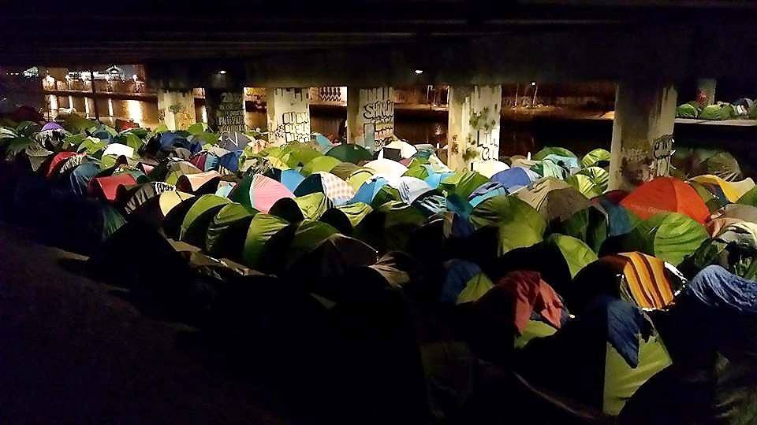

### AYS Daily Digest 14/03/2018: “I haven’t finished my dreams yet…” A 10 year old’s message from Afrin
#### Remembering Stephen Hawking and his plea to end the war in Syria // Words from a 10 year old boy in Afrin // EU to give Turkey 3 billion Dollars // Over 500 arrivals in Greece in 4 days // Riot and suicide attempts in Moria // News from Greece // Balkan Weather Report // Lampedusa hotspot closed for reconstruction // Syrian man falsely accused of ‘terrorism’ ahead of Hungarian elections // News from France, Germany and the UK

Source: Youth for Refugees
#### FEATURE
### With Stephen Hawking’s passing, along with his legacy of incredible achievements, let us remember his message urging humanity to end the war in Syria\.

> “We must work together to end this war and to protect the children of Syria\.” — Stephen Hawking 

**Over the last months the war in Syria has escalated in the regions of Ghouta, Idlib and Afrin, and children continue to be most affected by these atrocities\.** Since this message below was written by Stephen Hawking in 2014, the situation in Syria continues to be much the same, and his plea remains just as relevant today\.

> The international community has watched from the sidelines for three years as this conflict rages, engulfing all hope\. As a father and grandfather, I watch the suffering of Syria’s children and must now say: No more” 

> I often wonder what we must look like to other beings watching from deep space\. As we look out at the universe, we are looking back in time, because light leaving distant objects reaches us much, much later\. What does the light emitting from Earth today show? When people see our past, will we be proud of what they are shown — how we, as brothers, treat each other? How we allow our brothers to treat our children? 

> We now know that Aristotle was wrong: the universe has not existed for ever\. It began about 14bn years ago\. But he was right that great disasters represent major steps backward for civilisation\. The war in Syria may not represent the end of humanity, but every injustice committed is a chip in the facade of what holds us together\. The universal principle of justice may not be rooted in physics but it is no less fundamental to our existence\. For without it, before long, human beings will surely cease to exist\.” — **Stephen Hawking** 

You can read his full opinion piece [via this link](https://www.theguardian.com/commentisfree/2014/feb/17/syria-abomination-human-intelligence-end-war)

**In commemoration of Stephen Hawking’s passing, and in conjunction with the advancement of the Turkish army in Afrin over the last days, we would like to share with you a short poem\.**

**This poem was co\-written by a ten year old Syrian\-Kurdish boy currently in Afrin in the care of a foster family, and a refugee turned dedicated humanitarian from Afrin, Nour Abo Sipan\.**

With Internet connection very difficult to obtain in the besieged region, the civilians in Afrin are struggling to get their messages out to the world\. Here is one message for you to read\.

> **Lament of a Syrian Kurdish boy in Afrin** 

> Why did you burn my dreams? 
 

> I haven’t finished my dreams yet… 
 

> I haven’t finished playing with my toys, 
 

> I haven’t finished playing with my childhood yet\. 
 

> My wishes were many\. 
 

> My wish was to grow up like all children\. 
 

> My wish was to study and to become a doctor\. 
 

> So why? 
 

> Why did you bring your wars to us? 
 

> and made my home a home for ghost, 
 

> and made our tears fall everywhere, 
 

> and our destination unclear, 
 

> and made us lose our home, 
 

> Why did you make us become refugees without a home? 
 

> Their evil hands prevented our hopes from being achieved, 
 

> and they burned tears on our eyes\.
 

>  I’m a ten year old child, my hair has turned white\. 
 

> I’m young, but my sorrow is huge\. 
 

> They killed my Dad and detained my brother\. 
 

> They made my mother homeless\. 
 

> I became the father of my own childhood 
 

> I became homeless, nameless, fatherless\.
 

> I’m a child, but a son of a martyr\. 
 

> Oh my mother I’m too tired of being far away without you\. 
 

> I miss sleeping in your lap, 
 

> I miss the smell of your bread… 
 

> Mother I miss my name\. 
 

> I don’t want to be called a refugee\. 
 

> Come on mom, enough crying\. 
 

> Enough enough enough\. 
 

> Oh mom, I can’t bear it anymore\. 
 

> I want to go back home, 
 

> I want to go back to my childhood and play with my toys\. 
 

> Mom, wake me up and say it’s a dream…a nightmare\. 
 

> Say my Dad isn’t dead, 
 

> Say my home is waiting for me, 
 

> Say my school is waiting for me\. 
 

> Please mom, say it\! 
 

> Because I can’t bear it anymore, 
 

> I can’t bear being far away without you, 
 

> and my father,
 

> and my home\. 
 

> I can’t bare it anymore\. 
 

> Please stop killing my childhood\.
 

> Please stop the war\! 

#### General

[The Missing Migrants Project has been collecting data on the deaths of refugee women since 2014](http://www.infomigrants.net/en/post/8063/lack-of-data-makes-migrant-women-s-deaths-invisible-iom) , however only one third of incidents that are recorded have any information related to the sex of those dead or missing\. This is leading to the death of women becoming ‘invisible’ according to IOM\.

> It is critical to seek better information on all those who go missing during migration so that we can understand why these people risked their lives and how these deaths could have been avoided\. — Helke Director of IOM’s Department of International Cooperation and Partnerships\. 

#### Lebanon

The Saadnayel Community centre in the Bekaa Valley is providing much need psychological support to Syrian Refugees\.

#### Turkey
### Greek MEPs call for the release of the two Greek soldiers detained in Turkey

[Fifteen Greek Members of Parliament have released a joint statement](http://www.keeptalkinggreece.com/2018/03/14/greek-soldiers-meps/) calling on the Turkish Government to promptly released the two Greek soldiers who are currently being detained in Edirne\. They were detained after they accidentally crossed into Turkish territory during a border patrol 2 weeks ago\.
#### Sea
### Rescue by Marina Alnitak

Marina Alnitak has rescued 48 people, including 4 women and 4 children, from a dinghy located by our airliner 102, 46 ‘ SE [\#Málaga](https://www.facebook.com/hashtag/m%C3%A1laga?hc_location=ufi) \. They are expected to arrive at Malaga port at 20\.50 hours\.
### Amnesty International: returns to Libya are not safe\!

And there is much evidence to prove it\.

■■■■■■■■■■■■■■ 
> **[Matteo de Bellis](https://twitter.com/matteodebellis) @ Twitter Says:** 

> > Across Europe I'm meeting politicians convinced that people disembarked in Libya aren't taken to detention centres or that all refugees are assisted by @[UNHCRLibya](https://twitter.com/UNHCRLibya) . Unfortunately this is not the case: GNA mantains detention policy and limitations on UNHCR. Must solve this ASAP. [twitter.com/cochetel/statu…](https://twitter.com/cochetel/status/973830173773762560) 

> **Tweeted at [2018-03-14 10:46:30](https://twitter.com/matteodebellis/status/973872996690612224).** 

■■■■■■■■■■■■■■ 

#### The EU
### The EU to give Turkey 3 billion dollars for Syrian refugees in Turkey

Right before the second year anniversary of the EU\-TURKEY agreement, [the EU commission has announced](http://www.ekathimerini.com/226733/article/ekathimerini/news/eu-presses-tough-migration-stance-with-more-turkey-money-stricter-visa-rules) that it will give Turkey a further 3 billion dollars to use toward the improvement of conditions for Syrian refugees in the country\. [This is occurring despite concerns relating to the Turkish Regime\.](https://euobserver.com/migration/141322)

The EU has also vowed to restrict travel from the African countries who refuse to take back citizens whose asylum claims have been unsuccessful\.

These are both attempts to deter refugees from coming to Europe seeking protection\.
#### Greece
### Arrivals on Greek Islands: over 500 in 4 days

Despite arrivals having eased in the last two weeks, [earlier this week saw another spike](http://www.ekathimerini.com/226711/article/ekathimerini/news/more-than-500-migrants-reach-islands-in-four-days) , once again putting more pressure on the overcrowded facilities in the islands, especially in the Moria camp on Lesvos\. \#OpenTheIslands

■■■■■■■■■■■■■■ 
> **[ANA-MPA news](https://twitter.com/amna_newseng) @ Twitter Says:** 

> > Migrants and #refugees arriving at Aegean Islands in first half of March totalled 625 [amna.gr/en/article/239…](http://www.amna.gr/en/article/239134/Migrants-and-refugees-arriving-at-Aegean-Islands-in-first-half-of-March-totalled-625) https://t.co/S1gQcrr4si 

> **Tweeted at [2018-03-14 12:21:17](https://twitter.com/amna_newseng/status/973896848862785536).** 

■■■■■■■■■■■■■■ 

**Arrival yesterday in Chios:** 
1 boat carrying 58 people \(17 men, 17 women, 24 children\)
This is the first boat to arrive Chios since 19\.02\.2018\.

Source: Salvamento Marítimo Humanitario

**Latest UNHCR statistics for Lesvos arrivals:**

### Riots in Moria

\* \* \* Breaking News\* \* \* 
We have received news from the ground that 180 people arrived on Lesvos this morning and that Moria camp is currently in lock down\. We will follow this story throughout the day\. Further information will be available in tomorrows digest\.

Riots have broken out once again in Moria following the near death of a young Syrian man who was denied asylum and forced to remain in Moria while the rest of his family was granted it\. He was electrocuted as he climbed up an electric pillar in protest against this abhorrent decision\. He survived but obtained serious and life threatening injuries, and is currently in Mytilini hospital\.

> **Statements from volunteer groups on ground:** 
 

> This follows recent and continuing suicide attempts, which have become a daily reality in the Greek islands\. All around people are desperate and depressed: they don’t know what is next, why they can’t move on to the mainland, why they don’t get a decision, why they are treated like they are\. — Lesvos Solidarity — Pipka 

> Moria right now\. People protesting after a boy almost killed himself yesterday because he was sick of the conditions, sick of waiting\.The two year anniversary of the EU Turkey deal is upon us in a few days\. Nothing has changed\. If anything the situation is worse\. — Refucomm 

[efsyn\.gr reported](http://www.efsyn.gr/arthro/fotia-kai-epeisodia-ston-kataylismo-tis-morias) that the protest started at 7\.30pm and finished at 10pm\. They state the situation was very out of control and that there were women and children yelling and crying who were trapped there\. They also report of prosecutions and arrests\. In the morning it is suspected that two more young refugees also tried to commit suicide via the electrical pole\.

MSF reports to have treated 6 people severely affected by tear gas during the protest, 3 babies among them\.

■■■■■■■■■■■■■■ 
> **[MSF Sea](https://twitter.com/MSF_Sea) @ Twitter Says:** 

> > #BREAKING: Very disturbing clashes today in # Moria between the #Greek police and refugees trapped in #Lesvos. Our teams outside the clinic together with #Moria medical support have treated six people for tear gas, among them three small babies. https://t.co/yTscFsTrqH 

> **Tweeted at [2018-03-14 20:10:00](https://twitter.com/msf_sea/status/974014803328020480).** 

■■■■■■■■■■■■■■ 

### Solidarity Action for 2 year mark of EU\-Turkey Deal

Lesvos Solidarity — Pipka calls you to join their solidarity actions to protest the 2 year mark after the EU\-Turkey Statement\. You can find more information about the event [via this link\.](https://www.facebook.com/events/2079834038898561/)
### Deportation of family stopped from Rhodes

[An 11 year old Iraqi girl was arrested](http://www.dimokratiki.gr/14-03-2018/synelifthi-11chrono-koritsaki-apo-to-irak-gia-na-apelathei-me-tin-oikogeneia-toy/) during her school class to be deported on Friday along with her family from the island of Rhodes\. Thanks to the solidarity group Oasis and The Greek Refugee Council, the family was released today\.
### Unaccompanied Minors are at Risk in Greece

> The ongoing border regime and lack of proper safety allows unaccompanied minors to live on the street\. Minors are supposed to be taken care of by professional social workers and lawyers and to live in as protected way as possible as the children they are\. The reality for some unaccompanied minors is that they don’t even have a safe place to sleep\. 

> This is part of a series of 10 videos filmed in 2016/17 highlighting and denouncing the consequences of European Policies on the lives of tens of thousands of human beings\. — Khora 

### List of current volunteer opportunities

**For Athens:** 
Can be found [via this link](https://www.facebook.com/groups/AthensVolunteersInformation/permalink/1327346777397616/?hc_location=ufi)

Lifting Hands International are looking for a short\-term Easter Helper to run kids activities\. For more info [follow this link\.](https://www.facebook.com/groups/infopointfornortherngreecevolunteers/permalink/597692917243672/?hc_location=ufi)
### Refugees desperately trying to escape from Patras

■■■■■■■■■■■■■■ 
> **[Epoca Libera](https://twitter.com/epocalibera) @ Twitter Says:** 

> > View while driving by Patras port, western #Greece 13 March: Every single day #refugees and #migrants try to escape the country:  the inhumane camps &amp; detention centres, deportations &amp; push-backs and the continuously bad economy, hoping to climb on a truck to Italy #RefugeesGr https://t.co/bBKfAVXkXD 

> **Tweeted at [2018-03-13 20:12:49](https://twitter.com/epocalibera/status/973653126451552256).** 

■■■■■■■■■■■■■■ 

#### Balkan Weather Report for Thursday 15\.03
### Montenegro

Partly cloudy with low precipitation in the form of a few occasional showers\. The wind will be moderate to strong, in the afternoon and during the night in the north and alongside the coast building to strong, blowing from the south\. In the morning the temperatures will be from \-2 to 9 and during the day from 6 to 16 degrees\.
### Serbia

Thursday in Serbia will be variably cloudy with short periods of rain, local rain showers with thunder mainly in the southern parts of the country and in the high mountains with snow\. The wind will be weak to moderate blowing from the west and north\-west\. In the morning the temperature will be from 4 to 8 and during the day from 8 to 13degrees\.
### BiH

On Thursday in Bosnia and Herzegovina and south\-west of Bosnia moderate to mostly cloudy weather is expected, in the rest of the country it will be mostly sunny with gradual cloud formations towards the end of the day\. In the afternoon some light rain is expected in some parts of the country\. In the evening and during the night from Thursday to Friday there will be rain across the country\. The wind will be weak to moderate blowing from the south and south\-west\. In the morning the temperatures will be from 0 to 10 and during the day from 11 to 17 degrees\.
### Croatia

Thursday will be cloudy with periods of sun\. Alongside the coast it will be more cloudy occasionally rain or rain showers are possible\. In the afternoon onwards and especially in the night into Friday more cloud formations from the west accompanied by rain are expected\. Land\-inwards moderate south and southwest winds will blow\. Alongside the coast moderate to strong and towards the end of the day very strong winds from the south are expected\. In the morning the temperatures will be from 0 to 10 and during the day mostly from 12 to 17 degrees\.
#### Italy
### Lampedusa hotspot closed and evacuated for restructuring

The hotspot on the small Italian island of Lampedusa is know for fires, illegal detention, scabies, lack of protection for women and children and degrading conditions\. Many groups working on the ground [are urging that a restructuring is not enough,](http://agrigento.gds.it/2018/03/14/chiusura-dellhotspot-di-lampedusa-il-garante-cambio-di-passo-nella-tutela-dei-diritti-dei-migranti_817576/) and that human rights must be followed if it is to be re\-opened\. The hotspot is intended for short stays for initial processing but [many people seeking asylum have been forced to remain there for extensive periods of time\.](https://www.hrw.org/news/2018/03/14/italy-shuts-down-worrying-migrant-hotspot)

> The actions to be carried out in the hotspot of Lampedusa “should not be confined to mere material restructuring, which is absolutely necessary and has been repeatedly requested\. Groups urge that upon re\-opening, foreign nationals housed within the structure must remain there for a maximum of 48 hours\. — Mediterranean Hope 

> Lampedusa’s hotspot has been “temporarily” emptied, but its momentary closure appears more like a way to erase the evidence of the crime\. That’s why it must remain permanently closed\. — Melting Pot Europa 

■■■■■■■■■■■■■■ 
> **[Migrants of the Mediterranean](https://twitter.com/migrantsotmed) @ Twitter Says:** 

> > BREAKING NEWS from #Lampedusa: it is reported that the hotspot will be closed, supposedly for renovation only, but rumors are it will be converted to a CPR, a closed expulsion center, rather than as the open reception spot to host traumatized refugees and migrants that it is now. 

> **Tweeted at [2018-03-13 23:08:10](https://twitter.com/migrantsotmed/status/973697255541747715).** 

■■■■■■■■■■■■■■ 

### ‘One of the biggest mafia scams of recent times’

> Italy’s mafia clan Arena allegedly managed to take possession of 36 million euros out of the 105 million euros allocated by the State for services to migrants in the Calabrian town of Isola di Capo Rizzuto — Info Migrants 

You can read more [via this link\.](http://www.infomigrants.net/en/post/8060/trial-request-for-108-accused-of-cashing-in-on-migrants)
#### Hungary
### Syrian man falsely accused of ‘terrorism’ ahead of Hungarian elections — ‘A travesty of justice’

Ahmed H \(49\) on September 16, 2015, was trying to calm a very intense situation during a protest where hundreds of refugees attempted to penetrate a barbed wire fence on the Serbo\-Hungarian border\. He was arrested and charged with terrorism and has been on trial for 2 and a half years\. He has now been sentenced to 7 years in prison “for illegal border crossings and participation in a terrorist act during clashes with police”

> None of the evidence against Ahmed constitutes “an act of terror” and his conviction is a blatant misuse of terrorism\-related provisions — Amnesty International 

■■■■■■■■■■■■■■ 
> **[Todor Gardos](https://twitter.com/TodorGardos) @ Twitter Says:** 

> > Lawyer of #AhmedH will no doubt appeal this judgment. By the time an appeal court hears the case, he will have spent ca. 3 years in prison for being confused and throwing 3 objects in a mass riot in which over 300 people were injured by #Hungary police. 

> **Tweeted at [2018-03-14 13:34:16](https://twitter.com/todorgardos/status/973915214524702720).** 

■■■■■■■■■■■■■■ 

This all happened ahead of Hungary’s elections, once again creating media attention around the common belief that is portrayed by many politicians, that refugees are terrorists\. This is a strategic attempt to ignite fear in the public and to criminalise people seeking security\. The sentencing of Ahmed is a travesty of justice\.

Many human rights groups are protesting the sentencing of Ahmed [including Amnesty International\.](https://www.amnesty.org/en/latest/news/2018/03/hungary-syrian-mans-conviction-for-alleged-complicity-in-an-act-of-terror-is-travesty-of-justice/)

> Today’s verdict reflects the dangerous confluence of Hungary’s draconian counter\-terrorism laws and its merciless crackdown on refugees and migrants — Amnesty International 

#### France
### La cuisine des migrants forced to close kitchen due to lack of volunteers

> Kitchen closed today\! No one to help prepare and distribute meals\! — La cuisine de migrants 

### Volunteer Opportunity with Care4Calais

> We’re looking for enthusiastic and motivated people to come and volunteer with our team in Calais\. Whether you’re looking to learn new skills or simply want to do doing something worthwhile, volunteering with us is a chance to make a real difference\. 

For more information you can [follow this link](https://www.facebook.com/care4calais/photos/a.1046164975416459.1073741829.1046117708754519/1853590691340546/?type=3&theater)
### Desperate need for sleeping bags and tents in Paris

Source: Human Aid in Greece

To find out more about how you can help please [follow this link](https://www.facebook.com/humanaidgreece/photos/a.272733419788716.1073741828.271868569875201/480967278965328/?type=3&theater)
### Protest against detainment of one of the Paris 8

> One of the occupant\.e\.s of Paris 8 is being held at this time, without a valid reason, except that it is a black man with no asylum seeking asylum\. The Occupant\.E\.S of Paris 8 call for this rally\. 

For more information please visit [the event page](https://www.facebook.com/events/156602048292279/)
### A Drop in the Ocean is moving to work in Paris

](assets/751f6e0625db/1*_3GsvQdklzYVffVDCP-2Dw.jpeg)

Source: [**Dråpen i Havet**](https://www.facebook.com/drapenihavet/)

Soon there will be volunteer opportunities available\. [Follow them on facebook for updates\.](https://www.facebook.com/drapenihavet/?hc_ref=ARRL1kl3hzRoFRlaT9drK9_Xz_318Q47jqzRFko0-ymw1hykrI5hJP2GPelL6DsotaM)

> Today our first group of volunteers from A drop in the Ocean are traveling to Paris to assist the many hundred people living in provisional camps in the city\. Many of these are refugees who have received rejection on their application for protection in other countries\. By going back to the home country, which too many is a country they don’t know, they risk persecution and oppression, or at worst their life\. For the first few weeks, our people are going to brief themselves to see where we can best be useful\. We have received amazing good response from people who are already running relief efforts in Paris and who welcome us\. There are also many who eventually want to contribute as volunteers, as soon as there will be established regular tasks\. 

#### Germany
### Migration to Germany fell by 50% in 2016 compared to 2015

[According to a report released by Info Migrants,](http://www.infomigrants.net/en/post/8057/net-migration-to-germany-sank-by-half-in-2016-statistics-office) net migration in Germany fell by more than half from the year 2015 \(at the height of the crisis\) to 2016\. This report was made following information released by the German Federal Statistics Office\.

> Altogether 1,865,000 people came to Germany in 2016, while 1,365,000 left, which equals a net migration figure of 500,000\. That is down from 1,140,000 the year before, at the height of [the refugee crisis\.](http://www.dw.com/en/fewer-migrants-enter-europe-via-the-mediterranean-sea-says-un-agency/a-42800544) 

### Asylum applications figures also decline in 2018 compared with 2017

Germany’s office for Migration and Refugees \(BAMF\) has stated that there has been a 23% decrease in asylum application in February 2018 compared with the same time period in 2017\.

#### UK
### Housing of refugees awaiting asylum claims describes as ‘a disgrace’

In the UK close to 40,000 people who are housed by the home office [are living in conditions that have been called a disgrace](https://www.hja.net/no-choices-no-hope-homes-asylum-seekers-described-disgrace/) while they wait for their asylum claims to be decided\.

> In 2017 the House of Commons home affairs select committee carried out their own inquiry into housing for Asylum seekers\. They reached the conclusion that “the current contract system for asylum accommodation isn’t working and major reforms are needed\. The Committee brands the state of some asylum accommodation provided by Government contractors a “disgrace” and says it is “shameful” that very vulnerable people have been placed in these conditions”\. 

**We strive to echo correct news from the ground through collaboration and fairness\.**

**Every effort has been made to credit organizations and individuals with regard to the supply of information, video, and photo material \(in cases where the source wanted to be accredited\) \. Please notify us regarding corrections\.**

**If there’s anything you want to share or comment, contact us through Facebook or write to: areyousyrious@gmail\.com**

_Converted [Medium Post](https://medium.com/are-you-syrious/ays-daily-digest-14-03-2018-i-havent-finished-my-dreams-yet-a-10-year-old-s-message-from-afrin-751f6e0625db) by [ZMediumToMarkdown](https://github.com/ZhgChgLi/ZMediumToMarkdown)._
