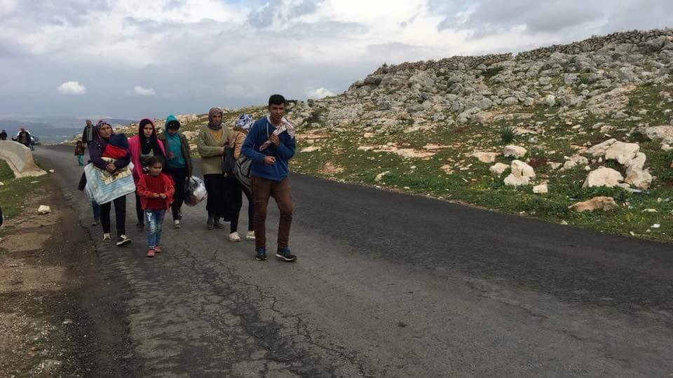
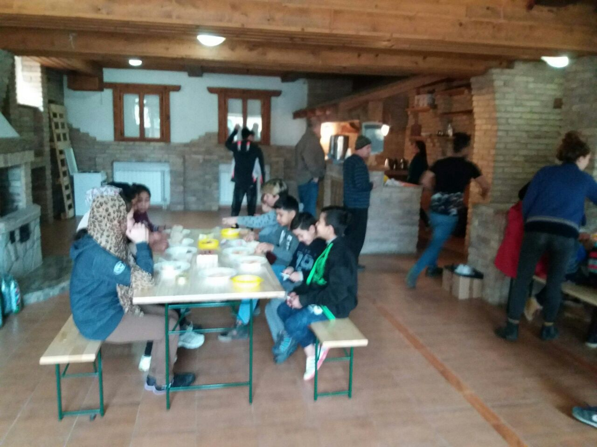
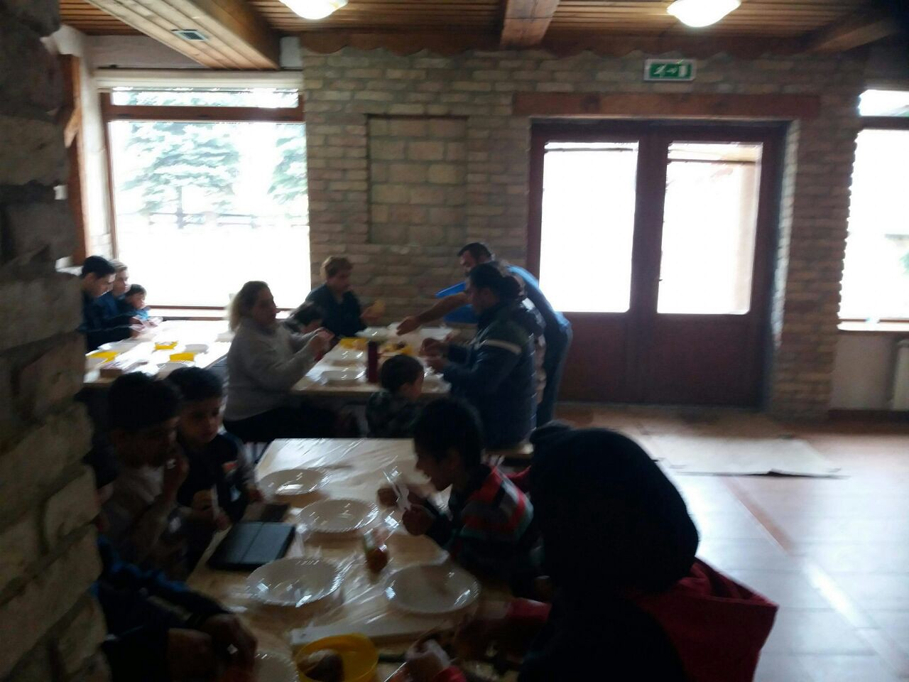
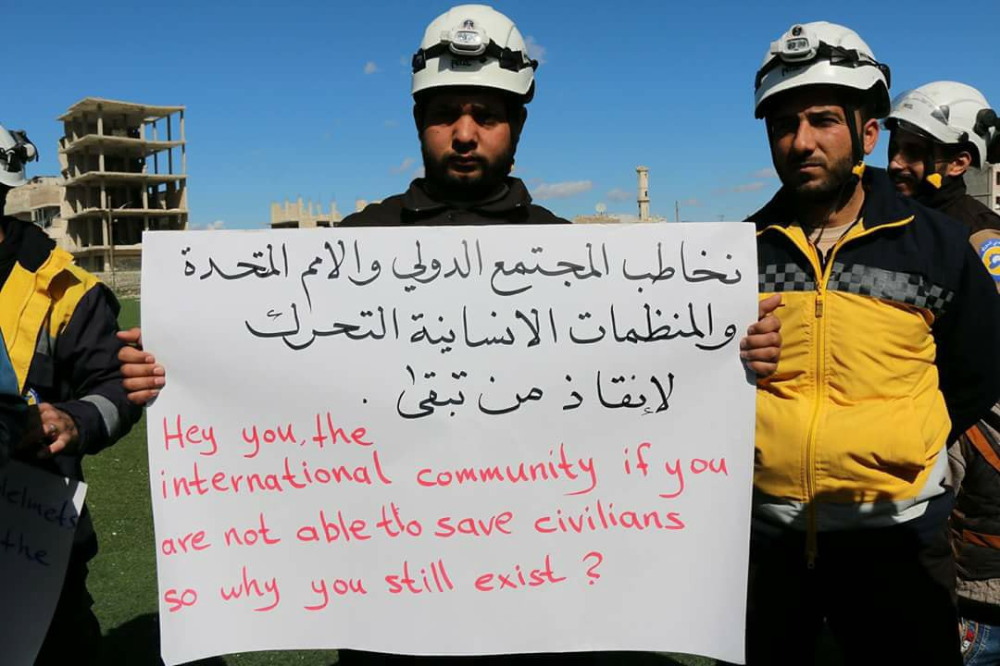
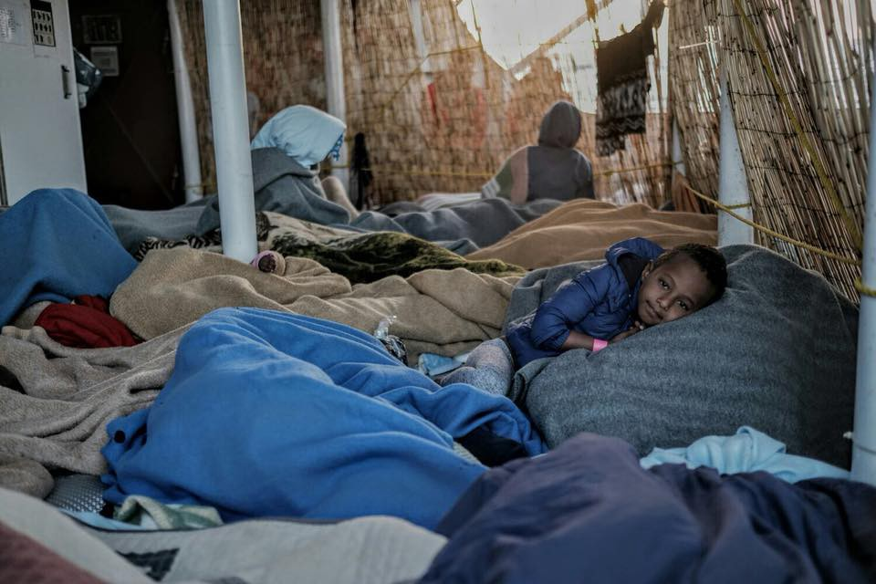
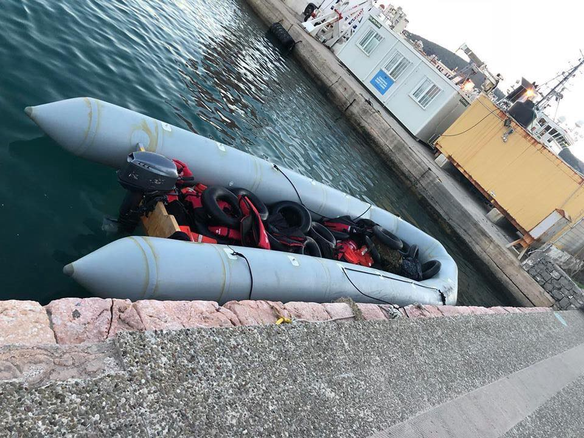
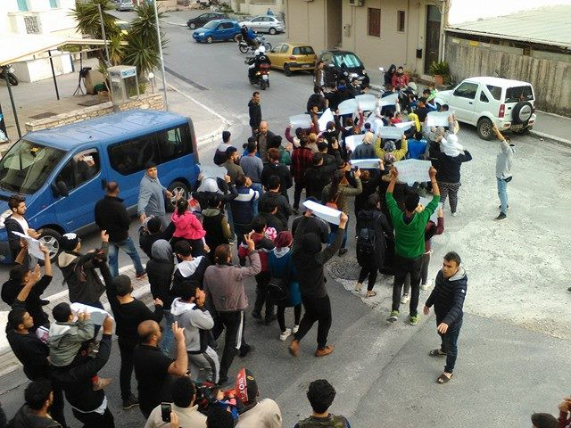

### DAILY DIGEST 16/03/2018: 14 lifeless bodies recovered from the sea

_The situation in Bosnia is getting out of control // Another shipwreck near Greece / 14 lifeless bodies, including 4 children, recovered from the sea // Protests against EU — Turkey deal all over Europe // Concentration camp for refugees in Bulgaria // Asylum seekers in the UK do not feel safe in provided accommodation_

People are still forced to move through Europe in this way, only to reach the palce where they will be safe\. Photo by @Fotomovimento15M
### Feature

State authorities in Bosnia and Herzegovina, as well as existing international organizations, are not ready to admit that the situation in this country is becoming alarming\. Due to that fact, it is almost impossible to establish the exact number of people who are currently in Bosnia and Herzegovina and need help, or locations where they are\.

International and local volunteers in Sarajevo are taking care of people in need all over the country, and they are much more alarmed over the situation then the government or UNHCR or IOM, or any of many EU agencies present in the country\. New people are arriving every day, and there is not available accommodation or any kind of help\. Additionally, those who are in Bosnia now are easily getting lost in complicated state structure\.

Bosnia is semi\-protectorate country for over 20 years, or since the end of war\. It means that the country functions under the complicated structures imposed through the peace agreement\. There are three levels of government, and it is almost impossible even for locals to live or function normally in this kind of surrounding\. For people on the move this is even dangerous since they remain deprived of their basic rights, and there is nobody to protect them\.

According to the official data, the situation is not alarming, and due to that, there is no plant to activate emergency plan created in 2015, so far\. Reality is that hundreds of people are sleeping rough all over the country, or are taken care by the locals\. Registration remains a huge issue, and people are not sure what they are supposed to do\.

There are many people who belong to so\-called vulnerable categories, including families with small children, pregnant women, elderly and sick people \(including those diseases like diabetes\), and only help that is provided is coming from the locals\. But it is getting harder to control the situation and help everybody\.

In Sarajevo, the group of local and international volunteers opened a safe house for about 50 people\. They will need all types of help in order to keep this place running, from volunteers who would be willing to stay in the house, to those who could help with day to day activities, but also help in order to be able to provide food and basics for all the people\.

Newly established center for vulnerable people on the move in Sarajevo\. Photo by AYS\.

The number of people on the move in BiH has seen a sharp rise over the past few months\. People are arriving from Serbia, or via Montenegro from Albania after leaving Greece\. Most are currently based in Sarajevo, Bihać, and Velika Kladuša area\. According to people who are in Kladuša and Bihać, northern Bosnia, there are several hundreds of people waiting to try to cross to Croatia\. There are no volunteers in this area, and help is provided only by the local population\. 
 
Next week temperature in Bosnia could go down to — 10C\. It is impossible to say how many people are on the streets, in mountains, and need help\.

If you would like to volunteer, please get in touch with local volunteers via AYS\. People with lot of experience are needed, and those who are willing to work with local in this very complicated enviroment\.

You can also help by donating to local charity Pomozi\.ba which is supporting volunteers in the field\.

Name of the bank: Intesa Sanpaolo Banka BiH
SWIFT CODE:UPBKBA22
IBAN: BA39 1541802008533048
Receiving: Udruženje “Pomozi\.ba”, dr\. Fetaha Bećirbegovića br\. 8, 71000 Sarajevo
Purpose: help for refugees

If you want to send financial support from Austria:
ERSTE BANK
IBAN: AT64 2011182266475400
BIC: GIBAATWWXXX
Wien, Oesterreich
Name: hilfhelfen\-pomozi\.ba
### Syria

The situation in Afrin area is getting worse, while thousands of civilians are blocked from leaving the city\. Hundreds are injured or killed every day\.

No good news from Ghouta where from more than 11\.000 people left so far and more are ready to leave\.

Photo Syria Civil Defence
### Sea

The dramatic day in the sea\. After saving 218 people from a shipwreck, Pro Activa Open Arms crew were not allowed to disembark after Libyan cost guards blocked the rescue for three hours threatening to people with weapons\. Finally, they were unblocked and allowed to bring all the people to Pozzallo, Italy\.

Among those rescued were children, women and men\.

Photo ProActiva Open Arms

The Med — Alarmphone released the new video, in Tunisian Arabic, about crossing the sea safely\.

More alarming info about people who were trapped in Libya\. [EU Observer reports](https://euobserver.com/migration/141343) about traumatized women who are demanding HIV testing after facing brutal abuse in Libyan detention centres\.

“All the women that we evacuate from Libya, the first thing they ask arriving in Niamey airport is not a glass of water\. It is HIV testing, that is what they are asking,” said Vincent Cochetel, the UN refugee special envoy to the region\.

Many of this woman are arriving pregnant, after being raped in detention centres\.
### General

March 17th is the time for protests against European restrictive policies mirrored in the EU — Turkey deal\. Today is two years since the deal was reached, forcing hundreds of people to take dangerous routes while exercising one of the basic human rights — freedom of movement\.

The deal also caused the [creation of detention facilities](http://rsaegean.org/stopthetoxicdeal-detention/) , in particular, the Pre\-Removal Detention Centers \(so\-called PRO\.KE\.KA\) on the Aegean islands where hundreds of people are kept\.

People detained are mostly those whose asylum claims are rejected at second instance, in order to be immediately returned to Turkey under the “deal”\.

_“Because of the “deal” and the law on the organization and operation of the Asylum Service \(article 41 Law 4375/2016\), a special form of restriction of freedom was created, the so\-called “geographic restriction”, which is imposed indiscriminately and prohibits the departure of the asylum seekers from the islands\. The Director of Asylum Service issues a “geographic restriction” for “reasons of public order”, under the pretext of a faster processing and monitoring of asylum claims without individual assessment and justification\. This “red stamp” in the international protection applicants’ cards is trapping them for a long period of time — even for more than a year — in a limbo state of waiting under miserable conditions\.”_

All over Europe, solidarity groups will protest against The Deal today\. Here is a map with a mark on the 69 cities where the international day of action against racism and fascism will unfold on March 17th\.

BALKAN WEATHER REPORT

**Montenegro** 
Saturday will be moderately cloudy to entirely cloudy with occasional rain, rain showers and thunder\. In the morning and before noon there will be little precipitation\.The wind will be amplified to strong and at times very strong blowing from the south\. In the morning the temperatures will be from 4 to 14 and during the day from 8 to 19 degrees\.
**Serbia** 
In Serbia, it will be moderately cloudy to entirely cloudy, with occasional rain and locally in the southwest, south and southeast of the country rain showers and thunder\. In the centre and in the southeast during the most part of the day, it will be dry with periods of sun\. The wind will be weak to moderate blowing from the south and southeast, while in some parts of the country amplified to strong wind from the northwest is expected\. The lowest temperature will be from 5 to 10 degrees, the highest daily 10 degrees in the west and 23 in the south\.
**Bosnia** 
Saturday in Bosnia will be cloudy with rain and windy throughout the entire country\. The wind will be mainly blowing from the south, and in the north part of the country from the east\. The temperature will be mostly between 8 and 14 degrees while in the south it can be up to 16 degrees\.
**Croatia** 
Saturday will be mostly cloudy with rain\. In the mountains, the temperatures will drop significantly around noon and the rain will turn into sleet and snow, while this will happen in rest of the interior during the night from Saturday to Sunday\. Land inwards the wind will be moderate to strong blowing from the northeast and north, alongside the coast strong to stormy winds blowing from the south, are expected\. Land inwards the temperatures will be from 5 to 10 degrees on average but will drop considerably in the afternoon\. Alongside the coast, the temperatures will mainly form 10 to 15 degrees\.
### Greece

At least 14 people are reported dead on Saturday morning after the boat capsized off the Greek island of Agathonisi in eastern Aegean\. Among those who died are four children\.

Three people — two women and a man — managed to reach the coast and alert authorities to the boat sinking\. They told authorities that they had been in a wooden boat carrying an estimated 21 people which sank, for reasons that were not immediately clear\.

A huge search and rescue operation is ongoing\.

Last night, more people arrived on Lesvos, Samos, Agathonisi, and Chios\.

Photo from Chios by Hugo Clair

To Samos, two boats arrived carrying 63 people\.

From Rhodes, alarming call for help\. Over 25 refugees are in need of immediate help\. All of them are held in the police station, and some of them are children\.

If you can help, get in touch with [Oasis solidarity group](https://www.facebook.com/groups/OasisRhodes/)

On Samos, approximately 50 Kurdish people protested against the Turkish invasion of Afrin, and Erdogan’s continued arrests and crackdown on Kurds in Turkey\.

Photo by AYS

While Turkey is at war with Kurdish people in Afrin, many Kurds are still being deported from Greece to Turkey, where they may face arbitrary imprisonment and torture\.

The Mobile Info Team published new statistics about acceptance rates for asylum in Greece showing how likely it is for some nationalities to get asylum in Greece\.

Asylum should not depend on anybody’s nationality, but different nationalities still have different chances of acceptance\.

_“Till now, nearly every Syrian gets asylum status in Greece \(99\.6%\) \. Palestinians also have a really high acceptance rate \(95\.7%\) \. Approximately 3 out of 4 Iraqis are getting asylum in Greece \(72\.8%\) \. Afghani nationals have an acceptance rate of 68\.6% and Iranians 57\.1%\._

_For people from North Africa, the situation is quite different\. Only 1 out of 9 Moroccans receive asylum \(11\.6%\), and the acceptance rate for Egyptians is 6\.7% and for Algerians 2\.6%\. Bangladeshi nationals are also not very likely to get asylum, with an acceptance rate of 3\.6%\. Likewise, for Pakistanis, the situation is not really good\. If 40 Pakistanis apply, in average 39 will be rejected and only 1 will get asylum \(2\.5%\) \.”_

You can find this and another statistic [here](http://asylo.gov.gr/en/?page_id=110) \(only in English\) \.

The [Greek government is planning](http://www.ekathimerini.com/226800/article/ekathimerini/news/some-500-migrants-to-be-evacuated-from-makeshift-patra-camps) to move all the people from makeshift camps in Patras area to different facilities in other parts of the country\. According to some estimates, there are around 500 people sleeping rough or squatting in Patras, all trying to board boats to Italy\.

Even though people in this are in need of help for months, even longer than a year, the government decided to react only after some reports about the violence among people\. Causes of violence will not be addressed, and that is deep frustration by living conditions in this area, but also in Greece in general for many people, especially single man\.

Refugee 4 Refugees is looking for donations in Mytilene, Lesvos\. The group is trying to open Community Center called “Habibi Land”, as soon as possible\.

“A place for everyone, where you can be human again, forget about everything and just laugh with friends and play sports\.
But to clean the buildings and make them ready for our projects we need your help\! Every single euro donated will be spent on the new Community Center\.”

Click [here](https://www.gofundme.com/habibi-land-community-center) for our fundraiser\.
### Bulgaria

Andrea Roschek reports about Bosmansi Emigration Center where living conditions do not improve despite numerous reports and warnings\. People are kept in this centre like in prison, or even worse, like in concentration camp\. They do not have freedom of movement and receive scarce food\. Hygiene conditions are hardly human\. There are no volunteers inside, and those who managed to enter are closely watched by the guards\.
### UK

The [new report](http://refugeerights.org.uk/wp-content/uploads/2018/02/RRE_A-Hostile-Environment.pdf?platform=hootsuite) about the living situation for asylum seekers in the UK shows that about 64 percent of them feel unsafe in the state provided accommodation\.

_“One 17\-year\-old said: “I feel scared sometimes\. I don’t like this hostel, it is very bad\.” Another said: “I have been diagnosed with post\-traumatic stress because of what happened to me in detention in \[my country of origin\] \. I don’t sleep well here\. It’s very, very bad here for me — not just very bad\.”_

Some partially good news from the UK\. [MPs have backed a bill](https://www.theguardian.com/politics/2018/mar/16/mps-back-refugee-family-reunification-bill) that would allow child refugees to sponsor close relatives to join them in the UK, though the government has said it will oppose the legislation at a later stage\.

Nevertheless, this decision is welcomed by many groups\. The Worldwide Tribe writes:

We can’t believe it\.
This takes us a giant step closer to reuniting refugee families\.
The bill asked for:
1\. Child refugees in the UK to have the right to bring their parents and siblings legally and safely to the UK
2\. An expansion of who qualifies as family…so young people over 18 and elderly parents too \(they are not currently eligible for reunification\)
3\. Legal aid to help refugees afford to navigate the complicated process of being reunited with their family\.

We hope this decision will stay allowing something so basic\.

> **We strive to echo correct news from the ground through collaboration and fairness\.** 

> **Every effort has been made to credit organizations and individuals with regard to the supply of information, video, and photo material \(in cases where the source wanted to be accredited\) \. Please notify us regarding corrections\.** 

> **If there’s anything you want to share or comment, contact us through Facebook or write to: areyousyrious@gmail\.com** 

_Converted [Medium Post](https://medium.com/are-you-syrious/daily-digest-16-03-2018-14-lifeless-bodies-recovered-from-the-sea-d4ec43d2da58) by [ZMediumToMarkdown](https://github.com/ZhgChgLi/ZMediumToMarkdown)._
