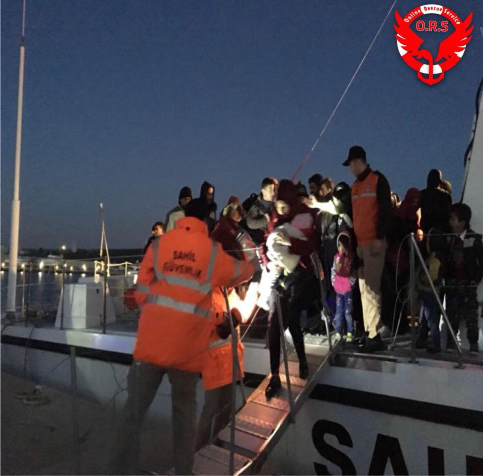
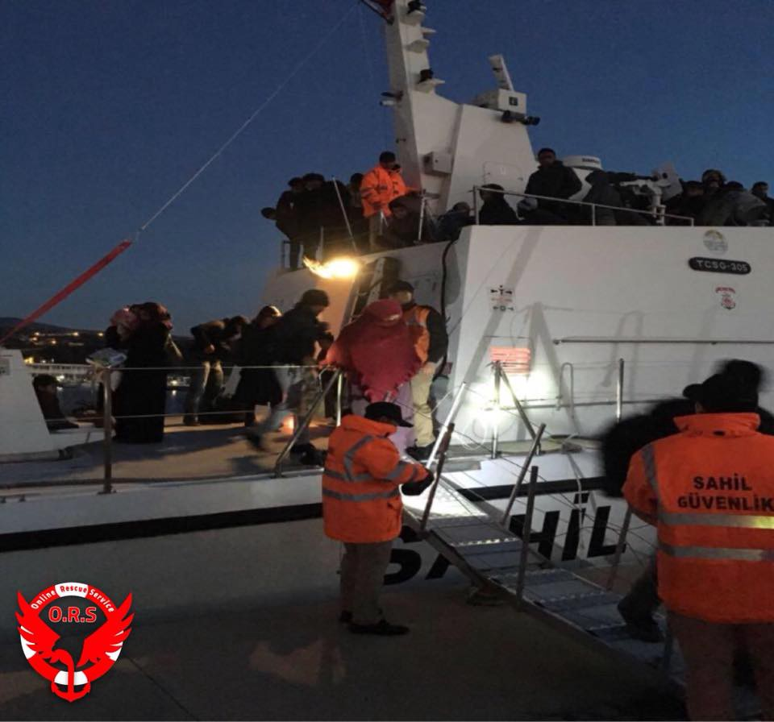
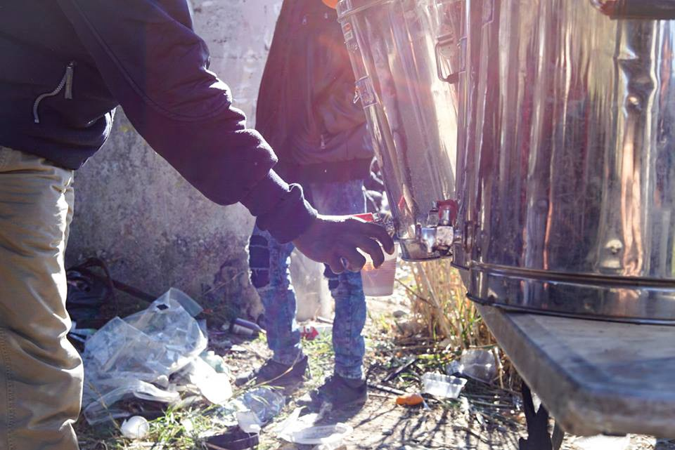
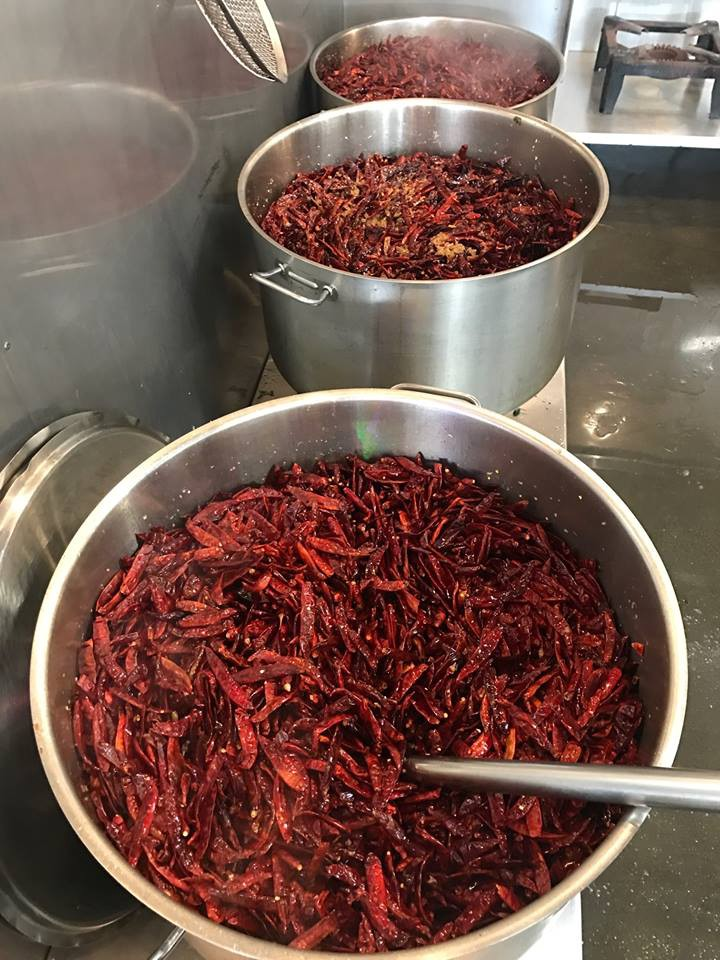
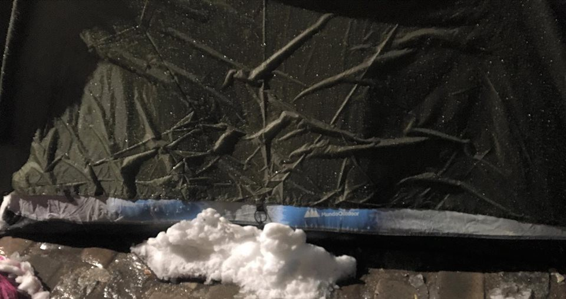

### AYS DAILY DIGEST 18/03/2018: First deadly shipwreck of 2018 in Greece
#### Can this be the last one? — At least 16 people died in a shipwreck south of the island of Agathonisi / Turkish and Syrian forces in control of Afrin / Proactiva’s boat seized / 25\-year\-old killed in Calais / Three volunteers arrested in Ventimiglia / Paris is freezing, people still sleeping rough / 4500 “disappeared” children without residency in Sweden

](assets/51b7ddbd148/1*edd6NOl4hvKvIwWA3flVjw.jpeg)

Ventimiglia, photo by [Kesha Niya](https://www.facebook.com/KeshaNiyaProject/?hc_ref=ARR312TSpcSrzhNG2oy26B8kznH-WphopHS3gfNAViP3fBIBDcROIDtL_ATj38W06oE&hc_location=group)
#### FEATURE

Four boys, two girls and one baby girl, seven men and two women… the bodies of 16 people have been recovered from the sea and from the shore where they were washed up on the south side of the island of Agathonisi, where a wooden migrant boat capsized in the early hours of Saturday, [reports](http://www.keeptalkinggreece.com/2018/03/18/agathonisi-migrants-testimonies/) Keep Talking Greece\. The boat was carrying people from Turkey to Greece\.

“I was the first to come close to the shipwreck, several bodies were on the shore, one pregnant woman and a boy were floating nearby\. They were all wearing swim vests,” said the fisherman [according to](https://www.facebook.com/giorgos.moutafis.5/posts/10215777230285177) photographer Giorgos Moutafis\.

Among the 16 victims was a baby, a newborn\. The mother managed to swim to shore\. “The engine stopped as we sailed towards Greece\. I was breastfeeding my baby\. We became concerned and stood up\. Within minutes we were in the water\. My baby is gone,” the woman from Afghanistan reportedly told rescuers\.

Two Iraqi men managed to swim to shore as well\. The three are the only survivors of the shipwreck\. The bodies of the deceased have been transferred to Samos, while the SAR operation continued today despite the stormy weather\. Twenty\-two people were on board, including two smugglers\.

The smugglers appear to be using bigger unsafe boats, making the dangerous crossing even more dangerous\. Boats like this are usually in bad shape, and not in seaworthy condition at all, warned [Aegean Boat Report](https://www.facebook.com/AegeanBoatReport/) \.

On March 17, 2018 at 1:41 a\.m\. \(EET\), a private boat, found in the Erdemli county of Mersin province, was stopped and a total of 165 people \(72 men, 30 women, 63 children\) of Syrian nationality were arrested\. In a related incident, a van was stopped in coordination with Kızkalesi Gendarmerie Station personnel in the Erdemli district, and a total of 27 people \(14 men, 11 women, two children\) of Syrian nationality were caught in the pickup truck with the driver; administrative procedures have been initiated, they report\.

#### SYRIA

Turkish forces and their Syrian rebel allies swept into the northwestern Syrian town of Afrin on Sunday, raising their flags in the town centre and declaring full control after an eight\-week campaign to drive out Kurdish YPG forces, [reports](https://www.middleeastmonitor.com/20180318-turkish-forces-and-syrian-allies-drive-kurds-from-afrin-town/) MEMO\. The fight for Afrin, a once stable pocket of northwest Syria, has opened a new front in Syria’s many\-sided civil war\. The Kurdish administration of Syria’s Afrin region [let it be known](https://www.middleeastmonitor.com/20180318-kurds-signal-move-to-new-phase-of-guerrilla-war-on-turkish-forces-in-afrin/) that Kurdish\-dominated forces fighting Turkey\-backed groups in the area will shift from direct confrontation to guerrilla tactics\.

“Our forces are present all over Afrin’s geography\. These forces will strike the positions of the Turkish enemy and its mercenaries at every opportunity,” said Othman Sheikh Issa, co\-chair of the Afrin executive council, in a televised statement\.

The main rebel group in the southern pocket of eastern Ghouta on Sunday said that it was “engaged in arranging serious negotiations” with a UN delegation about a ceasefire, aid, and the evacuation of urgent medical cases\. A general evacuation of civilians and rebels was not on the table, he [said](https://www.middleeastmonitor.com/20180318-rebels-in-syrias-eastern-ghouta-discussing-ceasefire-with-un/) \.

France’s Foreign Ministry on Friday [called on](https://www.middleeastmonitor.com/20180316-france-urges-journalists-not-to-travel-to-syria/) French media organizations not to send reporters to Syria and urged journalists already there to return immediately, given the escalation in violence, particularly in Eastern Ghouta and the Afrin region\.

#### TURKEY/GREECE

Greek police say they have arrested three traffickers, a Turk and two Iraqis, near the Greece\-Turkey border\. The traffickers were arrested after bringing 45 Syrian and Iraqi men, women, and children across the river that forms the border between the two countries at that point\. The traffickers used an inflatable motor boat and were on their way back to Turkey when arrested, [reports](http://www.ekathimerini.com/226855/article/ekathimerini/news/three-migrant-traffickers-arrested-near-turkish-border) ekathimerini\.
#### BALKAN WEATHER REPORT for Monday, March 19

Montenegro

Monday in Montenegro will be entirely overcast with occasionally rain or rain showers with thunder, while in the higher mountains the rain will be shifting to sleet and snow\. The wind will be intermittently weak to moderate, from the south\. In the morning temperatures will range from \-1 to 10°C and during the day from 8 to 13°C \.

Serbia

Monday will be cloudy and for the most part cold, in the southwest and the mountains there will be intermittent snow, creating new snow cover and adding to existing snow\. In the rest of the country there be will local rain and sleet, with more precipitation in the south and southeast\. During the morning the rain will freeze on contact with the ground in the north and west\. Morning temperatures will range from \-3° in the north to 7°C in the south, and during the day they will range from 0° in the north to 10°C in the southeast\.

Bosnia and Herzegovina

Monday will be cloudy\. Snow flurries are expected in Krajina, in the north and the northeast, while there will be light rain in the rest of the country\. Snow flurries possible in the mountains\. The wind will be weak to moderate, from the east and northeast in Bosnia, from the southeast in Herzegovina\. In general the temperatures will be range from 0° to 6°C while in the west, south and in the southwest they will range from 7° to13°C\.

Croatia

Croatia will be overcast with occasional snow flurries in the early hours; during the night a light snow cover is expected to form\. Along the coast some very light snow might blow in\. Inland a moderate to strong wind from the northeast, along the northern coast wind will be gusting while along the southern coast the wind will be from the south\.
#### GERMANY

The Bamf will hire 200 new employees to review positive asylum decisions\. After right\-wing soldier Franco A\. was exposed, former interior minister Thomas de Maiziere ordered a review of some 150,000 cases\. Since then, only 2,500 cases have been reviewed\. In 421 of them \(17%\) the decision was withdrawn or revoked, [writes](http://www.sueddeutsche.de/politik/fluechtlinge-bamf-will-positive-asylbescheide-ueberpruefen-1.3911158) SZ\.de\.
#### ITALY

Proactiva’s boat has been seized by the authorities in Catania and charged with aiding illegal immigration \(the same charge as Jugend Rettet\) by not allowing the Libyan authorities to take the people back, [reports](http://www.ansa.it/sito/notizie/topnews/2018/03/18/sequestrata-nave-ong-spagnola-proactiva_17aabcd6-04f5-437f-9405-38c42e79c553.html) ansa\. Proactiva eventually agreed to sign the controversial Code of Conduct last summer\.
#### Lampedusa

Last night, around 2 a\.m\., a young Tunisian man committed several self\-harm actions, cutting his arms and wrists\. He arrived to Italy more than two months ago and has been held in Lampedusa ever since \(reminder: you should stay in a hotspot for a maximum of 48 hours\! \) and has been suffering from depression and psychological conditions since\. He was taken to the local hospital and received assistance, however he is still in Lampedusa and there is no plan to take him to Sicily, despite his condition and the absence of psychological assistance on the island\.
#### Ventimiglia

The [Kesha Niya](https://www.facebook.com/KeshaNiyaProject/?hc_ref=ARR312TSpcSrzhNG2oy26B8kznH-WphopHS3gfNAViP3fBIBDcROIDtL_ATj38W06oE&hc_location=group) project writes that for the volunteers working in Ventimiglia the snow and freezing cold are a big challenge\. Along with the daily tasks such as making tea or cooking food, distributing clothes to those in need, the volunteers also try to prevent the tents from collapsing\. They collect firewood, organize sleeping bags and blankets, so that the people they support are able to survive the freezing nights\.

](assets/51b7ddbd148/1*edd6NOl4hvKvIwWA3flVjw.jpeg)

[Kesha Niya](https://www.facebook.com/KeshaNiyaProject/?hc_ref=ARR312TSpcSrzhNG2oy26B8kznH-WphopHS3gfNAViP3fBIBDcROIDtL_ATj38W06oE&hc_location=group)
#### FRANCE

A 25\-year\-old was stabbed on Saturday night at 6 p\.m\. in Calais\. Despite intervention by Marck firefighters, the Afghan boy couldn’t be saved\. He was stabbed in the back\. The event occurred near the Calais hospital and a meal distribution area\. The police investigated last night and this Sunday morning\. The attacker still hasn’t been found, [reports](https://www.radio6.fr/article-32731-un-migrant-a-ete-tue-un-coup-de-couteau-samedi-soir-a-calais.html) radio6\.

[Refugee Community Kitchen](https://www.facebook.com/groups/RefugeeCommunityKitchen/?ref=group_header) resumed evening hot\-food service in Calais 
after not serving for four days\. They suspended service to encourage the uptake of new hot\-food distribution by La Vie Active \(LVA\), resulting from an overdue decision by the French Government to begin providing a daily meal service for displaced people in the region\. The reason people were not coming was mostly due to trust and safety issues, as people perceived the LVA as affiliated with the government\-sanctioned police who are aggressive and hostile toward them every day, says the RCK\. There is now slightly more uptake of their food offering \(breakfast \+ lunch\) and RCK commends LVA for adapting their distribution techniques, serving outside the compound and reaching out to the different areas and communities\. It seems gradually to be taking hold\.
They will continue with Calais evening service \(600–650 portions\), Dunkirk daily \(300–400\), and outreach in London \(200–250 portions per week\) \.

](assets/51b7ddbd148/1*DZDHdQudHd4IB6bHGTu3gg.jpeg)

[Refugee Community Kitchen](https://www.facebook.com/groups/RefugeeCommunityKitchen/?ref=group_header)
#### Paris

Heavy rain and snow hit the city again\. Hundreds are still sleeping in the freezing cold in tents under a bridge and throughout the city and there are more and more tents every day in these inhumane conditions\. This video was filmed yesterday:

![I took more than 70 names & details to send to the amazing ‘phone credit for refugees’ group\. As people were showing their phone so that I could copy their details, they were shivering\. Their hands were shaking so much that I couldn’t even see the numbers on the screen\. I stayed a couple of hours and couldn’t feel my feet\. I kept thinking I was going home at some point and would be able to get warmer\. How terrible must it be to know there is absolutely no perspective of warmth & getting dry? Before I left, a man told me: “You’re welcome to sleep here\. Why not? We’re all the same\.” Yes, we’re all the same\. So why are we not treated in the same way? — [Faces Before Numbers](https://www.facebook.com/FacesBeforeNumbers/)](assets/51b7ddbd148/1*vWZpNLvPgPGrhjkVEFhQ7g.jpeg)

I took more than 70 names & details to send to the amazing ‘phone credit for refugees’ group\. As people were showing their phone so that I could copy their details, they were shivering\. Their hands were shaking so much that I couldn’t even see the numbers on the screen\. I stayed a couple of hours and couldn’t feel my feet\. I kept thinking I was going home at some point and would be able to get warmer\. How terrible must it be to know there is absolutely no perspective of warmth & getting dry? Before I left, a man told me: “You’re welcome to sleep here\. Why not? We’re all the same\.” Yes, we’re all the same\. So why are we not treated in the same way? — [Faces Before Numbers](https://www.facebook.com/FacesBeforeNumbers/)
#### SWEDEN

4500 children have disappeared after deportation decisions over the last four years\. An [article](https://www.dn.se/nyheter/sverige/nioariga-mihi-lever-gomd-ibland-ar-jag-orolig-sa-jag-far-ont-i-magen/) published by Dagens Nyhater features interviews with two children\. Both kids know they can be sent back at any time if they are found, but in the meantime the parents are trying to give them as normal an upbringing as possible, in the tiny apartment where they are living somewhere in Sweden\. Since 2013, children without residency papers have the right to attend school like any other child\. “Sometimes I’m so worried that my stomach hurts”, says the nine\-year\-old child, describing the current situation\. The exact number of children without papers who are currently going to school is difficult to estimate, but Skolverket \(the responsible authority\) estimates this to be somewhere between 2000 and 4000 children\.

After four years one may re\-apply for asylum, for this Bangladeshi family that will be next year\. Meanwhile they have been in hiding, it has been difficult to work\. When one takes an illegal job the risk of being found increases significantly so they have been completely dependent on other people’s kindness, money and help\. For more details in Swedish, read the full article [here](https://www.dn.se/nyheter/sverige/nioariga-mihi-lever-gomd-ibland-ar-jag-orolig-sa-jag-far-ont-i-magen/) \.

In the first two months 2018, 223 children disappeared after receiving negative answers regarding asylum\. Of these, 19 were unaccompanied minors and the rest were part of families\. In comparison with this alarming number for the first two months of 2018, the number for the whole year of 2017 was 152 children\. As mentioned before, due to the large influx of refugees in 2015 and the slow procedures, many decisions and appeals will be delivered this year and the next\. Normally when a child disappears, a search for it is immediately begun\. But children who have no legal status in Sweden are not included in the normal framework\. The situation is alarming and acute, as an employee \(the vikarierande bar ombudsman\) working with children’s rights and well being in Sweden [told](https://www.dn.se/nyheter/sverige/223-barn-har-forsvunnit-pa-tva-manader-laget-ar-oerhort-akut/) Dagens Nyheter\.

> **We strive to echo correct news from the ground through collaboration and fairness\.** 

> **Every effort has been made to credit organizations and individuals with regard to the supply of information, video, and photo material \(in cases where the source wanted to be accredited\) \. Please notify us regarding corrections\.** 

> **If there’s anything you want to share or comment, contact us through Facebook or write to: areyousyrious@gmail\.com** 

_Converted [Medium Post](https://medium.com/are-you-syrious/ays-daily-digest-18-03-2018-first-deadly-shipwreck-of-2018-in-greece-51b7ddbd148) by [ZMediumToMarkdown](https://github.com/ZhgChgLi/ZMediumToMarkdown)._
