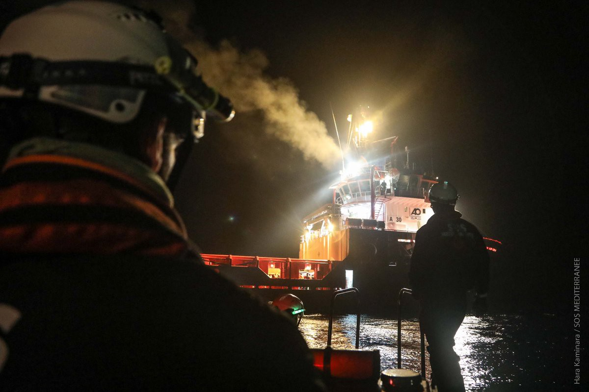

### AYS Daily Digest 21/03/18: The last civil rescue ship in the central Mediterranean

_Worries over the worsening situation / Deaths in Afghanistan, Syria and Greece / Asylum statistics for Bulgaria released / German court sentences alleged smuggler / NGOs demand closure of the hotspot on Lampedusa / And more news…_

The _Aquarius_ is the last ship in the central Mediterranean Sea \(Photo by Hara Kaminara\)
### FEATURE: The last civil rescue ship in the central Mediterranean

After the seizure of the _Open Arms_ , the _Aquarius_ is the last civil rescue ship left in the Mediterranean Sea off the shores of Libya\. “Hereby, the already insufficient availability of rescue capacities on the most deadly migration route in the world has been diminished once again,” SOS Mediterranee, who operates the _Aquarius_ together with MSF, wrote in a newsletter\.

■■■■■■■■■■■■■■ 
> **[MSF Sea](https://twitter.com/MSF_Sea) @ Twitter Says:** 

> > More &amp; more #MSF is witnessing the disturbing level of cooperation between European Govt's &amp; the Libyan Coastguard, aimed at returning people to #Libya - from training &amp; material support, to paving the way for Libyan Coastguards to intercept refugees &amp; migrants in int’l waters. https://t.co/Vl2sikG95e 

> **Tweeted at [2018-03-21 16:09:42](https://twitter.com/msf_sea/status/976491046728290304).** 

■■■■■■■■■■■■■■ 

They are worried that the situation will lead to even more casualities at sea\. While rescue capacities have been at a low level for some time now, the security situation is becoming worse and worse\. Several times during the past months, the _Aquarius_ crew witnessed the Libyan Coast Guard halting vessels in international waters\. “Castaways, rescued by the _Aquarius_ , have repeatedly stated that the interventions by the Libyan Coast Guard increase the risk of shipping accidents, and people have drowned in the past\.” Complex situations and obscurities during search and rescue missions have recently put both the castaways and the rescuers in danger, the NGO observes\.

Sophie Beau, vice\-president of SOS Mediterranee, expressed her solidarity with ProActiva:

> “Today the Aquarius is the last civil rescue ship in the central Mediterranean Sea\. For how long?” 

MSF has also [criticized](http://www.msf.org/en/article/central-mediterranean-european-governments-are-obstructing-lifesaving-rescues-and-returning) the seizure of the _Open Arms,_ and urged Italy and other EU countries to stop hindering rescue operations and to condemn pushbacks to Libya\. “There’s a disturbing level of cooperation between European governments and the Libyan Coast Guard, ranging from training and material support to paving the way for the Libyan Coast Guard in international waters, aimed at returning people to Libya,” said Annemarie Loof, MSF’s operational manager\. There has been an alarming trend by Italian and other European governments to impede, and in turn criminalize, NGOs and their rescue operations\.
### AFGHANISTAN

At least 32 people died and more were wounded during a blast in Afghanistan’s capital Kabul, Reuters [reports](https://www.reuters.com/article/us-afghanistan-blast/suicide-bomber-kills-more-than-30-near-shrine-in-afghan-capital-idUSKBN1GX0NZ) \. The attacker is said to have blown himself up near a shrine named Kart\-e Sakhi in the west of Kabul, where mainly Shia people live\. The attack took place today as people celebrated the Nawruz holiday, which marks the start of the Persian New Year\. The shrine had already been attacked in October 2016 during a festival\.

According to the police, the explosion happened when people were just heading home\. An interior ministry spokesman added that the attacker had intended to reach the shrine, but had been prevented from getting closer by police checkpoints\.
### SYRIA

Several sources have confirmed that an airstrike hit a school in Kafr Batirkh, close to Izmir, today\. At least 20 people reportedly died, most of them children\.
### BULGARIA

Afghans were the largest group asking for asylum in Bulgaria in 2017, with a total number of 1,050 applications\. Referring to Eurostat, Novonite writes that in the past 15 years some 25,000 Afghans asked for international protection in this south\-eastern European country\. With 955 asylum applications, Iraq was the second largest group followed by Syrians with 940 asylum requests\. So far in this year, 224 have asked for protection — 180 of them have received a negative decision\.
### GREECE

An Afghan man died during a car accident in Patras yesterday\. According to [Tempo24](http://tempo24.news/eidisi/171181/tragodia-nekros-o-afganos-poy-parasyrthike-stin-akti-dymaion-krateitai-o-odigos-itan) , the 24\-year\-old man left a boat he had tried to enter before\. When crossing the street, he was hit by the car\. Police sources said they did not think this was a reprisal\. Also, the 20\-year\-old driver stayed close to the spot\.

The new [UNHCR data snapshot of Lesvos](https://www.facebook.com/AegeanBoatReport/photos/a.285312485325196.1073741828.285298881993223/322233591633085/?type=3&theater) shows that more than 2,000 people have reached the island since the beginning of the year, making up almost 50 percent of all new arrivals on the Greek islands\. While the UN agency estimates that 7,496 people reside on Lesvos, the [Greek government](http://mindigital.gr/index.php/%CF%80%CF%81%CE%BF%CF%83%CF%86%CF%85%CE%B3%CE%B9%CE%BA%CF%8C-%CE%B6%CE%AE%CF%84%CE%B7%CE%BC%CE%B1-refugee-crisis/2100-national-situational-picture-regarding-the-islands-at-eastern-aegean-sea-20-03-2018) gives the number at 7,252\. The data also differs when it comes to transfers to the mainland in March 2018: according to UNHCR, 437 people were transferred as of yesterday, the government says less — 418\.
### BALKAN WEATHER REPORT: Thursday, 22/03
#### Montenegro

It will be cloudy with precipitation, cold and windy\. In most inland parts of the country it will snow, while along the coast and in the lower parts in the south some rain is possible and during the night sleet and snow\. The wind will be amplified to strong, with very strong gusts blowing from the north and northeast, decreasing in strength during the night\. The morning temperatures will be from \-9 to 6 and the highest daily from \-7 to 9 degrees\.
#### Serbia

It will be cloudy with local snow, with formation of new snow covers and an increase of the existing ones\. Only in Vojvodina will it be predominantly sunny before noon\. The wind will be weak to moderate, blowing from the north and northeast\. The lowest temperatures will be form \-5 to 0 and the highest daily from \-2 to 2 degrees\.
#### BiH

In Bosnia and Herzegovina it will be cloudy with precipitation in the morning in the east and south which will spread out throughout the country towards the evening\. In most parts of the country it will snow\. A new snow cover of 10 to 25 centimetres in expected\. In the far north, rain that could turn into sleet or snow is predicted\. In Herzegovina a strong wind that could change directions will be blowing\. In most part of the country there will be weak wind before noon, in the afternoon an amplification of the north\-eastern wind is expected and in the evening strong gusts are likely\. The temperatures will be mostly from \-4 to 1 and in the far south and southeast from 1 to 5 degrees\.
#### Croatia

It will be mostly to predominantly sunny in most parts of Croatia\. In Dalmatia there will be rain or sleet, especially during the second part of the day\. Also in Lika some snow may fall, and in Slavonia cloudy weather with snow is expected towards the end of the day\. The wind will be mostly moderate, blowing from the northeast, locally with stormy gusts\. The highest daily temperature inland will be form 1 to 6, in the mountains a bit lower and alongside the coast from 5 to 10 degrees\.
### ITALY

Several organizations are demanding the final closure of the Lampedusa hotspot\. According to [InfoMigrants](http://www.infomigrants.net/en/post/8197/associations-demand-definitive-closure-of-lampedusa-hotspot) , the hotspot was temporarily closed last week due to inhuman conditions and should be emptied now\. There are still around 50–70 people in the camp, however, including vulnerable cases\. The NGOs also criticized the authorities for transferring single men to detention centres during the eviction\.
### GERMANY

The eastern German court of Frankfurt an der Oder convicted a truck driver for trying to smuggle 51 people into the country over the Polish border last year\. InfoMigrants [writes](http://www.infomigrants.net/en/post/8193/germany-truck-driver-given-jail-sentence-for-smuggling-51-migrants) that the 47\-year\-old man was sentenced to two and a half years in jail and said that he was “indifferent to the health and safety of the men, women and children held in the back of his truck\.” Reportedly, he drove for more than one day without giving the people a break, leaving them hungry, thirsty, and without the possibility to use a toilet between unsecured, heavy loads\. Defending himself, the man argued he was put under pressure by unknown men, who threatened to harm his family\. But in the opinion of the court, who believed his story, he was still responsible for the well\-being of the people\. The court’s verdict is not yet final, with two more hearings to come\.
### DENMARK

Today two years ago, the Kærshovedgård detention center was opened\. Since then, only four people have left the facility, while 44 reopened their cases and 22 were able to stay in Denmark\. Currently, there are some 190 people in the center waiting for their cases to be processed\.

**We strive to echo correct news from the ground through collaboration and fairness\.**

**Every effort has been made to credit organizations and individuals with regard to the supply of information, video, and photo material \(in cases where the source wanted to be accredited\) \. Please notify us regarding any corrections\.**

**If there’s anything you want to share or comment, contact us through Facebook or write to: areyousyrious@gmail\.com**

_Converted [Medium Post](https://medium.com/are-you-syrious/ays-daily-digest-21-3-18-the-last-civil-rescue-ship-in-the-central-mediterranean-6819ece1cd7c) by [ZMediumToMarkdown](https://github.com/ZhgChgLi/ZMediumToMarkdown)._
