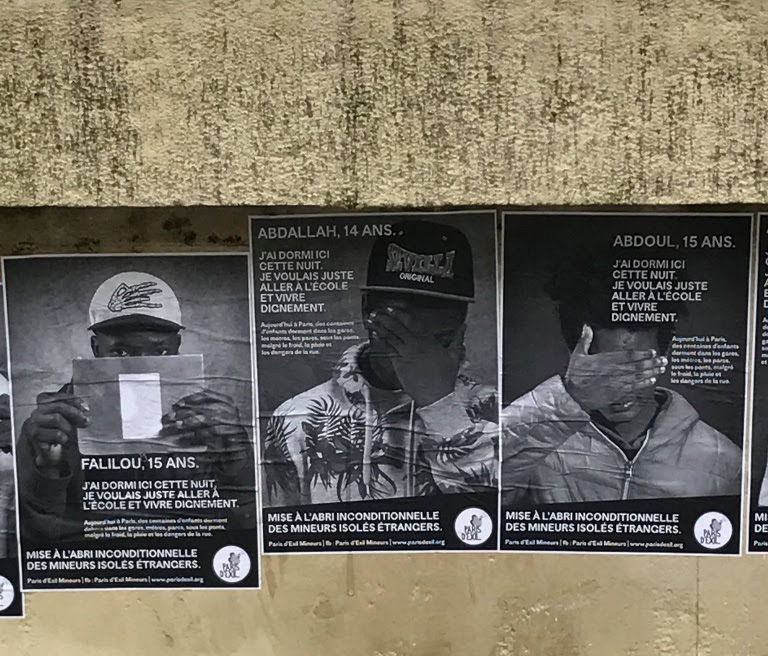
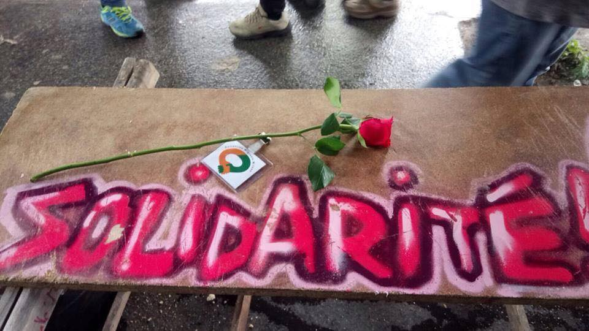
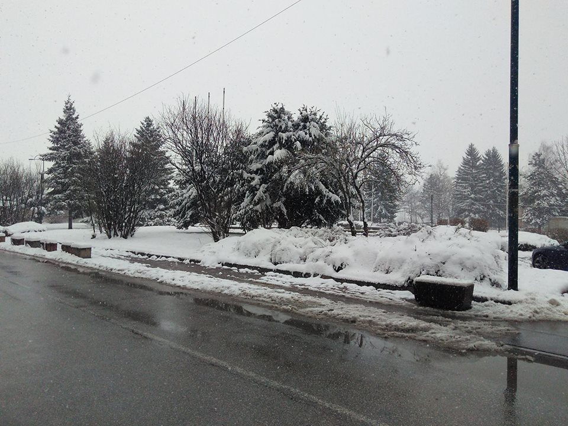
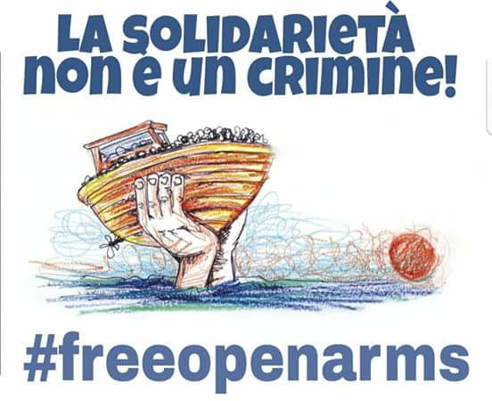

### AYS DAILY DIGEST 23\.03\.2018: State destroys tents while providing food

_Associations protest situation of unaccompanied minors in Paris//Proactiva Open Arms needs support//Photojournalist in Serbian prison//Right\-wing group claims responsibility for arson attack in Athens//_

](assets/e58c01a2e321/1*QzwC1WVojfFStyrsR61fVA.png)

Paris\. Photo by [The Worldwide Tribe](https://www.facebook.com/theworldwidetribe/)
#### France

In Calais, police again destroyed refugees’ tents near the rue des Verrotieres, blocking access roads to prevent refugees from entering the woods\. Several refugees were prevented from getting their personal belongings\.

This comes as [Refugee Info Bus](https://medium.com/thedigitalwarehouse/we-didnt-come-here-for-food-9e1a30e5fed7) reports on refugees across Calais boycotting government\-funded food distributions until the police stops taking away their clothes and shelters:

> “The government gives us food with one hand, and takes our tents with the other\.” — _17 year\-old boy from Eritrea_ 

The Eritrean refugee community has been holding regular, mass community meetings to discuss the issue:

> If the government really cares about us, they should care about all things\. We don’t only need food, because we don’t migrate from our mother countries only for food\. We are in search of justice and peace, and here in Calais there is no peace and there is no justice \(…\) 

> Police are really, really, really brutal to us\. The charity groups try to give us tents, clothes, blankets and sleeping bags and in opposition to this, the police are still busy with trying to destroy this stuff” — _Young Eritrean man_ 

[France TV](https://france3-regions.francetvinfo.fr/hauts-de-france/calais-peu-peu-migrants-optent-repas-distribues-etat-1445851.html) notes a small increase in the number of people taking part in food distributions, given a more discreet police presence and an increase in dsitribution points\. L’Auberge des Migrants however is still distributing 500 meals per night and Salam continues breakfast distributions\.
### Associations protest situation of unaccompanied minors in Paris

Photo by Paris d’Exil

On Wednesday, associations and activists protested over the situation of unaccompanied minors in Paris, especially after the recent suicide of Nour, a young Pakistani\. “ [Actualités Sociales Hebdomadaires](http://www.ash.tm.fr/hebdo/3053/) ” says Nour, 17 years old, arrived from Pakistan in France in December 2017\. He was not recognised as a minor and was forced to live in the streets\. In March 2017, an association appealed the decision and child welfare services were supposed to protect him, at least during the time of appeal\. However, Nour had a panic attack and was sent to a psychiatric hospital\. The doctor said he needed close psychological monitoring\.

After leaving the hospital he lived in a shelter where he resided until September 2017, when his minority was finally recognised\. After a new panic attack, he was again sent to hospital but after leaving was still able to see a psychiatrist only once a month\. Social services also placed the minor in a hotel room and “left him on his own”\. One year after arriving in France, he attempted suicide\. He was again brought to the psychatric hospital\. After leaving, social services again put him in a hotel room\. Seven days later, Nour committed suicide\. Nour’s family, with the support of associations, will possibly file a lawsuit against the child welfare services\.

](assets/e58c01a2e321/1*KJ7GWdLJZJtKTNSWn3H3oQ.png)

Photo by the [Collectif Nation Refuge](https://www.facebook.com/collectifnationrefuge/)

Paris d’Exil notes that two other minors committed suicide in 2017\. Another minor left for Holland, as he was not recognised as a minor in France, and committed suicide there\.

Associations have called for respect of the presumption of minority, the protection of minors in suitable structures, a fair evaluation of their minority and protection by child welfare services, without distinction between foreign and French minors\.

The situation of minors is only part of the larger issue of refugees’ acceptance in France\. Solidarity Migrants Wilson, which distributes breakfasts in Paris, says refugees are currently ‘truly hungry’ and ‘really cold’, with still as many untreated patients and desperate people living in the streets\. The association currently needs volunteers as well as [funds](https://www.lepotcommun.fr/pot/tusyjrwc) \.

Photo by Solidarité Migrants Wilson
### Subsidiary protection granted to Afghan over intensity of violence in Kabul

The Cour nationale du droit d’asile \(CNDA\), which reviews asylum appeals, has said subsidiary protection can be granted to a resident of Kaboul, given the “high intensity violence resulting from an internal armed conflict” in the city\. This comes after an appeal from an Afghan originally from Kaboul, who said he feared religious persecution due to the clandestine alcohol trade of his father\. The court ruled that neither this activity, nor consequent threats could be established, but argued he would be at risk in case of a deportation to Kaboul, given the level of violence in the city\. To establish this level of violence, the court took into account three Taliban attacks in the city in January 2018, as well as two reports: EASO’s “Country Of Origin Information Report : Afghanistan Security Situation” and UNAMA’s “Afghanistan, Protection of civilians in armed conflict, Annual report 2017”\.
#### Greece
### Volunteers needed on Lesvos

Light Without Borders has started an eye clinic in the Moria camp and is now looking for Farsi, Arabic and French volunteer interpreters to support the “Light to your Eyes” project\. Over the last four days, more than 100 patients have been supported by a team from the ICO clinic in Barcelona\. Additional volunteer needs all over Greece and Europe can be found on [Greecevol](https://www.greecevol.info/) \.
### Right\-wing group claims responsibility for arson attack

[Ekathimerini](http://www.ekathimerini.com/227031/article/ekathimerini/news/extreme-right-group-claims-arson-on-afghan-center) reports an extreme right\-wing group has claimed responsibility for Thursday’s arson attack on an Afghan community center in central Athens\. UNHCR condemned the attack, saying the center had been “full of people, including children, not long before” the arson\.
#### Serbia
### Photojournalist in Serbian prison

One Bridge to Idomeni’s contributor, the photo journalist Mauro Donato, has been jailed by Serbian police since last weekend\. The organisation says he is falsely accused of robbing three refugees and that he was arrested at the border in Šid while returning to Italy\. Immediately after the attack, the three vicitms told the police that they knew the aggressors: six Iranian people, one of them in possession of an Italian passport\. The police then showed them an old picture of Mauro not corresponding to his present appearance and they initially identified one of the aggressors as Mauro Donato\.

As soon as the three refugees were told that Mauro Donato, whom they had known in Šid as a photo reporter, was charged with the assault, they contacted the police and the DA and each of them testified to Mauro’s innocence and total non\-involvement in the assault\.

As of today, no hearing has been scheduled and he remains in jaiL

One Bridge To Idomeni is calling on the Court of Sremska Mitrovica to speed up the procedure, in order to clarify as soon as possible the situation and free Mauro Donato in the shortest time possible\.

To subscribe to their plea for Mauro Donato’s release, you can send your name and surname to the mail [info@onebridgetoidomeni\.com](mailto:info@onebridgetoidomeni.com) , or contact them directly through their Facebook Page\.
#### Italy
### Woman dies after giving birth

[Torino](http://torino.repubblica.it/cronaca/2018/03/23/news/torino_muore_donna_incinta_respinta_dal_confine_di_bardonecchia-192079082/?refresh_ce) reports a 31\-year\-old woman died on Thursday giving birth\. She tried to reach France a month ago through the mountains from Italy with her husband to join her sister\. They were pushed back and left on their own at the station in Italy\. She had a lymphoma in her chest and couldn’t breathe any more\. She was brought to a hospital, where she stayed for a month until the baby was born\. Unfortunately, she did not survive the birth and died\.
### Three people arrested for trafficking minors

[Infomigrants](http://www.infomigrants.net/en/post/8245/3-arrested-for-trafficking-foreign-minors-for-prostitution?ref=tw) reports three Nigerians have been arrested in Italy on charges of exploiting underage girls from Nigeria for prostitution purposes\.
#### Netherlands
### Transgender asylum seeker faces unsafe living conditions

A transgender asylum seeker who was raped earlier this month has still not been transferred to a safe place, as the Central Agency for the Reception of Asylum Seekers refused to do so\. LGBT Asylum Support says the COA only transferred the person to another asylum seekers’ centre not far away, where she isn’t safe either\. The person had been threatened repeatedly over the past three months but was not protected\.
#### Balkan Weather Report

Sarajevo

**Montenegro**

On Friday it will be entirely overcast in and in most parts of the country it will occasionally snow, in the lower parts there will be rain and early in the morning possibly sleet or snow\. In the afternoon or during the night precipitation will decrease or stop\. The morning temperatures will be from \-11 to 5 and the highest daily from \-5 yo 10 degrees\.

**Serbia**

In Serbia it will be cloudy and cold with snow, with most of the precipitation in the morning\. The snow will decrease in the afternoon, in the evening and during the night it will stop in the northwestern part of the country\. The lowest temperatures will be from \-5 to 0 and the highest daily from 1 to 5 degrees\.

**BiH**

Friday will be cloudy with snow in Bosnia and rain in Herzegovina\. During the afternoon and evening the precipitation will gradually decrease and stop\. In the morning the temperatures will range from \-7 to \-1, in the south from 1 to 5 and during the day from 4 to 9 degrees\.

**Croatia**

In Croatia it will be moderately to predominately cloudy, it will mainly snow during the first part of the day in the east and in Lika while in Dalmatia it will rain\. In the north part of the coast it is expected to be sunny\. The lowest morning temperatures will be from \-6 to \-1 and along the coast from 0 to 5 degrees\. The highest daily will be from 2 to 7 and along the coast from 6 to 10 degrees\.
#### Sea
### Proactiva Open Arms needs support

IOM says 13,043 refugees arrived by sea in Europe in 2018 while 497 are dead or missing\. Despite the urgent need for rescue ships, a Proactiva Open Arms refugee rescue ship got blocked in Italy following accusations of “fostering illegal immigration” and “criminal association”\. Protests will take place today at 12AM in front of the offices of the European Parliament in Barcelona and Madrid over the decision\.

Proactiva Open Arms has also asked its supporters to help by recording a video holding a sign: \#FreeOpenArms and by saying the following:

> ”If saving lives is a crime, I’m a criminal because I support Proactiva Open Arms\. Join us\.” 

Please share it on Twitter with the hashtag \#Proactiva, so they can make a video with all of their supporters\.

Meanwhile, Salvamento Maritimo rescued 37 people from three boats between Morocco and Spain\.

**We strive to echo correct news from the ground through collaboration and fairness\.**

**Every effort has been made to credit organizations and individuals with regard to the supply of information, video, and photo material \(in cases where the source wanted to be accredited\) \. Please notify us regarding any corrections\.**

**If there’s anything you want to share or comment, contact us through Facebook or write to: areyousyrious@gmail\.com**

_Converted [Medium Post](https://medium.com/are-you-syrious/ays-daily-digest-23-03-2018-state-destroys-tents-while-providing-food-e58c01a2e321) by [ZMediumToMarkdown](https://github.com/ZhgChgLi/ZMediumToMarkdown)._
