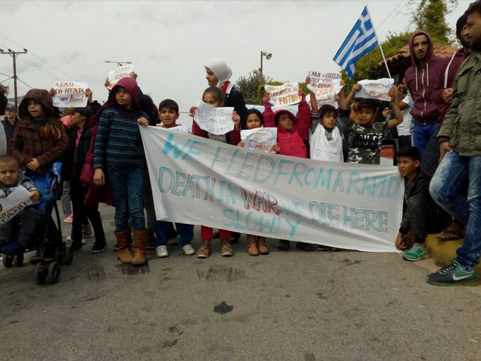

### AYS Daily Digest 25/03/2018: UN provides Russia with GPS location of hospitals in Syria

Hospital bombed days after UN provided GPS location// Thousands of Syrians flee Eastern Ghouta// Turkey announces full control of Afrin// Balkan weather report// Info from Libya// News from Greece// Italy//Germany// France

Source: Art Against — Roses will grow after all the wounds by Tamer Turkmane
### Feature

[The United Nations has come under attack](https://www.telegraph.co.uk/news/2018/03/24/un-fire-giving-russia-coordinates-syrian-hospitals-high-risk/) for providing the coordinates of hospitals in rebel\-held areas of Syria with Russia and the US\. The UN gave the GPS coordinates of hospital locations in Idlib and Eastern Ghouta as part of a new ‘notification system’ they believed would safeguard hospitals from being attacked\.

> “Syria is one of the worst wars on medical workers in recent history and part of the problem is there has been no functioning notification system to protect them\.” — Mr Egeland — UN Humanitarian Advisor on Syria 

The UN had hoped that sharing the locations would act as a deterrent, however, a hospital whose location was shared with the UN on March 12 in the region of Arbin, a neighbourhood in Easter Ghouta, was bombed by a direct air strike on March 20\.

The Syrian American Medical Society \(SAMS\), which led this new initiative and provided the UN with the hospital coordinates, is calling for accountability\.

■■■■■■■■■■■■■■ 
> **[sams_usa](https://twitter.com/sams_usa) @ Twitter Says:** 

> > In the face of ongoing violations of int'l law in Syria, SAMS shared the coordinates of our facilities w/ the UN on 3/12 after months of deliberation &amp; approval from our staff. The UN is investigating the attack on Arbin Hospital on 3/20. We expect transparency &amp; accountability. 

> **Tweeted at [2018-03-25 20:17:41](https://twitter.com/sams_usa/status/978003004883259403).** 

■■■■■■■■■■■■■■ 

According to Mr\. Egeland, the UN humanitarian adviser on Syria, in return for the UN assuring Russia that hospitals were not being used by any armed groups, Russia would in turn not target any of the medical facilities whose location has been provided\. Despite this, there was no guarantee that Russia would not share the information provided by the UN with the Syrian regime\. The Syrian regime would then be able to carry out their own airstrikes\.

In recent weeks, dozens of hospitals and medical facilities have been systematically targeted in regions of Eastern Ghouta by Russian and Syrian forces — killing many and putting the urgently needed facilities out of service\. As humanitarian facilities are regularly targeted, [MSF reports](http://www.msf.org/en/article/syria-voice-hospital-basement-east-ghouta) that many doctors — following general patterns in the area — are now forced to operate underground\.

With this knowledge as well as the well\-documented disregard of I\\international law by Syrian and Russian forces, the risk of this strategy backfiring was great, and it appears to have done just that\. It is unclear whether the March 20 airstrike was conducted by Syrian or Russian forces\.

> “They have bombed hospitals with little thought, and have always given the excuse that they were harbouring terrorists, which is untrue\.” — Hamish de Bretton\-Gordon, director of Doctors under Fire and adviser to the Union of Medical Care and Relief Organisations \(UOSSM\) 

#### Syria:

ICRC reports that after seven years of war in Syria, hundreds of thousands have been killed or injured\. There have been 6\.1 million people internally displaced\. Four out of five are living in poverty\. Thirteen million people are in need of aid\. There are 2\.9 million in hard\-to\-reach besieged areas and 1\.75 million children are out of school \.

■■■■■■■■■■■■■■ 
> **[ICRC](https://twitter.com/ICRC) @ Twitter Says:** 

> > 7 years of war in #Syria have left:

• Hundreds of thousands killed or injured

• 6.1 million displaced inside Syria

• 4 out of 5 living in poverty

• 13 million in need of aid

• 2.9 million living in hard-to-reach &amp; besieged areas

• 1.75 million children out of school 

> **Tweeted at [2018-03-25 17:25:55](https://twitter.com/icrc/status/977959776868077569).** 

■■■■■■■■■■■■■■ 

### Afrin:

According to [a Turkish army source](https://www.middleeastmonitor.com/20180325-turkey-takes-full-control-of-syrias-afrin-military-source/) , Turkey’s military and Syrian rebel allies seized full control of Afrin, and Kurdish YPG have been driven out of all villages\.
### Exodus from Ghouta

Syrians continue to be internally displaced\.

Around 7,000 people have fled from regions of Eastern Ghouta on buses into exile in Idlib — northwestern Syria\. They included fighters along with family members and other civilians who refuse return under Assad’s rule\. People fled from the towns of Zamalka, Ein, Terma, Jobar, and Arbin\.

Syrian and Russian air raids on Idlib have increased over the last week, killing dozens of people\.

[This is the largest convoy of people to leave Eastern Ghouta](https://www.almasdarnews.com/article/breaking-over-75-buses-carrying-5000-people-leaves-east-ghouta/) since agreement was reached between the Syrian Arab Army \(SAA\) and Faylaq Al\-Rahman\.

■■■■■■■■■■■■■■ 
> **[Siege Updates](https://twitter.com/SiegeUpdates) @ Twitter Says:** 

> > 2nd convoy of the people from #Arbin city in #Eastern_Ghouta left #Damascus, heading to #Qalaat_AlMadiq, then to #Idlib.
5314 people, including 15 injuries, in 84 buses &amp; 6 ambulance.

Expected arrival between 8:00-10:00 local time.

SRC: Local activists. 

> **Tweeted at [2018-03-25 23:32:51](https://twitter.com/siegeupdates/status/978052118753005568).** 

■■■■■■■■■■■■■■ 

■■■■■■■■■■■■■■ 
> **[Zaki Lababidi, MD](https://twitter.com/VPoSAC) @ Twitter Says:** 

> > First in Homs, then in Aleppo and now in Eastern Ghouta...cities where revolution thrived are now being emptied of their own inhabitants. Years of crimes against humanity with shelling, chemical weapons and besiegement...ending in forced displacement. #Syria [twitter.com/Linashamy/stat…](https://twitter.com/Linashamy/status/977194051110875136) 

> **Tweeted at [2018-03-25 23:37:36](https://twitter.com/vposac/status/978053314569945088).** 

■■■■■■■■■■■■■■ 

The Syrian Network reports that 871 civilians have been killed including 179 children in one month in Eastern Ghouta\.

■■■■■■■■■■■■■■ 
> **[Syrian Network](https://twitter.com/snhr) @ Twitter Says:** 

> > Report: 871 Civilians Killed, including 179 Children, in #EasternGhouta in a Month after SC Resolution 2401 on CoH was Adopted
Tens of Thousands Displaced and Chemical and #IncendiaryWeapons Used, Crimes against Humanity and #WarCrimes Continue
#Syria
[sn4hr.org/?p=51746](http://sn4hr.org/?p=51746) 

> **Tweeted at [2018-03-25 19:45:35](https://twitter.com/snhr/status/977994925823406080).** 

■■■■■■■■■■■■■■ 

#### Libya

Jeff Crisp \(former Head of Policy Development, UNHCR\) has tweeted that the UN visited four detention centres in Libya that were overseen by DCIM \(Department for Combating Irregular Migration\) and reported on ‘overcrowding and appalling hygiene conditions’ as well as detainees being malnourished and having very limited access to medical care\.

Further, he said that according to Amnesty, the EU is providing “technical support and assistance to the Department for Combating Illegal Migration, which runs detention centres where refugees & migrants are arbitrarily and indefinitely held and exposed to serious human rights violations including torture\.”

Despite this, the Italy\-Libya agreement has been praised for its improved handling of migration and ‘the tens of thousands of people saved at sea by the Libyan Coast Guard\.’

■■■■■■■■■■■■■■ 
> **[Italy in Libya](https://twitter.com/ItalyinLibya) @ Twitter Says:** 

> > Joint press conference by Amb. Perrone &amp; DCIM Director at #Tripoli Migrant Center w/ @[UNHCRLibya](https://twitter.com/UNHCRLibya):
The extraordinary cooperation btween #Italy &amp; #Libya resulted in improved handling of migration file &amp; tens of thousands of people saved at sea by Libyan CG. 
[facebook.com/libyancloud/po…](https://www.facebook.com/libyancloud/posts/2004730489854692) 

> **Tweeted at [2018-03-25 09:03:41](https://twitter.com/italyinlibya/status/977833388156620800).** 

■■■■■■■■■■■■■■ 

#### Balkan Weather Report for Monday, March 26
### Montenegro

Monday will be partly to fully overcast with local intermittent rain and sleet and snow in the mountains in the north during the early morning and at night\. The wind will be mostly weak to moderate from variable directions while in the south, moderate wind from the west\. The morning temperatures will range from \-3 to 9°C and the daytime highs will range from 4 to 16°C\.
### Serbia

Mostly overcast with light rain in some places\. In the lower regions of central and south Serbia the snow will continue to melt while at higher elevations there will still be light snow\. The wind will be weak to moderate from the west and southeast, during the day there may also be a shift to a northeastern wind\. The lowest temperatures will range from \-1 to 4°C and the daytime highs will range from 6 to 11°C\.
### BH

Monday in Bosnia and Herzegovina is going to be cloudy\. Snow or rain is expected in the central, eastern and southwestern parts of the country during the morning\. Snow is expected in Bosnia in some places and sleet ar higher altitudes with rain in Herzegovina\. The wind will be weak to moderate mostly from the northeast\. The morning temperatures will range from \-3 to 2°C and, in the south, from 4 to 8°C\. The daytime highs will range from 1 to 7°C and from 10 to 14°C in in the south\.
### Croatia

Most parts of Croatia will be moderately to predominantly overcast\. In Dalmatia and east Croatia there will be rain and while sun will prevail on the northern part of the coast\. The wind will be mostly weak and, weak to moderate from the northeast in the mountains\. Along the coast the wind will be moderate from several directions and the northwest, in south Dalmatia— briefly from the south\. The lowest temperatures will be from \-3 to 2°C and along the coast from 4 to 8°C\. The daytime highs will be from 7 to 12°C inland and from 11 to 15°C along the coast\.
#### Greece:
### Arrivals:

Four refugee boats arrived on the island of Lesvos yesterday\. Two in the south two in the north, carrying a total of 156 people\.
### Weather Warning Issued for Greece:

> [Greece’s National Meteorological Service has issued a weather warning](http://www.keeptalkinggreece.com/2018/03/25/weather-march26-2918-snow-sahara-dust/) of heavy rainfall and thunderstorms, hail and snow, gusting winds and a return of Sahara dust\. Some local authorities have already decided to close schools on the island of Crete\. 

> The severe weather front first affects the West of Greece as of **Sunday, 25 March 2018** , the Ionian islands and West Sterea, moving gradually into West and Central Macedonia, Thessaly, West and the North Peloponnese\. 

### Fascists Attack Refugees

After a national army parade in the morning, a group of refugees held a protest about the camps and the organisations running them, which resulted in an incident with local far\-right fascists\. Later in the day, a group of fascists with a frontman known as Marios \(well\-known in the area\) along with several drug dealers and local mafia members attacked the shelter of the refugees with bats and knives\. Due to the quick departure of the refugees and the quick arrival of police, injuries were minute\. One refugee was injured in the attack, but the injury was only superficial\.

This is not an isolated incident, No Borders has reported a number of fascist attacks over the last week in Greece\.

### **Oinofyta camp to re\-open**

There are unconfirmed reports that Oinofyta camp will reopen on 26 March 2018\. We will provide more information as it becomes available\.
### Refugees abandoned at Marathon beach hotels

It has been reported that [\#UNHCR](https://www.facebook.com/hashtag/unhcr?source=feed_text) and [\#ELEKHTIDA](https://www.facebook.com/hashtag/elekhtida?source=feed_text) and [\#Syriza](https://www.facebook.com/hashtag/syriza?source=feed_text) have been sending refugees suffering from severe sicknesses and those who are vulnerable to camps at locations far away from Athens\. This is done under the pretence of providing them with permanent homes or hotel rooms in the city\. However, metro tickets to the hospital or city centre are €9 from this location, which is unaffordable for most refugees\. Today refugees gathered at Maraton Beach Hotel to protest these transfers\.

> Today after the opposition raised by some of the [\#refugees](https://www.facebook.com/hashtag/refugees?source=feed_text) at Maraton Beach Hotel to these actions, the [\#IOM](https://www.facebook.com/hashtag/iom?source=feed_text) left all the refugees living there alone, which means they are now staying there illegally\. Among these refugees are [\#women](https://www.facebook.com/hashtag/women?source=feed_text) and [\#children](https://www.facebook.com/hashtag/children?source=feed_text) , and individuals with serious long term health problems, including paralysis — Arash Hampay 

Source: Arash Hampay

■■■■■■■■■■■■■■ 
> **[Arash Hampay](https://twitter.com/ahampay) @ Twitter Says:** 

> > Now
Hotel marathon beach , nea makry , Athens

NO MORE CAMP
#Refugeesgr #IOM #UNHCR https://t.co/PZ92NC8SFu 

> **Tweeted at [2018-03-25 10:49:55](https://twitter.com/ahampay/status/977860122432147457).** 

■■■■■■■■■■■■■■ 

### [**Hope Cafe\. Refugee Soul Food**](https://www.facebook.com/soulfoodforrefugees/?hc_ref=ART78TSigCfPzc1ZJhFYLJ4WqUBwoa0SfjqpXsoNAmdRqiWL1GWqkVyeLZwBDMdIrYI&fref=nf) **is in need of donations**

Their needs list includes: baby milk, wipes, men’s boxers, ladies’ underwear, leggings, adult diapers, wipes, soap, shampoo, baby bottles, summer clothing, food and milk\.
### Three human traffickers arrested in Greece

[A report states](http://www.ekathimerini.com/227055/article/ekathimerini/news/greece-arrests-3-traffickers-holding-21-migrants-hostage) that three Pakistani men have been arrested in Greece outside of Thessaloniki\. They are believed to have been holding 21 refugees hostage in a warehouse demanding money in order to be released\. The refugees included 13 Eritreans, seven Pakistanis and one person from Myanmar who arrived in Greece last Wednesday\. The police have stated that the traffickers were demanding 2,500 Euros \($3,090\) from each person\.
#### Italy:
### AIDA country report on Italy reports obstacles in accessing asylum procedures and lack of reception capacity

The updated AIDA [Country Report](http://www.asylumineurope.org/sites/default/files/report-download/aida_it_2017update.pdf) on Italy reveals many issues throughout 2017\. It reports serious challenges in regard to accessing the asylum procedure\.

Many cities are reported to have set specific days for seeking asylum with restrictions on number of people per given day and restrictions on specific nationalities\. In Rome and Bari it is reported that nationals of various countries who do not have a passport are denied access to asylum\. In some cities it is also reported that persons without a registered domicile are denied access to asylum\.

It has also been reported that a vast majority of asylum seekers are accommodated in temporary reception centres despite the increase in capacity of the SPRAR system\.

Destitution is highlighted as a big risk for asylum seekers and beneficiaries of international protection\. Another area of concern highlighted is the problem of age assessment which has resulted in cases of unaccompanied children being accommodated at adult reception centres\.
#### Germany
### Protest against Deportation

[A protest has been planned for Monday,](https://www.facebook.com/protestlej/posts/564300663944600) March 26, to oppose another charter flight that will deport refugees from the Leipzig/Halle airport \(LEJ\) to Afghanistan\. It will take place at 4 p\.m\. at the airport and on twitter at 2 p\.m\. with the aim of creating awareness about these deportations\.

> Deportations are all inhumane and practiced hidden from society’s eyes, where there are no witnesses\. We, the Initiativkreis Abschiebebeobachtung and Protest LEJ, call for a protest at the airport, to be present there, observe the practice, and prevent it from happening in silence by writing about it on Twitter and creating an Info\-storm about the deportations\. 

#### France:
### Number of children in detention at record high

According to [**Paris d’Exil — Collectif parisien de soutien aux exilé\.e\.s**](https://www.facebook.com/cpse75/?hc_ref=ARRnqU9Lhfn8gM4rkbLUNZde_f6y3uZ9RqmY2rGY0FaWBJRmM72MG1PahT0-f7y3Jjo&fref=nf) **,** the number of children placed in administrative detention in 2017 is: 275\. This is more than in the all the years of 2012, 2013, 2014, and 2015 together\.

> **We strive to echo correct news from the ground through collaboration and fairness\.** 

> **If there’s anything you want to share or comment, contact us through Facebook or write to: areyousyrious@gmail\.com** 

_Converted [Medium Post](https://areyousyrious.medium.com/ays-daily-digest-25-03-2018-un-provides-russia-with-gps-location-of-hospitals-in-syria-8bf7225fb20b) by [ZMediumToMarkdown](https://github.com/ZhgChgLi/ZMediumToMarkdown)._
