### AYS Daily News Digest 27/3/18: Another limbo in front of the entrance to the EU
#### Velika Kladuša: a town in Bosnia and Herzegovina bordering with Croatia \(EU\) hosts those stuck nowhere — dispersion of responsibility and lack of basic support / Ignorance and mistreatment of asylum seekers by the officials in Rome \(video\) / What follows after camp dismantling around Calais\. \.

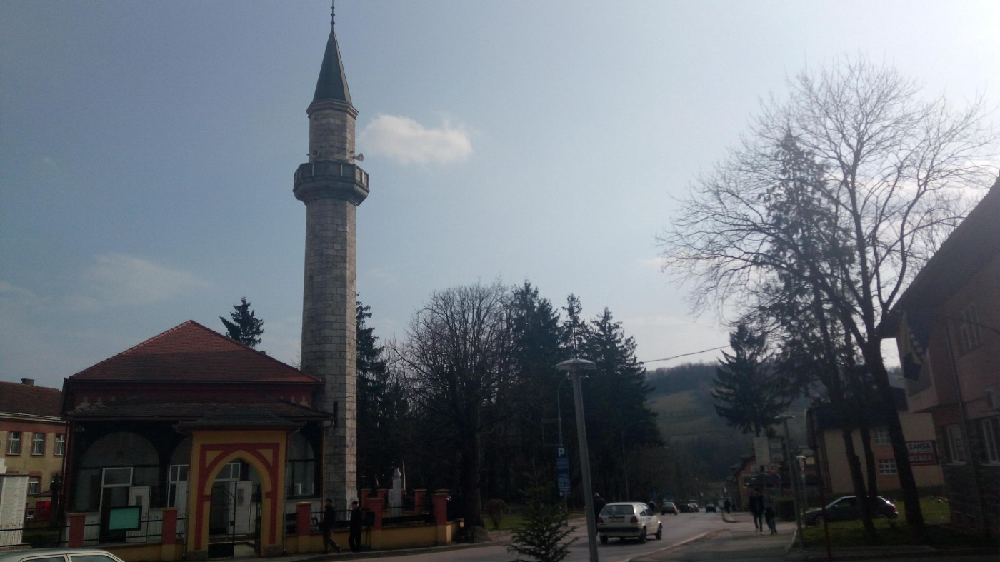

Velika Kladuša, Photo: AYS
#### FEATURE

A team of AYS volunteers has visited [Velika Kladuša](https://www.google.hr/maps/place/Velika+Kladu%C5%A1a,+Bosnia+and+Herzegovina/data=!4m2!3m1!1s0x4766ac1d62630bcf:0xba02ff189efccd5f?sa=X&ved=0ahUKEwjX1eHM0Y7aAhUniKYKHUyQAF4Q8gEI0gEwDg) in Bosnia and Herzegovina\.

At a first glance, the town seems like an average place where nothing out of the ordinary is happening and no visible presence of refugees is obvious if you simply want to drive through the town\. However, with previous information from volunteers in Sarajevo, that there are about 300 people in Velika Kladuša, with new arriving every few days, and through calls for help from some locals, we knew where to start looking\. We visited a family of Huse Karajić, man whose calls for help and story of helping has been well known to the locals and to the public\.

Still, somehow, he is left almost alone in the story of constant welcoming and helping throughout the past few months\. His restaurant was literally emptied of most tables and now serves as a place of welcome, the only home that dozens of refugees from different countries have at the moment\.

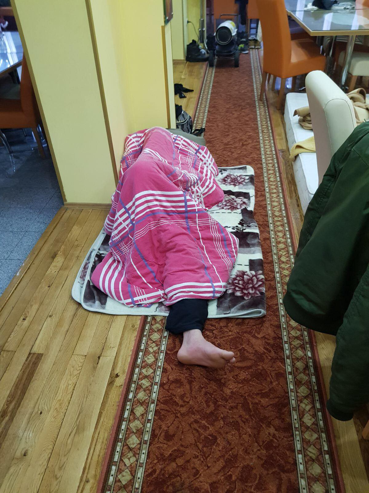

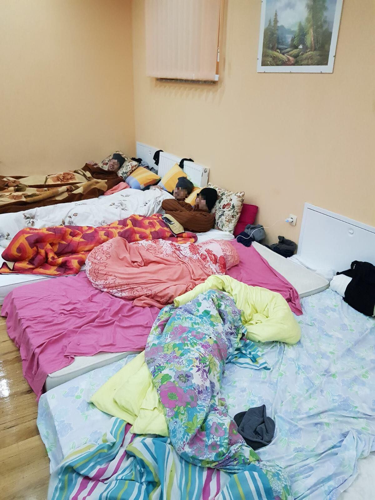

Photos: Barbara Novak

He told us of many young people who appeared in front of his doors in the middle of a winter night, asking for shelter and help, and he always said yes\.

> Refusing to take donations, he asks for help in buying groceries for some more than 20 boys living at his house at the moment\. “There were more than 40 at one point”, he adds, “but I can only continue for a little longer than two weeks — I have ran out of options, they need proper help”\. 

He says he had asked for help and support from fellow citizens, but rarely people react or jump in, with a few exceptions\.

> Although many houses are empty or for sale, although our town has a few very rich and successful businesses, they don’t want to help, and I have even been told through messages ‘You asked for it, there you have it’, he tells us\. 

He has been visited by the police and the asylum offices have told him he is into wrong activities, threatening with legal penalties, but he insists on helping people with his own money, without expecting anything in return\.

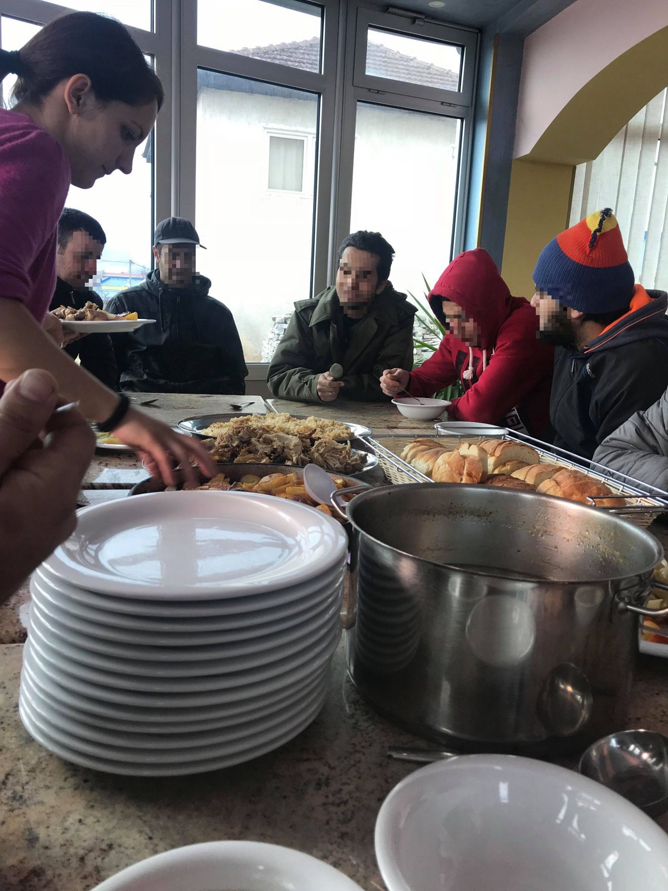

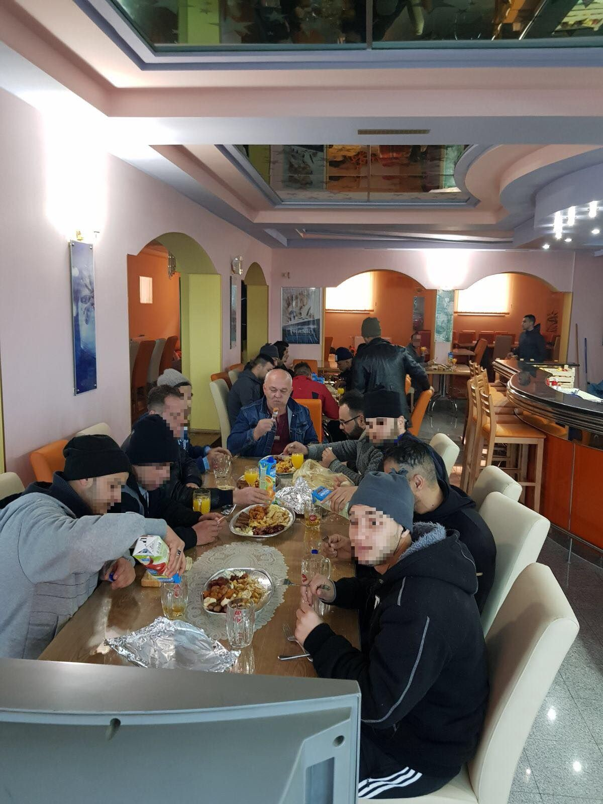

Photos: Barbara Novak

The local Islamic community seems to have also refused to join helping officially, we are told\. The imam told us in a telephone conversation that “they can enter mosque during the day to pray, like anyone else\. As far as I know, there are no families, just young boys and men who are walking around the city\. As far as I know, there is no place where they sleep\.”

He added that they have notified the police because they should be responsible for these people, but did not know of anyone in the city helping and also added:

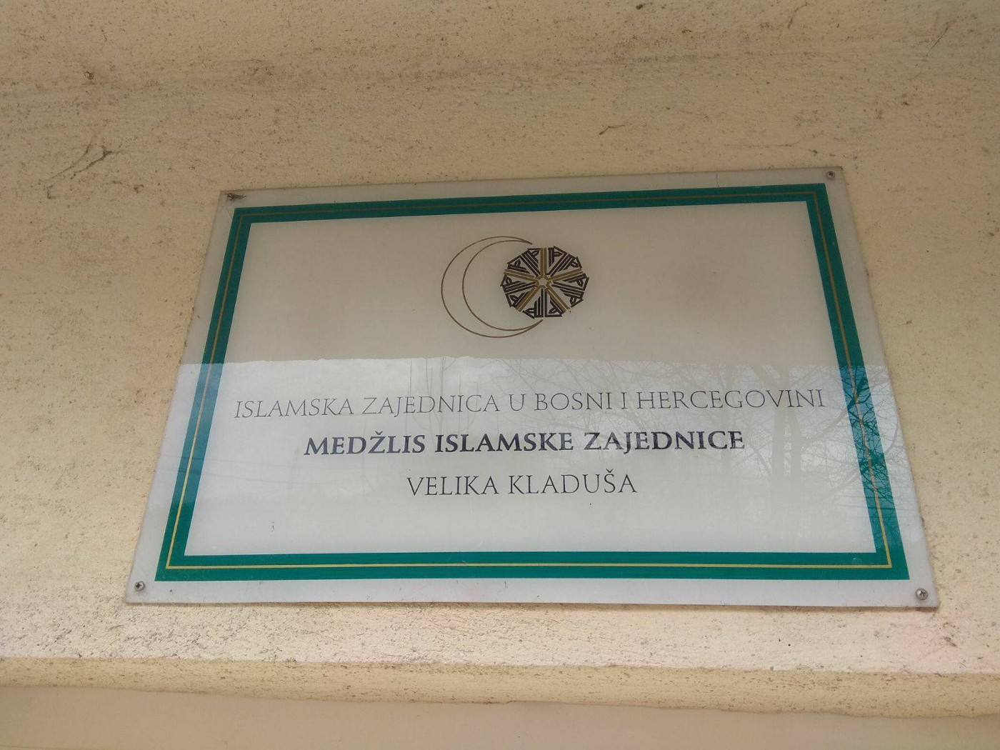

> “We have received information from our superiors, upon arrival of refugees here, that the mosques are not a suitable place for hosting refugees\.
 

> It is different when churches in Rome open their doors or a mosque takes people in somewhere else, but this agony has been ongoing for almost two months\. 
 

> We cannot take the responsibility upon us\. 

We have later visited another restaurant where the family who owns it provides some food for some of the refugees and is hosting a few in their house\. However, we were not sure if they are renting rooms or providing free accommodation in this case\. There was another similar example with 11 people hosted, where meals can be prepaid by anyone for the refugees in another local restaurant\.

**Where are the organizations and responsible officials?**

UNHCR has reportedly visited Velika Kladuša, asked around and spoke to some of the locals engaged in helping individually, who have since not heard from the organization\. We have written to the UNHCR and asked for their reports from the field and official information regarding what is being done for people in the Kladuša area and Bosnia and Herzegovina in general\. We’ll publish their response as soon as we receive it\.

To sum up the formal part of what is going on in Velika Kladuša, to our knowledge, is that there is no official accommodation provided, nor shelter to rest or hide from the rain, snow etc\. Furthermore, no food distribution is organized by any authority or organization, there is no medical care available\.
Beyond the formal framework, there are individuals opening their houses for food and shelter, but a there is a serious need for a reliable and experienced team of volunteers who could provide support for a considerable time and have good working system and a budget to do it\.

The young people from Palestine, Algeria, Syria, Morocco and other countries find different ways to try head towards the Croatian territory and proceed to Europe\. During our visit there was a group that tried to leave on a bus, through a desperate move: attached to the bottom side\. They were prevented to do that by the police\. The police presence is very strong in the town, both in cars, but also through special teams that check people in the city\.

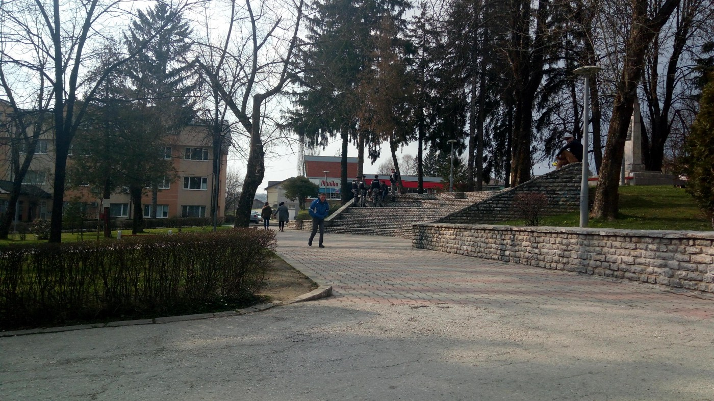

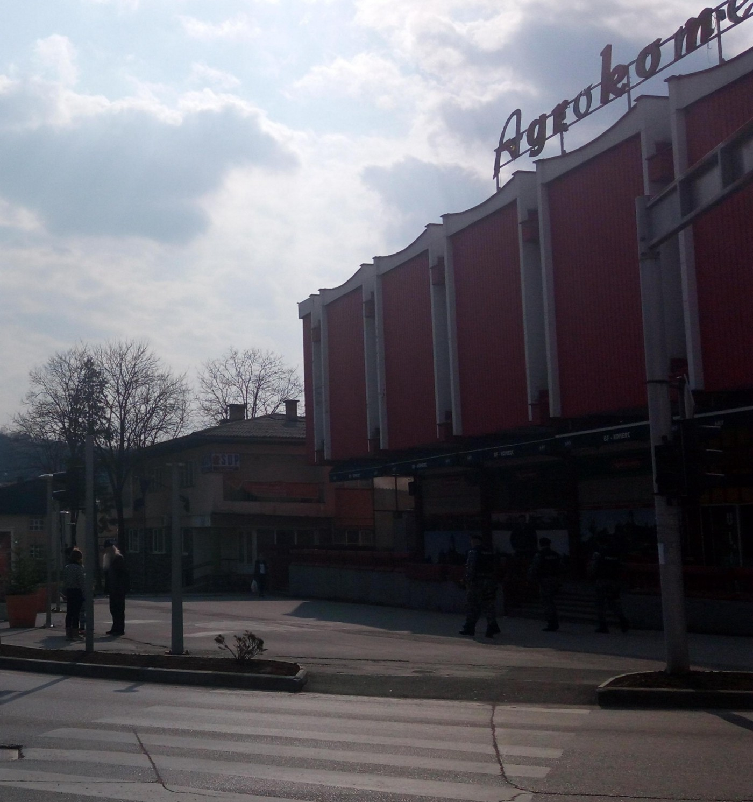

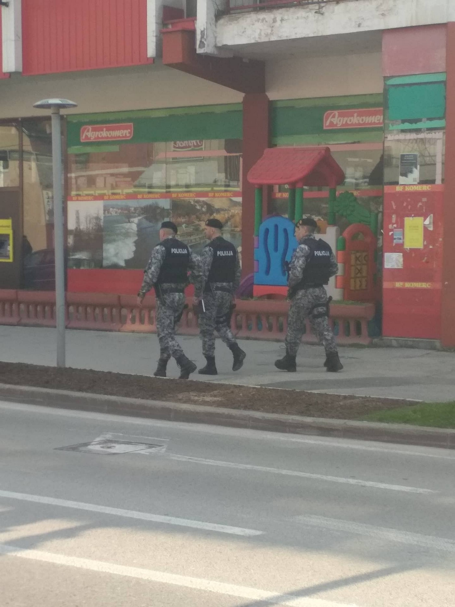

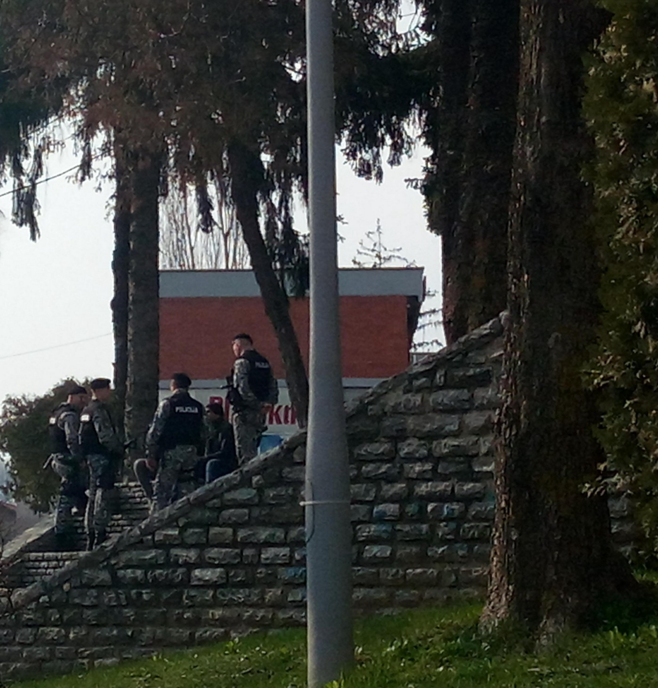

Photos: AYS

Velika Kladuša has for a while been a point of no return to many refugees trying to cross to the European Union’s border country, Croatia, in order to continue their travel towards western countries, where they might have a better chance of asking for international protection, each for their own reasons\. Most of them have previously passed through Sarajevo and, with no system that could uphold such a number of people, no legal pathway and many previous pushbacks by the Croatian police, they have moved on towards Kladuša and many have since been to Croatian cities Zagreb, Split, Karlovac and reportedly, even Rijeka, but were taken back to the border area and forced to walk back to Bosnia and Herzegovina\.

**Most of them have said their belongings were taken away from them by the police, mobile phones confiscated or crushed and at this point most of them are literally — without anything\.**

Those who still hold on to a part of what they have are lured into insanely expensive smuggling routes, for example: from Kladuša \(cca 1,5h by car from Zagreb\) they ask 800 euro to a nearby Croatian town and from there more than a thousand more euros to reach Zagreb\. Desperation grows among the refugees around the hills and parking lots, empty houses and squats and and the few people actively engaged can’t bear the burden of welcoming that the officials are refusing to deal with\.

We hope the UNHCR, Red Cross and other “to whom it may concern” organizations will soon prove us wrong in thinking that at the end of the day people keep relying on the kindness of strangers and not the organizations formed to help in this particular situation\.

We hope that the UN will bear in mind their previous level of success in the same area and do better this time\.

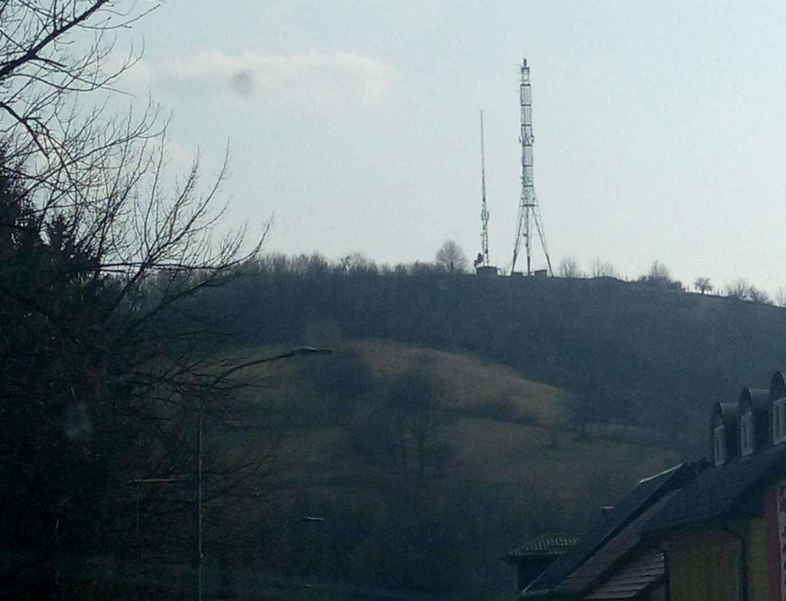

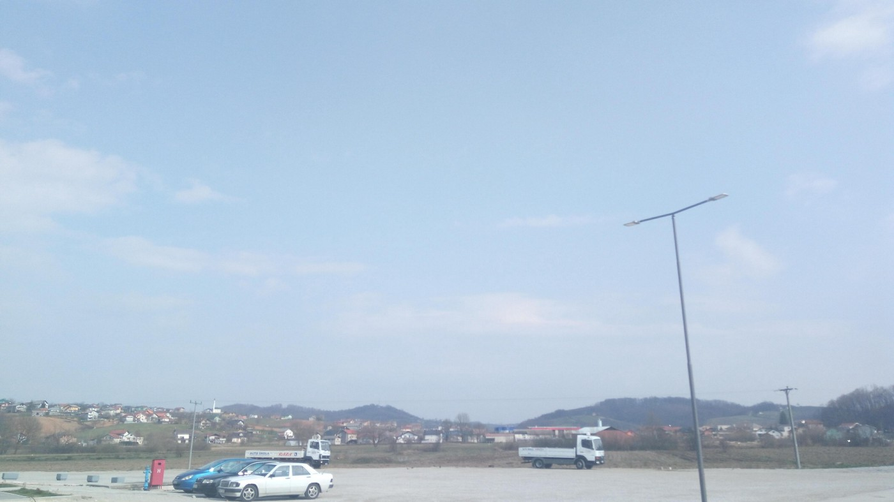

Photos: AYS
#### GREECE

![4 days ago, the Alarm Phone was alerted to a group of travelers, including 1 child, trying to cross the Greek\-Turkish land border\. They were trapped on a small islet in the river Maritsa\. The islet was shrinking due to rising water levels\. We informed the Turkish and Greek authorities and followed up on the case for 2 days\. The Greek police informed us yesterday morning that the group was rescued to Greece and detained at a detention center in the south east\. We still don’t have a confirmation from the group\. If what the Greek police says is true, we demand their immediate release from detention and wish them the very best for their onward journey\. — [**Watch The Med — Alarmphone**](https://www.facebook.com/watchthemed.alarmphone/)](assets/830fa3dc0d76/1*Qu11Cxw8VXGmuEbuivYKJA.png)

4 days ago, the Alarm Phone was alerted to a group of travelers, including 1 child, trying to cross the Greek\-Turkish land border\. They were trapped on a small islet in the river Maritsa\. The islet was shrinking due to rising water levels\. We informed the Turkish and Greek authorities and followed up on the case for 2 days\. The Greek police informed us yesterday morning that the group was rescued to Greece and detained at a detention center in the south east\. We still don’t have a confirmation from the group\. If what the Greek police says is true, we demand their immediate release from detention and wish them the very best for their onward journey\. — [**Watch The Med — Alarmphone**](https://www.facebook.com/watchthemed.alarmphone/)
#### Arrivals

73 newly arrived people on Leros were documented by the Leros solidarity network\.

**Lesvos** — 3 boats arrived late in the evening on Tuesday, March 27, the first boat landed in Pirgi Thermis, Lesvos east, carrying 7 people on board\. 
The second boat was picked up outside Tarti, Lesvos south, carrying
50 people\. The third boat was picked up outside the airport, Lesvos south, according to [Aegean Boat Report](https://www.facebook.com/AegeanBoatReport/?hc_ref=ARTHT9gqtH2BW-OUi6zHryYZEGFa__ZXFScwOWehfbCI4l3YKvT4uYd6oxQ8GmW6FrY) , who will provide further updates and details\.

[**Mobile Info Team for refugees in Greece**](https://www.facebook.com/mobileinfoteam/?hc_ref=ARRZYAGpFOokFtAlYh_PrzmHprDG_5xlJG53nPOvLFxHw9brOmIAwLWsHeBSjP5eaTQ&fref=nf) **sent out some new information regarding the full registration process on the Greek mainland:**

“The full registration is the appointment you get after you got pre\-registered on Skype\. Its purpose is to register your asylum or family reunification claim and to get basic information about you and your case\. It is very important that you go to this appointment and bring your pre\-registration white cards with you\. If you fail to do go on the day of the appointment or bring your pre\-registration white card, you will have to restart the procedure and call Skype again\.

If you have close family members in another European country, bring as much information about them as possible, like for example pictures of their asylum seeker cards or residence permit, their phone number and address\. You might be eligible for family reunification\. Also bring all documents to identify yourself and your family members that are with you in Greece like passports, marriage or birth certificates and family books\. Be prepared to answer questions about when you left your country of origin and when and how you came to Greece\. Also they will require a short answer on why you were fleeing your home country\.

It is also important that you are able to answer questions about where and when you were born, how old your children are or when you were married\. 
This is especially important, when you don’t have documents proving your identity and family situation\.”
### Oinofyta — updates

Updates coming from the [volunteers](https://www.facebook.com/lisa.campbell.5099?hc_ref=ARSI5udXU2dXw1ZoSnUaeQAsfOE7FNZ5EIBwkmWBafZG9W0bp112jctSXyxiPMv4QfY&fref=nf&hc_location=group) previously active in the camp:

> _The camp is a “transitional” camp\. This means that the residents are waiting for housing from UNHCR\. They are only expected to be there for around a month or so\._ 
 

> _No organization has officially been named as the Site Management Support team — yet, but IOM are there placing the new residents\. They all came from a hotel in Athens\. Not a squat or an island\._ 
 

> _Currently there are no real support services because there isn’t an official SMS team\. There is supposed to be a doctor available from the military, but it’s not clear how many days or hours this will happen\._ 
 

> _As of right now, there is catering coming in\._ 
 

> _There are children, but no provisions for schooling\._ 
 

> _Any organizations wishing to work in the camp will need permission from the Ministry of Migration\._ 
 

> _Do Your Part has provided some toys and art supplies for the children as well as some pampers and baby beds\._ 
 

> _I took several new residents on a brief tour of the town and showed them where the train station is\._ 
 

> _We will be watching the progress\._ 

Another comment from the same source later on Tuesday says:

> Contrary to what was printed in the Greek news last night, there was no massive riot and burning of the camp at Oinofyta\. There were several people who decided it would be a good idea to throw rocks at IOM as they were trying to register them\. This caused IOM to vacate the premises per their standard operating procedures\. 

> Tensions were still high this morning\. Today we went to the camp and we assisted with food distribution since there was no organization there and the Hellenic Air Force would not participate\. 
 

> We spent time talking to people and when we left the camp at about 9 o’clock tonight things were calm, the residents were cleaning the place up and had committed to giving it some time before they get so frustrated again\. 
 

> In reality it was only a few people who caused most of the problems\. This has been the case in most of the camps for the last two years here\. 

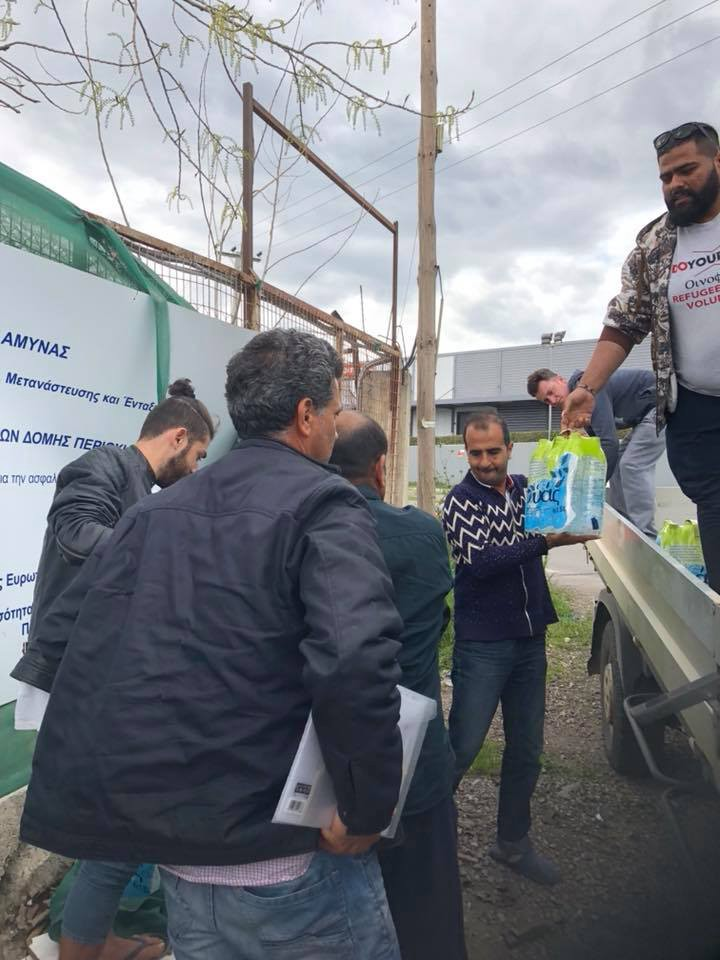

 \)](assets/830fa3dc0d76/1*0r0taVaCpwh65GpxVeZWsQ.jpeg)

Food distribution \(Photos: [Lisa Campbell](https://www.facebook.com/lisa.campbell.5099) \)

City Plaza has released a [solidarity statement in support of the Moria 35](https://www.facebook.com/sol2refugeesen/posts/1841564609469207?hc_location=ufi) \.
The trial date was also published\.

> “City Plaza stands in solidarity with refugees of the Moria 35, the Petrou Ralli 8 and all the refugees fighting for their rights\!
 

> We call the solidarity collectives in Greece and in Europe to stand with refugees of these two important trials, on 20/04 in Chios and 27/04 in Athens\.” 

#### BOSNIA AND HERZEGOVINA
### Sarajevo

Over 200 people are currently without accommodation in Sarajevo, or with temporary accommodation in local hostels\. Those who are in hostels are often not provided by enough food, and citizens of Sarajevo together with a group of international volunteers are distributing food at several points across the city\.

People are coming to every day and help is needed\. Clothes, shoes, medical supplies… If you can help, please donate or get in touch with local charity pomozi\.ba\.

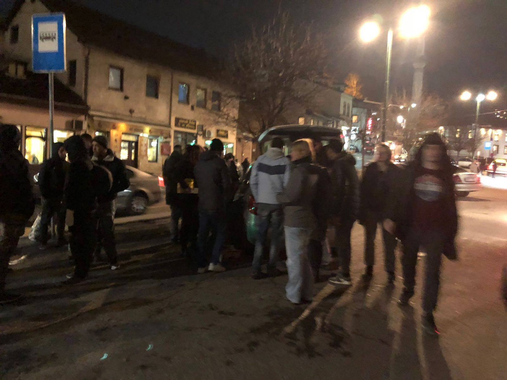

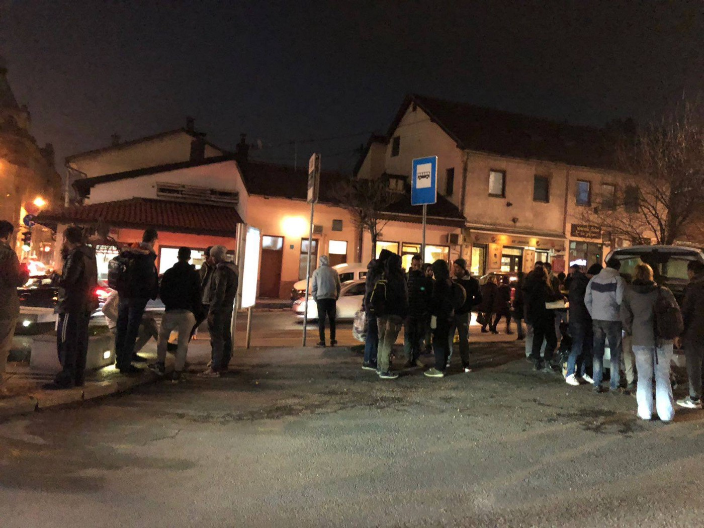

Photos: AYS
#### ITALY

Long night\-time files, illegitimate requests posed to people in order to apply for political asylum and to renew residence permits, discretion and negligence, clear and prolonged violation of human and international rights\.
This is the practice of the Immigration Office of the Rome Police Headquarters that produces serious injustices, [Baobab Experience](https://www.facebook.com/BaobabExperience/?hc_ref=ART4oc2Tb_YXCDGMA1TEWD-oqLi5WQwsQHEcB0Emwz4QZlcVx1uG_qAwVN-IwRwE-Uw&fref=nf) volunteers report\.

This video made by Baobab Experience with the collaboration of the Legal Network Migrants in Transit\.
The intent was to try to tell what happens in via Teofilo Patini, in front and under the gates of the offices of the state police\.

Please, take time to read their official statement [**here**](https://baobabexperience.org/2018/03/27/comunicato-stampa-questura-aperta/) \.
#### FRANCE
### Calais — Dismantlement of a camp

On Friday, [the police came to dismantle the camp](http://www.lavoixdunord.fr/308957/article/2018-02-01/important-dispositif-de-police-pour-demanteler-un-camp-de-migrants-ce-jeudi) situated in the woods close to the streets Gravelines and rue des Vérrotières\.
Around 100 policemen who arrived repotedly didn’t apply any expulsion procedure, but the people were not informed about the action prior to that\.

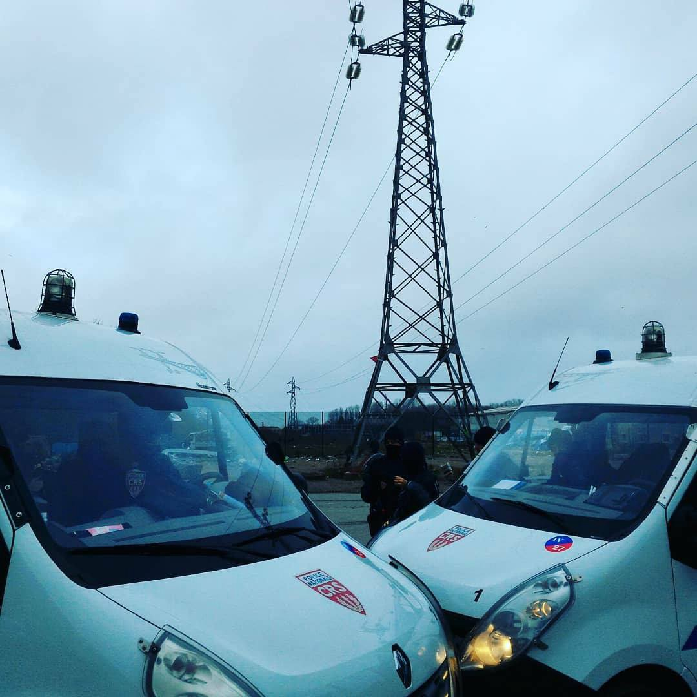

](assets/830fa3dc0d76/1*8E3VhZ3FB9HCNP5Jc74HPw.jpeg)

Photos: [**L’Auberge des Migrants**](https://www.facebook.com/AubergeMigrants/)

The volunteers send out a clear vision of the repercussions to such actions:

> Some of them went to take the breakfast offered by the State, a few hundred meters away\. When they came back, they were faced with a row of police officers, unable to recover their shelter or personal belongings\.
 

> Expelling during the meal distribution is forcing people to make a choice: having an empty stomach or sleeping in the woods\. 

> The destruction of tents by temperatures of a few degrees represents a heavy violence for those who are in the rain day and night\. It pushes people to take more risks to get to Britain as quickly as possible\. 

#### SPAIN

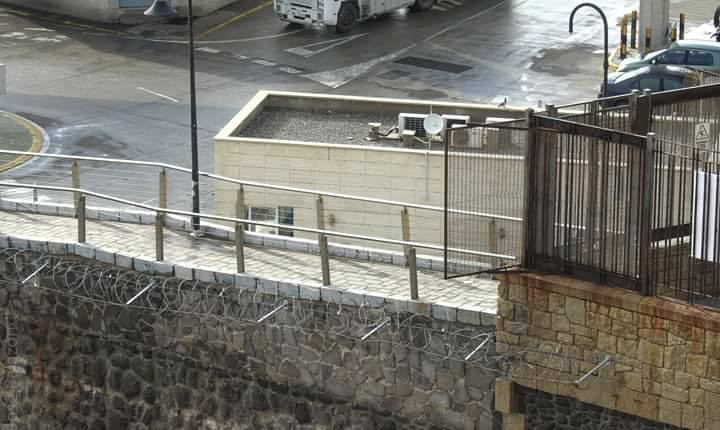

](assets/830fa3dc0d76/1*5pHLvW_m1rsOPng5I8F-Ow.jpeg)

Photos: José Palazón, source: [**Association Marocaine des Droits Humains — Section Nador**](https://www.facebook.com/AmdhNador/?hc_ref=ARQx6QxUNpVjzCGLpaD9qEu27a0iVK8GG1KZYeioUZtUOQ6HpJ_vJ_0lWmVFybVf0bg)

“The authorities in Melila spent 6000\.000 to install razor blades and grillages around the port of Melilla, so that minors can access them\. When it comes to building walls, the money of the Spanish and European taxpayer is easily mobilized and when it comes to children who want to go to school, the authorities in Melilla do not mobilize\.”

**We strive to echo correct news from the ground through collaboration and fairness\.**

**Every effort has been made to credit organizations and individuals with regard to the supply of information, video, and photo material \(in cases where the source wanted to be accredited\) \. Please notify us regarding corrections\.**

**If there’s anything you want to share or comment, contact us through Facebook or write to: areyousyrious@gmail\.com**

_Converted [Medium Post](https://medium.com/are-you-syrious/ays-daily-news-digest-27-3-18-another-limbo-in-front-of-the-entrance-to-the-eu-830fa3dc0d76) by [ZMediumToMarkdown](https://github.com/ZhgChgLi/ZMediumToMarkdown)._
