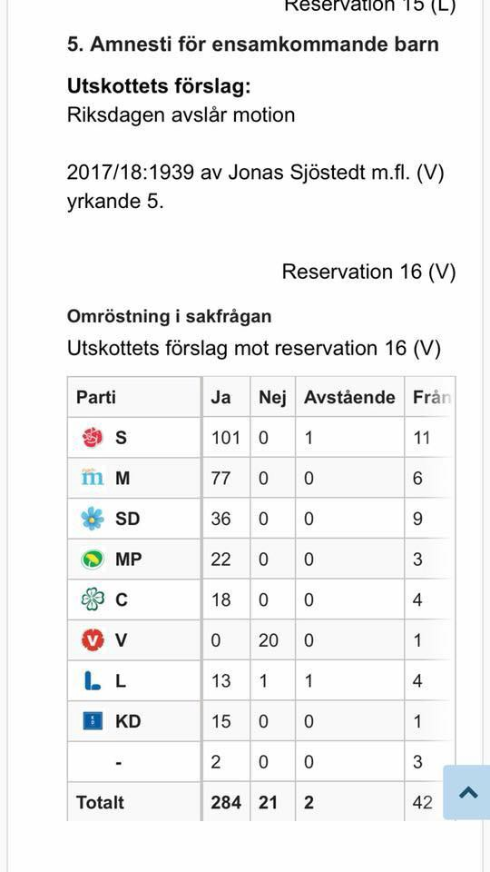

### AYS Daily Digest 28/03/18 / IOM and UNODC will co\-operate to “counter migrant smuggling”

> 325 people arrived in Greece between Tuesday and Wednesday / Iuventa still impounded / Italian photojournalist remains innocent and locked up in Serbian jail / Donations needed in Belgrade / First sunny day in Bosnia for a long time / A kitchen will soon be ready in Sarajevo / A first no to a more humane law for minors in Sweden / French authorities are literally stealing tents and providing food at the same time / And more news from the field\. \. \! 

](assets/2cdad83cb84d/1*-Og9j-Y28NBHgJTTntSY9w.jpeg)

Let’s do as the girl above\. Safe paths now\. Image: [**Hani abbas cartoo**](https://www.facebook.com/Hani-abbas-cartoon-387757854589751/?hc_ref=ARQQVRkBnVCrun7-lWUc-uD2qkWssDc7J9ldJUbHxWTCq8W-d0DM2AkpyVF-KZ5Ow6I&fref=nf)
#### Feature

In order to counter migrant smuggling the _International Organization for Migration \(IOM\)_ and the _United Nations Office on Drugs and Crime \(UNODC\)_ , have today announced a new co\-operation between the two bodies — the Joint Platform on Countering Migrant Smuggling\. The Executive Director of _UNODC_ , Yury Fedotow, opened the event in Vienna by saying:

> “We must work together to deny criminals the means and opportunity, to protect the lives and safety of people, and end the impunity of smugglers\.” 

He is welcoming this new collaboration, and in the press\-release it says that:

> “Promoting and facilitating orderly, safe, regular and responsible migration as stated in Sustainable Development Goal \(SDG\) 10 is essential for saving lives, promoting regular and orderly migration, putting migrant smugglers out of business and leading to inclusive development\.” 

On the other hand we are welcoming all initiatives to create safe routes\. This can be humanitarian corridors that remain open and avoid the creation of bottlenecks, quota systems or some other solution\. But by eliminating the only alternative people have \(how dangerous, potentially abusive and expensive it may be\) without offering better ways to safety, no one will become more included or safe\. “Regular and orderly”, as written in the press release from IOM and UNODC is not a way that the European asylum politics has worked for at least two\-three years, more like “unjust and exclusive”\. Nothing was mentioned about his by either Yury Fedotow or anyone else quoted in the press release\.

Maybe someone will be able to clap another’s shoulder in a conference room, imagining they are defeating the smugglers\. Then they will sit down at their desks and write a similar report like this one, but with the results\. And we will be able to read the results\.

At the same time, another smuggler will get in touch with another desperate refugee on the other side of the Black Sea, the Mediterranean, in Port Patras, in Belgrade or Sid in Serbia, Calais or elsewhere\. By the time the smuggler is behind bars in a jail somewhere, will they then have a hot meal, a warm bed and a safe place to stay? Or will they still be in transit, waiting for something to happen?

Dear _IOM_ and _UNODC_ , the only way to really “counter migrant smuggling” is to offer those people who have no alternatives better alternatives\. Otherwise, they will continue trying in any way they can\. Your methods of trying to save lives by catching the “bad guys” \(who in some cases for sure also have saved lives, as it is more complicated than black and white\) will not offer a definitive end to migrant smuggling\.

Despite that we’re looking forward to reading _the Global Study on the Smuggling of Migrants_ that _UNODC_ will publish during 2018\. Even though we may not agree on the suggested solutions since they all too often doesn’t ask the right questions: who will this really benefit?
#### Sea

Skipper and machinist wanted at [**Sea\-Eye**](https://www.facebook.com/seaeyeorg/?hc_ref=ARSXeBb1w5UH6CXq-mRNkIBWJlElZ6KUFfUOuAeZf4V9wkBgyPCXmT0XflOtcHwR89o&fref=nf) and **Seafuchs\.** [Get in touch with them here if you are available and have the skills\.](https://www.facebook.com/seaeyeorg/posts/1376241022481791?hc_location=ufi) [Here is](https://sea-eye.org/werde-mitglied-unserer-crew-auf-see/) also their webpage in German\.

Photo: Sea\-Eye

177 and 106 people were found drifting in a number of boats yesterday were rescued by Salvamento Maritimo\. For more information, go to [their twitter](http://SALVAMENTO MARÍTIMO ‏ Verified account   @salvamentogob) account for the latest updates\.

■■■■■■■■■■■■■■ 
> **[SALVAMENTO MARÍTIMO](https://twitter.com/salvamentogob) @ Twitter Says:** 

> > MRCC Rabat informa que la Royal Navy marroquí rescató hoy 9 pateras con 177 personas https://t.co/4lDC2cCg3D 

> **Tweeted at [2018-03-28 17:14:24](https://twitter.com/salvamentogob/status/979044044994240513).** 

■■■■■■■■■■■■■■ 

■■■■■■■■■■■■■■ 
> **[SALVAMENTO MARÍTIMO](https://twitter.com/salvamentogob) @ Twitter Says:** 

> > Imagenes de la Guardamar Polimnia, que se dirige a Motril con 106 personas rescatadas de 3 pateras en el Mar de Alboran https://t.co/lzdlcxJcaZ 

> **Tweeted at [2018-03-28 19:17:49](https://twitter.com/salvamentogob/status/979075103089668098).** 

■■■■■■■■■■■■■■ 

#### Greece
#### Mainland

**Islands**

[The night](https://www.facebook.com/pikpalesvos/photos/a.1650078085267616.1073741830.1650025878606170/2060070370935050/?type=3&theater) into Wednesday the 28th of March, 325 people arrived to Lesvos in eight different rubber boats\. [Aegean Boat Report](https://www.facebook.com/AegeanBoatReport/posts/324929701363474) provided more details about the different boats\. In one boat, 32 children were among the rescued\. Several of the other boats also had children onboard\. _It is_ w _orth noting that there haven’t been this many arrivals in one day since 2016\._

](assets/2cdad83cb84d/1*s5aS3R13uhm4gr-Qe4aK5g.jpeg)

Photo: [**Lesvos Solidarity — Pikpa**](https://www.facebook.com/pikpalesvos/?hc_ref=ARQMMwFT5Nlil2g4sSXwqLXWvMWtnl5gqMRnCIwiufTAIC4dTzQfldkDUsRENhIc2bU&fref=nf)

 \(two photographers covering the refugee situation\) was at Lesvos, they wondered where the 6 billion euro from the EU\-Turkey deal is going\. The photo on the photo shows a video from a refugees crossing\. They were told many dreadful stories about the living conditions in Turkey\. Photo: [**1976km**](https://www.facebook.com/1976km/?hc_ref=ARRvjsc36PZ7gKjJTJ177TxQ5ngEmZptIc-8Ry1fOZE9KVYZ20sxh72B9NKDWxNia7g&fref=nf)](assets/2cdad83cb84d/1*G2_7pp00VGEFSlEmtPiZog.jpeg)

When [**1976km**](https://www.facebook.com/1976km/?hc_ref=ARRvjsc36PZ7gKjJTJ177TxQ5ngEmZptIc-8Ry1fOZE9KVYZ20sxh72B9NKDWxNia7g&fref=nf) \(two photographers covering the refugee situation\) was at Lesvos, they wondered where the 6 billion euro from the EU\-Turkey deal is going\. The photo on the photo shows a video from a refugees crossing\. They were told many dreadful stories about the living conditions in Turkey\. Photo: [**1976km**](https://www.facebook.com/1976km/?hc_ref=ARRvjsc36PZ7gKjJTJ177TxQ5ngEmZptIc-8Ry1fOZE9KVYZ20sxh72B9NKDWxNia7g&fref=nf)

The authorities on Levsos were on high alert after the spike in arrivals, [Ekathimerini reports\.](http://www.ekathimerini.com/.../lesvos-authorities-on...)

](assets/2cdad83cb84d/1*af_K4CBk_nSv7JIrf0HA1Q.jpeg)

Photo: [**ERCI — Emergency Response Centre International**](https://www.facebook.com/ercintl/?hc_ref=ARSlQYv4iidipSubrMhiMIiRsakywrW6qZjv8VChreKFBqH3qqhZB5L6k-u5my_sVKw&fref=nf)

Later on Wednesday more boats arrived, [read the Aegean Boat report with an update\.](https://www.facebook.com/AegeanBoatReport/posts/325268877996223)
#### Bosnia

The situation remains as described in yesterday’s feature\. Volunteers on site reposted some of the info and added some photos and a video\. The sun was shining today\. A kitchen is also taking shape as we speak\.

#### Serbia

In February the NGO Praxis didn’t meet more than 125 people on a daily basis when they were out on rounds in Serbia\. They also counted 425 newly arrived people, of whom 279 were men, 49 women and 100 children\.

[More info here\.](https://www.praxis.org.rs/index.php/en/praxis-in-action/migration/item/1315-praxis-has-published-protection-monitoring-report-on-migration-for-february-2018)

**The Workshop needs future funding**

NorthStar, in collaboration with [The Workshop: Belgrad](https://www.facebook.com/theworkshopbelgrade/?fref=mentions) e, have recently started a fundraiser in order to secure their activities for the next year\. Click [here](https://www.gofundme.com/educating-refugees-at-the-workshop) to help\. Watch the video to learn more about their daily educational program\.

**Italian journalist is still in jail**

The jailed photo\-journalist Mauro Donato is still detained, falsely accused of robbing and stabbing three refugees who have said that he wasn’t the perpetrator\. On the other hand, they said that they appreciated his job as a journalist to document the living standards and everyday life in the Serbian border town Sid\.

Donato will remain in jail until at least Friday, according to information received by AYS\.
#### Hungary

Victor Orban, Hungary’s far right Prime Minister, [has now implemented his toxic ideas not only in the public society and media](https://archive.li/1qEJv) , but also in the school books\. In the latest edition of the 8th grade history textbook the following is found on page 155:

> “It can be problematic,” the book concludes, “for different cultures to coexist\.” 

The book describes not only that Orban thinks refugees are a threat to the Hungarian society, it also encourages them to think likewise\.

This kind of xenophobic state propaganda is not something that belongs in Europe in 2018\. It is based on selfish and unfounded fear\.
#### France

Between the 5th of February and 5th of March, Paris d’Exil was able to shelter 15 additional unaccompanied minors waiting to appeal the decision to not be recognized as minors\. Around 50 other minors are hosted within its network\.

For those looking to host, Paris d’Exil organizes a meeting every Saturday at 17h at the café Fluctuat Nec Mergitur, place de la République\.

**Literally “destroying tents while providing food”**

[Last Friday we wrote](ays-daily-digest-23-03-2018-state-destroys-tents-while-providing-food-e58c01a2e321) about how the authorities are destroying tents while providing food\. An outrageous hypocrisy — people can eat, but not sleep\. Where is the logic in this treatment?

AYS can add that L’Auberge des Migrants said that these things are taking place at exactly the same time, as the dismantlement of the camp rue des Vérrotières took place at the same moment as the breakfast distribution\. The refugees were not informed and when they came back from breakfast were not able to get their personal belongings\.

And why was it so many refugees who didn’t go to the first state\-run distributions, people asked? This is a clear indicator\. People who’s trust in authorities already is low due to the circumstances many of them fled before coming to Europe, are once again screwed over\. It’s not strange that for many when they finally enter the country they want to claim asylum in, are skeptical towards the state, police, and procedures they have to go through\. A lot of people remain hidden instead of risking contact with the police\.

> This situation force people to choose between food and shelter\. Both are apparently too much to ask for\. 

[**Utopia 56**](https://www.facebook.com/asso.utopia56/?hc_ref=ARQjxeQ9b301aUa31vDgEiw92vbOOx_Ephm_KloOQkyNO7Tjb2a4ba0sH4L5eYQG6Jk&fref=nf) [is asking for donations](https://www.facebook.com/asso.utopia56/photos/a.1086224878075970.1073741829.1059730054058786/1847527268612390/?type=3&theater) to the project Tours, run by their volunteers\. Tours will help shelter and school unaccompanied minors\. Today, half of the children they are helping attend school\.

[Follow this link to donate and for more information\.](http://www.utopia56.com/fr)

](assets/2cdad83cb84d/1*Hl3ntlaAllKnOJamGjAr6g.jpeg)

The Tours\-team, who helps to house and provide education\. Photo: [**Utopia 56**](https://www.facebook.com/asso.utopia56/?hc_ref=ARQjxeQ9b301aUa31vDgEiw92vbOOx_Ephm_KloOQkyNO7Tjb2a4ba0sH4L5eYQG6Jk&fref=nf)
#### Sweden

Today in the Swedish parliament there was the first vote regarding the suggested new extended “high school law”, which would allow up to 9000 more young people to stay in the country\. But, unfortunately, the left wing party and its partners didn’t win\. Lagrådet, a group of lawyers connected to the parliament with influence but not a final say, said that the suggested law isn’t good\. What they based this on, we don’t know\. With the new law, the criticised and unreliable medical age exams would lose some power over young people lives\. They would no longer need to “prove” themselves to be under 18, in case the exam says different\. More people could finish high school in peace\.

[**Christina Höj Larsen**](https://www.facebook.com/christina.hoj.larsen?hc_ref=ARTCWdJylNKOUSjL7jsN5niU8phFyTzv4WQ3q9q8ubMrln2pJb8XWT9iISCAn2uUL7k&fref=nf) from the left wing party wrote this on her Facebook after the voting was done:

> We did not win the amnesty vote today\. But we won’t give up\. We will continue to insist on defending everybodys human worth\. Today, it is about single\-parent’s opportunity to stay, breathe out and build their life safely\. Tomorrow we can talk about some of us\. 

> We know that sometimes it takes time\. But we also know that we will win in the end\. Because we need each other\. 

> In today’s vote, twenty left\-wingers and a Liberal voted for amnesty\. A Social Democrat and another Liberal resigned\. 

This fall it will be general elections\. Hopefully, the human side will be able to declare themselves winners\. It’s a small country, but due to a big influx of refugees — a lot of people’s wellbeing depends on the outcome of the elections in September\.

The voting is explained, party by party \(ja = yes, nej = no, avstående = resigned\) \. Photo: Christina Höj Larsen

On the 21st of April it’s time for the yearly “Cultural night” in Stockholm, where different cultural institutions, cinemas and several other relevant places and institutions will be open during the night time\. Refugees Welcome Stockholm will host an event during the evening, it’s free and open for everyone\. There will, among a lot of other activities, be disco\-dabke\-dance to Middle Eastern music, a language cafe with the possibility to practice both Swedish and other languages, a pop\-up library and much more\.

The event [can be found here\.](https://www.facebook.com/events/486373735098745/)

**We strive to echo correct news from the ground through collaboration and fairness\.**

**Every effort has been made to credit organizations and individuals with regard to the supply of information, video, and photo material \(in cases where the source wanted to be accredited\) \. Please notify us regarding corrections\.**

**If there’s anything you want to share or comment, contact us through Facebook or write to: areyousyrious@gmail\.com**

_Converted [Medium Post](https://medium.com/are-you-syrious/ays-daily-digest-28-03-18-iom-and-unodc-will-cooperate-to-counter-migrant-smuggling-2cdad83cb84d) by [ZMediumToMarkdown](https://github.com/ZhgChgLi/ZMediumToMarkdown)._
